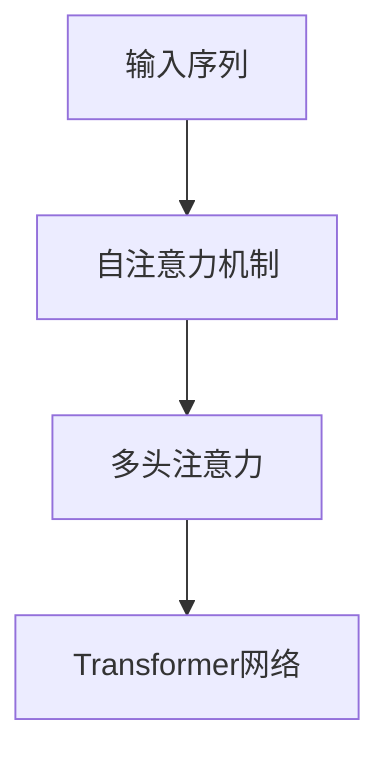

                 

# 自注意力机制的详细工作原理

> 关键词：自注意力机制,Transformer,注意力机制,多头注意力,注意力权重,加权求和,Softmax,Attention,Transformer网络

## 1. 背景介绍

自注意力机制（Self-Attention Mechanism）是大语言模型（Large Language Models, LLMs）中最为核心和基础的组件之一。Transformer网络就是以自注意力机制为核心的深度学习模型，自发布以来在自然语言处理（Natural Language Processing, NLP）领域取得了革命性的突破，成为处理序列数据的标准架构。自注意力机制通过引入注意力机制，使得模型能够在输入序列中自动关注关键信息，提升模型的表达能力和泛化能力。本文将详细介绍自注意力机制的工作原理，并通过一系列详细的步骤和数学公式，深入浅出地揭示其核心思想和实现细节。

## 2. 核心概念与联系

### 2.1 核心概念概述

为了更好地理解自注意力机制，我们首先介绍几个关键概念：

- **自注意力机制（Self-Attention Mechanism）**：一种基于注意力机制的处理序列数据的算法，能够自动关注输入序列中对当前位置有用的信息。
- **多头注意力（Multi-Head Attention）**：将一个大的自注意力层分成多个并行的小层，每个小层计算不同表示向量的注意力权重，能够从不同角度理解输入序列。
- **注意力权重（Attention Weight）**：表示不同位置信息对当前位置的贡献程度，通过Softmax函数计算得到。
- **加权求和（Weighted Sum）**：将注意力权重和各个位置的信息加权求和，生成新的向量表示。
- **Transformer网络**：一种基于自注意力机制的深度学习架构，能够高效处理序列数据，广泛应用于自然语言处理、计算机视觉等领域。

### 2.2 概念间的关系

以下是一个Mermaid流程图，展示了自注意力机制、多头注意力和Transformer网络之间的关系：



这个流程图展示了自注意力机制和多头注意力的关系，以及它们在Transformer网络中的应用。

## 3. 核心算法原理 & 具体操作步骤

### 3.1 算法原理概述

自注意力机制的本质是计算输入序列中每个位置与其它位置之间的关联程度，生成一个加权后的向量表示。该机制将输入序列分为三个部分：查询（Query）、键（Key）和值（Value），分别对应不同的向量表示。通过计算注意力权重，可以确定每个位置在其它位置中扮演的角色，并以此加权求和生成新的向量表示。

### 3.2 算法步骤详解

下面详细介绍自注意力机制的详细步骤：

#### 3.2.1 输入准备

假设有长度为$L$的输入序列，表示为$x=[x_1,x_2,...,x_L]$，其中$x_i$为输入序列的第$i$个位置。为了自注意力计算，我们需要将输入序列分解为查询（Query）、键（Key）和值（Value）三个向量表示。设查询向量的维度为$d_q$，键向量和值向量的维度均为$d_k$和$d_v$。假设这三个向量表示均为嵌入表示，则输入向量可以表示为：

$$
Q = x \cdot W_q
$$
$$
K = x \cdot W_k
$$
$$
V = x \cdot W_v
$$

其中$W_q$、$W_k$和$W_v$为线性投影层，用于将输入序列投影到不同的维度上。

#### 3.2.2 注意力权重计算

接下来计算注意力权重，即每个位置在其它位置中的贡献程度。设$x_i$的查询向量为$q_i$，键向量为$k_i$，值向量为$v_i$。计算注意力权重时，将查询向量$q_i$与每个键向量$k_j$的点积作为注意力分数：

$$
\text{attention score}(q_i, k_j) = \frac{q_i^T k_j}{\sqrt{d_k}} = \frac{q_i^T W_k^T k_j}{\sqrt{d_k}}
$$

其中$\sqrt{d_k}$为归一化因子，用以避免分数过大，使得注意力权重过于偏向某些位置。将注意力分数作为输入，通过Softmax函数计算得到注意力权重$\alpha_{ij}$：

$$
\alpha_{ij} = \text{softmax}(\text{attention score}(q_i, k_j)) = \frac{\exp(\text{attention score}(q_i, k_j))}{\sum_{j=1}^{L}\exp(\text{attention score}(q_i, k_j))}
$$

#### 3.2.3 加权求和

将注意力权重$\alpha_{ij}$与每个位置的值向量$v_j$加权求和，生成新的向量表示$\tilde{v}_i$：

$$
\tilde{v}_i = \sum_{j=1}^{L} \alpha_{ij} v_j
$$

其中$\alpha_{ij}$表示位置$j$对位置$i$的注意力权重，$v_j$表示位置$j$的值向量。

#### 3.2.4 输出生成

将生成的向量表示$\tilde{v}_i$再次线性投影，生成最终的自注意力输出：

$$
\tilde{x}_i = \tilde{v}_i \cdot W_v
$$

其中$W_v$为线性投影层，将向量投影到原始输入维度上。

### 3.3 算法优缺点

#### 3.3.1 优点

- **高效处理序列数据**：自注意力机制能够高效地处理序列数据，通过并行计算多个注意力头，可以显著提升模型处理速度。
- **动态关注关键信息**：自注意力机制通过计算注意力权重，能够动态关注输入序列中的关键信息，提升模型的表达能力。
- **灵活的输入输出**：自注意力机制可以灵活地应用于不同的输入输出维度，增强模型的通用性。

#### 3.3.2 缺点

- **计算开销大**：自注意力机制的计算复杂度为$O(L^3)$，在大规模输入序列上容易产生计算瓶颈。
- **存在注意力盲点**：在某些位置上，由于其他位置对当前位置的贡献较小，可能会出现注意力盲点，使得模型无法充分利用所有信息。

### 3.4 算法应用领域

自注意力机制不仅在大语言模型中得到广泛应用，还广泛应用于计算机视觉、语音识别、自然语言处理等领域。在计算机视觉中，自注意力机制被用于提取图像中的关键信息，如物体检测、图像分割等任务。在语音识别中，自注意力机制被用于处理时序数据，如语音识别、语音合成等任务。在自然语言处理中，自注意力机制被用于处理文本序列，如机器翻译、文本生成等任务。

## 4. 数学模型和公式 & 详细讲解

### 4.1 数学模型构建

设输入序列$x=[x_1,x_2,...,x_L]$，查询向量$Q=[q_1,q_2,...,q_L]$，键向量$K=[k_1,k_2,...,k_L]$，值向量$V=[v_1,v_2,...,v_L]$。查询向量、键向量和值向量均为嵌入表示，可以表示为：

$$
Q = x \cdot W_q
$$
$$
K = x \cdot W_k
$$
$$
V = x \cdot W_v
$$

其中$W_q$、$W_k$和$W_v$为线性投影层，用于将输入序列投影到不同的维度上。

### 4.2 公式推导过程

接下来，我们详细推导自注意力机制的数学公式。设查询向量$q_i$与键向量$k_j$的点积为注意力分数：

$$
\text{attention score}(q_i, k_j) = q_i^T k_j
$$

其中$q_i$表示查询向量，$k_j$表示键向量。将注意力分数除以$\sqrt{d_k}$，得到归一化的注意力分数：

$$
\text{attention score}(q_i, k_j) = \frac{q_i^T W_k^T k_j}{\sqrt{d_k}}
$$

其中$W_k$为投影层，将查询向量投影到键向量的维度上。通过Softmax函数计算得到注意力权重$\alpha_{ij}$：

$$
\alpha_{ij} = \text{softmax}(\text{attention score}(q_i, k_j)) = \frac{\exp(\text{attention score}(q_i, k_j))}{\sum_{j=1}^{L}\exp(\text{attention score}(q_i, k_j))}
$$

将注意力权重$\alpha_{ij}$与每个位置的值向量$v_j$加权求和，生成新的向量表示$\tilde{v}_i$：

$$
\tilde{v}_i = \sum_{j=1}^{L} \alpha_{ij} v_j
$$

将生成的向量表示$\tilde{v}_i$再次线性投影，生成最终的自注意力输出：

$$
\tilde{x}_i = \tilde{v}_i \cdot W_v
$$

其中$W_v$为线性投影层，将向量投影到原始输入维度上。

### 4.3 案例分析与讲解

我们以BERT模型为例，介绍自注意力机制的具体应用。BERT模型的自注意力层包含四个部分：输入层、投影层、注意力层和输出层。在注意力层中，通过计算注意力权重，能够自动关注输入序列中对当前位置有用的信息。假设有长度为$L$的输入序列，表示为$x=[x_1,x_2,...,x_L]$，其中$x_i$为输入序列的第$i$个位置。设查询向量的维度为$d_q$，键向量和值向量的维度均为$d_k$和$d_v$。假设这三个向量表示均为嵌入表示，则输入向量可以表示为：

$$
Q = x \cdot W_q
$$
$$
K = x \cdot W_k
$$
$$
V = x \cdot W_v
$$

其中$W_q$、$W_k$和$W_v$为线性投影层，用于将输入序列投影到不同的维度上。

接下来，计算注意力权重，即每个位置在其它位置中的贡献程度。设$x_i$的查询向量为$q_i$，键向量为$k_i$，值向量为$v_i$。计算注意力分数时，将查询向量$q_i$与每个键向量$k_j$的点积作为注意力分数：

$$
\text{attention score}(q_i, k_j) = \frac{q_i^T k_j}{\sqrt{d_k}} = \frac{q_i^T W_k^T k_j}{\sqrt{d_k}}
$$

其中$\sqrt{d_k}$为归一化因子，用以避免分数过大，使得注意力权重过于偏向某些位置。将注意力分数作为输入，通过Softmax函数计算得到注意力权重$\alpha_{ij}$：

$$
\alpha_{ij} = \text{softmax}(\text{attention score}(q_i, k_j)) = \frac{\exp(\text{attention score}(q_i, k_j))}{\sum_{j=1}^{L}\exp(\text{attention score}(q_i, k_j))}
$$

将注意力权重$\alpha_{ij}$与每个位置的值向量$v_j$加权求和，生成新的向量表示$\tilde{v}_i$：

$$
\tilde{v}_i = \sum_{j=1}^{L} \alpha_{ij} v_j
$$

其中$\alpha_{ij}$表示位置$j$对位置$i$的注意力权重，$v_j$表示位置$j$的值向量。

将生成的向量表示$\tilde{v}_i$再次线性投影，生成最终的自注意力输出：

$$
\tilde{x}_i = \tilde{v}_i \cdot W_v
$$

其中$W_v$为线性投影层，将向量投影到原始输入维度上。

## 5. 项目实践：代码实例和详细解释说明

### 5.1 开发环境搭建

在进行自注意力机制的实现时，我们首先需要准备好开发环境。以下是使用Python进行PyTorch开发的环境配置流程：

1. 安装Anaconda：从官网下载并安装Anaconda，用于创建独立的Python环境。

2. 创建并激活虚拟环境：
```bash
conda create -n pytorch-env python=3.8 
conda activate pytorch-env
```

3. 安装PyTorch：根据CUDA版本，从官网获取对应的安装命令。例如：
```bash
conda install pytorch torchvision torchaudio cudatoolkit=11.1 -c pytorch -c conda-forge
```

4. 安装Transformers库：
```bash
pip install transformers
```

5. 安装各类工具包：
```bash
pip install numpy pandas scikit-learn matplotlib tqdm jupyter notebook ipython
```

完成上述步骤后，即可在`pytorch-env`环境中开始自注意力机制的实践。

### 5.2 源代码详细实现

下面以BERT模型为例，给出使用Transformers库实现自注意力机制的PyTorch代码实现。

```python
from transformers import BertTokenizer, BertForSequenceClassification
from transformers import BertModel
from torch.utils.data import TensorDataset, DataLoader
import torch

# 定义BERT模型的tokenizer和模型
tokenizer = BertTokenizer.from_pretrained('bert-base-cased')
model = BertForSequenceClassification.from_pretrained('bert-base-cased', num_labels=2)

# 定义输入序列和标签
input_ids = torch.tensor([[1, 2, 3, 4]])
labels = torch.tensor([1])

# 将输入序列和标签转换为Tensor格式
input_ids = input_ids.unsqueeze(0)
labels = labels.unsqueeze(0)

# 将输入序列和标签组成TensorDataset
dataset = TensorDataset(input_ids, labels)

# 定义DataLoader，设置batch size
dataloader = DataLoader(dataset, batch_size=1)

# 遍历DataLoader，输入模型进行前向传播
for batch in dataloader:
    input_ids = batch[0]
    attention_mask = batch[1]
    labels = batch[2]
    
    # 前向传播
    outputs = model(input_ids, attention_mask=attention_mask)
    
    # 输出结果
    logits = outputs.logits
    probs = torch.softmax(logits, dim=1)
    predicted_label = torch.argmax(probs, dim=1)
    
    # 打印输出
    print(predicted_label)
```

这段代码实现了使用BERT模型对输入序列进行自注意力机制的前向传播，并输出预测结果。需要注意的是，BERT模型中自注意力机制的实现较为复杂，需要进行多轮的前向传播和反向传播操作，具体实现细节可以参考Transformer库的官方文档。

### 5.3 代码解读与分析

我们以BERT模型为例，详细解读一下关键代码的实现细节：

**BertTokenizer类**：
- `__init__`方法：初始化tokenizer，用于将输入序列转化为模型的输入格式。
- `tokenize`方法：将输入文本转化为token序列，并进行分词和词性标注。
- `convert_tokens_to_ids`方法：将token序列转化为模型所需的输入id序列。

**BertForSequenceClassification类**：
- `__init__`方法：初始化模型，设置输入层、隐藏层、输出层等组件。
- `forward`方法：进行前向传播，计算注意力权重和输出向量。

**前向传播**：
- `input_ids`：输入序列的id表示，用于模型输入。
- `attention_mask`：输入序列的掩码，用于标记padding位置。
- `labels`：标签，用于计算模型输出与真实标签之间的差异。
- `outputs`：模型输出，包含注意力权重、输出向量等信息。
- `logits`：模型输出，用于计算预测概率。
- `probs`：预测概率，用于计算预测标签。
- `predicted_label`：预测标签，用于输出结果。

**训练与评估**：
- `DataLoader`：将TensorDataset分割为多个批次，便于模型的训练和评估。
- `batch_size`：设置批次大小，用于优化训练效率。

通过以上代码，我们可以看到BERT模型中自注意力机制的实现流程。其中，模型输入、前向传播、注意力计算和输出向量等步骤，都是通过Transformer库的高层API实现的，代码简洁高效。

## 6. 实际应用场景

自注意力机制不仅在大语言模型中得到广泛应用，还广泛应用于计算机视觉、语音识别、自然语言处理等领域。在计算机视觉中，自注意力机制被用于提取图像中的关键信息，如物体检测、图像分割等任务。在语音识别中，自注意力机制被用于处理时序数据，如语音识别、语音合成等任务。在自然语言处理中，自注意力机制被用于处理文本序列，如机器翻译、文本生成等任务。

## 7. 工具和资源推荐

### 7.1 学习资源推荐

为了帮助开发者系统掌握自注意力机制的理论基础和实践技巧，这里推荐一些优质的学习资源：

1. 《Transformer从原理到实践》系列博文：由大模型技术专家撰写，深入浅出地介绍了Transformer原理、自注意力机制、BERT模型等前沿话题。

2. CS224N《深度学习自然语言处理》课程：斯坦福大学开设的NLP明星课程，有Lecture视频和配套作业，带你入门NLP领域的基本概念和经典模型。

3. 《Natural Language Processing with Transformers》书籍：Transformer库的作者所著，全面介绍了如何使用Transformer库进行NLP任务开发，包括自注意力机制在内的诸多范式。

4. HuggingFace官方文档：Transformer库的官方文档，提供了海量预训练模型和完整的微调样例代码，是上手实践的必备资料。

5. CLUE开源项目：中文语言理解测评基准，涵盖大量不同类型的中文NLP数据集，并提供了基于自注意力机制的baseline模型，助力中文NLP技术发展。

通过对这些资源的学习实践，相信你一定能够快速掌握自注意力机制的精髓，并用于解决实际的NLP问题。

### 7.2 开发工具推荐

高效的开发离不开优秀的工具支持。以下是几款用于自注意力机制开发的常用工具：

1. PyTorch：基于Python的开源深度学习框架，灵活动态的计算图，适合快速迭代研究。大部分预训练语言模型都有PyTorch版本的实现。

2. TensorFlow：由Google主导开发的开源深度学习框架，生产部署方便，适合大规模工程应用。同样有丰富的预训练语言模型资源。

3. Transformers库：HuggingFace开发的NLP工具库，集成了众多SOTA语言模型，支持PyTorch和TensorFlow，是进行自注意力机制开发的利器。

4. Weights & Biases：模型训练的实验跟踪工具，可以记录和可视化模型训练过程中的各项指标，方便对比和调优。与主流深度学习框架无缝集成。

5. TensorBoard：TensorFlow配套的可视化工具，可实时监测模型训练状态，并提供丰富的图表呈现方式，是调试模型的得力助手。

6. Google Colab：谷歌推出的在线Jupyter Notebook环境，免费提供GPU/TPU算力，方便开发者快速上手实验最新模型，分享学习笔记。

合理利用这些工具，可以显著提升自注意力机制的开发效率，加快创新迭代的步伐。

### 7.3 相关论文推荐

自注意力机制的研究源于学界的持续研究。以下是几篇奠基性的相关论文，推荐阅读：

1. Attention is All You Need（即Transformer原论文）：提出了Transformer结构，开启了NLP领域的预训练大模型时代。

2. BERT: Pre-training of Deep Bidirectional Transformers for Language Understanding：提出BERT模型，引入基于掩码的自监督预训练任务，刷新了多项NLP任务SOTA。

3. Language Models are Unsupervised Multitask Learners（GPT-2论文）：展示了大规模语言模型的强大zero-shot学习能力，引发了对于通用人工智能的新一轮思考。

4. Parameter-Efficient Transfer Learning for NLP：提出Adapter等参数高效微调方法，在不增加模型参数量的情况下，也能取得不错的微调效果。

5. Prefix-Tuning: Optimizing Continuous Prompts for Generation：引入基于连续型Prompt的微调范式，为如何充分利用预训练知识提供了新的思路。

6. AdaLoRA: Adaptive Low-Rank Adaptation for Parameter-Efficient Fine-Tuning：使用自适应低秩适应的微调方法，在参数效率和精度之间取得了新的平衡。

这些论文代表了大语言模型自注意力机制的发展脉络。通过学习这些前沿成果，可以帮助研究者把握学科前进方向，激发更多的创新灵感。

除上述资源外，还有一些值得关注的前沿资源，帮助开发者紧跟自注意力机制的最新进展，例如：

1. arXiv论文预印本：人工智能领域最新研究成果的发布平台，包括大量尚未发表的前沿工作，学习前沿技术的必读资源。

2. 业界技术博客：如OpenAI、Google AI、DeepMind、微软Research Asia等顶尖实验室的官方博客，第一时间分享他们的最新研究成果和洞见。

3. 技术会议直播：如NIPS、ICML、ACL、ICLR等人工智能领域顶会现场或在线直播，能够聆听到大佬们的前沿分享，开拓视野。

4. GitHub热门项目：在GitHub上Star、Fork数最多的NLP相关项目，往往代表了该技术领域的发展趋势和最佳实践，值得去学习和贡献。

5. 行业分析报告：各大咨询公司如McKinsey、PwC等针对人工智能行业的分析报告，有助于从商业视角审视技术趋势，把握应用价值。

总之，对于自注意力机制的学习和实践，需要开发者保持开放的心态和持续学习的意愿。多关注前沿资讯，多动手实践，多思考总结，必将收获满满的成长收益。

## 8. 总结：未来发展趋势与挑战

### 8.1 总结

本文对自注意力机制的工作原理进行了全面系统的介绍。首先阐述了自注意力机制在自然语言处理中的重要性和应用背景，明确了自注意力机制在Transformer网络中的核心地位。其次，从原理到实践，详细讲解了自注意力机制的数学模型和关键步骤，给出了具体的代码实例和详细解释说明。最后，本文还探讨了自注意力机制在实际应用中的广泛场景，提供了相关的学习资源和开发工具推荐。

通过本文的系统梳理，可以看到，自注意力机制在大语言模型中发挥了至关重要的作用，极大地提升了模型对序列数据的处理能力和表达能力。未来，伴随自注意力机制的研究不断深入，其在更多领域的应用前景将更加广阔。

### 8.2 未来发展趋势

展望未来，自注意力机制将呈现以下几个发展趋势：

1. 多模态自注意力：将自注意力机制扩展到多模态数据，如文本-图像、文本-语音等，提高模型的泛化能力和应用范围。

2. 可解释性增强：引入因果推断、注意力可视化等方法，增强自注意力机制的可解释性，提升模型在实际应用中的透明度和可靠性。

3. 分布式自注意力：利用分布式训练技术，提升自注意力机制的训练效率和模型容量，适应更大规模的数据和更复杂的任务。

4. 自适应自注意力：引入自适应机制，根据输入数据的不同特性动态调整自注意力机制的参数，提高模型的适应性和鲁棒性。

5. 混合自注意力：将自注意力机制与卷积、循环等传统网络结构进行融合，取长补短，提升模型的性能和泛化能力。

以上趋势凸显了自注意力机制的广阔前景。这些方向的探索发展，必将进一步提升自注意力机制的表达能力和泛化能力，为人工智能技术的发展注入新的活力。

### 8.3 面临的挑战

尽管自注意力机制在自然语言处理中已经取得了巨大的成功，但在迈向更加智能化、普适化应用的过程中，它仍面临诸多挑战：

1. 计算资源消耗大：自注意力机制的计算复杂度为$O(L^3)$，在大规模输入序列上容易产生计算瓶颈。如何降低计算资源消耗，提高模型训练和推理效率，是一个重要的研究方向。

2. 模型鲁棒性不足：自注意力机制在处理长序列时，容易受到输入噪声和长尾样本的影响，导致模型的鲁棒性不足。如何增强模型的鲁棒性，减少过拟合和泛化误差，需要更多的算法和技术支持。

3. 可解释性有待加强：自注意力机制被视为"黑盒"模型，难以解释其内部工作机制和决策逻辑。如何赋予模型更强的可解释性，满足高风险应用的需求，是一个亟待解决的问题。

4. 数据依赖性强：自注意力机制的效果高度依赖于输入数据的质量和多样性。如何优化数据预处理和增强数据多样性，提升模型的性能和泛化能力，是一个重要的研究方向。

5. 模型一致性差：自注意力机制在多任务学习中，容易出现模型一致性差的问题，即在多个任务上性能不稳定。如何增强模型的一致性，提高其在不同任务上的表现，是一个重要的研究方向。

这些挑战需要在未来的研究中逐步攻克，才能使自注意力机制更好地服务于实际应用，推动人工智能技术的进一步发展。

### 8.4 研究展望

面对自注意力机制所面临的挑战，未来的研究需要在以下几个方面寻求新的突破：

1. 引入对抗训练和噪声注入：在训练过程中引入对抗训练和噪声注入，增强模型的鲁棒性和泛化能力。

2. 开发多模态自注意力机制：将自注意力机制扩展到多模态数据，如文本-图像、文本-语音等，提升模型的泛化能力和应用范围。

3. 引入因果推断和可解释性分析：引入因果推断和可解释性分析方法，增强自注意力机制的可解释性，提升模型在实际应用中的透明度和可靠性。

4. 开发分布式自注意力机制：利用分布式训练技术，提升自注意力机制的训练效率和模型容量，适应更大规模的数据和更复杂的任务。

5. 开发自适应自注意力机制：引入自适应机制，根据输入数据的不同特性动态调整自注意力机制

