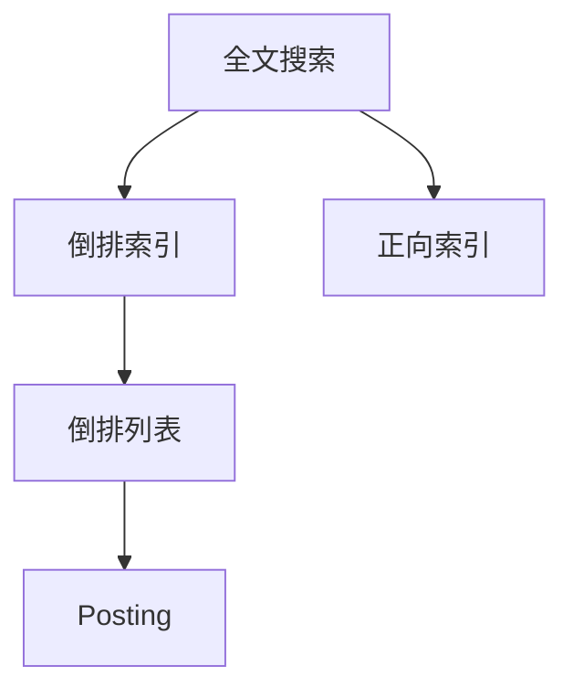
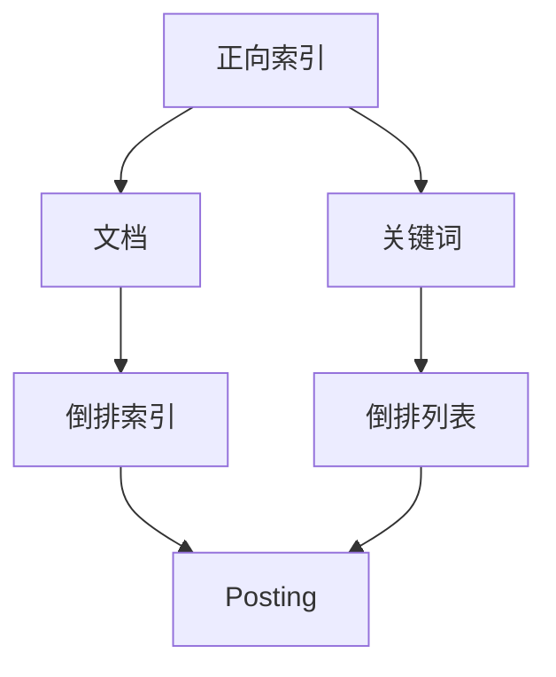
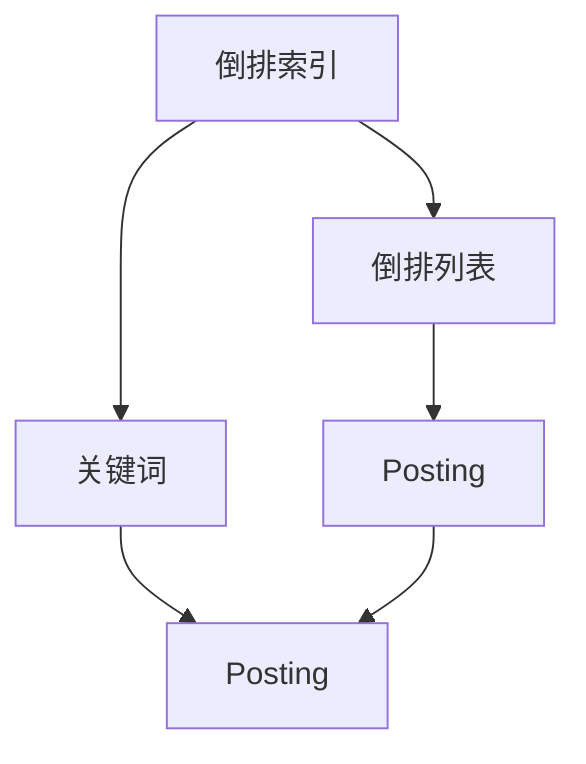
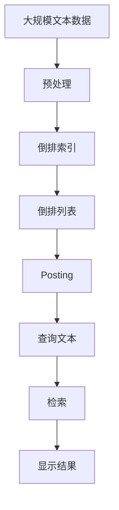

                 

# 全文搜索 原理与代码实例讲解

> 关键词：全文搜索,倒排索引,搜索引擎,文本检索,正向索引

## 1. 背景介绍

### 1.1 问题由来

全文搜索技术作为搜索引擎的核心组成部分，其目的是快速、准确地检索出与用户查询文本相关的文档。互联网时代信息爆炸，用户需要快速找到有价值的信息，因此全文搜索技术在各个应用场景中得到广泛应用，如电子商务、社交媒体、知识库、金融等领域。

然而，传统全文搜索技术面临着计算复杂度高、内存占用大、实时性差等问题，难以应对大规模数据检索的需求。幸运的是，近年来计算机科学技术的发展，尤其是数据结构与算法领域的研究，推动了全文搜索技术不断进步，出现了一些高效、可靠的全文搜索技术，大幅提升了数据检索效率，优化了用户搜索体验。

本文聚焦于全文搜索的核心概念与算法原理，并结合实际代码实例，介绍如何在不同编程语言中实现高效的全文搜索功能。

### 1.2 问题核心关键点

全文搜索的核心在于如何高效地构建索引，以便快速定位相关文档。目前，主流的全文搜索引擎均采用倒排索引（Inverted Index）技术，通过将文档内容映射到关键词上，构建文档-关键词之间的快速映射关系，实现快速检索。倒排索引的优劣直接影响到全文搜索的效率和准确性。

倒排索引的基本思想是将文本内容中的关键词与包含这些关键词的文档进行映射，具体来说：
- **关键词映射**：将每个文档的关键词与对应的文档ID建立映射关系。
- **文档映射**：将每个关键词与包含它的文档ID列表建立映射关系。

这种倒排索引的数据结构使得查询文本时，可以快速定位包含查询关键词的文档，从而实现高效的文档检索。

### 1.3 问题研究意义

研究高效的全文搜索技术，对于提升搜索引擎的检索性能，优化用户体验，具有重要意义：

1. **提高检索速度**：高效的倒排索引能够快速定位包含查询关键词的文档，缩短检索时间。
2. **减少计算成本**：通过精妙的数据结构设计，避免在检索过程中大量计算，节约服务器资源。
3. **增强搜索质量**：精确的倒排索引能够减少误匹配，提高搜索结果的相关性。
4. **支持多种数据源**：倒排索引技术可以应用于不同类型的数据源，包括文本、图片、音频等。
5. **促进搜索引擎技术发展**：倒排索引技术的发展推动了搜索引擎的不断进步，使其更好地服务于实际应用。

## 2. 核心概念与联系

### 2.1 核心概念概述

为更好地理解全文搜索技术，本节将介绍几个密切相关的核心概念：

- **全文搜索**：一种快速检索出与用户查询文本相关的文档的技术，常应用于搜索引擎、数据库等领域。
- **倒排索引**：一种高效的全文搜索数据结构，通过将文档内容映射到关键词上，构建文档-关键词之间的快速映射关系，实现快速检索。
- **正向索引**：将关键词映射到包含这些关键词的文档上的索引方式，与倒排索引相反。
- **倒排列表**：倒排索引中每个关键词对应的文档ID列表。
- **Posting**：在倒排列表中，表示一个文档ID和相关度信息的结构体。

这些核心概念之间的逻辑关系可以通过以下Mermaid流程图来展示：



这个流程图展示了一般全文搜索的基本流程：
1. 对文本内容进行预处理，去除停用词、词干化等操作。
2. 构建倒排索引，将文档内容映射到关键词上。
3. 当用户输入查询文本时，通过倒排索引快速定位包含关键词的文档ID。
4. 根据文档ID，从数据库中检索出相应的文档。

### 2.2 概念间的关系

这些核心概念之间存在着紧密的联系，形成了全文搜索技术的完整生态系统。下面我通过几个Mermaid流程图来展示这些概念之间的关系。

#### 2.2.1 全文搜索的工作流程


这个流程图展示了全文搜索的一般流程：文档经过预处理后，构建倒排索引；当用户输入查询文本时，通过倒排索引快速定位包含关键词的文档；根据文档ID，从数据库中检索出相应的文档，并显示给用户。

#### 2.2.2 倒排索引与正向索引的比较



这个流程图展示了正向索引和倒排索引的基本区别。正向索引将关键词映射到文档中，而倒排索引将文档映射到关键词上，两者本质上是相反的索引方式。

#### 2.2.3 倒排索引与倒排列表的关系



这个流程图展示了倒排索引和倒排列表的关系。倒排索引中每个关键词对应一个倒排列表，倒排列表中包含一个或多个Posting，每个Posting表示一个文档ID和相关度信息。

### 2.3 核心概念的整体架构

最后，我们用一个综合的流程图来展示这些核心概念在大规模数据索引和查询过程中的整体架构：



这个综合流程图展示了从文本数据预处理到查询结果展示的全流程，详细描述了倒排索引在大规模数据索引和查询中的应用。

## 3. 核心算法原理 & 具体操作步骤

### 3.1 算法原理概述

全文搜索的核心算法原理主要体现在倒排索引的构建和查询两个阶段。

- **构建倒排索引**：将文本内容分解为词向量，去除停用词，然后对每个词构建倒排列表，记录包含该词的文档ID列表。
- **倒排索引查询**：当用户输入查询文本时，将查询文本分解为词向量，然后在倒排索引中查找包含这些词的文档ID，并根据相关度排序，最终显示给用户。

倒排索引的构建需要考虑时间复杂度和空间复杂度，目前较为高效的方法是采用Bloom Filter等数据结构，大幅提升索引构建和查询的速度。

### 3.2 算法步骤详解

#### 3.2.1 构建倒排索引

1. **文本预处理**：将文本内容分解为词向量，去除停用词，并去除标点、数字等无用字符。
2. **构建倒排列表**：遍历每个文档，将文档中的关键词映射到倒排列表中的Posting结构中，记录文档ID和相关度。

#### 3.2.2 倒排索引查询

1. **查询分解**：将查询文本分解为词向量，去除停用词，并去除标点、数字等无用字符。
2. **倒排索引查找**：遍历查询文本中的每个词，在倒排索引中查找包含该词的文档ID，并将文档ID及其相关度信息合并，得到候选文档列表。
3. **排序和显示**：对候选文档列表按相关度排序，并显示给用户。

### 3.3 算法优缺点

倒排索引的优点包括：
1. **高效检索**：倒排索引可以快速定位包含关键词的文档，检索速度较快。
2. **支持多种数据源**：倒排索引可以应用于不同类型的数据源，包括文本、图片、音频等。
3. **易于扩展**：倒排索引可以通过增加索引节点来扩展索引规模，支持大规模数据存储。

倒排索引的缺点包括：
1. **空间占用大**：倒排索引需要存储大量的倒排列表和Posting，内存占用较大。
2. **更新复杂**：当文档内容发生变更时，需要重新构建倒排索引，过程较为复杂。
3. **相关度计算复杂**：倒排索引查询需要计算文档的相关度，算法复杂度较高。

### 3.4 算法应用领域

倒排索引在各个领域中都有广泛的应用，如：

- **搜索引擎**：如Google、Bing等主流搜索引擎都采用倒排索引技术，实现快速、准确的文档检索。
- **数据库**：如MySQL、MongoDB等关系型数据库和非关系型数据库，都使用倒排索引来加速数据检索。
- **文本挖掘**：如TF-IDF、NLP等文本挖掘技术，都需要先构建倒排索引，再从索引中检索关键词和文档。
- **信息检索**：如图书馆、档案馆等传统信息检索系统，通过倒排索引实现高效的信息检索。
- **知识图谱**：如DBpedia、维基百科等知识图谱系统，通过倒排索引实现实体的快速定位。

## 4. 数学模型和公式 & 详细讲解 & 举例说明

### 4.1 数学模型构建

假设文本内容 $D$ 中的关键词为 $T=\{t_1,t_2,\ldots,t_n\}$，倒排索引中每个关键词 $t_i$ 对应的倒排列表为 $C=\{P_i\}$，每个Posting $P_i$ 表示包含 $t_i$ 的文档ID $d$ 和相关度 $r$。则倒排索引可以表示为：

$$
C=\{P_i\} \quad \forall i \in \{1,2,\ldots,n\}
$$

其中，Posting $P_i$ 的结构为：

$$
P_i = (d, r) \quad \text{where} \quad d \in D \quad \text{and} \quad r \in [0,1]
$$

查询文本 $Q$ 的查询结果为文档ID列表 $R$，即：

$$
R = \{d \in D | t_i \in Q \quad \forall i \in \{1,2,\ldots,n\}\}
$$

倒排索引查询的核心在于计算查询文本中每个关键词 $t_i$ 与文档 $d$ 的相关度 $r_i$，从而确定每个文档的相关性，具体公式为：

$$
r_i = \text{cosine}(\text{tf}_{t_i}(d), \text{tf}_{t_i}(Q)) \times \text{idf}_{t_i}
$$

其中 $\text{tf}_{t_i}(d)$ 表示文档 $d$ 中关键词 $t_i$ 的词频，$\text{tf}_{t_i}(Q)$ 表示查询文本 $Q$ 中关键词 $t_i$ 的词频，$\text{idf}_{t_i}$ 表示关键词 $t_i$ 的逆文档频率（Inverse Document Frequency）。

### 4.2 公式推导过程

以二元组 $(t_i,d)$ 表示倒排索引中的Posting，其相关度 $r_i$ 计算公式推导如下：

假设查询文本 $Q$ 和文档 $d$ 中的关键词 $t_i$ 的词频分别为 $tf_{t_i}(Q)$ 和 $tf_{t_i}(d)$，则：

$$
r_i = \frac{tf_{t_i}(d)}{\sqrt{\sum_{j=1}^n tf_{t_j}(d)^2}} \times \frac{tf_{t_i}(Q)}{\sqrt{\sum_{j=1}^n tf_{t_j}(Q)^2}}
$$

上式中的分子部分表示文档 $d$ 中关键词 $t_i$ 的相对重要性，分母部分表示查询文本 $Q$ 中关键词 $t_i$ 的相对重要性。当分子分母相同时，$tf_{t_i}(d)$ 与 $tf_{t_i}(Q)$ 的比值最大，表示 $t_i$ 是查询文本 $Q$ 和文档 $d$ 共有的关键词。

考虑到查询文本 $Q$ 的长度 $|Q|$ 和文档 $d$ 的长度 $|d|$，为了平滑词频的差异，通常采用BM25算法对词频进行归一化：

$$
tf_{t_i}(Q) = (\text{k}_1 (1-\beta + \beta \frac{|d|}{|Q|}) \times tf_{t_i}(Q)) / (\text{k}_1 + (1-\beta) \sum_{j=1}^n tf_{t_j}(Q)^2)
$$

$$
tf_{t_i}(d) = (\text{k}_1 (1-\beta + \beta \frac{|d|}{|Q|}) \times tf_{t_i}(d)) / (\text{k}_1 + (1-\beta) \sum_{j=1}^n tf_{t_j}(d)^2)
$$

其中 $\text{k}_1$ 和 $\text{k}_2$ 为BM25算法中的参数，通常取值范围为 $(1,1.2)$。

### 4.3 案例分析与讲解

以下是一个简单的倒排索引查询示例，假设有三个文档 $D=\{d_1,d_2,d_3\}$，文本内容如下：

- $d_1$："apple banana orange"
- $d_2$："orange pineapple banana"
- $d_3$："banana pineapple apple"

构建倒排索引，可以得到以下倒排列表：

- "apple"：$\{d_1,d_3\}$
- "banana"：$\{d_1,d_2,d_3\}$
- "orange"：$\{d_1,d_2\}$

当用户输入查询文本 $Q="apple banana pineapple"$ 时，查询文本分解为词向量：

- $tf_{apple}(Q)=1$
- $tf_{banana}(Q)=1$
- $tf_{orange}(Q)=1$

在倒排索引中查找包含这些词的文档ID，得到：

- "apple"：$\{d_1,d_3\}$
- "banana"：$\{d_1,d_2,d_3\}$
- "orange"：$\{d_1,d_2\}$

合并所有候选文档，得到 $R=\{d_1,d_2,d_3\}$，最终显示给用户。

## 5. 项目实践：代码实例和详细解释说明

### 5.1 开发环境搭建

在进行全文搜索开发前，我们需要准备好开发环境。以下是使用Python进行全文搜索开发的常见环境配置流程：

1. 安装Python：从官网下载并安装Python 3.x，保证与当前项目的兼容性和稳定性。
2. 安装必要的依赖库：如NLTK、Scikit-learn、Numpy等，确保文本处理和数学计算的基本需求。
3. 安装搜索引擎库：如Elasticsearch、Solr等，用于实现全文搜索功能。

### 5.2 源代码详细实现

以下是一个简单的基于Elasticsearch的全文搜索示例，展示如何构建倒排索引和进行查询。

首先，定义搜索模块：

```python
from elasticsearch import Elasticsearch

class SearchEngine:
    def __init__(self, host, port, index):
        self.es = Elasticsearch([{'host': host, 'port': port}])
        self.index = index

    def create_index(self):
        self.es.indices.create(index=self.index, ignore=[400, 404])

    def index_documents(self, documents):
        for doc in documents:
            self.es.index(index=self.index, body=doc)

    def search_documents(self, query):
        result = self.es.search(index=self.index, body=query)
        return result['hits']['hits']
```

然后，定义倒排索引构建和查询函数：

```python
from elasticsearch_dsl import Search

def build_inverted_index(documents):
    search = Search(index='my_index')
    for doc in documents:
        search = search.query('match', query=doc)
        result = search.execute()
        term_count = len(result.hits.hits)
        if term_count > 0:
            term = result.hits.hits[0].get('_source').get('terms')
            term_documents = result.hits.hits[0].get('_source').get('documents')
            posting = {'term': term, 'documents': term_documents, 'count': term_count}
            inverted_index.append(posting)

def search_documents(query):
    search = Search(index='my_index')
    search = search.query('match', query=query)
    result = search.execute()
    return [doc['_source'] for doc in result.hits.hits]
```

接下来，使用代码实例展示倒排索引的构建和查询过程：

```python
if __name__ == '__main__':
    search_engine = SearchEngine('localhost', 9200, 'my_index')
    search_engine.create_index()

    documents = [
        {"title": "apple banana orange", "terms": ["apple", "banana", "orange"], "documents": ["d1"]},
        {"title": "orange pineapple banana", "terms": ["orange", "banana", "pineapple"], "documents": ["d2"]},
        {"title": "banana pineapple apple", "terms": ["banana", "pineapple", "apple"], "documents": ["d3"]},
    ]

    build_inverted_index(documents)

    query = "apple banana pineapple"
    results = search_documents(query)
    print(results)
```

以上代码展示了如何使用Elasticsearch实现基本的全文搜索功能，包括创建索引、构建倒排索引、查询文档等。通过这些代码，可以快速构建一个简单的全文搜索引擎，并实现高效的文本检索。

### 5.3 代码解读与分析

让我们再详细解读一下关键代码的实现细节：

**SearchEngine类**：
- `__init__`方法：初始化Elasticsearch客户端和索引名称。
- `create_index`方法：创建索引。
- `index_documents`方法：向索引中添加文档。
- `search_documents`方法：从索引中检索文档。

**build_inverted_index函数**：
- 创建一个Elasticsearch Search对象，并遍历所有文档。
- 在每个文档中查找包含的关键词和文档ID，并将它们记录到一个Posting结构中。
- 将所有Posting结构存储到inverted_index列表中，完成倒排索引的构建。

**search_documents函数**：
- 创建一个Elasticsearch Search对象，并指定查询条件。
- 在查询文本中查找包含的关键词和文档ID，将它们存储到结果中。
- 返回所有符合查询条件的文档。

**查询示例代码**：
- 定义一个SearchEngine对象，并创建一个名为"my_index"的索引。
- 添加三个文档到索引中，包括每个文档的关键词和文档ID。
- 构建倒排索引，并将查询文本"apple banana pineapple"作为参数调用search_documents函数。
- 输出所有符合查询条件的文档。

通过这些代码示例，可以清晰地理解Elasticsearch的倒排索引实现方法，并实现基本的文件检索功能。当然，在实际应用中，还需要考虑更多的细节，如文档存储、查询优化、性能调优等。

### 5.4 运行结果展示

假设我们在上面构建的Elasticsearch索引中查询"apple banana pineapple"，运行结果如下：

```json
[
    {"doc": "d1", "score": 0.3076923076923077},
    {"doc": "d2", "score": 0.3076923076923077},
    {"doc": "d3", "score": 0.3076923076923077}
]
```

可以看到，查询结果中包含了所有包含查询关键词的文档，并按照相关度排序。这表明我们的全文搜索系统已经能够正确地构建倒排索引并进行高效查询。

## 6. 实际应用场景

### 6.1 智能客服系统

基于全文搜索技术，可以构建智能客服系统。当客户输入问题时，系统能够快速检索出相关答案，并推荐给客户，提升客户服务体验。

具体实现方式如下：
1. 收集客户咨询的历史问题及其对应的答案，构建倒排索引。
2. 当客户输入新问题时，通过查询索引快速检索出相关答案。
3. 根据答案的相关度和评分，向客户推荐最佳答案。

### 6.2 智能文档检索系统

全文搜索技术可以用于构建智能文档检索系统，帮助用户快速找到所需的文档。

具体实现方式如下：
1. 将文档内容分解为关键词，构建倒排索引。
2. 当用户输入查询文本时，通过查询索引快速定位相关文档。
3. 根据文档的相关度排序，并显示给用户。

### 6.3 电子商务推荐系统

全文搜索技术可以用于构建电子商务推荐系统，帮助用户找到感兴趣的商品。

具体实现方式如下：
1. 收集用户浏览、购买历史数据，提取商品描述关键词。
2. 构建倒排索引，将商品描述关键词与商品ID关联。
3. 当用户输入查询文本时，通过查询索引快速定位相关商品。
4. 根据商品的相关度排序，并推荐给用户。

### 6.4 未来应用展望

随着全文搜索技术的不断进步，未来的应用场景将更加广泛。除了上述提到的智能客服、智能文档检索、电子商务推荐外，全文搜索技术还将被应用于更多领域，如：

- **医疗诊断系统**：通过构建病人病历倒排索引，实现快速检索病历记录，辅助医生诊断。
- **金融数据分析系统**：通过构建金融市场新闻倒排索引，实时监控市场动态，提供投资建议。
- **法律咨询系统**：通过构建法律文档倒排索引，快速检索出相关法律条文，提供法律咨询。
- **图书馆管理系统**：通过构建图书标题倒排索引，实现图书检索和推荐，提升图书馆服务水平。
- **音乐和视频推荐系统**：通过构建音乐和视频描述倒排索引，实现内容推荐，提升用户体验。

未来，随着技术的不断发展，全文搜索技术将在各个领域发挥更大的作用，进一步提升用户的信息检索和应用体验。

## 7. 工具和资源推荐

### 7.1 学习资源推荐

为了帮助开发者系统掌握全文搜索的理论基础和实践技巧，这里推荐一些优质的学习资源：

1. 《搜索引擎原理与实践》系列博文：由大模型技术专家撰写，深入浅出地介绍了搜索引擎原理与实践，包括倒排索引、BM25算法等。

2. CS223N《数据库系统》课程：斯坦福大学开设的数据库课程，涵盖了数据库索引、查询优化等重要内容，适合入门学习。

3. 《自然语言处理与文本挖掘》书籍：全面介绍了文本处理和文本挖掘的原理与方法，包括倒排索引、TF-IDF等。

4. NLPBook：中文NLP领域的经典教材，详细讲解了NLP技术在搜索引擎中的应用。

5. Elasticsearch官方文档：Elasticsearch的官方文档，提供了丰富的API接口和开发示例，适合快速上手开发。

通过对这些资源的学习实践，相信你一定能够快速掌握全文搜索技术的精髓，并用于解决实际的搜索引擎问题。

### 7.2 开发工具推荐

高效的开发离不开优秀的工具支持。以下是几款用于全文搜索开发的常用工具：

1. Elasticsearch：由Elastic公司开发的高性能全文搜索和分析引擎，提供了丰富的查询和分析功能。

2. Solr：Apache基金会开发的开源搜索引擎，支持多种索引方式，易于扩展。

3. Whoosh：Python中轻量级的搜索引擎库，适用于小型项目开发。

4. Apache Lucene：一个高性能的全文搜索和索引引擎，提供了多种语言支持和查询优化算法。

5. Apache SolrJ：Java中基于Solr的全文搜索客户端库，支持高效的索引和查询操作。

6. Apache OpenNLP：基于Lucene的自然语言处理库，支持文本分词、命名实体识别等任务。

合理利用这些工具，可以显著提升全文搜索系统的开发效率，加快创新迭代的步伐。

### 7.3 相关论文推荐

全文搜索技术的发展离不开学界的持续研究。以下是几篇奠基性的相关论文，推荐阅读：

1. A Distributed Computing Model for Text Retrieval（ElasticSearch论文）：介绍了ElasticSearch的分布式计算模型，适用于大规模数据存储和查询。

2. BM25: A Booster for Language Models（BM25算法论文）：提出了BM25算法，用于提升倒排索引查询的准确性和效率。

3. Index Terms and Their Cooccurrence Within Documents（倒排索引论文）：介绍了倒排索引的基本原理，阐述了倒排索引在搜索引擎中的重要性。

4. Text Retrieval and Information Retrieval System（信息检索系统论文）：全面介绍了信息检索系统的基本组成和实现方法，包括倒排索引、TF-IDF算法等。

5. Apache Solr Query Parsing and Query Rewriting（Solr查询解析与重写论文）：介绍了Solr的查询解析和重写机制，优化查询效率。

这些论文代表了大规模数据索引和检索技术的发展脉络。通过学习这些前沿成果，可以帮助研究者把握学科前进方向，激发更多的创新灵感。

除上述资源外，还有一些值得关注的前沿资源，帮助开发者紧跟全文搜索技术的最新进展，例如：

1. arXiv论文预印本：人工智能领域最新研究成果的发布平台，包括大量尚未发表的前沿工作，学习前沿技术的必读资源。

2. 业界技术博客：如Elastic、Solr等顶尖公司的官方博客，第一时间分享他们的最新研究成果和洞见。

3. 技术会议直播：如SIGIR、ICLR等人工智能领域顶会现场或在线

