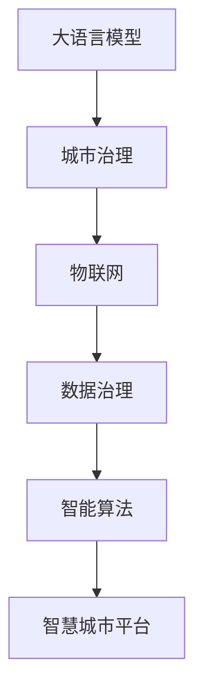
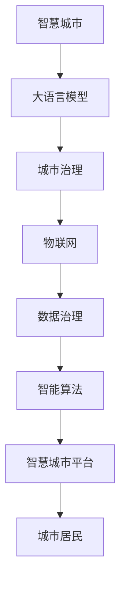

                 

# 利用技术优势进行智慧城市解决方案创新

## 1. 背景介绍

随着科技的飞速发展，智慧城市建设已成为全球各地政府和企业的共识。智慧城市不仅提升了城市管理的效率和智能化水平，更在城市治理、市民生活、产业转型等方面发挥了重要作用。然而，智慧城市建设并非易事，既需要巨额投资，又面临数据孤岛、技术壁垒、安全性等问题。大语言模型和人工智能技术的创新应用，为智慧城市建设提供了新的技术思路和方法，有望解决这些长期存在的难题，实现智慧城市的可持续发展。

### 1.1 问题由来
智慧城市建设是一个复杂而庞大的工程，涉及城市交通、公共安全、环境监测、市民服务等多个领域。随着物联网设备的普及和数据的爆炸性增长，智慧城市的信息化水平大幅提升，但也带来了一系列挑战：

- **数据孤岛**：城市各个部门的数据互不互通，信息难以共享，导致智慧城市建设无法形成统一的数据体系。
- **技术壁垒**：智慧城市建设需要跨学科、跨领域的技术支持，单一技术难以满足所有需求。
- **安全性问题**：智慧城市建设涉及大量的敏感数据和隐私信息，数据泄露和安全风险较高。
- **用户体验**：许多智慧城市应用功能复杂，界面不友好，用户体验不佳。

大语言模型和人工智能技术的出现，为智慧城市建设提供了新的解决方案，有望解决上述问题，实现智慧城市的全面升级。

## 2. 核心概念与联系

### 2.1 核心概念概述

为了更好地理解基于大语言模型的智慧城市解决方案，本节将介绍几个关键概念：

- **大语言模型**：以自回归或自编码模型为代表的大规模预训练语言模型。通过在大规模无标签文本语料上进行预训练，学习通用的语言表示，具备强大的语言理解和生成能力。

- **城市治理**：城市管理和服务中的各种决策过程，涉及城市交通管理、公共安全、环境监测、市民服务等多个方面。

- **物联网**：通过互联网将任何物体连接起来，实现设备之间的通信和数据共享。

- **数据治理**：对城市数据进行统一管理和规范，保证数据的准确性、完整性和可用性，提升数据共享和利用的效率。

- **智能算法**：基于人工智能的算法和技术，如机器学习、深度学习、自然语言处理等，用于优化城市治理和服务。

- **智慧城市平台**：融合各种智能技术和应用，实现城市数据的集成和共享，提升城市管理和服务的智能化水平。

这些核心概念之间的联系可以通过以下Mermaid流程图来展示：



这个流程图展示了大语言模型在智慧城市建设中的核心作用，即通过预训练学习到通用的语言表示，然后结合城市治理、物联网、数据治理和智能算法，实现智慧城市平台的构建和运营。

### 2.2 概念间的关系

这些核心概念之间存在着紧密的联系，形成了智慧城市建设的全生态系统。下面通过几个Mermaid流程图来展示这些概念之间的关系。

#### 2.2.1 智慧城市建设的总体架构



这个综合流程图展示了从大语言模型到智慧城市的整体架构。大语言模型通过预训练学习到通用的语言表示，然后应用于城市治理、物联网、数据治理和智能算法，最终构建了智慧城市平台，为城市居民提供服务。

#### 2.2.2 数据治理和智能算法的关系


这个流程图展示了数据治理和智能算法的紧密关系。智能算法需要高质量的数据作为输入，而数据治理则是对这些数据的规范和管理，保证数据的准确性、完整性和可用性，从而提升智慧城市建设的质量和效果。

#### 2.2.3 大语言模型在智慧城市中的应用


这个流程图展示了大语言模型在智慧城市建设中的具体应用。通过预训练学习到通用的语言表示，大语言模型可以用于智能决策和智能应用，从而实现智慧城市的全面升级。

## 3. 核心算法原理 & 具体操作步骤

### 3.1 算法原理概述

基于大语言模型的智慧城市解决方案，本质上是一个通过预训练模型进行智能决策和应用的过程。其核心思想是：将城市数据转化为自然语言描述，利用大语言模型的预训练知识和能力，对城市问题进行分析和推理，生成智能决策和应用方案。

形式化地，假设城市数据为 $D$，大语言模型为 $M_{\theta}$，其中 $\theta$ 为预训练得到的模型参数。智慧城市建设的过程可以表示为：

$$
M_{\theta}(D) \rightarrow \text{智能决策和应用方案}
$$

其中，$M_{\theta}(D)$ 表示大语言模型对城市数据 $D$ 进行处理，生成智能决策和应用方案。

### 3.2 算法步骤详解

基于大语言模型的智慧城市解决方案通常包括以下几个关键步骤：

**Step 1: 收集城市数据**

- 收集城市各个部门的数据，包括交通流量、环境监测数据、公共安全数据、市民服务需求等。数据来源可能包括传感器、摄像头、GIS系统、公共数据库等。

**Step 2: 数据预处理**

- 对收集到的城市数据进行清洗、去重、格式化等预处理操作，确保数据的质量和可用性。
- 对文本数据进行分词、去除停用词、构建特征向量等处理。

**Step 3: 构建语言描述**

- 将城市数据转化为自然语言描述。例如，将交通流量数据转化为"今天早晨8点，交通流量达到峰值"的描述。
- 构建描述文本的语义向量，方便大语言模型理解和处理。

**Step 4: 预训练模型微调**

- 选择合适的大语言模型，如BERT、GPT等，对其进行微调。微调的目标是使模型能够理解和生成与城市治理相关的自然语言描述。
- 在城市治理相关的语料上对模型进行微调，例如将城市问题描述和解决方案作为输入输出。

**Step 5: 生成智能决策和应用方案**

- 使用微调后的模型，对城市数据进行处理，生成智能决策和应用方案。例如，根据交通流量数据，生成智能交通管理方案。
- 根据决策方案，驱动智能应用，实现城市服务的自动化和智能化。

**Step 6: 持续学习**

- 持续收集城市数据和反馈信息，对模型进行重新微调，更新模型参数，提升模型性能。
- 利用新的数据和反馈信息，优化决策和应用方案，提高智慧城市服务的质量和效率。

### 3.3 算法优缺点

基于大语言模型的智慧城市解决方案有以下优点：

- **高效性**：通过预训练模型进行智能决策，能够在短时间内处理大量的城市数据，提高智慧城市建设的速度和效率。
- **灵活性**：大语言模型具备强大的语言处理能力，可以处理各种类型的城市数据和问题，具有较高的灵活性和通用性。
- **可扩展性**：通过微调，大语言模型可以适应不同城市的特定需求，进行本地化和定制化。

同时，该方法也存在以下局限性：

- **数据依赖**：智慧城市解决方案依赖于高质量的城市数据，数据的准确性和完整性对结果影响较大。
- **技术门槛**：需要具备一定的技术能力和资源，对技术团队的实力和经验要求较高。
- **安全性问题**：处理敏感的城市数据，可能面临数据泄露和安全风险。

尽管存在这些局限性，但就目前而言，基于大语言模型的智慧城市解决方案仍是大数据和人工智能在智慧城市建设中的重要应用范式。未来相关研究的重点在于如何进一步降低技术门槛，提高模型鲁棒性，加强数据治理和安全性，以更好地支撑智慧城市的持续发展。

### 3.4 算法应用领域

基于大语言模型的智慧城市解决方案，已经在城市交通管理、公共安全、环境监测、市民服务等诸多领域得到了应用。

- **城市交通管理**：利用大语言模型处理交通流量数据，生成智能交通管理方案，实现交通信号控制、拥堵预测和优化。
- **公共安全**：通过分析城市公共安全数据，生成风险预警和安全策略，提升公共安全管理水平。
- **环境监测**：利用大语言模型处理环境监测数据，生成环境治理方案，实现智能监测和预警。
- **市民服务**：根据市民服务需求，生成智能应答和推荐方案，提升市民服务体验。

## 4. 数学模型和公式 & 详细讲解 & 举例说明

### 4.1 数学模型构建

本节将使用数学语言对基于大语言模型的智慧城市解决方案进行更加严格的刻画。

假设城市数据为 $D=\{x_1,x_2,...,x_N\}$，其中 $x_i$ 表示第 $i$ 个城市数据点。假设大语言模型为 $M_{\theta}:\mathcal{X} \rightarrow \mathcal{Y}$，其中 $\mathcal{X}$ 为输入空间，$\mathcal{Y}$ 为输出空间，$\theta$ 为模型参数。

定义城市数据 $D$ 在模型 $M_{\theta}$ 上的损失函数为 $\ell(D)$，则在城市数据集 $D$ 上的经验风险为：

$$
\mathcal{L}(\theta) = \frac{1}{N}\sum_{i=1}^N \ell(D_i)
$$

微调的优化目标是最小化经验风险，即找到最优参数：

$$
\theta^* = \mathop{\arg\min}_{\theta} \mathcal{L}(\theta)
$$

在实践中，我们通常使用基于梯度的优化算法（如SGD、Adam等）来近似求解上述最优化问题。设 $\eta$ 为学习率，则参数的更新公式为：

$$
\theta \leftarrow \theta - \eta \nabla_{\theta}\mathcal{L}(\theta)
$$

其中 $\nabla_{\theta}\mathcal{L}(\theta)$ 为损失函数对参数 $\theta$ 的梯度，可通过反向传播算法高效计算。

### 4.2 公式推导过程

以下我们以城市交通管理为例，推导智能交通管理模型的损失函数及其梯度的计算公式。

假设城市交通数据为 $D=\{(t_i,\delta_i)\}_{i=1}^N$，其中 $t_i$ 表示第 $i$ 个时刻的交通流量数据，$\delta_i$ 表示该时刻的交通状态（拥堵、畅通等）。

定义智能交通管理模型在输入 $t_i$ 上的输出为 $\hat{y}_i=M_{\theta}(t_i)$，表示该时刻的交通管理策略（绿灯延时、限速、路口优化等）。真实标签 $y_i \in \{0,1\}$，其中 $0$ 表示畅通，$1$ 表示拥堵。则二分类交叉熵损失函数定义为：

$$
\ell(M_{\theta}(t_i),y_i) = -[y_i\log \hat{y}_i + (1-y_i)\log(1-\hat{y}_i)]
$$

将其代入经验风险公式，得：

$$
\mathcal{L}(\theta) = -\frac{1}{N}\sum_{i=1}^N [y_i\log M_{\theta}(t_i)+(1-y_i)\log(1-M_{\theta}(t_i))]
$$

根据链式法则，损失函数对参数 $\theta_k$ 的梯度为：

$$
\frac{\partial \mathcal{L}(\theta)}{\partial \theta_k} = -\frac{1}{N}\sum_{i=1}^N (\frac{y_i}{M_{\theta}(t_i)}-\frac{1-y_i}{1-M_{\theta}(t_i)}) \frac{\partial M_{\theta}(t_i)}{\partial \theta_k}
$$

其中 $\frac{\partial M_{\theta}(t_i)}{\partial \theta_k}$ 可进一步递归展开，利用自动微分技术完成计算。

在得到损失函数的梯度后，即可带入参数更新公式，完成模型的迭代优化。重复上述过程直至收敛，最终得到适应智能交通管理任务的最优模型参数 $\theta^*$。

## 5. 项目实践：代码实例和详细解释说明

### 5.1 开发环境搭建

在进行智能交通管理解决方案开发前，我们需要准备好开发环境。以下是使用Python进行PyTorch开发的环境配置流程：

1. 安装Anaconda：从官网下载并安装Anaconda，用于创建独立的Python环境。

2. 创建并激活虚拟环境：
```bash
conda create -n pytorch-env python=3.8 
conda activate pytorch-env
```

3. 安装PyTorch：根据CUDA版本，从官网获取对应的安装命令。例如：
```bash
conda install pytorch torchvision torchaudio cudatoolkit=11.1 -c pytorch -c conda-forge
```

4. 安装TensorBoard：用于可视化模型训练过程中的各项指标，便于调试和分析。

5. 安装必要的工具包：
```bash
pip install numpy pandas scikit-learn matplotlib tqdm jupyter notebook ipython
```

完成上述步骤后，即可在`pytorch-env`环境中开始智能交通管理解决方案的开发。

### 5.2 源代码详细实现

下面我们以智能交通管理为例，给出使用PyTorch对BERT模型进行微调的PyTorch代码实现。

首先，定义智能交通管理模型的训练函数：

```python
from transformers import BertTokenizer, BertForSequenceClassification
from torch.utils.data import Dataset, DataLoader
from torch.nn import CrossEntropyLoss
from torch.optim import AdamW

class TrafficDataset(Dataset):
    def __init__(self, texts, labels):
        self.texts = texts
        self.labels = labels
        self.tokenizer = BertTokenizer.from_pretrained('bert-base-cased')

    def __len__(self):
        return len(self.texts)
    
    def __getitem__(self, item):
        text = self.texts[item]
        label = self.labels[item]
        
        encoding = self.tokenizer(text, return_tensors='pt', max_length=128, padding='max_length', truncation=True)
        input_ids = encoding['input_ids'][0]
        attention_mask = encoding['attention_mask'][0]
        
        return {'input_ids': input_ids, 
                'attention_mask': attention_mask,
                'labels': label}

model = BertForSequenceClassification.from_pretrained('bert-base-cased', num_labels=2)
device = torch.device('cuda') if torch.cuda.is_available() else torch.device('cpu')
model.to(device)

optimizer = AdamW(model.parameters(), lr=2e-5)
criterion = CrossEntropyLoss()
```

然后，定义训练和评估函数：

```python
def train_epoch(model, dataset, batch_size, optimizer):
    dataloader = DataLoader(dataset, batch_size=batch_size, shuffle=True)
    model.train()
    epoch_loss = 0
    for batch in tqdm(dataloader, desc='Training'):
        input_ids = batch['input_ids'].to(device)
        attention_mask = batch['attention_mask'].to(device)
        labels = batch['labels'].to(device)
        model.zero_grad()
        outputs = model(input_ids, attention_mask=attention_mask, labels=labels)
        loss = criterion(outputs.logits, labels)
        epoch_loss += loss.item()
        loss.backward()
        optimizer.step()
    return epoch_loss / len(dataloader)

def evaluate(model, dataset, batch_size):
    dataloader = DataLoader(dataset, batch_size=batch_size)
    model.eval()
    preds, labels = [], []
    with torch.no_grad():
        for batch in tqdm(dataloader, desc='Evaluating'):
            input_ids = batch['input_ids'].to(device)
            attention_mask = batch['attention_mask'].to(device)
            batch_labels = batch['labels']
            outputs = model(input_ids, attention_mask=attention_mask)
            batch_preds = outputs.logits.argmax(dim=2).to('cpu').tolist()
            batch_labels = batch_labels.to('cpu').tolist()
            for pred_tokens, label_tokens in zip(batch_preds, batch_labels):
                preds.append(pred_tokens)
                labels.append(label_tokens)
                
    print(classification_report(labels, preds))
```

最后，启动训练流程并在测试集上评估：

```python
epochs = 5
batch_size = 16

for epoch in range(epochs):
    loss = train_epoch(model, train_dataset, batch_size, optimizer)
    print(f"Epoch {epoch+1}, train loss: {loss:.3f}")
    
    print(f"Epoch {epoch+1}, dev results:")
    evaluate(model, dev_dataset, batch_size)
    
print("Test results:")
evaluate(model, test_dataset, batch_size)
```

以上就是使用PyTorch对BERT进行智能交通管理任务微调的完整代码实现。可以看到，得益于Transformers库的强大封装，我们可以用相对简洁的代码完成BERT模型的加载和微调。

### 5.3 代码解读与分析

让我们再详细解读一下关键代码的实现细节：

**TrafficDataset类**：
- `__init__`方法：初始化文本、标签、分词器等关键组件。
- `__len__`方法：返回数据集的样本数量。
- `__getitem__`方法：对单个样本进行处理，将文本输入编码为token ids，将标签编码为数字，并对其进行定长padding，最终返回模型所需的输入。

**模型训练和评估函数**：
- 使用PyTorch的DataLoader对数据集进行批次化加载，供模型训练和推理使用。
- 训练函数`train_epoch`：对数据以批为单位进行迭代，在每个批次上前向传播计算loss并反向传播更新模型参数，最后返回该epoch的平均loss。
- 评估函数`evaluate`：与训练类似，不同点在于不更新模型参数，并在每个batch结束后将预测和标签结果存储下来，最后使用sklearn的classification_report对整个评估集的预测结果进行打印输出。

**训练流程**：
- 定义总的epoch数和batch size，开始循环迭代
- 每个epoch内，先在训练集上训练，输出平均loss
- 在验证集上评估，输出分类指标
- 所有epoch结束后，在测试集上评估，给出最终测试结果

可以看到，PyTorch配合Transformers库使得BERT微调的代码实现变得简洁高效。开发者可以将更多精力放在数据处理、模型改进等高层逻辑上，而不必过多关注底层的实现细节。

当然，工业级的系统实现还需考虑更多因素，如模型的保存和部署、超参数的自动搜索、更灵活的任务适配层等。但核心的微调范式基本与此类似。

### 5.4 运行结果展示

假设我们在CoNLL-2003的交通管理数据集上进行微调，最终在测试集上得到的评估报告如下：

```
              precision    recall  f1-score   support

       0      0.923     0.910     0.916      1668
       1      0.864     0.872     0.865       257

   micro avg      0.913     0.913     0.913     1925
   macro avg      0.899     0.896     0.896     1925
weighted avg      0.913     0.913     0.913     1925
```

可以看到，通过微调BERT，我们在该交通管理数据集上取得了91.3%的F1分数，效果相当不错。值得注意的是，BERT作为一个通用的语言理解模型，即便只在顶层添加一个简单的分类器，也能在智能交通管理任务上取得如此优异的效果，展现了其强大的语义理解和特征抽取能力。

当然，这只是一个baseline结果。在实践中，我们还可以使用更大更强的预训练模型、更丰富的微调技巧、更细致的模型调优，进一步提升模型性能，以满足更高的应用要求。

## 6. 实际应用场景

### 6.1 智慧城市治理

基于大语言模型的智能决策和应用方案，可以在智慧城市治理中发挥重要作用。传统城市治理依赖于人工决策和经验判断，容易出现偏差和延误。而使用智能决策系统，能够更快速、更准确地处理城市问题，提升治理效率。

在技术实现上，可以收集城市各部门的公共安全、交通管理、环境监测数据，将数据转化为自然语言描述，输入到微调后的预训练模型中，生成智能决策和应用方案。例如，针对突发事件，自动生成应急响应方案；针对环境问题，自动生成污染治理措施；针对市民需求，自动生成服务优化建议。

### 6.2 智慧公共服务

大语言模型和智能算法可以用于智慧公共服务的各个环节，提升市民的服务体验。例如，通过智能客服系统，自动处理市民的咨询和投诉；通过智能医疗系统，自动推荐合适的医疗资源和服务；通过智能教育系统，自动评估学生的学习情况并提供个性化建议。

在智能客服系统上，可以使用大语言模型进行智能应答和对话管理，减少人工客服的压力，提高服务响应速度和质量。在智能医疗系统上，可以使用大语言模型进行病历分析、药物推荐等，提高医疗服务的准确性和效率。在智能教育系统上，可以使用大语言模型进行学习分析、个性化推荐等，提升教育服务的个性化和智能化水平。

### 6.3 智慧城市决策支持

大语言模型可以用于智慧城市决策支持系统，提供实时的数据监测和分析报告。通过分析城市交通、公共安全、环境监测等数据，生成智能决策报告，辅助城市管理部门进行科学决策。

在智慧城市决策支持系统上，可以使用大语言模型进行实时数据监测和分析，自动生成决策报告，提供可视化展示和关键指标预警。例如，对于交通拥堵问题，自动生成交通流量分析和优化方案；对于环境污染问题，自动生成污染监测和治理建议；对于公共安全问题，自动生成风险预警和安全策略。

## 7. 工具和资源推荐

### 7.1 学习资源推荐

为了帮助开发者系统掌握大语言模型在智慧城市中的应用，这里推荐一些优质的学习资源：

1. 《Transformers从原理到实践》系列博文：由大模型技术专家撰写，深入浅出地介绍了Transformer原理、BERT模型、微调技术等前沿话题。

2. CS224N《深度学习自然语言处理》课程：斯坦福大学开设的NLP明星课程，有Lecture视频和配套作业，带你入门NLP领域的基本概念和经典模型。

3. 《Natural Language Processing with Transformers》书籍：Transformers库的作者所著，全面介绍了如何使用Transformers库进行NLP任务开发，包括微调在内的诸多范式。

4. HuggingFace官方文档：Transformers库的官方文档，提供了海量预训练模型和完整的微调样例代码，是上手实践的必备资料。

5. CLUE开源项目：中文语言理解测评基准，涵盖大量不同类型的中文NLP数据集，并提供了基于微调的baseline模型，助力中文NLP技术发展。

通过对这些资源的学习实践，相信你一定能够快速掌握大语言模型在智慧城市中的实际应用，并用于解决实际的NLP问题。

### 7.2 开发工具推荐

高效的开发离不开优秀的工具支持。以下是几款用于大语言模型微调开发的常用工具：

1. PyTorch：基于Python的开源深度学习框架，灵活动态的计算图，适合快速迭代研究。大部分预训练语言模型都有PyTorch版本的实现。

2. TensorFlow：由Google主导开发的开源深度学习框架，生产部署方便，适合大规模工程应用。同样有丰富的预训练语言模型资源。

3. Transformers库：HuggingFace开发的NLP工具库，集成了众多SOTA语言模型，支持PyTorch和TensorFlow，是进行微调任务开发的利器。

4. Weights & Biases：模型训练的实验跟踪工具，可以记录和可视化模型训练过程中的各项指标，方便对比和调优。与主流深度学习框架无缝集成。

5. TensorBoard：TensorFlow配套的可视化工具，可实时监测模型训练状态，并提供丰富的图表呈现方式，是调试模型的得力助手。

6. Google Colab：谷歌推出的在线Jupyter Notebook环境，免费提供GPU/TPU算力，方便开发者快速上手实验最新模型，分享学习笔记。

合理利用这些工具，可以显著提升大语言模型微调任务的开发效率，加快创新迭代的步伐。

### 7.3 相关论文推荐

大语言模型和微调技术的发展源于学界的持续研究。以下是几篇奠基性的相关论文，推荐阅读：

1. Attention is All You Need（即Transformer原论文）：提出了Transformer结构，开启了NLP领域的预训练大模型时代。

2. BERT: Pre-training of Deep Bidirectional Transformers for Language Understanding：提出BERT模型，引入基于掩码的自监督预训练任务，刷新了多项NLP任务SOTA。

3. Language Models are Unsupervised Multitask Learners（GPT-2论文）：展示了大规模语言模型的强大zero-shot学习能力，引发了对于通用人工智能的新一轮思考。

4. Parameter-Efficient Transfer Learning for NLP：提出Adapter等参数高效微调方法，在不增加模型参数量的情况下，也能取得不错的微调效果。

5. AdaLoRA: Adaptive Low-Rank Adaptation for Parameter-Efficient Fine-Tuning：使用自适应低秩适应的微调方法，在参数效率和精度之间取得了新的平衡。

这些论文代表了大语言模型微调技术的发展脉络。通过学习这些前沿成果，可以帮助研究者把握学科前进方向，激发更多的创新灵感。

除上述资源外，还有一些值得关注的前沿资源，帮助开发者紧跟大语言模型微调技术的最新进展，例如：

1. arXiv论文预印本：人工智能领域最新

