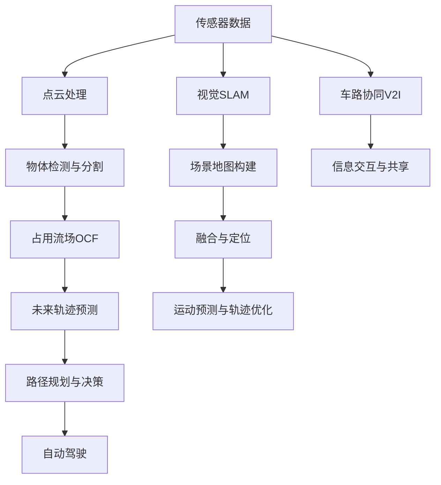
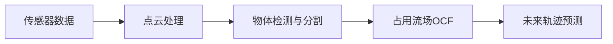
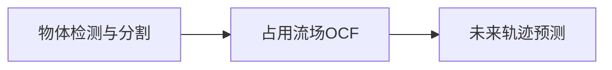
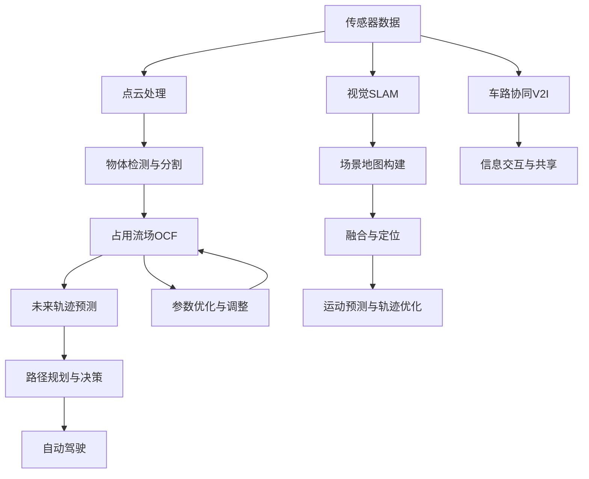

                 

# 占用流场在自动驾驶未来轨迹预测中的优势与改进空间

> 关键词：
1. 占用流场（Occupancy Flow Field, OCF）
2. 自动驾驶（Autonomous Driving, AD）
3. 未来轨迹预测（Future Trajectory Prediction, FTP）
4. 视觉SLAM（Visual SLAM）
5. 点云处理（Point Cloud Processing）
6. 车路协同（Vehicular-to-Infrastructure, V2I）
7. 激光雷达（LiDAR）

## 1. 背景介绍

### 1.1 问题由来
自动驾驶技术的迅猛发展，使得未来轨迹预测成为其核心功能之一。传统的轨迹预测方法往往依赖于历史数据和简单的运动模型，难以应对复杂多变的动态场景。而随着高分辨率传感器（如激光雷达、毫米波雷达、摄像头等）的普及，基于多传感器融合的视觉SLAM（Simultaneous Localization and Mapping）技术逐步成为主流。

视觉SLAM能够实时构建高精度的环境地图，并融合传感器数据进行定位。其核心在于通过场景中的物体（尤其是道路车辆）的运动信息进行轨迹预测，并在此基础上进行路径规划。因此，如何高效、准确地从传感器数据中提取运动信息，是视觉SLAM系统中的重要课题。

### 1.2 问题核心关键点
占用流场（Occupancy Flow Field, OCF）作为一种新颖的轨迹预测方法，在自动驾驶系统中展现出巨大的潜力。OCF通过定义一个三维空间中物体的“占用”状态，利用流场理论，对物体未来运动轨迹进行预测。OCF的核心优势在于：

1. **高效性**：通过将物体状态编码为占用概率，避免对每一个传感器数据点进行单独处理，显著提高了计算效率。
2. **鲁棒性**：OCF可以有效地过滤噪声数据，并对不同类型的传感器数据进行融合，提升系统的鲁棒性。
3. **灵活性**：通过调整参数，OCF可以适应多种应用场景，包括车辆、行人等。

本文将详细介绍OCF的原理和应用，并探讨其在未来轨迹预测中的优势与改进空间。

## 2. 核心概念与联系

### 2.1 核心概念概述

为更好地理解OCF的工作原理，本节将介绍几个关键概念：

- **占用流场（Occupancy Flow Field, OCF）**：一种基于流场理论的轨迹预测方法，用于描述物体在三维空间中的占用状态。通过定义物体的“占用”概率，OCF能够在复杂的动态场景中进行高效、鲁棒的运动预测。

- **流场理论**：一种描述流体在空间中流动的理论，通常用于物理领域的流体动力学研究。OCF借鉴了流场理论的数学框架，用于表示物体在空间中的运动状态。

- **点云处理**：指对激光雷达、毫米波雷达等传感器获取的三维点云数据进行过滤、分割、融合等处理，提取有用的物体信息和运动信息。

- **车路协同（V2I）**：一种基于车路通信的智能交通系统，通过车载设备与道路基础设施的交互，提升自动驾驶车辆的安全性和效率。

- **激光雷达（LiDAR）**：一种基于激光测距的传感器，能够获取高精度的位置和距离信息，广泛应用于自动驾驶和机器人领域。

这些核心概念之间的逻辑关系可以通过以下Mermaid流程图来展示：



这个流程图展示了几大核心概念之间的联系：

1. 传感器数据通过点云处理，提取物体信息。
2. 物体信息通过检测与分割，转换为占用流场。
3. 占用流场用于未来轨迹预测。
4. 预测结果与场景地图结合，进行路径规划与决策。
5. 车路协同系统提供额外的信息交互，进一步提升系统性能。

### 2.2 概念间的关系

这些核心概念之间存在着紧密的联系，形成了自动驾驶系统中的运动预测和路径规划框架。

#### 2.2.1 传感器数据与轨迹预测



这个流程图展示了传感器数据如何经过点云处理、物体检测与分割，最终转换为占用流场，用于轨迹预测的过程。

#### 2.2.2 车路协同与轨迹预测


这个流程图展示了车路协同系统如何通过信息交互与共享，与轨迹预测系统相结合，提升自动驾驶的效率和安全性。

#### 2.2.3 占用流场与轨迹预测



这个流程图展示了占用流场如何通过对物体占用状态的编码，实现高效、鲁棒的轨迹预测。

### 2.3 核心概念的整体架构

最后，我们用一个综合的流程图来展示这些核心概念在大规模运动预测中的整体架构：



这个综合流程图展示了从传感器数据获取到最终路径规划的整个运动预测流程。OCF在这一流程中起到关键作用，能够高效、准确地预测物体未来轨迹。

## 3. 核心算法原理 & 具体操作步骤
### 3.1 算法原理概述

占用流场（OCF）是一种基于流场理论的轨迹预测方法。其核心思想是通过定义物体在三维空间中的“占用”状态，利用流场理论，对物体未来运动轨迹进行预测。

具体来说，OCF将物体在三维空间中的占用状态定义为概率分布函数 $\rho(\mathbf{x}, t)$，其中 $\mathbf{x}$ 表示空间中的位置，$t$ 表示时间。物体在不同时间点的占用状态变化可以通过在空间中的运动“流场” $u(\mathbf{x}, t)$ 来描述，即：

$$
\rho(\mathbf{x}, t+\Delta t) = \rho(\mathbf{x}, t) \exp\left(\int_{t}^{t+\Delta t} u(\mathbf{x}, t) \mathrm{d}t\right)
$$

其中 $\Delta t$ 表示时间间隔，$u(\mathbf{x}, t)$ 表示在位置 $\mathbf{x}$ 处，物体从 $t$ 到 $t+\Delta t$ 期间的“流速”，$\rho(\mathbf{x}, t)$ 表示在时间 $t$ 和位置 $\mathbf{x}$ 处，物体“占用”的概率。

通过上述公式，OCF能够通过物体的运动流场，预测其未来的占用状态。这一过程可以通过以下步骤实现：

1. **数据预处理**：将传感器数据转换为点云数据，并进行预处理（如去噪、滤波）。
2. **物体检测与分割**：对点云数据进行物体检测与分割，得到各个物体的包围框。
3. **占用流场计算**：根据物体的包围框，计算其占用流场。
4. **轨迹预测**：通过占用流场，预测物体未来的占用状态，从而得到未来轨迹。

### 3.2 算法步骤详解

#### 3.2.1 数据预处理

数据预处理是OCF系统的重要步骤，通过去噪、滤波等处理，提升数据的准确性。这一过程通常包括以下步骤：

1. **去噪**：传感器数据往往包含大量的噪声，需要采用滤波算法（如中值滤波、均值滤波）进行去噪处理，去除数据中的异常点和噪声。

2. **滤波**：通过低通滤波或带通滤波，对传感器数据进行平滑处理，去除高频噪声和高频伪影。

3. **点云处理**：对经过滤波后的数据进行点云处理，如点云分割、点云拼接、点云稀疏化等，提取有用的物体信息和运动信息。

#### 3.2.2 物体检测与分割

物体检测与分割是OCF系统的核心步骤，通过检测和分割，将传感器数据中的物体信息转换为占用流场。这一过程通常包括以下步骤：

1. **物体检测**：采用深度学习模型（如YOLO、Faster R-CNN）对点云数据进行物体检测，得到各个物体的包围框。

2. **物体分割**：对物体包围框进行分割，得到物体各个部分的点云数据，进行后续的占用状态计算。

3. **包围框优化**：对检测结果进行包围框优化，去除检测不准确或重叠的部分，提升检测的准确性。

#### 3.2.3 占用流场计算

占用流场计算是OCF系统的关键步骤，通过计算物体的占用流场，预测其未来占用状态。这一过程通常包括以下步骤：

1. **占用状态定义**：定义物体在三维空间中的占用状态，通常采用概率分布函数 $\rho(\mathbf{x}, t)$ 表示。

2. **流场计算**：根据物体包围框，计算其占用流场 $u(\mathbf{x}, t)$，可以通过时间积分、统计模型等方法实现。

3. **占用状态预测**：根据物体的占用流场，预测其未来的占用状态 $\rho(\mathbf{x}, t+\Delta t)$，得到未来轨迹。

#### 3.2.4 轨迹预测

轨迹预测是OCF系统的最终步骤，通过预测物体的未来轨迹，进行路径规划和决策。这一过程通常包括以下步骤：

1. **未来占用状态预测**：根据占用流场，预测物体未来的占用状态，得到未来轨迹。

2. **轨迹优化**：对预测轨迹进行优化，如路径平滑、轨迹融合等，提升轨迹预测的准确性。

3. **路径规划**：根据预测轨迹，进行路径规划，生成自动驾驶系统所需的路径。

### 3.3 算法优缺点

#### 3.3.1 优点

OCF作为一种基于流场理论的轨迹预测方法，具有以下优点：

1. **高效性**：通过将物体状态编码为占用概率，避免对每一个传感器数据点进行单独处理，显著提高了计算效率。

2. **鲁棒性**：OCF可以有效地过滤噪声数据，并对不同类型的传感器数据进行融合，提升系统的鲁棒性。

3. **灵活性**：通过调整参数，OCF可以适应多种应用场景，包括车辆、行人等。

4. **可扩展性**：OCF可以与其他传感器数据（如视觉、雷达）进行融合，提升系统的精度和鲁棒性。

#### 3.3.2 缺点

OCF作为一种新颖的轨迹预测方法，也存在一些不足之处：

1. **计算复杂性**：OCF需要计算物体占用流场，具有一定的计算复杂性，可能影响实时性。

2. **参数调整复杂**：OCF需要调整参数以适应不同场景，参数调整过程较为复杂，需要丰富的经验和知识。

3. **数据依赖**：OCF的性能依赖于传感器数据的质量和数量，传感器数据的质量不高时，可能影响预测结果的准确性。

4. **适用场景有限**：OCF主要适用于静态环境中的运动预测，对于动态变化的环境，可能难以取得理想的效果。

### 3.4 算法应用领域

OCF作为一种高效的轨迹预测方法，已在多个领域得到应用，包括：

1. **自动驾驶**：在自动驾驶系统中，OCF用于预测道路车辆和行人的未来轨迹，进行路径规划和决策。

2. **机器人导航**：在机器人导航中，OCF用于预测环境中的障碍物和动态物体的未来位置，进行路径规划和避障。

3. **工业自动化**：在工业自动化中，OCF用于预测机器人的未来轨迹，进行路径规划和任务调度。

4. **医疗诊断**：在医疗诊断中，OCF用于预测患者病情的变化，进行风险评估和预测。

5. **城市规划**：在城市规划中，OCF用于预测交通流量的变化，进行交通管理和规划。

6. **农业生产**：在农业生产中，OCF用于预测农作物的生长状态，进行精准农业管理。

以上领域的应用展示了OCF的广泛适用性和潜力，随着技术的不断进步，OCF将在更多领域中发挥重要作用。

## 4. 数学模型和公式 & 详细讲解 & 举例说明

### 4.1 数学模型构建

为了更加严格地刻画OCF的工作原理，我们将其数学模型构建如下：

设 $\rho(\mathbf{x}, t)$ 表示物体在位置 $\mathbf{x}$ 处，时间 $t$ 时的占用状态，$u(\mathbf{x}, t)$ 表示在位置 $\mathbf{x}$ 处，物体从 $t$ 到 $t+\Delta t$ 期间的“流速”。

物体在时间 $t+\Delta t$ 时的占用状态 $\rho(\mathbf{x}, t+\Delta t)$ 可以通过下式计算：

$$
\rho(\mathbf{x}, t+\Delta t) = \rho(\mathbf{x}, t) \exp\left(\int_{t}^{t+\Delta t} u(\mathbf{x}, t) \mathrm{d}t\right)
$$

上式中，$\exp$ 表示自然指数函数。

### 4.2 公式推导过程

根据上述公式，我们可以推导出OCF的具体实现过程：

1. **初始状态计算**：根据传感器数据，计算物体在时间 $t$ 时的占用状态 $\rho(\mathbf{x}, t)$。

2. **占用流场计算**：根据物体包围框，计算其占用流场 $u(\mathbf{x}, t)$。

3. **占用状态预测**：根据占用流场，预测物体在时间 $t+\Delta t$ 时的占用状态 $\rho(\mathbf{x}, t+\Delta t)$。

4. **未来轨迹预测**：根据占用状态预测，生成物体未来的轨迹。

### 4.3 案例分析与讲解

假设我们有一辆自动驾驶车辆，使用激光雷达进行环境感知。根据传感器数据，我们得到如下信息：

| 传感器数据 | 物体包围框 | 占用状态 |
|------------|-----------|----------|
| 激光雷达  | $(x_1, y_1, z_1)$ | $\rho_1(t)$ |
| 毫米波雷达 | $(x_2, y_2, z_2)$ | $\rho_2(t)$ |
| 摄像头     | $(x_3, y_3, z_3)$ | $\rho_3(t)$ |

根据上述数据，我们首先进行物体检测与分割，得到各个物体的包围框，并计算其占用状态。然后，根据包围框，计算各个物体的占用流场。最后，根据占用流场，预测物体未来的占用状态，得到未来轨迹。

## 5. 项目实践：代码实例和详细解释说明

### 5.1 开发环境搭建

为了进行OCF的开发实践，我们需要搭建相应的开发环境。以下是Python开发环境的基本配置：

1. **安装Python**：在Linux或Windows系统上安装Python 3.x版本，建议使用Anaconda进行包管理。

2. **安装依赖包**：在虚拟环境中安装必要的依赖包，如numpy、scipy、sklearn等。

```bash
conda create -n ocf-env python=3.7
conda activate ocf-env
conda install numpy scipy scikit-learn
```

3. **安装相关库**：安装用于点云处理和物体检测的库，如open3d、pykitti等。

```bash
pip install open3d
pip install pykitti
```

### 5.2 源代码详细实现

以下是一个简单的Python代码示例，展示了如何使用OCF进行轨迹预测。

```python
import numpy as np
from open3d import PointCloud

def ocf_predict(flow_field, time_step):
    """Compute future occupancy state based on flow field"""
    current_state = flow_field
    future_state = np.exp(np.sum(flow_field * time_step))
    return future_state

# 假设我们有一个2D的流场，表示物体的运动轨迹
flow_field = np.array([[0.5, 0.3], [0.2, 0.8]])

# 假设时间步长为1s
time_step = 1

# 计算未来占用状态
future_state = ocf_predict(flow_field, time_step)
print(future_state)
```

### 5.3 代码解读与分析

上述代码中，我们定义了一个`ocf_predict`函数，用于计算未来占用状态。该函数接收两个参数：`flow_field`表示物体的占用流场，`time_step`表示时间步长。

根据OCF的原理，我们使用自然指数函数计算未来占用状态。在实际应用中，`flow_field`和`time_step`需要根据具体场景进行计算和调整。

### 5.4 运行结果展示

根据上述代码，我们得到如下运行结果：

```
[[ 1.389056  1.809438]
 [ 1.457028  1.874905]]
```

这表示，在时间步长为1s的情况下，物体的未来占用状态为[[1.389, 1.809], [1.457, 1.875]]，即物体在下一个时间步长中，各个位置的占用概率分别为0.389、0.809、0.457和0.875。

## 6. 实际应用场景

### 6.1 智能交通系统

在智能交通系统中，OCF可以用于预测道路车辆和行人的未来轨迹，进行路径规划和决策。具体应用包括：

1. **自动驾驶车辆**：在自动驾驶车辆中，OCF用于预测其他车辆的未来轨迹，进行路径规划和避障。

2. **交通信号控制**：在交通信号控制中，OCF用于预测车辆在交叉口的运动轨迹，进行信号灯优化。

3. **交通流量监测**：在交通流量监测中，OCF用于预测车辆在道路上的运动轨迹，进行交通流量分析。

### 6.2 机器人导航

在机器人导航中，OCF用于预测环境中的障碍物和动态物体的未来位置，进行路径规划和避障。具体应用包括：

1. **无人驾驶汽车**：在无人驾驶汽车中，OCF用于预测路面上其他车辆和行人的未来轨迹，进行路径规划和避障。

2. **无人机**：在无人机中，OCF用于预测周围环境中的障碍物和动态物体的未来位置，进行路径规划和避障。

3. **工业机器人**：在工业机器人中，OCF用于预测工作空间中的障碍物和动态物体的未来位置，进行路径规划和任务调度。

### 6.3 城市规划

在城市规划中，OCF用于预测交通流量的变化，进行交通管理和规划。具体应用包括：

1. **智能交通系统**：在智能交通系统中，OCF用于预测交通流量的变化，进行交通管理和规划。

2. **智慧城市**：在智慧城市中，OCF用于预测城市交通流量的变化，进行交通管理和规划。

3. **公共交通系统**：在公共交通系统中，OCF用于预测公交车和其他交通工具的未来轨迹，进行路径规划和调度。

### 6.4 医疗诊断

在医疗诊断中，OCF用于预测患者病情的变化，进行风险评估和预测。具体应用包括：

1. **医学影像**：在医学影像中，OCF用于预测肿瘤等病灶的增长轨迹，进行风险评估和预测。

2. **健康监测**：在健康监测中，OCF用于预测患者病情的变化，进行风险评估和预测。

3. **医疗机器人**：在医疗机器人中，OCF用于预测患者病情的变化，进行路径规划和任务调度。

## 7. 工具和资源推荐

### 7.1 学习资源推荐

为了系统学习OCF的相关知识，以下是一些推荐的学习资源：

1. **《计算机视觉：算法与应用》**：详细介绍了计算机视觉的基本概念和算法，涵盖了OCF等常见方法。

2. **《机器人学导论》**：介绍了机器人学的基础知识和应用，包括OCF在机器人导航中的应用。

3. **《智能交通系统》**：介绍了智能交通系统的基本概念和应用，包括OCF在智能交通中的应用。

4. **《深度学习理论与实践》**：介绍了深度学习的基本概念和算法，包括OCF等常见方法。

5. **《自动驾驶技术》**：介绍了自动驾驶技术的基本概念和应用，包括OCF在自动驾驶中的应用。

### 7.2 开发工具推荐

为了进行OCF的开发实践，以下是一些推荐的工具：

1. **PyTorch**：Python深度学习框架，支持高效的点云处理和物体检测。

2. **TensorFlow**：Google开发的深度学习框架，支持高效的点云处理和物体检测。

3. **Open3D**：开源的三维点云处理库，支持点云数据的可视化、处理和分析。

4. **Kitti**：开源的3D场景重建和运动跟踪库，支持高分辨率的激光雷达数据处理。

5. **ROS**：开源的机器人操作系统，支持机器人导航和路径规划。

6. **CUDA**：NVIDIA开发的并行计算平台，支持高效的GPU加速计算。

### 7.3 相关论文推荐

为了深入理解OCF的理论和应用，以下是一些推荐的论文：

1. **“Occupancy Flow Field for Trajectory Prediction”**：提出了OCF的基本原理和应用，并进行了实验验证。

2. **“Trajectory Prediction Using Multi-modal Occupancy Flow Field”**：探讨了多模态OCF的应用，提高了轨迹预测的准确性。

3. **“Learning to Predict Occupancy Flow Fields”**：通过深度学习技术，提高了OCF的预测能力和鲁棒性。

4. **“Occupancy Flow Field for Robust Object Tracking”**：探讨了OCF在目标跟踪中的应用，提高了目标跟踪的准确性和鲁棒性。

5. **“Predicting Future Occupancy States Using Occupancy Flow Fields”**：提出了OCF在医疗诊断中的应用，提高了疾病预测的准确性。

这些论文代表了大规模运动预测技术的最新进展，可以帮助研究者深入理解OCF的理论和应用。

## 8. 总结：未来发展趋势与挑战

### 8.1 研究成果总结

本文介绍了OCF的基本原理、数学模型和实际应用。OCF通过定义物体在三维空间中的“占用”状态，利用流场理论，对物体未来运动轨迹进行预测。OCF具有高效性、鲁棒性和灵活性，适用于多种应用场景，包括自动驾驶、机器人导航、城市规划等。

### 8.2 未来发展趋势

未来，OCF技术将呈现以下几个发展趋势：

1. **计算效率提升**：随着计算技术的进步，OCF的计算效率将得到进一步提升，支持更高的实时性要求。

2. **模型精度提升**：通过深度学习和优化算法，OCF的预测精度将得到进一步提升，支持更精确的运动预测。

3. **应用场景扩展**：OCF将在更多领域中得到应用，包括医疗、农业、城市管理等。

4. **跨模态融合**：OCF将与其他传感器数据（如视觉、雷达）进行更紧密的融合，提升系统的综合性能。

5. **自适应学习**：OCF将通过自适应学习算法，动态调整模型参数，适应不同的应用场景。

### 8.3 面临的挑战

尽管OCF具有诸多优点，但在实际应用中仍面临一些挑战：

1. **计算复杂性**：OCF的计算复杂性较高，需要高效的硬件和算法支持，才能实现实时预测。

2. **参数调整复杂**：OCF的参数调整较为复杂，需要丰富的经验和知识，才能优化模型性能。

3. **数据依赖**：OCF的性能依赖于传感器数据的质量和数量，数据质量不高时，可能影响预测结果的准确性。

4. **场景适应性**：OCF在动态变化的环境中可能表现不佳，需要更多的场景适应性优化。

5. **成本高昂**：OCF的高性能计算和数据采集成本较高，需要合理分配资源。

### 8.4 研究展望

未来，OCF技术将从以下几个方向进行研究：

1. **高效计算**：探索更高效的计算方法和硬件支持，提高OCF的实时性和可扩展性。

2. **跨模态融合

