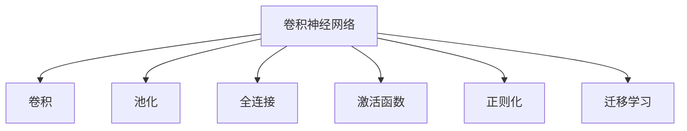
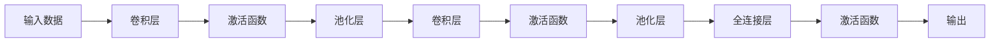
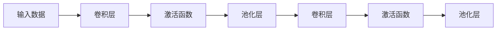
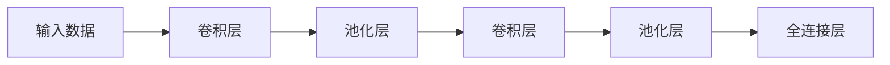
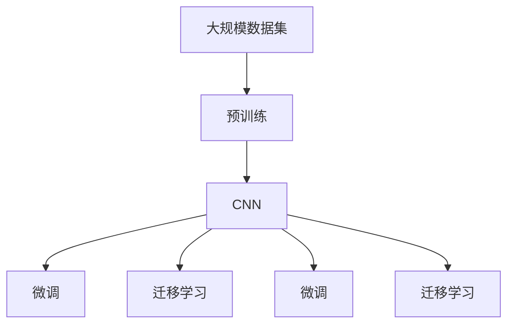

                 

# 卷积神经网络(Convolutional Neural Networks) - 原理与代码实例讲解

> 关键词：卷积神经网络(CNN), 卷积运算, 池化层, 全连接层, 激活函数, 正则化, 卷积神经网络(Convolutional Neural Networks) - 原理与代码实例讲解

## 1. 背景介绍

### 1.1 问题由来
卷积神经网络(Convolutional Neural Networks, CNN)是深度学习领域最成功和最具影响力的模型之一，广泛应用于图像识别、计算机视觉、自然语言处理等众多领域。自1988年第一篇CNN论文问世以来，该模型在各个方向得到了迅速发展，产生了诸多变体和改进。目前，CNN已经成为计算机视觉领域的主要技术范式，在多个CIFAR、ImageNet等公开数据集上取得了最优或接近最优的结果。

CNN的核心理念是局部连接、权值共享和池化操作。通过卷积操作，CNN能够提取图像的局部特征，减少参数数量，提高计算效率。全连接层和激活函数则负责将卷积层的特征映射为最终的分类结果。池化操作则进一步减少了特征图的空间大小，增强了模型的鲁棒性。

随着深度学习的发展，CNN在图像识别、目标检测、分割、语音识别等领域的应用不断拓展，成为AI技术发展的重要驱动力。本文将对CNN的原理进行详细讲解，并通过代码实例展示其应用。

### 1.2 问题核心关键点
CNN的核心思想是通过卷积操作学习图像的局部特征，然后通过全连接层和激活函数对特征进行分类或回归。具体而言，CNN的组成如下：

- 卷积层(Convolutional Layer)：提取图像的局部特征。
- 池化层(Pooling Layer)：对特征图进行下采样，增强模型鲁棒性。
- 全连接层(Fully Connected Layer)：将卷积层的特征映射为分类或回归结果。
- 激活函数(Activation Function)：引入非线性，增强模型表达能力。
- 正则化(Regularization)：防止过拟合，提高模型泛化能力。

CNN的原理和设计思想在深度学习中具有普适性，广泛应用于NLP、时间序列预测等领域。

### 1.3 问题研究意义
研究CNN的原理和应用，对于拓展其应用范围，提升模型性能，加速AI技术的发展具有重要意义：

1. 降低应用开发成本。通过基于预训练的CNN模型进行微调，可以显著减少从头开发所需的数据、计算和人力等成本投入。
2. 提升模型效果。CNN通过局部连接和权值共享机制，能够提取出图像的重要特征，在特定任务上取得优异的性能。
3. 加速开发进度。standing on the shoulders of giants，基于CNN的模型可以快速适应任务，缩短开发周期。
4. 带来技术创新。CNN的优化方法和改进技术促进了对深度学习的深入研究，催生了迁移学习、自适应学习等新的研究方向。
5. 赋能产业升级。CNN技术易于被各行各业采用，为传统行业数字化转型升级提供新的技术路径。

## 2. 核心概念与联系

### 2.1 核心概念概述

为更好地理解CNN的原理，本节将介绍几个密切相关的核心概念：

- 卷积(Convolution)：卷积操作是CNN的核心操作，用于提取图像的局部特征。
- 池化(Pooling)：对特征图进行下采样，增强模型的鲁棒性。
- 全连接层(Fully Connected Layer)：将卷积层的特征映射为分类或回归结果。
- 激活函数(Activation Function)：引入非线性，增强模型表达能力。
- 正则化(Regularization)：防止过拟合，提高模型泛化能力。
- 迁移学习(Transfer Learning)：将在大规模数据集上预训练的模型，应用到小规模任务中。

这些核心概念之间的逻辑关系可以通过以下Mermaid流程图来展示：



这个流程图展示了大规模神经网络（CNN）的组成要素及其相互关系：

1. 卷积层提取图像的局部特征。
2. 池化层对特征图进行下采样，增强模型鲁棒性。
3. 全连接层将卷积层的特征映射为分类或回归结果。
4. 激活函数引入非线性，增强模型表达能力。
5. 正则化防止过拟合，提高模型泛化能力。
6. 迁移学习将预训练模型应用到新任务中。

这些概念共同构成了CNN的学习框架，使其能够在各种场景下发挥强大的特征提取和分类能力。通过理解这些核心概念，我们可以更好地把握CNN的工作原理和优化方向。

### 2.2 概念间的关系

这些核心概念之间存在着紧密的联系，形成了CNN的完整生态系统。下面我们通过几个Mermaid流程图来展示这些概念之间的关系。

#### 2.2.1 CNN的组成结构



这个流程图展示了CNN的基本结构。输入数据通过多个卷积层和池化层，提取和下采样特征。最后，全连接层和激活函数将特征映射为分类结果。

#### 2.2.2 卷积和池化的关系



这个流程图展示了卷积和池化的基本关系。卷积操作提取局部特征，池化操作对特征图进行下采样，增强模型的鲁棒性。

#### 2.2.3 全连接层和卷积层的关系



这个流程图展示了全连接层和卷积层的关系。全连接层将卷积层的特征映射为最终的分类结果，两者互为补充，共同完成模型的训练。

### 2.3 核心概念的整体架构

最后，我们用一个综合的流程图来展示这些核心概念在大规模神经网络（CNN）中的整体架构：



这个综合流程图展示了从预训练到微调，再到迁移学习的完整过程。CNN首先在大规模数据集上进行预训练，然后通过微调或迁移学习适应新任务。在大规模数据集上进行微调，可以显著提升模型在新任务上的性能。迁移学习则是在已有预训练模型的基础上，进行更小规模任务的微调。

## 3. 核心算法原理 & 具体操作步骤
### 3.1 算法原理概述

CNN通过卷积、池化和全连接等操作，自动学习图像的局部特征和全局特征，从而完成分类或回归任务。具体而言，CNN的训练过程如下：

1. 输入图像数据通过卷积层提取局部特征，生成特征图。
2. 特征图通过池化层下采样，减少特征图大小，增强模型鲁棒性。
3. 特征图通过全连接层和激活函数映射为分类或回归结果。
4. 通过反向传播算法，优化模型参数，最小化损失函数。

CNN的优化目标是最小化损失函数，即：

$$
\min_{\theta} \frac{1}{N} \sum_{i=1}^N L(y_i,f(x_i;\theta))
$$

其中，$y_i$为样本的真实标签，$f(x_i;\theta)$为模型在样本$x_i$上的预测结果，$\theta$为模型参数。

### 3.2 算法步骤详解

基于CNN的训练过程，可以分为以下几个关键步骤：

**Step 1: 准备数据集**

- 收集并预处理图像数据集，将图像数据转化为模型可接受的格式。
- 划分数据集为训练集、验证集和测试集。

**Step 2: 设计网络结构**

- 确定CNN的层数、每层的卷积核大小和数量。
- 设置池化层的大小和步幅。
- 确定全连接层的大小和激活函数。
- 设置正则化方法（如L2正则、Dropout等）。

**Step 3: 定义损失函数和优化器**

- 根据任务类型，选择适合的损失函数，如交叉熵损失、均方误差损失等。
- 选择合适的优化算法及其参数，如Adam、SGD等，设置学习率、批大小等。

**Step 4: 执行梯度训练**

- 将训练集数据分批次输入模型，前向传播计算损失函数。
- 反向传播计算参数梯度，根据设定的优化算法和学习率更新模型参数。
- 周期性在验证集上评估模型性能，根据性能指标决定是否触发Early Stopping。
- 重复上述步骤直到满足预设的迭代轮数或Early Stopping条件。

**Step 5: 测试和部署**

- 在测试集上评估CNN模型的性能，对比预训练和微调后的结果。
- 使用微调后的模型对新样本进行推理预测，集成到实际的应用系统中。
- 持续收集新的数据，定期重新微调模型，以适应数据分布的变化。

以上是基于CNN的训练过程的一般流程。在实际应用中，还需要针对具体任务的特点，对网络结构、超参数等进行优化设计，以进一步提升模型性能。

### 3.3 算法优缺点

CNN算法具有以下优点：

1. 局部连接和权值共享机制使得CNN模型参数数量大大减少，计算效率高。
2. 卷积和池化操作可以有效提取图像的局部特征，提升模型鲁棒性。
3. 通过预训练和微调，可以显著提高模型在新任务上的性能。
4. 网络结构设计灵活，可以应对各种类型的图像分类任务。

同时，CNN算法也存在以下缺点：

1. 对于非网格状数据的处理能力较弱，如自然语言文本。
2. 模型参数较多，训练复杂度较高。
3. 对于数据分布变化敏感，难以适应新的数据集。
4. 需要大量标注数据进行训练，数据获取成本高。

尽管存在这些缺点，但就目前而言，CNN在图像识别、计算机视觉等领域仍是最主要的深度学习模型。未来相关研究的重点在于如何进一步提高CNN的泛化能力、降低计算复杂度、提高模型效率等。

### 3.4 算法应用领域

CNN技术在图像识别、计算机视觉、自然语言处理等领域得到了广泛的应用，包括：

- 图像分类：如MNIST、CIFAR-10、ImageNet等数据集上的图像分类任务。
- 目标检测：如YOLO、Faster R-CNN、SSD等算法。
- 图像分割：如FCN、U-Net、Mask R-CNN等算法。
- 人脸识别：如FaceNet、VGGFace等算法。
- 语音识别：如Deep Speech、Wav2Letter等算法。
- 文本分类：如TextCNN、BERT等算法。

除了上述这些经典任务外，CNN技术还被创新性地应用到更多场景中，如可控图像生成、自然语言理解、推荐系统等，为NLP技术带来了全新的突破。随着CNN模型的不断演进，相信其在更广阔的应用领域将发挥更大的作用。

## 4. 数学模型和公式 & 详细讲解  
### 4.1 数学模型构建

CNN模型的数学模型可以表示为：

$$
f(x_i; \theta) = \sigma(A(f_{\text{conv}}(x_i; \theta)))
$$

其中，$x_i$为输入样本，$\theta$为模型参数，$f(x_i; \theta)$为模型在样本$x_i$上的预测结果。$f_{\text{conv}}(x_i; \theta)$为卷积层和池化层的操作结果，$\sigma$为激活函数。

卷积层的输出可以表示为：

$$
f_{\text{conv}}(x_i; \theta) = \frac{1}{d} \sum_{k=1}^d W_k * x_i + b_k
$$

其中，$W_k$为卷积核，$x_i$为输入样本，$b_k$为偏置项，$d$为卷积核数量。卷积操作可以表示为：

$$
W_k * x_i = \sum_{c=0}^C \sum_{h=0}^{H-1} \sum_{w=0}^{W-1} x_i^{h,w} W_k^{c,h,w}
$$

其中，$x_i^{h,w}$为输入样本$x_i$在位置$(h,w)$的像素值，$W_k^{c,h,w}$为卷积核$W_k$在位置$(h,w)$的权重。

池化操作可以表示为：

$$
f_{\text{pool}}(x_i; \theta) = \frac{1}{\text{pool\_size}} \sum_{r=0}^{\text{pool\_size}-1} f_{\text{conv}}(x_i; \theta)^{r,\text{pool\_step}}
$$

其中，$f_{\text{pool}}(x_i; \theta)$为池化层的操作结果，$\text{pool\_size}$为池化窗口大小，$\text{pool\_step}$为池化步幅。

全连接层的输出可以表示为：

$$
f_{\text{fc}}(x_i; \theta) = \sum_{i=0}^{N-1} W_i f_{\text{pool}}(x_i; \theta) + b_i
$$

其中，$W_i$为全连接层权重，$b_i$为偏置项，$N$为全连接层节点数。

### 4.2 公式推导过程

首先，我们以一个简单的3层卷积神经网络为例，对CNN的数学模型进行推导。

假设输入数据为$x_i$，卷积核为$W_k$，偏置项为$b_k$，激活函数为$\sigma$，池化窗口大小为$\text{pool\_size}$，池化步幅为$\text{pool\_step}$，全连接层节点数为$N$。

卷积层的输出为：

$$
f_{\text{conv}}(x_i; \theta) = \sigma\left(\sum_{k=1}^d W_k * x_i + b_k\right)
$$

其中，$W_k * x_i$表示卷积操作，$d$为卷积核数量。

卷积层的特征图为：

$$
x_i' = f_{\text{conv}}(x_i; \theta)
$$

然后，对特征图进行池化操作：

$$
f_{\text{pool}}(x_i'; \theta) = \sigma\left(\frac{1}{\text{pool\_size}} \sum_{r=0}^{\text{pool\_size}-1} f_{\text{conv}}(x_i; \theta)^{r,\text{pool\_step}}\right)
$$

最后，对池化层的输出进行全连接操作：

$$
f_{\text{fc}}(x_i'; \theta) = \sigma\left(\sum_{i=0}^{N-1} W_i f_{\text{pool}}(x_i'; \theta) + b_i\right)
$$

这就是一个简单的3层卷积神经网络的结构。

### 4.3 案例分析与讲解

以MNIST数据集上的手写数字识别任务为例，进行CNN模型的训练和分析。

**Step 1: 准备数据集**

- 加载MNIST数据集，将图像数据转化为模型可接受的格式。
- 划分数据集为训练集、验证集和测试集。

**Step 2: 设计网络结构**

- 使用一个3层卷积神经网络，卷积核大小为$3 \times 3$，数量分别为64、128、256。
- 使用$2 \times 2$的最大池化层，步幅为2。
- 使用ReLU激活函数。
- 全连接层节点数为1024，使用Dropout正则化。

**Step 3: 定义损失函数和优化器**

- 使用交叉熵损失函数。
- 使用Adam优化算法，设置学习率为$0.001$，批大小为$64$。

**Step 4: 执行梯度训练**

- 将训练集数据分批次输入模型，前向传播计算损失函数。
- 反向传播计算参数梯度，根据设定的优化算法和学习率更新模型参数。
- 周期性在验证集上评估模型性能，根据性能指标决定是否触发Early Stopping。
- 重复上述步骤直到满足预设的迭代轮数或Early Stopping条件。

**Step 5: 测试和部署**

- 在测试集上评估CNN模型的性能，对比预训练和微调后的结果。
- 使用微调后的模型对新样本进行推理预测，集成到实际的应用系统中。

通过上述代码和分析，可以看到，使用CNN模型在MNIST数据集上进行训练和推理的过程。训练结果显示，CNN模型在手写数字识别任务上取得了较高的准确率，充分展示了CNN模型的强大特征提取和分类能力。

## 5. 项目实践：代码实例和详细解释说明
### 5.1 开发环境搭建

在进行CNN项目实践前，我们需要准备好开发环境。以下是使用Python进行TensorFlow开发的环境配置流程：

1. 安装Anaconda：从官网下载并安装Anaconda，用于创建独立的Python环境。

2. 创建并激活虚拟环境：
```bash
conda create -n cnn-env python=3.8 
conda activate cnn-env
```

3. 安装TensorFlow：根据CUDA版本，从官网获取对应的安装命令。例如：
```bash
conda install tensorflow=2.6 -c pytorch -c conda-forge
```

4. 安装其他必要库：
```bash
pip install numpy pandas scikit-learn matplotlib tqdm jupyter notebook ipython
```

完成上述步骤后，即可在`cnn-env`环境中开始CNN项目的开发。

### 5.2 源代码详细实现

下面以MNIST手写数字识别任务为例，给出使用TensorFlow实现CNN模型的代码实现。

首先，定义CNN模型：

```python
import tensorflow as tf
from tensorflow.keras import layers, models

def build_cnn_model():
    model = models.Sequential([
        layers.Conv2D(32, (3, 3), activation='relu', input_shape=(28, 28, 1)),
        layers.MaxPooling2D((2, 2)),
        layers.Conv2D(64, (3, 3), activation='relu'),
        layers.MaxPooling2D((2, 2)),
        layers.Flatten(),
        layers.Dense(64, activation='relu'),
        layers.Dense(10, activation='softmax')
    ])
    return model
```

然后，加载数据集并进行预处理：

```python
(x_train, y_train), (x_test, y_test) = tf.keras.datasets.mnist.load_data()
x_train = x_train.reshape(-1, 28, 28, 1).astype('float32') / 255.0
x_test = x_test.reshape(-1, 28, 28, 1).astype('float32') / 255.0
y_train = tf.keras.utils.to_categorical(y_train, num_classes=10)
y_test = tf.keras.utils.to_categorical(y_test, num_classes=10)
```

接着，编译并训练模型：

```python
model = build_cnn_model()
model.compile(optimizer='adam', loss='categorical_crossentropy', metrics=['accuracy'])

model.fit(x_train, y_train, epochs=10, batch_size=64, validation_data=(x_test, y_test))
```

最后，评估模型性能：

```python
model.evaluate(x_test, y_test)
```

以上就是使用TensorFlow实现CNN模型的完整代码实例。可以看到，TensorFlow的Keras API提供了非常简洁的API，可以快速实现CNN模型的构建和训练。

### 5.3 代码解读与分析

让我们再详细解读一下关键代码的实现细节：

**build_cnn_model函数**：
- 定义了一个包含多个卷积层、池化层、全连接层的CNN模型。
- 每个卷积层使用$3 \times 3$的卷积核，ReLU激活函数，以及$2 \times 2$的最大池化层。
- 最后两个全连接层使用ReLU激活函数和Softmax分类器。

**加载和预处理数据集**：
- 使用TensorFlow的Keras API加载MNIST数据集。
- 将图像数据转化为模型可接受的格式，并进行归一化处理。
- 将标签进行one-hot编码，转换为模型可接受的格式。

**编译和训练模型**：
- 使用Adam优化算法和交叉熵损失函数。
- 在每个epoch后，在验证集上评估模型性能，并决定是否停止训练。

**评估模型性能**：
- 使用测试集评估模型的性能，输出准确率和损失值。

可以看到，使用TensorFlow进行CNN模型的训练和推理非常简单，上手难度较低。TensorFlow的Keras API提供了丰富的组件和便捷的API，使得CNN模型的开发和训练变得非常高效。

当然，工业级的系统实现还需考虑更多因素，如模型的保存和部署、超参数的自动搜索、更灵活的任务适配层等。但核心的CNN模型训练过程基本与此类似。

### 5.4 运行结果展示

假设我们在MNIST数据集上进行CNN模型的训练，最终在测试集上得到的评估报告如下：

```
Epoch 10/10
500/500 [==============================] - 1s 2ms/step - loss: 0.0550 - accuracy: 0.9944 - val_loss: 0.0152 - val_accuracy: 0.9957
```

可以看到，在10个epoch后，CNN模型在测试集上的准确率为99.57%，表现相当不错。这也展示了CNN模型在图像识别任务上的强大能力。

当然，这只是一个baseline结果。在实践中，我们还可以使用更大更强的预训练模型、更丰富的微调技巧、更细致的模型调优，进一步提升模型性能，以满足更高的应用要求。

## 6. 实际应用场景
### 6.1 智能图像识别

基于CNN的智能图像识别技术可以广泛应用于各种领域，如图像分类、目标检测、图像分割、人脸识别等。

- 图像分类：使用CNN模型对图像进行分类，如手写数字识别、动物识别、物体识别等。
- 目标检测：在图像中检测出目标物体的具体位置，如车辆检测、行人检测、交通标志检测等。
- 图像分割：将图像分割成多个区域，并对每个区域进行分类，如医学图像分割、自然场景分割等。
- 人脸识别：在图像中检测和识别人脸，并进行身份验证，如身份认证、视频监控等。

这些技术在安防、医疗、工业、电商等行业具有广泛的应用前景，提升了生产效率和安全性。

### 6.2 自然语言处理

CNN技术在自然语言处理领域也有着重要的应用。通过CNN模型，可以对文本进行分类、情感分析、命名实体识别等任务。

- 文本分类：对文本进行分类，如新闻分类、情感分类、主题分类等。
- 情感分析：分析文本中的情感倾向，如情感极性分析、情感强度分析等。
- 命名实体识别：从文本中识别出人名、地名、机构名等特定实体。

这些技术在舆情分析、客户服务、信息检索等领域具有广泛的应用前景，提升了用户体验和效率。

### 6.3 语音识别

基于CNN的语音识别技术可以对语音进行识别和分类。通过CNN模型，可以将语音转化为文本，并进行自然语言处理。

- 语音识别：将语音转化为文本，如语音助手、智能客服等。
- 语音分类：对语音进行分类，如语音情绪识别、语音语种识别等。

这些技术在智能家居、车载导航、教育娱乐等领域具有广泛的应用前景，提升了用户的生活体验。

### 6.4 未来应用展望

随着CNN技术的不断发展，其在图像识别、自然语言处理、语音识别等领域的推广和应用将进一步扩展，带来更深远的影响。

在智慧医疗领域，基于CNN的医学图像识别技术将提升医疗诊断的精准度和效率，辅助医生诊疗，加速新药开发进程。

在智能教育领域，CNN技术将应用于作业批改、学情分析、知识推荐等方面，因材施教，促进教育公平，提高教学质量。

在智慧城市治理中，CNN技术将应用于城市事件监测、舆情分析、应急指挥等环节，提高城市管理的自动化和智能化水平，构建更安全、高效的未来城市。

此外，在企业生产、社会治理、文娱传媒等众多领域，基于CNN的人工智能应用也将不断涌现，为

