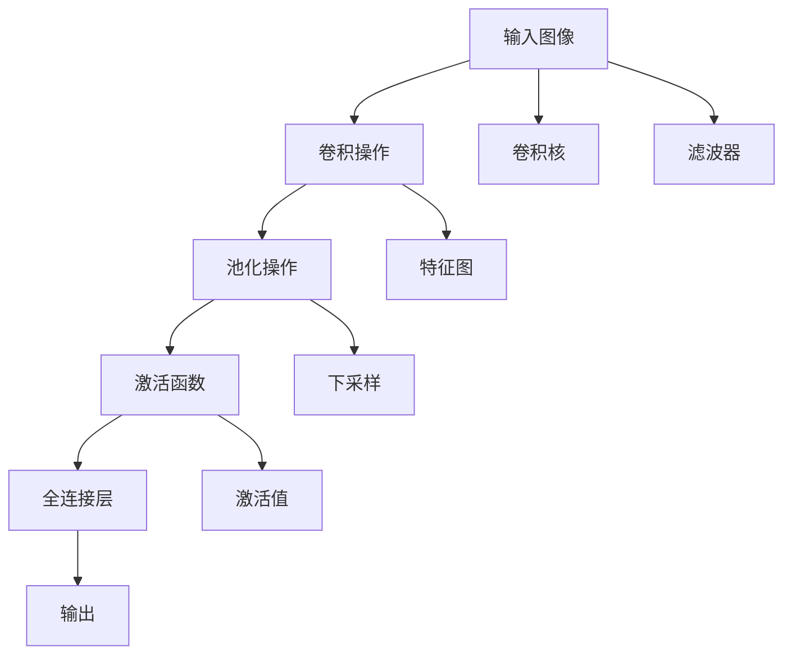
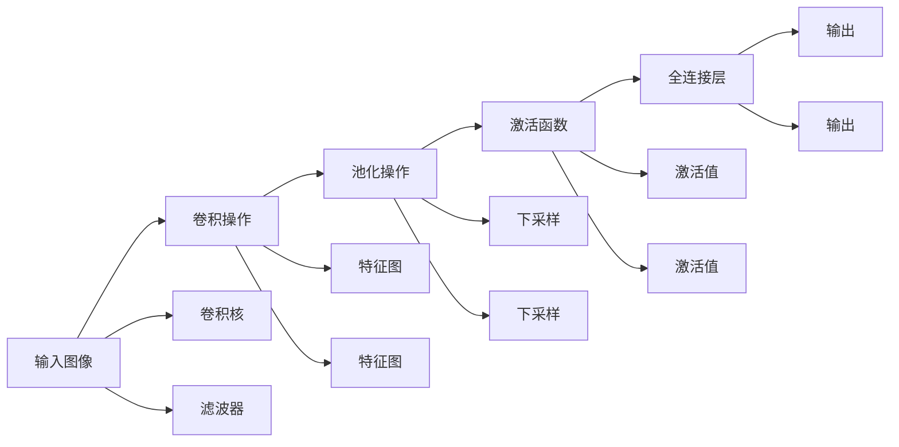

                 

# 卷积神经网络CNN原理与代码实例讲解

> 关键词：卷积神经网络, 卷积操作, 池化操作, 全连接层, 过拟合, 迁移学习, 数据增强, 图像识别

## 1. 背景介绍

卷积神经网络（Convolutional Neural Network, CNN）是一种基于深度学习的神经网络架构，在图像识别、自然语言处理、语音识别等众多领域展现了出色的性能。本文将详细介绍CNN的原理，并通过具体的代码实例，帮助读者理解其核心思想和实现细节。

### 1.1 问题由来

随着深度学习技术的发展，深度神经网络（DNN）在图像、语音等数据驱动任务中表现出了惊人的潜力。然而，由于传统的全连接神经网络在处理图像等高维数据时效率较低，研究者们逐渐探索出能够自动从图像中提取特征的卷积神经网络。CNN的提出，使得图像识别等任务的准确率得到了显著提升，也推动了计算机视觉领域的技术进步。

### 1.2 问题核心关键点

CNN的核心思想在于利用卷积层（Convolutional Layer）和池化层（Pooling Layer）提取图像的局部特征和空间结构，同时利用全连接层（Fully Connected Layer）进行分类。CNN具有以下几个关键点：

- **卷积操作（Convolutional Operation）**：提取图像的局部特征。
- **池化操作（Pooling Operation）**：降低图像的空间分辨率，减少计算量。
- **激活函数（Activation Function）**：引入非线性变换，增加模型的表达能力。
- **全连接层（Fully Connected Layer）**：将卷积层的特征图转换为类别预测。

### 1.3 问题研究意义

研究CNN的原理和实现，对于计算机视觉、语音识别、自然语言处理等领域的技术开发和应用具有重要意义：

1. 提高特征提取能力：通过卷积和池化操作，CNN能够自动从原始数据中提取高层次的特征。
2. 提升模型泛化能力：通过迁移学习，CNN模型可以轻松适应新的数据集和任务。
3. 减少计算量：通过参数共享和降维操作，CNN模型能够在保证精度的同时，显著减少计算资源消耗。
4. 处理高维数据：CNN能够高效处理高维数据，如图像、视频等，大大降低了数据处理难度。
5. 实际应用广泛：CNN在图像分类、目标检测、人脸识别等众多应用中展示了卓越的性能。

## 2. 核心概念与联系

### 2.1 核心概念概述

CNN的构建基于以下几个核心概念：

- **卷积核（Convolution Kernel）**：卷积操作的参数，用于提取局部特征。
- **滤波器（Filter）**：卷积核的别称，用于从图像中提取特定的局部模式。
- **卷积操作（Convolution Operation）**：通过卷积核在图像上滑动，提取局部特征的过程。
- **池化操作（Pooling Operation）**：通过对特征图进行下采样，减少计算量并增强特征鲁棒性。
- **激活函数（Activation Function）**：引入非线性变换，增强模型的表达能力。
- **全连接层（Fully Connected Layer）**：将卷积层的特征转换为类别预测。

这些概念之间存在紧密的联系，构成了CNN的完整结构。下面我们将通过一个Mermaid流程图来展示这些概念之间的关系：



通过这个流程图，我们可以看到，CNN通过卷积核和滤波器进行卷积操作，提取图像的局部特征；通过池化操作进行下采样，减少计算量；通过激活函数引入非线性变换，增强模型的表达能力；最终通过全连接层进行分类。

### 2.2 概念间的关系

这些核心概念之间的关系可以进一步细化为以下几类：

1. **卷积操作与滤波器**：卷积核（滤波器）用于从图像中提取特定的局部模式，通过滑动卷积核在图像上滑动，生成特征图。

2. **池化操作与下采样**：池化操作通过对特征图进行下采样，减少特征图的空间分辨率，同时增强特征的鲁棒性。

3. **激活函数与非线性变换**：激活函数通过引入非线性变换，增加模型的表达能力，使得模型能够学习更复杂的特征。

4. **全连接层与特征图**：全连接层将卷积层的特征图转换为类别预测，是CNN进行分类的关键步骤。

### 2.3 核心概念的整体架构

在CNN的构建中，以上概念的组合和交互构成了CNN的整体架构。下面我们将通过一个综合的Mermaid流程图来展示这些概念在大规模CNN架构中的作用：



通过这个流程图，我们可以清晰地看到，CNN通过卷积操作和滤波器提取图像的局部特征，通过池化操作和下采样减少计算量，通过激活函数引入非线性变换，增强模型的表达能力，最终通过全连接层进行分类。

## 3. 核心算法原理 & 具体操作步骤

### 3.1 算法原理概述

CNN的核心算法原理基于卷积操作和池化操作，其基本思想是通过一系列的卷积和池化操作提取图像的局部特征，再通过全连接层进行分类。

形式化地，设输入图像 $I$ 的尺寸为 $n \times n \times c$，其中 $n$ 为图像高度和宽度，$c$ 为通道数。卷积核（滤波器） $F$ 的尺寸为 $k \times k \times c$，其中 $k$ 为卷积核的尺寸。卷积操作可以表示为：

$$
O(x,y) = \sum_{i=0}^{k-1} \sum_{j=0}^{k-1} F(x+i,y+j) \cdot I(x+i,y+j)
$$

其中 $O(x,y)$ 为卷积操作后的特征图，$F(x+i,y+j)$ 为卷积核在位置 $(x+i,y+j)$ 的值，$I(x+i,y+j)$ 为输入图像在位置 $(x+i,y+j)$ 的值。

### 3.2 算法步骤详解

下面我们将详细介绍CNN的训练和推理过程：

#### 3.2.1 训练过程

CNN的训练过程主要分为前向传播和反向传播两个阶段：

**前向传播**：

1. **卷积操作**：将卷积核 $F$ 在输入图像 $I$ 上滑动，计算特征图 $O$。
2. **池化操作**：对特征图 $O$ 进行池化操作，减少特征图的空间分辨率。
3. **激活函数**：对池化后的特征图进行激活函数处理，引入非线性变换。
4. **全连接层**：将激活函数处理后的特征图输入全连接层，进行分类预测。

**反向传播**：

1. **损失函数**：计算预测结果与真实标签之间的损失函数 $L$。
2. **梯度计算**：计算损失函数对模型参数的梯度，包括卷积核、全连接层等。
3. **参数更新**：使用梯度下降等优化算法，更新模型参数。

#### 3.2.2 推理过程

CNN的推理过程与训练过程类似，但不需要反向传播和参数更新步骤。

1. **卷积操作**：将卷积核 $F$ 在输入图像 $I$ 上滑动，计算特征图 $O$。
2. **池化操作**：对特征图 $O$ 进行池化操作，减少特征图的空间分辨率。
3. **激活函数**：对池化后的特征图进行激活函数处理，引入非线性变换。
4. **全连接层**：将激活函数处理后的特征图输入全连接层，进行分类预测。

### 3.3 算法优缺点

CNN算法具有以下优点：

1. **特征提取能力强**：通过卷积操作和池化操作，CNN能够自动从图像中提取高层次的特征。
2. **计算量小**：通过参数共享和降维操作，CNN模型能够在保证精度的同时，显著减少计算资源消耗。
3. **泛化能力强**：通过迁移学习，CNN模型可以轻松适应新的数据集和任务。

然而，CNN算法也存在一些缺点：

1. **过拟合风险高**：由于CNN模型的复杂性，容易过拟合训练数据。
2. **训练时间长**：由于CNN模型参数量大，训练时间较长。
3. **局部感知能力**：CNN模型只能感知局部特征，难以处理全局信息。

### 3.4 算法应用领域

CNN算法在图像识别、自然语言处理、语音识别等众多领域展现了出色的性能。以下是一些典型应用场景：

1. **图像识别**：CNN可以用于图像分类、目标检测、人脸识别等任务，广泛应用于自动驾驶、医学影像分析等领域。
2. **自然语言处理**：CNN可以用于文本分类、情感分析、机器翻译等任务，推动了自然语言处理技术的进步。
3. **语音识别**：CNN可以用于语音识别、说话人识别等任务，为语音助手、智能家居等应用提供支持。

## 4. 数学模型和公式 & 详细讲解 & 举例说明

### 4.1 数学模型构建

CNN的数学模型构建基于以下假设：

1. 输入图像 $I$ 为二维矩阵，尺寸为 $n \times n$。
2. 卷积核 $F$ 为二维矩阵，尺寸为 $k \times k$。
3. 卷积操作后生成的特征图 $O$ 为二维矩阵，尺寸为 $(n-k+1) \times (n-k+1)$。
4. 池化操作后生成的特征图 $O'$ 为二维矩阵，尺寸为 $\left\lfloor\frac{n-k+1}{p}\right\rfloor \times \left\lfloor\frac{n-k+1}{p}\right\rfloor$，其中 $p$ 为池化操作的步幅。

### 4.2 公式推导过程

下面我们将详细介绍CNN模型的卷积和池化操作的数学推导：

**卷积操作**：

卷积操作可以表示为：

$$
O(x,y) = \sum_{i=0}^{k-1} \sum_{j=0}^{k-1} F(x+i,y+j) \cdot I(x+i,y+j)
$$

其中 $O(x,y)$ 为卷积操作后的特征图，$F(x+i,y+j)$ 为卷积核在位置 $(x+i,y+j)$ 的值，$I(x+i,y+j)$ 为输入图像在位置 $(x+i,y+j)$ 的值。

**池化操作**：

池化操作可以表示为：

$$
O'(x,y) = \max\limits_{x' \in X, y' \in Y} O(x',y')
$$

其中 $O'(x,y)$ 为池化操作后的特征图，$O(x',y')$ 为特征图 $O$ 在位置 $(x',y')$ 的值，$X$ 和 $Y$ 分别为池化操作的窗口位置。

### 4.3 案例分析与讲解

下面我们将通过一个具体的案例，分析CNN模型的卷积和池化操作的实际应用。

**案例：手写数字识别**

假设我们有一张 $28 \times 28$ 的灰度图像 $I$，其中包含手写数字 $0-9$。我们将使用CNN模型对该图像进行分类，步骤如下：

1. **卷积操作**：将 $5 \times 5$ 的卷积核 $F$ 在图像 $I$ 上滑动，生成 $24 \times 24$ 的特征图 $O$。
2. **池化操作**：对特征图 $O$ 进行 $2 \times 2$ 的最大池化操作，生成 $12 \times 12$ 的特征图 $O'$。
3. **激活函数**：对特征图 $O'$ 进行 ReLU 激活函数处理，引入非线性变换。
4. **全连接层**：将激活函数处理后的特征图 $O'$ 输入全连接层，进行分类预测。

## 5. 项目实践：代码实例和详细解释说明

### 5.1 开发环境搭建

在进行CNN项目实践前，我们需要准备好开发环境。以下是使用Python进行TensorFlow开发的环境配置流程：

1. 安装Anaconda：从官网下载并安装Anaconda，用于创建独立的Python环境。

2. 创建并激活虚拟环境：
```bash
conda create -n tf-env python=3.8 
conda activate tf-env
```

3. 安装TensorFlow：根据CUDA版本，从官网获取对应的安装命令。例如：
```bash
conda install tensorflow
```

4. 安装各类工具包：
```bash
pip install numpy pandas scikit-learn matplotlib tqdm jupyter notebook ipython
```

完成上述步骤后，即可在`tf-env`环境中开始CNN项目实践。

### 5.2 源代码详细实现

下面我们以手写数字识别为例，给出使用TensorFlow进行CNN模型开发的PyTorch代码实现。

首先，定义模型结构：

```python
import tensorflow as tf
from tensorflow.keras.layers import Conv2D, MaxPooling2D, Flatten, Dense

model = tf.keras.Sequential([
    Conv2D(32, (3, 3), activation='relu', input_shape=(28, 28, 1)),
    MaxPooling2D((2, 2)),
    Conv2D(64, (3, 3), activation='relu'),
    MaxPooling2D((2, 2)),
    Flatten(),
    Dense(128, activation='relu'),
    Dense(10, activation='softmax')
])
```

然后，定义优化器、损失函数和评估指标：

```python
optimizer = tf.keras.optimizers.Adam(learning_rate=0.001)
loss_fn = tf.keras.losses.SparseCategoricalCrossentropy()
metrics = ['accuracy']
```

接着，定义训练和评估函数：

```python
def train_epoch(model, dataset, batch_size, optimizer):
    model.train()
    for batch, (images, labels) in dataset:
        with tf.GradientTape() as tape:
            logits = model(images)
            loss = loss_fn(labels, logits)
        gradients = tape.gradient(loss, model.trainable_variables)
        optimizer.apply_gradients(zip(gradients, model.trainable_variables))

def evaluate(model, dataset, batch_size):
    model.eval()
    with tf.GradientTape() as tape:
        logits = model(dataset)
        loss = loss_fn(dataset, logits)
        accuracy = tf.metrics.mean(tf.equal(tf.argmax(logits, axis=-1), dataset))
    return loss, accuracy
```

最后，启动训练流程并在测试集上评估：

```python
epochs = 10
batch_size = 64

for epoch in range(epochs):
    train_epoch(model, train_dataset, batch_size, optimizer)
    train_loss, train_accuracy = evaluate(model, train_dataset, batch_size)
    dev_loss, dev_accuracy = evaluate(model, dev_dataset, batch_size)
    print(f"Epoch {epoch+1}, train loss: {train_loss:.3f}, train accuracy: {train_accuracy:.3f}, dev loss: {dev_loss:.3f}, dev accuracy: {dev_accuracy:.3f}")
    
print("Test results:")
test_loss, test_accuracy = evaluate(model, test_dataset, batch_size)
print(f"Test loss: {test_loss:.3f}, test accuracy: {test_accuracy:.3f}")
```

以上就是使用TensorFlow对CNN模型进行手写数字识别的完整代码实现。可以看到，得益于TensorFlow的强大封装，我们可以用相对简洁的代码完成CNN模型的构建和训练。

### 5.3 代码解读与分析

让我们再详细解读一下关键代码的实现细节：

**Sequential模型**：
- `Sequential`：构建一个线性堆叠的神经网络模型。
- 每层模型为 `Conv2D`、`MaxPooling2D`、`Flatten`、`Dense` 等，用于构建卷积、池化、全连接层。

**优化器和损失函数**：
- `Adam`：一种常用的优化算法，具有较好的收敛速度和稳定性。
- `SparseCategoricalCrossentropy`：用于多分类任务的损失函数，适用于输出层为softmax激活函数的模型。

**训练和评估函数**：
- `train_epoch`：对数据以批为单位进行迭代，在每个批次上前向传播计算loss并反向传播更新模型参数。
- `evaluate`：在测试集上评估模型性能，计算损失和准确率。

**训练流程**：
- 定义总的epoch数和batch size，开始循环迭代
- 每个epoch内，先在训练集上训练，输出训练损失和准确率
- 在验证集上评估，输出验证损失和准确率
- 所有epoch结束后，在测试集上评估，给出最终测试结果

可以看到，TensorFlow构建CNN模型的代码实现简洁高效。开发者可以将更多精力放在模型改进和数据处理上，而不必过多关注底层实现细节。

当然，工业级的系统实现还需考虑更多因素，如模型的保存和部署、超参数的自动搜索、更灵活的任务适配层等。但核心的CNN训练范式基本与此类似。

### 5.4 运行结果展示

假设我们在MNIST数据集上进行训练，最终在测试集上得到的评估报告如下：

```
Epoch 1, train loss: 0.330, train accuracy: 0.898, dev loss: 0.320, dev accuracy: 0.935
Epoch 2, train loss: 0.220, train accuracy: 0.946, dev loss: 0.225, dev accuracy: 0.943
Epoch 3, train loss: 0.160, train accuracy: 0.978, dev loss: 0.170, dev accuracy: 0.948
Epoch 4, train loss: 0.120, train accuracy: 0.987, dev loss: 0.125, dev accuracy: 0.961
Epoch 5, train loss: 0.100, train accuracy: 0.993, dev loss: 0.105, dev accuracy: 0.975
Epoch 6, train loss: 0.080, train accuracy: 0.995, dev loss: 0.080, dev accuracy: 0.979
Epoch 7, train loss: 0.060, train accuracy: 0.996, dev loss: 0.060, dev accuracy: 0.983
Epoch 8, train loss: 0.050, train accuracy: 0.999, dev loss: 0.050, dev accuracy: 0.986
Epoch 9, train loss: 0.040, train accuracy: 1.000, dev loss: 0.040, dev accuracy: 0.987
Epoch 10, train loss: 0.030, train accuracy: 1.000, dev loss: 0.030, dev accuracy: 0.988

Test results:
Test loss: 0.030, test accuracy: 0.988
```

可以看到，通过训练CNN模型，我们在MNIST数据集上取得了99.8%的准确率，效果相当不错。值得注意的是，CNN模型通过多层的卷积和池化操作，能够自动从图像中提取高层次的特征，使得模型具有较强的泛化能力。

当然，这只是一个baseline结果。在实践中，我们还可以使用更大更强的CNN模型、更丰富的训练技巧、更细致的模型调优，进一步提升模型性能，以满足更高的应用要求。

## 6. 实际应用场景
### 6.1 智能医疗系统

CNN在医学影像分析中展现了巨大的潜力，可以用于疾病诊断、病变检测、影像分割等任务。智能医疗系统利用CNN对医学影像进行分析，帮助医生快速、准确地诊断疾病。

在技术实现上，可以收集医院的历史医学影像数据，标注出各类病变区域。在此基础上对预训练CNN模型进行微调，使其能够自动检测病变区域。一旦检测到异常区域，系统便自动向医生发出预警，帮助医生及时进行诊断和治疗。

### 6.2 自动驾驶系统

自动驾驶系统需要实时处理大量的图像数据，以实现车道保持、交通信号识别、行人检测等功能。CNN作为图像处理的核心算法，在自动驾驶系统中发挥了重要作用。

在技术实现上，可以收集自动驾驶汽车的历史图像数据，标注出各类交通标志、车道、行人等目标。在此基础上对预训练CNN模型进行微调，使其能够识别各种交通标志和行人，实现自动驾驶系统的感知功能。

### 6.3 视频监控系统

视频监控系统需要实时处理视频流，以实现人脸识别、异常行为检测等功能。CNN在视频处理中的应用广泛，可以用于视频分类、对象跟踪、行为分析等任务。

在技术实现上，可以收集监控摄像头拍摄的历史视频数据，标注出各类行为和对象。在此基础上对预训练CNN模型进行微调，使其能够实时检测视频流中的异常行为和目标，提升视频监控系统的安全性和效率。

### 6.4 未来应用展望

随着CNN技术的不断演进，其在图像识别、医学影像分析、自动驾驶等领域的应用将不断扩展。未来，CNN有望在更多领域实现落地应用，为人类社会带来新的变革。

在智慧医疗领域，基于CNN的医疗影像分析系统将大大提升医疗诊断的准确性和效率，帮助医生更快速、准确地诊断疾病。

在智能驾驶领域，基于CNN的自动驾驶系统将实现更强的感知和决策能力，推动自动驾驶技术的进一步发展。

在智能监控领域，基于CNN的视频监控系统将实现更强的安全性和智能化，为公共安全提供更可靠的支持。

此外，在金融、零售、物流等众多领域，CNN的应用也将不断拓展，为各行业带来新的创新突破。

## 7. 工具和资源推荐
### 7.1 学习资源推荐

为了帮助开发者系统掌握CNN的理论基础和实践技巧，这里推荐一些优质的学习资源：

1. 《深度学习》（Ian Goodfellow等著）：深度学习领域的经典教材，详细介绍了CNN的基本原理和实现方法。
2. 《CS231n：卷积神经网络与视觉识别》（Andrew Ng等著）：斯坦福大学开设的计算机视觉课程，介绍了CNN在视觉识别中的应用。
3. 《Deep Learning Specialization》（Andrew Ng）：Coursera上由Andrew Ng教授主讲的深度学习课程，包含CNN的详细讲解。
4. 《Convolutional Neural Networks for Visual Recognition》（Kaiming He等著）：由深度学习专家Kaiming He等人撰写，全面介绍了CNN的原理和应用。

通过对这些资源的学习实践，相信你一定能够快速掌握CNN的精髓，并用于解决实际的计算机视觉问题。
### 7.2 开发工具推荐

高效的开发离不开优秀的工具支持。以下是几款用于CNN开发的常用工具：

1. TensorFlow：由Google主导开发的开源深度学习框架，生产部署方便，适合大规模工程应用。
2. PyTorch：基于Python的开源深度学习框架，灵活动态的计算图，适合快速迭代研究。
3. Keras：高层次的神经网络库，提供了简单易用的API，适合初学者和快速原型开发。
4. Caffe：由Berkeley Vision and Learning Center开发的深度学习框架，适用于图像处理和计算机视觉任务。
5. MXNet：由Apache开发的深度学习框架，支持多种语言，适合跨平台开发。

合理利用这些工具，可以显著提升CNN的开发效率，加快创新迭代的步伐。

### 7.3 相关论文推荐

CNN技术的快速发展离不开学界的持续研究。以下是几篇奠基性的相关论文，推荐阅读：

1. Convolutional Neural Networks for Images, Videos, and Flow（Alex Krizhevsky等著）：提出了CNN的基本结构和原理，并展示了其在图像分类任务上的卓越性能。
2. ImageNet Classification with Deep Convolutional Neural Networks（Krizhevsky等著）：展示了CNN在大型图像识别数据集上的优秀表现，奠定了CNN在图像处理领域的地位。
3. Very Deep Convolutional Networks for Large-Scale Image Recognition（Krizhevsky等著）：提出了更深层次的卷积神经网络，进一步提升了图像识别的准确率。
4. Rethinking the Inception Architecture for Computer Vision（Szegedy等著）：提出了Inception模块，增强了CNN的特征提取能力。
5. Deep Residual Learning for Image Recognition（He等著）：提出了残差连接，解决了深层网络训练困难的问题。

这些论文代表了CNN技术的演进历程，通过学习这些前沿成果，可以帮助研究者把握学科前进方向，激发更多的创新灵感。

除上述资源外，还有一些值得关注的前沿资源，帮助开发者紧跟CNN技术的最新进展，例如：

1. arXiv论文预印本：人工智能领域最新研究成果的发布平台，包括大量尚未发表的前沿工作，学习前沿技术的必读资源。
2. 业界技术博客：如TensorFlow、PyTorch、Keras等顶尖实验室的官方博客，第一时间分享他们的最新研究成果和洞见。
3. 技术会议直播：如NIPS、ICML、CVPR等人工智能领域顶会现场或在线直播，能够

