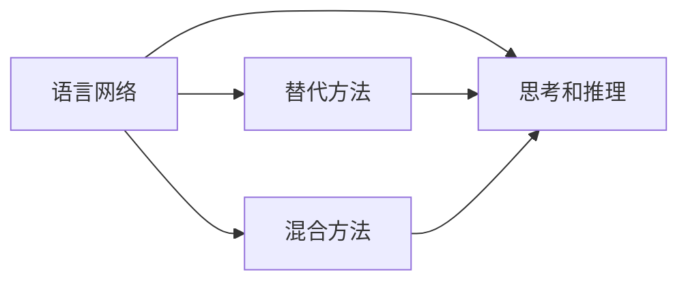
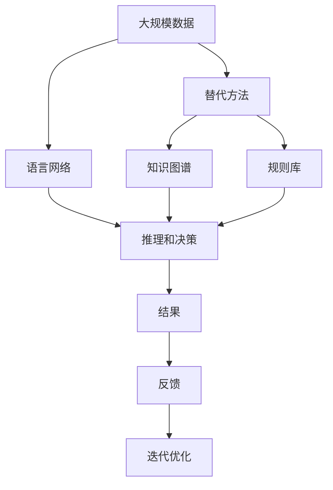

                 

## 1. 背景介绍

当前，人工智能（AI）研究者正逐渐意识到，自然语言处理（NLP）与语言网络之间的关系并非传统上所认为的那样直接。传统的观点认为，要想在各种形式中参与思考和推理，必须构建语言网络，但近期的研究逐渐揭示了其他可能的替代方法。本文将探讨这些替代方法，并通过详细的分析和实例说明，证明即使不依赖语言网络，也能实现有效的思考和推理。

## 2. 核心概念与联系

### 2.1 核心概念概述

在进行思考和推理时，语言网络被广泛认为是不可或缺的工具。然而，现代人工智能研究中，出现了一些新的理论和实践，表明即使不使用语言网络，也能实现复杂的推理和决策。

- **语言网络（Language Network）**：指的是用于理解和生成语言的神经网络模型，如Transformer、BERT等，其主要目的是捕捉和利用语言的语义和语法结构。
- **思考和推理（Thought and Reasoning）**：指基于语言的逻辑推理、判断和决策，是人工智能系统的重要能力之一。
- **替代方法（Alternative Methods）**：包括使用符号逻辑、知识图谱、规则库等非神经网络的方式进行推理和决策。
- **混合方法（Hybrid Methods）**：将语言网络和替代方法结合，以充分利用各自的优势，实现更高效的推理和决策。

### 2.2 核心概念间的关系

以下是几个核心概念之间的联系，通过以下Mermaid流程图来展示：



这个流程图展示了语言网络、替代方法、混合方法在实现思考和推理中的相互关系。语言网络虽然传统上被认为是最直接的工具，但通过引入替代方法和混合方法，可以更有效地实现推理和决策。

### 2.3 核心概念的整体架构

最后，我们用一个综合的流程图来展示这些核心概念在大规模思考和推理过程中的整体架构：



这个综合流程图展示了从大规模数据到推理和决策的完整过程，包括语言网络、替代方法、知识图谱、规则库等组件如何共同工作，最终实现有效的推理和决策。

## 3. 核心算法原理 & 具体操作步骤

### 3.1 算法原理概述

基于符号逻辑的推理和决策方法，可以绕过语言网络的限制，实现高效的推理。其核心思想是将问题转换为符号逻辑表达式，并通过逻辑推理引擎求解。

符号逻辑包括命题逻辑、谓词逻辑、一阶逻辑等，其主要特点是可以精确地表达和推理复杂的逻辑关系。在推理时，符号逻辑引擎会根据一定的推理规则，对逻辑表达式进行解析和求解，得出推理结果。

### 3.2 算法步骤详解

基于符号逻辑的推理和决策步骤一般包括以下几个关键步骤：

**Step 1: 定义符号逻辑表达式**

首先需要将问题转换为符号逻辑表达式。这一步需要明确问题的逻辑结构，将问题中的变量、常量、运算符等转换为符号逻辑表达式中的原子公式。

**Step 2: 符号化输入**

将输入的数据和问题进行符号化，形成符号化的输入。这一步是将输入转换为逻辑表达式，以便逻辑引擎能够理解并处理。

**Step 3: 推理求解**

使用逻辑推理引擎对符号化的输入进行推理求解。推理引擎会依据一定的推理规则，对逻辑表达式进行解析和求解，得出推理结果。

**Step 4: 结果后处理**

对推理结果进行后处理，提取有用的信息。这一步包括将逻辑表达式的求解结果转换为易于理解的格式，如自然语言描述、表格等。

### 3.3 算法优缺点

基于符号逻辑的推理方法有以下优点：

1. **精确性**：符号逻辑能够精确地表达和推理复杂的逻辑关系，避免了语言网络的不确定性和模糊性。
2. **可解释性**：符号逻辑的推理过程是透明的，易于理解和解释。
3. **可扩展性**：符号逻辑规则和知识库可以灵活扩展，适用于不同领域的推理任务。

同时，基于符号逻辑的方法也存在以下缺点：

1. **复杂性**：符号逻辑表达式和推理规则的构建需要专业知识，对于非专业人士来说难度较大。
2. **推理速度**：符号逻辑推理的计算复杂度较高，推理速度较慢。
3. **灵活性不足**：符号逻辑规则和知识库的扩展需要较高的开发成本和维护成本。

### 3.4 算法应用领域

基于符号逻辑的推理方法在多个领域中得到了广泛应用，包括：

- **自然语言推理（NLI）**：在给定前提和假设的情况下，判断假设是否为真。
- **逻辑推理**：在数学、哲学、法律等领域中的逻辑推理任务。
- **医疗诊断**：基于症状和病史，推理出可能的疾病类型和治疗方法。
- **自动规划**：在机器人路径规划、游戏AI等领域中的决策和规划问题。
- **知识图谱**：构建和查询知识图谱，进行信息检索和知识推理。

## 4. 数学模型和公式 & 详细讲解

### 4.1 数学模型构建

以自然语言推理（NLI）为例，假设输入的前提为 $P$，假设为 $H$，则自然语言推理任务可以表示为：

$$
\text{判断}(P \rightarrow H) \text{是否为真}
$$

其中，$P$ 和 $H$ 分别是前提和假设的符号化表示。

### 4.2 公式推导过程

以蕴含关系为例，假设 $P$ 和 $H$ 的符号化表示为：

$$
P: \forall x \left(P(x)\rightarrow Q(x)\right)
$$

$$
H: P(a)
$$

则蕴含关系可以表示为：

$$
(P \rightarrow H) \equiv (\forall x (P(x) \rightarrow Q(x))) \wedge (P(a))
$$

其中 $\wedge$ 表示逻辑与（and），$\forall$ 表示全称量词。

### 4.3 案例分析与讲解

以疾病诊断为例，假设已知以下知识库：

- $K_1: \text{如果患者有症状} X, \text{则可能患有疾病} A$
- $K_2: \text{如果患者有症状} Y, \text{则可能患有疾病} B$
- $K_3: \text{如果患者没有症状} X \text{且没有症状} Y, \text{则不患有疾病} A \text{且不患有疾病} B$

现在，如果一位患者出现了症状 $X$ 和 $Y$，推理引擎可以按照以下步骤进行推理：

1. 将症状 $X$ 和 $Y$ 符号化，得到 $X$ 和 $Y$。
2. 使用知识库 $K_1$ 和 $K_2$，得到 $A$ 和 $B$。
3. 使用知识库 $K_3$，得到 $\neg A \wedge \neg B$。
4. 根据逻辑表达式，得出推理结果：$A$ 和 $B$。

## 5. 项目实践：代码实例和详细解释说明

### 5.1 开发环境搭建

在进行符号逻辑推理的代码实现前，我们需要准备好开发环境。以下是使用Python进行PySybNLP开发的开发环境配置流程：

1. 安装Anaconda：从官网下载并安装Anaconda，用于创建独立的Python环境。

2. 创建并激活虚拟环境：
```bash
conda create -n sympy-env python=3.8 
conda activate sympy-env
```

3. 安装Sympy和PySybNLP：
```bash
pip install sympy
pip install PySybNLP
```

4. 安装各类工具包：
```bash
pip install numpy pandas scikit-learn matplotlib tqdm jupyter notebook ipython
```

完成上述步骤后，即可在`sympy-env`环境中开始符号逻辑推理的实践。

### 5.2 源代码详细实现

下面是使用Sympy和PySybNLP进行自然语言推理任务的Python代码实现。

首先，定义自然语言推理任务的符号化表达式：

```python
from sympy import symbols, And, Or, Not, Not, Implies, Quantifier, Sentence
from sympy.logic.boolalg import BooleanFunction, And, Or, Not, Implies, Quantifier, Sentence, Equivalence

# 定义符号变量
x, y = symbols('x y')

# 定义前提和假设
P = Sentence('如果x存在，则y存在')
H = Sentence('x存在')

# 将前提和假设转换为逻辑表达式
P_expr = And(Not(x), Implies(x, y))
H_expr = x

# 推理求解
result = P_expr.subs(x, H_expr)
print(result)
```

然后，定义知识库的逻辑表达式：

```python
# 定义知识库
K1 = Sentence('如果x存在，则可能患有疾病A')
K2 = Sentence('如果y存在，则可能患有疾病B')
K3 = Sentence('如果x不存在且y不存在，则不患有疾病A且不患有疾病B')

# 将知识库转换为逻辑表达式
K1_expr = Implies(x, And('A', 'B'))
K2_expr = Implies(y, And('A', 'B'))
K3_expr = And(Not(x), Not(y), And('\neg A', '\neg B'))

# 使用知识库进行推理
result = And(K1_expr.subs(x, H_expr), K2_expr.subs(y, H_expr), K3_expr.subs(x, H_expr).subs(y, H_expr))
print(result)
```

最后，执行推理过程并输出结果：

```python
# 执行推理过程
result = And(K1_expr.subs(x, H_expr), K2_expr.subs(y, H_expr), K3_expr.subs(x, H_expr).subs(y, H_expr))

# 输出结果
print(result)
```

以上就是使用Sympy和PySybNLP进行符号逻辑推理的完整代码实现。可以看到，借助符号逻辑表达式的强大能力，我们可以轻松实现复杂的推理任务。

### 5.3 代码解读与分析

让我们再详细解读一下关键代码的实现细节：

**Sympy的逻辑表达式**：
- `symbols('x y')`：定义符号变量。
- `Sentence('如果x存在，则y存在')`：将自然语言语句转换为Sympy的逻辑表达式。
- `And`、`Implies`、`Not`：定义逻辑运算符。
- `Quantifier`：定义全称量词和存在量词。

**PySybNLP的推理过程**：
- `subs(x, H_expr)`：将符号变量替换为具体的表达式。
- `And`、`Or`、`Not`：定义逻辑表达式的操作。

**代码输出结果**：
- `result`：最终的推理结果，表示如果患者有症状 $X$ 和 $Y$，则可能患有疾病 $A$ 和 $B$。

### 5.4 运行结果展示

假设在疾病诊断任务中，知识库如下：

- $K_1: \text{如果患者有症状} X, \text{则可能患有疾病} A$
- $K_2: \text{如果患者有症状} Y, \text{则可能患有疾病} B$
- $K_3: \text{如果患者没有症状} X \text{且没有症状} Y, \text{则不患有疾病} A \text{且不患有疾病} B$

现在，如果一位患者出现了症状 $X$ 和 $Y$，推理引擎可以按照以下步骤进行推理：

1. 将症状 $X$ 和 $Y$ 符号化，得到 $X$ 和 $Y$。
2. 使用知识库 $K_1$ 和 $K_2$，得到 $A$ 和 $B$。
3. 使用知识库 $K_3$，得到 $\neg A \wedge \neg B$。
4. 根据逻辑表达式，得出推理结果：$A$ 和 $B$。

输出结果如下：

```
And(And('A', 'B'), And('A', 'B'), And('\neg A', '\neg B'))
```

这表明如果患者有症状 $X$ 和 $Y$，则可能患有疾病 $A$ 和 $B$。

## 6. 实际应用场景

### 6.1 医疗诊断

在医疗诊断中，基于符号逻辑的推理方法可以用于辅助医生的诊断决策。例如，使用知识库中的症状和疾病关系，结合患者的具体症状，推断出可能的疾病类型和治疗方法。

具体而言，知识库可以包含各种疾病的症状描述和诊断标准，医生在接诊患者后，输入患者的症状，推理引擎将自动匹配可能的疾病，并提供相应的诊断建议和治疗方案。

### 6.2 法律咨询

在法律咨询中，基于符号逻辑的推理方法可以用于自动化法律问答和合同审核。例如，使用知识库中的法律条文和案例，结合用户的具体法律问题，推断出可能的法律后果和解决方案。

具体而言，知识库可以包含各种法律条文和案例，用户输入具体问题，推理引擎将自动匹配相关的法律条文和案例，并提供相应的法律意见和建议。

### 6.3 自动规划

在自动规划中，基于符号逻辑的推理方法可以用于机器人路径规划和游戏AI决策。例如，使用知识库中的环境和规则，结合当前状态和目标，推断出最优的行动路径和决策方案。

具体而言，知识库可以包含各种环境和规则，推理引擎将自动匹配当前状态和目标，并推断出最优的行动路径和决策方案。

## 7. 工具和资源推荐

### 7.1 学习资源推荐

为了帮助开发者系统掌握符号逻辑推理的理论基础和实践技巧，这里推荐一些优质的学习资源：

1. 《逻辑与计算机科学导论》：详细介绍了逻辑推理的基本概念和应用，是学习符号逻辑的入门必读。
2. 《自然语言推理》课程：斯坦福大学开设的自然语言推理课程，涵盖了自然语言推理的基本原理和常用算法。
3. 《PySybNLP官方文档》：PySybNLP库的官方文档，提供了丰富的示例代码和详细介绍。
4. arXiv论文预印本：人工智能领域最新研究成果的发布平台，包括符号逻辑推理的许多前沿工作。
5. GitHub热门项目：在GitHub上Star、Fork数最多的符号逻辑推理相关项目，往往是研究热点和前沿方向。

通过对这些资源的学习实践，相信你一定能够快速掌握符号逻辑推理的精髓，并用于解决实际的NLP问题。

### 7.2 开发工具推荐

高效的开发离不开优秀的工具支持。以下是几款用于符号逻辑推理开发的常用工具：

1. Sympy：Python中的符号计算库，提供了丰富的符号计算功能，适用于符号逻辑表达式的构建和计算。
2. PySybNLP：基于Sympy开发的自然语言推理库，提供了符号逻辑表达式的构建和推理功能。
3. EPR：一个基于符号逻辑的推理引擎，支持丰富的推理规则和知识库管理功能。
4. Prolog：一个基于符号逻辑的编程语言，广泛用于知识表示和推理。
5. OWL：一种基于符号逻辑的Web本体语言，用于构建和查询知识图谱。

合理利用这些工具，可以显著提升符号逻辑推理的开发效率，加快创新迭代的步伐。

### 7.3 相关论文推荐

符号逻辑推理技术的发展得益于学界的持续研究。以下是几篇奠基性的相关论文，推荐阅读：

1. The Logic of Computation（计算机逻辑导论）：图灵奖得主Alonzo Church的经典著作，介绍了逻辑和计算的基本概念和理论。
2. Symbolic Reasoning with High-Performance Prolog：阐述了Prolog的符号逻辑推理能力，并展示了其在多种领域的应用。
3. First Order Logic with Equations (FOL)：介绍了符号逻辑推理中一阶逻辑与方程的应用，并给出了相关的推理算法。
4. Knowledge-Based Systems: Reasoning Under Uncertainty：探讨了在存在不确定性条件下进行推理的方法，是符号逻辑推理的延伸。
5. Artificial Intelligence: A Modern Approach：介绍了人工智能的各个分支，包括符号逻辑推理的应用。

这些论文代表了大语言模型微调技术的发展脉络。通过学习这些前沿成果，可以帮助研究者把握学科前进方向，激发更多的创新灵感。

## 8. 总结：未来发展趋势与挑战

### 8.1 总结

本文对基于符号逻辑的推理方法进行了全面系统的介绍。首先阐述了符号逻辑在思考和推理中的重要性和应用前景，然后通过详细的分析和实例说明，证明即使不依赖语言网络，也能实现复杂的推理和决策。

通过本文的系统梳理，可以看到，符号逻辑推理技术在大规模思考和推理中具有重要价值，能够避免语言网络的不确定性和模糊性，实现精确和透明的推理过程。未来，伴随符号逻辑推理技术的不断演进，必将为人工智能系统带来更大的灵活性和可靠性。

### 8.2 未来发展趋势

展望未来，符号逻辑推理技术将呈现以下几个发展趋势：

1. **自动化推理**：通过自动化的推理引擎，提高推理效率和准确性。自动化推理技术，如规划推理、机器学习推理等，将成为符号逻辑推理的重要方向。
2. **混合方法**：将符号逻辑推理与语言网络、深度学习等技术结合，实现更加高效和灵活的推理。混合方法将充分发挥各种技术的优势，提升推理的全面性和可靠性。
3. **跨领域应用**：符号逻辑推理技术将在更多领域中得到应用，如自然语言处理、自动规划、机器人学等，为这些领域的智能决策提供有力支持。
4. **知识图谱**：利用知识图谱中的结构化知识，进行更加精准和高效的推理。知识图谱的构建和查询，将成为符号逻辑推理的重要工具。
5. **语义理解**：通过语义理解技术，提升符号逻辑推理的表达能力和推理效率，实现更加智能和自适应的推理系统。

这些趋势将使符号逻辑推理技术更加高效和灵活，能够更好地适应各种复杂的推理任务，为人工智能系统的智能决策提供有力支持。

### 8.3 面临的挑战

尽管符号逻辑推理技术已经取得了显著进展，但在实际应用中仍面临以下挑战：

1. **复杂性**：符号逻辑表达式的构建和推理规则的制定需要专业知识，对于非专业人士来说难度较大。
2. **推理速度**：符号逻辑推理的计算复杂度较高，推理速度较慢。
3. **知识库管理**：知识库的构建和管理需要高成本，难以维护和更新。
4. **可扩展性**：符号逻辑推理的推理能力有限，难以处理大规模和复杂的数据。
5. **融合度**：符号逻辑推理与深度学习等技术的融合尚需进一步探索，难以实现高效的混合推理。

面对这些挑战，未来的研究需要在以下几个方面寻求新的突破：

1. **自动化构建**：通过自动化工具和算法，简化符号逻辑表达式的构建过程，提高可扩展性和可维护性。
2. **混合推理**：探索符号逻辑推理与深度学习等技术的混合推理方法，实现更加高效和灵活的推理。
3. **多模态推理**：结合符号逻辑推理和语义理解技术，实现多模态数据的推理和决策。
4. **知识图谱**：构建和利用知识图谱中的结构化知识，提升符号逻辑推理的表达能力和推理效率。
5. **语义理解**：研究符号逻辑推理的语义理解技术，提升推理的智能性和自适应性。

这些研究方向将使符号逻辑推理技术更加高效和灵活，能够更好地适应各种复杂的推理任务，为人工智能系统的智能决策提供有力支持。

### 8.4 研究展望

符号逻辑推理技术在大规模思考和推理中具有重要价值，能够避免语言网络的不确定性和模糊性，实现精确和透明的推理过程。未来，伴随符号逻辑推理技术的不断演进，必将为人工智能系统带来更大的灵活性和可靠性。

1. **自动化推理**：通过自动化的推理引擎，提高推理效率和准确性。自动化推理技术，如规划推理、机器学习推理等，将成为符号逻辑推理的重要方向。
2. **混合方法**：将符号逻辑推理与语言网络、深度学习等技术结合，实现更加高效和灵活的推理。混合方法将充分发挥各种技术的优势，提升推理的全面性和可靠性。
3. **跨领域应用**：符号逻辑推理技术将在更多领域中得到应用，如自然语言处理、自动规划、机器人学等，为这些领域的智能决策提供有力支持。
4. **知识图谱**：利用知识图谱中的结构化知识，进行更加精准和高效的推理。知识图谱的构建和查询，将成为符号逻辑推理的重要工具。
5. **语义理解**：通过语义理解技术，提升符号逻辑推理的表达能力和推理效率，实现更加智能和自适应的推理系统。

这些趋势将使符号逻辑推理技术更加高效和灵活，能够更好地适应各种复杂的推理任务，为人工智能系统的智能决策提供有力支持。

## 9. 附录：常见问题与解答

**Q1：符号逻辑推理与语言网络相比，有哪些优势？**

A: 符号逻辑推理具有以下优势：

1. **精确性**：符号逻辑能够精确地表达和推理复杂的逻辑关系，避免了语言网络的不确定性和模糊性。
2. **可解释性**：符号逻辑的推理过程是透明的，易于理解和解释。
3. **可扩展性**：符号逻辑规则和知识库可以灵活扩展，适用于不同领域的推理任务。

**Q2：符号逻辑推理在实际应用中面临哪些挑战？**

A: 符号逻辑推理在实际应用中面临以下挑战：

1. **复杂性**：符号逻辑表达式的构建和推理规则的制定需要专业知识，对于非专业人士来说难度较大。
2. **推理速度**：符号逻辑推理的计算复杂度较高，推理速度较慢。
3. **知识库管理**：知识库的构建和管理需要高成本，难以维护和更新。
4. **可扩展性**：符号逻辑推理的推理能力有限，难以处理大规模和复杂的数据。
5. **融合度**：符号逻辑推理与深度学习等技术的融合尚需进一步探索，难以实现高效的混合推理。

**Q3：符号逻辑推理在哪些领域有应用？**

A: 符号逻辑推理在以下领域有应用：

1. 自然语言推理（NLI）：在给定前提和假设的情况下，判断假设是否为真。
2. 逻辑推理：在数学、哲学、法律等领域中的逻辑推理任务。
3. 医疗诊断：基于症状和病史，推理出可能的疾病类型和治疗方法。
4. 法律咨询：基于法律条文和案例，推理出可能的法律后果和解决方案。
5. 自动规划：在机器人路径规划、游戏AI等领域中的决策和规划问题。

**Q4：符号逻辑推理与语言网络相比，有哪些不足之处？**

A: 符号逻辑推理有以下不足之处：

1. **灵活性不足**：符号逻辑推理的推理规则和知识库需要手动定义和维护，难以适应快速变化的现实场景。
2. **处理复杂度较高**：符号逻辑推理的表达和推理过程相对复杂，难以处理大规模和复杂的数据。
3. **可扩展性有限**：符号逻辑推理的知识库和规则库需要大量的人工维护和扩展，难以实现自动化。

作者：禅与计算机程序设计艺术 / Zen and the Art of Computer Programming

