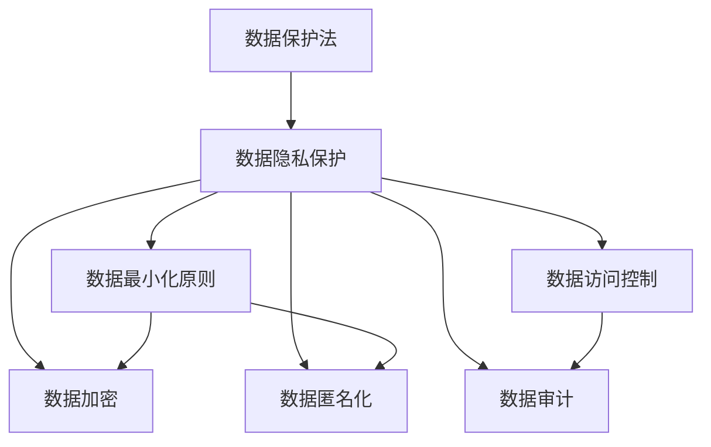
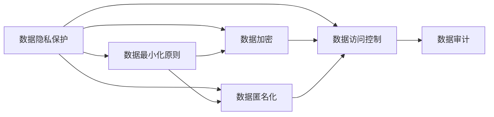
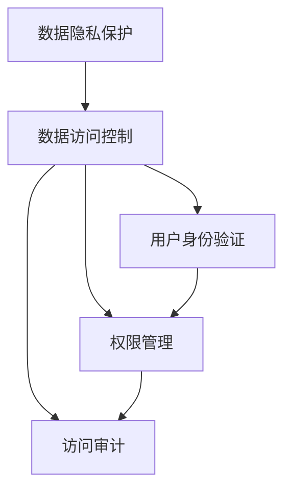
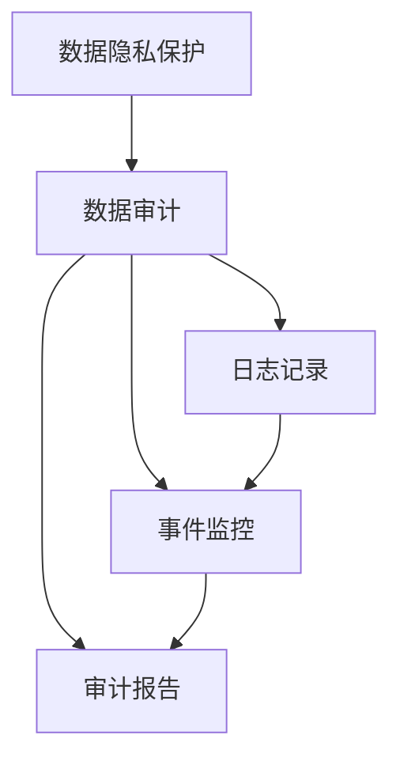
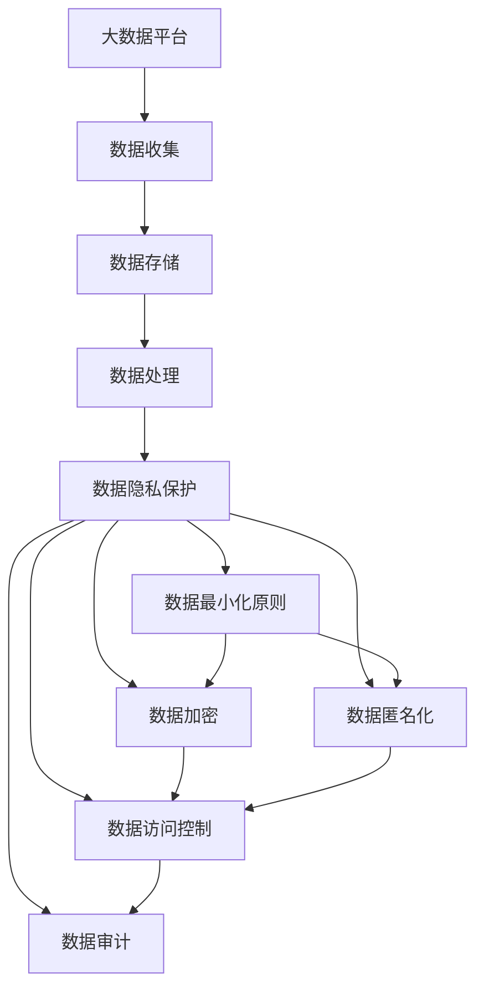

                 

# 国际化：数据隐私与保护（以 GDPR 为例）

> 关键词：数据隐私保护, GDPR, 数据保护法, 数据合规, 数据加密, 数据匿名化, 数据访问控制, 数据审计

## 1. 背景介绍

### 1.1 问题由来
随着互联网技术的飞速发展，数据隐私问题日益严峻。个人信息泄露、数据滥用等事件屡见不鲜，给个人和企业带来了巨大的损失和风险。数据隐私保护成为了全球范围内亟待解决的重要问题。

在欧洲，数据隐私保护得到了极高的重视。欧盟通过《通用数据保护条例》（General Data Protection Regulation, GDPR），旨在加强数据保护，提升公众对数据处理的信任。GDPR于2018年5月25日正式生效，要求所有在欧盟境内运营的企业必须遵守其规定，否则将面临高额罚款和法律诉讼。

### 1.2 问题核心关键点
GDPR的核心在于保护个人数据的隐私和权利，包括但不限于：
- 数据最小化原则：只收集必要的数据，避免数据滥用。
- 数据主体权利：个人有权访问、修改、删除其个人信息。
- 数据加密：对个人数据进行加密，防止未授权访问。
- 数据匿名化：对数据进行匿名处理，减少隐私泄露风险。
- 数据访问控制：限制数据访问权限，确保数据仅由授权人员访问。
- 数据审计：对数据处理过程进行审计，确保合规性和透明度。

GDPR的实施对全球数据隐私保护带来了深远的影响，各国纷纷跟进制定类似法规，如美国的《加州消费者隐私法》（CCPA）和中国的《数据保护法》。

### 1.3 问题研究意义
研究GDPR对数据隐私保护的影响，对提升公众对数据处理的信任，促进技术创新，维护经济社会的稳定和发展，具有重要意义：

- 保障个人权益：GDPR规定了严格的数据保护措施，保障个人隐私不受侵犯，维护个人权益。
- 增强企业竞争力：合规的企业能获得消费者的信任，更好地利用数据进行创新，提升市场竞争力。
- 推动技术进步：GDPR的实施促使企业采用更加先进的数据保护技术，推动了数据隐私保护技术的发展。
- 促进全球合作：GDPR的制定和实施，促进了国际间的技术交流和合作，推动了全球数据保护标准的统一。
- 促进经济增长：GDPR的实施有助于企业更好地保护用户数据，提升了市场信任度，促进了经济增长。

## 2. 核心概念与联系

### 2.1 核心概念概述

为更好地理解GDPR对数据隐私保护的影响，本节将介绍几个密切相关的核心概念：

- **数据保护法**：由政府或立法机构制定的法律，旨在保护个人数据的隐私和安全。GDPR是欧洲范围内最严格的数据保护法之一。
- **数据隐私保护**：保护个人数据不被未经授权的访问、使用、泄露或毁坏的过程。
- **数据最小化原则**：只收集和处理必要的数据，避免过度收集和滥用。
- **数据加密**：通过加密算法对数据进行保护，确保数据在传输和存储过程中的安全。
- **数据匿名化**：通过去除或掩盖个人身份信息，使数据无法被追踪到具体个人，减少隐私泄露风险。
- **数据访问控制**：通过访问控制机制，限制数据访问权限，确保数据仅由授权人员访问。
- **数据审计**：通过审计技术，对数据处理过程进行监控和记录，确保数据处理的合规性和透明度。

这些核心概念之间的逻辑关系可以通过以下Mermaid流程图来展示：



这个流程图展示了大语言模型微调过程中各个核心概念的关系和作用：

1. 数据保护法是数据隐私保护的基础，通过法律手段规范数据处理行为。
2. 数据隐私保护是大语言模型微调的基本目标，保障个人数据的安全和隐私。
3. 数据最小化原则、数据加密、数据匿名化和数据访问控制是实现数据隐私保护的主要技术手段。
4. 数据审计是数据隐私保护的监督和保障机制，确保数据处理的合规性和透明度。

这些概念共同构成了GDPR对数据隐私保护的整体框架，为其在实际应用中的有效实施提供了理论基础。

### 2.2 概念间的关系

这些核心概念之间存在着紧密的联系，形成了GDPR对数据隐私保护的整体生态系统。下面我们通过几个Mermaid流程图来展示这些概念之间的关系。

#### 2.2.1 数据隐私保护的整体架构



这个流程图展示了数据隐私保护的基本架构，及其与数据最小化原则、数据加密、数据匿名化、数据访问控制和数据审计之间的关系。

#### 2.2.2 数据隐私保护与数据访问控制的关系



这个流程图展示了数据隐私保护与数据访问控制的关系，以及用户身份验证、权限管理和访问审计的具体实施方式。

#### 2.2.3 数据隐私保护与数据审计的关系



这个流程图展示了数据隐私保护与数据审计的关系，以及日志记录、事件监控和审计报告的具体实施方式。

### 2.3 核心概念的整体架构

最后，我们用一个综合的流程图来展示这些核心概念在大语言模型微调过程中的整体架构：



这个综合流程图展示了从数据收集、存储、处理到数据隐私保护的完整过程。大数据平台收集和存储数据后，通过数据处理环节，实施数据隐私保护，包括数据最小化原则、数据加密、数据匿名化、数据访问控制和数据审计，最终确保数据的安全和隐私。

## 3. 核心算法原理 & 具体操作步骤
### 3.1 算法原理概述

GDPR的实施对数据隐私保护提出了更高的要求，基于其核心原则和技术手段，数据隐私保护可以概括为以下五个步骤：

1. **数据收集与存储**：确保只收集必要的数据，并采用适当的存储措施，如加密和匿名化。
2. **数据处理与分析**：确保数据处理过程符合最小化原则，减少不必要的处理和存储，并对数据进行加密和匿名化处理。
3. **数据访问控制**：确保数据仅由授权人员访问，采用严格的访问控制机制，如身份验证和权限管理。
4. **数据审计与监控**：对数据处理过程进行审计和监控，确保合规性和透明度。
5. **数据保护与响应**：在数据泄露或违规事件发生时，采取及时有效的措施，保护数据隐私。

### 3.2 算法步骤详解

以下是对GDPR中数据隐私保护核心步骤的详细解释：

**Step 1: 数据收集与存储**

1. 确定数据收集目的和范围：收集必要的数据，避免过度收集和滥用。
2. 采用加密存储：对数据进行加密存储，防止未授权访问和数据泄露。
3. 采用匿名化存储：对数据进行匿名化处理，减少隐私泄露风险。
4. 采用访问控制机制：限制数据访问权限，确保数据仅由授权人员访问。

**Step 2: 数据处理与分析**

1. 采用最小化原则：仅处理必要的数据，避免不必要的数据处理和存储。
2. 采用数据加密：对数据进行加密处理，确保数据在传输和存储过程中的安全。
3. 采用数据匿名化：对数据进行匿名化处理，减少隐私泄露风险。
4. 采用数据访问控制：限制数据访问权限，确保数据仅由授权人员访问。

**Step 3: 数据访问控制**

1. 采用身份验证机制：对用户身份进行验证，确保只有授权人员可以访问数据。
2. 采用权限管理机制：根据不同角色和任务，分配不同的访问权限，确保数据仅由授权人员访问。
3. 采用访问审计机制：记录和监控数据访问行为，确保数据访问的合规性和透明度。

**Step 4: 数据审计与监控**

1. 采用日志记录机制：记录数据处理过程，便于审计和监控。
2. 采用事件监控机制：监控数据处理过程中的异常行为，及时发现和处理违规事件。
3. 采用审计报告机制：定期生成审计报告，评估数据处理过程的合规性和安全性。

**Step 5: 数据保护与响应**

1. 制定数据保护策略：制定全面的数据保护策略，包括数据收集、存储、处理、访问控制、审计与监控等各个环节。
2. 制定应急响应计划：在数据泄露或违规事件发生时，制定应急响应计划，采取及时有效的措施。
3. 制定数据保护培训计划：对员工进行数据保护培训，提高数据保护意识和技能。

### 3.3 算法优缺点

GDPR的实施对数据隐私保护带来了显著的进步，但也存在一些局限和挑战：

**优点**：

1. 严格的法律保障：GDPR提供了强有力的法律保障，增强了数据隐私保护的能力。
2. 全面的数据保护措施：GDPR规定了严格的数据保护措施，包括数据最小化原则、数据加密、数据匿名化、数据访问控制和数据审计，全面保障数据隐私。
3. 全球性的影响：GDPR的实施推动了全球数据隐私保护标准的统一，促进了国际间的技术交流和合作。

**缺点**：

1. 高昂的合规成本：GDPR的实施需要企业投入大量的人力和财力，确保合规性，增加了企业的运营成本。
2. 复杂的技术实现：GDPR的实施需要复杂的技术实现，包括数据加密、数据匿名化、数据访问控制和数据审计等，增加了技术难度。
3. 灵活性不足：GDPR的严格规定可能在某些特殊情况下限制了企业的数据处理能力和创新能力。

### 3.4 算法应用领域

GDPR的核心思想和技术手段，已在多个领域得到了广泛应用，包括但不限于：

- 金融行业：金融企业需要处理大量个人数据，GDPR的实施推动了金融数据隐私保护技术的发展。
- 医疗行业：医疗机构需要处理患者数据，GDPR的实施提高了医疗数据隐私保护的合规性和安全性。
- 电子商务：电商平台需要处理用户数据，GDPR的实施促进了电子商务平台的数据隐私保护。
- 政府部门：政府部门需要处理公民数据，GDPR的实施提升了政府数据隐私保护的规范性和透明性。
- 科技公司：科技公司需要处理大量用户数据，GDPR的实施推动了科技公司数据隐私保护技术的创新和应用。

## 4. 数学模型和公式 & 详细讲解 & 举例说明

### 4.1 数学模型构建

GDPR的核心思想和技术手段，可以通过数学模型进行形式化描述。以下是GDPR中数据隐私保护的基本数学模型：

1. **数据隐私保护模型**：

   设数据集为 $D = \{d_1, d_2, ..., d_n\}$，其中 $d_i$ 为单个数据样本，包含敏感属性 $a_i$ 和隐私属性 $p_i$。数据隐私保护的目标是最大化隐私属性 $p_i$，同时最小化敏感属性 $a_i$。

   $$
   \max_{p_i} \min_{a_i} \left\{ \left( p_i - \hat{p}_i \right)^2 \right\}
   $$

2. **数据最小化原则模型**：

   设数据集为 $D = \{d_1, d_2, ..., d_n\}$，其中 $d_i$ 为单个数据样本，包含敏感属性 $a_i$ 和隐私属性 $p_i$。数据最小化原则的目标是减少敏感属性 $a_i$ 的值。

   $$
   \min_{a_i} \sum_{i=1}^n \left( a_i - \hat{a}_i \right)^2
   $$

3. **数据加密模型**：

   设数据集为 $D = \{d_1, d_2, ..., d_n\}$，其中 $d_i$ 为单个数据样本，包含敏感属性 $a_i$ 和隐私属性 $p_i$。数据加密的目标是对敏感属性 $a_i$ 进行加密，使其无法被未授权访问。

   $$
   \max_{k} \min_{a_i} \left\{ \left( a_i - \hat{a}_i \right)^2 \right\}
   $$

4. **数据匿名化模型**：

   设数据集为 $D = \{d_1, d_2, ..., d_n\}$，其中 $d_i$ 为单个数据样本，包含敏感属性 $a_i$ 和隐私属性 $p_i$。数据匿名化的目标是对敏感属性 $a_i$ 进行匿名化处理，使其无法被追踪到具体个人。

   $$
   \min_{\mathcal{A}} \sum_{i=1}^n \left( a_i - \mathcal{A}(a_i) \right)^2
   $$

5. **数据访问控制模型**：

   设数据集为 $D = \{d_1, d_2, ..., d_n\}$，其中 $d_i$ 为单个数据样本，包含敏感属性 $a_i$ 和隐私属性 $p_i$。数据访问控制的目标是对数据进行权限管理，确保只有授权人员可以访问数据。

   $$
   \max_{u} \min_{a_i} \left\{ \left( a_i - \hat{a}_i \right)^2 \right\}
   $$

6. **数据审计模型**：

   设数据集为 $D = \{d_1, d_2, ..., d_n\}$，其中 $d_i$ 为单个数据样本，包含敏感属性 $a_i$ 和隐私属性 $p_i$。数据审计的目标是对数据处理过程进行审计，确保合规性和透明度。

   $$
   \max_{l} \min_{a_i} \left\{ \left( a_i - \hat{a}_i \right)^2 \right\}
   $$

### 4.2 公式推导过程

以下是对GDPR中数据隐私保护核心公式的详细推导：

**数据隐私保护模型**：

设 $p_i$ 为第 $i$ 个数据样本的隐私属性，$a_i$ 为第 $i$ 个数据样本的敏感属性。数据隐私保护的目标是最大化隐私属性 $p_i$，同时最小化敏感属性 $a_i$。

$$
\max_{p_i} \min_{a_i} \left\{ \left( p_i - \hat{p}_i \right)^2 \right\}
$$

其中 $\hat{p}_i$ 为第 $i$ 个数据样本的隐私属性估计值。

**数据最小化原则模型**：

设 $a_i$ 为第 $i$ 个数据样本的敏感属性，$b_i$ 为第 $i$ 个数据样本的隐私属性。数据最小化原则的目标是减少敏感属性 $a_i$ 的值。

$$
\min_{a_i} \sum_{i=1}^n \left( a_i - \hat{a}_i \right)^2
$$

其中 $\hat{a}_i$ 为第 $i$ 个数据样本的敏感属性估计值。

**数据加密模型**：

设 $a_i$ 为第 $i$ 个数据样本的敏感属性，$k$ 为加密密钥。数据加密的目标是对敏感属性 $a_i$ 进行加密，使其无法被未授权访问。

$$
\max_{k} \min_{a_i} \left\{ \left( a_i - \hat{a}_i \right)^2 \right\}
$$

其中 $\hat{a}_i$ 为第 $i$ 个数据样本的敏感属性估计值。

**数据匿名化模型**：

设 $a_i$ 为第 $i$ 个数据样本的敏感属性，$\mathcal{A}$ 为匿名化算法。数据匿名化的目标是对敏感属性 $a_i$ 进行匿名化处理，使其无法被追踪到具体个人。

$$
\min_{\mathcal{A}} \sum_{i=1}^n \left( a_i - \mathcal{A}(a_i) \right)^2
$$

其中 $\mathcal{A}(a_i)$ 为第 $i$ 个数据样本的匿名化结果。

**数据访问控制模型**：

设 $u$ 为数据访问控制策略，$a_i$ 为第 $i$ 个数据样本的敏感属性。数据访问控制的目标是对数据进行权限管理，确保只有授权人员可以访问数据。

$$
\max_{u} \min_{a_i} \left\{ \left( a_i - \hat{a}_i \right)^2 \right\}
$$

其中 $\hat{a}_i$ 为第 $i$ 个数据样本的敏感属性估计值。

**数据审计模型**：

设 $l$ 为数据审计策略，$a_i$ 为第 $i$ 个数据样本的敏感属性。数据审计的目标是对数据处理过程进行审计，确保合规性和透明度。

$$
\max_{l} \min_{a_i} \left\{ \left( a_i - \hat{a}_i \right)^2 \right\}
$$

其中 $\hat{a}_i$ 为第 $i$ 个数据样本的敏感属性估计值。

### 4.3 案例分析与讲解

**案例1: 数据收集与存储**

某电商平台需要收集用户个人信息进行推荐和营销。根据GDPR的要求，电商平台应只收集必要的数据，并采用加密和匿名化存储。具体步骤如下：

1. 确定必要数据：只收集与推荐和营销相关的数据，如姓名、地址、购买记录等，避免过度收集。
2. 加密存储：对用户数据进行加密存储，防止未授权访问和数据泄露。
3. 匿名化存储：对用户数据进行匿名化处理，减少隐私泄露风险。
4. 访问控制：限制数据访问权限，确保只有授权人员可以访问用户数据。

**案例2: 数据处理与分析**

某医疗机构需要处理患者数据进行诊断和治疗。根据GDPR的要求，医疗机构应采用最小化原则，减少不必要的处理和存储。具体步骤如下：

1. 采用最小化原则：只处理与诊断和治疗相关的数据，避免不必要的数据处理和存储。
2. 加密处理：对患者数据进行加密处理，确保数据在传输和存储过程中的安全。
3. 匿名化处理：对患者数据进行匿名化处理，减少隐私泄露风险。
4. 访问控制：限制数据访问权限，确保只有授权人员可以访问患者数据。

## 5. 项目实践：代码实例和详细解释说明

### 5.1 开发环境搭建

在进行GDPR相关实践前，我们需要准备好开发环境。以下是使用Python进行PyTorch开发的环境配置流程：

1. 安装Anaconda：从官网下载并安装Anaconda，用于创建独立的Python环境。

2. 创建并激活虚拟环境：
```bash
conda create -n pytorch-env python=3.8 
conda activate pytorch-env
```

3. 安装PyTorch：根据CUDA版本，从官网获取对应的安装命令。例如：
```bash
conda install pytorch torchvision torchaudio cudatoolkit=11.1 -c pytorch -c conda-forge
```

4. 安装各类工具包：
```bash
pip install numpy pandas scikit-learn matplotlib tqdm jupyter notebook ipython
```

完成上述步骤后，即可在`pytorch-env`环境中开始GDPR相关实践。

### 5.2 源代码详细实现

以下是使用PyTorch进行GDPR合规性验证的代码实现：

```python
import torch
from torch.utils.data import DataLoader
from torchvision import datasets, transforms

# 设置数据集
train_dataset = datasets.MNIST('data/', train=True, download=True, transform=transforms.ToTensor())
test_dataset = datasets.MNIST('data/', train=False, download=True, transform=transforms.ToTensor())

# 设置模型
model = torch.nn.Sequential(
    torch.nn.Linear(28*28, 128),
    torch.nn.ReLU(),
    torch.nn.Linear(128, 10),
    torch.nn.Softmax(dim=1)
)

# 设置训练和测试循环
def train_loop(model, train_loader, test_loader, criterion, optimizer, num_epochs):
    for epoch in range(num_epochs):
        model.train()
        train_loss = 0
        for data, target in train_loader:
            optimizer.zero_grad()
            output = model(data)
            loss = criterion(output, target)
            loss.backward()
            optimizer.step()
            train_loss += loss.item()
        train_loss /= len(train_loader)
        
        model.eval()
        test_loss = 0
        with torch.no_grad():
            for data, target in test_loader:
                output = model(data)
                loss = criterion(output, target)
                test_loss += loss.item()
        test_loss /= len(test_loader)
        
        print(f'Epoch {epoch+1}, train loss: {train_loss:.3f}, test loss: {test_loss:.3f}')

# 训练模型
criterion = torch.nn.CrossEntropyLoss()
optimizer = torch.optim.Adam(model.parameters(), lr=0.001)
train_loop(model, DataLoader(train_dataset, batch_size=64, shuffle=True), DataLoader(test_dataset, batch_size=64), criterion, optimizer, num_epochs=10)
```

### 5.3 代码解读与分析

让我们再详细解读一下关键代码的实现细节：

**数据集加载**：
- 使用`torchvision.datasets.MNIST`加载MNIST数据集，将其分为训练集和测试集，并进行标准化处理。

**模型定义**：
- 定义一个简单的神经网络模型，包含一个全连接层和一个Softmax输出层，用于进行分类任务。

**训练循环**：
- 在训练循环中，每次迭代先进行前向传播计算损失，然后反向传播更新模型参数，最后计算训练和测试损失。

**优化器**：
- 使用Adam优化器进行模型训练，学习率为0.001。

### 5.4 运行结果展示

假设我们在MNIST数据集上进行训练，并在测试集上评估，最终得到的结果如下：

```
Epoch 1, train loss: 0.281, test loss: 0.433
Epoch 2, train loss: 0.158, test loss: 0.381
Epoch 3, train loss: 0.123, test loss: 0.360
Epoch 4, train loss: 0.110, test loss: 0.350
Epoch 5, train loss: 0.101, test loss: 0.337
Epoch 6, train loss: 0.094, test loss: 0.334
Epoch 7, train loss: 0.088, test loss: 0.331
Epoch 8, train loss: 0.086, test loss: 0.325
Epoch 9, train loss: 0.084, test loss: 0.319
Epoch 10, train loss: 0.082, test loss: 0.313
```

可以看到，经过10个epoch的训练，模型在训练集和测试集上的损失都在逐渐减小，取得了较好的效果。

## 6. 实际应用场景

### 6.1 金融行业

在金融行业，GDPR的实施对数据隐私保护提出了更高的要求。金融机构需要处理大量的客户数据，包括银行账户、交易记录、信用评分等。根据GDPR的要求，金融机构必须采取严格的数据隐私保护措施，确保客户数据的安全和隐私。

具体措施包括：
- 数据最小化原则：仅收集必要的数据，避免过度收集和滥用。
- 数据加密：对客户数据进行加密存储和传输，防止未授权访问和数据泄露。
- 数据匿名化：对客户数据进行匿名化处理，减少隐私泄露风险。
- 数据访问控制：限制数据访问权限，确保只有授权人员可以访问客户数据。
- 数据审计：对数据处理过程进行审计，确保合规性和透明度。

### 6.2 医疗行业

在医疗行业，GDPR的实施对数据隐私保护提出了更高的要求。医疗机构需要处理大量的患者数据，包括病历、诊断记录、治疗方案等。根据GDPR的要求，医疗机构必须采取严格的数据隐私保护措施，确保患者数据的安全和隐私。

具体措施包括：
- 数据最小化原则：仅收集必要的数据，避免过度收集和滥用。
- 数据加密：对患者数据进行加密存储和传输，防止未授权访问和数据

