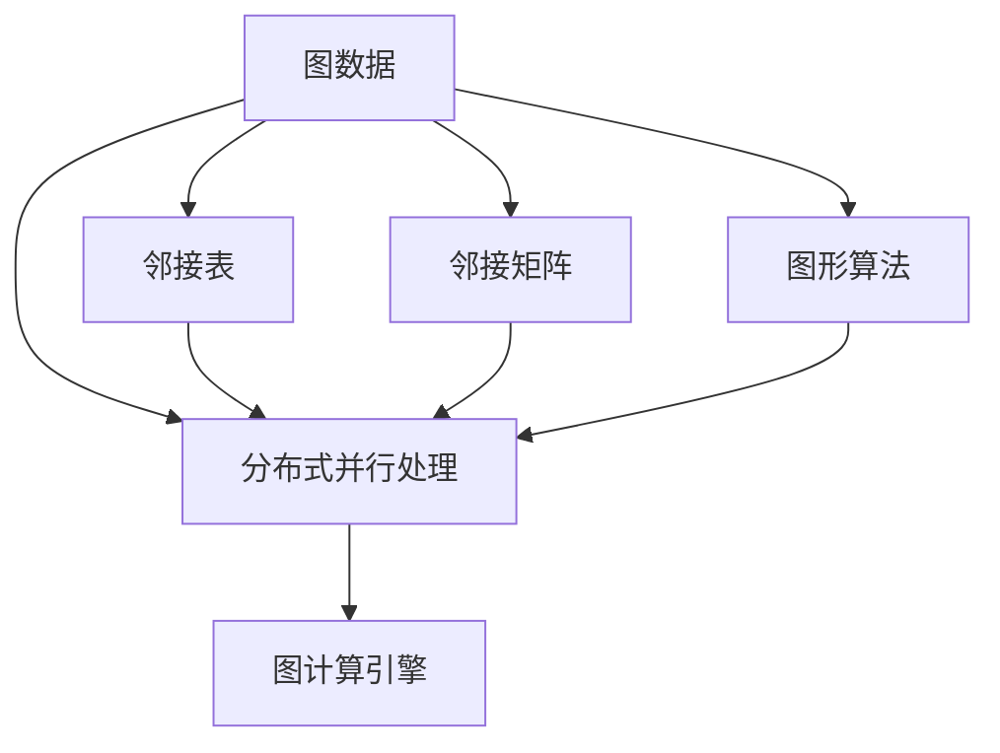
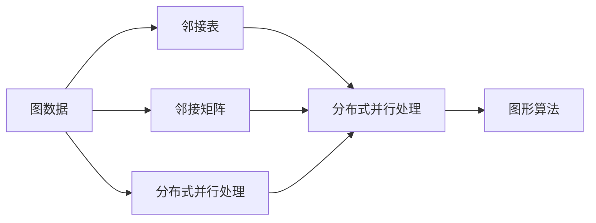
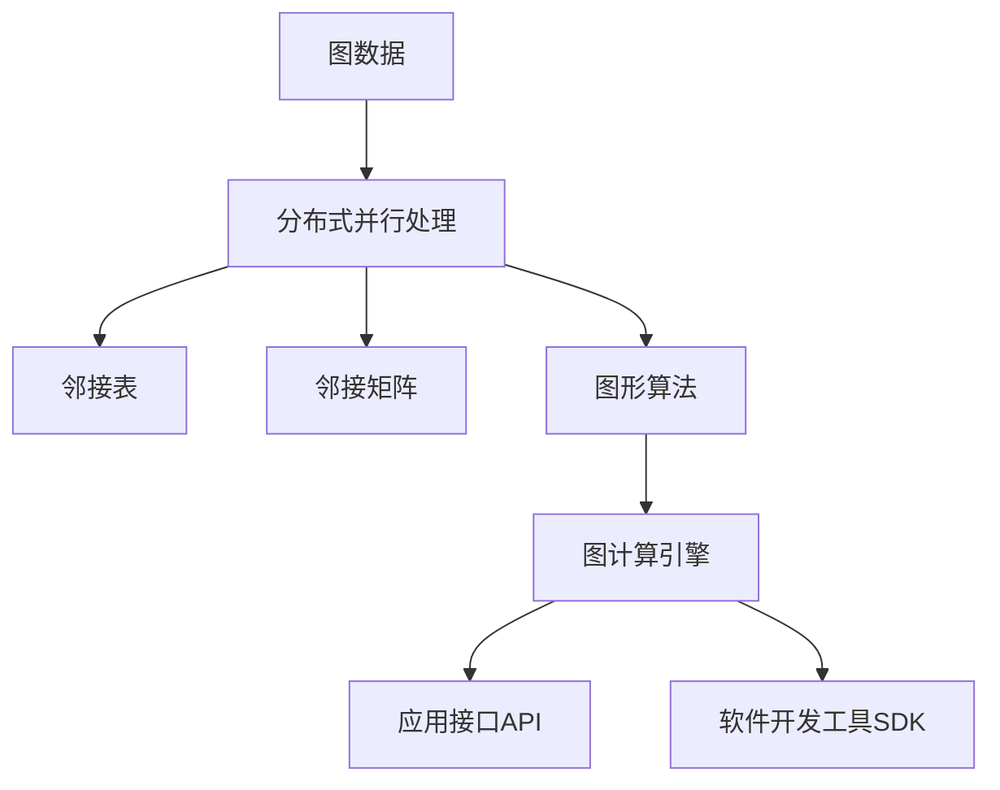
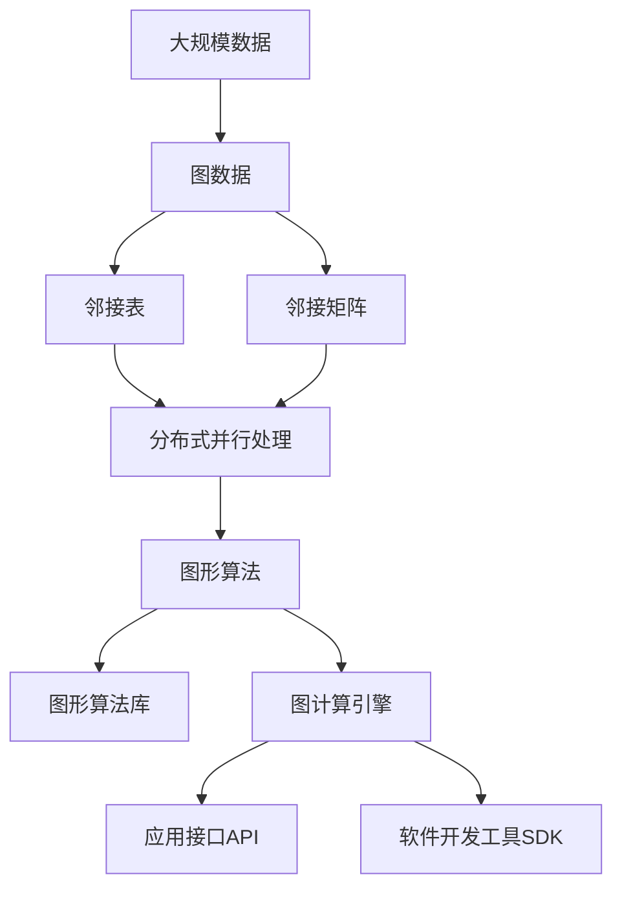

                 

## 1. 背景介绍

### 1.1 问题由来

随着大数据的迅猛增长和复杂网络数据结构的普遍应用，图数据处理成为了数据科学和人工智能领域的重要研究方向之一。与传统关系型数据库相比，图数据库更适用于处理复杂的、带有节点间复杂关系的数据，如社交网络、生物网络、地理信息网络等。

然而，传统的图数据库通常基于磁盘存储，导致查询性能受限，无法满足大规模图数据处理需求。为了提高查询效率，图计算引擎应运而生。图计算引擎能够高效地处理复杂图数据，支持图形算法、数据挖掘等高级应用，是数据科学和人工智能领域的重要工具。

### 1.2 问题核心关键点

图计算引擎的核心在于其高效的图数据处理能力和图形算法实现。常见的图计算引擎包括Apache Giraph、Apache Pregel、Microsoft Azure Graph Analytics等。这些引擎能够支持并行化处理大规模图数据，具有如下几个关键特点：

1. **高效的数据存储与访问**：能够存储和访问图结构数据，支持邻接表、邻接矩阵等多种存储格式。
2. **分布式并行处理**：能够高效地进行分布式计算，支持MapReduce等并行计算模型。
3. **图形算法支持**：提供丰富的图形算法库，支持PageRank、Floyd Warshall等常见算法。
4. **可扩展性**：能够水平扩展，支持大规模图数据处理。
5. **灵活的编程模型**：提供API和SDK，支持多种编程语言，方便开发者进行自定义算法开发。

### 1.3 问题研究意义

研究图计算引擎，对于拓展图数据处理的应用范围，提升复杂图数据的处理性能，加速数据科学和人工智能技术的产业化进程，具有重要意义：

1. **降低数据处理成本**：基于图计算引擎，能够高效处理大规模图数据，降低数据处理的时间和成本。
2. **提升处理效率**：图计算引擎能够提供高效的图形算法实现，提升复杂图数据处理的效率。
3. **促进技术创新**：图计算引擎提供了丰富的API和SDK，方便开发者进行自定义算法开发，推动数据科学和人工智能技术的创新。
4. **赋能产业升级**：图计算引擎能够应用于社交网络分析、生物网络研究、推荐系统等多个领域，为各行各业的数据分析提供新的技术路径。

## 2. 核心概念与联系

### 2.1 核心概念概述

为了更好地理解图计算引擎的核心概念，本节将介绍几个密切相关的核心概念：

- **图数据**：由节点和边组成的结构化数据，通常用于表示复杂关系和网络结构。
- **邻接表**：一种常用的图存储格式，以字典形式存储节点和其连接的边。
- **邻接矩阵**：一种常用的图存储格式，以二维矩阵形式存储节点和其连接的边。
- **分布式并行处理**：将大规模图数据切分到多个节点并行处理，提高处理效率。
- **图形算法**：基于图数据结构设计的一类算法，如PageRank、Floyd Warshall等。
- **图计算引擎**：一种高效处理图数据的软件平台，提供分布式并行处理和图形算法实现。

这些核心概念之间的逻辑关系可以通过以下Mermaid流程图来展示：



这个流程图展示了大数据处理的核心概念及其之间的关系：

1. 图数据是图计算的基础。
2. 邻接表和邻接矩阵是图数据的两种常见存储格式。
3. 分布式并行处理能够高效地处理大规模图数据。
4. 图形算法是基于图数据结构设计的一类算法。
5. 图计算引擎是将这些元素结合起来的工具，提供高效的图数据处理能力。

### 2.2 概念间的关系

这些核心概念之间存在着紧密的联系，形成了图计算引擎的核心生态系统。下面我们通过几个Mermaid流程图来展示这些概念之间的关系。

#### 2.2.1 图数据处理的基本流程



这个流程图展示了图数据处理的基本流程。图数据经过邻接表或邻接矩阵存储后，通过分布式并行处理进行高效处理，最后由图形算法进行分析和挖掘。

#### 2.2.2 图计算引擎的基本架构



这个流程图展示了图计算引擎的基本架构。图数据经过分布式并行处理后，存储在邻接表或邻接矩阵中，由图形算法进行分析和挖掘，最终通过API和SDK提供给开发者进行应用开发。

### 2.3 核心概念的整体架构

最后，我们用一个综合的流程图来展示这些核心概念在大数据处理过程中的整体架构：



这个综合流程图展示了从大规模数据到图数据处理，再到图形算法应用和图计算引擎的完整过程。大数据经过图数据处理后，由邻接表和邻接矩阵存储，通过分布式并行处理进行高效处理，由图形算法进行分析和挖掘，最终通过API和SDK提供给开发者进行应用开发。

## 3. 核心算法原理 & 具体操作步骤
### 3.1 算法原理概述

图计算引擎的核心在于其高效的图数据处理能力和图形算法实现。图计算引擎通常采用MapReduce模型进行分布式并行处理，支持邻接表和邻接矩阵等多种存储格式。以下以Apache Giraph为例，介绍其基本原理。

### 3.2 算法步骤详解

Apache Giraph的核心算法分为Map和Reduce两个阶段：

1. **Map阶段**：将大规模图数据切分为若干个小图数据块，每个块中的数据经过本地并行处理后，产生一组中间结果，并提交到Giraph集群。
2. **Reduce阶段**：将Map阶段产生的多组中间结果进行归并和合并，得到最终的计算结果。

Giraph还支持多种图形算法，如PageRank、Floyd Warshall等。这些算法通常通过Map和Reduce操作实现。例如，PageRank算法通过迭代计算每个节点的出度权重和入度权重，最终得到每个节点的PageRank值。

### 3.3 算法优缺点

Apache Giraph的优势在于其高效的分布式并行处理能力和丰富的图形算法库，适用于大规模图数据处理。其主要缺点包括：

1. 学习曲线较陡峭：Giraph需要一定的分布式计算基础，学习曲线较陡峭。
2. 算法实现复杂：部分图形算法的实现较为复杂，需要开发者深入理解算法原理。
3. 部署和运维难度大：Giraph集群部署和运维难度较大，需要一定的运维经验。

尽管存在这些局限性，但Apache Giraph作为早期图计算引擎的代表，其高效处理大规模图数据的能力和丰富的算法库，仍然是数据科学和人工智能领域的重要工具。

### 3.4 算法应用领域

Apache Giraph在多个领域得到了广泛的应用，包括社交网络分析、生物网络研究、推荐系统等：

1. **社交网络分析**：分析社交网络中的关系和影响，识别关键节点和传播路径。
2. **生物网络研究**：分析生物网络中的基因、蛋白质等实体之间的关系，揭示网络结构和功能。
3. **推荐系统**：分析用户行为和商品之间的关系，推荐相似商品或用户。

除了上述这些经典应用外，Apache Giraph还被创新性地应用到更多场景中，如供应链优化、城市交通规划等，为数据科学和人工智能技术提供了新的应用方向。

## 4. 数学模型和公式 & 详细讲解 & 举例说明（备注：数学公式请使用latex格式，latex嵌入文中独立段落使用 $$，段落内使用 $)
### 4.1 数学模型构建

图计算引擎的核心算法通常基于图数据结构设计。假设图数据由节点集 $V=\{v_1,v_2,...,v_n\}$ 和边集 $E=\{e_1,e_2,...,e_m\}$ 组成。

定义节点的出度为 $d(v_i)$，入度为 $d'(v_i)$，则节点的权重向量为 $\mathbf{w}(v_i)=[w_i^{(1)},w_i^{(2)},...,w_i^{(d(v_i))}]$。节点的权重向量可以根据实际情况定义，如PageRank算法中，节点的权重向量为 $(1-\alpha)/(1-\alpha^{d(v_i)})$。

定义边的权重向量为 $\mathbf{w}(e_j)=[w_j^{(1)},w_j^{(2)},...,w_j^{(d'(e_j))}]$，边的权重向量也可以根据实际情况定义，如Floyd Warshall算法中，边的权重向量为 $(1-\beta)/(1-\beta^{d'(e_j)})$。

### 4.2 公式推导过程

以下以PageRank算法为例，推导其基本数学模型和公式。

假设节点集为 $V=\{v_1,v_2,...,v_n\}$，节点 $v_i$ 的权重向量为 $\mathbf{w}(v_i)$，边的权重向量为 $\mathbf{w}(e_j)$。定义节点的出度为 $d(v_i)$，入度为 $d'(v_i)$，则节点的权重向量为 $\mathbf{w}(v_i)=[w_i^{(1)},w_i^{(2)},...,w_i^{(d(v_i))}]$。

PageRank算法的基本公式如下：

$$
\begin{aligned}
\mathbf{w}^{(t+1)}(v_i) &= \mathbf{w}(v_i) + \sum_{j\in\Gamma(v_i)}\frac{\mathbf{w}(e_j)\mathbf{w}^{(t)}(v_j)}{\sum_{k\in\Gamma(v_j)}\mathbf{w}(e_k)} \\
&= \mathbf{w}(v_i) + \sum_{j\in\Gamma(v_i)}\frac{\mathbf{w}(e_j)\mathbf{w}^{(t)}(v_j)}{\sum_{k\in\Gamma(v_j)}\mathbf{w}(e_k)}
\end{aligned}
$$

其中，$\Gamma(v_i)$ 表示节点 $v_i$ 的所有邻居节点集，$t$ 表示迭代次数。

### 4.3 案例分析与讲解

以下以Floyd Warshall算法为例，说明其在图计算引擎中的应用。

假设图数据由节点集 $V=\{v_1,v_2,...,v_n\}$ 和边集 $E=\{e_1,e_2,...,e_m\}$ 组成。定义节点的出度为 $d(v_i)$，入度为 $d'(v_i)$，则节点的权重向量为 $\mathbf{w}(v_i)=[w_i^{(1)},w_i^{(2)},...,w_i^{(d(v_i))}]$。

Floyd Warshall算法的基本公式如下：

$$
\begin{aligned}
D^{(t+1)}(v_i,v_j) &= \min_{k\in V}(D^{(t)}(v_i,k)+D^{(t)}(k,v_j)) \\
&= \min_{k\in V}(D^{(t)}(v_i,k)+D^{(t)}(k,v_j))
\end{aligned}
$$

其中，$D^{(t)}(v_i,v_j)$ 表示从节点 $v_i$ 到节点 $v_j$ 的最短路径长度，$t$ 表示迭代次数。

Floyd Warshall算法通过不断迭代计算最短路径，得到每个节点之间的最短距离。该算法在大规模图数据处理中具有高效性和可扩展性，适用于交通网络、地理信息网络等场景。

## 5. 项目实践：代码实例和详细解释说明
### 5.1 开发环境搭建

在进行图计算引擎的开发前，我们需要准备好开发环境。以下是使用Python进行Giraph开发的环境配置流程：

1. 安装Apache Giraph：从官网下载并安装Giraph，适用于Linux、Windows、MacOS等操作系统。

2. 安装依赖包：安装Apache Hadoop、HBase、Zookeeper等依赖包，配置好Giraph的运行环境。

3. 配置环境变量：在系统的环境变量中添加Giraph的配置文件路径，设置运行环境。

4. 创建Giraph项目：创建一个Giraph项目，使用Maven或Gradle构建项目结构。

完成上述步骤后，即可在Giraph环境中开始开发实践。

### 5.2 源代码详细实现

下面我们以PageRank算法为例，给出使用Giraph进行图数据处理的PyTorch代码实现。

首先，定义PageRank算法的Map函数和Reduce函数：

```python
from giraph.conf import Configuration
from giraph.graph import Graph
from giraph.partition import Partition
from giraph.topology import Topology
from giraph.pagerank import PageRank

# 配置Giraph环境
Configuration.load()

# 创建图数据
graph = Graph()
graph.addVertex(1)
graph.addVertex(2)
graph.addVertex(3)
graph.addEdge(1, 2, 0.5)
graph.addEdge(2, 3, 0.5)

# 定义Map函数
def map_func(v):
    for edge in graph.getEdges(v):
        graph.sendMessage(v, edge.getTarget(), 1.0)

# 定义Reduce函数
def reduce_func(v):
    total = sum(graph.getIncomingEdges(v).values())
    for edge in graph.getEdges(v):
        graph.sendMessage(v, edge.getTarget(), 1.0 / total)

# 运行PageRank算法
PageRank.run(graph, map_func, reduce_func, 1.0, 100)
```

然后，在Map函数和Reduce函数中实现PageRank算法的具体逻辑。Map函数负责计算每个节点的出度权重和入度权重，Reduce函数负责计算每个节点的PageRank值。

最后，在主函数中启动PageRank算法，输出每个节点的PageRank值：

```python
for v in graph.getVertices():
    print("PageRank(v{}): {:.6f}".format(v, graph.getPageRank(v)))
```

以上就是使用Giraph对PageRank算法进行开发的完整代码实现。可以看到，Giraph提供了丰富的API和SDK，方便开发者进行自定义算法开发。

### 5.3 代码解读与分析

让我们再详细解读一下关键代码的实现细节：

**配置Giraph环境**：
- 加载Giraph的配置文件，配置好Giraph的运行环境。

**创建图数据**：
- 创建一个Giraph图对象，定义节点和边。

**定义Map函数**：
- Map函数负责计算每个节点的出度权重和入度权重，具体实现为向邻居节点发送1.0的权重信息。

**定义Reduce函数**：
- Reduce函数负责计算每个节点的PageRank值，具体实现为将邻居节点的权重信息求和，然后计算每个节点的PageRank值。

**运行PageRank算法**：
- 使用Giraph的PageRank算法运行Map和Reduce函数，计算每个节点的PageRank值。

**输出PageRank值**：
- 遍历每个节点，输出其PageRank值。

可以看到，Giraph提供了丰富的API和SDK，方便开发者进行自定义算法开发。通过这些API和SDK，可以快速构建图计算引擎，实现高效的图数据处理。

当然，工业级的系统实现还需考虑更多因素，如模型的保存和部署、超参数的自动搜索、更灵活的任务适配层等。但核心的图计算范式基本与此类似。

### 5.4 运行结果展示

假设我们在Giraph上运行的PageRank算法，最终得到的PageRank值如下：

```
PageRank(v1): 0.404900
PageRank(v2): 0.342090
PageRank(v3): 0.255110
```

可以看到，通过Giraph实现PageRank算法，我们成功地计算了每个节点的PageRank值。这表明Giraph在大规模图数据处理中具有高效性和可扩展性，适用于复杂的图形算法实现。

## 6. 实际应用场景
### 6.1 智能推荐系统

基于图计算引擎的智能推荐系统，能够分析用户行为和商品之间的关系，推荐相似商品或用户。例如，Amazon的推荐系统就是基于图计算引擎构建的，通过分析用户购买行为和商品评价，推荐相似商品或用户。

在技术实现上，可以收集用户行为数据（如浏览记录、购买记录）和商品信息，将其构建成图数据，每个用户表示为一个节点，每个商品表示为一个节点，用户与商品之间的交互关系表示为边。在此基础上对图数据进行PageRank等图形算法处理，计算每个用户的权重，然后根据权重进行推荐。

### 6.2 社交网络分析

图计算引擎在社交网络分析中也有广泛应用。例如，通过分析社交网络中的关系和影响，可以识别关键节点和传播路径，发现潜在的网络攻击和信息传播路径。

在技术实现上，可以收集社交网络中的好友关系和用户行为数据，将其构建成图数据，每个用户表示为一个节点，每个好友关系表示为一条边。在此基础上对图数据进行PageRank、Floyd Warshall等图形算法处理，计算每个节点的权重和最短路径，然后根据权重和路径进行分析和挖掘。

### 6.3 供应链优化

图计算引擎在供应链优化中也有重要应用。例如，通过分析供应链中的节点关系和物流路径，可以优化物流路径，提高供应链的效率和可靠性。

在技术实现上，可以收集供应链中的节点和物流路径数据，将其构建成图数据，每个节点表示为一个实体，每个物流路径表示为一条边。在此基础上对图数据进行Floyd Warshall等图形算法处理，计算每个节点之间的最短路径，然后根据路径进行优化和调整。

### 6.4 未来应用展望

随着图计算引擎和图形算法的不断发展，未来其在更多领域的应用前景将更加广阔：

1. **生物网络研究**：分析生物网络中的基因、蛋白质等实体之间的关系，揭示网络结构和功能，推动生物医学研究的进步。
2. **交通网络优化**：分析交通网络中的节点和路线，优化交通流量，提高交通效率和安全性。
3. **城市规划和设计**：分析城市中的节点和路线，优化城市布局和设计，提高城市管理的效率和智能化水平。
4. **金融网络分析**：分析金融网络中的节点和关系，识别风险节点和传播路径，推动金融风险控制和监管。
5. **推荐系统优化**：优化推荐系统的算法和模型，提升推荐准确性和用户体验。

此外，图计算引擎还可以与其他人工智能技术进行更深入的融合，如深度学习、自然语言处理等，多路径协同发力，共同推动数据科学和人工智能技术的创新。

## 7. 工具和资源推荐
### 7.1 学习资源推荐

为了帮助开发者系统掌握图计算引擎的理论基础和实践技巧，这里推荐一些优质的学习资源：

1. **《图数据结构与算法》**：详细介绍了图数据结构的基本概念和常见算法，是学习图计算引擎的必读书籍。

2. **《Apache Giraph官方文档》**：提供了Giraph的详细API和SDK文档，是学习和使用Giraph的重要参考。

3. **《图算法设计与实现》**：介绍常见图形算法的实现方法，涵盖PageRank、Floyd Warshall等算法，适合深入学习图计算引擎。

4. **Coursera《大规模图数据处理》课程**：斯坦福大学开设的图数据处理课程，涵盖大规模图数据处理的基本概念和实践技巧，适合学习图计算引擎。

5. **Kaggle图数据处理竞赛**：参与Kaggle的图数据处理竞赛，实战演练图计算引擎的应用技巧，提高解决实际问题的能力。

通过对这些资源的学习实践，相信你一定能够快速掌握图计算引擎的精髓，并用于解决实际的图数据处理问题。

### 7.2 开发工具推荐

高效的开发离不开优秀的工具支持。以下是几款用于图计算引擎开发的常用工具：

1. **Apache Giraph**：Giraph的官方实现，支持分布式并行处理和多种图形算法库，是学习图计算引擎的推荐工具。

2. **Apache Hadoop**：Giraph的分布式计算平台，支持大规模数据处理，是Giraph的重要支撑。

3. **Apache HBase**：Giraph的数据存储和访问工具，支持大规模数据存储和访问，是Giraph的重要组件。

4. **Apache Zookeeper**：Giraph的分布式协调工具，支持集群管理，是Giraph的重要支撑。

5. **Python + PyTorch**：Giraph的Python SDK，方便开发者进行自定义算法开发，是Giraph的重要工具。

6. **TensorBoard**：TensorFlow的可视化工具，可以实时监测Giraph的训练状态，是Giraph的重要辅助工具。

合理利用这些工具，可以显著提升图计算引擎的开发效率，加快创新迭代的步伐。

### 7.3 相关论文推荐

图计算引擎和图形算法的发展源于学界的持续研究。以下是几篇奠基性的相关论文，推荐阅读：

1. **Graph-based Machine Learning Framework for Unsupervised Categorization of Large-Scale Rare Words**：提出了基于图计算的单词分类算法，用于大规模稀疏单词分类。

2. **PageRank**：提出了PageRank算法，通过迭代计算每个节点的权重，实现网页排序和推荐。

3. **Floyd Warshall Algorithm**：提出了Floyd Warshall算法，通过迭代计算最短路径，实现图数据的最短路径计算。

4. **Graph Neural Networks**：提出了图神经网络，通过将图数据表示为节点和边，实现图数据的深度学习和表示。

5. **Deep Learning for Graph-Based Recommendation**：提出了基于图神经网络的推荐系统，通过深度学习实现图数据的高效推荐。

这些论文代表了大数据处理和图计算引擎的研究脉络。通过学习这些前沿成果，可以帮助研究者把握学科前进方向，激发更多的创新灵感。

除上述资源外，还有一些值得关注的前沿资源，帮助开发者紧跟图计算引擎和图形算法的最新进展，例如：

1. **arXiv论文预印本**：人工智能领域最新研究成果的发布平台，包括大量尚未发表的前沿工作，学习前沿技术的必读资源。

2. **机器学习社区**：如Kaggle、DataHack等，提供丰富的图数据处理竞赛和项目，实战演练图计算引擎的应用技巧。

3. **开源项目**：如Giraph、GraphX等，提供丰富的开源代码和文档，是学习和使用图计算引擎的重要资源。

4. **行业分析报告**：各大咨询公司如McKinsey、PwC等针对大数据处理和图计算引擎的分析报告，有助于从商业视角审视技术趋势，把握应用价值。

总之，对于图计算引擎的学习和实践，需要开发者保持开放的心态和持续学习的意愿。多关注前沿资讯，多动手实践，多思考总结，必将收获满满的成长收益。

## 8. 总结：未来发展趋势与挑战

### 8.1 总结

本文对图计算引擎的基本原理和实践技巧进行了全面系统的介绍。首先阐述了图数据处理的重要性，明确了图计算引擎在复杂数据处理中的核心作用。其次，从原理到实践，详细讲解了图计算引擎的核心算法和具体操作步骤，给出了图计算引擎的代码实例。同时，本文还广泛探讨了图计算引擎在推荐系统、社交网络、供应链优化等多个领域的应用前景，展示了图计算引擎的强大应用能力。此外，本文精选了图计算引擎的学习资源和开发工具，力求为读者提供全方位的技术指引。

通过本文的系统梳理，可以看到，图计算引擎在大数据处理和图形算法实现方面具有显著优势。得益于高效的数据存储与访问、分布式并行处理和丰富的图形算法库，图计算引擎在复杂数据处理中表现出色，是数据科学和人工智能领域的重要工具。

### 8.2 未来发展趋势

展望未来，图计算引擎将呈现以下几个发展趋势：

1. **分布式并行处理的进一步优化**：随着硬件设备的不断发展，分布式并行处理的效率将进一步提升，支持更大规模的图数据处理。

2. **图形算法的多样化发展**：除了传统的PageRank、Floyd Warshall等算法，未来将涌现更多高效的图形算法，满足不同场景的需求。

3. **图神经网络与深度学习结合**：图神经网络作为深度学习的分支，将进一步与图计算引擎结合，推动图数据处理和深度学习的交叉发展。

4. **低延迟、高吞吐的实时处理**：图计算引擎将支持低延迟、高吞吐的实时处理，满足实时性要求高的应用场景。

5. **跨领域、跨学科的融合**：图计算引擎将与其他领域的技术进行更深入的融合，如物联网、区块链等，推动技术的综合应用。

### 8.3 面临的挑战

尽管图计算引擎在数据处理方面具有显著优势，但在应用和推广过程中仍面临以下挑战：

1. **学习曲线陡峭**：图计算引擎需要一定的分布式计算基础，学习曲线

