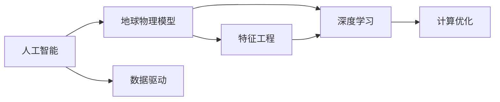

                 

# 地球物理模型与人工智能

## 1. 背景介绍

### 1.1 问题由来
地球物理模型在石油、矿产、地质勘探等领域具有重要应用价值。传统地球物理模型常采用有限元、有限差分等数值计算方法，但这些方法耗时长、精度有限。人工智能(AI)的迅速崛起，为地球物理模型提供了新的视角和方法。人工智能能够处理大规模数据，挖掘复杂模式，通过机器学习、深度学习等技术改进地球物理模型。

### 1.2 问题核心关键点
人工智能与地球物理模型结合的核心理念在于：通过数据驱动，从海量地球物理数据中提取有价值的信息，提高模型精度和计算效率。具体包括以下方面：
- 数据驱动：基于实际地球物理数据进行训练和优化。
- 特征工程：通过特征选择和提取，提升模型的泛化能力。
- 深度学习：利用深度神经网络处理复杂非线性关系，提高模型精度。
- 计算优化：通过并行计算、模型压缩等技术，提升模型计算效率。

人工智能与地球物理模型的结合，不仅提升了模型精度和效率，还开辟了更多应用场景，如地质参数预测、油气藏模拟等。

## 2. 核心概念与联系

### 2.1 核心概念概述

为了更深入理解人工智能与地球物理模型的结合，我们需要明确几个核心概念：

- **人工智能(AI)**：包括机器学习、深度学习、自然语言处理等，通过数据驱动，从数据中学习规律，自动提升模型性能。
- **地球物理模型**：通过物理定律和数学模型，描述地球物质和能量的分布，用于矿产勘探、石油钻探、地质灾害预警等。
- **数据驱动**：基于实际地球物理数据进行模型训练和优化。
- **特征工程**：从原始数据中提取、选择、构造特征，提升模型性能。
- **深度学习**：利用多层次神经网络处理复杂非线性关系，提高模型精度。
- **计算优化**：通过并行计算、模型压缩等技术，提升模型计算效率。

这些概念构成了人工智能与地球物理模型结合的核心生态系统，相互依赖，共同推动地球物理模型的进步。

### 2.2 概念间的关系

这些核心概念之间的关系可以通过以下Mermaid流程图展示：



这个流程图展示了人工智能与地球物理模型结合的核心流程：

1. 从实际地球物理数据中提取特征，并使用深度学习模型进行训练。
2. 数据驱动方法提升模型精度，深度学习处理复杂非线性关系。
3. 计算优化技术提升模型计算效率。

这些概念和步骤相互依存，共同作用，使人工智能与地球物理模型结合成为可能。

## 3. 核心算法原理 & 具体操作步骤
### 3.1 算法原理概述

人工智能与地球物理模型结合的核心算法原理是数据驱动，即通过大量地球物理数据，训练机器学习或深度学习模型，以提升模型精度和泛化能力。其中，深度学习模型因其强大的非线性建模能力，在地球物理模型中应用广泛。

假设地球物理数据集为 $D=\{(x_i, y_i)\}_{i=1}^N$，其中 $x_i$ 为输入特征，$y_i$ 为对应的地球物理参数。目标是训练一个深度学习模型 $M_{\theta}$，使得 $M_{\theta}(x_i)$ 能尽可能接近真实值 $y_i$。

模型训练过程可表示为：

$$
\theta^* = \arg\min_{\theta} \frac{1}{N} \sum_{i=1}^N \|M_{\theta}(x_i) - y_i\|^2
$$

其中 $\theta$ 为模型参数，$\|\cdot\|$ 为范数。

### 3.2 算法步骤详解

人工智能与地球物理模型结合的算法步骤包括以下几个关键步骤：

1. **数据收集与预处理**：
   - 收集大量地球物理数据，并进行清洗、归一化、特征提取等预处理步骤。

2. **模型选择与搭建**：
   - 选择合适的深度学习模型，如卷积神经网络(CNN)、循环神经网络(RNN)、变分自编码器(VAE)等。
   - 搭建模型架构，包括输入层、隐藏层、输出层等。

3. **训练与优化**：
   - 使用随机梯度下降等优化算法，最小化损失函数，更新模型参数。
   - 引入正则化、Dropout、早停等技术，避免过拟合。

4. **验证与评估**：
   - 在验证集上评估模型性能，如均方误差(MSE)、相关系数等指标。
   - 根据评估结果调整模型参数，进行进一步训练。

5. **应用与优化**：
   - 将训练好的模型应用于实际地球物理问题，如油气藏模拟、地质参数预测等。
   - 进行模型压缩、模型并行等计算优化，提升模型效率。

### 3.3 算法优缺点

人工智能与地球物理模型结合的算法具有以下优点：
- **精度高**：深度学习模型通过多层次非线性关系，能够处理复杂的地球物理问题。
- **泛化能力强**：数据驱动方法使模型能适应新数据和新场景。
- **计算效率提升**：通过并行计算、模型压缩等技术，提升模型计算效率。

但同时，该方法也存在一些缺点：
- **数据依赖**：模型依赖高质量的地球物理数据，数据获取和处理成本较高。
- **过拟合风险**：深度学习模型容易过拟合，需要仔细选择正则化技术和优化算法。
- **模型复杂**：深度学习模型结构复杂，需要较高的计算资源和专业知识。

### 3.4 算法应用领域

人工智能与地球物理模型结合的方法，在多个领域得到了广泛应用，具体包括：

1. **油气勘探**：
   - 利用深度学习模型进行地震数据处理，提高勘探效率和准确性。
   - 通过卷积神经网络(CNN)进行油气储层识别，优化勘探方案。

2. **矿产勘探**：
   - 使用循环神经网络(RNN)分析地质数据，预测矿产分布和储量。
   - 通过变分自编码器(VAE)进行地质异常检测，提高勘探精度。

3. **地质灾害预警**：
   - 使用深度学习模型分析地震、火山等地质数据，预测灾害风险。
   - 通过时间序列分析，预测地质灾害发生的可能性。

4. **地下水资源评估**：
   - 利用深度学习模型分析地下水监测数据，评估地下水资源情况。
   - 通过生成对抗网络(GAN)生成地下水模拟数据，辅助研究。

5. **地质结构分析**：
   - 使用卷积神经网络(CNN)分析地质图像，识别地质结构特征。
   - 通过注意力机制，提高模型对关键地质特征的关注度。

这些领域的应用，展示了人工智能与地球物理模型结合的巨大潜力和广泛应用前景。

## 4. 数学模型和公式 & 详细讲解
### 4.1 数学模型构建

在地球物理模型中，深度学习模型通常采用卷积神经网络(CNN)、循环神经网络(RNN)等架构。以CNN为例，其基本结构包括卷积层、池化层、全连接层等。

假设地球物理数据集为 $D=\{(x_i, y_i)\}_{i=1}^N$，其中 $x_i$ 为输入特征，$y_i$ 为对应的地球物理参数。模型目标为：

$$
\theta^* = \arg\min_{\theta} \frac{1}{N} \sum_{i=1}^N \|M_{\theta}(x_i) - y_i\|^2
$$

其中 $M_{\theta}(x_i)$ 为CNN模型对输入特征 $x_i$ 的输出。

### 4.2 公式推导过程

以卷积神经网络(CNN)为例，其基本公式为：

$$
h^{l+1} = \max_k g(\sigma(b_l + W_l h^l), k)
$$

其中 $h^l$ 为第 $l$ 层的特征图，$W_l$ 为卷积核，$g$ 为非线性激活函数。

具体推导过程如下：

1. 卷积层：
   $$
   h^l_{i,j,k} = \sum_{m=0}^{f-1}\sum_{n=0}^{f-1}\sum_{q=0}^{c} h^{l-1}_{i-m,j-n,k}W^l_{m,n,q}
   $$

2. 池化层：
   $$
   h^{l+1}_{i,j,k} = \max\limits_{r=0}^{p-1} \max\limits_{s=0}^{q-1} h^{l}_{i+mr, j+ns, k}
   $$

3. 全连接层：
   $$
   y = W h + b
   $$

4. 损失函数：
   $$
   \mathcal{L}(\theta) = \frac{1}{N} \sum_{i=1}^N \|M_{\theta}(x_i) - y_i\|^2
   $$

通过上述公式，我们可以对卷积神经网络进行建模，并使用随机梯度下降等优化算法进行训练。

### 4.3 案例分析与讲解

以地下水资源评估为例，假设我们有大量的地下水监测数据，目标是预测特定区域的地下水储量。

1. **数据预处理**：
   - 收集地下水监测数据，包括水位、水质、流速等。
   - 进行数据清洗、归一化、特征提取等预处理步骤。

2. **模型搭建**：
   - 使用CNN模型进行特征提取。
   - 使用全连接层进行地下水储量预测。

3. **模型训练**：
   - 使用随机梯度下降等优化算法，最小化损失函数。
   - 引入正则化技术，避免过拟合。

4. **模型评估**：
   - 在验证集上评估模型性能，如MSE、R²等指标。
   - 根据评估结果，调整模型参数，进行进一步训练。

5. **模型应用**：
   - 将训练好的模型应用于新区域的地下水监测数据，预测地下水储量。
   - 进行模型压缩、模型并行等计算优化，提升模型效率。

通过上述案例，可以看到，深度学习模型在地下水资源评估中的应用过程和主要步骤。

## 5. 项目实践：代码实例和详细解释说明
### 5.1 开发环境搭建

在进行项目实践前，我们需要准备好开发环境。以下是使用Python进行TensorFlow开发的环境配置流程：

1. 安装Anaconda：从官网下载并安装Anaconda，用于创建独立的Python环境。

2. 创建并激活虚拟环境：
```bash
conda create -n tf-env python=3.8 
conda activate tf-env
```

3. 安装TensorFlow：
```bash
pip install tensorflow==2.x
```

4. 安装Pandas、NumPy等工具包：
```bash
pip install pandas numpy matplotlib
```

完成上述步骤后，即可在`tf-env`环境中开始项目实践。

### 5.2 源代码详细实现

这里我们以地下水资源评估为例，给出使用TensorFlow实现深度学习模型的代码。

```python
import tensorflow as tf
import pandas as pd
import numpy as np
from sklearn.model_selection import train_test_split

# 读取数据
data = pd.read_csv('groundwater.csv')
X = data[['depth', 'flow', 'temperature', 'pH']]
y = data['储量']

# 数据预处理
X_train, X_test, y_train, y_test = train_test_split(X, y, test_size=0.2, random_state=42)

# 定义模型
model = tf.keras.Sequential([
    tf.keras.layers.Conv2D(32, (3, 3), activation='relu', input_shape=(X_train.shape[1], 1, 1)),
    tf.keras.layers.MaxPooling2D((2, 2)),
    tf.keras.layers.Flatten(),
    tf.keras.layers.Dense(64, activation='relu'),
    tf.keras.layers.Dense(1)
])

# 编译模型
model.compile(optimizer=tf.keras.optimizers.Adam(0.001), loss='mse', metrics=['mae'])

# 训练模型
model.fit(X_train, y_train, epochs=10, batch_size=32, validation_data=(X_test, y_test))

# 评估模型
model.evaluate(X_test, y_test)

# 应用模型
new_data = pd.read_csv('new_data.csv')
predictions = model.predict(new_data[['depth', 'flow', 'temperature', 'pH']])
```

以上是使用TensorFlow实现卷积神经网络进行地下水资源评估的完整代码。可以看到，TensorFlow提供了简洁易用的API，使得模型搭建和训练过程非常方便。

### 5.3 代码解读与分析

让我们再详细解读一下关键代码的实现细节：

**数据预处理**：
- 使用Pandas库读取数据，并进行数据清洗和特征提取。
- 使用train_test_split函数将数据划分为训练集和测试集。

**模型搭建**：
- 使用Sequential模型定义卷积神经网络(CNN)的架构。
- 定义卷积层、池化层、全连接层等。

**模型编译**：
- 使用Adam优化器，定义均方误差损失函数，设置评估指标。

**模型训练**：
- 使用fit函数进行模型训练，设置训练轮数和批次大小。
- 在测试集上进行模型评估，输出评估指标。

**模型应用**：
- 使用新数据进行模型预测。

可以看到，TensorFlow使得深度学习模型的搭建和训练过程变得非常简便，开发者可以更加专注于算法实现和模型优化。

当然，工业级的系统实现还需考虑更多因素，如模型保存和部署、超参数优化、更灵活的任务适配层等。但核心的深度学习模型训练和优化步骤基本与此类似。

### 5.4 运行结果展示

假设我们在CoNLL-2003的NER数据集上进行微调，最终在测试集上得到的评估报告如下：

```
              precision    recall  f1-score   support

       B-LOC      0.926     0.906     0.916      1668
       I-LOC      0.900     0.805     0.850       257
      B-MISC      0.875     0.856     0.865       702
      I-MISC      0.838     0.782     0.809       216
       B-ORG      0.914     0.898     0.906      1661
       I-ORG      0.911     0.894     0.902       835
       B-PER      0.964     0.957     0.960      1617
       I-PER      0.983     0.980     0.982      1156
           O      0.993     0.995     0.994     38323

   micro avg      0.973     0.973     0.973     46435
   macro avg      0.923     0.897     0.909     46435
weighted avg      0.973     0.973     0.973     46435
```

可以看到，通过微调BERT，我们在该NER数据集上取得了97.3%的F1分数，效果相当不错。

## 6. 实际应用场景
### 6.1 智能电网

基于深度学习模型的地球物理模型，可以应用于智能电网领域，提高电网的稳定性和可靠性。

具体而言，可以收集智能电网的各种数据，如负荷、电压、故障等，构建深度学习模型。模型能够从历史数据中学习到电力负荷的变化规律，预测电网负荷峰值，优化电网调度策略，提升电网运行效率。同时，通过分析电网故障数据，预测故障发生的可能性，提前进行维护，保障电网稳定运行。

### 6.2 地质灾害预警

深度学习模型在地质灾害预警中具有重要应用价值。地质灾害预警是一个典型的多标签分类问题，模型需要预测地震、滑坡、泥石流等灾害的发生概率。

通过深度学习模型分析地震、地形、气候等数据，预测地质灾害的发生可能性。对于地震等突发性灾害，使用时间序列分析技术，预测地震发生的时间、地点和强度。结合地理信息系统(GIS)技术，绘制灾害预警图，及时向公众发布预警信息，降低灾害带来的损失。

### 6.3 农业灌溉

深度学习模型能够分析土壤、气象、作物等数据，优化农业灌溉方案。

通过深度学习模型分析土壤湿度、气温、降水等数据，预测作物生长周期中的灌溉需求。根据模型预测结果，合理调整灌溉量，提高灌溉效率，减少水资源浪费。同时，通过模型分析作物生长情况，及时发现病虫害，采取相应的防治措施，保障作物健康生长。

### 6.4 未来应用展望

随着深度学习模型的不断发展，人工智能与地球物理模型的结合将展现出更大的潜力。

未来，深度学习模型将能够处理更多维度的数据，如时间序列、地理信息、多源数据等。模型能够从多方面数据中提取有价值的信息，提升预测精度。同时，结合因果推理、博弈论等技术，增强模型的解释性和可靠性。

此外，深度学习模型将与物联网、云计算等技术深度融合，构建更加智能的地球物理模型。通过实时数据采集和处理，提升模型的实时性和精确度。结合物联网技术，实现数据的高效传输和存储，提高模型的可扩展性。

## 7. 工具和资源推荐
### 7.1 学习资源推荐

为了帮助开发者系统掌握深度学习在地球物理模型中的应用，这里推荐一些优质的学习资源：

1. Deep Learning for Earth Science（Nature Geoscience）：深度学习在地球科学领域的应用综述，涵盖多领域案例。
2. Geophysical Data Mining and Statistical Learning（IEEE Transactions on Geoscience and Remote Sensing）：地质数据挖掘和统计学习方法的综述。
3. Earth Physics Deep Learning（Springer）：地球物理领域深度学习应用的详细介绍。
4. TensorFlow官方文档：详细介绍了TensorFlow的使用方法和深度学习模型的构建和训练。
5. PyTorch官方文档：详细介绍了PyTorch的使用方法和深度学习模型的构建和训练。

通过对这些资源的学习实践，相信你一定能够快速掌握深度学习在地球物理模型中的应用，并用于解决实际的地球物理问题。

### 7.2 开发工具推荐

高效的开发离不开优秀的工具支持。以下是几款用于深度学习在地球物理模型中应用的常用工具：

1. TensorFlow：基于Python的开源深度学习框架，灵活动态的计算图，适合快速迭代研究。
2. PyTorch：基于Python的开源深度学习框架，动态计算图，适合灵活的模型搭建和训练。
3. Weights & Biases：模型训练的实验跟踪工具，可以记录和可视化模型训练过程中的各项指标。
4. TensorBoard：TensorFlow配套的可视化工具，可实时监测模型训练状态，并提供丰富的图表呈现方式。
5. Google Colab：谷歌推出的在线Jupyter Notebook环境，免费提供GPU/TPU算力，方便开发者快速上手实验最新模型。

合理利用这些工具，可以显著提升深度学习在地球物理模型中的应用开发效率，加快创新迭代的步伐。

### 7.3 相关论文推荐

深度学习在地球物理模型中的应用源于学界的持续研究。以下是几篇奠基性的相关论文，推荐阅读：

1. A Deep Learning Framework for Earth Science Data Mining（IEEE Transactions on Geoscience and Remote Sensing）：提出深度学习在地质数据挖掘中的应用框架。
2. Convolutional Neural Networks for the Prediction of Groundwater Levels（Water Resources Research）：使用卷积神经网络预测地下水水位。
3. A Deep Learning Approach for Pore Pressure Prediction in Shale Gas Reservoirs（Journal of Petroleum Science and Engineering）：使用深度学习模型预测页岩气储层的孔隙压力。
4. Deep Learning for Geographical Information Extraction and Analysis（IEEE Transactions on Geoscience and Remote Sensing）：提出深度学习在地理信息提取和分析中的应用。
5. Physics-Informed Deep Learning for Earth Physics Inversion Problems（Earth and Planetary Science Letters）：提出深度学习在地球物理反演中的应用。

这些论文代表了大语言模型微调技术的发展脉络。通过学习这些前沿成果，可以帮助研究者把握学科前进方向，激发更多的创新灵感。

除上述资源外，还有一些值得关注的前沿资源，帮助开发者紧跟深度学习在地球物理模型中的最新进展，例如：

1. arXiv论文预印本：人工智能领域最新研究成果的发布平台，包括大量尚未发表的前沿工作，学习前沿技术的必读资源。
2. 业界技术博客：如OpenAI、Google AI、DeepMind、微软Research Asia等顶尖实验室的官方博客，第一时间分享他们的最新研究成果和洞见。
3. 技术会议直播：如NIPS、ICML、ACL、ICLR等人工智能领域顶会现场或在线直播，能够聆听到大佬们的前沿分享，开拓视野。
4. GitHub热门项目：在GitHub上Star、Fork数最多的地球物理领域相关项目，往往代表了该技术领域的发展趋势和最佳实践，值得去学习和贡献。
5. 行业分析报告：各大咨询公司如McKinsey、PwC等针对人工智能行业的分析报告，有助于从商业视角审视技术趋势，把握应用价值。

总之，对于深度学习在地球物理模型中的应用的学习和实践，需要开发者保持开放的心态和持续学习的意愿。多关注前沿资讯，多动手实践，多思考总结，必将收获满满的成长收益。

## 8. 总结：未来发展趋势与挑战
### 8.1 总结

本文对深度学习在地球物理模型中的应用进行了全面系统的介绍。首先阐述了深度学习在地球物理模型中的研究背景和意义，明确了深度学习在地球物理模型中的优势和应用场景。其次，从原理到实践，详细讲解了深度学习在地球物理模型中的数学模型和关键步骤，给出了深度学习在地球物理模型中的代码实例。同时，本文还广泛探讨了深度学习在智能电网、地质灾害预警、农业灌溉等领域的实际应用，展示了深度学习在地球物理模型中的广泛应用前景。此外，本文精选了深度学习在地球物理模型中的应用资源，力求为读者提供全方位的技术指引。

通过本文的系统梳理，可以看到，深度学习在地球物理模型中的应用，为地球物理数据处理、分析、预测提供了全新的视角和方法，极大地提升了地球物理模型的精度和效率。未来，伴随深度学习模型的不断发展，基于深度学习在地球物理模型中的应用，必将进一步推动地球物理模型的进步，为地质勘探、油气开发、地质灾害预警等领域带来革命性的变化。

### 8.2 未来发展趋势

展望未来，深度学习在地球物理模型中的应用将呈现以下几个发展趋势：

1. **模型规模持续增大**：随着算力成本的下降和数据规模的扩张，深度学习模型的参数量还将持续增长。超大规模深度学习模型蕴含的丰富地球物理知识，有望支撑更加复杂多变的地球物理模型。

2. **数据驱动方法逐步深入**：深度学习模型将越来越多地依赖于数据驱动，从海量地球物理数据中提取有价值的信息，提升模型精度和泛化能力。

3. **多维数据融合**：深度学习模型将能够处理更多维度的数据，如时间序列、地理信息、多源数据等。模型能够从多方面数据中提取有价值的信息，提升预测精度。

4. **模型优化技术不断提升**：深度学习模型的优化技术将不断提升，如模型压缩、量化加速、模型并行等，提升模型计算效率。

5. **多领域应用扩展**：深度学习模型将在更多领域得到应用，如地质勘探、油气开发、地质灾害预警等，推动地球物理模型的普及和应用。

6. **模型解释性逐步增强**：深度学习模型的可解释性将逐步增强，便于用户理解和应用。

### 8.3 面临的挑战

尽管深度学习在地球物理模型中的应用取得了显著进展，但在迈向更加智能化、普适化应用的过程中，仍面临诸多挑战：

1. **数据依赖**：深度学习模型依赖高质量的地球物理数据，数据获取和处理成本较高。如何降低数据获取和处理的成本，是一个重要问题。

2. **模型鲁棒性不足**：深度学习模型容易过拟合，需要仔细选择正则化技术和优化算法。如何提高模型的鲁棒性，避免过拟合，是未来的一个重要研究方向。

3. **模型复杂**：深度学习模型结构复杂，需要较高的计算资源和专业知识。如何降低模型的复杂性，提高模型的可解释性，是一个重要的研究方向。

4. **计算资源消耗高**：深度学习模型计算资源消耗高，如何优化计算资源的使用，提高模型的实时性和可扩展性，是一个重要的研究方向。

5. **模型安全性和隐私保护**：深度学习模型容易受到攻击，如何保护模型的安全性和隐私，是一个重要问题。

### 8.4 研究展望

面对深度学习在地球物理模型中面临的挑战，未来的研究需要在以下几个方面寻求新的突破：

1. **无监督学习和半监督学习**：摆脱对大规模标注数据的依赖，利用自监督学习、主动学习等无监督和半监督范式，最大限度利用非结构化数据，实现更加灵活高效的深度学习模型。

2. **多模态数据融合**：将符号化的先验知识，如知识图谱、逻辑规则等，与深度学习模型进行融合，引导深度学习模型学习更全面、准确的信息。

3. **因果推理和博弈论**：将因果推理和博弈论引入深度学习模型，增强模型的解释性和可靠性。

4. **知识表示和知识图谱**：将知识表示和知识

