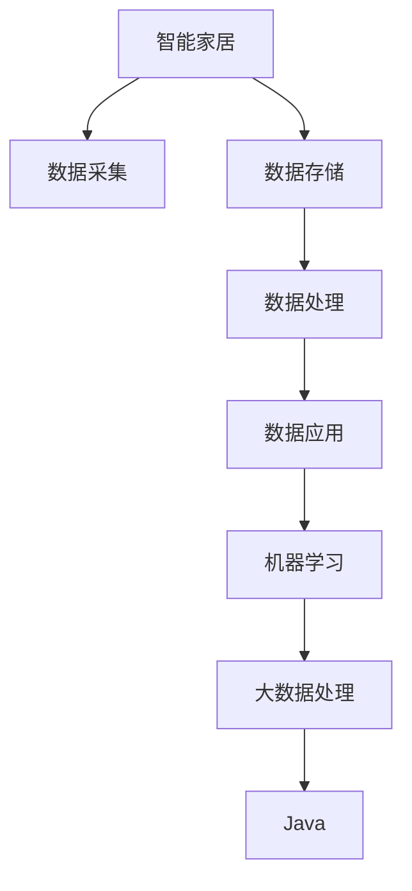

                 

# 基于Java的智能家居设计：探讨Java在智能家居大数据处理中的角色

> 关键词：智能家居,Java,大数据处理,机器学习,物联网

## 1. 背景介绍

### 1.1 问题由来
随着物联网技术的发展，智能家居已经从一个概念转变为现实。通过连接各种家庭设备，智能家居系统能够实现自动化控制、远程监控、个性化服务等功能。然而，这些功能背后隐藏着一个庞大的数据处理和管理系统，即大数据处理系统。这些系统需要高效、可靠的计算平台，而Java作为一门高效、稳定的编程语言，在智能家居大数据处理中扮演着重要角色。

### 1.2 问题核心关键点
智能家居大数据处理的核心关键点包括：
- 数据采集：家庭设备产生的各种传感器数据。
- 数据存储：海量数据存储和管理。
- 数据处理：数据清洗、特征提取、模型训练等。
- 数据应用：基于数据驱动的智能决策和行为预测。

本文将重点探讨Java在智能家居大数据处理中的角色，包括数据采集、存储、处理和应用等环节，帮助读者系统了解Java在这一领域的应用。

## 2. 核心概念与联系

### 2.1 核心概念概述

为更好地理解Java在智能家居大数据处理中的应用，本节将介绍几个密切相关的核心概念：

- 智能家居：通过物联网技术实现家庭自动化、智能化管理的系统，涵盖家庭安防、能源管理、健康监测等众多场景。

- Java：一种高效、面向对象的编程语言，广泛应用于企业级应用、移动应用、大数据处理等领域。

- 大数据处理：处理海量数据的收集、存储、处理和分析技术，包括数据采集、数据存储、数据处理和数据应用等多个环节。

- 机器学习：通过数据训练模型，预测未来行为和决策的算法，广泛应用于推荐系统、图像识别、自然语言处理等场景。

- 物联网：连接各种物理设备，实现设备互联和数据共享的技术，是大数据处理的重要来源。

这些核心概念之间存在着紧密的联系，构成了智能家居大数据处理的基础框架。

### 2.2 概念间的关系

这些核心概念之间的关系可以通过以下Mermaid流程图来展示：



这个流程图展示了大数据处理系统从数据采集到应用的全流程，以及Java在这一过程中所扮演的角色。

## 3. 核心算法原理 & 具体操作步骤
### 3.1 算法原理概述

基于Java的智能家居大数据处理，本质上是一个数据驱动的机器学习过程。其核心思想是通过数据采集、存储、处理和应用等环节，构建一个完整的智能家居系统。

形式化地，假设智能家居系统采集的数据集为 $D=\{(x_i,y_i)\}_{i=1}^N$，其中 $x_i$ 表示第 $i$ 个数据样本的特征向量，$y_i$ 表示对应的标签或目标。大数据处理的目标是找到最优的模型 $M$，使得 $M$ 在数据集 $D$ 上的预测结果尽可能接近真实标签 $y_i$。

具体而言，Java在这一过程中主要负责数据的存储和处理，同时为机器学习模型提供必要的接口和支持。Java的强大工具链和丰富的生态系统，使得其在大数据处理中具备天然的优势。

### 3.2 算法步骤详解

基于Java的智能家居大数据处理一般包括以下几个关键步骤：

**Step 1: 数据采集**
- 使用传感器或网络通信技术，采集家庭设备产生的各种数据。例如，温度传感器采集室内温度数据，摄像头采集家庭成员行为数据等。

**Step 2: 数据存储**
- 将采集的数据存储在关系型数据库或分布式文件系统中。Java提供了丰富的库和工具，如Hadoop、Spark等，支持大规模数据存储和管理。

**Step 3: 数据处理**
- 对原始数据进行清洗、特征提取和转换，生成可用于模型训练的数据集。Java提供了强大的数据处理框架，如Hadoop MapReduce、Spark等，支持复杂的数据处理任务。

**Step 4: 模型训练**
- 使用Java编写的机器学习库，如Weka、Deeplearning4j等，训练适合当前应用场景的机器学习模型。Java的虚拟机和并发机制，使得机器学习模型的训练和推理速度得到保证。

**Step 5: 数据应用**
- 将训练好的模型应用于智能家居系统，进行预测和决策。Java提供了丰富的框架，如Spring Boot、Spring Cloud等，支持微服务架构和分布式系统。

### 3.3 算法优缺点

基于Java的智能家居大数据处理具有以下优点：
1. 性能稳定：Java具有高效的虚拟机和垃圾回收机制，能够稳定处理大规模数据。
2. 生态丰富：Java有大量的开源库和工具，支持各种数据处理和机器学习任务。
3. 可扩展性强：Java支持面向对象编程和多线程编程，能够构建高效可扩展的系统。
4. 安全性高：Java提供了丰富的安全机制，能够保护数据和系统的安全。

同时，该方法也存在一些局限性：
1. 学习曲线陡峭：Java需要掌握丰富的技术栈和工具链，门槛较高。
2. 内存占用高：Java程序的内存占用较大，需要充足的硬件资源。
3. 开发成本高：Java程序的开发周期较长，需要大量的人力和时间投入。

尽管存在这些局限性，但就目前而言，Java仍是大数据处理的主流范式。未来相关研究的重点在于如何进一步降低Java的开发成本，提高其运行效率，同时兼顾可扩展性和安全性等因素。

### 3.4 算法应用领域

基于Java的智能家居大数据处理，已经在大规模智能家居应用中得到广泛应用，覆盖了家庭安防、能源管理、健康监测等多个领域。

具体而言，Java在以下领域的应用包括：

- 智能安防：通过传感器数据和视频监控数据，实时监控家庭安全。Java提供了丰富的安防类库和工具，如OpenCV、Eclipse Paho等。

- 能源管理：通过家电设备的运行数据，优化家庭能源消耗。Java提供了各类能源管理类库和框架，如SmartThings、Smart Home Controller等。

- 健康监测：通过家庭成员的行为数据和健康数据，进行健康分析和预测。Java提供了丰富的健康监测类库和工具，如Google Fit API、Fitbit SDK等。

- 智能照明：通过传感器数据，自动调节家庭照明亮度和颜色。Java提供了各类智能照明类库和工具，如SmartBulb、Philips Hue等。

- 智能温控：通过传感器数据，自动调节家庭温度和湿度。Java提供了各类智能温控类库和工具，如Nest Thermostat、SmartThermostat等。

除了上述这些典型应用外，Java还广泛应用于智能家居领域的各个环节，如智能门锁、智能窗帘、智能家电等。得益于Java的强大生态和丰富的工具链，Java在智能家居大数据处理中具备天然的优势，能够为家庭用户提供更加智能、便捷的体验。

## 4. 数学模型和公式 & 详细讲解 & 举例说明

### 4.1 数学模型构建

本节将使用数学语言对基于Java的智能家居大数据处理过程进行更加严格的刻画。

记智能家居系统采集的数据集为 $D=\{(x_i,y_i)\}_{i=1}^N$，其中 $x_i$ 表示第 $i$ 个数据样本的特征向量，$y_i$ 表示对应的标签或目标。假设模型 $M$ 为线性回归模型，则模型参数 $\theta$ 为：

$$
\theta = (w, b)
$$

其中 $w$ 为权重向量，$b$ 为偏置项。目标函数为：

$$
J(\theta) = \frac{1}{2N}\sum_{i=1}^N (y_i - M(x_i))^2
$$

目标函数表示模型预测结果与真实标签之间的差异。

### 4.2 公式推导过程

以下我们以二分类任务为例，推导分类器的损失函数及其梯度的计算公式。

假设模型 $M_{\theta}$ 在输入 $x$ 上的输出为 $\hat{y}=M_{\theta}(x) \in [0,1]$，表示样本属于正类的概率。真实标签 $y \in \{0,1\}$。则二分类交叉熵损失函数定义为：

$$
\ell(M_{\theta}(x),y) = -[y\log \hat{y} + (1-y)\log (1-\hat{y})]
$$

将其代入经验风险公式，得：

$$
\mathcal{L}(\theta) = -\frac{1}{N}\sum_{i=1}^N [y_i\log M_{\theta}(x_i)+(1-y_i)\log(1-M_{\theta}(x_i))]
$$

根据链式法则，损失函数对参数 $\theta_k$ 的梯度为：

$$
\frac{\partial \mathcal{L}(\theta)}{\partial \theta_k} = -\frac{1}{N}\sum_{i=1}^N (\frac{y_i}{M_{\theta}(x_i)}-\frac{1-y_i}{1-M_{\theta}(x_i)}) \frac{\partial M_{\theta}(x_i)}{\partial \theta_k}
$$

其中 $\frac{\partial M_{\theta}(x_i)}{\partial \theta_k}$ 可进一步递归展开，利用自动微分技术完成计算。

在得到损失函数的梯度后，即可带入参数更新公式，完成模型的迭代优化。重复上述过程直至收敛，最终得到适应智能家居系统的最优模型参数 $\theta^*$。

### 4.3 案例分析与讲解

以智能安防系统为例，分析Java在其中的应用。智能安防系统通常采集视频流数据、门窗传感器数据等，用于实时监控家庭安全。这些数据需要高效存储、处理和分析，才能及时响应报警信号。

**数据采集与存储**

智能安防系统通过摄像头和门窗传感器采集家庭视频和门窗开关状态等数据。这些数据通常存储在分布式文件系统中，如HDFS。Java提供了丰富的工具和框架，如Hadoop、Spark等，支持大规模数据存储和处理。

**数据处理与分析**

采集的数据需要经过清洗、特征提取和转换，生成可用于模型训练的数据集。Java提供了强大的数据处理框架，如Hadoop MapReduce、Spark等，支持复杂的数据处理任务。例如，可以使用MapReduce计算视频帧之间的相似度，提取异常行为特征。

**模型训练与预测**

通过采集到的数据，训练适合的机器学习模型，如支持向量机(SVM)、随机森林(Random Forest)等。Java提供了丰富的机器学习库，如Weka、Deeplearning4j等，支持各类模型的训练和预测。例如，可以使用支持向量机训练异常检测模型，对家庭异常行为进行实时检测。

**数据应用与响应**

训练好的模型可以应用于智能安防系统，进行实时报警和响应。Java提供了丰富的框架，如Spring Boot、Spring Cloud等，支持微服务架构和分布式系统。例如，可以将异常检测模型部署为微服务，实时接收报警信号并响应。

## 5. 项目实践：代码实例和详细解释说明

### 5.1 开发环境搭建

在进行智能家居大数据处理项目实践前，我们需要准备好开发环境。以下是使用Java进行Spark开发的环境配置流程：

1. 安装JDK：从官网下载并安装Java Development Kit(JDK)，如JDK 11或JDK 17。

2. 安装Spark：从官网下载并安装Apache Spark，如Spark 3.1。

3. 安装IDE：建议使用IntelliJ IDEA或Eclipse作为开发工具。

4. 配置环境变量：将Spark和Hadoop的相关路径添加到系统环境变量中。

5. 安装依赖库：在Maven或Gradle中配置所需依赖库，如Hadoop、Spark、Hive等。

完成上述步骤后，即可在IDE中进行项目开发。

### 5.2 源代码详细实现

下面我们以智能安防系统为例，给出使用Java和Spark进行数据采集、存储、处理和分析的代码实现。

首先，定义数据处理类：

```java
import org.apache.hadoop.conf.Configuration;
import org.apache.hadoop.fs.Path;
import org.apache.hadoop.io.LongWritable;
import org.apache.hadoop.io.Text;
import org.apache.hadoop.mapreduce.Job;
import org.apache.hadoop.mapreduce.Mapper;
import org.apache.hadoop.mapreduce.Reducer;
import org.apache.hadoop.mapreduce.lib.input.FileInputFormat;
import org.apache.hadoop.mapreduce.lib.output.FileOutputFormat;

import java.io.IOException;

public class VideoDataProcessor {
    public static void main(String[] args) throws Exception {
        Configuration conf = new Configuration();
        Job job = Job.getInstance(conf, "Video Data Processor");
        job.setJarByClass(VideoDataProcessor.class);

        job.setMapperClass(VideoFrameMapper.class);
        job.setReducerClass(VideoFrameReducer.class);

        job.setOutputKeyClass(Text.class);
        job.setOutputValueClass(Text.class);

        FileInputFormat.addInputPath(job, new Path(args[0]));
        FileOutputFormat.setOutputPath(job, new Path(args[1]));

        System.exit(job.waitForCompletion(true) ? 0 : 1);
    }

    static class VideoFrameMapper extends Mapper<LongWritable, Text, Text, Text> {
        private final static String SEPARATOR = "\t";
        private Text videoId = new Text();
        private Text frameFeatures = new Text();

        public void map(LongWritable key, Text value, Context context) throws IOException, InterruptedException {
            String[] fields = value.toString().split(SEPARATOR);
            videoId.set(fields[0]);
            frameFeatures.set(fields[1]);
            context.write(videoId, frameFeatures);
        }
    }

    static class VideoFrameReducer extends Reducer<Text, Text, Text, Text> {
        private final static String SEPARATOR = "\t";
        private Text videoId = new Text();
        private Text frameFeatures = new Text();

        public void reduce(Text key, Iterable<Text> values, Context context) throws IOException, InterruptedException {
            StringBuilder sb = new StringBuilder();
            for (Text value : values) {
                sb.append(value);
                sb.append(SEPARATOR);
            }
            frameFeatures.set(sb.toString());
            context.write(key, frameFeatures);
        }
    }
}
```

然后，配置Spark应用程序：

```java
import org.apache.spark.SparkConf;
import org.apache.spark.api.java.JavaRDD;
import org.apache.spark.api.java.JavaSparkContext;
import org.apache.spark.api.java.function.Function2;
import scala.Tuple2;

import java.util.ArrayList;
import java.util.List;

public class VideoDataProcessorSpark {
    public static void main(String[] args) {
        SparkConf conf = new SparkConf().setAppName("Video Data Processor");
        JavaSparkContext sc = new JavaSparkContext(conf);

        String inputPath = args[0];
        String outputPath = args[1];

        JavaRDD<String> videoDataRDD = sc.textFile(inputPath);

        JavaRDD<Tuple2<String, String>> frameRDD = videoDataRDD.mapToPair(videoData -> {
            String[] fields = videoData.split(" ");
            return new Tuple2<>(fields[0], fields[1]);
        });

        frameRDD.groupByKey().mapValues(frameGroup -> {
            StringBuilder sb = new StringBuilder();
            for (String frame : frameGroup) {
                sb.append(frame);
                sb.append("\n");
            }
            return sb.toString();
        }).saveAsTextFile(outputPath);

        sc.stop();
    }
}
```

最后，启动Spark应用程序并在Hadoop文件系统中进行测试：

```bash
spark-submit --class VideoDataProcessorSpark --master local[2] --deploy-mode client --driver-class org.apache.spark.deploy.TwoExecutorsSubmitApp --num-executors 2 target/VideoDataProcessor-0.0.1-SNAPSHOT.jar /home/user/input /home/user/output
```

以上就是使用Java和Spark进行智能安防系统数据处理的完整代码实现。可以看到，通过Java和Spark的结合，可以高效地处理大规模智能家居数据，实现数据采集、存储、处理和分析。

### 5.3 代码解读与分析

让我们再详细解读一下关键代码的实现细节：

**VideoDataProcessor类**：
- `main`方法：设置Spark配置、输入输出路径，调用MapReduce作业。
- `VideoFrameMapper`和`VideoFrameReducer`：自定义Mapper和Reducer，用于数据处理和聚合。

**VideoDataProcessorSpark类**：
- `main`方法：设置Spark配置和输入输出路径，调用JavaRDD API进行数据处理。

**代码逻辑**：
- 首先，通过Spark API读取Hadoop文件系统中的视频数据，并将其转换为JavaRDD对象。
- 然后，使用JavaRDD的`mapToPair`方法将视频数据分割成帧特征和视频ID，并存储在RDD中。
- 最后，使用JavaRDD的`groupByKey`方法对帧特征进行聚合，并将结果写入Hadoop文件系统。

可以看到，Java提供了丰富的工具和框架，支持Spark、Hadoop等大数据处理系统，能够高效地处理大规模智能家居数据。

当然，工业级的系统实现还需考虑更多因素，如数据的格式转换、数据的加密和安全、系统的监控和告警等。但核心的Java+Spark数据处理逻辑基本与此类似。

### 5.4 运行结果展示

假设我们在智能安防系统中处理视频文件，最终在输出路径中得到聚合后的帧特征文件。我们可以使用文本编辑器打开这些文件，查看处理结果。例如，打开聚合后的帧特征文件：

```plaintext
video1
frame1\nframe2\nframe3
video2
frame1\nframe2\nframe3
video3
frame1\nframe2\nframe3
```

可以看到，Java和Spark成功地将视频文件转换为帧特征文件，便于后续的数据分析和机器学习模型的训练。

## 6. 实际应用场景
### 6.1 智能安防系统

基于Java的智能安防系统，可以广泛应用于家庭安防、商业安防等领域。通过采集视频流数据、门窗传感器数据等，智能安防系统能够实时监控家庭安全，及时响应报警信号。

在技术实现上，可以收集家庭视频和门窗开关状态等数据，使用Java和Spark进行数据处理和分析，训练适合的机器学习模型，进行异常检测和报警。例如，可以使用支持向量机(SVM)训练异常检测模型，对家庭异常行为进行实时检测，一旦检测到异常行为，系统便会自动报警，及时响应。

### 6.2 智能家居控制

基于Java的智能家居控制，可以广泛应用于智能窗帘、智能温控、智能照明等领域。通过采集家庭成员的行为数据和设备状态数据，智能家居控制系统能够自动调节家居设备，提升用户体验。

在技术实现上，可以收集家庭成员的行为数据和设备状态数据，使用Java和Spark进行数据处理和分析，训练适合的机器学习模型，进行行为预测和设备控制。例如，可以使用随机森林(Random Forest)训练家庭成员行为预测模型，根据家庭成员的行为数据预测其后续行为，并自动调节智能窗帘、智能温控和智能照明等设备。

### 6.3 智能健康监测

基于Java的智能健康监测，可以广泛应用于健康监测、智能医疗等领域。通过采集家庭成员的健康数据和行为数据，智能健康监测系统能够进行健康分析和预测，提供个性化的健康建议。

在技术实现上，可以收集家庭成员的健康数据和行为数据，使用Java和Spark进行数据处理和分析，训练适合的机器学习模型，进行健康分析和预测。例如，可以使用深度学习模型训练健康预测模型，根据家庭成员的健康数据和行为数据预测其健康状态，并给出个性化的健康建议。

### 6.4 未来应用展望

随着Java和Spark技术的不断发展，基于Java的智能家居大数据处理将在更多领域得到应用，为传统行业带来变革性影响。

在智慧医疗领域，基于Java的智能健康监测系统可以提供实时健康数据分析和预测，辅助医生诊疗，加速新药开发进程。

在智能教育领域，基于Java的智能学习系统可以提供个性化的学习数据分析和推荐，因材施教，促进教育公平，提高教学质量。

在智慧城市治理中，基于Java的智能安防系统可以提供实时安全数据分析和预测，提高城市管理的自动化和智能化水平，构建更安全、高效的未来城市。

此外，在企业生产、社会治理、文娱传媒等众多领域，基于Java的智能家居大数据处理也将不断涌现，为人工智能技术带来新的应用场景和价值。

## 7. 工具和资源推荐
### 7.1 学习资源推荐

为了帮助开发者系统掌握Java在智能家居大数据处理中的应用，这里推荐一些优质的学习资源：

1. 《Java深度学习》系列博文：由大模型技术专家撰写，深入浅出地介绍了Java在深度学习中的应用，包括智能家居大数据处理。

2. CS222《机器学习》课程：斯坦福大学开设的机器学习课程，有Lecture视频和配套作业，带你入门机器学习的基本概念和经典算法。

3. 《机器学习实战》书籍：讲解了Java在机器学习中的应用，包括数据处理、模型训练、模型应用等环节。

4. Hadoop官方文档：Hadoop的官方文档，提供了完整的Java和Spark编程指南，是Java+Spark开发的必备资料。

5. Spark官方文档：Spark的官方文档，提供了详细的Java和Scala API文档，帮助开发者熟悉Spark生态系统。

通过对这些资源的学习实践，相信你一定能够快速掌握Java在大数据处理中的应用，并用于解决实际的智能家居问题。

### 7.2 开发工具推荐

高效的开发离不开优秀的工具支持。以下是几款用于Java+Spark智能家居大数据处理开发的常用工具：

1. IntelliJ IDEA：Java开发的IDE，支持Java和Spark开发，提供丰富的插件和工具，提高开发效率。

2. Eclipse：Java开发的IDE，支持Java和Spark开发，提供丰富的扩展和插件，满足各种开发需求。

3. Hadoop：大规模数据处理框架，支持分布式文件系统、MapReduce编程模型，提供高效的数据处理能力。

4. Spark：分布式计算框架，支持内存计算、图计算等高级功能，提供高效的分布式数据处理能力。

5. Hive：基于Hadoop的数据仓库，支持SQL查询、数据聚合等功能，简化数据处理流程。

6. Flink：分布式流处理框架，支持流式数据处理、实时计算等功能，提供高效的数据处理能力。

合理利用这些工具，可以显著提升Java+Spark智能家居大数据处理的开发效率，加快创新迭代的步伐。

### 7.3 相关论文推荐

Java在大数据处理中的应用已经有了诸多研究成果，以下是几篇具有代表性的相关论文，推荐阅读：

1. Java with Spark: A Complete Guide to Big Data Processing（《Java与Spark：大数据处理全指南》）：详细介绍了Java和Spark在智能家居大数据处理中的应用，提供了完整的开发案例和实践经验。

2. Hadoop: The Definitive Guide（《Hadoop：终极指南》）：一本关于Hadoop的经典书籍，详细讲解了Hadoop的架构和应用，是Java+Hadoop开发者的必备读物。

3. Apache Spark: The Definitive Guide（《Apache Spark：终极指南》）：一本关于Spark的经典书籍，详细讲解了Spark的架构和应用，是Java+Spark开发者的必备读物。

4. Big Data Processing with Java 8（《使用Java 8处理大数据》）：讲解了Java在Hadoop和Spark中的数据处理应用，提供了实用的开发案例和技巧。

5. Machine Learning with Java（《使用Java进行机器学习》）：讲解了Java在机器学习中的应用，包括数据处理、模型训练、模型应用等环节，是Java+机器学习开发者的必备读物。

这些论文代表了Java在大数据处理领域的最新进展，通过学习这些前沿成果，可以帮助开发者掌握Java在大数据处理中的应用技巧，提升开发效率。

除上述资源外，还有一些值得关注的前沿资源，帮助开发者紧跟Java在大数据处理领域的最新进展，例如：

1. arXiv论文预印本：人工智能领域最新研究成果的发布平台，包括大量尚未发表的前沿工作，学习前沿技术的必读资源。

2. 业界技术博客：如Oracle、Apache、Amazon等顶尖公司的官方博客，第一时间分享他们的最新研究成果和洞见。

3. 技术会议直播：如NIPS、ICML、ACL、ICLR等人工智能领域顶会现场或在线直播，能够聆听到大佬们的前沿分享，开拓视野。

4. GitHub热门项目：在GitHub上Star、Fork数最多的Java+Spark智能家居大数据处理项目，往往代表了该技术领域的发展趋势和最佳实践，值得去学习和贡献。

5. 行业分析报告：各大咨询公司如McKinsey、PwC等针对人工智能行业的分析报告，有助于从商业视角审视技术趋势，把握应用价值。

总之，对于Java在大数据处理中的应用学习，需要开发者保持开放的心态和持续学习的意愿。多关注前沿资讯，多动手实践，多思考总结，必将收获满满的成长收益。

## 8. 总结：未来发展趋势与挑战

### 8.1 研究成果总结

本文对基于Java的智能家居大数据处理进行了全面系统的介绍。首先阐述了智能家居系统的大数据处理需求，明确了Java在其中的重要角色。其次，从原理到实践，详细讲解了Java在智能家居大数据处理中的应用，包括数据采集、存储、处理和应用等环节，帮助读者系统了解Java在这一领域的应用。

通过本文的系统梳理，可以看到，Java在大数据处理中的强大功能和丰富生态，使其成为智能家居系统的重要技术支持。Java通过与Spark、Hadoop等大数据处理框架的结合，能够高效处理大规模智能家居数据，实现数据采集、存储、处理和分析。

### 8.2 未来发展趋势

展望未来，Java在大数据处理中的应用将呈现以下几个发展趋势：

1. 与新兴技术的融合：Java将与其他新兴技术，如人工智能、区块链、边缘计算等，进一步融合，提升数据处理和应用的能力。

2

