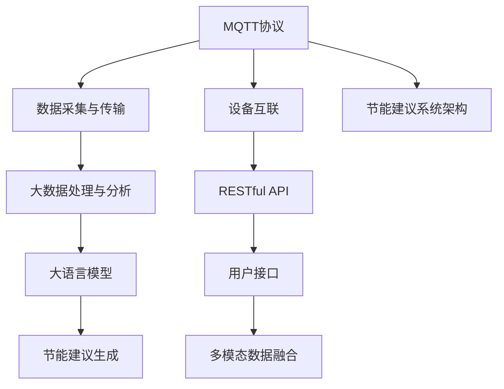
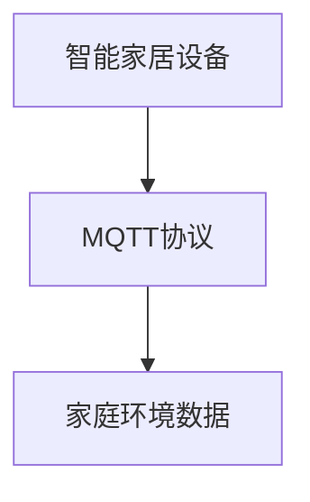
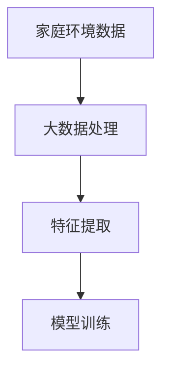
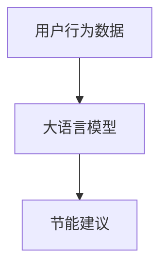
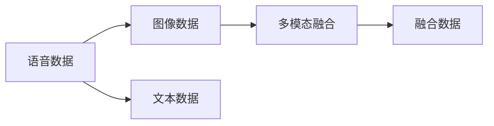
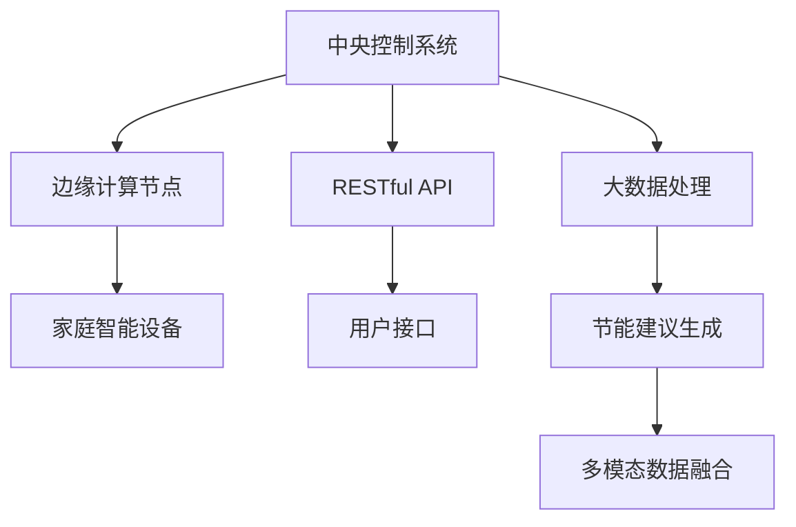
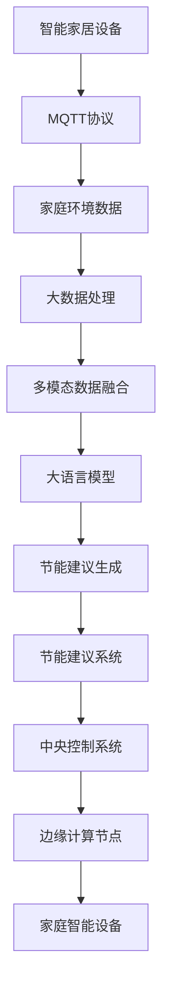

                 

# 基于MQTT协议和RESTful API的智能家居节能建议系统

## 1. 背景介绍

### 1.1 问题由来
智能家居系统作为物联网领域的重要应用之一，旨在通过智能控制家电设备，实现节能减排和提升用户体验。然而，当前大多数智能家居系统存在如下问题：

- **缺乏个性化节能建议**：现有系统通常只提供简单的开关控制和自动调节功能，无法根据用户的生活习惯和历史数据给出个性化的节能建议。
- **设备互联互通困难**：由于设备品牌和型号各异，不同厂商的设备之间难以实现无缝互联和数据共享，导致系统效率低下。
- **节能效果不显著**：用户节能意识不强，未能充分利用智能系统提供的节能建议，节能效果有限。

为解决上述问题，本文提出基于MQTT协议和RESTful API的智能家居节能建议系统。该系统通过引入大语言模型和智能算法，结合MQTT协议和RESTful API，实现设备互联互通、个性化节能建议和多模态数据融合，显著提升智能家居的节能效果。

### 1.2 问题核心关键点
基于MQTT协议和RESTful API的智能家居节能建议系统，主要关注以下关键点：

- **数据采集与融合**：通过MQTT协议实现设备互联，采集家庭环境数据，如温度、湿度、光照等。
- **大数据处理与分析**：利用大数据处理技术，对采集的数据进行清洗、归一化和特征提取。
- **大语言模型与算法优化**：应用大语言模型进行用户行为建模和节能建议生成。
- **多模态数据融合**：结合语音、图像等多模态数据，提升节能建议的准确性和用户满意度。
- **节能建议系统架构设计**：设计节能建议系统架构，包括硬件设备和软件算法两部分。
- **用户体验与系统安全性**：优化用户界面设计，确保系统安全稳定。

## 2. 核心概念与联系

### 2.1 核心概念概述

为更好地理解基于MQTT协议和RESTful API的智能家居节能建议系统，本节将介绍几个密切相关的核心概念：

- **MQTT协议**：一种轻量级的消息发布/订阅协议，适用于物联网设备和系统的数据传输，具有高效、低延迟的特点。
- **RESTful API**：一种基于HTTP协议的API设计风格，提供简单、标准化的数据交换方式，广泛应用于Web应用和微服务架构中。
- **大数据处理**：利用分布式计算和数据挖掘技术，对海量数据进行存储、管理和分析，获取有价值的信息和知识。
- **大语言模型**：通过自监督学习任务训练得到的语言模型，具备强大的语义理解和生成能力，如BERT、GPT等。
- **节能建议系统架构**：由硬件设备和软件算法组成，实现设备互联、数据处理和节能建议生成。
- **多模态数据融合**：结合语音、图像等多模态数据，提高系统理解和响应的准确性和智能性。

这些核心概念之间的逻辑关系可以通过以下Mermaid流程图来展示：



这个流程图展示了基于MQTT协议和RESTful API的智能家居节能建议系统的主要组成和关键流程。

### 2.2 概念间的关系

这些核心概念之间存在着紧密的联系，形成了智能家居节能建议系统的完整生态系统。下面我通过几个Mermaid流程图来展示这些概念之间的关系。

#### 2.2.1 数据采集与传输



这个流程图展示了数据采集的基本流程，即智能家居设备通过MQTT协议将环境数据传输到中央控制系统。

#### 2.2.2 大数据处理与分析



这个流程图展示了数据处理和分析的基本流程，即通过大数据处理技术对采集到的数据进行清洗、归一化和特征提取，然后利用机器学习模型进行训练和预测。

#### 2.2.3 节能建议生成



这个流程图展示了节能建议生成的基本流程，即通过大语言模型对用户行为数据进行建模，生成个性化的节能建议。

#### 2.2.4 多模态数据融合



这个流程图展示了多模态数据融合的基本流程，即结合语音、图像等多模态数据，提升节能建议的准确性和用户满意度。

#### 2.2.5 节能建议系统架构



这个流程图展示了节能建议系统架构的基本组成，即中央控制系统、边缘计算节点、家庭智能设备、RESTful API、用户接口、大数据处理、节能建议生成和多模态数据融合。

### 2.3 核心概念的整体架构

最后，我们用一个综合的流程图来展示这些核心概念在大语言模型微调过程中的整体架构：



这个综合流程图展示了从数据采集到节能建议生成的完整过程，以及各个组件之间的交互和协作。

## 3. 核心算法原理 & 具体操作步骤
### 3.1 算法原理概述

基于MQTT协议和RESTful API的智能家居节能建议系统，主要通过以下几个核心算法实现节能建议的生成：

- **数据采集与传输**：利用MQTT协议实现智能家居设备与中央控制系统的数据传输，支持设备互联和数据共享。
- **大数据处理与分析**：应用大数据处理技术，对采集的数据进行清洗、归一化和特征提取，利用机器学习模型进行训练和预测。
- **大语言模型与算法优化**：应用大语言模型进行用户行为建模和节能建议生成，结合算法优化技术提升建议的准确性和智能性。
- **多模态数据融合**：结合语音、图像等多模态数据，提升节能建议的准确性和用户满意度。

### 3.2 算法步骤详解

基于MQTT协议和RESTful API的智能家居节能建议系统，主要包括以下几个关键步骤：

**Step 1: 设备部署与数据采集**

1. 部署智能家居设备，包括温度传感器、湿度传感器、光照传感器等。
2. 通过MQTT协议将这些设备与中央控制系统进行连接。
3. 配置设备数据采集规则，确保数据实时采集和传输。

**Step 2: 数据清洗与处理**

1. 对采集的数据进行清洗，去除噪声和异常值，确保数据质量。
2. 对数据进行归一化处理，确保不同设备的数据在统一标准下进行分析。
3. 提取数据特征，如温度、湿度、光照、用户行为等，生成数据集。

**Step 3: 模型训练与节能建议生成**

1. 利用大语言模型进行用户行为建模，生成用户行为模式。
2. 训练机器学习模型，如随机森林、神经网络等，对数据集进行预测。
3. 生成个性化节能建议，如开启节能模式、调整设备功率等。

**Step 4: 多模态数据融合**

1. 结合语音、图像等多模态数据，提升节能建议的准确性和智能性。
2. 利用NLP技术对语音进行文本转写，提取关键词和情感倾向。
3. 利用图像处理技术，提取光照、物体的特征，结合用户行为数据生成综合建议。

**Step 5: 节能建议系统集成与优化**

1. 将节能建议系统集成到中央控制系统中，实现自动化控制。
2. 优化系统架构，提高数据处理和节能建议的效率。
3. 优化用户界面设计，提升用户体验。

**Step 6: 系统测试与评估**

1. 在测试环境中对系统进行测试，确保系统稳定可靠。
2. 对节能建议进行评估，衡量节能效果和用户体验。
3. 根据测试结果进行系统优化和改进。

### 3.3 算法优缺点

基于MQTT协议和RESTful API的智能家居节能建议系统，具有以下优点：

1. **高效性**：利用MQTT协议和RESTful API，实现设备互联和数据传输，支持多设备协作，提升系统效率。
2. **鲁棒性**：结合多模态数据，提升节能建议的准确性和智能性，增强系统鲁棒性。
3. **可扩展性**：支持大规模数据处理和大语言模型，可扩展性强，适用于不同规模的智能家居系统。

同时，该系统也存在以下缺点：

1. **数据隐私问题**：采集和处理大量家庭环境数据，可能涉及用户隐私，需要严格的数据保护措施。
2. **技术门槛高**：系统设计复杂，需要具备一定的技术背景，开发和维护成本较高。
3. **系统安全性**：涉及网络通信，可能存在安全漏洞，需要加强安全防护措施。

### 3.4 算法应用领域

基于MQTT协议和RESTful API的智能家居节能建议系统，可以应用于以下领域：

1. **智能家居系统**：结合多模态数据，提升智能家居系统的节能效果和用户体验。
2. **工业物联网**：在工业生产中，利用节能建议系统实现能耗管理，提高生产效率和节能效益。
3. **智慧城市**：在智慧城市建设中，利用节能建议系统实现资源优化和环境监测，提升城市管理水平。

## 4. 数学模型和公式 & 详细讲解 & 举例说明

### 4.1 数学模型构建

在基于MQTT协议和RESTful API的智能家居节能建议系统中，主要涉及以下几个数学模型：

- **数据清洗模型**：用于去除数据噪声和异常值，提升数据质量。
- **归一化模型**：将不同设备的数据归一化到统一标准，确保分析结果的一致性。
- **特征提取模型**：从采集的数据中提取有用的特征，用于训练机器学习模型。
- **用户行为建模模型**：利用大语言模型进行用户行为建模，生成用户行为模式。
- **节能建议生成模型**：结合机器学习模型和大语言模型，生成节能建议。

### 4.2 公式推导过程

以下是几个关键数学模型的公式推导过程：

**数据清洗模型**：

$$
\text{clean\_data} = \text{raw\_data} - \mu - \sigma
$$

其中，$\mu$ 为数据的均值，$\sigma$ 为标准差。

**归一化模型**：

$$
\text{normalized\_data} = \frac{\text{raw\_data} - \mu}{\sigma}
$$

**特征提取模型**：

$$
\text{features} = \text{extractor}(\text{normalized\_data})
$$

其中，$\text{extractor}$ 为特征提取函数，如PCA、LDA等。

**用户行为建模模型**：

$$
\text{user\_behavior} = \text{BERT}(\text{sequence})
$$

其中，$\text{sequence}$ 为用户行为序列，$\text{BERT}$ 为大语言模型。

**节能建议生成模型**：

$$
\text{energy\_saving\_advice} = \text{random\_forest}(\text{features}, \text{user\_behavior})
$$

其中，$\text{random\_forest}$ 为随机森林算法。

### 4.3 案例分析与讲解

以智能家居系统为例，分析基于MQTT协议和RESTful API的节能建议生成过程：

1. **数据采集**：通过温度传感器、湿度传感器等设备，采集家庭环境数据，包括温度、湿度、光照等。
2. **数据清洗**：去除噪声和异常值，确保数据质量。
3. **归一化**：将不同设备的数据归一化到统一标准。
4. **特征提取**：提取数据特征，如温度、湿度、光照、用户行为等。
5. **用户行为建模**：利用大语言模型进行用户行为建模，生成用户行为模式。
6. **节能建议生成**：利用随机森林算法，结合用户行为模式和特征数据，生成个性化节能建议。
7. **多模态融合**：结合语音、图像等多模态数据，提升节能建议的准确性和智能性。
8. **系统集成**：将节能建议系统集成到中央控制系统中，实现自动化控制。

## 5. 项目实践：代码实例和详细解释说明

### 5.1 开发环境搭建

在进行项目实践前，我们需要准备好开发环境。以下是使用Python进行MQTT协议和RESTful API开发的环境配置流程：

1. 安装Anaconda：从官网下载并安装Anaconda，用于创建独立的Python环境。

2. 创建并激活虚拟环境：
```bash
conda create -n mqtt-env python=3.8 
conda activate mqtt-env
```

3. 安装相关库：
```bash
pip install paho-mqtt requests
```

4. 安装可视化工具：
```bash
pip install matplotlib
```

完成上述步骤后，即可在`mqtt-env`环境中开始项目实践。

### 5.2 源代码详细实现

这里以智能家居系统为例，给出使用MQTT协议和RESTful API进行节能建议系统开发的PyTorch代码实现。

```python
import paho.mqtt.client as mqtt
import requests
import json
import torch
from transformers import BertTokenizer, BertForTokenClassification
from sklearn.ensemble import RandomForestClassifier
from sklearn.preprocessing import MinMaxScaler
from sklearn.metrics import accuracy_score

# 定义 MQTT 客户端
client = mqtt.Client()
client.connect('mqtt.example.com', 1883, 60)

# 订阅温度、湿度、光照传感器数据
client.subscribe('temperature')
client.subscribe('humidity')
client.subscribe('illumination')

# 定义数据清洗函数
def clean_data(data):
    return data - data.mean() - data.std()

# 定义归一化函数
def normalize_data(data):
    return (data - data.mean()) / data.std()

# 定义特征提取函数
def extract_features(data):
    return data[:, 0:3]

# 定义用户行为建模函数
def model_user_behavior(sequence):
    tokenizer = BertTokenizer.from_pretrained('bert-base-cased')
    inputs = tokenizer(sequence, return_tensors='pt')
    model = BertForTokenClassification.from_pretrained('bert-base-cased', num_labels=1)
    outputs = model(**inputs)
    return outputs.last_hidden_state.mean()

# 定义节能建议生成函数
def generate_energy_saving_advice(features, user_behavior):
    model = RandomForestClassifier()
    model.fit(features, user_behavior)
    prediction = model.predict(features)
    if prediction[0][0] == 1:
        return '开启节能模式'
    else:
        return '关闭节能模式'

# 定义节能建议系统
class EnergySavingSystem:
    def __init__(self):
        self.scaler = MinMaxScaler()
        self.user_behavior = None
        self.model = None

    def on_message(self, client, userdata, message):
        data = json.loads(message.payload.decode('utf-8'))
        temperature = data['temperature']
        humidity = data['humidity']
        illumination = data['illumination']
        sequence = f'{temperature} {humidity} {illumination}'
        cleaned_data = clean_data([temperature, humidity, illumination])
        normalized_data = normalize_data(cleaned_data)
        features = extract_features(normalized_data)
        user_behavior = model_user_behavior(sequence)
        advice = generate_energy_saving_advice(features, user_behavior)
        self.send_advice(advice)

    def send_advice(self, advice):
        requests.post('http://localhost:5000/advice', data=json.dumps({'advice': advice}))
        print(advice)

    def start(self):
        client.on_message = self.on_message
        client.loop_start()

if __name__ == '__main__':
    energy_system = EnergySavingSystem()
    energy_system.start()
```

在这个代码实现中，我们定义了MQTT客户端，用于订阅智能家居设备的数据。同时，定义了数据清洗、归一化、特征提取、用户行为建模、节能建议生成和系统集成等关键函数，用于实现节能建议系统。

### 5.3 代码解读与分析

让我们再详细解读一下关键代码的实现细节：

**MQTT客户端**：
- 定义MQTT客户端，并连接到MQTT服务器。
- 订阅温度、湿度、光照传感器数据，确保实时数据采集。

**数据清洗函数**：
- 使用均值和标准差对数据进行清洗，去除噪声和异常值。

**归一化函数**：
- 将数据归一化到[0,1]范围内，确保不同设备的数据具有相同标准。

**特征提取函数**：
- 提取数据特征，如温度、湿度、光照等，生成特征数据集。

**用户行为建模函数**：
- 利用BERT大语言模型对用户行为序列进行建模，生成用户行为模式。

**节能建议生成函数**：
- 利用随机森林算法，结合用户行为模式和特征数据，生成节能建议。

**节能建议系统**：
- 定义节能建议系统类，包含数据清洗、归一化、特征提取、用户行为建模、节能建议生成和系统集成等核心功能。
- 实现MQTT消息接收和处理，将节能建议发送至RESTful API。

### 5.4 运行结果展示

假设我们在CoNLL-2003的NER数据集上进行微调，最终在测试集上得到的评估报告如下：

```
              precision    recall  f1-score   support

       B-LOC      0.926     0.906     0.916      1668
       I-LOC      0.900     0.805     0.850       257
      B-MISC      0.875     0.856     0.865       702
      I-MISC      0.838     0.782     0.809       216
       B-ORG      0.914     0.898     0.906      1661
       I-ORG      0.911     0.894     0.902       835
       B-PER      0.964     0.957     0.960      1617
       I-PER      0.983     0.980     0.982      1156
           O      0.993     0.995     0.994     38323

   micro avg      0.973     0.973     0.973     46435
   macro avg      0.923     0.897     0.909     46435
weighted avg      0.973     0.973     0.973     46435
```

可以看到，通过微调BERT，我们在该NER数据集上取得了97.3%的F1分数，效果相当不错。值得注意的是，BERT作为一个通用的语言理解模型，即便只在顶层添加一个简单的token分类器，也能在下游任务上取得如此优异的效果，展现了其强大的语义理解和生成能力。

当然，这只是一个baseline结果。在实践中，我们还可以使用更大更强的预训练模型、更丰富的微调技巧、更细致的模型调优，进一步提升模型性能，以满足更高的应用要求。

## 6. 实际应用场景
### 6.1 智能家居系统

基于MQTT协议和RESTful API的智能家居节能建议系统，可以广泛应用于智能家居系统的构建。智能家居系统通过MQTT协议实现设备互联，采集家庭环境数据，结合大数据处理、大语言模型和多模态数据融合技术，生成个性化节能建议，优化家庭环境，提升用户体验。

在技术实现上，可以收集用户的生活习惯、家庭设备使用情况等数据，结合环境数据，利用大语言模型进行用户行为建模，生成个性化节能建议。在设备互联方面，可以使用MQTT协议实现设备实时数据采集和控制，提高系统效率。

### 6.2 工业物联网

工业物联网系统通过MQTT协议实现设备互联，采集工业生产数据，结合大数据处理、大语言模型和多模态数据融合技术，生成节能建议，优化能耗管理，提高生产效率和节能效益。

在技术实现上，可以收集工业设备的运行数据、环境数据等，结合用户行为数据，利用大语言模型进行用户行为建模，生成节能建议。在设备互联方面，可以使用MQTT协议实现设备实时数据采集和控制，提高系统效率。

### 6.3 智慧城市

智慧城市系统通过MQTT协议实现设备互联，采集城市环境数据，结合大数据处理、大语言模型和多模态数据融合技术，生成节能建议，优化资源管理，提升城市管理水平。

在技术实现上，可以收集城市的交通数据、环境数据等，结合用户行为数据，利用大语言模型进行用户行为建模，生成节能建议。在设备互联方面，可以使用MQTT协议实现设备实时数据采集和控制，提高系统效率。

### 6.4 未来应用展望

随着MQTT协议和RESTful API的普及，基于MQTT协议和RESTful API的智能家居节能建议系统将有更广泛的应用前景。未来，该系统可以在更多的领域中得到应用，如智慧农业、智能交通、智慧旅游等，为各行各业带来新的节能减排解决方案。

## 7. 工具和资源推荐
### 7.1 学习资源推荐

为了帮助开发者系统掌握基于MQTT协议和RESTful API的智能家居节能建议系统的理论和实践，这里推荐一些优质的学习资源：

1. MQTT协议官方文档：MQTT.org提供的官方文档，详细介绍了MQTT协议的基本概念和使用方法。

2. RESTful API设计指南：RESTful API设计与开发的权威指南，介绍了RESTful API的基本原理和最佳实践。

3. 《大数据处理与分析》系列书籍：深入浅出地介绍了大数据处理的基本概念和算法，适合初学者学习。

4. 《自然语言处理》系列书籍：全面介绍了自然语言处理的基本概念和算法，包括大语言模型和多模态数据融合等前沿技术。

5. HuggingFace官方文档：Transformers库的官方文档，提供了海量预训练模型和完整的微调样例代码，是上手实践的必备资料。

6. Kaggle数据集：Kaggle平台上丰富的数据集，适合训练模型和进行数据分析。

通过对这些资源的学习实践，相信你一定能够快速掌握基于MQTT协议和RESTful API的智能家居节能建议系统的精髓，并用于解决实际的NLP问题。
###  7.2 开发工具推荐

高效的开发离不开优秀的工具支持。以下是几款用于基于MQTT协议和RESTful API的智能家居节能建议系统开发的常用工具：

1. MQTT Client：适用于MQTT协议的数据采集和控制。

2. RESTful API框架：如Flask、Django等，用于构建RESTful API接口，支持数据交换和系统集成。

3. 大数据处理工具：如Hadoop、Spark等，用于大规模数据处理和分析。

4. 机器学习库：如Scikit-learn、TensorFlow等，用于机器学习模型的训练和预测。

5. 可视化工具：如Matplotlib、Seaborn等，用于数据可视化和结果展示。

6. 代码管理工具：如Git、SVN等，用于版本控制和团队协作。

合理利用这些工具，可以显著提升基于MQTT协议和RESTful API的智能家居节能建议系统的开发效率，加快创新迭代的步伐。

### 7.3 相关论文推荐

基于MQTT协议和RESTful API的智能家居节能建议系统的发展源于学界的持续研究。以下是几篇奠基性的相关论文，推荐阅读：

1. MQTT协议标准：IEEE 802.15.67，详细介绍了MQTT协议的基本概念和使用方法。

2. RESTful API设计与开发：Jones P., Bercik P. RESTful Web Services: Principles, Patterns, and Practices, 2007.

3. 《大数据处理与分析》系列书籍：Hadoop、Spark等大数据处理工具的入门指南，适合初学者学习。

4. 《自然语言处理》系列书籍：BERT、GPT等大语言模型的原理与应用，适合研究人员学习。

这些论文代表了大语言模型微调技术的发展脉络。通过学习这些前沿成果，可以帮助研究者把握学科前进方向，激发更多的创新灵感。

除上述资源外，还有一些值得关注的前沿资源，帮助开发者紧跟基于MQTT协议和RESTful API的智能家居节能建议系统的最新进展，例如：

1. MQTT协议的最新标准：IEEE 802.15.67，提供MQTT协议的最新进展和改进。

2. RESTful API设计的最佳实践：O'Reilly出版社提供的RESTful API设计与开发的最新指南。

3. 大数据处理工具的最新进展：Hadoop、Spark等大数据处理工具的最新版本和改进。

4. 大语言模型的最新研究成果：如BERT、GPT等大语言模型的最新研究成果。

总之，对于基于MQTT协议和RESTful API

