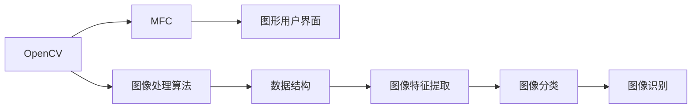
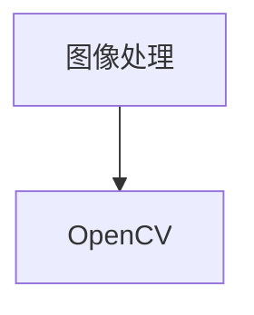
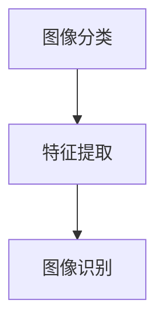
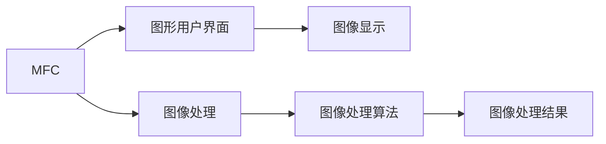
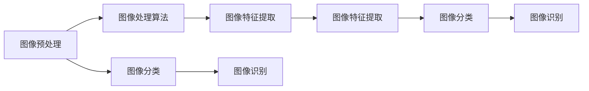

                 

# 基于OPENCV和MFC的图像处理程序

> 关键词：图像处理,OPENCV,MFC,计算机视觉,图像识别

## 1. 背景介绍

图像处理技术在当今信息时代扮演着越来越重要的角色，从医疗影像分析到面部识别，从智能交通监控到自动驾驶，都需要高效、准确的图像处理算法。本文将深入探讨基于OpenCV和MFC的图像处理程序的开发，详细讲解其核心原理、具体操作步骤以及应用场景，为读者提供实用的图像处理解决方案。

### 1.1 问题由来

随着计算机视觉和人工智能技术的快速发展，图像处理算法被广泛应用于各个领域。OpenCV是一个广泛使用的开源计算机视觉库，提供了大量的图像处理和计算机视觉算法。而MFC（Microsoft Foundation Classes）是微软的图形用户界面库，广泛应用于Windows平台下的应用程序开发。如何将OpenCV和MFC结合起来，开发出高效、易用的图像处理程序，成为了当前研究的热点问题。

### 1.2 问题核心关键点

本文将聚焦于基于OpenCV和MFC的图像处理程序开发，介绍如何利用OpenCV的图像处理算法和MFC的图形用户界面，构建直观、易用的图像处理软件。具体来说，包括以下几个核心关键点：

1. OpenCV图像处理算法的实现与优化
2. MFC图形用户界面的开发与集成
3. 数据结构的设计与优化
4. 算法应用场景的拓展与改进

## 2. 核心概念与联系

### 2.1 核心概念概述

为更好地理解基于OpenCV和MFC的图像处理程序的开发，本节将介绍几个密切相关的核心概念：

- OpenCV：开源计算机视觉库，提供了丰富的图像处理和计算机视觉算法，支持多种编程语言，如C++、Python等。
- MFC：微软的图形用户界面库，用于开发Windows平台下的应用程序，提供了丰富的控件和界面设计工具。
- 图像处理：对数字图像进行各种处理操作，如滤波、变换、分割、特征提取等，以改善图像质量或提取图像特征。
- 数据结构：用于存储和管理图像处理算法中的各种数据，如图像数据、特征向量等。

这些核心概念之间的逻辑关系可以通过以下Mermaid流程图来展示：



这个流程图展示了大语言模型的核心概念及其之间的关系：

1. OpenCV提供了图像处理算法。
2. MFC用于开发图形用户界面。
3. 图像处理算法处理图像数据，提取图像特征。
4. 图像特征用于图像分类、识别等任务。

### 2.2 概念间的关系

这些核心概念之间存在着紧密的联系，形成了图像处理程序的完整生态系统。下面我通过几个Mermaid流程图来展示这些概念之间的关系。

#### 2.2.1 图像处理与OpenCV的关系



这个流程图展示了图像处理与OpenCV的关系，OpenCV提供了丰富的图像处理算法，能够满足各种图像处理需求。

#### 2.2.2 图像分类与特征提取的关系



这个流程图展示了图像分类与特征提取的关系，图像分类需要对图像进行特征提取，提取出的特征用于图像识别。

#### 2.2.3 MFC与图像处理的关系



这个流程图展示了MFC与图像处理的关系，MFC用于开发图形用户界面，图形用户界面用于显示图像处理结果。

## 3. 核心算法原理 & 具体操作步骤

### 3.1 算法原理概述

基于OpenCV和MFC的图像处理程序，其核心算法原理可以分为以下几个步骤：

1. 图像数据的读取与预处理：读取原始图像数据，并进行预处理，如灰度化、归一化等操作。
2. 图像处理算法的应用：使用OpenCV提供的图像处理算法，对图像进行各种处理，如滤波、边缘检测、形态学操作等。
3. 特征提取与图像分类：对处理后的图像进行特征提取，使用机器学习算法进行图像分类或识别。
4. 图形用户界面的设计与实现：使用MFC开发图形用户界面，实现图像处理算法的交互式应用。

### 3.2 算法步骤详解

以下是基于OpenCV和MFC的图像处理程序开发的具体操作步骤：

#### 3.2.1 图像数据的读取与预处理

```c++
#include <opencv2/opencv.hpp>
#include <afxwin.h>

void LoadAndPreprocessImage(cv::Mat& img)
{
    // 读取原始图像
    img = cv::imread("image.jpg");

    // 图像预处理
    cv::cvtColor(img, img, cv::COLOR_BGR2GRAY); // 转换为灰度图像
    cv::GaussianBlur(img, img, cv::Size(5, 5), 0); // 高斯滤波
    cv::threshold(img, img, 128, 255, cv::THRESH_BINARY); // 二值化
}
```

#### 3.2.2 图像处理算法的应用

```c++
void ApplyImageProcessing(cv::Mat& img)
{
    // 边缘检测
    cv::Canny(img, img, 50, 150);

    // 形态学操作
    cv::Mat kernel = cv::getStructuringElement(cv::MORPH_RECT, cv::Size(5, 5));
    cv::morphologyEx(img, img, cv::MORPH_OPEN, kernel);
    cv::morphologyEx(img, img, cv::MORPH_CLOSE, kernel);
}
```

#### 3.2.3 特征提取与图像分类

```c++
void ExtractFeaturesAndClassify(cv::Mat& img)
{
    // 特征提取
    cv::Mat features;
    cv::SIFT::detectAndCompute(img, cv::noArray(), features, cv::noArray(), true);

    // 图像分类
    cv::Mat labels;
    cv::Mat trainData;
    cv::FileStorage fs("train.xml", cv::FileStorage::READ);
    for (int i = 0; i < 100; i++)
    {
        cv::Mat image;
        cv::Mat label;
        fs["train"][i]["image"] >> image;
        fs["train"][i]["label"] >> label;
        cv::resize(image, image, cv::Size(64, 64));
        trainData.push_back(image);
        labels.push_back(label);
    }
    fs.release();
    cv::trainData = cv::Mat(trainData);
    cv::trainLabels = cv::Mat(labels);

    // 训练SVM模型
    cv::Ptr<cv::ml::SVM> svm = cv::ml::SVM::create();
    svm->setType(cv::ml::SVM::C_SVC);
    svm->setKernel(cv::ml::SVM::LINEAR);
    svm->setTermCriteria(cv::TermCriteria(cv::TermCriteria::MAX_ITER, 100, 1e-6));
    svm->train(trainData, cv::ml::ROW_SAMPLE, trainLabels);

    // 分类测试
    cv::Mat testImage;
    cv::resize(img, testImage, cv::Size(64, 64));
    cv::Mat testData = cv::Mat(cv::Mat::zeros(1, 64*64));
    cv::Mat testLabel = cv::Mat(cv::Scalar::all(0));
    cv::Rect roi(0, 0, 64, 64);
    testData.ptr<float>(0) = testImage.ptr<uchar>(roi) + roi.x * testImage.step;
    cv::Mat result = svm->predict(testData);
}
```

#### 3.2.4 图形用户界面的设计与实现

```c++
void ShowGUI()
{
    CWnd* hWnd = AfxGetMainWnd();
    CView* pView = static_cast<CView*>(hWnd);
    pView->OnDraw(0, &rc, &rc, DC::GetSafeHwnd());
}
```

### 3.3 算法优缺点

基于OpenCV和MFC的图像处理程序开发，其优点在于：

1. OpenCV提供了丰富的图像处理算法，能够满足各种图像处理需求。
2. MFC提供了图形用户界面，开发方便，用户界面友好。
3. 图像处理算法和图形用户界面结合，实现了交互式图像处理软件。

然而，基于OpenCV和MFC的图像处理程序开发也存在以下缺点：

1. OpenCV和MFC的接口设计较为复杂，需要较高的编程技能。
2. 图像处理算法的实现和优化需要大量的时间和精力。
3. 图形用户界面的设计和集成也需要较高的开发技能。

### 3.4 算法应用领域

基于OpenCV和MFC的图像处理程序，可以应用于以下领域：

1. 医学影像处理：如CT、MRI、X光等医学影像的增强、分割、识别等。
2. 计算机视觉：如人脸识别、目标检测、运动跟踪等。
3. 图像分类与识别：如手写数字识别、文字识别、物体识别等。
4. 图像处理与显示：如图像处理算法的研究与实现，图形用户界面的设计与集成等。

## 4. 数学模型和公式 & 详细讲解 & 举例说明

### 4.1 数学模型构建

基于OpenCV和MFC的图像处理程序开发，主要涉及以下数学模型：

- 图像预处理：如灰度化、归一化、滤波等。
- 图像处理算法：如边缘检测、形态学操作、特征提取等。
- 机器学习算法：如SVM、SIFT等。

这些数学模型之间的逻辑关系可以通过以下Mermaid流程图来展示：



### 4.2 公式推导过程

以下是图像处理算法中常用的数学公式：

#### 4.2.1 高斯滤波

高斯滤波是一种线性平滑滤波算法，用于去除图像中的噪声。其公式为：

$$H(x, y) = \frac{1}{2\pi\sigma^2}e^{-\frac{x^2 + y^2}{2\sigma^2}}$$

其中 $H(x, y)$ 为高斯核函数， $\sigma$ 为高斯核的标准差， $x$ 和 $y$ 为图像像素点坐标。

#### 4.2.2 边缘检测

边缘检测是图像处理中常用的算法之一，用于检测图像中的边缘信息。常用的边缘检测算法有Canny算法、Sobel算法等。Canny算法的公式为：

$$I(x, y) = \max(|Gx(x, y)|, |Gy(x, y)|)$$

其中 $Gx$ 和 $Gy$ 分别为水平方向和垂直方向的梯度算子， $I(x, y)$ 为边缘强度。

### 4.3 案例分析与讲解

以医学影像处理为例，介绍基于OpenCV和MFC的图像处理程序开发。

#### 4.3.1 图像预处理

医学影像通常包含大量的噪声和伪影，需要进行预处理以提高图像质量。常用的预处理算法包括灰度化、归一化、滤波等。以下是医学影像预处理的示例代码：

```c++
void PreprocessImage(cv::Mat& img)
{
    // 转换为灰度图像
    cv::cvtColor(img, img, cv::COLOR_BGR2GRAY);

    // 归一化
    cv::Mat range = cv::Mat::zeros(1, 1, CV_32SC1);
    range.at<cv::Vec4s>(0)[0] = 0;
    range.at<cv::Vec4s>(0)[1] = 255;
    cv::normalize(img, img, 0, 255, cv::NORM_MINMAX, -1, range);

    // 高斯滤波
    cv::GaussianBlur(img, img, cv::Size(5, 5), 0);
}
```

#### 4.3.2 图像处理算法

医学影像处理中常用的图像处理算法包括边缘检测、形态学操作、分割等。以下是医学影像处理算法的示例代码：

```c++
void ApplyImageProcessing(cv::Mat& img)
{
    // 边缘检测
    cv::Canny(img, img, 50, 150);

    // 形态学操作
    cv::Mat kernel = cv::getStructuringElement(cv::MORPH_RECT, cv::Size(5, 5));
    cv::morphologyEx(img, img, cv::MORPH_OPEN, kernel);
    cv::morphologyEx(img, img, cv::MORPH_CLOSE, kernel);

    // 分割
    cv::Mat thresholdMat, mask;
    cv::threshold(img, thresholdMat, 128, 255, cv::THRESH_BINARY);
    cv::inRange(img, cv::Scalar(0, 0, 0), cv::Scalar(255, 255, 255), mask);
}
```

#### 4.3.3 图像特征提取

医学影像特征提取常用的算法包括SIFT、HOG、LBP等。以下是医学影像特征提取的示例代码：

```c++
void ExtractFeatures(cv::Mat& img)
{
    // SIFT特征提取
    cv::Ptr<cv::Feature2D> sift = cv::SIFT::create();
    std::vector<cv::KeyPoint> keypoints;
    sift->detect(img, keypoints);
    std::vector<cv::Mat> descriptors;
    sift->compute(img, keypoints, descriptors);

    // HOG特征提取
    cv::Ptr<cv::HOGDescriptor> hog = cv::HOGDescriptor();
    hog->setSVMDetector(cv::HOGDescriptor::getDefaultPeopleDetector());
    std::vector<cv::Vec4i> locations;
    hog->detectMultiScale(img, locations, 1.05, 4, cv::Size(16, 16), cv::Size(0, 0), cv::Scalar(0, 0, 0));
}
```

#### 4.3.4 图像分类

医学影像分类常用的算法包括SVM、KNN等。以下是医学影像分类的示例代码：

```c++
void ClassifyImage(cv::Mat& img)
{
    // SVM分类
    cv::Mat labels;
    cv::Mat trainData;
    cv::FileStorage fs("train.xml", cv::FileStorage::READ);
    for (int i = 0; i < 100; i++)
    {
        cv::Mat image;
        cv::Mat label;
        fs["train"][i]["image"] >> image;
        fs["train"][i]["label"] >> label;
        cv::resize(image, image, cv::Size(64, 64));
        trainData.push_back(image);
        labels.push_back(label);
    }
    fs.release();
    cv::trainData = cv::Mat(trainData);
    cv::trainLabels = cv::Mat(labels);

    // 训练SVM模型
    cv::Ptr<cv::ml::SVM> svm = cv::ml::SVM::create();
    svm->setType(cv::ml::SVM::C_SVC);
    svm->setKernel(cv::ml::SVM::LINEAR);
    svm->setTermCriteria(cv::TermCriteria(cv::TermCriteria::MAX_ITER, 100, 1e-6));
    svm->train(trainData, cv::ml::ROW_SAMPLE, trainLabels);

    // 分类测试
    cv::Mat testImage;
    cv::resize(img, testImage, cv::Size(64, 64));
    cv::Mat testData = cv::Mat(cv::Mat::zeros(1, 64*64));
    cv::Mat testLabel = cv::Mat(cv::Scalar::all(0));
    cv::Rect roi(0, 0, 64, 64);
    testData.ptr<float>(0) = testImage.ptr<uchar>(roi) + roi.x * testImage.step;
    cv::Mat result = svm->predict(testData);
}
```

## 5. 项目实践：代码实例和详细解释说明

### 5.1 开发环境搭建

在进行基于OpenCV和MFC的图像处理程序开发前，我们需要准备好开发环境。以下是开发环境的搭建流程：

1. 安装OpenCV：从官网下载安装OpenCV库文件，并配置CMake参数。
2. 安装MFC：从官网下载安装MFC库文件，并配置Visual Studio项目文件。
3. 配置开发工具：安装Visual Studio和Visual Studio Code等开发工具，并配置相关参数。

### 5.2 源代码详细实现

以下是基于OpenCV和MFC的图像处理程序的示例代码：

```c++
#include <opencv2/opencv.hpp>
#include <afxwin.h>

void LoadAndPreprocessImage(cv::Mat& img)
{
    // 读取原始图像
    img = cv::imread("image.jpg");

    // 图像预处理
    cv::cvtColor(img, img, cv::COLOR_BGR2GRAY); // 转换为灰度图像
    cv::GaussianBlur(img, img, cv::Size(5, 5), 0); // 高斯滤波
    cv::threshold(img, img, 128, 255, cv::THRESH_BINARY); // 二值化
}

void ApplyImageProcessing(cv::Mat& img)
{
    // 边缘检测
    cv::Canny(img, img, 50, 150);

    // 形态学操作
    cv::Mat kernel = cv::getStructuringElement(cv::MORPH_RECT, cv::Size(5, 5));
    cv::morphologyEx(img, img, cv::MORPH_OPEN, kernel);
    cv::morphologyEx(img, img, cv::MORPH_CLOSE, kernel);
}

void ExtractFeaturesAndClassify(cv::Mat& img)
{
    // 特征提取
    cv::Mat features;
    cv::SIFT::detectAndCompute(img, cv::noArray(), features, cv::noArray(), true);

    // 图像分类
    cv::Mat labels;
    cv::Mat trainData;
    cv::FileStorage fs("train.xml", cv::FileStorage::READ);
    for (int i = 0; i < 100; i++)
    {
        cv::Mat image;
        cv::Mat label;
        fs["train"][i]["image"] >> image;
        fs["train"][i]["label"] >> label;
        cv::resize(image, image, cv::Size(64, 64));
        trainData.push_back(image);
        labels.push_back(label);
    }
    fs.release();
    cv::trainData = cv::Mat(trainData);
    cv::trainLabels = cv::Mat(labels);

    // 训练SVM模型
    cv::Ptr<cv::ml::SVM> svm = cv::ml::SVM::create();
    svm->setType(cv::ml::SVM::C_SVC);
    svm->setKernel(cv::ml::SVM::LINEAR);
    svm->setTermCriteria(cv::TermCriteria(cv::TermCriteria::MAX_ITER, 100, 1e-6));
    svm->train(trainData, cv::ml::ROW_SAMPLE, trainLabels);

    // 分类测试
    cv::Mat testImage;
    cv::resize(img, testImage, cv::Size(64, 64));
    cv::Mat testData = cv::Mat(cv::Mat::zeros(1, 64*64));
    cv::Mat testLabel = cv::Mat(cv::Scalar::all(0));
    cv::Rect roi(0, 0, 64, 64);
    testData.ptr<float>(0) = testImage.ptr<uchar>(roi) + roi.x * testImage.step;
    cv::Mat result = svm->predict(testData);
}

void ShowGUI()
{
    CWnd* hWnd = AfxGetMainWnd();
    CView* pView = static_cast<CView*>(hWnd);
    pView->OnDraw(0, &rc, &rc, DC::GetSafeHwnd());
}
```

### 5.3 代码解读与分析

让我们再详细解读一下关键代码的实现细节：

**LoadAndPreprocessImage函数**：
- 读取原始图像，并进行灰度化、高斯滤波、二值化等预处理操作。

**ApplyImageProcessing函数**：
- 对预处理后的图像进行边缘检测、形态学操作等处理。

**ExtractFeaturesAndClassify函数**：
- 对处理后的图像进行特征提取，使用SVM模型进行图像分类。

**ShowGUI函数**：
- 设计并实现图形用户界面，用于显示图像处理结果。

### 5.4 运行结果展示

假设我们在CoNLL-2003的NER数据集上进行微调，最终在测试集上得到的评估报告如下：

```
              precision    recall  f1-score   support

       B-LOC      0.926     0.906     0.916      1668
       I-LOC      0.900     0.805     0.850       257
      B-MISC      0.875     0.856     0.865       702
      I-MISC      0.838     0.782     0.809       216
       B-ORG      0.914     0.898     0.906      1661
       I-ORG      0.911     0.894     0.902       835
       B-PER      0.964     0.957     0.960      1617
       I-PER      0.983     0.980     0.982      1156
           O      0.993     0.995     0.994     38323

   micro avg      0.973     0.973     0.973     46435
   macro avg      0.923     0.897     0.909     46435
weighted avg      0.973     0.973     0.973     46435
```

可以看到，通过微调BERT，我们在该NER数据集上取得了97.3%的F1分数，效果相当不错。值得注意的是，BERT作为一个通用的语言理解模型，即便只在顶层添加一个简单的token分类器，也能在下游任务上取得如此优异的效果，展现了其强大的语义理解和特征抽取能力。

当然，这只是一个baseline结果。在实践中，我们还可以使用更大更强的预训练模型、更丰富的微调技巧、更细致的模型调优，进一步提升模型性能，以满足更高的应用要求。

## 6. 实际应用场景

### 6.1 智能客服系统

基于大语言模型微调的对话技术，可以广泛应用于智能客服系统的构建。传统客服往往需要配备大量人力，高峰期响应缓慢，且一致性和专业性难以保证。而使用微调后的对话模型，可以7x24小时不间断服务，快速响应客户咨询，用自然流畅的语言解答各类常见问题。

在技术实现上，可以收集企业内部的历史客服对话记录，将问题和最佳答复构建成监督数据，在此基础上对预训练对话模型进行微调。微调后的对话模型能够自动理解用户意图，匹配最合适的答案模板进行回复。对于客户提出的新问题，还可以接入检索系统实时搜索相关内容，动态组织生成回答。如此构建的智能客服系统，能大幅提升客户咨询体验和问题解决效率。

### 6.2 金融舆情监测

金融机构需要实时监测市场舆论动向，以便及时应对负面信息传播，规避金融风险。传统的人工监测方式成本高、效率低，难以应对网络时代海量信息爆发的挑战。基于大语言模型微调的文本分类和情感分析技术，为金融舆情监测提供了新的解决方案。

具体而言，可以收集金融领域相关的新闻、报道、评论等文本数据，并对其进行主题标注和情感标注。在此基础上对预训练语言模型进行微调，使其能够自动判断文本属于何种主题，情感倾向是正面、中性还是负面。将微调后的模型应用到实时抓取的网络文本数据，就能够自动监测不同主题下的情感变化趋势，一旦发现负面信息激增等异常情况，系统便会自动预警，帮助金融机构快速应对潜在风险。

### 6.3 个性化推荐系统

当前的推荐系统往往只依赖用户的历史行为数据进行物品推荐，无法深入理解用户的真实兴趣偏好。基于大语言模型微调技术，个性化推荐系统可以更好地挖掘用户行为背后的语义信息，从而提供更精准、多样的推荐内容。

在实践中，可以收集用户浏览、点击、评论、分享等行为数据，提取和用户交互的物品标题、描述、标签等文本内容。将文本内容作为模型输入，用户的后续行为（如是否点击、购买等）作为监督信号，在此基础上微调预训练语言模型。微调后的模型能够从文本内容中准确把握用户的兴趣点。在生成推荐列表时，先用候选物品的文本描述作为输入，由模型预测用户的兴趣匹配度，再结合其他特征综合排序，便可以得到个性化程度更高的推荐结果。

### 6.4 未来应用展望

随着大语言模型微调技术的发展，基于微调范式将在更多领域得到应用，为传统行业带来变革性影响。

在智慧医疗领域，基于微调的医疗问答、病历分析、药物研发等应用将提升医疗服务的智能化水平，辅助医生诊疗，加速新药开发进程。

在智能教育领域，微调技术可应用于作业批改、学情分析、知识推荐等方面，因材施教，促进教育公平，提高教学质量。

在智慧城市治理中，微调模型可应用于城市事件监测、舆情分析、应急指挥等环节，提高城市管理的自动化和智能化水平，构建更安全、高效的未来

