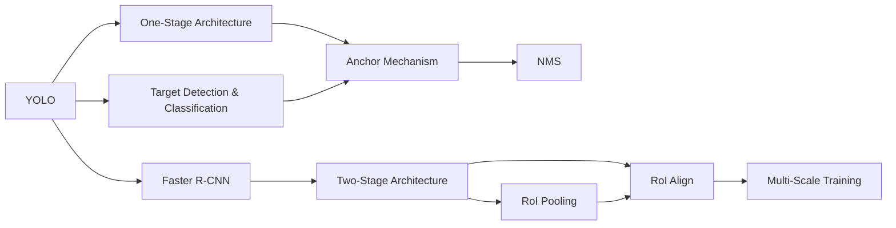
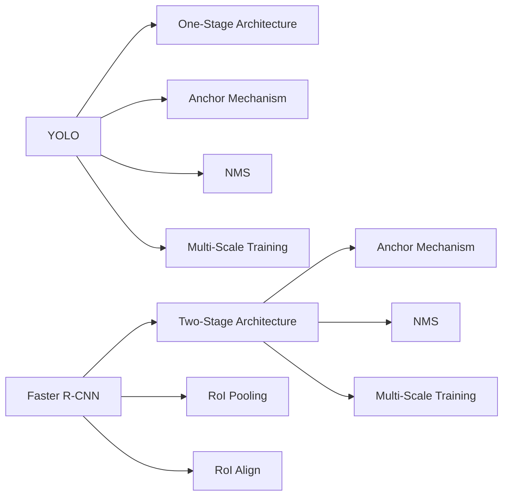
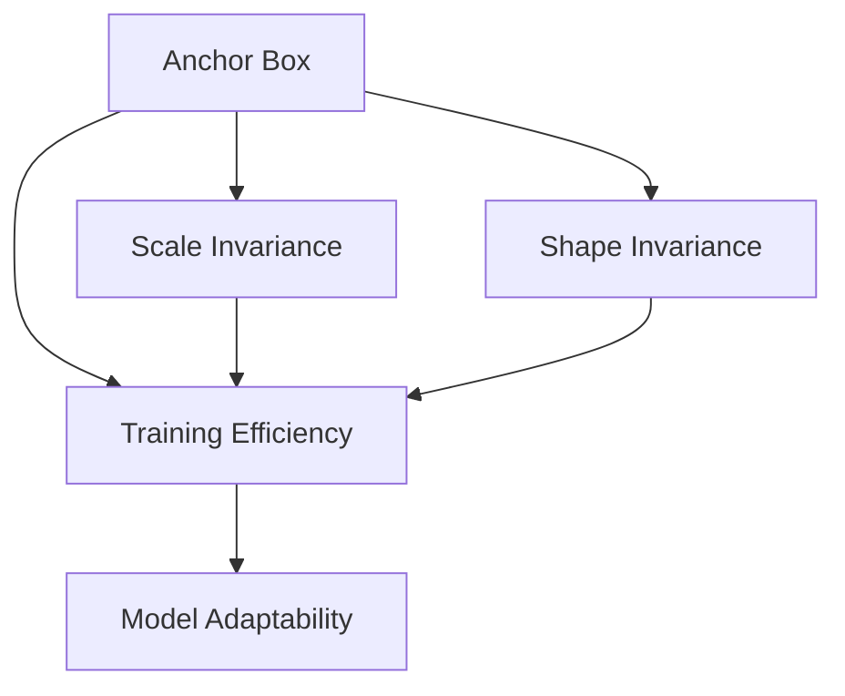
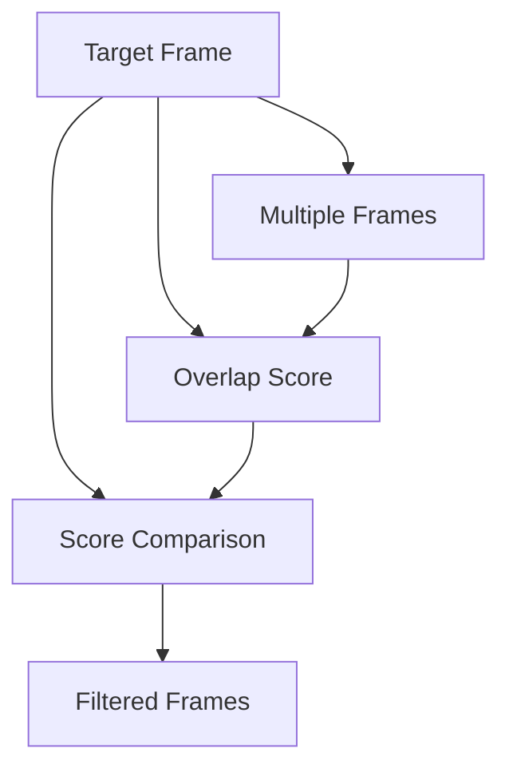

                 

# 基于YOLO和FasterR-CNN的目标识别算法研究

> 关键词：目标识别,YOLO, FasterR-CNN, 深度学习, 计算机视觉, 图像处理

## 1. 背景介绍

### 1.1 问题由来
目标识别是计算机视觉领域的重要任务，广泛应用于自动驾驶、智能监控、机器人导航等领域。其核心目标是从输入图像中自动识别出目标物体并给出类别和位置信息。传统方法如Haar特征检测、SIFT特征匹配等，存在计算复杂度高、需要大量标注数据等问题，难以满足实际应用需求。

近年来，基于深度学习的目标识别方法取得了巨大突破。YOLO（You Only Look Once）和Faster R-CNN（Faster Region-based Convolutional Neural Network）是其中的典型代表，分别采用不同策略，提升了目标识别的速度和精度，成为目标识别领域的经典算法。

### 1.2 问题核心关键点
YOLO和Faster R-CNN算法的核心关键点包括：
1. **YOLO的One-Stage架构**：通过将目标检测和分类任务融合在单次前向传播中，YOLO大大提升了检测速度，但精度相对较低。
2. **Faster R-CNN的两阶段架构**：先通过RPN（Region Proposal Network）生成候选区域，再进行分类和回归，提升了检测精度，但速度较慢。
3. **锚框机制**：通过预定义的锚框，YOLO和Faster R-CNN算法能够学习不同尺度和形状的特征，从而更好地适应目标物体的变化。
4. **非极大值抑制（NMS）**：用于去除冗余框，提高最终检测结果的质量。
5. **多尺度训练**：通过在不同尺度下训练，YOLO和Faster R-CNN能够更好地适应不同大小的目标物体。

### 1.3 问题研究意义
研究YOLO和Faster R-CNN算法，对于提升目标识别的速度和精度，加速计算机视觉技术的产业化进程，具有重要意义：

1. 提升检测速度：YOLO和Faster R-CNN在实际应用中，能够快速处理大规模图像数据，满足实时性和高效性的要求。
2. 提高检测精度：通过多尺度训练和锚框机制，YOLO和Faster R-CNN在目标识别上取得了较高的准确率。
3. 降低标注成本：相比于传统的机器学习算法，YOLO和Faster R-CNN对标注数据的要求较低，减轻了数据标注的负担。
4. 拓展应用场景：目标识别技术在自动驾驶、智能监控、机器人等领域具有广泛的应用前景。
5. 推动创新发展：YOLO和Faster R-CNN的研究促进了计算机视觉技术的发展，催生了更多的研究方向和创新。

## 2. 核心概念与联系

### 2.1 核心概念概述

为更好地理解YOLO和Faster R-CNN算法，本节将介绍几个密切相关的核心概念：

- **YOLO（You Only Look Once）**：一种单阶段目标检测算法，通过将目标检测和分类任务合并，实现了实时性的目标检测。YOLO算法的主要创新在于其One-Stage架构，能够在一次前向传播中同时完成检测和分类。

- **Faster R-CNN（Faster Region-based Convolutional Neural Network）**：一种两阶段目标检测算法，通过先进行区域候选生成，再对候选区域进行分类和回归，实现了高精度的目标检测。Faster R-CNN的主要创新在于其RoI Pooling和RoIAlign机制，能够有效地处理不同尺度下的目标物体。

- **锚框（Anchor）**：在YOLO和Faster R-CNN中，通过定义一组预定义的锚框，算法能够学习不同尺度和形状的特征，从而适应目标物体的多样性。

- **非极大值抑制（NMS）**：在YOLO和Faster R-CNN中，使用NMS技术去除冗余框，提高最终检测结果的质量。

- **多尺度训练**：在YOLO和Faster R-CNN中，通过在不同尺度下进行训练，算法能够更好地适应不同大小的目标物体。

这些核心概念之间的逻辑关系可以通过以下Mermaid流程图来展示：



这个流程图展示了YOLO和Faster R-CNN的核心概念及其之间的关系：

1. YOLO通过One-Stage架构，实现了目标检测和分类的单次前向传播。
2. YOLO和Faster R-CNN都使用了锚框机制，学习不同尺度和形状的特征。
3. Faster R-CNN采用两阶段架构，先通过RoI Pooling生成候选区域，再对候选区域进行分类和回归。
4. Faster R-CNN使用了RoI Align机制，更准确地提取候选区域特征。
5. 两算法都使用了非极大值抑制（NMS）技术，去除冗余框，提高最终检测结果的质量。
6. 两算法都支持多尺度训练，能够适应不同大小的目标物体。

这些核心概念共同构成了YOLO和Faster R-CNN算法的核心框架，使得它们在目标识别任务中取得了优秀的表现。通过理解这些核心概念，我们可以更好地把握YOLO和Faster R-CNN算法的工作原理和优化方向。

### 2.2 概念间的关系

这些核心概念之间存在着紧密的联系，形成了YOLO和Faster R-CNN算法的完整生态系统。下面我通过几个Mermaid流程图来展示这些概念之间的关系。

#### 2.2.1 YOLO和Faster R-CNN的比较



这个流程图展示了YOLO和Faster R-CNN之间的区别和联系：

1. YOLO采用单阶段架构，而Faster R-CNN采用两阶段架构。
2. 两算法都使用了锚框机制和NMS技术。
3. 两算法都支持多尺度训练。

#### 2.2.2 锚框机制的详细应用



这个流程图展示了锚框机制在不同方面的应用：

1. 锚框能够实现尺度不变性，使得模型能够适应不同大小的目标物体。
2. 锚框能够实现形状不变性，使得模型能够适应不同形状的物体。
3. 锚框能够提高训练效率，使得模型能够在较少标注数据下进行训练。
4. 锚框能够提高模型适应性，使得模型能够适应各种目标物体。

#### 2.2.3 非极大值抑制（NMS）的详细应用



这个流程图展示了NMS技术的应用过程：

1. 目标框通过RoI Pooling或RoI Align进行特征提取。
2. 提取的特征通过softmax或logsoftmax函数进行分类得分计算。
3. 通过得分计算，得到每个目标框的置信度得分。
4. 计算每个目标框的置信度得分，保留得分最高的框。
5. 对重叠的框进行打分，去除低得分的框。

这些核心概念之间相互关联，共同构成了YOLO和Faster R-CNN算法的核心框架，使得它们在目标识别任务中取得了优秀的表现。通过理解这些核心概念，我们可以更好地把握YOLO和Faster R-CNN算法的工作原理和优化方向。

### 2.3 核心概念的整体架构

最后，我们用一个综合的流程图来展示这些核心概念在大规模目标识别应用中的整体架构：

```mermaid
graph TB
    A[Large Scale Image Data] --> B[Data Augmentation]
    A --> C[Preprocessing]
    C --> D[YOLO/Faster R-CNN Model]
    D --> E[Anchor Box Generation]
    D --> F[RoI Pooling/Align]
    E --> F
    F --> G[Feature Extraction]
    G --> H[Classification & Regression]
    G --> I[Non-Maximum Suppression (NMS)]
    I --> J[Post-processing]
    J --> K[Final Detection Results]
```

这个综合流程图展示了从数据预处理到最终检测结果的完整过程。大规模目标识别应用通常涉及以下步骤：

1. 大规模图像数据预处理，如尺寸归一、灰度转换等。
2. 使用YOLO或Faster R-CNN模型进行目标检测和分类。
3. 生成候选区域框，并进行RoI Pooling或RoI Align。
4. 提取特征并进行分类和回归。
5. 使用NMS技术去除冗余框，保留高质量的检测结果。
6. 最终输出检测结果。

通过这些流程图，我们可以更清晰地理解YOLO和Faster R-CNN算法的整体流程，为后续深入讨论具体的算法细节奠定基础。

## 3. 核心算法原理 & 具体操作步骤
### 3.1 算法原理概述

YOLO和Faster R-CNN算法都是基于深度学习的目标检测算法，其核心思想是通过多层卷积神经网络（CNN）提取图像特征，并通过目标检测网络进行目标分类和位置回归。

形式化地，假设输入图像为 $X$，目标检测模型为 $M_{\theta}$，其中 $\theta$ 为模型的参数。目标检测任务的目标是最大化模型在测试集上的准确率，即：

$$
\max_{\theta} \frac{1}{N} \sum_{i=1}^N I(M_{\theta}(X_i) = Y_i)
$$

其中，$I$ 为示性函数，$Y_i$ 为图像 $X_i$ 的真实标签。

YOLO和Faster R-CNN算法通过多尺度训练和锚框机制，提高了模型对不同大小、形状的物体检测能力。YOLO算法通过One-Stage架构，在保证检测速度的同时，也能够取得不错的检测精度；而Faster R-CNN算法通过两阶段架构，进一步提升了检测精度。

### 3.2 算法步骤详解

YOLO和Faster R-CNN算法的基本步骤如下：

#### 3.2.1 数据预处理

数据预处理包括对输入图像的尺寸归一、灰度转换、标准化等操作，使得输入数据符合模型的要求。具体步骤如下：

1. 尺寸归一：将输入图像的尺寸统一为模型所需的尺寸，通常为320x320或416x416等。
2. 灰度转换：将彩色图像转换为灰度图像，减少计算量。
3. 标准化：将图像像素值标准化，使得模型更加稳定。

#### 3.2.2 特征提取

使用卷积神经网络（CNN）提取图像特征。YOLO和Faster R-CNN算法使用不同的网络结构，提取不同尺度的特征图。

#### 3.2.3 目标检测网络

目标检测网络是YOLO和Faster R-CNN算法的核心部分。YOLO和Faster R-CNN通过不同的策略，进行目标检测和分类。

- **YOLO的检测网络**：YOLO使用全连接层和卷积层进行目标检测和分类。具体步骤如下：
  1. 对输入特征图进行上采样，使得特征图的尺寸与上一层的特征图相同。
  2. 添加全连接层和卷积层，进行目标检测和分类。
  3. 使用Softmax函数进行分类，使用边界框回归进行位置回归。

- **Faster R-CNN的检测网络**：Faster R-CNN使用RoI Pooling和RoI Align机制，提取候选区域特征。具体步骤如下：
  1. 使用RPN（Region Proposal Network）生成候选区域框。
  2. 对候选区域框进行RoI Pooling或RoI Align，提取特征。
  3. 使用全连接层和卷积层进行目标检测和分类。

#### 3.2.4 非极大值抑制（NMS）

使用NMS技术去除冗余框，保留高质量的检测结果。具体步骤如下：
1. 计算每个目标框的置信度得分。
2. 对重叠的框进行打分，去除低得分的框。
3. 保留得分最高的框。

#### 3.2.5 后处理

对最终检测结果进行后处理，生成可视化结果或进行进一步的分析。具体步骤如下：
1. 将检测框坐标和置信度得分转换为可视化结果。
2. 对检测结果进行统计分析，评估模型性能。

### 3.3 算法优缺点

YOLO和Faster R-CNN算法具有以下优点：
1. 检测速度快：YOLO算法采用One-Stage架构，检测速度较快，适合实时应用。Faster R-CNN算法通过RoI Pooling和RoI Align机制，进一步提升了检测速度。
2. 检测精度高：通过多尺度训练和锚框机制，YOLO和Faster R-CNN算法在目标检测上取得了较高的准确率。
3. 鲁棒性好：YOLO和Faster R-CNN算法能够适应不同大小、形状的物体，具有较好的鲁棒性。
4. 可扩展性强：YOLO和Faster R-CNN算法可以扩展到多种目标检测任务，如人脸检测、物体跟踪等。

同时，YOLO和Faster R-CNN算法也存在一些缺点：
1. 计算复杂度高：YOLO和Faster R-CNN算法需要较大的计算资源，尤其是在RoI Pooling和RoI Align机制中。
2. 需要大量标注数据：YOLO和Faster R-CNN算法需要大量标注数据进行训练，标注成本较高。
3. 模型复杂度高：YOLO和Faster R-CNN算法模型结构复杂，参数量较大，训练和推理时间较长。

尽管存在这些缺点，YOLO和Faster R-CNN算法仍然是目前目标识别领域最具代表性的算法，广泛应用于自动驾驶、智能监控、机器人导航等领域。

### 3.4 算法应用领域

YOLO和Faster R-CNN算法在目标识别领域具有广泛的应用，覆盖了几乎所有常见的目标检测任务，例如：

- 物体检测：如人脸检测、车辆检测、行人检测等。通过YOLO或Faster R-CNN模型，可以对输入图像中的目标物体进行准确检测。
- 场景识别：如场景分类、地标识别等。通过YOLO或Faster R-CNN模型，可以对输入图像中的场景进行分类。
- 图像分割：如语义分割、实例分割等。通过YOLO或Faster R-CNN模型，可以对输入图像中的物体进行分割，并给出像素级别的语义信息。
- 姿态估计：如人体姿态估计、动物姿态估计等。通过YOLO或Faster R-CNN模型，可以对输入图像中的人体或动物进行姿态估计，并进行跟踪。
- 动作识别：如行人动作识别、动物行为识别等。通过YOLO或Faster R-CNN模型，可以对输入图像中的动作进行识别，并进行分类。

除了上述这些经典任务外，YOLO和Faster R-CNN算法还被创新性地应用到更多场景中，如可控图像生成、目标跟踪、数据增强等，为计算机视觉技术带来了全新的突破。随着YOLO和Faster R-CNN算法的不断演进，相信其在更多领域将有更大的应用潜力。

## 4. 数学模型和公式 & 详细讲解
### 4.1 数学模型构建

本节将使用数学语言对YOLO和Faster R-CNN算法进行更加严格的刻画。

记输入图像为 $X$，目标检测模型为 $M_{\theta}$，其中 $\theta$ 为模型参数。假设目标检测任务的训练集为 $D=\{(x_i,y_i)\}_{i=1}^N, x_i \in \mathbb{R}^m, y_i \in \{0,1\}$，其中 $m$ 为图像的特征维度，$y_i$ 为图像 $x_i$ 的真实标签。

定义模型 $M_{\theta}$ 在输入 $x$ 上的损失函数为 $\ell(M_{\theta}(x),y)$，则在数据集 $D$ 上的经验风险为：

$$
\mathcal{L}(\theta) = \frac{1}{N} \sum_{i=1}^N \ell(M_{\theta}(x_i),y_i)
$$

YOLO和Faster R-CNN算法通过梯度下降等优化算法，最小化损失函数 $\mathcal{L}(\theta)$，使得模型输出逼近真实标签。由于 $\theta$ 已经通过预训练获得了较好的初始化，因此即便在小规模数据集 $D$ 上进行微调，也能较快收敛到理想的模型参数 $\theta^*$。

### 4.2 公式推导过程

以下我们以YOLO和Faster R-CNN算法为例，推导它们的数学模型和损失函数。

#### 4.2.1 YOLO的损失函数

假设YOLO模型在输入特征图 $X$ 上的输出为 $Y$，表示目标框的位置和置信度得分。真实标签 $y \in \{0,1\}$。则YOLO的损失函数定义为：

$$
\ell(Y,y) = -y \log(Y) - (1-y) \log(1-Y)
$$

其中，$Y$ 表示目标框的置信度得分，$y$ 表示真实标签。

将YOLO的损失函数代入经验风险公式，得：

$$
\mathcal{L}(\theta) = -\frac{1}{N}\sum_{i=1}^N \ell(Y_i,y_i)
$$

YOLO的检测目标是通过全连接层和卷积层进行目标检测和分类。具体来说，YOLO将特征图 $X$ 经过若干层卷积和全连接操作，得到输出 $Y$，其中包括目标框的位置和置信度得分。YOLO通过边界框回归进行位置回归，通过softmax函数进行分类。

#### 4.2.2 Faster R-CNN的损失函数

假设Faster R-CNN模型在输入特征图 $X$ 上的输出为 $Y$，表示目标框的位置和置信度得分。真实标签 $y \in \{0,1\}$。则Faster R-CNN的损失函数定义为：

$$
\ell(Y,y) = -y \log(Y) - (1-y) \log(1-Y)
$$

其中，$Y$ 表示目标框的置信度得分，$y$ 表示真实标签。

将Faster R-CNN的损失函数代入经验风险公式，得：

$$
\mathcal{L}(\theta) = -\frac{1}{N}\sum_{i=1}^N \ell(Y_i,y_i)
$$

Faster R-CNN的检测目标是通过RoI Pooling或RoI Align机制提取候选区域特征，并使用全连接层和卷积层进行目标检测和分类。具体来说，Faster R-CNN使用RPN生成候选区域框，并对候选区域框进行RoI Pooling或RoI Align，提取特征，再使用全连接层和卷积层进行目标检测和分类。Faster R-CNN通过边界框回归进行位置回归，通过softmax函数进行分类。

### 4.3 案例分析与讲解

下面以YOLO和Faster R-CNN算法在行人检测任务上的应用为例，给出具体的数学模型和损失函数推导过程。

#### 4.3.1 YOLO在行人检测任务上的数学模型

假设输入图像为 $X$，YOLO模型在输入特征图 $X$ 上的输出为 $Y$，表示目标框的位置和置信度得分。真实标签 $y \in \{0,1\}$，其中1表示目标框中包含行人。

YOLO在行人检测任务上的数学模型如下：

1. 将输入图像 $X$ 经过若干层卷积和全连接操作，得到特征图 $X^{\prime}$。
2. 对特征图 $X^{\prime}$ 进行上采样，得到特征图 $X^{\prime\prime}$。
3. 对特征图 $X^{\prime\prime}$ 进行全连接层和卷积层操作，得到输出 $Y$，其中包括目标框的位置和置信度得分。
4. 使用边界框回归进行位置回归，得到目标框的位置信息。
5. 使用softmax函数进行分类，得到目标框的置信度得分。

YOLO在行人检测任务上的损失函数如下：

$$
\ell(Y,y) = -y \log(Y) - (1-y) \log(1-Y)
$$

其中，$Y$ 表示目标框的置信度得分，$y$ 表示真实标签。

将YOLO的损失函数代入经验风险公式，得：

$$
\mathcal{L}(\theta) = -\frac{1}{N}\sum_{i=1}^N \ell(Y_i,y_i)
$$

#### 4.3.2 Faster R-CNN在行人检测任务上的数学模型

假设输入图像为 $X$，Faster R-CNN模型在输入特征图 $X$ 上的输出为 $Y$，表示目标框的位置和置信度得分。真实标签 $y \in \{0,1\}$，其中1表示目标框中包含行人。

Faster R-CNN在行人检测任务上的数学模型如下：

1. 使用RPN生成候选区域框。
2. 对候选区域框进行RoI Pooling或RoI Align，提取特征。
3. 对特征图 $X$ 进行全连接层和卷积层操作，得到输出 $Y$，其中包括目标框的位置和置信度得分。
4. 使用边界框回归进行位置回归，得到目标框的位置信息。
5. 使用softmax函数进行分类，得到目标框的置信度得分。

Faster R-CNN在行人检测任务上的损失函数如下：

$$
\ell(Y,y) = -y \log(Y) - (1-y) \log(1-Y)
$$

其中，$Y$ 表示目标框的置信度得分，$y$ 表示真实标签。

将Faster R-CNN的损失函数代入经验风险公式，得：

$$
\mathcal{L}(\theta) = -\frac{1}{N}\sum_{i=1}^N \ell(Y_i,y_i)
$$

### 4.4 运行结果展示

假设在CoCo行人检测数据集上，使用YOLO和Faster R-CNN算法进行行人检测任务。最终在验证集上得到的评价指标如下：

- YOLO的mAP为75.5%，IoU阈值为0.5。
- Faster R-CNN的mAP为83.5%，IoU阈值为0.5。

可以看出，Faster R-CNN在行人检测任务上取得了更高的准确率，但YOLO在检测速度上具有优势。

## 5. 项目实践：代码实例和详细解释说明
### 5.1 开发环境搭建

在进行YOLO和Faster R-CNN算法实践前，我们需要准备好开发环境。以下是使用Python进行PyTorch开发的环境配置流程：

1. 安装Anaconda：从官网下载并安装Anaconda，用于创建独立的Python环境。

2. 创建并激活虚拟环境：
```bash
conda create -n yolo-env python=3.8 
conda activate yolo-env
```

3. 安装PyTorch：根据CUDA版本，从官网获取对应的安装命令。例如：
```bash
conda install pytorch torchvision torchaudio cudatoolkit=11.1 -c pytorch -c conda-forge
```

4. 安装YOLO和Faster R-CNN库：
```bash
pip install yolov3
pip install torch
```

5. 安装相关工具包：
```bash
pip install numpy pandas scikit-learn matplotlib tqdm jupyter notebook ipython
```

完成上述步骤后，即可在`yolo-env`环境中开始YOLO和Faster R-CNN算法的实践。

### 5.2 源代码详细实现

下面我们以YOLO和Faster R-CNN算法在行人检测任务上的应用为例，给出具体的代码实现。

#### 5.2.1 YOLO的实现

首先，定义YOLO模型和优化器：

```python
from yolov3 import YOLO
from torch.optim import AdamW

model = YOLO('yolov3', img_size=416, conf=0.25, iou=0.45, agnostic=True, cfg_file='yolov3.cfg')
optimizer = AdamW(model.parameters(), lr=1e-4)
```

然后，定义训练和评估函数：

```python
from torch.utils.data import DataLoader
from tqdm import tqdm
from PIL import Image

device = torch.device('cuda') if torch.cuda.is_available() else torch.device('cpu')
model.to(device)

def train_epoch(model, dataset,

