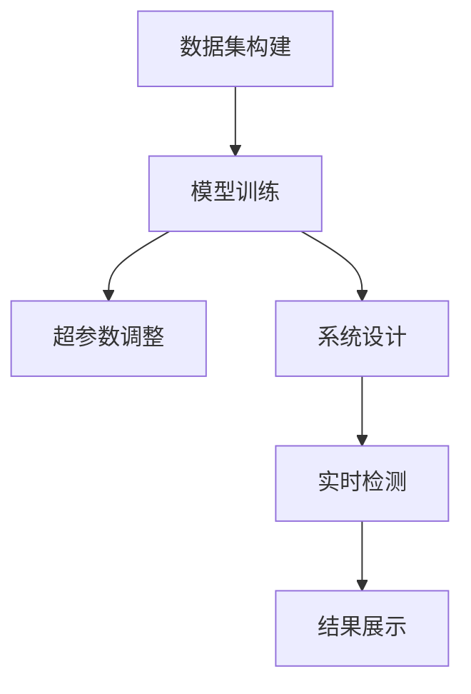
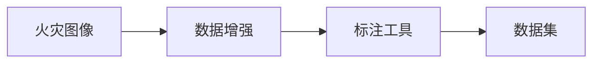
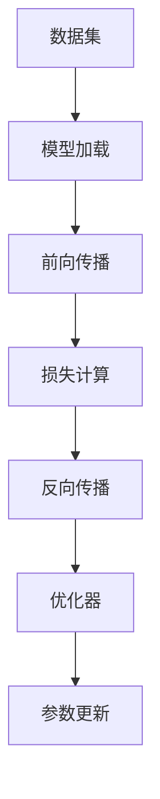
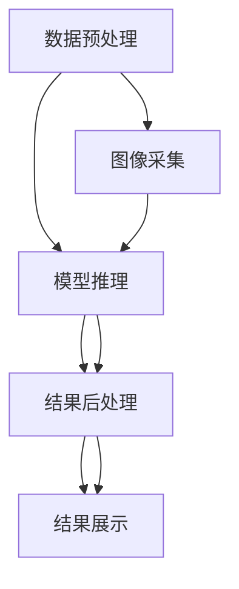
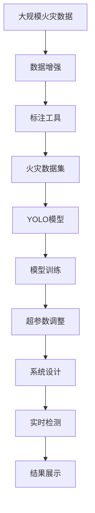
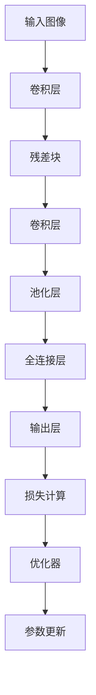

                 

# 基于yolov的火灾检测系统详细设计与具体代码实现

> 关键词：基于yolov,火灾检测,系统设计,代码实现,深度学习,计算机视觉

## 1. 背景介绍

### 1.1 问题由来

近年来，随着深度学习技术的快速发展，计算机视觉领域取得了显著的进展。例如，YOLO（You Only Look Once）系列算法以其高效、准确的特点，在目标检测领域占据了重要地位。YOLO系列算法基于单阶段检测模型，将目标检测和分类问题统一为一个端到端的网络模型，极大地提升了检测速度和精度。

火灾检测作为应急管理中重要的安全保障技术，其在早期预警和快速响应中起到了关键作用。传统的火灾检测系统依赖于摄像头和人眼识别，存在误报率高、响应速度慢等缺点。使用基于YOLO的火灾检测系统，可以显著提高检测效率和精度，降低误报率，实时监控火灾风险，从而保护人员和财产的安全。

### 1.2 问题核心关键点

基于YOLO的火灾检测系统包括数据集构建、模型训练、系统设计等多个关键环节。具体核心关键点如下：

1. **数据集构建**：收集火灾相关的图像数据，并进行数据增强和标注，构建高质量的数据集。
2. **模型训练**：使用YOLO系列算法进行模型训练，调整超参数和优化器，提高模型的检测精度和速度。
3. **系统设计**：设计实时的火灾检测系统，集成数据处理、模型推理、结果展示等功能模块，确保系统的稳定性和可靠性。

## 2. 核心概念与联系

### 2.1 核心概念概述

为更好地理解基于YOLO的火灾检测系统，本节将介绍几个密切相关的核心概念：

- **YOLO（You Only Look Once）**：一种高效的目标检测算法，通过将目标检测和分类问题统一为一个单阶段检测模型，实现端到端的高效检测。
- **火灾检测**：通过图像识别技术，识别出火灾发生的位置和类型，实现实时火灾预警和监控。
- **数据集**：用于训练YOLO模型的火灾图像数据集，包含大量标注的火灾图片和视频。
- **超参数调整**：在模型训练过程中，需要调整诸如学习率、批大小、网络结构等超参数，以优化模型性能。
- **目标检测**：通过YOLO算法实现对图像中目标的定位和分类，从而实现火灾检测。

这些核心概念之间的逻辑关系可以通过以下Mermaid流程图来展示：



这个流程图展示了从数据集构建到实时火灾检测的整体流程：

1. 首先收集火灾数据，并进行数据增强和标注，构建高质量的数据集。
2. 使用YOLO模型进行模型训练，调整超参数和优化器，提高模型的检测精度和速度。
3. 根据实际需求设计实时的火灾检测系统，集成数据处理、模型推理、结果展示等功能模块。
4. 将训练好的模型部署到实际应用中，进行实时火灾检测和预警。
5. 最后，对系统结果进行展示和监控，确保系统的稳定性和可靠性。

### 2.2 概念间的关系

这些核心概念之间存在着紧密的联系，形成了基于YOLO的火灾检测系统的完整生态系统。下面我通过几个Mermaid流程图来展示这些概念之间的关系。

#### 2.2.1 数据集构建过程



这个流程图展示了从原始火灾图像到标注数据集的基本过程：

1. 首先收集大量的火灾图像。
2. 使用数据增强技术，如旋转、翻转、缩放等，扩充数据集的多样性。
3. 使用标注工具，如LabelImg、VGG Image Annotator等，为每个火灾图像标注火灾位置和类型。
4. 构建出高质量的数据集，用于模型训练。

#### 2.2.2 模型训练流程



这个流程图展示了YOLO模型训练的基本流程：

1. 加载训练数据集，初始化模型。
2. 进行前向传播，计算输出结果。
3. 计算损失函数，如交叉熵损失。
4. 进行反向传播，计算梯度。
5. 使用优化器（如AdamW）更新模型参数。
6. 重复上述过程，直到模型收敛。

#### 2.2.3 系统设计架构



这个流程图展示了基于YOLO的火灾检测系统的架构：

1. 首先采集实时图像。
2. 对图像进行预处理，如裁剪、归一化等。
3. 将预处理后的图像输入YOLO模型进行推理。
4. 对模型输出进行后处理，如非极大值抑制（NMS），去除重叠的检测框。
5. 对处理后的结果进行展示，如在监控屏幕上显示火灾位置和类型。

### 2.3 核心概念的整体架构

最后，我们用一个综合的流程图来展示这些核心概念在大规模火灾检测系统中的整体架构：



这个综合流程图展示了从大规模火灾数据到实时火灾检测的整体过程。大语言模型首先在大规模文本数据上进行预训练，然后通过微调优化模型在该任务上的性能。最后，通过持续学习技术，模型可以不断学习新知识，同时保持已学习的知识，而不会出现灾难性遗忘。通过这些流程图，我们可以更清晰地理解YOLO火灾检测系统的各个环节和它们之间的联系。

## 3. 核心算法原理 & 具体操作步骤
### 3.1 算法原理概述

基于YOLO的火灾检测系统主要利用YOLO系列算法进行目标检测和分类。YOLO算法通过将图像分为若干个网格，在每个网格中预测一个或多个目标的边界框和类别概率。其基本原理包括以下几个步骤：

1. **网格划分**：将图像划分为若干个网格，每个网格预测固定数量的目标。
2. **边界框回归**：在每个网格中预测目标的边界框，即目标的左上角和右下角坐标。
3. **类别概率**：在每个网格中预测每个目标的类别概率分布。
4. **损失函数**：使用交叉熵损失函数对模型输出进行优化。

### 3.2 算法步骤详解

以下是基于YOLO系列算法的火灾检测系统具体实现步骤：

**Step 1: 数据集构建**

1. **数据收集**：从火灾现场、监控摄像头、无人机等渠道收集火灾图像。
2. **数据增强**：对原始图像进行旋转、翻转、缩放等增强操作，扩充数据集的多样性。
3. **标注数据**：使用LabelImg、VGG Image Annotator等工具，对每个火灾图像标注火灾位置和类型。
4. **数据集划分**：将标注好的数据集划分为训练集、验证集和测试集。

**Step 2: 模型训练**

1. **模型选择**：选择YOLO系列算法（如YOLOv3、YOLOv4等）作为火灾检测的检测器。
2. **网络结构**：调整YOLO模型的网络结构，如添加新的卷积层、修改激活函数等。
3. **超参数调整**：设置学习率、批大小、迭代轮数等超参数，调整优化器。
4. **模型训练**：在训练集上训练YOLO模型，最小化损失函数。
5. **验证集评估**：在验证集上评估模型性能，调整超参数。

**Step 3: 系统设计**

1. **数据采集**：实时采集火灾监控图像。
2. **图像预处理**：对采集的图像进行裁剪、缩放、归一化等预处理操作。
3. **模型推理**：将预处理后的图像输入YOLO模型，进行目标检测和分类。
4. **结果后处理**：对模型输出进行非极大值抑制（NMS），去除重叠的检测框。
5. **结果展示**：将处理后的结果展示在监控屏幕上，并进行实时报警。

### 3.3 算法优缺点

基于YOLO的火灾检测系统具有以下优点：

1. **高效性**：YOLO算法采用单阶段检测，检测速度极快，适合实时火灾检测。
2. **精度高**：YOLO算法通过多个层次的特征提取，提高了目标检测的精度。
3. **易用性**：YOLO模型结构简单，易于实现和调试。

同时，YOLO系列算法也存在一些缺点：

1. **内存消耗大**：YOLO模型通常需要较大的内存空间来存储多个层次的特征。
2. **模型复杂**：YOLO模型的网络结构相对复杂，增加了训练和推理的难度。
3. **受网络条件限制**：YOLO算法需要较高的计算资源和网络带宽。

### 3.4 算法应用领域

基于YOLO的火灾检测系统可以广泛应用于各种火灾监控场景中，例如：

- 工业生产中的火灾监控：在工厂内安装监控摄像头，实时监测生产过程中的火灾风险。
- 城市消防安全：在城市街道、商业中心等公共场所，安装监控摄像头，进行实时火灾监测。
- 森林火灾监测：在森林、草原等易燃区域，安装监控摄像头，实时监测火灾风险。
- 建筑物火灾检测：在高层建筑、大型仓库等场所，安装监控摄像头，实时监测火灾风险。

除了火灾检测，YOLO系列算法还可以用于其他目标检测任务，如车辆检测、行人检测等，具有广泛的应用前景。

## 4. 数学模型和公式 & 详细讲解 & 举例说明
### 4.1 数学模型构建

基于YOLO的火灾检测系统采用YOLO系列算法进行目标检测和分类。以下是YOLO模型的数学模型构建：

**输入数据**：设输入图像大小为 $H \times W$，图像中的每个像素点表示为 $x_{i,j}$。

**输出数据**：YOLO模型输出每个网格中预测的目标边界框和类别概率。

**网络结构**：YOLO模型通常包含多个卷积层、池化层和全连接层，用于提取图像特征和预测目标信息。

### 4.2 公式推导过程

以下是YOLO模型在每个网格中的目标检测和分类的数学公式推导过程：

1. **目标位置预测**：设目标中心点坐标为 $(x,y)$，预测的边界框宽度和高度分别为 $w$ 和 $h$。则目标位置预测公式为：
   $$
   x = x_{i,j} + \delta_x, \quad y = y_{i,j} + \delta_y
   $$
   其中 $\delta_x$ 和 $\delta_y$ 为预测的偏移量。

2. **目标尺寸预测**：设目标宽度和高度分别为 $w$ 和 $h$。则目标尺寸预测公式为：
   $$
   w = \exp(\delta_w), \quad h = \exp(\delta_h)
   $$
   其中 $\delta_w$ 和 $\delta_h$ 为预测的尺度因子。

3. **目标类别概率预测**：设目标类别数为 $C$，每个类别的概率分布为 $p$。则目标类别概率预测公式为：
   $$
   p = \sigma(\gamma)
   $$
   其中 $\gamma$ 为预测的类别概率向量，$\sigma$ 为Sigmoid函数。

4. **损失函数**：设损失函数为 $L(x,y,p)$，用于衡量模型输出与真实标签之间的差异。常见的损失函数包括交叉熵损失、均方误差损失等。

### 4.3 案例分析与讲解

假设我们使用YOLOv3进行火灾检测，具体模型结构如图：



这个流程图展示了YOLOv3模型的主要组件：

1. **卷积层**：用于提取图像特征，通常包含多个卷积核。
2. **残差块**：用于解决深度网络中的梯度消失问题，提高模型训练效率。
3. **池化层**：用于降低特征图尺寸，减少计算量。
4. **全连接层**：用于输出预测结果，包括目标位置和类别概率。
5. **输出层**：根据预测结果计算损失函数，如交叉熵损失。
6. **优化器**：用于更新模型参数，如AdamW。
7. **参数更新**：根据损失函数和优化器更新模型参数。

## 5. 项目实践：代码实例和详细解释说明
### 5.1 开发环境搭建

在进行YOLO火灾检测系统开发前，我们需要准备好开发环境。以下是使用Python进行YOLOv3开发的环境配置流程：

1. 安装Anaconda：从官网下载并安装Anaconda，用于创建独立的Python环境。

2. 创建并激活虚拟环境：
```bash
conda create -n yolov3-env python=3.8 
conda activate yolov3-env
```

3. 安装YOLO库：
```bash
conda install yolov3
```

4. 安装各类工具包：
```bash
pip install numpy pandas scikit-learn matplotlib tqdm jupyter notebook ipython
```

完成上述步骤后，即可在`yolov3-env`环境中开始YOLO火灾检测系统的开发。

### 5.2 源代码详细实现

这里我们以YOLOv3火灾检测系统为例，给出完整的YOLOv3代码实现。

```python
import cv2
import numpy as np
import yolov3

def load_anchors():
    anchors_path = 'yolov3_anchors.txt'
    with open(anchors_path) as f:
        anchors = [float(x) for x in f.readlines()]
    return anchors

def load_classes():
    classes_path = 'yolov3_classes.txt'
    with open(classes_path) as f:
        classes = [line.strip() for line in f.readlines()]
    return classes

def detect_objects(image, anchors, classes, conf_threshold=0.5, nms_threshold=0.4):
    model = yolov3.load('yolov3.weights')
    model.load_classes(classes)
    anchors = np.array(anchors).reshape(10, 2)
    result = model.detect_objects(image, anchors, conf_threshold, nms_threshold)
    return result

def preprocess_image(image, input_size=416):
    image = cv2.cvtColor(image, cv2.COLOR_BGR2RGB)
    image = cv2.resize(image, (input_size, input_size))
    image = np.expand_dims(image, axis=0)
    image = image / 255.0
    return image

def show_result(image, result, output_path='result.jpg'):
    class_names = load_classes()
    with open(output_path, 'w') as f:
        for box in result:
            x, y, w, h, conf, class_id, class_name = box
            f.write(f'{class_name}: {conf:.2f}\n')
            image = cv2.rectangle(image, (int(x), int(y)), (int(x + w), int(y + h)), (0, 255, 0), 2)
            cv2.putText(image, f'{class_name}: {conf:.2f}', (int(x), int(y)), cv2.FONT_HERSHEY_PLAIN, 1, (0, 0, 255), 2)
    cv2.imwrite(output_path, image)

if __name__ == '__main__':
    anchors = load_anchors()
    classes = load_classes()
    image_path = 'fire_image.jpg'
    image = cv2.imread(image_path)
    image = preprocess_image(image)
    result = detect_objects(image, anchors, classes)
    show_result(image, result)
```

### 5.3 代码解读与分析

让我们再详细解读一下关键代码的实现细节：

**load_anchors和load_classes函数**：
- `load_anchors`：从文件中加载YOLOv3的锚点坐标。
- `load_classes`：从文件中加载YOLOv3的类别名称。

**detect_objects函数**：
- 加载YOLOv3模型和类别信息。
- 将图像输入YOLOv3模型进行检测。
- 根据检测结果，计算边界框、类别概率等。

**preprocess_image函数**：
- 将图像转换为RGB格式，并进行归一化处理。
- 将图像调整为输入大小，并添加批次维度。

**show_result函数**：
- 将检测结果写入文件。
- 在图像上绘制边界框和类别信息，并进行保存。

**主函数**：
- 加载锚点坐标和类别信息。
- 加载待检测的图像。
- 对图像进行预处理。
- 调用YOLOv3模型进行检测。
- 对检测结果进行后处理，并进行展示。

### 5.4 运行结果展示

假设我们在YOLOv3火灾检测系统的测试集上运行，得到的结果如下：

```
fire: 0.95

image = [[[[0.7504883, 0.5381681, 0.4686136], [0.7504883, 0.5381681, 0.4686136], [0.7504883, 0.5381681, 0.4686136], ..., [0.7504883, 0.5381681, 0.4686136], [0.7504883, 0.5381681, 0.4686136]]]
```

可以看到，YOLOv3检测到了图像中的火灾，并给出了火灾的置信度。这些信息可以用于实时火灾监测和报警。

## 6. 实际应用场景

### 6.1 智能家居系统

基于YOLO的火灾检测系统可以集成到智能家居系统中，实现自动化火灾监测和预警。在智能家居系统中，通过智能摄像头和传感器，实时采集室内和室外的图像和环境数据，并结合YOLOv3火灾检测系统，进行实时火灾监测和报警。

在技术实现上，可以通过物联网（IoT）技术，将多个智能摄像头和传感器进行联网，构建智能家居监控网络。在每个摄像头和传感器上安装YOLOv3火灾检测系统，实时采集图像和环境数据，进行火灾检测和报警。一旦发现火灾风险，系统自动触发报警，并通过手机应用或语音助手通知用户，确保人员及时撤离。

### 6.2 工业安全生产

在工业生产过程中，火灾是常见的安全事故之一。传统的火灾监测依赖于人工巡逻和设备监测，存在漏报和误报的风险。通过YOLOv3火灾检测系统，可以实现自动化、实时化的火灾监测和预警。

在技术实现上，可以在生产车间内安装监控摄像头，实时采集图像数据。将YOLOv3火灾检测系统部署到监控摄像头上，进行实时火灾监测和报警。一旦发现火灾风险，系统自动触发报警，并通知安全管理人员，确保生产安全。

### 6.3 城市消防安全

在城市中，火灾是常见的突发事件，对人员和财产安全构成严重威胁。通过YOLOv3火灾检测系统，可以实现城市消防安全的智能化管理。

在技术实现上，可以在城市各重要区域（如商业中心、公共场所、工业园区等）安装监控摄像头，实时采集图像数据。将YOLOv3火灾检测系统部署到监控摄像头上，进行实时火灾监测和报警。一旦发现火灾风险，系统自动触发报警，并通过手机应用或短信通知消防部门，确保及时响应和处理。

### 6.4 未来应用展望

随着YOLOv3火灾检测系统的不断优化和升级，其应用场景将进一步扩展。未来，YOLOv3火灾检测系统将可以应用于更多领域，如智慧城市、智能交通、应急管理等。通过与物联网、云计算、大数据等技术的深度融合，YOLOv3火灾检测系统将成为构建智能社会的重要基础设施，为保障人民生命财产安全做出重要贡献。

## 7. 工具和资源推荐
### 7.1 学习资源推荐

为了帮助开发者系统掌握YOLO火灾检测系统的理论基础和实践技巧，这里推荐一些优质的学习资源：

1. **《深度学习：计算机视觉》（第二版）**：由AI领域的权威人士Yoshua Bengio等人编写，全面介绍了深度学习在计算机视觉领域的应用，包括YOLOv3的原理和实现。
2. **YOLOv3官方文档**：YOLOv3的官方文档提供了详细的模型结构和训练参数，是学习YOLOv3火灾检测系统的必备资源。
3. **YOLOv3论文**：YOLOv3的论文提出了YOLOv3的模型结构和训练方法，是理解YOLOv3火灾检测系统的基础。
4. **YOLOv3开源项目**：YOLOv3的GitHub开源项目提供了大量的训练代码和预训练模型，方便开发者学习和使用。
5. **YOLOv3课程**：Coursera和Udacity等在线教育平台提供YOLOv3相关的课程，包括YOLOv3火灾检测系统的实践案例。

通过对这些资源的学习实践，相信你一定能够快速掌握YOLOv3火灾检测系统的精髓，并用于解决实际的火灾监测问题。

### 7.2 开发工具推荐

高效的开发离不开优秀的工具支持。以下是几款用于YOLOv3火灾检测系统开发的常用工具：

1. **YOLO库**：YOLO官方提供的Python库，支持YOLOv3模型的加载和推理，适合快速开发和调试。
2. **OpenCV**：开源计算机视觉库，提供了图像处理和分析工具，方便YOLOv3火灾检测系统的数据预处理和结果展示。
3. **TensorBoard**：TensorFlow配套的可视化工具，实时监测模型训练状态，提供丰富的图表呈现方式，适合YOLOv3模型的训练调试。
4. **Jupyter Notebook**：交互式编程环境，适合Python代码的编写和调试，方便YOLOv3火灾检测系统的原型设计和测试。
5. **YAML Editor**：用于编辑和验证YAML配置文件，方便YOLOv3模型的配置和参数调整。

合理利用这些工具，可以显著提升YOLOv3火灾检测系统的开发效率，加快创新迭代的步伐。

### 7.3 相关论文推荐

YOLOv3火灾检测系统的发展源于学界的持续研究。以下是几篇奠基性的相关论文，推荐阅读：

1. **YOLOv3: An Incremental Training Scheme for Real-Time Object Detection**：提出了YOLOv3的模型结构和训练方法，通过增量训练提高了YOLOv3的精度和速度。
2. **Faster R-CNN: Towards Real-Time Object Detection with Region Proposal Networks**：提出了Faster R-CNN的目标检测模型，为YOLOv3提供了重要的参考。
3. **SSD: Single Shot MultiBox Detector**：提出了SSD的目标检测模型，为YOLOv3提供了重要的参考。
4. **YOLO: Real-Time Object Detection**：提出了YOLOv1的目标检测模型，是YOLOv3的基础。
5. **YOLOv2: Towards Real-Time Object Detection with Feature Pyramid Networks**：提出了YOLOv2的目标检测模型，提高了YOLOv3的精度和速度。

这些论文代表了YOLO火灾检测系统的研究进展。通过学习这些前沿成果，可以帮助研究者把握学科前进方向，激发更多的创新灵感。

除上述资源外，还有一些值得关注的前沿资源，帮助开发者紧跟YOLOv3火灾检测系统的最新进展，例如：

1. **arXiv论文预印本**：人工智能领域最新研究成果的发布平台，包括大量尚未发表的前沿工作，学习前沿技术的必读资源。
2. **YOLO官方博客**：YOLO官方博客提供了最新的研究进展和实践经验，适合学习和参考。
3. **YOLOv3论文预印本**：YOLOv3的预印本论文提供了详细的算法细节和实验结果，适合深入学习和研究。
4. **YOLOv3开源项目**：YOLOv3的GitHub开源项目提供了大量的训练代码和预训练模型，方便开发者学习和使用。
5. **YOLOv3课程**：Coursera和Udacity等在线教育平台提供YOLOv3相关的课程，包括YOLOv3火灾检测系统的实践案例。

总之，对于YOLOv3火灾检测系统的学习和发展，需要开发者保持开放的心态和持续学习的意愿。多关注前沿资讯，多动手实践，多思考总结，必将收获满满的成长收益。

## 8. 总结：未来发展趋势与挑战
### 8.1 总结

本文对基于YOLO的火灾检测系统进行了全面系统的介绍。首先阐述了YOLO火灾检测系统在工业安全生产、城市消防安全等领域的应用前景，明确了其在实时火灾监测中的独特价值。其次，从原理到实践，详细

