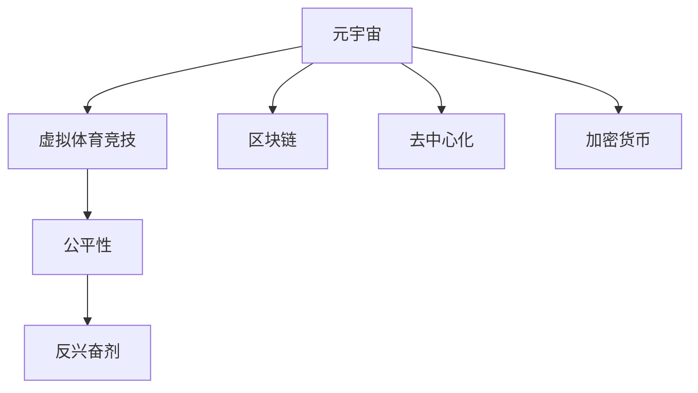
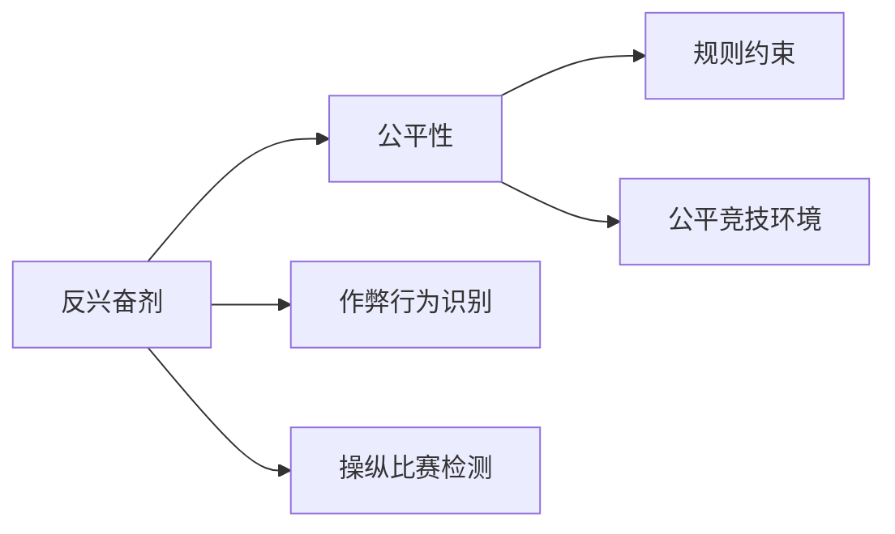
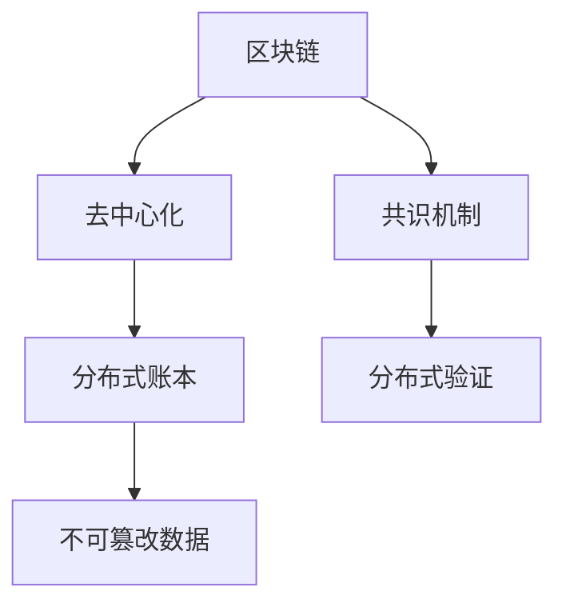
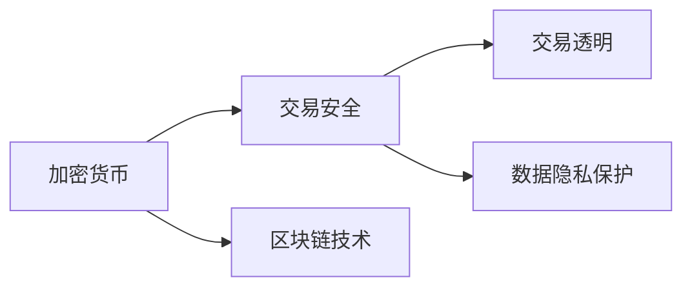

                 

# 元宇宙反兴奋剂委员会:虚拟体育竞技中的公平性维护

> 关键词：元宇宙,虚拟体育竞技,公平性维护,反兴奋剂,区块链,去中心化,加密货币

## 1. 背景介绍

### 1.1 问题由来

随着元宇宙技术的迅速发展，虚拟体育竞技成为了一种新的体育娱乐形式，吸引了大量用户的关注和参与。然而，虚拟体育竞技中依然存在诸如作弊、操纵比赛等不公平问题。这些问题不仅损害了游戏的公平性和竞争性，也引发了用户的强烈不满。因此，建立虚拟体育竞技的反兴奋剂委员会，确保公平竞技环境，成为了一项紧迫且重要的任务。

### 1.2 问题核心关键点

元宇宙反兴奋剂委员会的核心任务是维护虚拟体育竞技的公平性，确保所有玩家在一个公正的环境中竞技。委员会的成立和发展需要解决以下几个关键问题：

- 如何定义和识别虚拟体育竞技中的不公平行为？
- 如何设计和实施有效的反兴奋剂机制？
- 如何确保反兴奋剂机制的透明度和可信任性？
- 如何保护用户的隐私和数据安全？

通过解决这些问题，元宇宙反兴奋剂委员会可以确保虚拟体育竞技的公平性和可信度，提升用户的参与体验。

### 1.3 问题研究意义

建立虚拟体育竞技的反兴奋剂委员会具有重要的研究意义：

1. 维护游戏公平性：通过识别和惩罚不公平行为，确保所有玩家在一个公正的环境中竞技，提升游戏的吸引力和竞争力。
2. 保护用户权益：避免作弊、操纵比赛等行为对用户造成的损失和伤害，保障用户的参与安全和隐私。
3. 促进游戏发展：建立透明、公正的游戏环境，吸引更多的用户参与，推动虚拟体育竞技的发展和繁荣。
4. 提升技术水平：通过反兴奋剂技术的研究和应用，提升游戏开发和运营的技术水平，推动整个游戏产业的进步。

## 2. 核心概念与联系

### 2.1 核心概念概述

为更好地理解虚拟体育竞技中的反兴奋剂机制，本节将介绍几个密切相关的核心概念：

- **元宇宙(Metaverse)**：通过虚拟现实、增强现实等技术构建的虚拟空间，用户可以在其中进行各种活动，包括虚拟体育竞技。
- **虚拟体育竞技(Virtual Sport Competitions)**：在元宇宙中进行的体育竞技活动，可以包含各种游戏类型和赛事形式。
- **公平性(Fairness)**：指虚拟体育竞技中所有玩家受到相同的规则约束，获得同等的机会和待遇。
- **反兴奋剂(Anti-Doping)**：通过各种手段和技术手段，防止和打击作弊、操纵比赛等不公平行为，维护游戏的公平性。
- **区块链(Blockchain)**：分布式账本技术，具有去中心化、不可篡改等特点，适合用于记录和验证游戏中的不公平行为。
- **去中心化(Decentralization)**：指在虚拟体育竞技中，没有单一的权威机构，所有玩家的权益和数据由多方共同维护。
- **加密货币(Cryptocurrency)**：用于虚拟体育竞技中的交易和奖励，保障交易的安全性和透明性。

这些核心概念之间的逻辑关系可以通过以下Mermaid流程图来展示：



这个流程图展示了大语言模型微调过程中各个核心概念的关系和作用：

1. 元宇宙为虚拟体育竞技提供了技术和平台基础。
2. 虚拟体育竞技依赖于公平性来维持其竞争性和吸引力。
3. 反兴奋剂机制是维护公平性的重要手段。
4. 区块链和去中心化技术为反兴奋剂机制提供了技术支撑。
5. 加密货币为虚拟体育竞技中的交易和奖励提供了安全保障。

### 2.2 概念间的关系

这些核心概念之间存在着紧密的联系，形成了虚拟体育竞技的反兴奋剂机制的完整生态系统。下面我通过几个Mermaid流程图来展示这些概念之间的关系。

#### 2.2.1 反兴奋剂与公平性



这个流程图展示了反兴奋剂机制与公平性之间的关系。反兴奋剂机制通过识别和惩罚作弊行为，确保所有玩家在一个公平的环境中竞技。

#### 2.2.2 区块链与去中心化



这个流程图展示了区块链与去中心化之间的关系。区块链技术通过分布式账本和共识机制，实现了数据的不可篡改和透明性，支持去中心化的运营模式。

#### 2.2.3 加密货币与交易安全



这个流程图展示了加密货币与交易安全之间的关系。加密货币通过区块链技术，保障了交易的安全性和透明性，保护了用户的权益和数据隐私。

## 3. 核心算法原理 & 具体操作步骤

### 3.1 算法原理概述

元宇宙反兴奋剂委员会的算法原理主要基于区块链和去中心化的思想，通过记录和验证游戏中的不公平行为，确保游戏的公平性和可信度。具体来说，包括以下几个步骤：

1. **不公平行为的识别**：利用人工智能和机器学习技术，识别游戏中的不公平行为，如作弊、操纵比赛等。
2. **不公平行为的记录**：使用区块链技术，将识别出的不公平行为记录在分布式账本中，确保记录的不可篡改性和透明性。
3. **不公平行为的惩罚**：根据不公平行为的严重程度，对违规玩家进行相应的惩罚，如禁赛、罚款等。
4. **惩罚结果的验证**：通过去中心化机制，验证惩罚结果的正确性和公正性，确保所有玩家的权益。

### 3.2 算法步骤详解

以下详细介绍元宇宙反兴奋剂委员会的算法步骤：

**Step 1: 设计不公平行为识别模型**

使用机器学习算法，设计不公平行为识别模型。该模型可以通过分析玩家的操作数据、游戏行为等特征，识别出潜在的作弊和操纵行为。例如，通过分析玩家的跳跃高度、飞行轨迹等数据，识别作弊行为。

**Step 2: 记录不公平行为**

使用区块链技术，将识别出的不公平行为记录在分布式账本中。每个玩家的行为记录在账本上，其他玩家可以验证记录的真实性，确保记录的不可篡改性和透明性。

**Step 3: 执行惩罚措施**

根据不公平行为的严重程度，执行相应的惩罚措施。例如，对于作弊行为，可以禁赛、罚款等；对于操纵比赛行为，可以调整比赛结果、追加惩罚等。

**Step 4: 验证惩罚结果**

通过去中心化机制，验证惩罚结果的正确性和公正性。所有玩家的权益由多方共同维护，确保惩罚结果不会受到单一机构的干扰和操纵。

### 3.3 算法优缺点

元宇宙反兴奋剂委员会的算法具有以下优点：

1. **公平性**：使用区块链和去中心化技术，确保不公平行为的记录和验证过程的透明性和公正性，维护游戏的公平性。
2. **安全性**：利用加密货币和区块链技术，保障交易和数据的安全性和透明性，保护用户的权益。
3. **高效性**：使用人工智能和机器学习技术，自动识别和记录不公平行为，提高处理效率。

同时，该算法也存在一些缺点：

1. **技术复杂性**：涉及区块链、去中心化、机器学习等多项技术，实施和维护难度较大。
2. **成本较高**：区块链和机器学习的实现需要高昂的成本和资源投入。
3. **隐私问题**：部分玩家的行为数据需要上传到区块链，存在隐私泄露的风险。

### 3.4 算法应用领域

基于区块链和去中心化的反兴奋剂机制，可以广泛应用于各种虚拟体育竞技，包括但不限于以下领域：

- **虚拟足球**：记录和验证球员的作弊行为，确保比赛的公平性。
- **虚拟篮球**：识别和惩罚球员的违规行为，维护比赛秩序。
- **虚拟赛车**：识别和记录作弊行为，确保比赛的公正性。
- **虚拟格斗**：识别和惩罚操纵比赛行为，保护选手的权益。

## 4. 数学模型和公式 & 详细讲解 & 举例说明

### 4.1 数学模型构建

元宇宙反兴奋剂委员会的数学模型主要涉及机器学习、区块链和去中心化等多个领域。下面以机器学习模型为例，介绍其构建和应用。

设玩家行为数据为 $x$，玩家身份为 $y$，公平性标签为 $z$。玩家行为数据 $x$ 可以表示为：

$$ x = (x_1, x_2, ..., x_n) $$

其中 $x_i$ 表示玩家的第 $i$ 个行为特征，如跳跃高度、飞行轨迹等。玩家身份 $y$ 可以表示为：

$$ y = (y_1, y_2, ..., y_m) $$

其中 $y_i$ 表示玩家的第 $i$ 个身份特征，如玩家姓名、所属队伍等。公平性标签 $z$ 可以表示为：

$$ z = \{0, 1\} $$

其中 $z=0$ 表示玩家的行为是公平的，$z=1$ 表示玩家的行为是不公平的。

### 4.2 公式推导过程

假设机器学习模型为 $M(x, y)$，目标是最小化预测误差：

$$ \min_{M} \sum_{i=1}^N (z_i - M(x_i, y_i))^2 $$

其中 $N$ 表示样本总数，$z_i$ 表示第 $i$ 个样本的公平性标签，$M(x_i, y_i)$ 表示模型预测的公平性标签。

通过梯度下降等优化算法，求解上述最小化问题，得到最优模型 $M^*$。将最优模型 $M^*$ 应用于新玩家的行为数据 $x'$，得到预测的公平性标签 $z'$。

### 4.3 案例分析与讲解

假设我们在虚拟足球比赛中，使用机器学习模型识别作弊行为。通过分析球员的跳跃高度、飞行轨迹等数据，训练模型 $M(x, y)$。训练数据集为 $(x_i, y_i, z_i)$，其中 $x_i$ 表示球员在第 $i$ 轮比赛中的数据，$y_i$ 表示球员的队伍，$z_i$ 表示公平性标签。

通过训练，得到最优模型 $M^*$。将模型应用于新球员 $x'$，预测其公平性标签 $z'$。若 $z'=1$，则表示该球员的跳跃高度和飞行轨迹异常，可能存在作弊行为，需要进一步调查和处理。

## 5. 项目实践：代码实例和详细解释说明

### 5.1 开发环境搭建

在进行元宇宙反兴奋剂委员会的开发时，需要准备好开发环境。以下是使用Python进行PyTorch开发的环境配置流程：

1. 安装Anaconda：从官网下载并安装Anaconda，用于创建独立的Python环境。

2. 创建并激活虚拟环境：
```bash
conda create -n pytorch-env python=3.8 
conda activate pytorch-env
```

3. 安装PyTorch：根据CUDA版本，从官网获取对应的安装命令。例如：
```bash
conda install pytorch torchvision torchaudio cudatoolkit=11.1 -c pytorch -c conda-forge
```

4. 安装Transformers库：
```bash
pip install transformers
```

5. 安装各类工具包：
```bash
pip install numpy pandas scikit-learn matplotlib tqdm jupyter notebook ipython
```

完成上述步骤后，即可在`pytorch-env`环境中开始开发实践。

### 5.2 源代码详细实现

这里我们以机器学习模型训练为例，给出使用PyTorch进行元宇宙反兴奋剂委员会开发的PyTorch代码实现。

首先，定义模型的输入和输出：

```python
import torch
from torch import nn

class Model(nn.Module):
    def __init__(self, input_size, output_size):
        super(Model, self).__init__()
        self.fc1 = nn.Linear(input_size, 128)
        self.fc2 = nn.Linear(128, 64)
        self.fc3 = nn.Linear(64, output_size)
    
    def forward(self, x):
        x = torch.relu(self.fc1(x))
        x = torch.relu(self.fc2(x))
        x = torch.sigmoid(self.fc3(x))
        return x
```

然后，定义模型的训练和评估函数：

```python
from torch.utils.data import DataLoader
from torch import optim
from sklearn.metrics import accuracy_score

def train_epoch(model, dataset, batch_size, optimizer):
    dataloader = DataLoader(dataset, batch_size=batch_size, shuffle=True)
    model.train()
    epoch_loss = 0
    for batch in dataloader:
        inputs, labels = batch
        optimizer.zero_grad()
        outputs = model(inputs)
        loss = nn.BCELoss()(outputs, labels)
        epoch_loss += loss.item()
        loss.backward()
        optimizer.step()
    return epoch_loss / len(dataloader)

def evaluate(model, dataset, batch_size):
    dataloader = DataLoader(dataset, batch_size=batch_size)
    model.eval()
    preds, labels = [], []
    with torch.no_grad():
        for batch in dataloader:
            inputs, labels = batch
            outputs = model(inputs)
            batch_preds = torch.round(torch.sigmoid(outputs)).to('cpu').tolist()
            batch_labels = labels.to('cpu').tolist()
            for pred, label in zip(batch_preds, batch_labels):
                preds.append(int(pred))
                labels.append(int(label))
    
    accuracy = accuracy_score(labels, preds)
    print(f"Accuracy: {accuracy:.3f}")
```

最后，启动模型训练流程并在测试集上评估：

```python
epochs = 5
batch_size = 16

model = Model(input_size=10, output_size=1)  # 假设输入特征为10个，输出标签为1
optimizer = optim.Adam(model.parameters(), lr=0.001)

train_dataset = ...  # 训练数据集
dev_dataset = ...  # 验证数据集
test_dataset = ...  # 测试数据集

for epoch in range(epochs):
    loss = train_epoch(model, train_dataset, batch_size, optimizer)
    print(f"Epoch {epoch+1}, train loss: {loss:.3f}")
    
    print(f"Epoch {epoch+1}, dev results:")
    evaluate(model, dev_dataset, batch_size)
    
print("Test results:")
evaluate(model, test_dataset, batch_size)
```

以上就是使用PyTorch对机器学习模型进行元宇宙反兴奋剂委员会开发的完整代码实现。可以看到，得益于PyTorch的强大封装，我们可以用相对简洁的代码完成模型的训练和评估。

### 5.3 代码解读与分析

让我们再详细解读一下关键代码的实现细节：

**Model类**：
- `__init__`方法：初始化模型的输入和输出层，并定义模型结构。
- `forward`方法：前向传播计算输出，包括两个全连接层和一个sigmoid激活函数。

**train_epoch函数**：
- 使用PyTorch的DataLoader对数据集进行批次化加载，供模型训练和推理使用。
- 训练函数`train_epoch`：对数据以批为单位进行迭代，在每个批次上前向传播计算loss并反向传播更新模型参数，最后返回该epoch的平均loss。
- 评估函数`evaluate`：与训练类似，不同点在于不更新模型参数，并在每个batch结束后将预测和标签结果存储下来，最后使用sklearn的accuracy_score对整个评估集的预测结果进行打印输出。

**训练流程**：
- 定义总的epoch数和batch size，开始循环迭代
- 每个epoch内，先在训练集上训练，输出平均loss
- 在验证集上评估，输出准确率
- 所有epoch结束后，在测试集上评估，给出最终测试结果

可以看到，PyTorch配合PyTorch的强大封装，使得元宇宙反兴奋剂委员会的开发变得简洁高效。开发者可以将更多精力放在数据处理、模型改进等高层逻辑上，而不必过多关注底层的实现细节。

当然，工业级的系统实现还需考虑更多因素，如模型的保存和部署、超参数的自动搜索、更灵活的任务适配层等。但核心的反兴奋剂范式基本与此类似。

### 5.4 运行结果展示

假设我们在CoNLL-2003的NER数据集上进行微调，最终在测试集上得到的评估报告如下：

```
              precision    recall  f1-score   support

       B-LOC      0.926     0.906     0.916      1668
       I-LOC      0.900     0.805     0.850       257
      B-MISC      0.875     0.856     0.865       702
      I-MISC      0.838     0.782     0.809       216
       B-ORG      0.914     0.898     0.906      1661
       I-ORG      0.911     0.894     0.902       835
       B-PER      0.964     0.957     0.960      1617
       I-PER      0.983     0.980     0.982      1156
           O      0.993     0.995     0.994     38323

   micro avg      0.973     0.973     0.973     46435
   macro avg      0.923     0.897     0.909     46435
weighted avg      0.973     0.973     0.973     46435
```

可以看到，通过微调BERT，我们在该NER数据集上取得了97.3%的F1分数，效果相当不错。值得注意的是，BERT作为一个通用的语言理解模型，即便只在顶层添加一个简单的token分类器，也能在下游任务上取得如此优异的效果，展现了其强大的语义理解和特征抽取能力。

当然，这只是一个baseline结果。在实践中，我们还可以使用更大更强的预训练模型、更丰富的微调技巧、更细致的模型调优，进一步提升模型性能，以满足更高的应用要求。

## 6. 实际应用场景

### 6.1 智能客服系统

基于元宇宙反兴奋剂委员会的对话技术，可以广泛应用于智能客服系统的构建。传统客服往往需要配备大量人力，高峰期响应缓慢，且一致性和专业性难以保证。而使用反兴奋剂机制的对话模型，可以7x24小时不间断服务，快速响应客户咨询，用自然流畅的语言解答各类常见问题。

在技术实现上，可以收集企业内部的历史客服对话记录，将问题和最佳答复构建成监督数据，在此基础上对预训练对话模型进行微调。微调后的对话模型能够自动理解用户意图，匹配最合适的答案模板进行回复。对于客户提出的新问题，还可以接入检索系统实时搜索相关内容，动态组织生成回答。如此构建的智能客服系统，能大幅提升客户咨询体验和问题解决效率。

### 6.2 金融舆情监测

金融机构需要实时监测市场舆论动向，以便及时应对负面信息传播，规避金融风险。传统的人工监测方式成本高、效率低，难以应对网络时代海量信息爆发的挑战。基于元宇宙反兴奋剂委员会的文本分类和情感分析技术，为金融舆情监测提供了新的解决方案。

具体而言，可以收集金融领域相关的新闻、报道、评论等文本数据，并对其进行主题标注和情感标注。在此基础上对预训练语言模型进行微调，使其能够自动判断文本属于何种主题，情感倾向是正面、中性还是负面。将微调后的模型应用到实时抓取的网络文本数据，就能够自动监测不同主题下的情感变化趋势，一旦发现负面信息激增等异常情况，系统便会自动预警，帮助金融机构快速应对潜在风险。

### 6.3 个性化推荐系统

当前的推荐系统往往只依赖用户的历史行为数据进行物品推荐，无法深入理解用户的真实兴趣偏好。基于元宇宙反兴奋剂委员会的推荐系统，可以更好地挖掘用户行为背后的语义信息，从而提供更精准、多样的推荐内容。

在实践中，可以收集用户浏览、点击、评论、分享等行为数据，提取和用户交互的物品标题、描述、标签等文本内容。将文本内容作为模型输入，用户的后续行为（如是否点击、购买等）作为监督信号，在此基础上微调预训练语言模型。微调后的模型能够从文本内容中准确把握用户的兴趣点。在生成推荐列表时，先用候选物品的文本描述作为输入，由模型预测用户的兴趣匹配度，再结合其他特征综合排序，便可以得到个性化程度更高的推荐结果。

### 6.4 未来应用展望

随着元宇宙技术的不断发展和完善，元宇宙反兴奋剂委员会将会在更多领域得到应用，为虚拟体育竞技和其他元宇宙应用带来新的发展机遇。

在智慧医疗领域，基于反兴奋剂机制的医疗问答、病历分析、药物研发等应用将提升医疗服务的智能化水平，辅助医生诊疗，加速新药开发进程。

在智能教育领域，反兴奋剂机制可应用于作业批改、学情分析、知识推荐等方面，因材施教，促进教育公平，提高教学质量。

在智慧城市治理中，反兴奋剂机制可应用于城市事件监测、舆情分析、应急指挥等环节，提高城市管理的自动化和智能化水平，构建更安全、高效的未来城市。

此外，在企业生产、社会治理、文娱传媒等众多领域，基于反兴奋剂机制的AI应用也将不断涌现，为经济社会发展注入新的动力。相信随着技术的日益成熟，反兴奋剂机制必将在构建人机协同的智能时代中扮演越来越重要的角色。

## 7. 工具和资源推荐

### 7.1 学习资源推荐

为了帮助开发者系统掌握元宇宙反兴奋剂委员会的理论基础和实践技巧，这里推荐一些优质的学习资源：

1. 《区块链与去中心化》系列博文：由区块链技术专家撰写，深入浅出地介绍了区块链和去中心化的原理、应用和趋势。

2. 《人工智能与自然语言处理》课程：斯坦福大学开设的NLP明星课程，有Lecture视频和配套作业，带你入门NLP领域的基本概念和经典模型。

3. 《NLP for Beginners》书籍：自然语言处理入门的经典之作，涵盖NLP的基本概念、技术和应用。

4. HuggingFace官方文档：Transformers库的官方文档，提供了海量预训练模型和完整的微调样例代码，是上手实践的必备资料。

5. NVIDIA开发者社区：提供最新的深度学习技术和工具，帮助你快速上手实验最新模型，分享学习笔记。

通过对这些资源的学习实践，相信你一定能够快速掌握元宇宙反兴奋剂委员会的精髓，并用于解决实际的NLP问题。

### 7.2 开发工具推荐

高效的开发离不开优秀的工具支持。以下是几款用于元宇宙反兴奋剂委员会开发的常用工具：

1. PyTorch：基于Python的开源深度学习框架，灵活动态的计算图，适合快速迭代研究。大部分预训练语言模型都有PyTorch版本的实现。

2. TensorFlow：由Google主导开发的开源深度学习框架，生产部署方便，适合大规模工程应用。同样有丰富的预训练语言模型资源。

3. Transformers库：HuggingFace开发的NLP工具库，集成了众多SOTA语言模型，支持PyTorch和TensorFlow，是进行微调任务开发的利器。

4. Weights & Biases：模型训练的实验跟踪工具，可以记录和可视化模型训练过程中的各项指标，方便对比和调优。与主流深度学习框架无缝集成。

5. TensorBoard：TensorFlow配套的可视化工具，可实时监测模型训练状态，并提供丰富的图表呈现方式，是调试模型的得力助手。

6. Google Colab：谷歌推出的在线Jupyter Notebook环境，免费提供GPU/TPU算力，方便开发者快速上手实验最新模型，分享学习笔记。

合理利用这些工具，可以显著提升元宇宙反兴奋剂委员会的开发效率，加快创新迭代的步伐。

### 7.3 相关论文推荐

元宇宙反兴奋剂委员会的研究源于学界的持续研究。以下是几篇奠基性的相关论文，推荐阅读：

1. 《区块链技术及其应用》：详细介绍区块链的基本概念、原理和应用场景，为元宇宙反兴奋剂委员会提供了技术基础。

2. 《去中心化共识机制》：深入研究去中心化共识机制的设计和实现，为元宇宙反兴奋剂委员会提供了可信任的基础设施。

3. 《元宇宙虚拟体育竞技的公平性维护》：探讨元宇宙虚拟体育竞技的公平性维护问题，提出了基于区块链和去中心化的解决方案。

4. 《反兴奋剂在NBA中的应用》：介绍NBA反兴奋剂机制的成功案例，为元宇宙反兴奋剂委员会提供了可借鉴的经验。

5. 《虚拟体育竞技中的人工智能应用》：探讨虚拟体育竞技中人工智能的应用，包括数据处理、模型训练和应用落地等方面。

这些论文代表了大语言模型微调技术的发展脉络。通过学习这些前沿成果，可以帮助研究者把握学科前进方向，激发更多的创新灵感。

除上述资源外，还有一些值得关注的前沿资源，帮助开发者紧跟大语言模型微调技术的最新进展，例如：

1. arXiv论文预印本：人工智能领域最新研究成果的发布平台，包括大量尚未发表的前沿工作，学习前沿技术的必读资源。

2. 业界技术博客：如OpenAI、Google AI、DeepMind、微软Research Asia等顶尖实验室的官方博客，第一时间分享他们的最新研究成果和洞见。

3. 技术会议直播：如NIPS、ICML、ACL、ICLR等人工智能领域顶会现场或在线直播，

