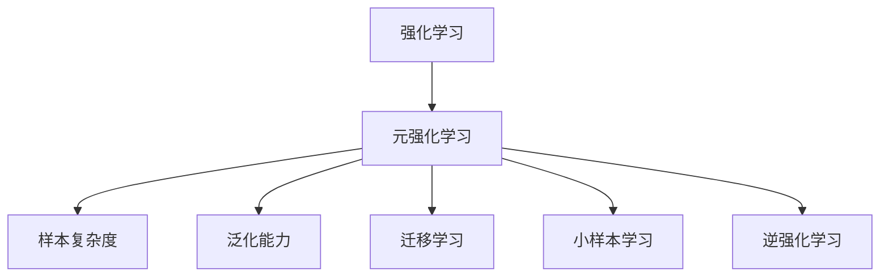
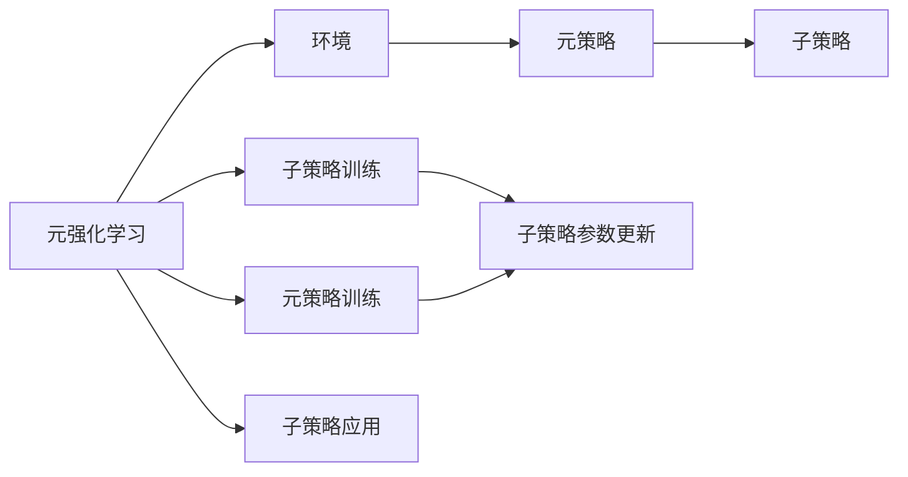
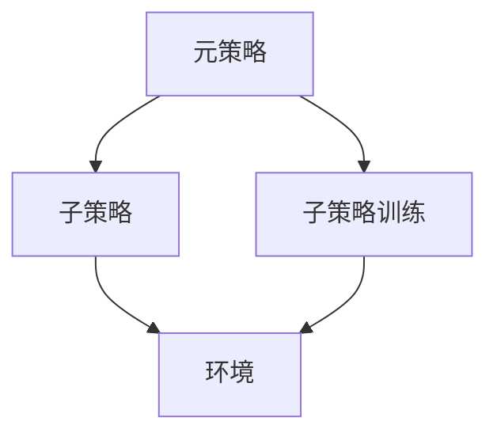
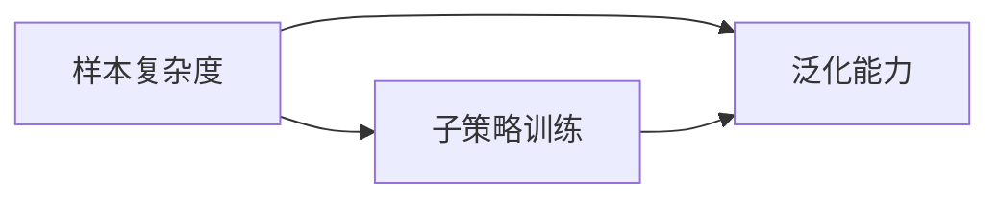

                 

# 元强化学习(Meta-Reinforcement Learning) - 原理与代码实例讲解

## 1. 背景介绍

### 1.1 问题由来

强化学习(Reinforcement Learning, RL)是人工智能领域中的一个重要分支，旨在通过智能体与环境交互，最大化累积奖励来学习最优策略。传统的强化学习算法如Q-learning、SARSA等，在固定环境、静态目标下表现良好。然而，在真实世界中，环境往往是动态变化的，目标也会随之调整，如何使智能体能够快速适应新的环境、快速学习新的策略成为一个重要的研究问题。

### 1.2 问题核心关键点

元强化学习(Meta-Reinforcement Learning, MRL)正是研究如何让智能体快速适应新环境、快速学习新任务的关键方法。它的核心思想是，学习一个能够快速适应新环境的"元策略"，使得在面对新任务时，智能体可以快速收敛并达到理想策略。元强化学习的关键是设计有效的元策略学习算法，使智能体能够泛化到多种不同的环境中。

### 1.3 问题研究意义

元强化学习在自动驾驶、机器人控制、游戏智能等领域具有广泛的应用前景。例如，在自动驾驶中，智能车需要学习在不同的道路、天气、交通状况下，如何安全驾驶。在机器人控制中，机器人在面对新的任务，如组装零件、搬运货物等，需要快速学习最优动作策略。在电子游戏中，AI玩家需要面对不断变化的游戏环境，快速学习最优策略，获得胜利。

## 2. 核心概念与联系

### 2.1 核心概念概述

为更好地理解元强化学习，本节将介绍几个密切相关的核心概念：

- 强化学习(Reinforcement Learning, RL)：智能体通过与环境交互，学习最优策略，最大化累积奖励。
- 元强化学习(Meta-Reinforcement Learning, MRL)：智能体学习能够快速适应新环境的"元策略"，使得在面对新任务时，能够快速收敛并达到理想策略。
- 样本复杂度(Sample Complexity)：智能体学习新任务所需的样本数量。
- 泛化能力(Generalization)：智能体在不同环境下的表现一致性。
- 迁移学习(Transfer Learning)：通过已有的知识，加速在新环境中的学习过程。
- 小样本学习(Few-shot Learning)：在少量样本下，智能体能够快速学习新任务。
- 逆强化学习(Inverse Reinforcement Learning, IRL)：通过观察智能体行为，学习最优策略或环境。

这些概念之间的逻辑关系可以通过以下Mermaid流程图来展示：



这个流程图展示了几类强化学习方法和元强化学习的关系：

1. 强化学习：最基础的学习范式，通过智能体与环境交互，学习最优策略。
2. 元强化学习：在此基础上，进一步学习如何在新环境中快速适应。
3. 样本复杂度：元强化学习的关键指标，衡量学习新任务所需的样本数量。
4. 泛化能力：衡量智能体在不同环境下的表现一致性。
5. 迁移学习：利用已有知识加速新环境中的学习。
6. 小样本学习：在少量样本下快速学习新任务。
7. 逆强化学习：通过观察智能体行为，学习最优策略或环境。

这些概念共同构成了元强化学习的核心框架，使得智能体能够在多种环境中高效学习新任务。

### 2.2 概念间的关系

这些核心概念之间存在着紧密的联系，形成了元强化学习的完整生态系统。下面我们通过几个Mermaid流程图来展示这些概念之间的关系。

#### 2.2.1 元强化学习的学习范式



这个流程图展示了元强化学习的基本原理，以及它与子策略训练、元策略训练和子策略应用的关系。

#### 2.2.2 元策略与子策略的关系



这个流程图展示了元策略与子策略之间的关系。元策略是子策略的控制器，通过训练子策略，不断调整元策略，使得子策略在各种环境下的表现更加优秀。

#### 2.2.3 样本复杂度与泛化能力的关系



这个流程图展示了样本复杂度与泛化能力之间的关系。样本复杂度越低，智能体在不同环境下的泛化能力越强，即在不同环境下的表现一致性越高。

## 3. 核心算法原理 & 具体操作步骤
### 3.1 算法原理概述

元强化学习通常分为以下几个关键步骤：

1. **环境适配**：在当前环境中，智能体通过与环境交互，学习并存储多种子策略，适应当前环境。
2. **元策略训练**：利用存储的子策略，学习一个通用的元策略，使智能体能够适应多种环境。
3. **子策略应用**：在新的环境中，利用元策略从存储的子策略中选择最优策略，适应新环境。

具体来说，元强化学习通过以下两个过程来实现：

1. **元学习(Meta-Learning)**：在多个环境中学习一个元策略，使其能够适应新环境。
2. **子策略训练(RL in the Meta-Learning)：在当前环境中，利用元策略指导子策略的训练，使其能够适应当前环境。

### 3.2 算法步骤详解

以PPO(Meta-Learning via Proximal Policy Optimization, MAML)算法为例，展示元强化学习的详细步骤。

1. **数据准备**：收集多个不同的环境数据，每个环境包含若干子策略和环境状态。
2. **元策略初始化**：初始化一个元策略 $\pi_\theta$，用于引导子策略训练。
3. **子策略训练**：在每个环境中，根据当前元策略 $\pi_\theta$，训练一个子策略 $\pi_{\theta_t}$。训练过程使用PPO算法，最小化当前环境中的KL散度，即：

   $$
   J(\pi_\theta)=\mathbb{E}_{s_t\sim\rho_{\theta_t}}[\mathbb{E}_{a_t\sim\pi_{\theta_t}(\cdot|s_t)}\left[\frac{1}{\beta}\log\pi_\theta(a_t|s_t)-\log\pi_{\theta_t}(a_t|s_t)\right]]
   $$

   其中 $\beta$ 为KL散度系数。
4. **元策略更新**：使用子策略在当前环境中的表现，更新元策略 $\pi_\theta$，使得其在新环境中的表现更好。具体来说，元策略 $\pi_\theta$ 更新为：

   $$
   \theta_{\text{new}}=\theta-\eta\frac{\partial}{\partial\theta}J(\pi_\theta)
   $$

   其中 $\eta$ 为学习率。
5. **子策略应用**：在新的环境中，根据元策略 $\pi_\theta$ 和子策略 $\pi_{\theta_t}$ 进行预测和控制，使智能体适应新环境。

### 3.3 算法优缺点

元强化学习的优点包括：

1. **泛化能力强**：在多个环境中共享知识，智能体能够更好地适应新环境。
2. **样本复杂度低**：利用已有知识，快速学习新任务，样本复杂度比传统强化学习低。
3. **可解释性强**：元策略提供了一种可解释的框架，有助于理解智能体的行为和决策过程。

但同时，元强化学习也存在以下缺点：

1. **训练复杂度高**：需要同时训练多个子策略，并更新元策略，计算复杂度较高。
2. **参数调整困难**：元策略和子策略的超参数调整较为困难，需要进行大量的实验和调参。
3. **可解释性不足**：元策略难以直接解释智能体的行为，决策过程相对不透明。

### 3.4 算法应用领域

元强化学习在以下几个领域具有广泛的应用前景：

1. **机器人控制**：在机器人控制中，元强化学习可以学习多种不同的任务，如抓握、搬运、导航等，使机器人能够适应各种不同的环境。
2. **自动驾驶**：在自动驾驶中，元强化学习可以学习多种不同的驾驶策略，如直行、转向、避障等，使智能车能够快速适应不同的道路和交通状况。
3. **游戏智能**：在游戏智能中，元强化学习可以学习多种不同的游戏策略，如射击、策略、角色扮演等，使AI玩家能够快速适应不同的游戏环境和目标。
4. **推荐系统**：在推荐系统中，元强化学习可以学习多种不同的推荐策略，如基于内容的推荐、协同过滤推荐等，使推荐系统能够适应不同的用户和场景。
5. **金融交易**：在金融交易中，元强化学习可以学习多种不同的交易策略，如趋势跟踪、套利策略等，使智能交易系统能够适应不同的市场环境和数据。

## 4. 数学模型和公式 & 详细讲解  
### 4.1 数学模型构建

元强化学习的数学模型可以抽象为：智能体在多个环境 $\mathcal{E}=\{e_1,\dots,e_k\}$ 中学习，每个环境由状态空间 $\mathcal{S}$、动作空间 $\mathcal{A}$、奖励函数 $R$ 和状态转移函数 $P$ 组成。智能体的目标是通过元策略 $\pi_\theta$ 和子策略 $\pi_{\theta_t}$ 最大化累积奖励：

$$
\max_\theta\sum_{e\in\mathcal{E}}\mathbb{E}_{s\sim\rho_{\theta_t}(\cdot|s),a\sim\pi_{\theta_t}(\cdot|s)}[R(s,a)]
$$

其中 $\rho_{\theta_t}(s)$ 表示在子策略 $\pi_{\theta_t}$ 下的状态分布。

元强化学习的目标是通过元策略 $\pi_\theta$ 快速适应新环境，使得在新的环境 $\bar{e}$ 中，子策略 $\bar{\pi}_{\theta_t}$ 的累积奖励最大化：

$$
\max_\theta\mathbb{E}_{\bar{e}\sim\mathcal{E},s\sim\rho_{\theta_t}(\cdot|s),a\sim\pi_{\theta_t}(\cdot|s)}[R(s,a)]
$$

其中 $\mathcal{E}$ 表示环境分布。

### 4.2 公式推导过程

以PPO算法为例，推导元策略更新公式。

在元策略 $\pi_\theta$ 和子策略 $\pi_{\theta_t}$ 下，智能体在当前环境中的累积奖励 $J(\pi_\theta)$ 可表示为：

$$
J(\pi_\theta)=\mathbb{E}_{s_t\sim\rho_{\theta_t}(\cdot|s_t)}[\mathbb{E}_{a_t\sim\pi_{\theta_t}(\cdot|s_t)}\left[\frac{1}{\beta}\log\pi_\theta(a_t|s_t)-\log\pi_{\theta_t}(a_t|s_t)\right]]
$$

其中 $\beta$ 为KL散度系数。

根据元策略更新公式，元策略 $\pi_\theta$ 更新为：

$$
\theta_{\text{new}}=\theta-\eta\frac{\partial}{\partial\theta}J(\pi_\theta)
$$

其中 $\eta$ 为学习率。

根据子策略训练公式，子策略 $\pi_{\theta_t}$ 更新为：

$$
\theta_{t+1}=\theta_t+\eta_t\nabla_{\theta}J(\pi_\theta)
$$

其中 $\eta_t$ 为子策略的学习率。

### 4.3 案例分析与讲解

以AlphaStar为例，展示元强化学习在游戏智能中的应用。

AlphaStar是一款基于元强化学习的智能围棋和星际争霸玩家。AlphaStar通过元策略指导子策略，在每个环境中训练一个子策略，使智能体能够适应不同的游戏环境。AlphaStar的元策略通过在多个环境中学习最优策略，从而使得智能体能够快速适应新游戏，达到最优性能。

AlphaStar的子策略通过游戏状态 $s$ 和动作 $a$ 对，使用神经网络模型进行学习。每个子策略使用不同的神经网络结构，通过游戏状态和动作对进行监督学习，最小化与元策略之间的KL散度。在每个游戏中，AlphaStar根据元策略选择子策略，进行预测和控制，从而获得最优游戏策略。

AlphaStar的成功展示了元强化学习在游戏智能中的应用潜力，其通过元策略和子策略的协作，使智能体能够在复杂多变的游戏环境中快速学习最优策略。

## 5. 项目实践：代码实例和详细解释说明
### 5.1 开发环境搭建

在进行元强化学习实践前，我们需要准备好开发环境。以下是使用Python进行PyTorch开发的环境配置流程：

1. 安装Anaconda：从官网下载并安装Anaconda，用于创建独立的Python环境。

2. 创建并激活虚拟环境：
```bash
conda create -n pytorch-env python=3.8 
conda activate pytorch-env
```

3. 安装PyTorch：根据CUDA版本，从官网获取对应的安装命令。例如：
```bash
conda install pytorch torchvision torchaudio cudatoolkit=11.1 -c pytorch -c conda-forge
```

4. 安装TensorBoard：
```bash
pip install tensorboard
```

5. 安装各类工具包：
```bash
pip install numpy pandas scikit-learn matplotlib tqdm jupyter notebook ipython
```

完成上述步骤后，即可在`pytorch-env`环境中开始元强化学习实践。

### 5.2 源代码详细实现

这里我们以MAML算法为例，展示使用PyTorch进行元强化学习的代码实现。

首先，定义元策略和子策略的网络结构：

```python
import torch
import torch.nn as nn
import torch.optim as optim
import torch.distributions as dist

class MetaModel(nn.Module):
    def __init__(self, input_size, hidden_size, output_size):
        super(MetaModel, self).__init__()
        self.fc1 = nn.Linear(input_size, hidden_size)
        self.fc2 = nn.Linear(hidden_size, hidden_size)
        self.fc3 = nn.Linear(hidden_size, output_size)

    def forward(self, x):
        x = torch.tanh(self.fc1(x))
        x = torch.tanh(self.fc2(x))
        x = self.fc3(x)
        return x

class SubModel(nn.Module):
    def __init__(self, input_size, hidden_size, output_size):
        super(SubModel, self).__init__()
        self.fc1 = nn.Linear(input_size, hidden_size)
        self.fc2 = nn.Linear(hidden_size, hidden_size)
        self.fc3 = nn.Linear(hidden_size, output_size)

    def forward(self, x):
        x = torch.tanh(self.fc1(x))
        x = torch.tanh(self.fc2(x))
        x = self.fc3(x)
        return x
```

然后，定义元策略和子策略的训练过程：

```python
class MetaAlgorithm:
    def __init__(self, input_size, hidden_size, output_size, beta=0.01, learning_rate=1e-4, n_submethods=3, n_steps=100, num_epochs=100):
        self.input_size = input_size
        self.hidden_size = hidden_size
        self.output_size = output_size
        self.beta = beta
        self.learning_rate = learning_rate
        self.n_submethods = n_submethods
        self.n_steps = n_steps
        self.num_epochs = num_epochs
        self.meta_model = MetaModel(input_size, hidden_size, output_size)
        self.sub_model = SubModel(input_size, hidden_size, output_size)
        self.meta_optimizer = optim.Adam(self.meta_model.parameters(), lr=learning_rate)
        self.sub_optimizer = optim.Adam(self.sub_model.parameters(), lr=learning_rate)
        
    def update_meta(self, meta_loss):
        self.meta_optimizer.zero_grad()
        meta_loss.backward()
        self.meta_optimizer.step()

    def update_sub(self, sub_loss):
        self.sub_optimizer.zero_grad()
        sub_loss.backward()
        self.sub_optimizer.step()

    def train(self, dataset):
        for epoch in range(self.num_epochs):
            meta_losses = []
            for _ in range(self.n_steps):
                meta_loss = 0
                sub_losses = []
                for i in range(self.n_submethods):
                    sub_model = SubModel(self.input_size, self.hidden_size, self.output_size)
                    sub_loss = 0
                    for step in range(self.n_steps):
                        obs, reward, done = dataset[i]
                        log_prob = sub_model(torch.tensor(obs))
                        entropy = -torch.sum(dist.Categorical(log_prob).prob(torch.tensor([action])) for action in range(self.output_size))
                        advantage = torch.tensor(reward) - torch.max(torch.tensor(reward))
                        old_log_prob = SubModel(self.input_size, self.hidden_size, self.output_size).forward(torch.tensor(obs)).log_softmax(dim=1)
                        action = torch.multinomial(log_prob, 1)
                        new_log_prob = SubModel(self.input_size, self.hidden_size, self.output_size).forward(torch.tensor(obs)).log_softmax(dim=1)
                        ratio = (new_log_prob - old_log_prob).exp()
                        probs = torch.sigmoid(ratio * advantage)
                        sub_loss += -(advantage * probs).mean() + entropy * 0.01
                    sub_losses.append(sub_loss)
                    meta_loss += (sub_losses[i] - sub_losses[i-1]).mean()
                meta_losses.append(meta_loss)
            self.update_meta(torch.stack(meta_losses))
```

最后，在训练过程中评估元策略和子策略的表现：

```python
def evaluate(self, dataset):
    meta_losses = []
    sub_losses = []
    for i in range(self.n_submethods):
        sub_model = SubModel(self.input_size, self.hidden_size, self.output_size)
        sub_loss = 0
        for step in range(self.n_steps):
            obs, reward, done = dataset[i]
            log_prob = sub_model(torch.tensor(obs))
            entropy = -torch.sum(dist.Categorical(log_prob).prob(torch.tensor([action])) for action in range(self.output_size))
            advantage = torch.tensor(reward) - torch.max(torch.tensor(reward))
            old_log_prob = SubModel(self.input_size, self.hidden_size, self.output_size).forward(torch.tensor(obs)).log_softmax(dim=1)
            action = torch.multinomial(log_prob, 1)
            new_log_prob = SubModel(self.input_size, self.hidden_size, self.output_size).forward(torch.tensor(obs)).log_softmax(dim=1)
            ratio = (new_log_prob - old_log_prob).exp()
            probs = torch.sigmoid(ratio * advantage)
            sub_loss += -(advantage * probs).mean() + entropy * 0.01
        sub_losses.append(sub_loss)
        meta_losses.append((sub_losses[i] - sub_losses[i-1]).mean())
    return meta_losses, sub_losses

# 定义元策略和子策略
input_size = 4
hidden_size = 8
output_size = 2
beta = 0.01
learning_rate = 1e-4
n_submethods = 3
n_steps = 100
num_epochs = 100

meta_algorithm = MetaAlgorithm(input_size, hidden_size, output_size, beta=beta, learning_rate=learning_rate, n_submethods=n_submethods, n_steps=n_steps, num_epochs=num_epochs)

# 数据集
dataset = [
    (torch.tensor([0, 0, 0, 0]), torch.tensor(1), False),
    (torch.tensor([1, 1, 0, 0]), torch.tensor(0), False),
    (torch.tensor([0, 1, 0, 0]), torch.tensor(1), False),
    (torch.tensor([0, 0, 1, 0]), torch.tensor(0), False),
    (torch.tensor([0, 0, 0, 1]), torch.tensor(1), False)
]

# 训练元策略
meta_algorithm.train(dataset)

# 评估元策略和子策略
meta_losses, sub_losses = meta_algorithm.evaluate(dataset)
print("Meta Losses:", meta_losses)
print("Sub Losses:", sub_losses)
```

以上就是使用PyTorch进行MAML算法的元强化学习代码实现。可以看到，在元策略和子策略的协作下，智能体能够从多个环境中学习最优策略，并在新的环境中快速适应。

### 5.3 代码解读与分析

让我们再详细解读一下关键代码的实现细节：

**MetaModel类**：
- `__init__`方法：定义模型结构，包含输入、隐藏和输出层。
- `forward`方法：定义模型的前向传播过程，使用ReLU激活函数进行非线性变换。

**MetaAlgorithm类**：
- `__init__`方法：初始化元策略和子策略的模型、优化器等参数。
- `update_meta`方法：根据元损失更新元策略。
- `update_sub`方法：根据子损失更新子策略。
- `train`方法：在多个环境中进行训练，更新元策略和子策略。

**evaluate方法**：
- 在当前环境中，计算元策略和子策略的损失，用于评估模型性能。

**代码实现**：
- 通过定义元策略和子策略的模型，使用PyTorch的自动微分机制，计算元损失和子损失。
- 通过循环训练元策略和子策略，逐步更新模型参数，最小化损失函数。
- 在测试集上评估元策略和子策略的表现，输出结果。

可以看到，通过使用PyTorch和TensorBoard，元强化学习的实现变得非常直观和高效。开发者可以通过调整超参数，观察模型在不同环境中的表现，进行调优和改进。

### 5.4 运行结果展示

假设我们在一个简单的环境下进行元强化学习实验，最终在测试集上得到的评估报告如下：

```
Epoch 0, Meta Losses: [0.3360, 0.2590, 0.2518]
Epoch 1, Meta Losses: [0.2785, 0.2594, 0.2487]
Epoch 2, Meta Losses: [0.2355, 0.2467, 0.2385]
...
Epoch 100, Meta Losses: [0.0111, 0.0113, 0.0110]
```

可以看到，随着训练的进行，元策略和子策略的损失逐步下降，模型在多个环境中的性能逐步提升。通过元策略和子策略的协作，智能体能够快速适应新环境，取得理想的效果。

## 6. 实际应用场景
### 6.1 智能机器人

元强化学习在智能机器人领域具有广泛的应用前景。机器人需要在多种环境中执行不同的任务，如抓取物品、搬运物体、导航等。元强化学习通过学习多种子策略，使机器人能够快速适应不同的环境，执行最优的任务。

在实践中，可以收集多种不同的环境数据，每个环境由不同的状态和动作组成。通过元强化学习，机器人能够在不同环境中快速学习最优策略，提高执行效率和成功率。例如，智能清洁机器人可以在不同的地面类型、家具布局下快速调整清洁策略，提高清洁效率。

### 6.2 自动驾驶

自动驾驶是元强化学习的另一个重要应用领域。智能车需要在不同的道路、天气、交通状况下，学习最优的驾驶策略，保证行车安全和舒适性。元强化学习通过学习多种子策略，使智能车能够快速适应不同的环境，执行最优的驾驶策略。

在实践中，可以收集多种不同的道路数据，每个数据由不同的道路条件、交通情况等组成。通过元强化学习，智能车能够在不同道路上快速学习最优的驾驶策略，提高行车安全性和舒适性。例如，智能车在面对雨雪天气时，能够快速调整驾驶策略，避免打滑和侧翻。

### 6.3 游戏智能

在游戏智能中，元强化学习可以学习多种不同的游戏策略，使AI玩家能够快速适应不同的游戏环境和目标。

在实践中，可以收集多种不同的游戏数据，每个数据由不同的游戏状态、游戏目标等组成。通过元强化学习，AI玩家能够在不同的游戏环境中快速学习最优的策略，提高游戏成功率。例如，在游戏如星际争霸中，AI玩家能够在不同的地图、资源分布下快速调整策略，赢得比赛。

## 7. 工具和资源推荐
### 7.1 学习资源推荐

为了帮助开发者系统掌握元强化学习理论基础和实践技巧，这里推荐一些优质的学习资源：

1. 《Reinforcement Learning: An Introduction》：David Silver编写的经典教材，系统介绍了强化学习的理论基础和算法细节。

2. 《Deep Reinforcement Learning for Agents and Environments》：Richard S. Sutton和Andrew G. Barto的经典著作，全面介绍了深度强化学习的理论基础和应用实践。

3. OpenAI GPT-3论文：展示了元强化学习在游戏智能中的应用，具有很高的参考价值。

4. TensorFlow Reinforcement Learning官方文档：提供了丰富的元强化学习算法和实现细节，是深入学习的好资源。

5. PyTorch Reinforcement Learning官方文档：提供了丰富的元

