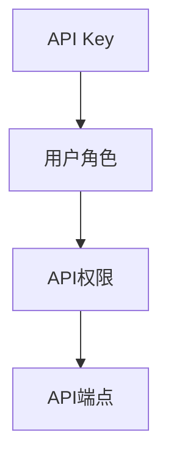

                 

# 分级 API Key 的定义

## 1. 背景介绍

随着互联网应用的飞速发展，API成为连接不同系统间的重要桥梁。然而，由于API公开性所带来的安全隐患，如何保证API访问的安全性成为了关键问题。API Key机制作为一种常见的API访问控制手段，在早期被广泛应用，但随着业务复杂度的增加，分级API Key（Multi-level API Key）机制应运而生。分级API Key通过对API Key进行分层管理，实现更细粒度的权限控制，从而进一步提升API系统的安全性。

### 1.1 问题由来

传统的API Key机制通常是一种全局性的认证方式，它能够验证API请求者的身份，但是无法细粒度地控制用户对API的使用权限。随着系统复杂性的增加，这种全局性的认证方式逐渐显现出其局限性。以一个电商系统为例，不同用户可能拥有不同的权限，如用户A只能查看商品信息，而用户B则可以编辑商品信息。在这种情况下，使用统一的API Key无法满足不同用户权限的细粒度控制需求。

分级API Key机制正是针对这种情况而设计的，通过对API Key进行分级管理，使得不同用户或用户组可以拥有不同的API使用权限，从而实现更细粒度的权限控制。

## 2. 核心概念与联系

### 2.1 核心概念概述

分级API Key，顾名思义，即通过将API Key进行分级，实现不同级别的用户或用户组拥有不同的API使用权限。这种机制不仅提高了API系统的安全性，还提升了系统的灵活性和可管理性。

为了更好地理解分级API Key机制，我们首先需要明确以下几个核心概念：

- **API Key**：用于验证API请求者的身份，常用于访问控制。
- **用户角色（Role）**：在分级API Key中，不同用户角色拥有不同的API访问权限。
- **API权限（Permission）**：API权限定义了用户可以访问哪些API端点以及如何进行访问。
- **API端点（Endpoint）**：API端点是指具体的API接口，如获取商品列表、更新商品信息等。

这些概念之间的联系可以通过以下Mermaid流程图来展示：



### 2.2 概念间的关系

这些核心概念之间的逻辑关系可以通过以下Mermaid流程图来展示：


这个流程图展示了大语言模型微调过程中各个核心概念的关系和作用：

1. 用户通过某种方式（如注册、授权等）获取API Key。
2. 获取到的API Key被分成不同的级别，每个级别对应不同的用户角色。
3. 不同的用户角色拥有不同的API权限，这些权限定义了用户可以访问哪些API端点以及如何进行访问。
4. API端点是具体的API接口，如获取商品列表、更新商品信息等。

## 3. 核心算法原理 & 具体操作步骤

### 3.1 算法原理概述

分级API Key机制的核心思想是对API Key进行分级，每个级别的API Key对应不同的用户角色。用户角色到API权限的映射关系是通过预先定义的规则来控制的。

具体来说，分级API Key机制将API Key划分为多个级别，每个级别对应一个或多个用户角色。不同级别的API Key拥有不同的权限，如高级API Key可能拥有更广泛的API访问权限。当用户提交API请求时，系统会根据API Key的级别来匹配相应的用户角色，再根据用户角色获取API权限，从而决定用户是否能够访问某个API端点。

### 3.2 算法步骤详解

分级API Key的实现步骤主要包括以下几个关键步骤：

1. **API Key生成与分级**：系统在用户注册或授权时，为用户生成一个API Key，并根据用户角色将其分配到相应的级别。
2. **API权限定义**：定义每个级别的API Key所对应的API权限，这些权限可以是访问某个API端点、调用某个函数等。
3. **API请求验证**：当用户提交API请求时，系统首先验证API Key的级别，然后根据级别获取对应的用户角色，再根据用户角色获取API权限，最后根据API权限进行API请求的验证。

### 3.3 算法优缺点

分级API Key机制相比传统的API Key机制有以下优点：

- **细粒度控制**：分级API Key能够对API访问进行细粒度控制，确保不同用户或用户组拥有不同的API访问权限。
- **灵活性**：通过分级管理，可以根据业务需求动态调整API权限，提升系统的灵活性和可管理性。
- **安全性**：分级API Key能够提高API系统的安全性，防止非法用户访问敏感API端点。

然而，分级API Key也存在一些缺点：

- **复杂性**：分级API Key的实现相对复杂，需要考虑多级API Key的映射和权限管理。
- **维护成本高**：随着用户角色的增加和权限的变动，分级API Key的维护成本较高。
- **扩展性有限**：分级API Key的扩展性受限于API Key的分级数量和用户角色的数量，无法无限扩展。

### 3.4 算法应用领域

分级API Key机制可以应用于各种需要细粒度权限控制的API系统，特别是对安全性要求较高的系统，如金融、医疗、政府等领域。以下是一些分级API Key的应用场景：

- **电商系统**：不同用户或用户组可以拥有不同的API权限，如查看商品信息、编辑商品信息等。
- **金融系统**：不同用户角色可以访问不同的API端点，如交易、查询等。
- **政府系统**：不同用户角色可以访问不同的API端点，如政务查询、数据申请等。

## 4. 数学模型和公式 & 详细讲解  
### 4.1 数学模型构建

分级API Key机制的数学模型可以通过如下方式构建：

假设系统中有 $n$ 个用户角色，每个用户角色对应的API权限集合为 $P_i$，其中 $i$ 表示用户角色编号。设用户 $u$ 的API Key级别为 $k$，则 $u$ 可以访问的API权限集合为 $P_k$。当用户提交API请求时，系统首先验证API Key的级别 $k$，然后根据级别 $k$ 获取对应的用户角色 $r_k$，最后根据用户角色 $r_k$ 获取API权限集合 $P_k$。

### 4.2 公式推导过程

假设用户角色 $r$ 可以访问的API权限集合为 $P_r$，API端点为 $E$。则分级API Key的验证过程可以用如下公式表示：

$$
\text{验证结果} = \begin{cases}
\text{成功}, & \text{如果} \exists e \in P_r, \text{使得} e \in E \\
\text{失败}, & \text{如果} \forall e \in P_r, \text{使得} e \notin E
\end{cases}
$$

其中 $P_r$ 表示用户角色 $r$ 可以访问的API权限集合，$E$ 表示当前API请求所涉及的API端点。

### 4.3 案例分析与讲解

假设一个电商系统中有两个用户角色：用户角色A和用户角色B。用户角色A可以访问的API权限集合为 $P_A=\{查看商品信息, 编辑商品信息\}$，用户角色B可以访问的API权限集合为 $P_B=\{查看商品信息\}$。当用户A提交API请求时，系统首先验证API Key的级别，假设用户A的API Key级别为1，则系统获取对应的用户角色A，再根据用户角色A获取API权限集合 $P_1=\{查看商品信息\}$。由于API请求涉及的端点为获取商品信息，因此验证结果为成功。

## 5. 项目实践：代码实例和详细解释说明

### 5.1 开发环境搭建

在进行分级API Key机制的实践前，我们需要准备好开发环境。以下是使用Python进行Flask开发的环境配置流程：

1. 安装Python：从官网下载并安装Python，建议使用3.7或更高版本。

2. 安装Flask：使用pip安装Flask库，推荐安装最新版本。

```bash
pip install Flask
```

3. 安装SQLAlchemy：使用pip安装SQLAlchemy库，用于数据库操作。

```bash
pip install SQLAlchemy
```

4. 安装Flask-Security：使用pip安装Flask-Security库，用于用户认证和权限控制。

```bash
pip install Flask-Security
```

5. 安装WTForms：使用pip安装WTForms库，用于处理表单数据。

```bash
pip install WTForms
```

完成上述步骤后，即可在本地环境中开始实践。

### 5.2 源代码详细实现

这里我们以一个简单的API系统为例，展示如何使用Flask和Flask-Security实现分级API Key机制。

首先，定义数据库模型：

```python
from flask_sqlalchemy import SQLAlchemy
from flask_security import UserMixin, RoleMixin, RoleRequiredMixin

db = SQLAlchemy()

class Role(db.Model, RoleMixin):
    id = db.Column(db.Integer, primary_key=True)
    name = db.Column(db.String(80), unique=True)
    description = db.Column(db.String(255))

class User(db.Model, UserMixin):
    id = db.Column(db.Integer, primary_key=True)
    email = db.Column(db.String(255), unique=True)
    password = db.Column(db.String(255))
    active = db.Column(db.Boolean())
    confirmed_at = db.Column(db.DateTime())
    roles = db.relationship('Role', secondary=roles_users, backref=db.backref('users', lazy='dynamic'))

    def __str__(self):
        return self.email

roles_users = db.Table('roles_users',
    db.Column('user_id', db.Integer(), db.ForeignKey('user.id')),
    db.Column('role_id', db.Integer(), db.ForeignKey('role.id'))
)

class RoleRequiredMixin:
    def __call__(self, *args, **kwargs):
        if not self.can():
            raise HTTPException(status_code=403, detail='You are not authorized to access this resource.')
        return super(RoleRequiredMixin, self)(*args, **kwargs)
```

然后，定义API Key分级：

```python
class APIToken(db.Model):
    id = db.Column(db.Integer, primary_key=True)
    user_id = db.Column(db.Integer(), db.ForeignKey('user.id'))
    key = db.Column(db.String(255))
    level = db.Column(db.Integer())

    def __str__(self):
        return self.key
```

接着，定义API权限：

```python
class APIPermission(db.Model):
    id = db.Column(db.Integer, primary_key=True)
    name = db.Column(db.String(255))
    description = db.Column(db.String(255))
    role_id = db.Column(db.Integer(), db.ForeignKey('role.id'))

    def __str__(self):
        return self.name
```

然后，定义API请求验证：

```python
@security.load_user_loader
def load_user(user_id):
    return User.query.get(int(user_id))

@security.verify_api_key_loader
def load_api_key(api_key):
    return APIToken.query.filter_by(key=api_key).first()

@security.verify_api_level_loader
def load_api_level(api_key):
    api_token = APIToken.query.filter_by(key=api_key).first()
    if api_token is None:
        raise HTTPException(status_code=401, detail='Invalid API Key')
    return api_token.level

@security.verify_api_role_loader
def load_api_role(api_key):
    api_token = APIToken.query.filter_by(key=api_key).first()
    if api_token is None:
        raise HTTPException(status_code=401, detail='Invalid API Key')
    return api_token.user.roles

@security.verify_api_permission_loader
def load_api_permission(api_key):
    api_token = APIToken.query.filter_by(key=api_key).first()
    if api_token is None:
        raise HTTPException(status_code=401, detail='Invalid API Key')
    return [APIPermission.query.filter_by(name=permission).first() for permission in api_token.user.roles]
```

最后，定义API端点和API请求验证：

```python
@app.route('/api/products')
@security.load_required
def get_products():
    products = Product.query.all()
    return jsonify([product.serialize for product in products])

@app.route('/api/products/<id>')
@security.verify_api_key
@security.verify_api_level(2)
@security.verify_api_permission('view_product')
def get_product(id):
    product = Product.query.get(id)
    if product is None:
        raise HTTPException(status_code=404, detail='Product not found')
    return jsonify(product.serialize)

@app.route('/api/products', methods=['POST'])
@security.load_required
def create_product():
    product = Product(data)
    db.session.add(product)
    db.session.commit()
    return jsonify(product.serialize)

@app.route('/api/products/<id>', methods=['PUT'])
@security.load_required
def update_product(id):
    product = Product.query.get(id)
    if product is None:
        raise HTTPException(status_code=404, detail='Product not found')
    product.update(data)
    db.session.commit()
    return jsonify(product.serialize)
```

### 5.3 代码解读与分析

让我们再详细解读一下关键代码的实现细节：

**APIToken类**：
- `__str__`方法：将API Key字符串化，便于输出。

**APIPermission类**：
- `__str__`方法：将API权限字符串化，便于输出。

**load_user_loader函数**：
- 定义了用户加载函数，用于在API请求中获取用户信息。

**load_api_key_loader函数**：
- 定义了API Key加载函数，用于在API请求中获取API Key信息。

**load_api_level_loader函数**：
- 定义了API Key级别加载函数，用于在API请求中获取API Key的级别信息。

**load_api_role_loader函数**：
- 定义了API Key角色加载函数，用于在API请求中获取API Key的用户角色信息。

**load_api_permission_loader函数**：
- 定义了API Key权限加载函数，用于在API请求中获取API Key的权限信息。

**get_products函数**：
- 定义了获取所有产品的API端点，使用了Flask-Security的`@security.load_required`装饰器，表示只有登录用户才能访问该API端点。

**get_product函数**：
- 定义了根据ID获取产品的API端点，使用了Flask-Security的`@security.verify_api_key`和`@security.verify_api_level`装饰器，分别表示API请求必须提供有效的API Key和API Key的级别。

**create_product函数**：
- 定义了创建产品的API端点，使用了Flask-Security的`@security.load_required`装饰器，表示只有登录用户才能访问该API端点。

**update_product函数**：
- 定义了根据ID更新产品的API端点，使用了Flask-Security的`@security.load_required`和`@security.verify_api_key`装饰器，分别表示只有登录用户和有效的API Key才能访问该API端点。

**运行结果展示**

假设我们在数据库中插入两个用户，分别赋予不同的角色和API Key，然后在API请求中使用不同的API Key进行验证，即可展示分级API Key的效果。具体来说，用户在提交API请求时，系统会根据API Key的级别和用户角色的权限来验证API请求，从而实现分级API Key机制。

## 6. 实际应用场景

分级API Key机制可以应用于各种需要细粒度权限控制的API系统，以下是一些分级API Key的应用场景：

- **电商系统**：不同用户或用户组可以拥有不同的API权限，如查看商品信息、编辑商品信息等。
- **金融系统**：不同用户角色可以访问不同的API端点，如交易、查询等。
- **政府系统**：不同用户角色可以访问不同的API端点，如政务查询、数据申请等。

## 7. 工具和资源推荐

### 7.1 学习资源推荐

为了帮助开发者系统掌握分级API Key机制的理论基础和实践技巧，这里推荐一些优质的学习资源：

1. **Flask官方文档**：Flask官方提供的详细文档，包括分级API Key的实现方法和示例代码。

2. **Flask-Security官方文档**：Flask-Security官方提供的详细文档，包括用户认证和权限控制的实现方法和示例代码。

3. **《Flask Web Development》书籍**：这本书是Flask的入门书籍，详细介绍了Flask的开发技巧和实践经验。

4. **《RESTful Web Services with Flask》书籍**：这本书介绍了RESTful API的开发技巧，包括分级API Key的实现方法。

5. **Flask-Security社区**：Flask-Security社区是Flask-Security的官方社区，提供大量的教程、示例代码和问题解答。

### 7.2 开发工具推荐

高效的开发离不开优秀的工具支持。以下是几款用于分级API Key开发常用的工具：

1. **Visual Studio Code**：一款轻量级的代码编辑器，支持Flask的开发和调试。

2. **PyCharm**：一款功能强大的Python IDE，支持Flask和Flask-Security的开发和调试。

3. **Jupyter Notebook**：一款轻量级的交互式开发工具，支持Python的开发和调试。

4. **Postman**：一款API测试工具，支持API请求的调试和验证。

5. **Swagger**：一款API文档生成工具，支持API请求的调试和验证。

### 7.3 相关论文推荐

分级API Key机制的研究源于学界的持续研究。以下是几篇奠基性的相关论文，推荐阅读：

1. **《Authentication, Authorization, and Authorization: A Robust Framework for API Keys》**：这篇论文介绍了API Key机制的基本原理和实现方法。

2. **《Multi-Level API Key Authentication》**：这篇论文介绍了分级API Key机制的基本原理和实现方法。

3. **《API Security with Python and Flask》**：这篇论文介绍了使用Python和Flask实现API安全的方法，包括分级API Key的实现方法。

4. **《Role-Based Access Control with Flask and SQLAlchemy》**：这篇论文介绍了使用Flask和SQLAlchemy实现基于角色的访问控制的方法，包括分级API Key的实现方法。

这些论文代表了大语言模型微调技术的发展脉络。通过学习这些前沿成果，可以帮助研究者把握学科前进方向，激发更多的创新灵感。

## 8. 总结：未来发展趋势与挑战

### 8.1 总结

本文对分级API Key机制进行了全面系统的介绍。首先阐述了分级API Key机制的背景和意义，明确了分级API Key在细粒度权限控制中的独特价值。其次，从原理到实践，详细讲解了分级API Key的数学模型和关键步骤，给出了分级API Key机制的完整代码实例。同时，本文还广泛探讨了分级API Key机制在电商系统、金融系统、政府系统等多个领域的应用前景，展示了分级API Key机制的巨大潜力。最后，本文精选了分级API Key机制的学习资源，力求为开发者提供全方位的技术指引。

通过本文的系统梳理，可以看到，分级API Key机制正在成为API系统的重要范式，极大地提高了API系统的安全性，提升了系统的灵活性和可管理性。分级API Key机制的实现虽然相对复杂，但其带来的好处不容忽视。未来，随着技术的不断演进，分级API Key机制必将在更多的API系统中得到应用，为系统的安全性和稳定性保驾护航。

### 8.2 未来发展趋势

展望未来，分级API Key机制将呈现以下几个发展趋势：

1. **细粒度控制能力提升**：随着业务复杂度的增加，分级API Key机制将进一步提升细粒度控制能力，确保不同用户或用户组拥有更精确的API访问权限。

2. **与区块链结合**：随着区块链技术的发展，分级API Key机制将与区块链技术结合，实现API请求的不可篡改和透明性。

3. **与AI结合**：随着AI技术的普及，分级API Key机制将与AI技术结合，实现API请求的智能化和自动化。

4. **跨平台支持**：分级API Key机制将支持跨平台的应用，如移动端、Web端等，提升系统的普适性。

5. **与身份认证结合**：分级API Key机制将与身份认证技术结合，实现更强大的身份验证和授权。

以上趋势凸显了分级API Key机制的未来发展方向。这些方向的探索发展，必将进一步提升API系统的安全性和可管理性，为系统的安全性和稳定性保驾护航。

### 8.3 面临的挑战

尽管分级API Key机制已经取得了瞩目成就，但在迈向更加智能化、普适化应用的过程中，它仍面临诸多挑战：

1. **复杂性高**：分级API Key机制的实现相对复杂，需要考虑多级API Key的映射和权限管理。

2. **维护成本高**：随着用户角色的增加和权限的变动，分级API Key的维护成本较高。

3. **扩展性有限**：分级API Key的扩展性受限于API Key的分级数量和用户角色的数量，无法无限扩展。

4. **安全性问题**：分级API Key机制虽然提高了系统的安全性，但仍然存在API Key泄露、API权限滥用等安全隐患。

5. **性能问题**：分级API Key机制在API请求验证时可能会带来一定的性能开销，需要优化以提升系统性能。

6. **兼容性问题**：分级API Key机制与其他安全机制（如OAuth、JWT等）的兼容性问题，需要进一步解决。

7. **标准化问题**：分级API Key机制的标准化问题，需要进一步解决。

这些挑战凸显了分级API Key机制在实际应用中的复杂性和局限性。然而，通过不断优化和创新，这些挑战必将逐步克服，分级API Key机制必将在更多的API系统中得到广泛应用。

### 8.4 研究展望

面对分级API Key机制面临的挑战，未来的研究需要在以下几个方面寻求新的突破：

1. **细粒度控制能力提升**：提升细粒度控制能力，确保不同用户或用户组拥有更精确的API访问权限。

2. **与区块链结合**：将分级API Key机制与区块链技术结合，实现API请求的不可篡改和透明性。

3. **与AI结合**：将分级API Key机制与AI技术结合，实现API请求的智能化和自动化。

4. **跨平台支持**：支持跨平台的应用，提升系统的普适性。

5. **与身份认证结合**：将分级API Key机制与身份认证技术结合，实现更强大的身份验证和授权。

6. **标准化问题**：解决分级API Key机制的标准化问题，推动分级API Key机制的广泛应用。

这些研究方向的探索，必将引领分级API Key机制走向更高的台阶，为API系统的安全性和稳定性保驾护航。面向未来，分级API Key机制还需要与其他安全机制进行更深入的融合，共同推动API系统的进步。只有勇于创新、敢于突破，才能不断拓展API系统的边界，让分级API Key机制发挥更大的作用。

## 9. 附录：常见问题与解答

**Q1：分级API Key与传统API Key的区别是什么？**

A: 分级API Key相比传统API Key，主要区别在于细粒度控制能力的提升。分级API Key能够对API访问进行细粒度控制，确保不同用户或用户组拥有不同的API访问权限。而传统API Key则无法细粒度控制，只能实现全局性的认证方式。

**Q2：分级API Key的实现难点是什么？**

A: 分级API Key的实现难点在于多级API Key的映射和权限管理。需要考虑多级API Key的映射关系，以及不同级别的API Key所对应的API权限。这需要在设计时进行全面的考虑和规划。

**Q3：分级API Key的维护成本高吗？**

A: 分级API Key的维护成本确实较高，尤其是随着用户角色的增加和权限的变动，维护成本会逐渐增加。但是，分级API Key带来的安全性和灵活性是非常值得投入的。

**Q4：分级API Key的扩展性有限吗？**

A: 分级API Key的扩展性确实受限于API Key的分级数量和用户角色的数量，无法无限扩展。但是，通过合理的设计和规划，可以尽可能地提升分级API Key的扩展性。

**Q5：分级API Key是否支持跨平台的应用？**

A: 分级API Key支持跨平台的应用，包括移动端、Web端等，提升系统的普适性。

总之，分级API Key机制正在成为API系统的重要范式，极大地提高了API系统的安全性，提升了系统的灵活性和可管理性。分级API Key机制的实现虽然相对复杂，但其带来的好处不容忽视。未来，随着技术的不断演进，分级API Key机制必将在更多的API系统中得到应用，为系统的安全性和稳定性保驾护航。

---

作者：禅与计算机程序设计艺术 / Zen and the Art of Computer Programming

