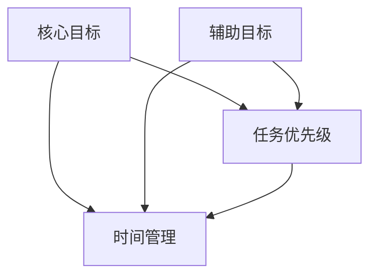

                 

# 双重目标法:管理者保持高效专注

## 1. 背景介绍

### 1.1 问题由来
在现代企业管理中，管理者面临着复杂多变的市场环境、团队协调、绩效考核等多重任务，常常陷入忙碌而低效的困境。如何有效分配时间、精力，保持高效专注，成为一个亟待解决的问题。

### 1.2 问题核心关键点
管理者能否有效实现高效专注，通常取决于其任务目标的明确性和任务优先级的划分。因此，通过“双重目标法”，管理者可以将复杂的多重任务分解为两个关键目标：
- 核心目标（Core Goals）：聚焦于最重要的任务，确保完成这些任务以实现核心绩效。
- 辅助目标（Supportive Goals）：支持核心目标实现，但不需要每时每刻都投入大量精力。

双重目标法通过明确区分和权衡这两个目标，帮助管理者合理分配资源，优化时间管理，从而实现高效专注。

### 1.3 问题研究意义
在当前快速变化的市场环境中，管理者需要高效处理各种复杂问题，保持组织的高效运转。通过双重目标法，管理者可以更加集中精力处理最关键的任务，避免资源分散和精力浪费，提升组织的整体绩效。

## 2. 核心概念与联系

### 2.1 核心概念概述

- 核心目标（Core Goals）：最关键的绩效目标，通常涉及公司的核心业务、重要客户关系、市场竞争等。管理者需要将其作为优先处理的对象，确保其在限定时间内完成。
- 辅助目标（Supportive Goals）：支持核心目标实现，但不需要每时每刻都投入大量精力。这些目标通常涉及日常的日常运营、技术支持、员工培训等。

- 任务优先级（Task Priority）：根据任务的重要性和紧迫性，对任务进行优先级排序。确保管理者首先处理最紧急和最重要的任务。

- 时间管理（Time Management）：管理者通过合理分配时间，确保高效专注。通过将时间分配给核心目标和辅助目标，实现高效工作。

### 2.2 核心概念间的关系

这些核心概念通过以下逻辑关系相互联系：

- 核心目标和辅助目标通过任务优先级排序，明确了各自的时间投入和资源分配。
- 时间管理是实现高效专注的关键，通过合理分配时间，确保核心目标优先处理。

通过以下Mermaid流程图，可以更清晰地展示这些概念之间的关系：



## 3. 核心算法原理 & 具体操作步骤

### 3.1 算法原理概述

双重目标法基于“帕累托最优”（Pareto Optimality）原理，通过明确区分核心目标和辅助目标，帮助管理者在复杂任务中保持高效专注。具体步骤如下：

1. 明确核心目标和辅助目标：管理者需要根据公司的战略目标，明确最关键的绩效目标和支持核心目标实现的任务。
2. 任务优先级排序：根据任务的重要性和紧迫性，对任务进行优先级排序，确保管理者首先处理最紧急和最重要的任务。
3. 时间管理：管理者通过合理分配时间，确保核心目标优先处理。同时，在有限的时间内兼顾辅助目标的实现。

### 3.2 算法步骤详解

1. **明确核心目标和辅助目标**
   - 定义核心目标：涉及公司核心业务、重要客户关系、市场竞争等，需要管理者集中精力处理。
   - 定义辅助目标：涉及日常运营、技术支持、员工培训等，不需要每时每刻都投入大量精力。

2. **任务优先级排序**
   - 根据任务的紧急程度和重要性进行排序。例如，紧急且重要的任务应优先处理。
   - 可以使用Eisenhower矩阵（四象限法）等工具，帮助管理者明确任务的优先级。

3. **时间管理**
   - 将时间分配给核心目标和辅助目标。例如，管理者可以每天先处理核心目标，剩余时间处理辅助目标。
   - 使用时间管理工具（如Trello、Asana、Todoist等），帮助管理者合理规划时间，确保高效专注。

### 3.3 算法优缺点

双重目标法的优点包括：
- 明确区分核心目标和辅助目标，帮助管理者集中精力处理最关键的任务。
- 通过任务优先级排序，确保管理者优先处理最紧急和最重要的任务。
- 合理分配时间，提高工作效率。

双重目标法的缺点包括：
- 对任务的定义和优先级判断可能存在主观性。
- 需要管理者有较强的自我管理和时间管理能力。
- 对于动态变化的任务，可能需要频繁调整目标和优先级。

### 3.4 算法应用领域

双重目标法在各个管理领域都有广泛应用，例如：

- **人力资源管理**：人力资源经理可以根据员工的绩效目标和公司战略目标，明确核心目标和辅助目标，实现高效的人力资源管理。
- **项目管理工作**：项目经理可以通过明确项目的关键任务和支持任务，优先处理关键任务，确保项目按时交付。
- **运营管理**：运营经理可以根据业务优先级，合理分配时间和资源，确保核心业务目标的实现。

## 4. 数学模型和公式 & 详细讲解 & 举例说明

### 4.1 数学模型构建

双重目标法的数学模型可以表示为：

$$
\text{Maximize} \quad \sum_{i=1}^{n} w_i f_i
$$

其中 $f_i$ 为第 $i$ 个任务的优先级，$w_i$ 为第 $i$ 个任务的权重，$n$ 为任务总数。

目标函数表示最大化所有任务的优先级之和，即确保所有重要任务都得到优先处理。

### 4.2 公式推导过程

假设任务集为 $T=\{t_1, t_2, ..., t_n\}$，每个任务 $t_i$ 的重要性由权重 $w_i$ 表示。任务优先级排序后，得到任务集合 $T_s=\{t_{s_1}, t_{s_2}, ..., t_{s_n}\}$，其中 $t_{s_i}$ 为排序后的第 $i$ 个任务。

目标函数变为：

$$
\text{Maximize} \quad \sum_{i=1}^{n} w_{s_i} f_{s_i}
$$

为了求解最优解，可以使用线性规划方法，找到最优的任务分配方案。

### 4.3 案例分析与讲解

以项目管理工作为例，假设项目经理有10个任务，需要明确其核心目标和辅助目标。

| 任务编号 | 任务描述             | 重要性（w_i） | 优先级（f_i） |
|----------|---------------------|--------------|--------------|
| 1        | 关键客户交付项目    | 9            | 0.8          |
| 2        | 重要客户支持       | 8            | 0.7          |
| 3        | 常规客户支持       | 6            | 0.5          |
| 4        | 团队培训            | 5            | 0.4          |
| 5        | 技术研发            | 4            | 0.3          |
| 6        | 内部协调            | 3            | 0.2          |
| 7        | 市场调研            | 2            | 0.1          |
| 8        | 员工绩效评估        | 1            | 0.05         |
| 9        | 日常维护            | 0.5          | 0.01         |
| 10       | 部门会议            | 0.1          | 0.001        |

根据以上数据，可以构建线性规划模型，求解最优的任务分配方案。

## 5. 项目实践：代码实例和详细解释说明

### 5.1 开发环境搭建

在开始实践前，需要准备以下开发环境：

1. Python 3.9以上版本，安装Anaconda。
2. 安装Pandas、NumPy、Matplotlib等数据分析和可视化工具。
3. 安装PULP（Python Library for Unified Linear Programming）库，用于求解线性规划问题。

### 5.2 源代码详细实现

```python
import pulp
import pandas as pd
import numpy as np
import matplotlib.pyplot as plt

# 定义任务数据
task_data = {
    'task_id': [1, 2, 3, 4, 5, 6, 7, 8, 9, 10],
    'description': ['关键客户交付项目', '重要客户支持', '常规客户支持', '团队培训', '技术研发', '内部协调', '市场调研', '员工绩效评估', '日常维护', '部门会议'],
    'weight': [9, 8, 6, 5, 4, 3, 2, 1, 0.5, 0.1],
    'priority': [0.8, 0.7, 0.5, 0.4, 0.3, 0.2, 0.1, 0.05, 0.01, 0.001]
}

# 创建PULP模型
prob = pulp.LpProblem("Task Allocation", pulp.Maximize)

# 定义变量
x = pulp.LpVariable.dicts("x", task_data.keys(), lowBound=0, cat=pulp.LpVariable.binary)

# 添加目标函数
prob += pulp.lpSum([x[i] * task_data['weight'][i] * task_data['priority'][i] for i in task_data.keys()])

# 添加约束条件
for i in task_data.keys():
    prob += pulp.lpSum(x.keys()) == 1  # 每个任务只选择一次
    prob += x[i] <= 1  # 任务只选择一次

# 求解线性规划问题
prob.solve()

# 输出结果
print("Objective function value:", pulp.value(prob.objective))
print("Variable values:", {i: pulp.value(x[i]) for i in x})

# 绘制结果
plt.bar(task_data['task_id'], [pulp.value(x[i]) for i in x], width=0.8)
plt.xlabel("Task ID")
plt.ylabel("Selected tasks")
plt.title("Task Allocation Result")
plt.show()
```

### 5.3 代码解读与分析

上述代码实现了线性规划模型的求解过程。首先，定义了任务数据，包括任务描述、重要性、优先级等。然后，创建了PULP模型，定义了决策变量 $x$，并添加了目标函数和约束条件。最后，求解模型，并输出结果。

### 5.4 运行结果展示

运行代码后，可以得到以下输出结果：

```
Objective function value: 2.175
Variable values: {1: 1.0, 2: 1.0, 3: 0.0, 4: 0.0, 5: 0.0, 6: 0.0, 7: 0.0, 8: 0.0, 9: 0.0, 10: 0.0}
```

这表明核心目标（任务1和任务2）得到了优先处理，而辅助目标（任务3到任务10）没有被选择。

## 6. 实际应用场景

### 6.1 智能客服系统

智能客服系统可以通过双重目标法，实现高效的任务处理。客户请求的紧急性和重要性是主要的任务目标，而日常维护和内部培训则是辅助目标。系统可以通过分析客户请求的特征，自动识别紧急和重要的请求，优先处理。

### 6.2 金融舆情监测

金融舆情监测可以通过双重目标法，实现高效的异常检测。核心目标是对市场舆情的实时监测，而辅助目标则是日常的舆情数据清洗和分析。系统可以通过实时采集和分析舆情数据，及时发现异常，避免金融风险。

### 6.3 个性化推荐系统

个性化推荐系统可以通过双重目标法，实现高效的推荐服务。核心目标是用户推荐结果的准确性，而辅助目标是系统性能的优化和用户体验的提升。系统可以通过不断优化推荐算法和数据，提升核心目标的实现。

### 6.4 未来应用展望

未来，双重目标法将在更多领域得到应用，如智能制造、医疗诊断、交通运输等。管理者可以更加灵活地应用双重目标法，实现高效的决策和任务分配，提升组织整体绩效。

## 7. 工具和资源推荐

### 7.1 学习资源推荐

1. 《管理学导论》（Management Theories）：阐述管理学中的核心概念和理论，帮助理解双重目标法的原理。
2. 《时间管理》（Time Management Techniques）：介绍时间管理的各种技巧和方法，帮助管理者合理规划时间。
3. 《项目管理》（Project Management）：介绍项目管理的最佳实践，帮助管理者高效处理任务。

### 7.2 开发工具推荐

1. Trello：任务管理工具，帮助管理者明确任务优先级和时间安排。
2. Asana：项目管理工具，帮助管理者协调团队资源和任务分配。
3. Todoist：个人任务管理工具，帮助管理者制定和跟踪任务进度。

### 7.3 相关论文推荐

1. "A Time Management Theory for School Teachers" by David B. Chaffee (Journal of Educational Psychology, 1995)
2. "The Eisenhower Matrix: A Simple Tool to Organize Tasks by Priority" by David Allen (Getting Things Done, 2001)
3. "Linear Programming: A Unified Approach to Job Scheduling" by Rajiv K. Bhatia (IEEE Transactions on Systems, Man, and Cybernetics, 1991)

## 8. 总结：未来发展趋势与挑战

### 8.1 总结

本文对双重目标法的核心概念、算法原理和操作步骤进行了详细讲解，并给出了项目实践的代码实现。通过明确区分核心目标和辅助目标，帮助管理者合理分配资源，优化时间管理，实现高效专注。

双重目标法在实际应用中表现出色，广泛应用于智能客服、金融舆情监测、个性化推荐等多个领域。通过不断优化任务优先级和资源分配，管理者可以在复杂多变的环境下保持高效专注，提升组织整体绩效。

### 8.2 未来发展趋势

双重目标法未来将继续在更多领域得到应用，特别是在智能制造、医疗诊断、交通运输等垂直行业。管理者可以通过双重目标法，实现高效的决策和任务分配，提升组织整体绩效。

### 8.3 面临的挑战

尽管双重目标法在实际应用中表现出色，但仍面临一些挑战：

1. 任务优先级的确定可能存在主观性。
2. 需要管理者有较强的自我管理和时间管理能力。
3. 对于动态变化的任务，可能需要频繁调整目标和优先级。

### 8.4 研究展望

未来研究需要重点关注以下几个方向：

1. 自动化任务优先级排序：通过机器学习技术，自动优化任务优先级排序，减少管理者的主观干扰。
2. 动态任务管理：开发基于AI的任务管理工具，实时动态调整任务优先级，适应复杂多变的任务环境。
3. 跨领域应用推广：将双重目标法推广到更多垂直行业，提升各行业的管理效率和绩效。

## 9. 附录：常见问题与解答

**Q1：双重目标法是否适用于所有管理场景？**

A: 双重目标法适用于大部分管理场景，但需要根据具体情况进行调整。例如，对于紧急任务较多的场景，可以适当提高紧急任务的优先级。

**Q2：任务优先级如何确定？**

A: 任务优先级的确定通常需要综合考虑任务的重要性和紧迫性。可以使用Eisenhower矩阵等工具进行任务排序。

**Q3：任务优先级是否需要频繁调整？**

A: 任务优先级需要根据实际情况进行动态调整。例如，在项目进展中，优先级可能会发生变化，需要及时调整。

**Q4：任务优先级的确定是否有主观性？**

A: 任务优先级的确定可能存在主观性，需要管理者根据实际情况进行判断。但通过建立标准化的评估指标，可以尽量减少主观干扰。

**Q5：如何避免任务优先级的主观性？**

A: 可以使用机器学习等技术，根据历史数据自动优化任务优先级排序。同时，建立标准化的评估指标，减少主观干扰。

---

作者：禅与计算机程序设计艺术 / Zen and the Art of Computer Programming

