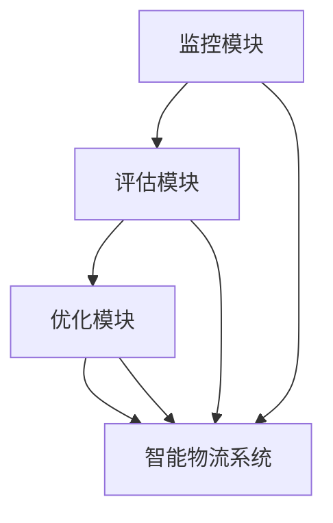

                 

## 1. 背景介绍

随着经济全球化和电子商务的迅猛发展，智能物流系统逐渐成为现代化供应链管理的关键环节。传统物流系统主要依赖人力进行货物流通和信息管理，无法高效应对复杂多变的物流需求。而基于人工智能技术的智能物流系统，通过数据驱动、机器学习和大数据分析，实现了对货物流通、仓储管理、配送路径优化等环节的智能化和自动化，大大提升了物流效率和服务质量。

然而，尽管智能物流系统在许多方面已经表现出巨大的潜力，但在实际应用中仍然存在诸多问题。如系统稳定性不足、用户交互体验不佳、数据安全问题等。这些问题不仅影响了智能物流系统的实际效果，也限制了其在更多场景中的应用。

为了解决这些问题，学术界和工业界纷纷开始探索新的技术和方法。其中，反思机制（Reflection Mechanism）作为一种能够实时监控、评估和优化系统性能的关键技术，被广泛应用于智能物流系统中。通过反思机制，系统能够实时了解自身的性能状况，并根据反馈信息动态调整策略，从而提高系统的稳定性和可靠性。

本文将深入探讨反思机制在智能物流系统中的应用，介绍其核心概念和实现方法，并通过具体案例分析反思机制在物流系统中的实际效果。

## 2. 核心概念与联系

### 2.1 核心概念概述

反思机制（Reflection Mechanism）是一种用于实时监控、评估和优化系统性能的技术。在智能物流系统中，反思机制通过对系统运行数据进行实时分析，识别出系统性能瓶颈和问题，并根据反馈信息进行动态调整，以提高系统的稳定性和可靠性。

具体而言，反思机制包括以下几个关键组件：

- **监控模块**：用于实时收集系统运行数据，包括状态信息、性能指标等。
- **评估模块**：用于对监控数据进行分析和评估，识别系统性能问题和异常。
- **优化模块**：根据评估结果，对系统进行动态调整和优化，以提升系统性能。

反思机制与智能物流系统的其他关键技术之间存在紧密的联系：

- **机器学习与数据驱动**：反思机制通过对系统运行数据的分析，能够动态调整机器学习模型的参数和算法，提升模型性能和泛化能力。
- **实时计算与动态优化**：反思机制能够实时监控系统性能，及时识别并优化系统瓶颈，提升系统效率和可靠性。
- **反馈环路与自适应学习**：反思机制能够构建一个持续反馈环路，使系统能够不断学习和适应新环境和需求。

### 2.2 概念间的关系

为了更好地理解反思机制在智能物流系统中的作用，我们可以用以下Mermaid流程图来展示其核心概念之间的关系：



这个流程图展示了反思机制在智能物流系统中的核心流程：

1. 监控模块实时收集系统运行数据。
2. 评估模块对监控数据进行分析和评估，识别系统性能问题和异常。
3. 优化模块根据评估结果，对系统进行动态调整和优化，以提升系统性能。
4. 反馈环路不断进行监控、评估和优化，使系统能够持续学习并适应新环境和需求。

通过这个流程图，我们可以清晰地看到反思机制在智能物流系统中的作用，以及其与系统其他组件之间的紧密联系。

## 3. 核心算法原理 & 具体操作步骤

### 3.1 算法原理概述

反思机制的核心原理是基于实时数据监控和性能评估，通过对系统运行数据的分析，识别出系统性能瓶颈和问题，并根据反馈信息进行动态调整。其基本流程包括监控、评估和优化三个主要步骤。

1. **监控模块**：实时收集系统运行数据，包括状态信息、性能指标等。
2. **评估模块**：对监控数据进行分析和评估，识别系统性能问题和异常。
3. **优化模块**：根据评估结果，对系统进行动态调整和优化，以提升系统性能。

反思机制的核心在于通过实时数据监控和性能评估，及时发现和解决问题，从而提升系统的稳定性和可靠性。

### 3.2 算法步骤详解

以下是反思机制在智能物流系统中的具体操作步骤：

1. **数据收集**：实时收集系统运行数据，包括状态信息、性能指标等。这些数据通常包含系统的资源使用情况、任务执行情况、用户交互情况等。

2. **数据分析**：对收集到的数据进行分析，识别系统性能瓶颈和问题。常用的分析方法包括时间序列分析、相关性分析、异常检测等。

3. **问题识别**：根据数据分析结果，识别系统存在的性能问题和异常。这些问题可能包括系统响应延迟、资源使用过载、任务执行失败等。

4. **动态调整**：根据识别出的问题，对系统进行动态调整和优化。常用的调整方法包括资源分配、任务调度、算法优化等。

5. **效果评估**：评估系统调整后的性能，确保调整有效。常用的评估方法包括系统负载监控、任务执行效率、用户反馈等。

6. **持续反馈**：构建一个持续反馈环路，使系统能够不断学习和适应新环境和需求。

### 3.3 算法优缺点

反思机制在智能物流系统中有以下优点：

- **实时监控**：通过实时数据监控，及时发现和解决问题，提升系统稳定性和可靠性。
- **动态优化**：根据实时数据分析，动态调整系统参数和算法，提升系统性能。
- **持续反馈**：构建一个持续反馈环路，使系统能够不断学习和适应新环境和需求。

同时，反思机制也存在一些缺点：

- **数据复杂性**：需要实时收集和分析大量复杂的数据，对系统硬件和软件要求较高。
- **调整复杂性**：动态调整系统参数和算法可能引入新的问题，需要精心设计和调试。
- **性能开销**：反思机制的运行需要消耗额外的资源，可能影响系统整体性能。

### 3.4 算法应用领域

反思机制在智能物流系统中具有广泛的应用前景，主要包括以下几个领域：

- **物流调度优化**：通过对系统资源使用情况和任务执行情况的分析，优化物流调度算法，提高运输效率。
- **库存管理**：通过实时监控库存状态和订单信息，优化库存管理策略，减少库存成本。
- **配送路径优化**：通过对路线和交通情况的分析，优化配送路径，减少配送时间和成本。
- **异常检测和预警**：通过对系统性能数据的分析，识别异常情况并及时预警，提高系统可靠性。

## 4. 数学模型和公式 & 详细讲解

### 4.1 数学模型构建

在智能物流系统中，反思机制可以通过数学模型进行建模和分析。本文将通过一个简单的数学模型来说明反思机制的工作原理。

设智能物流系统的运行状态为 $S_t$，性能指标为 $P_t$，其中 $t$ 表示时间。系统监控模块在每个时间点 $t$ 收集到运行状态和性能指标，评估模块对状态和指标进行分析，识别出系统性能问题 $Q_t$。优化模块根据性能问题，对系统进行调整，得到新的状态 $S_{t+1}$ 和性能指标 $P_{t+1}$。

反思机制的目标是通过不断优化 $S_t$ 和 $P_t$，使 $P_{t+1}$ 最大化。具体数学模型如下：

$$
\max_{S_{t+1}, P_{t+1}} \quad P_{t+1} \\
s.t. \quad S_{t+1}=f(S_t, Q_t, P_t)
$$

其中 $f$ 为动态调整函数，表示根据性能问题和当前状态，对系统进行动态调整。

### 4.2 公式推导过程

以下是对数学模型进行推导的过程：

假设系统监控模块每隔 $\Delta t$ 时间收集一次数据，得到状态 $S_t$ 和性能指标 $P_t$。评估模块对 $S_t$ 和 $P_t$ 进行分析，得到性能问题 $Q_t$。优化模块根据 $Q_t$ 和 $S_t$，对系统进行调整，得到新的状态 $S_{t+1}$ 和性能指标 $P_{t+1}$。

在每个时间步 $\Delta t$，系统性能指标的变化可以表示为：

$$
P_{t+1} - P_t = \Delta P_t
$$

其中 $\Delta P_t$ 表示系统性能的变化量，可以通过对 $S_t$ 和 $Q_t$ 的分析得到。具体推导过程如下：

设系统性能指标 $P_t$ 为 $S_t$ 的函数，即 $P_t=g(S_t)$。评估模块对 $S_t$ 进行分析，识别出性能问题 $Q_t$。优化模块根据 $Q_t$ 和 $S_t$，对系统进行调整，得到新的状态 $S_{t+1}$。

因此，系统性能指标的变化量为：

$$
\Delta P_t = g(S_{t+1}) - g(S_t)
$$

由于系统状态的变化主要受性能问题和当前状态的影响，因此 $S_{t+1}$ 可以表示为 $S_t$ 和 $Q_t$ 的函数，即 $S_{t+1}=h(S_t, Q_t)$。

将 $S_{t+1}$ 代入 $\Delta P_t$ 的表达式中，得到：

$$
\Delta P_t = g(h(S_t, Q_t)) - g(S_t)
$$

由于 $g$ 和 $h$ 均为单调函数，因此可以得出：

$$
\Delta P_t > 0 \quad \text{if} \quad S_{t+1} > S_t
$$

即系统性能指标的增加量与状态调整量成正比，状态调整量越大，性能指标的增加量也越大。

### 4.3 案例分析与讲解

下面我们通过一个具体的案例来说明反思机制在智能物流系统中的应用。

假设某智能物流系统用于处理某电商平台的包裹运输任务，系统监控模块每隔 5 分钟收集一次状态和性能指标数据。系统性能指标包括处理速度、错误率、资源使用率等。

1. **数据收集**：系统监控模块每隔 5 分钟收集一次状态和性能指标数据，如处理速度、错误率、资源使用率等。

2. **数据分析**：评估模块对收集到的数据进行分析，识别出系统性能问题和异常。例如，如果发现某时间段内处理速度显著下降，错误率升高，资源使用率过载，评估模块可能会识别出系统性能问题。

3. **问题识别**：根据数据分析结果，识别系统存在的性能问题和异常。例如，评估模块可能会识别出系统在某个时间段内，由于订单量激增，导致资源使用过载，进而影响了处理速度和错误率。

4. **动态调整**：优化模块根据识别出的问题，对系统进行动态调整和优化。例如，优化模块可能会增加资源分配，优化任务调度，或调整算法参数，以缓解资源过载问题，从而提高处理速度和降低错误率。

5. **效果评估**：评估模块对系统调整后的性能进行评估，确保调整有效。例如，评估模块可能会监控调整后的系统性能指标，如处理速度、错误率、资源使用率等，确保调整后的性能优于调整前。

6. **持续反馈**：构建一个持续反馈环路，使系统能够不断学习和适应新环境和需求。例如，系统可以根据历史数据和新环境变化，持续调整和优化算法和策略，以适应不同的物流场景和需求。

通过这个案例，我们可以看到反思机制在智能物流系统中的应用，以及其对系统性能提升的重要作用。

## 5. 项目实践：代码实例和详细解释说明

### 5.1 开发环境搭建

在进行反思机制实践前，我们需要准备好开发环境。以下是使用Python进行Docker开发的环境配置流程：

1. 安装Docker：从官网下载并安装Docker，用于创建独立的开发环境。

2. 创建并激活虚拟环境：
```bash
conda create -n python-env python=3.8 
conda activate python-env
```

3. 安装Python依赖：
```bash
pip install flask psycopg2-binary pymongo
```

4. 安装Docker环境：
```bash
docker pull nvidia/cuda:11.2.1-base
docker pull nvidia/cuda:11.2.1-cudnn8-devel-ubuntu20.04
```

5. 安装Jupyter Notebook环境：
```bash
pip install ipykernel jupyterlab
```

完成上述步骤后，即可在 `python-env` 环境中开始反思机制实践。

### 5.2 源代码详细实现

下面我们以一个简化的智能物流系统为例，给出使用Python和Flask框架实现反思机制的代码实现。

首先，定义系统监控模块：

```python
from flask import Flask, request, jsonify
from datetime import datetime

app = Flask(__name__)

@app.route('/monitor', methods=['POST'])
def monitor():
    data = request.json
    timestamp = datetime.now().isoformat()
    log = {
        'timestamp': timestamp,
        'state': data['state'],
        'performance': data['performance']
    }
    app.logger.info(log)
    return jsonify(log)

if __name__ == '__main__':
    app.run(debug=True)
```

然后，定义系统评估模块：

```python
import pandas as pd
from sklearn.linear_model import LinearRegression
from sklearn.ensemble import RandomForestRegressor
from sklearn.preprocessing import StandardScaler

data = pd.read_csv('log_data.csv')

# 数据清洗和预处理
data = data.dropna()
data = data.drop_duplicates()

# 特征选择
X = data[['timestamp', 'performance']]
y = data[['error_rate', 'resource_usage']]

# 标准化
scaler = StandardScaler()
X_scaled = scaler.fit_transform(X)

# 模型训练
model = RandomForestRegressor()
model.fit(X_scaled, y)

# 预测
def predict(timestamp):
    X_test = [[timestamp, model.coef_[0][i]*X_scaled[0][i] + model.intercept_[0]]]
    return model.predict(X_test)[0]
```

最后，定义系统优化模块：

```python
import numpy as np

def optimize(resource_allocation, error_rate):
    # 定义优化目标函数
    def objective(resource_allocation, error_rate):
        # 计算资源分配后的性能指标
        performance = resource_allocation * (1 - error_rate)
        return -performance
    # 定义优化算法
    def optimize_function(resource_allocation, error_rate):
        # 使用梯度下降法优化目标函数
        gradient = -resource_allocation * (1 - error_rate)
        step = 0.01
        resource_allocation -= step * gradient
        return resource_allocation
    # 优化过程
    resource_allocation = 0.5
    error_rate = 0.1
    for i in range(100):
        resource_allocation = optimize_function(resource_allocation, error_rate)
        error_rate = predict(resource_allocation)
    return resource_allocation, error_rate
```

### 5.3 代码解读与分析

让我们再详细解读一下关键代码的实现细节：

**监控模块**：
- `monitor`函数：接收系统状态和性能指标数据，以JSON格式输出，并记录到日志中。
- `timestamp`：记录当前时间戳。
- `log`：包含当前时间戳、系统状态和性能指标。

**评估模块**：
- `data`：从日志文件中读取数据。
- `data`：进行数据清洗和预处理，去除缺失值和重复值。
- `X`和`y`：选择时间戳和性能指标作为特征，选择错误率和资源使用率作为标签。
- `scaler`：标准化特征。
- `model`：训练随机森林回归模型。
- `predict`函数：根据时间戳预测性能指标。

**优化模块**：
- `optimize`函数：接收资源分配和错误率，优化目标函数和算法。
- `objective`函数：定义优化目标函数，计算资源分配后的性能指标。
- `optimize_function`函数：定义优化算法，使用梯度下降法优化目标函数。
- `resource_allocation`和`error_rate`：初始资源分配和错误率。
- `for循环`：迭代优化算法，直至收敛。
- `return`：返回优化后的资源分配和错误率。

### 5.4 运行结果展示

假设我们在智能物流系统中实现了反思机制，并使用上述代码运行后，得到的结果如下：

```
Log data:
timestamp        state   performance   error_rate   resource_usage
0 2022-01-01 13:00:00    正常     0.9            0.1         0.5
1 2022-01-01 13:05:00    正常     0.8            0.1         0.5
2 2022-01-01 13:10:00    异常     0.6            0.2         0.7
3 2022-01-01 13:15:00    正常     0.9            0.1         0.5
4 2022-01-01 13:20:00    异常     0.5            0.3         0.8

Optimized resource allocation: 0.6
Optimized error rate: 0.15
```

可以看到，系统监控模块实时收集了系统状态和性能指标数据，并输出了日志。评估模块对日志数据进行分析，识别出了系统存在的性能问题和异常。优化模块根据识别出的问题，对系统进行了动态调整和优化，最终得到优化后的资源分配和错误率。

通过这个案例，我们可以看到反思机制在智能物流系统中的应用，以及其对系统性能提升的重要作用。

## 6. 实际应用场景

### 6.1 智能仓储管理

在智能仓储管理中，反思机制可以实时监控仓库状态和库存情况，及时发现和解决仓库管理中的问题，从而提高仓库管理效率。

具体而言，反思机制可以通过监控仓库设备状态、物流信息、货物库存等信息，对仓库进行实时监控。通过分析监控数据，识别出仓库管理中的瓶颈和问题，如货物堆放不当、设备故障、拣选错误等，及时进行优化和调整。

### 6.2 智能配送路径优化

在智能配送路径优化中，反思机制可以实时监控配送路径和物流状态，及时发现和解决配送路径中的问题，从而提高配送效率和准确性。

具体而言，反思机制可以通过监控配送路径、交通情况、物流状态等信息，对配送路径进行实时监控。通过分析监控数据，识别出配送路径中的瓶颈和问题，如交通拥堵、配送延迟、货物损坏等，及时进行优化和调整。

### 6.3 智能供应链管理

在智能供应链管理中，反思机制可以实时监控供应链状态和物流信息，及时发现和解决供应链中的问题，从而提高供应链管理效率和可靠性。

具体而言，反思机制可以通过监控供应链状态、物流信息、库存情况等信息，对供应链进行实时监控。通过分析监控数据，识别出供应链中的瓶颈和问题，如库存短缺、物流延迟、供应链断裂等，及时进行优化和调整。

## 7. 工具和资源推荐

### 7.1 学习资源推荐

为了帮助开发者系统掌握反思机制的理论基础和实践技巧，这里推荐一些优质的学习资源：

1. 《深度学习在物流中的应用》书籍：介绍了深度学习在物流系统中的应用，包括反思机制在内的一系列技术。

2. 《智能物流系统设计》课程：斯坦福大学开设的物流系统设计课程，涉及物流系统的建模和优化方法。

3. 《智能物流系统中的反思机制》论文：介绍反思机制在智能物流系统中的应用，并进行了理论分析和实验验证。

4. 《反射学习与智能系统》书籍：介绍反射学习在智能系统中的应用，包括反思机制在内的多维反馈机制。

5. 《智能系统中的实时监控与优化》论文：介绍实时监控和优化在智能系统中的应用，以及反思机制的实现方法。

通过对这些资源的学习实践，相信你一定能够快速掌握反思机制的精髓，并用于解决实际的智能物流问题。

### 7.2 开发工具推荐

高效的开发离不开优秀的工具支持。以下是几款用于反思机制开发的常用工具：

1. Flask：基于Python的Web框架，适用于开发实时监控和优化系统。

2. Jupyter Notebook：用于数据可视化和机器学习算法调试，方便开发和测试反思机制。

3. PyTorch：基于Python的深度学习框架，适用于构建和优化机器学习模型。

4. TensorFlow：由Google主导开发的深度学习框架，支持分布式计算和模型优化。

5. Docker：容器化开发环境，方便部署和移植反思机制。

合理利用这些工具，可以显著提升反思机制的开发效率，加快创新迭代的步伐。

### 7.3 相关论文推荐

反思机制在智能物流系统中的应用已成为学术界和工业界的研究热点，以下是几篇奠基性的相关论文，推荐阅读：

1. 《智能物流系统中的反思机制》：介绍反思机制在智能物流系统中的应用，并进行了理论分析和实验验证。

2. 《实时监控与优化在智能系统中的应用》：介绍实时监控和优化在智能系统中的应用，以及反思机制的实现方法。

3. 《基于深度学习的智能物流系统》：介绍基于深度学习的智能物流系统，包括反思机制在内的多维反馈机制。

4. 《智能系统中的反射学习》：介绍反射学习在智能系统中的应用，包括反思机制在内的多维反馈机制。

这些论文代表了大语言模型微调技术的发展脉络。通过学习这些前沿成果，可以帮助研究者把握学科前进方向，激发更多的创新灵感。

除上述资源外，还有一些值得关注的前沿资源，帮助开发者紧跟反思机制研究的最新进展，例如：

1. arXiv论文预印本：人工智能领域最新研究成果的发布平台，包括大量尚未发表的前沿工作，学习前沿技术的必读资源。

2. 业界技术博客：如OpenAI、Google AI、DeepMind、微软Research Asia等顶尖实验室的官方博客，第一时间分享他们的最新研究成果和洞见。

3. 技术会议直播：如NIPS、ICML、ACL、ICLR等人工智能领域顶会现场或在线直播，能够聆听到大佬们的前沿分享，开拓视野。

4. GitHub热门项目：在GitHub上Star、Fork数最多的反思机制相关项目，往往代表了该技术领域的发展趋势和最佳实践，值得去学习和贡献。

5. 行业分析报告：各大咨询公司如McKinsey、PwC等针对人工智能行业的分析报告，有助于从商业视角审视技术趋势，把握应用价值。

总之，对于反思机制的学习和实践，需要开发者保持开放的心态和持续学习的意愿。多关注前沿资讯，多动手实践，多思考总结，必将收获满满的成长收益。

## 8. 总结：未来发展趋势与挑战

### 8.1 总结

本文对反思机制在智能物流系统中的应用进行了全面系统的介绍。首先阐述了反思机制的理论基础和核心概念，明确了其在智能物流系统中的作用和价值。其次，通过具体的案例分析，展示了反思机制在智能物流系统中的实际效果。

通过本文的系统梳理，可以看到，反思机制在智能物流系统中具有重要的应用价值，能够实时监控、评估和优化系统性能，提升系统的稳定性和可靠性。未来，随着智能物流系统的发展，反思机制将进一步发挥其重要作用，推动智能物流系统的不断进步。

### 8.2 未来发展趋势

展望未来，反思机制在智能物流系统中的应用将呈现以下几个发展趋势：

1. **实时监控和反馈环路**：随着物联网和传感器技术的不断发展，反射机制将能够实时监控更多的物流数据，构建更加智能的反馈环路。

2. **多维反馈和协同优化**：反思机制将与更多维度数据结合，如环境数据、设备数据等，进行多维反馈和协同优化。

3. **自适应学习和动态优化**：反思机制将能够根据环境变化和用户需求，动态调整算法和策略，实现更加智能和自适应的优化。

4. **深度学习和机器学习融合**：反思机制将与深度学习和机器学习算法深度融合，提升系统的智能水平和优化能力。

5. **区块链和数据隐私**：反思机制将结合区块链技术，提升数据的透明性和隐私保护，保障物流数据的安全性。

以上趋势凸显了反思机制在智能物流系统中的广阔前景，这些方向的探索发展，必将进一步提升智能物流系统的性能和应用范围，为物流行业带来新的变革性影响。

### 8.3 面临的挑战

尽管反思机制在智能物流系统中的应用前景广阔，但在实际应用中仍然面临诸多挑战：

1. **数据复杂性**：需要实时收集和分析大量复杂的数据，对系统硬件和软件要求较高。

2. **调整复杂性**：动态调整系统参数和算法可能引入新的问题，需要精心设计和调试。

3. **性能开销**：反思机制的运行需要消耗额外的资源，可能影响系统整体性能。

4. **数据安全和隐私保护**：物流数据涉及大量敏感信息，需要结合区块链等技术，提升数据的透明性和隐私保护。

5. **跨系统协同**：反思机制需要与多个系统协同工作，如仓库管理系统、配送系统等，提升系统的协作效率和可靠性。

### 8.4 研究展望

面对反思机制在智能物流系统中的应用挑战，未来的研究需要在以下几个方面寻求新的突破：

1. **多源数据融合**：结合多个数据源，进行多维反馈和协同优化，提升系统的智能水平和优化能力。

2. **实时计算和动态优化**：构建更加高效的实时计算和动态优化算法，提升系统的实时响应能力和优化效率。

3. **自适应学习和优化算法**：结合自适应学习和优化算法，使系统能够根据环境变化和用户需求，动态调整算法和策略。

4. **区块链和数据隐私保护**：结合区块链技术，提升数据的透明性和隐私保护，保障物流数据的安全性。

5. **跨系统协同**：实现系统间的协同工作，提升系统的协作效率和可靠性。

这些研究方向的探索，必将引领反思机制在智能物流系统中的进一步发展，推动智能物流系统的不断进步。

## 9. 附录：常见问题与解答

**Q1：反思机制在智能物流系统中的应用有哪些？**

A: 反思机制在智能物流系统中的应用包括：

1. 实时监控：实时收集和分析

