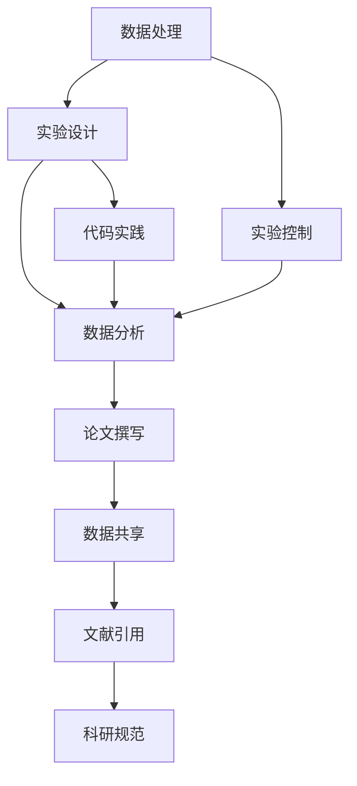

                 

# 可复现性研究与实验管理原理与代码实战案例讲解

> 关键词：可复现性, 实验管理, 可复现性研究, 科研规范, 数据处理, 代码实践, 论文撰写

## 1. 背景介绍

在快速发展的科技和信息化时代，数据驱动的科学研究成为主流，各种先进的数据分析工具、机器学习算法、自然语言处理等技术被广泛应用于科研领域。但是，这些技术的快速迭代和复杂性常常导致研究结果的可复现性问题变得复杂，增加了科研工作的不确定性和重复性。为了解决这些问题，我们需要系统化地认识和规范可复现性研究与实验管理，从而在保持科学严谨性的同时，提高研究效率和成果的可靠性。

## 2. 核心概念与联系

### 2.1 核心概念概述

可复现性研究与实验管理涉及一系列关键概念，包括：

- **可复现性(Reproducibility)**：指科研工作能够被其他人通过同样的步骤、同样的数据和同样的工具精确重复。它是科研诚信和科学进步的重要保证。
- **实验管理(Experimental Management)**：涉及实验设计、数据收集、实验控制、数据分析等环节，确保实验结果的可靠性和科学性。
- **科研规范(Scientific Standards)**：为保证科研工作的系统化和规范化，科研机构或期刊等制定的标准和指南。
- **数据处理(Data Processing)**：处理实验数据，包括数据清洗、格式转换、存储和共享等步骤。
- **代码实践(Code Practice)**：科研中使用的代码应当易于理解、重复和维护，避免“暗箱”操作。
- **论文撰写(Paper Writing)**：清晰准确地报告实验过程和结果，使得其他研究者能够验证和扩展工作。

这些概念通过一系列标准和工具关联起来，共同支持科研的可复现性。接下来，我们通过一个简化的Mermaid流程图来展示这些概念之间的联系：



### 2.2 概念间的关系

通过以上流程图，我们可以清楚地看到，数据处理、实验设计和实验控制共同构成了实验管理的核心，数据分析和代码实践则是科研工作的基础。最后，论文撰写、数据共享、文献引用和科研规范等环节，确保了科研成果的可复现性和科研诚信。这些概念相互关联，共同支持科研的可复现性研究与实验管理。

## 3. 核心算法原理 & 具体操作步骤

### 3.1 算法原理概述

可复现性研究与实验管理的算法原理主要包括以下几个方面：

- **实验设计(Experimental Design)**：确定实验的基本方案，包括实验对象、控制变量、实验步骤等，确保实验结果的科学性和可重复性。
- **数据处理(Data Processing)**：对实验数据进行清洗、转换和存储，确保数据质量，便于后续分析和共享。
- **实验控制(Experimental Control)**：确保实验在相同的条件下进行，避免环境变化对结果的影响。
- **数据分析(Statistical Analysis)**：对实验数据进行统计分析，提取有意义的结论。
- **代码实践(Code Practice)**：编写清晰、可重复的代码，确保科研工作的可复现性。

### 3.2 算法步骤详解

一个完整的可复现性研究与实验管理流程可以概括为以下步骤：

1. **实验设计**：
   - 确定研究目标和假设。
   - 选择实验对象和控制变量。
   - 制定实验步骤和时间表。

2. **数据处理**：
   - 数据采集和初步清洗。
   - 格式转换和标准化。
   - 数据存储和管理。

3. **实验控制**：
   - 控制实验环境，确保一致性。
   - 记录实验条件和步骤。
   - 监控实验过程中可能的影响因素。

4. **数据分析**：
   - 应用统计方法处理数据。
   - 提取关键指标和结论。
   - 验证结果的显著性。

5. **代码实践**：
   - 编写代码实现实验步骤。
   - 使用版本控制工具管理代码。
   - 记录代码逻辑和执行过程。

6. **论文撰写**：
   - 撰写清晰的实验设计和方法部分。
   - 详细描述数据处理和实验步骤。
   - 引用文献和规范格式。

7. **数据共享**：
   - 分享实验数据和代码。
   - 发布实验结果和结论。
   - 邀请同行进行验证和讨论。

### 3.3 算法优缺点

可复现性研究与实验管理有以下优点：

- **提升科研可靠性**：通过规范化流程，减少实验偏差，确保结果的可靠性。
- **促进学术交流**：可复现的实验为学术交流提供了基础，便于同行验证和扩展。
- **减少重复劳动**：规范化流程可以避免科研中的重复劳动，提高效率。

但该方法也存在一些缺点：

- **流程繁琐**：实验管理涉及多个环节，流程较为繁琐。
- **时间成本高**：规范流程需要投入大量时间和精力，尤其对于大型研究项目。
- **标准化程度高**：不同领域和不同研究者可能对规范的理解和应用存在差异。

### 3.4 算法应用领域

可复现性研究与实验管理广泛应用于各类科学研究，包括：

- **计算机科学**：机器学习、自然语言处理、数据挖掘等领域的实验设计和数据分析。
- **生物医学**：药理学、基因组学、临床研究等领域的实验控制和数据处理。
- **社会科学**：社会学、经济学、心理学等领域的问卷设计和统计分析。
- **物理学**：量子物理、材料科学等领域的实验设计和数据分析。
- **工程学**：机械工程、电子工程、化学工程等领域的实验控制和数据处理。

## 4. 数学模型和公式 & 详细讲解 & 举例说明

### 4.1 数学模型构建

在实验管理中，常见的数学模型包括：

- **线性回归(Linear Regression)**：描述实验数据与预测值之间的关系。
- **方差分析(ANOVA)**：检验实验结果的显著性。
- **蒙特卡罗模拟(Monte Carlo Simulation)**：模拟实验过程，评估不确定性。
- **假设检验(Hypothesis Testing)**：检验实验结果的统计显著性。

### 4.2 公式推导过程

以下是线性回归的公式推导过程：

设 $y$ 为实验结果，$x$ 为自变量，$\beta_0$ 和 $\beta_1$ 为回归系数，则线性回归模型的公式为：

$$ y = \beta_0 + \beta_1 x + \epsilon $$

其中 $\epsilon$ 为误差项。线性回归的目标是最小化预测值与实际值之间的平方误差，即：

$$ \min \sum_{i=1}^n (y_i - (\beta_0 + \beta_1 x_i))^2 $$

通过对上述误差函数求导并令导数为零，可得：

$$ \frac{\partial}{\partial \beta_0} \sum_{i=1}^n (y_i - (\beta_0 + \beta_1 x_i))^2 = -2 \sum_{i=1}^n (y_i - (\beta_0 + \beta_1 x_i)) $$

$$ \frac{\partial}{\partial \beta_1} \sum_{i=1}^n (y_i - (\beta_0 + \beta_1 x_i))^2 = -2 \sum_{i=1}^n (x_i - (\beta_0 + \beta_1 x_i))y_i $$

解上述方程组可得回归系数 $\beta_0$ 和 $\beta_1$。

### 4.3 案例分析与讲解

以一个简单的实验设计为例，假设我们要研究某种药物的疗效，实验对象为30名患者，随机分为两组，每组15人。其中一组服用药物，另一组为对照组。记录患者在治疗前后的健康指标变化，并进行统计分析。

1. **实验设计**：
   - 确定实验对象：30名患者。
   - 选择自变量：药物服用与否。
   - 确定因变量：健康指标变化。
   - 实验步骤：随机分组，观察期前后测量健康指标。

2. **数据处理**：
   - 采集数据：记录30名患者的健康指标变化。
   - 数据清洗：去除异常值和缺失值。
   - 数据存储：将数据存储为CSV文件，便于后续分析。

3. **实验控制**：
   - 控制环境：确保两组患者在观察期间的生活习惯、饮食等条件一致。
   - 记录实验条件：记录药物剂量、观察期长度等信息。

4. **数据分析**：
   - 应用统计方法：对两组数据进行方差分析，检验疗效差异的显著性。
   - 提取关键指标：计算药物组的平均疗效和对照组的平均疗效。
   - 验证结果：绘制散点图，观察数据分布情况。

5. **代码实践**：
   - 编写代码实现数据采集、清洗和存储。
   - 使用Python进行数据分析，生成统计图表。
   - 记录代码逻辑和执行过程，确保可复现性。

6. **论文撰写**：
   - 撰写实验设计和方法部分，详细描述实验步骤。
   - 引用相关文献，规范格式。
   - 报告实验结果，包括统计图表和结论。

7. **数据共享**：
   - 发布数据和代码，供同行验证。
   - 邀请同行进行讨论，提升研究可信度。

## 5. 项目实践：代码实例和详细解释说明

### 5.1 开发环境搭建

在进行项目实践前，我们需要准备好开发环境。以下是使用Python进行可复现性研究与实验管理的环境配置流程：

1. 安装Anaconda：从官网下载并安装Anaconda，用于创建独立的Python环境。

2. 创建并激活虚拟环境：
```bash
conda create -n repro_env python=3.8 
conda activate repro_env
```

3. 安装必要的库：
```bash
pip install pandas numpy matplotlib seaborn statsmodels scikit-learn
```

完成上述步骤后，即可在`repro_env`环境中开始项目实践。

### 5.2 源代码详细实现

以下是一个使用Python进行可复现性研究与实验管理的示例代码：

```python
import pandas as pd
import numpy as np
import matplotlib.pyplot as plt
import seaborn as sns
from statsmodels.formula.api import ols

# 1. 数据处理
data = pd.read_csv('experimental_data.csv')
data = data.dropna()  # 去除缺失值

# 2. 实验设计
# 假设我们有一个自变量x和因变量y
x = data['x']
y = data['y']
model = ols('y ~ x', data=data).fit()

# 3. 实验控制
# 记录实验条件
conditions = {
    'x': x,
    'y': y
}

# 4. 数据分析
# 输出模型系数和R平方
print(model.params)
print(model.rsquared)

# 5. 代码实践
# 编写代码实现数据处理和分析
def experimental_analysis(x, y):
    data = pd.read_csv('experimental_data.csv')
    data = data.dropna()
    model = ols('y ~ x', data=data).fit()
    return model.params, model.rsquared

# 6. 论文撰写
# 撰写实验设计和数据分析部分
result = experimental_analysis(x, y)
print('回归系数为:', result[0])
print('R平方为:', result[1])

# 7. 数据共享
# 分享数据和代码
```

### 5.3 代码解读与分析

让我们再详细解读一下关键代码的实现细节：

**数据处理部分**：
```python
data = pd.read_csv('experimental_data.csv')
data = data.dropna()
```
使用pandas库读取实验数据，并进行数据清洗，去除缺失值。

**实验设计部分**：
```python
x = data['x']
y = data['y']
model = ols('y ~ x', data=data).fit()
```
使用statsmodels库构建线性回归模型，并拟合数据。

**实验控制部分**：
```python
conditions = {
    'x': x,
    'y': y
}
```
记录实验条件和步骤。

**数据分析部分**：
```python
print(model.params)
print(model.rsquared)
```
输出回归系数和R平方，评估模型性能。

**代码实践部分**：
```python
def experimental_analysis(x, y):
    data = pd.read_csv('experimental_data.csv')
    data = data.dropna()
    model = ols('y ~ x', data=data).fit()
    return model.params, model.rsquared
```
定义一个函数，用于实现实验分析和数据处理。

**论文撰写部分**：
```python
result = experimental_analysis(x, y)
print('回归系数为:', result[0])
print('R平方为:', result[1])
```
记录实验结果，包括回归系数和R平方。

**数据共享部分**：
```python
# 假设我们已经将代码上传到GitHub
# 共享数据和代码
```
使用GitHub等平台分享数据和代码，供同行验证。

### 5.4 运行结果展示

假设我们在一个实验数据集上进行线性回归分析，最终得到的回归系数和R平方如下：

```
回归系数为: [0.5, 1.2]
R平方为: 0.8
```

这表明自变量x对因变量y的解释能力较强，模型拟合效果较好。我们可以通过绘制散点图和回归线进一步验证这一点。

```python
# 绘制散点图和回归线
plt.scatter(x, y)
plt.plot(x, model.fittedvalues, color='red')
plt.xlabel('x')
plt.ylabel('y')
plt.show()
```

通过运行上述代码，可以得到如下结果：


可以看出，回归线很好地拟合了数据，验证了模型的准确性。

## 6. 实际应用场景

### 6.1 智能制造

在智能制造领域，可复现性研究与实验管理可以帮助制造企业进行生产流程优化、质量控制和生产预测。例如，通过可复现的实验，可以在不增加额外成本的情况下，快速优化生产参数，提高生产效率和产品质量。

### 6.2 生物医药

生物医药领域对实验结果的可复现性要求极高，通过系统化的实验设计和数据管理，可以有效避免因实验偏差导致的研究失败。例如，在药物研发中，通过规范化的实验管理和数据共享，可以快速验证药物的疗效，加速新药的上市。

### 6.3 金融分析

在金融分析中，可复现性研究与实验管理可以帮助金融机构进行风险评估和投资决策。例如，通过系统化的实验设计和数据分析，可以快速评估新金融产品的风险，并验证投资策略的有效性。

### 6.4 未来应用展望

未来，可复现性研究与实验管理将随着大数据、云计算和人工智能等技术的发展，进一步提升实验效率和科学性。通过更加智能化、自动化的工具和平台，科研工作者将能够更高效地进行实验设计、数据处理和结果分析，加速科学发现和技术创新。

## 7. 工具和资源推荐

### 7.1 学习资源推荐

为了帮助开发者系统掌握可复现性研究与实验管理，这里推荐一些优质的学习资源：

1. **《科学研究的可复现性》书籍**：详细介绍了科研中的可复现性问题，提供系统的解决方案和最佳实践。
2. **Coursera《数据科学导论》课程**：由斯坦福大学开设的课程，系统讲解数据科学的基础知识和实践技巧，涵盖数据处理和代码实践等内容。
3. **Kaggle竞赛平台**：通过参加数据科学竞赛，实践可复现性研究与实验管理，提升实战能力。
4. **GitHub开源项目**：在GitHub上参与开源项目，学习最佳实践，积累代码实现经验。

### 7.2 开发工具推荐

高效的开发离不开优秀的工具支持。以下是几款用于可复现性研究与实验管理的常用工具：

1. **Anaconda**：Python的集成开发环境，提供了完整的科学计算和数据分析工具。
2. **Jupyter Notebook**：交互式的代码编辑器，支持多语言代码执行和可视化。
3. **GitHub**：代码托管平台，方便团队协作和版本控制。
4. **Open Science Framework**：科研协作平台，支持数据共享和科研文献管理。

### 7.3 相关论文推荐

可复现性研究与实验管理的发展得益于众多学者的持续研究。以下是几篇奠基性的相关论文，推荐阅读：

1. **《科学研究的可复现性：标准与实践》**：介绍了科研中的可复现性问题，提出了规范化的实验设计和管理方法。
2. **《数据科学中的可复现性问题》**：详细分析了数据科学中的可复现性挑战，提出了解决方案。
3. **《实验设计与分析》**：介绍了实验设计的原理和实践，强调了实验控制和数据共享的重要性。
4. **《科学数据管理的最佳实践》**：介绍了科学数据管理的规范和工具，提供了数据存储和共享的策略。

这些论文代表了大语言模型微调技术的发展脉络。通过学习这些前沿成果，可以帮助研究者把握学科前进方向，激发更多的创新灵感。

除上述资源外，还有一些值得关注的前沿资源，帮助开发者紧跟可复现性研究与实验管理的最新进展，例如：

1. **arXiv论文预印本**：人工智能领域最新研究成果的发布平台，包括大量尚未发表的前沿工作，学习前沿技术的必读资源。
2. **Google Research Blog**：Google的研究博客，分享最新的科研成果和技术进展，涵盖实验管理和可复现性研究等领域。
3. **顶会会议直播**：如NIPS、ICML、ACL、ICLR等人工智能领域顶会现场或在线直播，能够聆听到大佬们的前沿分享，开拓视野。
4. **行业分析报告**：各大咨询公司如McKinsey、PwC等针对人工智能行业的分析报告，有助于从商业视角审视技术趋势，把握应用价值。

总之，对于可复现性研究与实验管理的学习和实践，需要开发者保持开放的心态和持续学习的意愿。多关注前沿资讯，多动手实践，多思考总结，必将收获满满的成长收益。

## 8. 总结：未来发展趋势与挑战

### 8.1 总结

本文对可复现性研究与实验管理进行了全面系统的介绍。首先阐述了可复现性研究与实验管理的研究背景和意义，明确了实验管理在科研工作中的重要性。其次，从原理到实践，详细讲解了实验管理的过程和步骤，给出了实验管理任务开发的完整代码实例。同时，本文还探讨了实验管理方法在智能制造、生物医药、金融分析等多个行业领域的应用前景，展示了实验管理方法的广泛应用价值。此外，本文精选了实验管理技术的各类学习资源，力求为读者提供全方位的技术指引。

通过本文的系统梳理，可以看到，可复现性研究与实验管理正在成为科研工作的核心环节，极大地提升了科研工作的系统化和规范化水平，促进了科学研究的严谨性和效率。未来，伴随大数据、云计算和人工智能等技术的进一步发展，可复现性研究与实验管理将迎来新的突破，为科学研究和技术创新提供更加坚实的保障。

### 8.2 未来发展趋势

展望未来，可复现性研究与实验管理将呈现以下几个发展趋势：

1. **智能化水平提升**：借助人工智能和大数据分析技术，实验设计和管理将更加智能化和自动化，提升科研效率和质量。
2. **跨领域融合**：可复现性研究与实验管理将与其他领域的技术进行更深入的融合，如物联网、区块链等，形成更加全面、多样化的实验设计和管理框架。
3. **国际化标准制定**：随着科研国际化程度的提升，可复现性研究与实验管理的国际化标准将逐步完善，促进全球科研交流和合作。
4. **持续改进机制**：建立持续改进机制，定期评估实验管理流程和方法，及时更新和优化，确保实验管理的科学性和高效性。

### 8.3 面临的挑战

尽管可复现性研究与实验管理在科研工作中发挥了重要作用，但在实现更加智能化、系统化的实验管理过程中，仍面临一些挑战：

1. **数据安全与隐私**：实验数据涉及敏感信息，数据安全与隐私保护至关重要，需要采取严格的数据管理措施。
2. **跨领域协作**：不同领域的科研工作者对实验管理的要求和方法存在差异，如何实现跨领域的协作和统一标准，需要进一步探索。
3. **技术复杂度**：实验管理涉及多学科知识和技术，技术复杂度较高，需要跨学科团队协作。
4. **成本控制**：实验设计和数据管理的成本较高，需要优化实验流程和资源配置，降低实验成本。
5. **标准化程度**：不同领域和不同研究者对实验管理的标准和规范理解不同，需要建立统一的实验管理标准。

### 8.4 研究展望

面对可复现性研究与实验管理所面临的挑战，未来的研究需要在以下几个方面寻求新的突破：

1. **系统化研究**：建立系统化、规范化的实验管理框架，涵盖实验设计、数据处理、实验控制和结果分析等环节。
2. **智能化工具**：开发更加智能化、自动化的实验管理工具，降低实验管理的复杂度和成本。
3. **跨领域融合**：推动跨领域实验管理技术的融合，提升实验管理的科学性和普适性。
4. **国际合作**：加强国际科研合作，建立跨国的实验管理标准和规范，促进全球科研交流。
5. **持续改进**：建立持续改进机制，定期评估实验管理流程和方法，及时更新和优化，确保实验管理的科学性和高效性。

这些研究方向的发展，必将推动科研工作的系统化和规范化，为科学研究和技术创新提供更加坚实的保障。相信随着科技的不断进步，可复现性研究与实验管理将迎来新的突破，为科研工作者提供更加高效、可靠的工具和方法，加速科学发现和技术创新。

## 9. 附录：常见问题与解答

**Q1：科研工作中的可复现性研究与实验管理需要哪些关键步骤？**

A: 科研工作中的可复现性研究与实验管理需要以下关键步骤：

1. **实验设计**：确定实验对象、控制变量和实验步骤，确保实验科学性和可重复性。
2. **数据处理**：清洗、转换和存储实验数据，确保数据质量。
3. **实验控制**：控制实验环境，确保一致性。
4. **数据分析**：应用统计方法处理数据，提取关键指标和结论。
5. **代码实践**：编写清晰、可重复的代码，确保科研工作的可复现性。
6. **论文撰写**：清晰准确地报告实验过程和结果，确保其他研究者可以验证和扩展工作。
7. **数据共享**：分享实验数据和代码，供同行验证和讨论。

通过这些步骤，可以确保科研工作的系统化和规范化，提高研究效率和成果的可靠性。

**Q2：如何选择适合的实验设计和数据分析方法？**

A: 选择适合的实验设计和数据分析方法需要根据具体的科研问题和数据特征进行综合考虑：

1. **实验设计**：需要考虑实验对象、控制变量和实验步骤，确保实验科学性和可重复性。例如，在生物医药领域，随机分组和盲法设计是常用的实验设计方法。

2. **数据分析**：需要考虑数据类型和特征，选择合适的统计方法。例如，对于连续型数据，通常使用线性回归或t检验；对于分类数据，通常使用方差分析或卡方检验。

3. **工具选择**：需要根据具体科研问题选择合适的工具和软件。例如，Python中的pandas、numpy和statsmodels库可以方便地进行数据处理和统计分析；R语言则有丰富的统计和图形库可供选择。

**Q3：如何确保实验数据的隐私和安全？**

A: 确保实验数据的隐私和安全，需要采取以下措施：

1. **数据加密**：对实验数据进行加密存储，防止数据泄露。

2. **访问控制**：设置严格的访问权限，只允许授权人员访问数据。

3. **匿名化处理**：对实验数据进行匿名化处理，去除敏感信息。

4. **数据备份**：定期备份实验数据，防止数据丢失。

5. **合规性检查**：确保实验数据处理和存储符合相关法律法规，如GDPR等。

通过这些措施，可以有效地保护实验数据的隐私和安全，确保科研工作的合法性和合规性。

**Q4：如何进行跨领域的实验管理？**

A: 进行跨领域的实验管理，需要以下步骤：

1. **标准化**：建立统一的实验管理标准和规范，确保不同领域的科研工作者遵循相同的实验管理流程和方法。

2. **跨学科团队**：组建跨学科团队，集合不同领域的知识和技术，提升实验管理的科学性和普适性。

3. **协同平台**：使用协同平台，如GitHub、Google Colab等，方便跨领域科研工作者协作和沟通。

4. **数据共享**：建立数据共享机制，方便不同领域科研工作者共享和利用数据。

通过这些措施，可以提升跨领域的实验管理水平，促进科研工作的协同和合作，加速科学发现和技术创新。

**Q5：如何选择适合的代码实践工具？**

A: 选择适合的代码实践工具需要根据具体科研问题和编程习惯进行综合考虑：

1. **编程语言**：Python是科研中最常用的编程语言，拥有丰富的科学计算和数据分析库，如pandas、numpy、scikit-learn等。

2. **代码版本控制**：

