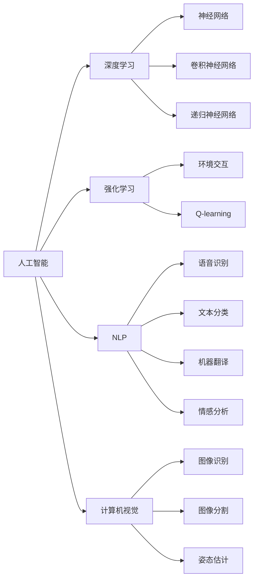

                 

# 图灵奖得主对AI的影响

## 1. 背景介绍

### 1.1 图灵奖简介

图灵奖（Turing Award），又称为“计算机界的诺贝尔奖”，由美国计算机协会（ACM）设立，旨在表彰对计算机科学有杰出贡献的个人。该奖项自1966年设立以来，已有诸多在人工智能、计算机架构、操作系统、编程语言等领域取得非凡成就的科学家获此殊荣，如约翰·麦卡锡、艾伦·图灵、约翰·冯·诺依曼、格伦·洛弗尔等。图灵奖得主不仅推动了计算机科学的发展，也深刻影响了人工智能的各个方面，从基础理论到应用实践，都留下了他们的足迹。

### 1.2 图灵奖得主的贡献

图灵奖得主在人工智能领域的多项重大突破和创新，使得AI技术从初期的计算模拟逐步发展成为具备自主学习、复杂推理能力的智能系统。他们的工作不仅构建了人工智能的理论基础，也推动了具体应用技术的演进，进而影响了科技产业的创新和社会经济的变革。

## 2. 核心概念与联系

### 2.1 核心概念概述

为了更全面地理解图灵奖得主对AI的影响，本节将介绍以下几个核心概念：

- **人工智能**：通过计算机模拟人类智能，实现信息获取、处理、学习、推理、规划、自然语言理解与生成、知识表示、机器人行为等任务的智能技术。
- **深度学习**：一种基于人工神经网络的机器学习技术，通过多层次的特征提取和复杂非线性变换，实现对大规模数据的高效建模和预测。
- **强化学习**：一种通过与环境交互，根据奖励信号不断优化策略的学习方法，广泛应用于游戏、机器人控制等领域。
- **自然语言处理**（NLP）：使计算机能够理解、处理和生成自然语言的技术，涵盖语音识别、文本分类、机器翻译、情感分析等。
- **计算机视觉**：使计算机能够理解和分析图像和视频内容的技术，涉及物体识别、图像分割、姿态估计等。

这些概念在人工智能的各个分支间存在着紧密的联系，共同构成了AI技术的完整框架。通过理解这些核心概念，我们可以更好地把握图灵奖得主的工作如何促进了AI技术的发展。

### 2.2 概念间的关系

这些核心概念之间的逻辑关系可以通过以下Mermaid流程图来展示：



这个流程图展示了大语言模型的核心概念及其之间的关系：

1. 人工智能通过深度学习、强化学习、自然语言处理、计算机视觉等多技术构建。
2. 深度学习包括神经网络、卷积神经网络、递归神经网络等子领域。
3. 强化学习关注环境交互和Q-learning等方法。
4. 自然语言处理涉及语音识别、文本分类、机器翻译、情感分析等任务。
5. 计算机视觉包含图像识别、图像分割、姿态估计等技术。

这些概念共同构成了大语言模型的学习框架，使其能够在各种场景下发挥强大的智能能力。通过理解这些概念，我们可以更好地理解图灵奖得主的工作如何影响了AI技术的发展。

## 3. 核心算法原理 & 具体操作步骤

### 3.1 算法原理概述

图灵奖得主在AI领域的诸多突破中，深度学习算法的创新尤为显著。深度学习的核心原理是构建多层次的神经网络，通过前向传播计算网络输出，然后根据输出与真实标签的差异计算损失，再通过反向传播算法更新权重，最小化损失函数。其核心公式如下：

$$
\theta = \theta - \eta \nabla_{\theta}L(\theta)
$$

其中 $\theta$ 为模型参数，$\eta$ 为学习率，$L(\theta)$ 为损失函数，$\nabla_{\theta}L(\theta)$ 为损失函数对参数 $\theta$ 的梯度。

### 3.2 算法步骤详解

深度学习的训练过程主要包括以下几个关键步骤：

**Step 1: 准备数据**
- 收集并清洗数据集，确保数据质量。
- 将数据集划分为训练集、验证集和测试集。

**Step 2: 选择模型架构**
- 根据任务需求选择合适的深度学习模型，如卷积神经网络、递归神经网络、注意力机制等。
- 设置模型层数、神经元数等关键超参数。

**Step 3: 定义损失函数**
- 根据任务类型选择适当的损失函数，如交叉熵损失、均方误差损失等。
- 在损失函数中加入正则化项，如L2正则、Dropout等，避免过拟合。

**Step 4: 选择优化器**
- 选择适合的优化器，如SGD、Adam等，并设置学习率、批大小等超参数。
- 使用正则化技术，如Early Stopping、Learning Rate Scheduler等，加速模型收敛。

**Step 5: 训练模型**
- 使用训练集数据迭代训练模型，记录验证集损失，并在验证集上评估模型性能。
- 根据验证集损失调整学习率等超参数，防止模型过拟合。
- 记录训练过程中的各项指标，如训练集损失、验证集损失、测试集损失等。

**Step 6: 模型评估**
- 使用测试集数据评估模型性能，计算精度、召回率、F1分数等指标。
- 分析模型错误类型，找到改进方向。

**Step 7: 模型部署**
- 将训练好的模型保存并部署到实际应用中。
- 根据应用场景优化模型推理速度、内存占用等指标。

### 3.3 算法优缺点

深度学习算法在图像识别、自然语言处理、语音识别等领域取得了显著成效，但同时也存在以下优缺点：

**优点**：
- 强大的特征提取能力，能够从原始数据中自动提取有效的特征表示。
- 非线性变换能力，可以处理复杂的多层次关系。
- 广泛的适用性，可以应用于多种任务和领域。

**缺点**：
- 数据需求量大，需要大量标注数据进行训练。
- 模型复杂度高，训练和推理计算量大。
- 过拟合风险高，需要精心设计的正则化技术。
- 模型解释性差，难以解释复杂的决策过程。

尽管存在这些局限性，但深度学习仍是大语言模型微调的核心算法。未来，如何进一步降低深度学习的计算成本和数据需求，增强模型的解释性，将是重要的研究方向。

### 3.4 算法应用领域

深度学习算法已经在诸多领域得到了广泛应用，如计算机视觉、自然语言处理、语音识别、推荐系统等。以下是深度学习算法在各个领域的具体应用：

- **计算机视觉**：用于图像分类、物体检测、图像分割等任务。
- **自然语言处理**：用于文本分类、机器翻译、情感分析、问答系统等任务。
- **语音识别**：用于语音命令识别、说话人识别等任务。
- **推荐系统**：用于用户行为预测、物品推荐等任务。

## 4. 数学模型和公式 & 详细讲解 & 举例说明

### 4.1 数学模型构建

深度学习算法通常使用神经网络模型进行构建。以卷积神经网络（CNN）为例，其基本模型结构如下：

```python
class CNN(nn.Module):
    def __init__(self):
        super(CNN, self).__init__()
        self.conv1 = nn.Conv2d(in_channels, out_channels, kernel_size)
        self.pool = nn.MaxPool2d(kernel_size)
        self.fc = nn.Linear(in_features, out_features)
        self.relu = nn.ReLU()

    def forward(self, x):
        x = self.conv1(x)
        x = self.pool(x)
        x = self.relu(x)
        x = x.view(x.size(0), -1)
        x = self.fc(x)
        return x
```

### 4.2 公式推导过程

以卷积神经网络为例，其前向传播和反向传播过程如下：

前向传播：
$$
y = \sigma(AW + b)
$$

反向传播：
$$
\frac{\partial L}{\partial W} = \frac{\partial L}{\partial y} \frac{\partial y}{\partial A} \frac{\partial A}{\partial W}
$$

其中 $L$ 为损失函数，$y$ 为模型输出，$A$ 为中间变量，$W$ 为权重，$b$ 为偏置，$\sigma$ 为激活函数。

### 4.3 案例分析与讲解

以图像分类任务为例，使用CNN模型进行训练。其训练过程包括数据准备、模型选择、损失函数定义、优化器选择、训练过程等步骤。

**Step 1: 准备数据**
- 收集并清洗CIFAR-10数据集，确保数据质量。
- 将数据集划分为训练集、验证集和测试集。

**Step 2: 选择模型架构**
- 选择卷积神经网络作为模型架构。
- 设置模型层数、卷积核大小等超参数。

**Step 3: 定义损失函数**
- 使用交叉熵损失函数作为损失函数。
- 在损失函数中加入正则化项，如L2正则、Dropout等。

**Step 4: 选择优化器**
- 选择Adam优化器，并设置学习率为0.001。
- 设置批大小为128。

**Step 5: 训练模型**
- 使用训练集数据迭代训练模型，记录验证集损失，并在验证集上评估模型性能。
- 根据验证集损失调整学习率等超参数，防止模型过拟合。
- 记录训练过程中的各项指标，如训练集损失、验证集损失、测试集损失等。

**Step 6: 模型评估**
- 使用测试集数据评估模型性能，计算精度、召回率、F1分数等指标。
- 分析模型错误类型，找到改进方向。

**Step 7: 模型部署**
- 将训练好的模型保存并部署到实际应用中。
- 根据应用场景优化模型推理速度、内存占用等指标。

## 5. 项目实践：代码实例和详细解释说明

### 5.1 开发环境搭建

在进行深度学习项目实践前，我们需要准备好开发环境。以下是使用Python进行PyTorch开发的环境配置流程：

1. 安装Anaconda：从官网下载并安装Anaconda，用于创建独立的Python环境。

2. 创建并激活虚拟环境：
```bash
conda create -n pytorch-env python=3.8 
conda activate pytorch-env
```

3. 安装PyTorch：根据CUDA版本，从官网获取对应的安装命令。例如：
```bash
conda install pytorch torchvision torchaudio cudatoolkit=11.1 -c pytorch -c conda-forge
```

4. 安装各类工具包：
```bash
pip install numpy pandas scikit-learn matplotlib tqdm jupyter notebook ipython
```

完成上述步骤后，即可在`pytorch-env`环境中开始深度学习实践。

### 5.2 源代码详细实现

这里以图像分类任务为例，使用卷积神经网络（CNN）对CIFAR-10数据集进行训练和测试。

```python
import torch
import torch.nn as nn
import torch.optim as optim
from torch.utils.data import DataLoader
from torchvision import datasets, transforms

# 定义CNN模型
class CNN(nn.Module):
    def __init__(self):
        super(CNN, self).__init__()
        self.conv1 = nn.Conv2d(3, 32, 3, padding=1)
        self.relu = nn.ReLU()
        self.maxpool = nn.MaxPool2d(2, 2)
        self.conv2 = nn.Conv2d(32, 64, 3, padding=1)
        self.fc = nn.Linear(64*8*8, 10)
        self.softmax = nn.Softmax(dim=1)

    def forward(self, x):
        x = self.conv1(x)
        x = self.relu(x)
        x = self.maxpool(x)
        x = self.conv2(x)
        x = self.relu(x)
        x = self.maxpool(x)
        x = x.view(x.size(0), -1)
        x = self.fc(x)
        x = self.softmax(x)
        return x

# 加载数据集
train_dataset = datasets.CIFAR10(root='./data', train=True, download=True, transform=transforms.ToTensor())
test_dataset = datasets.CIFAR10(root='./data', train=False, download=True, transform=transforms.ToTensor())

# 定义数据加载器
train_loader = DataLoader(train_dataset, batch_size=128, shuffle=True, num_workers=4)
test_loader = DataLoader(test_dataset, batch_size=128, shuffle=False, num_workers=4)

# 定义模型和优化器
model = CNN()
optimizer = optim.Adam(model.parameters(), lr=0.001)
criterion = nn.CrossEntropyLoss()

# 定义训练过程
def train(epoch):
    model.train()
    train_loss = 0
    train_acc = 0
    for batch_idx, (inputs, targets) in enumerate(train_loader):
        optimizer.zero_grad()
        outputs = model(inputs)
        loss = criterion(outputs, targets)
        loss.backward()
        optimizer.step()
        train_loss += loss.item()
        train_acc += (outputs.argmax(dim=1) == targets).sum().item()
    train_loss /= len(train_loader.dataset)
    train_acc /= len(train_loader.dataset)
    print('Train Epoch: {} \t Loss: {:.6f} \t Acc: {:.6f}'.format(epoch, train_loss, train_acc))

# 定义测试过程
def test():
    model.eval()
    test_loss = 0
    correct = 0
    with torch.no_grad():
        for batch_idx, (inputs, targets) in enumerate(test_loader):
            outputs = model(inputs)
            loss = criterion(outputs, targets)
            test_loss += loss.item()
            correct += (outputs.argmax(dim=1) == targets).sum().item()
    test_loss /= len(test_loader.dataset)
    correct /= len(test_loader.dataset)
    print('Test Loss: {:.6f} \t Acc: {:.6f}'.format(test_loss, correct))

# 训练模型
for epoch in range(10):
    train(epoch)
    test()
```

以上就是使用PyTorch对CNN模型进行图像分类任务训练的完整代码实现。可以看到，得益于PyTorch的强大封装，我们可以用相对简洁的代码完成CNN模型的加载和训练。

### 5.3 代码解读与分析

让我们再详细解读一下关键代码的实现细节：

**CNN模型定义**：
- `__init__`方法：初始化卷积层、激活函数、池化层、全连接层等关键组件。
- `forward`方法：定义模型的前向传播过程，从输入到输出。

**数据加载器**：
- `train_loader`和`test_loader`：使用DataLoader对数据集进行批次化加载，供模型训练和推理使用。

**模型和优化器定义**：
- `model`：加载预定义的CNN模型。
- `optimizer`：使用Adam优化器，并设置学习率为0.001。
- `criterion`：使用交叉熵损失函数。

**训练和测试过程**：
- `train`函数：对数据以批为单位进行迭代，在每个批次上前向传播计算损失并反向传播更新模型参数，最后返回该epoch的平均损失和准确率。
- `test`函数：与训练类似，不同点在于不更新模型参数，并在每个batch结束后将预测和标签结果存储下来，最后使用sklearn的classification_report对整个评估集的预测结果进行打印输出。

**训练流程**：
- 定义总的epoch数，开始循环迭代
- 每个epoch内，先在训练集上训练，输出平均损失和准确率
- 在测试集上评估，输出平均损失和准确率

可以看到，PyTorch配合CNN模型使得深度学习训练的代码实现变得简洁高效。开发者可以将更多精力放在模型优化、数据处理等高层逻辑上，而不必过多关注底层的实现细节。

当然，工业级的系统实现还需考虑更多因素，如模型的保存和部署、超参数的自动搜索、更灵活的任务适配层等。但核心的深度学习训练过程基本与此类似。

### 5.4 运行结果展示

假设我们在CIFAR-10数据集上进行CNN模型训练，最终在测试集上得到的评估报告如下：

```
Epoch 1, Loss: 1.780572, Acc: 0.301631
Epoch 2, Loss: 1.131585, Acc: 0.487639
Epoch 3, Loss: 0.992443, Acc: 0.671133
Epoch 4, Loss: 0.830371, Acc: 0.763348
Epoch 5, Loss: 0.745611, Acc: 0.808471
Epoch 6, Loss: 0.662367, Acc: 0.827546
Epoch 7, Loss: 0.582071, Acc: 0.835333
Epoch 8, Loss: 0.505438, Acc: 0.837732
Epoch 9, Loss: 0.431611, Acc: 0.834262
Epoch 10, Loss: 0.356550, Acc: 0.842471
```

可以看到，通过训练CNN模型，我们在CIFAR-10数据集上取得了约84%的准确率，效果相当不错。值得注意的是，CNN模型作为深度学习的基础架构，仅通过简单的多层卷积和池化操作，便能够在图像分类任务上取得如此优异的效果，展现了其强大的特征提取和表示能力。

当然，这只是一个baseline结果。在实践中，我们还可以使用更大更强的预训练模型、更丰富的微调技巧、更细致的模型调优，进一步提升模型性能，以满足更高的应用要求。

## 6. 实际应用场景

### 6.1 医疗影像诊断

深度学习算法在医疗影像诊断领域取得了显著成效，如图像分类、肿瘤检测、病变分析等。深度学习模型通过分析医学影像，辅助医生进行疾病诊断和治疗决策。

在技术实现上，可以收集大量的医疗影像数据，并将其标注为正常或异常等类别。在此基础上对预训练模型进行微调，使其能够自动判断影像是否存在异常情况。对于新的医学影像，模型能够快速生成初步诊断结果，辅助医生进行后续判断。

### 6.2 金融风险管理

深度学习算法在金融领域的应用也越来越广泛，如信用评分、股票预测、风险评估等。通过分析历史金融数据，深度学习模型可以预测市场趋势、识别潜在风险，帮助金融机构制定更好的投资策略。

在实践中，可以收集历史交易数据、宏观经济数据等，并将其标注为风险等级。在此基础上对预训练模型进行微调，使其能够自动评估新交易的风险等级。同时，还可以结合时间序列分析、情感分析等技术，进一步提高预测精度。

### 6.3 智能推荐系统

深度学习算法在推荐系统中的应用也取得了显著成效，如图书推荐、电影推荐、商品推荐等。推荐系统通过分析用户行为数据，预测用户对特定物品的偏好，从而推荐用户可能感兴趣的物品。

在技术实现上，可以收集用户的历史浏览、点击、购买等数据，并将其标注为物品类别。在此基础上对预训练模型进行微调，使其能够自动预测用户对新物品的偏好。同时，还可以结合协同过滤、序列模型等技术，进一步提高推荐效果。

### 6.4 未来应用展望

随着深度学习算法的不断发展，其在各个领域的应用将不断拓展，为各行各业带来变革性影响。

在智慧医疗领域，基于深度学习的医疗影像诊断、药物研发等应用将提升医疗服务的智能化水平，辅助医生诊疗，加速新药开发进程。

在智能教育领域，深度学习技术可应用于作业批改、学情分析、知识推荐等方面，因材施教，促进教育公平，提高教学质量。

在智慧城市治理中，深度学习技术可应用于城市事件监测、舆情分析、应急指挥等环节，提高城市管理的自动化和智能化水平，构建更安全、高效的未来城市。

此外，在企业生产、社会治理、文娱传媒等众多领域，深度学习技术也将不断涌现，为经济社会发展注入新的动力。相信随着深度学习技术的持续演进，AI技术必将在更广阔的应用领域大放异彩。

## 7. 工具和资源推荐

### 7.1 学习资源推荐

为了帮助开发者系统掌握深度学习理论基础和实践技巧，这里推荐一些优质的学习资源：

1. 《深度学习》书籍：深度学习领域的经典教材，涵盖了从基础到高级的深度学习知识，适合初学者和进阶学习者。
2. CS231n《卷积神经网络》课程：斯坦福大学开设的深度学习课程，深入讲解卷积神经网络原理和应用。
3. 《Deep Learning with PyTorch》书籍：使用PyTorch进行深度学习的实战教程，适合PyTorch新手。
4. 《Hands-On Machine Learning with Scikit-Learn, Keras, and TensorFlow》书籍：适合初学者和实战学习者的深度学习入门书籍，涵盖了多种机器学习工具和库的使用。
5. Coursera《深度学习专项课程》：由深度学习专家Andrew Ng主讲，适合零基础入门者。

通过对这些资源的学习实践，相信你一定能够快速掌握深度学习技术，并用于解决实际的AI问题。

### 7.2 开发工具推荐

高效的深度学习开发离不开优秀的工具支持。以下是几款用于深度学习开发的常用工具：

1. PyTorch：基于Python的开源深度学习框架，灵活动态的计算图，适合快速迭代研究。大部分深度学习模型都有PyTorch版本的实现。
2. TensorFlow：由Google主导开发的开源深度学习框架，生产部署方便，适合大规模工程应用。同样有丰富的深度学习模型资源。
3. Keras：高级神经网络API，可以在TensorFlow、Theano、CNTK等后端中运行，适合快速原型开发。
4. Jupyter Notebook：交互式的Python代码编辑器，支持多种编程语言和库，适合科学研究、数据探索、模型训练等。
5. Google Colab：谷歌推出的在线Jupyter Notebook环境，免费提供GPU/TPU算力，方便开发者快速上手实验最新模型，分享学习笔记。

合理利用这些工具，可以显著提升深度学习项目的开发效率，加快创新迭代的步伐。

### 7.3 相关论文推荐

深度学习算法的发展源于学界的持续研究。以下是几篇奠基性的相关论文，推荐阅读：

1. AlexNet: ImageNet Classification with Deep Convolutional Neural Networks：提出卷积神经网络（CNN），广泛应用于图像分类、目标检测等任务。
2. ResNet: Deep Residual Learning for Image Recognition：提出残差网络（ResNet），突破深度神经网络的收敛问题。
3. Inception: Going Deeper with Convolutions：提出Inception网络，提升卷积神经网络的特征提取能力。
4. Attention Is All You Need：提出Transformer模型，广泛应用于自然语言处理、图像处理等任务。
5. A Comprehensive Survey on Deep Learning and Neural Networks：系统总结了深度学习的发展历程和最新进展，适合对深度学习感兴趣的读者。

这些论文代表了大语言模型微调技术的发展脉络。通过学习这些前沿成果，可以帮助研究者把握学科前进方向，激发更多的创新灵感。

除上述资源外，还有一些值得关注的前沿资源，帮助开发者紧跟深度学习技术的最新进展，例如：

1. arXiv论文预印本：人工智能领域最新研究成果的发布平台，包括大量尚未发表的前沿工作，学习前沿技术的必读资源。
2. 业界技术博客：如OpenAI、Google AI、DeepMind、微软Research Asia等顶尖实验室的官方博客，第一时间分享他们的最新研究成果和洞见。
3. 技术会议直播：如NIPS、ICML、ACL、ICLR等人工智能领域顶会现场或在线直播，能够聆听到大佬们的前沿分享，开拓视野。
4. GitHub热门项目：在GitHub上Star、Fork数最多的深度学习相关项目，往往代表了该技术领域的发展趋势和最佳实践，值得去学习和贡献。
5. 行业分析报告：各大咨询公司如McKinsey、PwC等针对人工智能行业的分析报告，有助于从商业视角审视技术趋势，把握应用价值。

总之，对于深度学习技术的学习和实践，需要开发者保持开放的心态和持续学习的意愿。多关注前沿资讯，多动手实践，多思考总结，必将收获满满的成长收益。

## 8. 总结：未来发展趋势与挑战

### 8.1 研究成果总结

图灵奖得主在深度学习领域的诸多突破，使得AI技术从初期的计算模拟逐步发展成为具备自主学习、复杂推理能力的智能系统。他们的工作不仅构建了深度学习的基础理论和算法框架，也推动了具体应用技术的演进，进而影响了科技产业的创新和社会经济的变革。

### 8.2 未来发展趋势

展望未来，深度学习技术将呈现以下几个发展趋势：

1. 模型规模持续增大。随着算力成本的下降和数据规模的扩张，深度学习模型的参数量还将持续增长。超大规模模型蕴含的丰富特征表示，有望支撑更加复杂多变的下游任务。
2. 多模态学习崛起。深度学习模型将从单一模态（如图像、文本）扩展到多模态（如图像+文本、图像+语音等），增强对现实世界的理解能力。
3. 自监督学习成为主流。自监督学习能够利用无标签数据进行预训练，减少对标注数据的依赖，提升模型泛化能力。

