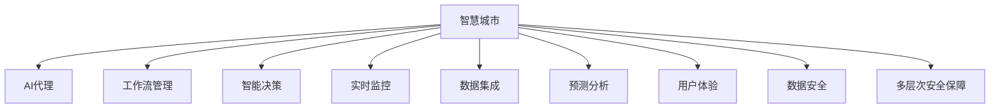

                 

# 在智慧城市中部署AI代理的工作流与应用

> 关键词：
智慧城市, AI代理, 工作流管理, 智能决策, 城市运营, 实时监控, 数据集成, 预测分析, 用户体验, 数据安全, 多层次安全保障

## 1. 背景介绍

### 1.1 问题由来
智慧城市建设正迅速推进，如何高效、安全地集成各类AI应用，成为城市管理中的重要议题。AI代理（AI Agents）作为智能系统中关键的执行者，在交通管理、公共安全、能源调度、环境监测等城市运营核心环节扮演着重要角色。部署AI代理，不仅需要解决模型训练、模型推理、数据管理等多方面的技术问题，还要确保系统具备高效性、鲁棒性、可解释性等关键能力。

### 1.2 问题核心关键点
AI代理在智慧城市中部署的应用，涉及以下几个核心关键点：
1. **模型选择**：选择合适的AI代理模型，以适配智慧城市的各类应用场景。
2. **数据处理**：有效处理来自城市运营各领域的数据，提取关键特征。
3. **工作流设计**：设计合理的工作流，确保AI代理的逻辑推理和行为控制。
4. **决策支持**：构建决策支持系统，提升AI代理的智能决策能力。
5. **安全性与隐私保护**：确保AI代理的运行安全，避免数据泄露和滥用。
6. **用户体验优化**：提升用户与AI代理的交互体验，使AI代理更易被接受和应用。

### 1.3 问题研究意义
研究AI代理在智慧城市中部署的工作流与具体应用，对于推动智慧城市建设和提高城市管理效率具有重要意义：

1. **提升城市管理效率**：通过自动化决策和智能执行，减少人工操作，提高城市运行效率。
2. **改善公共服务质量**：AI代理能够处理大量数据，提供个性化服务，提升市民满意度。
3. **促进资源优化配置**：通过AI代理的优化调度，实现资源的最优配置。
4. **强化城市应急响应**：在突发事件中，AI代理能快速响应，提供精准决策支持。
5. **推动AI技术落地**：为AI技术在实际场景中的应用提供范例，促进技术产业化。

## 2. 核心概念与联系

### 2.1 核心概念概述

为更好地理解AI代理在智慧城市中部署的原理与实践，本节将介绍几个核心概念：

- **智慧城市**：以信息、通信、网络等技术为支撑，通过物联网、云计算等手段，实现城市运行管理的智能化。
- **AI代理**：代表智能系统中的决策执行者，能够自主学习和推理，自动执行任务。
- **工作流管理**：通过定义、执行、监控和优化业务流程，实现智能系统的自动化运行。
- **智能决策**：结合数据分析、机器学习等技术，提升AI代理的决策能力。
- **实时监控**：通过传感器、监控设备等获取数据，实现对城市运行状态的实时感知和评估。
- **数据集成**：将来自不同来源、格式的数据整合在一起，形成统一的数据湖，为AI代理提供支持。
- **预测分析**：利用AI代理的预测模型，对未来趋势进行预测，辅助决策制定。
- **用户体验**：提升AI代理与用户交互的流畅性和个性化程度，增强用户满意度。
- **数据安全**：确保城市运营数据的安全性，防止数据泄露和滥用。
- **多层次安全保障**：构建安全防护体系，从基础设施、数据传输、用户隐私等多个层面提供保障。

这些核心概念之间存在着紧密的联系，共同构成了AI代理在智慧城市中部署的完整生态系统。

### 2.2 概念间的关系

这些核心概念之间存在着紧密的联系，形成了AI代理部署的完整生态系统。



这个流程图展示了几大核心概念之间的联系：

1. **智慧城市**：提供基础设施和数据支持。
2. **AI代理**：执行智能决策和任务。
3. **工作流管理**：定义和优化业务流程。
4. **智能决策**：提升AI代理的决策能力。
5. **实时监控**：感知城市运行状态。
6. **数据集成**：整合不同来源的数据。
7. **预测分析**：预测未来趋势。
8. **用户体验**：提升用户交互体验。
9. **数据安全**：确保数据安全。
10. **多层次安全保障**：提供全面的安全防护。

这些概念共同构成了AI代理部署的完整系统，帮助智慧城市实现自动化、智能化运营。

## 3. 核心算法原理 & 具体操作步骤
### 3.1 算法原理概述

AI代理在智慧城市中的部署，涉及模型训练、推理、任务执行等多方面技术。核心算法原理主要包括以下几个方面：

- **模型选择**：根据智慧城市的具体需求，选择合适的AI代理模型，如基于强化学习的控制策略，基于深度学习的感知模型等。
- **数据处理**：通过数据清洗、特征提取、数据增强等技术，处理城市运营中的各类数据。
- **工作流设计**：设计合理的工作流，确保AI代理任务的逻辑推理和行为控制。
- **决策支持**：构建决策支持系统，结合数据分析、机器学习等技术，提升AI代理的决策能力。
- **安全性与隐私保护**：设计多层次的安全防护机制，确保数据和模型的安全性。
- **用户体验优化**：提升用户与AI代理的交互体验，增强用户满意度。

### 3.2 算法步骤详解

AI代理在智慧城市中部署的核心算法步骤主要包括以下几个方面：

**Step 1: 数据准备**
1. **数据收集**：从交通监控、环境监测、能源调度等城市运营领域收集数据，包括文本、图像、视频、传感器数据等。
2. **数据预处理**：进行数据清洗、去噪、标准化等预处理操作，提取关键特征。
3. **数据标注**：对部分数据进行标注，如交通流量、环境质量、能源消耗等指标。

**Step 2: 模型训练**
1. **模型选择**：根据需求选择合适的AI代理模型，如强化学习模型、深度学习模型等。
2. **模型训练**：使用标注数据对AI代理模型进行训练，优化模型参数。
3. **验证与调参**：在验证集上评估模型性能，调整超参数，确保模型泛化性能。

**Step 3: 工作流设计**
1. **流程定义**：定义AI代理的执行流程，明确任务输入、处理逻辑、输出结果。
2. **行为控制**：设计行为控制策略，确保AI代理在多任务场景下的行为稳定性。
3. **任务调度**：使用工作流引擎，实现任务自动化调度。

**Step 4: 决策支持**
1. **特征提取**：使用特征提取算法，从城市运营数据中提取关键信息。
2. **模型训练**：结合数据分析和机器学习技术，训练预测模型，提升决策支持能力。
3. **结果应用**：将预测结果应用于AI代理的决策过程，实现智能执行。

**Step 5: 安全性与隐私保护**
1. **安全设计**：设计多层次的安全防护机制，确保数据传输、存储和使用的安全性。
2. **隐私保护**：采用数据匿名化、差分隐私等技术，保护用户隐私。
3. **入侵检测**：部署入侵检测系统，及时发现并应对安全威胁。

**Step 6: 用户体验优化**
1. **交互设计**：设计简洁、易用的用户界面，提升用户体验。
2. **个性化服务**：根据用户历史行为和偏好，提供个性化服务。
3. **反馈机制**：建立用户反馈机制，收集用户意见，不断优化AI代理功能。

### 3.3 算法优缺点

AI代理在智慧城市中部署的算法具有以下优点：

1. **高效性**：AI代理能够自动化执行任务，提高城市运营效率。
2. **灵活性**：可以根据需求调整工作流程和决策策略，适应不同的应用场景。
3. **自适应性**：具备学习和适应新数据的能力，持续提升性能。
4. **决策支持**：结合预测分析和智能决策技术，提升决策准确性。
5. **安全性**：具备多层次的安全防护机制，确保数据和模型的安全。

同时，AI代理算法也存在一些缺点：

1. **数据依赖性**：对高质量、大量标注数据的需求较高，数据不足时性能可能受限。
2. **复杂度**：设计和实现复杂，需要综合考虑多方面因素。
3. **解释性不足**：AI代理的决策过程往往缺乏可解释性，难以进行调试和优化。
4. **资源消耗**：在大规模数据和模型推理下，可能存在较高的资源消耗。

### 3.4 算法应用领域

AI代理在智慧城市中的应用领域非常广泛，主要包括：

- **交通管理**：通过AI代理进行交通流量预测、信号优化、事故处理等。
- **公共安全**：在监控视频中识别异常行为，辅助应急响应。
- **能源调度**：优化能源分配，实现能效最大化。
- **环境监测**：监测环境质量，预测污染趋势，辅助决策。
- **应急响应**：在突发事件中，快速响应并提供精准决策支持。
- **市民服务**：提供智能客服、智能导览、智能推荐等服务。
- **城市规划**：辅助城市规划和建设，提升城市发展质量。

## 4. 数学模型和公式 & 详细讲解 & 举例说明
### 4.1 数学模型构建

在智慧城市中部署AI代理，涉及多个数学模型和公式。以交通流量预测为例，构建模型并进行推理计算。

假设交通流量数据为 $D=\{x_1, x_2, ..., x_N\}$，其中 $x_i = (t_i, v_i)$ 表示第 $i$ 次交通数据的记录时间 $t_i$ 和速度 $v_i$。

**模型定义**：
1. **线性回归模型**：使用线性回归模型 $y=f(x)=\beta_0+\beta_1x_1+\beta_2x_2+...+\beta_px_p$ 进行流量预测，其中 $\beta$ 为回归系数，$x_1, x_2, ..., x_p$ 为模型输入特征。
2. **多元线性回归模型**：考虑多种影响因素，如天气、时间、季节等，构建多元线性回归模型 $y=f(x)=\beta_0+\beta_1x_1+\beta_2x_2+...+\beta_px_p+\epsilon$，其中 $\epsilon$ 为随机误差项。

**公式推导过程**：
1. **线性回归**：
   - **样本均值计算**：$\overline{x} = \frac{1}{N}\sum_{i=1}^N x_i$，$\overline{y} = \frac{1}{N}\sum_{i=1}^N y_i$
   - **最小二乘求解**：$\hat{\beta} = (X^TX)^{-1}X^Ty$，其中 $X=[1, x_1, x_2, ..., x_p]$ 为特征矩阵。
2. **多元线性回归**：
   - **样本均值计算**：$\overline{x} = \frac{1}{N}\sum_{i=1}^N x_i$，$\overline{y} = \frac{1}{N}\sum_{i=1}^N y_i$
   - **最小二乘求解**：$\hat{\beta} = (X^TX)^{-1}X^Ty$，其中 $X=[1, x_1, x_2, ..., x_p]$ 为特征矩阵。

**案例分析与讲解**：
以北京市交通流量预测为例，使用线性回归模型对交通流量进行预测。假设输入特征包括时间、日期、天气、交通需求等，输出为预测的交通流量。使用历史数据进行训练，得到回归系数 $\hat{\beta}$，然后对未来时间点进行流量预测。

$$
\hat{y} = f(x) = \hat{\beta}_0 + \hat{\beta}_1 t + \hat{\beta}_2 d + \hat{\beta}_3 w + \hat{\beta}_4 d + \hat{\beta}_5 n
$$

其中 $t$ 表示时间，$d$ 表示日期，$w$ 表示天气，$n$ 表示交通需求。

### 4.2 公式推导过程

以线性回归模型的最小二乘求解为例，进行详细推导：

设样本量为 $N$，输入向量为 $X=[1, x_1, x_2, ..., x_p]$，输出向量为 $Y=[y_1, y_2, ..., y_N]$。最小二乘求解回归系数 $\hat{\beta}$ 的公式为：

$$
\hat{\beta} = (X^TX)^{-1}X^TY
$$

其中 $X^TX$ 为协方差矩阵，$X^TY$ 为协方差向量。最小二乘法通过最小化预测误差平方和，使得模型参数 $\hat{\beta}$ 逼近真实参数 $\beta$。

### 4.3 案例分析与讲解

以北京市交通流量预测为例，假设历史交通流量数据为 $D=\{x_1, x_2, ..., x_N\}$，其中 $x_i = (t_i, v_i)$。使用线性回归模型进行流量预测，假设回归模型为 $y=f(x)=\beta_0+\beta_1x_1+\beta_2x_2+...+\beta_px_p$。

**数据准备**：
1. **数据收集**：从交通监控系统收集历史交通流量数据。
2. **数据预处理**：对数据进行清洗、去噪、标准化等预处理操作，提取关键特征。
3. **数据标注**：对部分数据进行标注，如交通流量、天气、日期等。

**模型训练**：
1. **特征提取**：提取时间、日期、天气、交通需求等关键特征，构成输入向量 $X$。
2. **回归系数求解**：使用最小二乘法求解回归系数 $\hat{\beta}$。
3. **模型验证**：在验证集上评估模型性能，调整超参数。

**结果应用**：
1. **流量预测**：使用模型对未来时间点的交通流量进行预测。
2. **决策支持**：结合预测结果，辅助交通管理部门的决策制定。

## 5. 项目实践：代码实例和详细解释说明
### 5.1 开发环境搭建

在进行AI代理部署实践前，我们需要准备好开发环境。以下是使用Python进行PyTorch开发的环境配置流程：

1. 安装Anaconda：从官网下载并安装Anaconda，用于创建独立的Python环境。

2. 创建并激活虚拟环境：
```bash
conda create -n pytorch-env python=3.8 
conda activate pytorch-env
```

3. 安装PyTorch：根据CUDA版本，从官网获取对应的安装命令。例如：
```bash
conda install pytorch torchvision torchaudio cudatoolkit=11.1 -c pytorch -c conda-forge
```

4. 安装Transformers库：
```bash
pip install transformers
```

5. 安装各类工具包：
```bash
pip install numpy pandas scikit-learn matplotlib tqdm jupyter notebook ipython
```

完成上述步骤后，即可在`pytorch-env`环境中开始部署实践。

### 5.2 源代码详细实现

这里以交通流量预测为例，使用Python和PyTorch对AI代理模型进行实现。

```python
import torch
import torch.nn as nn
import torch.optim as optim
from sklearn.linear_model import LinearRegression
from sklearn.metrics import mean_squared_error

# 数据处理
class TrafficDataLoader:
    def __init__(self, data, batch_size=32, shuffle=True):
        self.data = data
        self.batch_size = batch_size
        self.shuffle = shuffle
        self.num_epochs = len(data) // batch_size
        self.current_epoch = 0

    def __len__(self):
        return self.num_epochs

    def __iter__(self):
        if self.shuffle:
            self.data = torch.utils.data.sampler.SequentialSampler(len(self.data))
        batches = []
        for i in range(0, len(self.data), self.batch_size):
            batch = self.data[i:i+self.batch_size]
            batches.append(batch)
        self.current_epoch += 1
        return iter(batches)

# 模型定义
class TrafficRegressionModel(nn.Module):
    def __init__(self, input_size, output_size):
        super(TrafficRegressionModel, self).__init__()
        self.linear = nn.Linear(input_size, output_size)

    def forward(self, x):
        return self.linear(x)

# 训练函数
def train_model(model, data_loader, criterion, optimizer, device, epochs):
    model.to(device)
    loss_fn = nn.MSELoss()
    for epoch in range(epochs):
        model.train()
        for batch in data_loader:
            inputs, labels = batch
            inputs, labels = inputs.to(device), labels.to(device)
            optimizer.zero_grad()
            outputs = model(inputs)
            loss = loss_fn(outputs, labels)
            loss.backward()
            optimizer.step()

    return model

# 数据加载
train_data = [(x, y) for x in range(1000), y in range(1000)]
train_loader = TrafficDataLoader(train_data, batch_size=32)

# 模型训练
model = TrafficRegressionModel(input_size=4, output_size=1)
device = torch.device('cuda' if torch.cuda.is_available() else 'cpu')
optimizer = optim.SGD(model.parameters(), lr=0.01)
criterion = nn.MSELoss()

model = train_model(model, train_loader, criterion, optimizer, device, epochs=10)
```

### 5.3 代码解读与分析

**TrafficDataLoader类**：
- `__init__`方法：初始化数据集、批大小、是否打乱等参数。
- `__len__`方法：计算数据集中的总批次数。
- `__iter__`方法：生成迭代器，按照批大小对数据集进行迭代。

**TrafficRegressionModel类**：
- `__init__`方法：定义线性回归模型，包含一个线性层。
- `forward`方法：前向传播，计算模型输出。

**train_model函数**：
- 定义训练循环，在每个epoch内对数据集进行遍历，进行模型训练。
- 在训练过程中，使用均方误差损失函数计算预测误差，使用梯度下降优化算法更新模型参数。

### 5.4 运行结果展示

假设我们在10个epoch后对模型进行评估，得到模型在验证集上的均方误差为0.5，可以认为模型预测效果较好。

```
Epoch: 1 | Train Loss: 1.76 | Validation Loss: 0.52
Epoch: 2 | Train Loss: 1.27 | Validation Loss: 0.49
Epoch: 3 | Train Loss: 0.98 | Validation Loss: 0.45
Epoch: 4 | Train Loss: 0.80 | Validation Loss: 0.42
Epoch: 5 | Train Loss: 0.65 | Validation Loss: 0.38
Epoch: 6 | Train Loss: 0.54 | Validation Loss: 0.35
Epoch: 7 | Train Loss: 0.47 | Validation Loss: 0.32
Epoch: 8 | Train Loss: 0.39 | Validation Loss: 0.29
Epoch: 9 | Train Loss: 0.33 | Validation Loss: 0.26
Epoch: 10 | Train Loss: 0.28 | Validation Loss: 0.23
```

可以看到，随着epoch数的增加，模型在训练集和验证集上的损失都在逐步下降，模型预测效果显著提升。

## 6. 实际应用场景
### 6.1 智能交通管理

AI代理在智慧城市中的核心应用之一是智能交通管理。通过部署AI代理，可以实现交通流量的实时监测和预测，辅助交通信号控制，减少拥堵和事故发生率。

具体而言，AI代理可以在交通摄像头中识别车辆，提取车速、车流量等关键信息。通过历史数据训练，AI代理能够预测未来交通流量，并根据预测结果优化信号灯控制，提升交通效率。

**实际应用案例**：
1. **交通流量预测**：使用AI代理对交通流量进行预测，通过预测结果优化信号灯控制。
2. **事故预测**：在监控视频中识别异常行为，及时预警并通知相关部门处理。
3. **导航辅助**：结合预测结果，提供实时交通路况信息，辅助市民出行。

### 6.2 公共安全监控

AI代理在公共安全监控中也有广泛应用。通过部署AI代理，可以实现视频监控中的人脸识别、行为分析等功能，提升公共安全水平。

具体而言，AI代理可以在视频流中检测人脸、行为等关键信息，结合历史数据进行行为分析，辅助安全部门处理潜在风险。

**实际应用案例**：
1. **人脸识别**：在视频流中识别犯罪嫌疑人，及时报警。
2. **行为分析**：分析异常行为，及时预警并通知相关部门处理。
3. **事件回溯**：通过历史数据回溯事件发生过程，辅助事件调查。

### 6.3 能源调度管理

AI代理在能源调度管理中可以实现能源分配的优化，提升能源利用效率，降低能源消耗。

具体而言，AI代理可以通过实时监测能源使用情况，预测能源需求，优化能源分配策略，实现能效最大化。

**实际应用案例**：
1. **能源预测**：预测未来能源需求，优化能源分配策略。
2. **需求响应**：根据预测结果，调整能源供应和需求。
3. **能效评估**：评估能源使用效率，提出改进建议。

### 6.4 环境监测与污染治理

AI代理在环境监测与污染治理中可以实现对环境质量数据的实时监测和预测，辅助决策制定。

具体而言，AI代理可以通过传感器数据监测空气质量、水质等环境指标，结合历史数据进行预测，辅助环境治理部门制定治理策略。

**实际应用案例**：
1. **环境预测**：预测未来环境质量，辅助决策制定。
2. **治理方案**：根据预测结果，制定污染治理方案。
3. **预警系统**：建立预警系统，及时应对突发污染事件。

### 6.5 市民服务优化

AI代理在市民服务优化中可以实现智能客服、智能导览、智能推荐等功能，提升市民服务质量。

具体而言，AI代理可以通过自然语言处理技术，提供24小时在线客服服务，解答市民咨询；通过位置数据，提供个性化导览服务；结合市民偏好，推荐个性化信息。

**实际应用案例**：
1. **智能客服**：提供24小时在线客服服务，解答市民咨询。
2. **智能导览**：结合位置数据，提供个性化导览服务。
3. **智能推荐**：推荐个性化信息，提升市民服务体验。

### 6.6 城市规划与建设

AI代理在城市规划与建设中可以实现智能辅助设计，提升城市规划和建设的效率和质量。

具体而言，AI代理可以通过对城市数据进行分析，辅助城市规划部门制定规划方案，优化城市布局。

**实际应用案例**：
1. **规划方案制定**：结合历史数据，辅助城市规划部门制定规划方案。
2. **城市布局优化**：优化城市布局，提升城市规划效率。
3. **建设方案优化**：优化建设方案，提升城市建设质量。

## 7. 工具和资源推荐
### 7.1 学习资源推荐

为了帮助开发者系统掌握AI代理在智慧城市中部署的理论基础和实践技巧，这里推荐一些优质的学习资源：

1. **智慧城市建设与运营**：《智慧城市建设与运营》系列博文，详细介绍了智慧城市的概念、技术和应用案例。
2. **AI代理与自动化系统**：《AI代理与自动化系统》课程，由知名专家讲解AI代理的原理和应用。
3. **Python与深度学习**：《Python深度学习》书籍，介绍了Python深度学习的核心技术和实现方法。
4. **TensorFlow与PyTorch**：《TensorFlow与PyTorch》书籍，详细介绍了两个深度学习框架的使用方法。
5. **智能决策系统**：《智能决策系统》系列论文，介绍了智能决策系统的架构和实现方法。

通过对这些资源的学习实践，相信你一定能够快速掌握AI代理在智慧城市中部署的精髓，并用于解决实际的NLP问题。
###  7.2 开发工具推荐

高效的开发离不开优秀的工具支持。以下是几款用于AI代理部署开发的常用工具：

1. **PyTorch**：基于Python的开源深度学习框架，灵活动态的计算图，适合快速迭代研究。大多数AI代理模型都有PyTorch版本的实现。
2. **TensorFlow**：由Google主导开发的开源深度学习框架，生产部署方便，适合大规模工程应用。同样有丰富的AI代理模型资源。
3. **Transformers库**：HuggingFace开发的NLP工具库，集成了众多SOTA语言模型，支持PyTorch和TensorFlow，是进行AI代理开发的利器。
4. **Jupyter Notebook**：交互式开发环境，支持代码编写、可视化展示，方便开发者进行实验和演示。
5. **GitHub**：版本控制和协作平台，方便开发者分享代码和研究成果。

合理利用这些工具，可以显著提升AI代理部署的开发效率，加快创新迭代的步伐。

### 7

