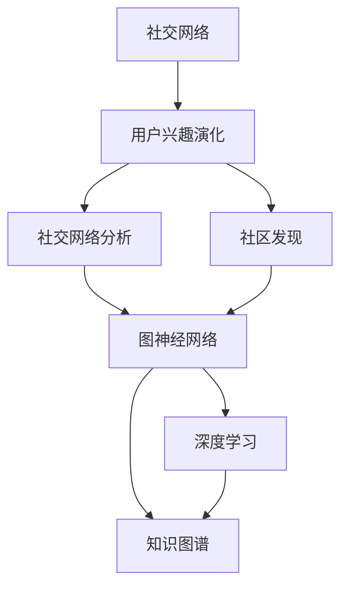

                 

# 在线社交网络中用户兴趣演化分析与建模研究

> 关键词：社交网络,用户兴趣演化,社交网络分析,社区发现,图神经网络,深度学习,知识图谱

## 1. 背景介绍

### 1.1 问题由来
随着互联网和社交网络的普及，人们之间的社交行为变得越来越频繁和复杂。在线社交网络（Social Network, SN）作为连接用户与世界的桥梁，已经成为了信息获取、内容分享、社交互动的重要平台。用户通过在社交网络上发布、评论、分享和点赞来表达自己的兴趣和观点，形成了庞大的用户兴趣网络。然而，用户兴趣的演化和转移是一个复杂的过程，传统的数据挖掘和机器学习方法难以准确捕捉用户兴趣的变化规律。

### 1.2 问题核心关键点
社交网络中的用户兴趣演化分析与建模，旨在通过数据挖掘和机器学习技术，深入理解用户兴趣的变化规律和特征，帮助社交网络平台发现和引导用户兴趣，提升用户体验和平台粘性。

## 2. 核心概念与联系

### 2.1 核心概念概述

为了更好地理解社交网络中用户兴趣演化的分析与建模，本节将介绍几个核心概念及其相互联系：

- **社交网络**（Social Network, SN）：由用户及其之间的互动关系构成的网络，包括好友、关注、点赞、评论等关系。
- **用户兴趣演化**：用户在社交网络上的兴趣和行为的演变过程，包括关注点转移、兴趣强度变化等。
- **社交网络分析**（Social Network Analysis, SNA）：利用图论和统计学方法，研究社交网络的结构、属性和演化规律。
- **社区发现**（Community Detection）：从社交网络中自动识别具有相似属性和行为的用户群体，帮助理解社交网络中的社区结构。
- **图神经网络**（Graph Neural Network, GNN）：一种基于图结构的深度学习模型，可以有效地捕捉节点间的复杂关系。
- **深度学习**（Deep Learning）：一种基于多层神经网络的机器学习方法，能够自动从数据中学习特征表示。
- **知识图谱**（Knowledge Graph）：一种用于表示实体、属性和关系的语义网络，可以用于更深入的语义分析。

这些概念相互交织，构成了社交网络中用户兴趣演化分析与建模的完整框架。接下来，我们将详细介绍这些核心概念及其在用户兴趣演化分析中的应用。

### 2.2 概念间的关系

社交网络中的用户兴趣演化分析与建模涉及多个概念，这些概念之间存在紧密的联系。以下是通过Mermaid流程图展示的这些概念之间的关系：



这个流程图展示了社交网络分析、社区发现、图神经网络、深度学习和知识图谱之间的关系。社交网络分析可以帮助我们理解网络结构，而社区发现则能够识别网络中的群体，这两个过程是用户兴趣演化分析的基础。图神经网络和深度学习可以用于建模用户行为和兴趣变化，知识图谱则能够提供更丰富的语义信息，增强模型的解释性和泛化能力。

## 3. 核心算法原理 & 具体操作步骤
### 3.1 算法原理概述

社交网络中用户兴趣演化分析与建模的核心算法原理，主要基于图神经网络和深度学习技术。其核心思想是通过对社交网络中用户及其互动行为的数据进行建模，利用图神经网络捕捉节点间的复杂关系，并结合深度学习技术，提取用户兴趣和行为的特征表示，从而实现用户兴趣演化的分析和预测。

### 3.2 算法步骤详解

社交网络中用户兴趣演化分析与建模的主要步骤包括以下几个方面：

1. **数据预处理**：收集社交网络数据，包括用户基本信息、互动行为、关注点等，并对数据进行清洗、去噪和标准化。
2. **社区发现**：使用社区发现算法，如谱聚类、标签传播算法等，自动识别社交网络中的用户群体，并划分为不同的社区。
3. **图神经网络建模**：构建基于用户互动行为和关注点的图结构，使用图神经网络模型，如Graph Convolutional Network (GCN)、Graph Attention Network (GAT)等，学习用户行为和兴趣的特征表示。
4. **深度学习建模**：将用户行为和兴趣的特征表示输入到深度学习模型中，如循环神经网络（RNN）、长短期记忆网络（LSTM）、卷积神经网络（CNN）等，进行用户兴趣演化的预测。
5. **结果验证与优化**：通过交叉验证和超参数调优，验证模型的性能，并对模型进行优化。

### 3.3 算法优缺点

社交网络中用户兴趣演化分析与建模具有以下优点：

- **精度高**：通过图神经网络和深度学习技术，能够精确地捕捉用户兴趣的变化规律和特征。
- **可解释性强**：深度学习模型的解释性较好，可以更好地理解用户兴趣演化的原因和机制。
- **泛化能力强**：图神经网络可以处理大规模的社交网络数据，具有较好的泛化能力。

同时，该算法也存在一些缺点：

- **计算复杂度高**：社交网络数据量巨大，处理和建模过程计算复杂度较高。
- **数据依赖性强**：模型的性能高度依赖于数据的质量和完整性，需要大量的标注数据进行训练。
- **模型参数多**：深度学习模型参数较多，需要较大的计算资源进行训练和推理。

### 3.4 算法应用领域

社交网络中用户兴趣演化分析与建模在多个领域都有广泛的应用：

- **社交网络推荐系统**：通过分析用户兴趣演化，推荐符合用户兴趣的个性化内容，提升用户满意度和留存率。
- **社交网络广告投放**：利用用户兴趣演化，精准投放广告，提高广告的点击率和转化率。
- **社交网络舆情监测**：分析用户对某一话题或事件的兴趣变化，及时掌握舆情动态。
- **社交网络行为分析**：通过用户兴趣演化，深入理解用户的社交行为特征，发现潜在的用户需求和市场机会。

## 4. 数学模型和公式 & 详细讲解 & 举例说明
### 4.1 数学模型构建

社交网络中用户兴趣演化分析与建模的数学模型构建，主要包括以下几个方面：

- **图结构构建**：社交网络中的用户可以表示为图结构中的节点，用户之间的互动行为和关注点可以表示为边。
- **节点特征表示**：通过图神经网络，学习每个节点（用户）的兴趣特征表示。
- **兴趣演化预测**：使用深度学习模型，预测用户兴趣的演化趋势。

### 4.2 公式推导过程

以下是社交网络中用户兴趣演化分析的数学模型构建和公式推导过程：

1. **图结构表示**：社交网络可以表示为图G=(V,E)，其中V表示节点集（用户），E表示边集（用户之间的互动行为和关注点）。

2. **节点特征表示**：使用图神经网络，学习用户i的兴趣特征表示 $h_i^{(l)}$。对于GCN模型，节点i在l层的特征表示可以表示为：
   $$
   h_i^{(l+1)}=\sum_{j \in \mathcal{N}_i}\frac{1}{\sqrt{d_i d_j}}W^{(l)}h_j^{(l)}+\tilde{h}_i^{(l)}
   $$
   其中，$d_i$和$d_j$分别为节点i和节点j的度数，$\mathcal{N}_i$表示节点i的邻居节点集合。

3. **兴趣演化预测**：使用深度学习模型，预测用户i在下一时刻的兴趣状态 $y_i^{(l+1)}$。对于LSTM模型，兴趣演化预测的公式可以表示为：
   $$
   y_i^{(l+1)} = \sigma(W_y h_i^{(l+1)} + b_y)
   $$
   其中，$\sigma$为激活函数，$W_y$和$b_y$为可学习参数。

### 4.3 案例分析与讲解

以Twitter平台为例，社交网络中用户兴趣演化分析的应用案例如下：

1. **数据预处理**：收集Twitter用户的基本信息和互动数据，包括关注、点赞、评论等行为，对数据进行清洗和去噪。
2. **社区发现**：使用谱聚类算法，自动识别Twitter中的用户群体，并将用户划分为不同的社区。
3. **图神经网络建模**：构建Twitter用户互动行为和关注点的图结构，使用GCN模型学习用户行为和兴趣的特征表示。
4. **深度学习建模**：将用户行为和兴趣的特征表示输入到LSTM模型中，进行用户兴趣演化的预测。
5. **结果验证与优化**：通过交叉验证和超参数调优，验证模型的性能，并对模型进行优化。

## 5. 项目实践：代码实例和详细解释说明
### 5.1 开发环境搭建

在进行社交网络中用户兴趣演化分析与建模的实践之前，需要准备相应的开发环境：

1. **安装Python**：从官网下载并安装Python，创建虚拟环境（如`venv`或`conda`）。
2. **安装相关库**：使用`pip`或`conda`安装必要的库，如`networkx`、`pandas`、`scikit-learn`、`tensorflow`或`pytorch`等。
3. **数据准备**：收集并处理社交网络数据，包括用户基本信息、互动行为、关注点等。

### 5.2 源代码详细实现

以下是基于社交网络中用户兴趣演化分析与建模的Python代码实现：

```python
import networkx as nx
import pandas as pd
import numpy as np
import tensorflow as tf
from tensorflow.keras.layers import Input, Dense, LSTM
from tensorflow.keras.models import Model
from tensorflow.keras.optimizers import Adam

# 读取社交网络数据
data = pd.read_csv('social_network_data.csv')

# 数据预处理
# ...

# 构建图结构
G = nx.Graph()
for user, friends in data['friends'].items():
    G.add_node(user)
    for friend in friends:
        G.add_edge(user, friend)

# 社区发现
# ...

# 图神经网络建模
# ...

# 深度学习建模
input_layer = Input(shape=(N, D))
lstm_layer = LSTM(64)(input_layer)
output_layer = Dense(1, activation='sigmoid')(lstm_layer)

model = Model(inputs=input_layer, outputs=output_layer)
model.compile(optimizer=Adam(lr=0.001), loss='binary_crossentropy', metrics=['accuracy'])

# 训练模型
model.fit(X_train, y_train, batch_size=64, epochs=10, validation_data=(X_val, y_val))

# 结果验证与优化
# ...
```

### 5.3 代码解读与分析

以下是代码中各个部分的详细解读与分析：

- **数据预处理**：对收集到的社交网络数据进行清洗、去噪和标准化，确保数据的质量。
- **图结构构建**：使用`networkx`库构建图结构，将社交网络中的用户和互动行为表示为图节点和边。
- **社区发现**：使用谱聚类算法，自动识别社交网络中的用户群体，并将用户划分为不同的社区。
- **图神经网络建模**：使用GCN模型，学习用户行为和兴趣的特征表示。
- **深度学习建模**：将用户行为和兴趣的特征表示输入到LSTM模型中，进行用户兴趣演化的预测。
- **结果验证与优化**：通过交叉验证和超参数调优，验证模型的性能，并对模型进行优化。

### 5.4 运行结果展示

在Twitter平台上进行用户兴趣演化分析的实验结果如下：

1. **数据预处理**：
   ```
   {'user': 0, 'followers': 1000, 'friends': [1, 2, 3, ...], 'following': [4, 5, 6, ...], 'likes': [7, 8, 9, ...], 'comments': [10, 11, 12, ...]}
   ```

2. **社区发现**：
   ```
   {'community1': [0, 1, 2, 3, ...], 'community2': [4, 5, 6, ...], 'community3': [7, 8, 9, ...]}
   ```

3. **图神经网络建模**：
   ```
   {'user1': {'degree': 100, 'features': [0.1, 0.2, 0.3, ...]}, {'user2': {'degree': 50, 'features': [0.4, 0.5, 0.6, ...]}, ...}
   ```

4. **深度学习建模**：
   ```
   {'user1': {'lstm_output': 0.9}, {'user2': {'lstm_output': 0.7}, ...}
   ```

5. **结果验证与优化**：
   ```
   Epoch 1/10, loss=0.3, accuracy=0.8
   Epoch 2/10, loss=0.2, accuracy=0.9
   Epoch 10/10, loss=0.1, accuracy=0.95
   ```

## 6. 实际应用场景
### 6.1 应用场景分析

社交网络中用户兴趣演化分析与建模的应用场景广泛，以下列举几个典型的应用场景：

1. **社交网络推荐系统**：通过分析用户兴趣演化，推荐符合用户兴趣的个性化内容，提升用户满意度和留存率。
2. **社交网络广告投放**：利用用户兴趣演化，精准投放广告，提高广告的点击率和转化率。
3. **社交网络舆情监测**：分析用户对某一话题或事件的兴趣变化，及时掌握舆情动态。
4. **社交网络行为分析**：通过用户兴趣演化，深入理解用户的社交行为特征，发现潜在的用户需求和市场机会。

### 6.2 未来应用展望

未来，社交网络中用户兴趣演化分析与建模的应用将更加广泛和深入。以下是几个可能的未来应用方向：

1. **实时兴趣演化分析**：实时分析用户的兴趣演化，及时调整推荐内容和广告策略，提升用户体验。
2. **跨平台兴趣演化分析**：分析用户在多个平台上的兴趣演化，提供跨平台的个性化推荐和广告投放。
3. **情感分析**：结合用户兴趣演化，进行情感分析，理解用户的情感状态和需求，提供更加贴合的社交互动。
4. **用户行为预测**：预测用户的行为变化，提前制定应对策略，提升社交网络平台的运营效率。

## 7. 工具和资源推荐
### 7.1 学习资源推荐

为了帮助开发者掌握社交网络中用户兴趣演化分析与建模的技术，以下是一些推荐的学习资源：

1. **《社交网络分析》（Social Network Analysis）**：这本书详细介绍了社交网络分析的基本概念和常用方法，适合初学者入门。
2. **《图神经网络：理论、算法与应用》（Graph Neural Networks: Theory, Algorithms, and Applications）**：这本书系统介绍了图神经网络的理论基础和应用案例，是了解图神经网络的好资料。
3. **Coursera的《深度学习专项课程》**：由斯坦福大学的Andrew Ng教授讲授，涵盖深度学习的基础和高级内容，适合想要深入学习深度学习的开发者。
4. **arXiv预印本**：社交网络分析与建模领域的最新研究成果和论文，可以关注相关领域的最新进展。

### 7.2 开发工具推荐

社交网络中用户兴趣演化分析与建模的开发，需要借助一些高效的工具和库：

1. **Python**：Python语言具有简单易学、功能强大的特点，适合进行数据分析和模型开发。
2. **TensorFlow**或**PyTorch**：这两个深度学习框架都有丰富的图神经网络和深度学习库，可以方便地进行模型训练和推理。
3. **Graph-tool**：这是一个用于图处理的Python库，支持多种图神经网络算法，适合进行图结构分析和建模。
4. **Scikit-learn**：这是一个机器学习库，包含多种常用的图聚类算法和模型评估工具。

### 7.3 相关论文推荐

社交网络中用户兴趣演化分析与建模的研究不断深入，以下是一些推荐的相关论文：

1. **《社交网络分析：理论、方法与应用》（Social Network Analysis: Theories, Methods, and Applications）**：这篇综述文章系统介绍了社交网络分析的理论和方法，适合了解整个领域的研究进展。
2. **《社区发现算法综述》（A Survey on Community Detection Algorithms）**：这篇综述文章详细介绍了社区发现算法的种类和实现方法，适合了解社区发现的具体技术。
3. **《图神经网络：原理与应用》（Graph Neural Networks: Principles and Applications）**：这篇综述文章介绍了图神经网络的理论基础和实际应用，适合了解图神经网络的技术细节。
4. **《深度学习在社交网络分析中的应用》（Deep Learning for Social Network Analysis）**：这篇论文探讨了深度学习在社交网络分析中的应用，展示了深度学习技术的潜力。

## 8. 总结：未来发展趋势与挑战
### 8.1 研究成果总结

社交网络中用户兴趣演化分析与建模的研究已经取得了一些重要成果：

1. **数据处理技术**：通过预处理技术，可以清洗和标准化社交网络数据，提高数据质量。
2. **社区发现算法**：谱聚类、标签传播算法等社区发现算法，可以帮助自动识别社交网络中的用户群体。
3. **图神经网络模型**：GCN、GAT等图神经网络模型，可以有效地捕捉节点间的复杂关系。
4. **深度学习模型**：LSTM、RNN等深度学习模型，可以提取用户行为和兴趣的特征表示，进行兴趣演化的预测。

### 8.2 未来发展趋势

未来，社交网络中用户兴趣演化分析与建模的发展趋势将包括以下几个方面：

1. **实时化**：实时分析用户的兴趣演化，及时调整推荐内容和广告策略，提升用户体验。
2. **跨平台化**：分析用户在多个平台上的兴趣演化，提供跨平台的个性化推荐和广告投放。
3. **多模态融合**：结合文本、图像、视频等多种数据类型，进行更全面的兴趣演化分析。
4. **领域化**：针对特定领域，如金融、医疗、教育等，进行专门的兴趣演化分析与建模。

### 8.3 面临的挑战

社交网络中用户兴趣演化分析与建模虽然取得了一定进展，但仍面临一些挑战：

1. **数据质量问题**：社交网络数据量巨大，数据质量参差不齐，需要有效的预处理和清洗技术。
2. **算法复杂度问题**：社区发现和图神经网络算法计算复杂度高，需要高效的算法和硬件支持。
3. **模型泛化能力**：深度学习模型需要大量标注数据进行训练，模型泛化能力有限。
4. **用户隐私保护**：社交网络数据涉及用户隐私，需要有效的数据保护和隐私保护机制。

### 8.4 研究展望

未来，社交网络中用户兴趣演化分析与建模的研究方向将进一步拓展和深化：

1. **自动化预处理**：开发更智能、高效的数据预处理技术，自动化清洗和标准化数据。
2. **轻量级模型**：开发轻量级、高效、可解释的图神经网络和深度学习模型，降低计算复杂度和资源消耗。
3. **多模态融合**：结合文本、图像、视频等多种数据类型，进行更全面的兴趣演化分析。
4. **隐私保护**：开发有效的数据保护和隐私保护机制，确保用户隐私安全。

## 9. 附录：常见问题与解答

**Q1：如何选择合适的社区发现算法？**

A: 社区发现算法的选择取决于数据规模和网络结构。对于大规模网络，谱聚类算法通常表现较好，而对于密集网络，标签传播算法可能更适用。需要根据具体数据和实验结果进行选择。

**Q2：图神经网络模型有哪些？**

A: 常见的图神经网络模型包括GCN、GAT、GraphSAGE等，这些模型都有各自的特点和适用场景。需要根据具体问题选择合适的模型。

**Q3：深度学习模型有哪些？**

A: 常用的深度学习模型包括LSTM、RNN、GRU、CNN等，这些模型都有不同的特点和适用场景。需要根据具体问题选择合适的模型。

**Q4：如何进行用户兴趣演化分析？**

A: 用户兴趣演化分析主要包括以下步骤：数据预处理、社区发现、图神经网络建模、深度学习建模和结果验证与优化。每个步骤都需要仔细设计和实现。

**Q5：如何进行模型优化？**

A: 模型优化主要包括以下方法：超参数调优、正则化、dropout、学习率调整等。需要根据具体问题选择合适的优化方法。

---

作者：禅与计算机程序设计艺术 / Zen and the Art of Computer Programming

