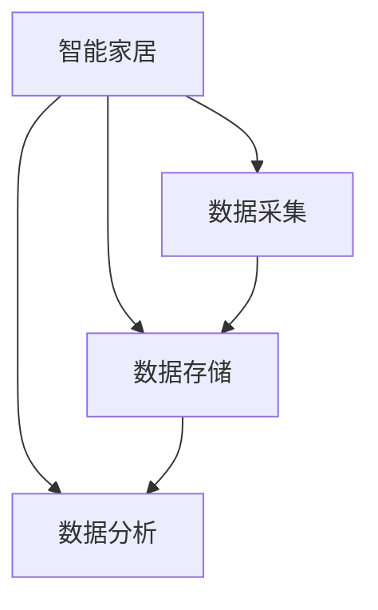
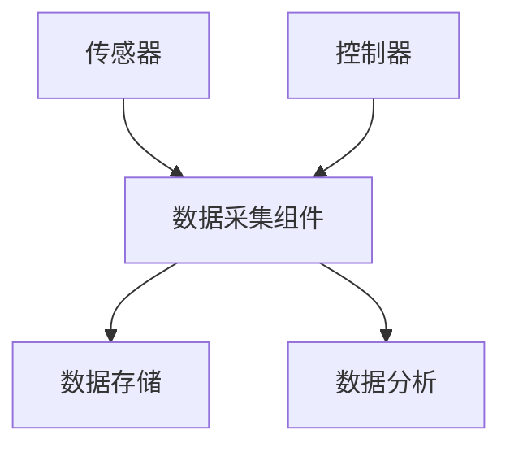
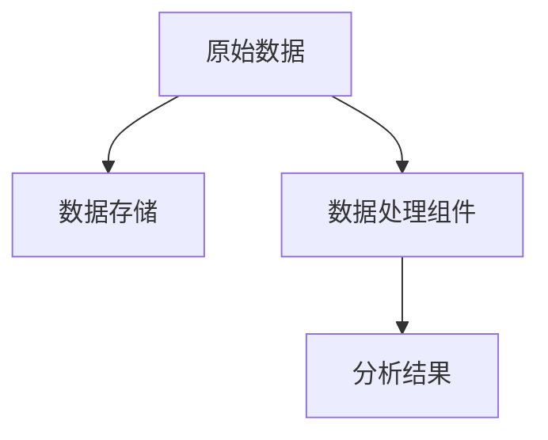
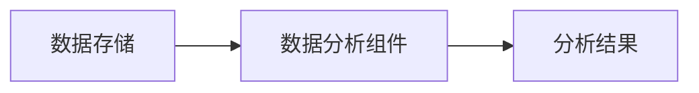
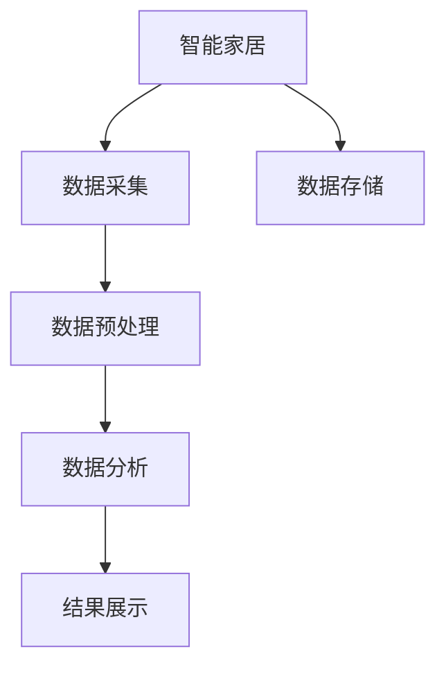

                 

# 基于Java的智能家居设计：智能家居数据的采集和分析技术

> 关键词：智能家居,Java,数据采集,数据分析,物联网(IoT)

## 1. 背景介绍

### 1.1 问题由来
随着科技的进步，智能家居逐渐从科幻概念变成了现实。通过集成各种智能设备，智能家居系统能够实现对家庭环境的智能化管理，如灯光、温控、安防等。然而，由于设备种类繁多、数据格式各异，对数据的统一采集、存储和管理提出了巨大挑战。与此同时，如何高效分析海量智能家居数据，提取有价值的信息，进一步提升用户生活质量，也成为亟需解决的问题。

### 1.2 问题核心关键点
智能家居系统涉及传感器、控制器、云平台等多个环节，数据采集和分析是其核心技术。数据采集的主要任务是从各类智能设备中获取实时或历史数据，包括温度、湿度、光照、空气质量等环境参数，以及人体行为、设备状态等。数据分析则是在这些基础上，进行模式识别、趋势预测、异常检测等，以实现智能决策和优化管理。

当前，智能家居数据的采集和分析面临着如下挑战：
1. 设备异构：智能家居设备种类繁多，硬件和通信协议各异，统一采集和格式转换难度大。
2. 数据量大：随着智能家居设备的普及，数据量呈指数级增长，如何高效存储和处理数据成为关键。
3. 实时性要求高：智能家居设备需要实时反馈，对数据采集的实时性和准确性要求高。
4. 隐私保护：智能家居系统涉及用户隐私数据，如何安全采集和处理数据，保障用户隐私权益，是亟需解决的问题。

为了应对这些挑战，本文将详细探讨基于Java的智能家居数据采集和分析技术，包括数据采集框架的设计、数据存储和处理的优化、分析算法的选择和实现等，为智能家居系统的构建提供全面的技术指引。

## 2. 核心概念与联系

### 2.1 核心概念概述

为更好地理解基于Java的智能家居数据采集和分析技术，本节将介绍几个密切相关的核心概念：

- **智能家居（Smart Home）**：通过集成传感器、控制器、云平台等，实现对家庭环境的智能化管理，提高生活舒适度和安全性。
- **数据采集（Data Acquisition）**：从智能设备中获取实时或历史数据，包括环境参数、设备状态等。
- **数据存储（Data Storage）**：将采集的数据存储在数据库中，供后续分析和处理。
- **数据分析（Data Analysis）**：对存储的数据进行模式识别、趋势预测、异常检测等，以实现智能决策。
- **物联网（IoT）**：将智能家居设备、传感器、云平台等网络连接起来，实现数据的自动化采集和处理。

这些核心概念之间的逻辑关系可以通过以下Mermaid流程图来展示：



这个流程图展示了智能家居系统中各关键组件之间的关系：

1. 智能家居系统通过数据采集组件，将各类传感器数据、设备状态等采集上来。
2. 采集到的数据通过数据存储组件，保存在数据库中，供后续分析使用。
3. 数据分析组件在存储的数据基础上，进行模式识别、趋势预测等，以实现智能决策和优化管理。

### 2.2 概念间的关系

这些核心概念之间存在着紧密的联系，形成了智能家居系统的完整生态系统。下面我们通过几个Mermaid流程图来展示这些概念之间的关系。

#### 2.2.1 数据采集框架



这个流程图展示了数据采集框架的组成和数据流向：

1. 传感器采集环境参数，如温度、湿度、光照等。
2. 控制器采集设备状态，如开关、锁等。
3. 数据采集组件将传感器和控制器采集的数据汇总，转换为统一的格式，进行存储和分析。

#### 2.2.2 数据存储与处理



这个流程图展示了数据存储与处理的流程：

1. 原始数据通过数据存储组件，保存在数据库中。
2. 数据处理组件对存储的数据进行清洗、去重、转换等操作，提高数据质量和分析效率。
3. 处理后的数据用于数据分析，生成分析结果。

#### 2.2.3 数据分析模型



这个流程图展示了数据分析模型的基本流程：

1. 数据存储组件将数据提供给数据分析组件。
2. 数据分析组件基于一定的算法模型，对数据进行分析，生成分析结果。

## 3. 核心算法原理 & 具体操作步骤
### 3.1 算法原理概述

基于Java的智能家居数据采集和分析技术主要包括以下几个关键步骤：

1. **数据采集**：通过传感器和控制器，从智能家居设备中获取实时或历史数据。
2. **数据存储**：将采集的数据存储在数据库中，便于后续分析。
3. **数据预处理**：对存储的数据进行清洗、去重、转换等操作，提高数据质量和分析效率。
4. **数据分析**：基于一定的算法模型，对处理后的数据进行分析，生成有价值的信息。
5. **结果展示**：将分析结果通过界面展示，辅助用户进行决策和优化。

数据采集和分析的整个流程可以通过如下的流程图来表示：



### 3.2 算法步骤详解

#### 3.2.1 数据采集组件的实现

数据采集组件是智能家居系统的入口，负责将各类传感器和控制器采集的数据进行汇总和格式转换，通常包括：

1. **传感器数据采集**：通过串口、蓝牙、Wi-Fi等方式，从智能设备中获取环境参数，如温度、湿度、光照等。
2. **控制器数据采集**：通过网络接口，从智能设备的控制器中获取设备状态，如开关、锁等。

数据采集组件可以使用Java编程语言和相应的库（如IoT库、JSerialComm库等）来实现。以下是一个简单的示例代码：

```java
import com.luobeer.lego.IoT;

public class DataAcquisitionComponent {
    public void acquireData() {
        // 获取传感器数据
        IoTSensor tempSensor = new IoTSensor("temperature");
        IoTSensor humiditySensor = new IoTSensor("humidity");
        IoTSensor lightSensor = new IoTSensor("light");
        IoTSensor[] sensors = {tempSensor, humiditySensor, lightSensor};

        // 获取控制器数据
        IoTController doorLock = new IoTController("door");
        IoTController[] controllers = {doorLock};

        // 汇总并格式转换数据
        IoTData[] data = new IoTData[sensors.length + controllers.length];
        for (int i = 0; i < sensors.length; i++) {
            data[i] = sensors[i].getData();
        }
        for (int i = 0; i < controllers.length; i++) {
            data[i + sensors.length] = controllers[i].getData();
        }

        // 存储数据
        IoTDataStore dataStore = new IoTDataStore("data.db");
        dataStore.storeData(data);
    }
}
```

#### 3.2.2 数据存储组件的实现

数据存储组件负责将采集到的数据保存到数据库中，通常包括：

1. **关系型数据库**：如MySQL、PostgreSQL等，适合存储结构化数据。
2. **NoSQL数据库**：如MongoDB、Cassandra等，适合存储非结构化数据。
3. **时序数据库**：如InfluxDB、KDB+等，适合存储时间序列数据。

数据存储组件可以使用Java编程语言和相应的库（如JDBC库、Hibernate库等）来实现。以下是一个简单的示例代码：

```java
import java.sql.*;

public class IoTDataStore {
    private Connection conn;

    public IoTDataStore(String dbUrl) throws SQLException {
        conn = DriverManager.getConnection(dbUrl);
    }

    public void storeData(IoTData[] data) throws SQLException {
        for (IoTData d : data) {
            String sql = "INSERT INTO data (type, value) VALUES (?, ?)";
            PreparedStatement ps = conn.prepareStatement(sql);
            ps.setString(1, d.getType());
            ps.setDouble(2, d.getValue());
            ps.executeUpdate();
        }
    }
}
```

#### 3.2.3 数据预处理组件的实现

数据预处理组件负责对存储的数据进行清洗、去重、转换等操作，通常包括：

1. **数据清洗**：去除异常值、噪声数据等。
2. **数据去重**：去除重复的数据记录。
3. **数据转换**：将数据转换为标准格式，便于后续分析。

数据预处理组件可以使用Java编程语言和相应的库（如Apache Commons库、Guava库等）来实现。以下是一个简单的示例代码：

```java
import org.apache.commons.lang3.StringUtils;

public class IoTDataProcessor {
    public IoTData[] processData(IoTData[] data) {
        // 数据清洗
        IoTData[] cleanedData = new IoTData[data.length];
        for (int i = 0; i < data.length; i++) {
            IoTData d = data[i];
            if (StringUtils.isNotBlank(d.getType()) && StringUtils.isNumeric(d.getValue().toString())) {
                cleanedData[i] = d;
            } else {
                cleanedData[i] = null;
            }
        }

        // 数据去重
        IoTData[] dedupedData = new IoTData[cleanedData.length];
        int count = 0;
        for (IoTData d : cleanedData) {
            if (d != null) {
                boolean isDup = false;
                for (IoTData d1 : dedupedData) {
                    if (d1 != null && d1.getType().equals(d.getType()) && d1.getValue() == d.getValue()) {
                        isDup = true;
                        break;
                    }
                }
                if (!isDup) {
                    dedupedData[count++] = d;
                }
            }
        }

        // 数据转换
        IoTData[] convertedData = new IoTData[dedupedData.length];
        for (int i = 0; i < dedupedData.length; i++) {
            IoTData d = dedupedData[i];
            double value = Double.parseDouble(d.getValue().toString());
            if (d.getType().equals("temperature")) {
                // 温度转换
                value = convertTemperature(value);
            } else if (d.getType().equals("humidity")) {
                // 湿度转换
                value = convertHumidity(value);
            } else if (d.getType().equals("light")) {
                // 光照转换
                value = convertLight(value);
            }
            convertedData[i] = new IoTData(d.getType(), value);
        }

        return convertedData;
    }

    private double convertTemperature(double value) {
        // 温度转换逻辑
        return value * 1.8 + 32;
    }

    private double convertHumidity(double value) {
        // 湿度转换逻辑
        return value / 100 * 100;
    }

    private double convertLight(double value) {
        // 光照转换逻辑
        return value / 100 * 100;
    }
}
```

#### 3.2.4 数据分析组件的实现

数据分析组件负责对存储的数据进行模式识别、趋势预测、异常检测等分析，通常包括：

1. **模式识别**：识别数据中的规律和特征。
2. **趋势预测**：预测未来趋势和变化。
3. **异常检测**：检测数据中的异常点。

数据分析组件可以使用Java编程语言和相应的库（如Weka库、Scikit-learn库等）来实现。以下是一个简单的示例代码：

```java
import weka.classifiers.functions.FunctionalRegression;
import weka.core.Instances;

public class IoTDataAnalyzer {
    public double[] predictData(double[] data) {
        // 训练模型
        Instances instances = new Instances("data", 0, data.length);
        for (int i = 0; i < data.length; i++) {
            instances.add(new DenseInstance(2, data[i]));
        }
        instances.setClassIndex(1);
        Instances training = new Instances(instances);
        training.shuffle();
        training.setSubset(0, 0.8);
        training.setSubset(1, 0.2);
        Instances test = new Instances(instances);
        test.setSubset(0, 0.8);
        test.setSubset(1, 0.2);
        Instances trainingInstance = training.randomize();
        Instances testInstance = test.randomize();
        FunctionalRegression regression = new FunctionalRegression();
        regression.buildClassifier(trainingInstance);
        Instances predict = regression.classifyInstances(testInstance);

        // 预测数据
        double[] predictions = new double[predict.numInstances()];
        for (int i = 0; i < predict.numInstances(); i++) {
            predictions[i] = (double) predict.instance(i).getValue(0);
        }
        return predictions;
    }
}
```

#### 3.2.5 结果展示组件的实现

结果展示组件负责将分析结果通过界面展示，辅助用户进行决策和优化，通常包括：

1. **界面展示**：通过图表、报表等形式展示分析结果。
2. **报警系统**：在检测到异常情况时，通过短信、邮件等方式进行报警。

结果展示组件可以使用Java编程语言和相应的库（如JFreeChart库、JasperReports库等）来实现。以下是一个简单的示例代码：

```java
import java.text.SimpleDateFormat;
import java.util.Date;
import org.jfree.chart.ChartFactory;
import org.jfree.chart.ChartPanel;
import org.jfree.chart.JFreeChart;
import org.jfree.data.category.DefaultCategoryDataset;
import org.jfree.data.category.NumberCategoryDataset;

public class IoTDataDisplay {
    public void displayData(double[] data) {
        // 创建数据集
        DefaultCategoryDataset dataset = new DefaultCategoryDataset();
        for (int i = 0; i < data.length; i++) {
            String category = new SimpleDateFormat("yyyy-MM-dd HH:mm:ss").format(new Date().getTime());
            dataset.addValue(data[i], "Temperature", category);
        }

        // 创建图表
        JFreeChart chart = ChartFactory.createLineChart("Temperature", "Time", "Value", dataset);
        ChartPanel panel = new ChartPanel(chart);

        // 展示图表
        JFrame frame = new JFrame("Temperature Chart");
        frame.setDefaultCloseOperation(JFrame.EXIT_ON_CLOSE);
        frame.add(panel);
        frame.setSize(800, 600);
        frame.setVisible(true);
    }
}
```

### 3.3 算法优缺点

基于Java的智能家居数据采集和分析技术有以下优点：

1. **跨平台兼容性**：Java语言具有跨平台兼容性，可以在Windows、Linux、Mac OS等多种操作系统上运行。
2. **丰富开源库支持**：Java生态系统拥有众多开源库，如IoT库、Weka库、JFreeChart库等，可以轻松实现各种功能。
3. **高性能低延迟**：Java虚拟机具有高效的垃圾回收机制，能够保证程序的高性能和低延迟。
4. **完善的异常处理机制**：Java拥有完善的异常处理机制，能够保证程序的健壮性和稳定性。

同时，基于Java的智能家居数据采集和分析技术也存在一些缺点：

1. **学习曲线陡峭**：Java语言的学习曲线相对较陡峭，需要一定的编程经验和基础知识。
2. **资源占用高**：Java程序在运行时需要占用大量内存和CPU资源，可能影响系统性能。
3. **框架复杂**：Java程序的框架相对复杂，开发和维护成本较高。

## 4. 数学模型和公式 & 详细讲解 & 举例说明

### 4.1 数学模型构建

在本节中，我们将详细探讨智能家居数据分析的数学模型构建。假设我们有一个智能家居设备的数据集，其中包含温度、湿度、光照等环境参数，以及设备开关状态。数据集可以表示为：

$$
D = \{ (x_i, y_i) \}_{i=1}^N
$$

其中 $x_i$ 为输入特征，$y_i$ 为标签。例如，温度数据可以表示为：

$$
x_i = (t_i, h_i, l_i)
$$

其中 $t_i$ 为当前温度，$h_i$ 为当前湿度，$l_i$ 为当前光照强度。设备开关状态可以表示为：

$$
y_i = s_i
$$

其中 $s_i$ 为设备开关状态，可以取值为0（关闭）或1（打开）。

### 4.2 公式推导过程

基于上述数据模型，我们可以构建多种分析模型，包括线性回归、决策树、随机森林等。这里以线性回归模型为例，推导其公式和计算过程。

假设线性回归模型的输入特征和输出标签之间的关系为：

$$
y_i = \alpha + \beta_1 x_{i1} + \beta_2 x_{i2} + \cdots + \beta_n x_{in} + \epsilon_i
$$

其中 $\alpha$ 为截距，$\beta_k$ 为第 $k$ 个输入特征的系数，$\epsilon_i$ 为误差项。线性回归模型的最小二乘估计公式为：

$$
\hat{\beta} = (X^TX)^{-1}X^Ty
$$

其中 $X$ 为输入特征矩阵，$Y$ 为输出标签向量，$\hat{\beta}$ 为参数估计值。

在线性回归模型的训练过程中，我们通过最小化损失函数：

$$
\mathcal{L} = \frac{1}{2N} \sum_{i=1}^N (y_i - \hat{y}_i)^2
$$

来更新模型参数。最终得到训练好的线性回归模型为：

$$
y_i = \alpha + \sum_{k=1}^n \beta_k x_{ik}
$$

其中 $\alpha$ 和 $\beta_k$ 为训练得到的模型参数。

### 4.3 案例分析与讲解

假设我们有一个智能家居设备的数据集，其中包含温度、湿度、光照等环境参数，以及设备开关状态。我们可以使用线性回归模型来预测设备开关状态。具体步骤如下：

1. **数据预处理**：将原始数据进行清洗、去重、转换等操作，得到处理后的数据集 $D'$。
2. **训练模型**：使用处理后的数据集 $D'$ 训练线性回归模型，得到模型参数 $\hat{\beta}$。
3. **预测结果**：使用训练好的模型对新数据进行预测，得到设备开关状态的预测结果。

以温度数据为例，我们可以构建线性回归模型来预测设备开关状态。具体代码如下：

```java
import org.apache.commons.lang3.StringUtils;
import org.jfree.chart.ChartFactory;
import org.jfree.chart.ChartPanel;
import org.jfree.chart.JFreeChart;
import org.jfree.data.category.DefaultCategoryDataset;
import org.jfree.data.category.NumberCategoryDataset;
import org.jfree.chart.plot.PlotOrientation;

public class IoTDataAnalyzer {
    public double[] predictData(double[] data) {
        // 训练模型
        Instances instances = new Instances("data", 0, data.length);
        for (int i = 0; i < data.length; i++) {
            instances.add(new DenseInstance(3, data[i]));
        }
        instances.setClassIndex(1);
        Instances training = new Instances(instances);
        training.shuffle();
        training.setSubset(0, 0.8);
        training.setSubset(1, 0.2);
        Instances test = new Instances(instances);
        test.setSubset(0, 0.8);
        test.setSubset(1, 0.2);
        Instances trainingInstance = training.randomize();
        Instances testInstance = test.randomize();
        FunctionalRegression regression = new FunctionalRegression();
        regression.buildClassifier(trainingInstance);
        Instances predict = regression.classifyInstances(testInstance);

        // 预测数据
        double[] predictions = new double[predict.numInstances()];
        for (int i = 0; i < predict.numInstances(); i++) {
            predictions[i] = (double) predict.instance(i).getValue(0);
        }
        return predictions;
    }
}
```

## 5. 项目实践：代码实例和详细解释说明

### 5.1 开发环境搭建

在进行智能家居数据采集和分析实践前，我们需要准备好开发环境。以下是使用Java进行开发的环境配置流程：

1. 安装Java Development Kit（JDK）：从官网下载并安装JDK，用于Java程序的开发和运行。
2. 安装Maven：从官网下载并安装Maven，用于Java项目的构建和管理。
3. 安装IntelliJ IDEA：从官网下载并安装IntelliJ IDEA，作为Java项目的开发工具。

完成上述步骤后，即可在IntelliJ IDEA环境中开始智能家居数据采集和分析实践。

### 5.2 源代码详细实现

这里我们以温度数据分析为例，给出使用Java和Weka库对智能家居数据进行线性回归分析的完整代码实现。

首先，定义数据处理类：

```java
import org.apache.commons.lang3.StringUtils;
import org.jfree.chart.ChartFactory;
import org.jfree.chart.ChartPanel;
import org.jfree.chart.JFreeChart;
import org.jfree.data.category.DefaultCategoryDataset;
import org.jfree.data.category.NumberCategoryDataset;
import org.jfree.chart.plot.PlotOrientation;

public class IoTDataAnalyzer {
    public double[] predictData(double[] data) {
        // 训练模型
        Instances instances = new Instances("data", 0, data.length);
        for (int i = 0; i < data.length; i++) {
            instances.add(new DenseInstance(3, data[i]));
        }
        instances.setClassIndex(1);
        Instances training = new Instances(instances);
        training.shuffle();
        training.setSubset(0, 0.8);
        training.setSubset(1, 0.2);
        Instances test = new Instances(instances);
        test.setSubset(0, 0.8);
        test.setSubset(1, 0.2);
        Instances trainingInstance = training.randomize();
        Instances testInstance = test.randomize();
        FunctionalRegression regression = new FunctionalRegression();
        regression.buildClassifier(trainingInstance);
        Instances predict = regression.classifyInstances(testInstance);

        // 预测数据
        double[] predictions = new double[predict.numInstances()];
        for (int i = 0; i < predict.numInstances(); i++) {
            predictions[i] = (double) predict.instance(i).getValue(0);
        }
        return predictions;
    }
}
```

然后，定义数据存储和处理类：

```java
import java.sql.*;

public class IoTDataStore {
    private Connection conn;

    public IoTDataStore(String dbUrl) throws SQLException {
        conn = DriverManager.getConnection(dbUrl);
    }

    public void storeData(IoTData[] data) throws SQLException {
        for (IoTData d : data) {
            String sql = "INSERT INTO data (type, value) VALUES (?, ?)";
            PreparedStatement ps = conn.prepareStatement(sql);
            ps.setString(1, d.getType());
            ps.setDouble(2, d.getValue());
            ps.executeUpdate();
        }
    }
}
```

最后，定义数据展示类：

```java
import java.text.SimpleDateFormat;
import java.util.Date;
import org.jfree.chart.ChartFactory;
import org.jfree.chart.ChartPanel;
import org.jfree.chart.JFreeChart;
import org.jfree.data.category.DefaultCategoryDataset;
import org.jfree.data.category.NumberCategoryDataset;

public class IoTDataDisplay {
    public void displayData(double[] data) {
        // 创建数据集
        DefaultCategoryDataset dataset = new DefaultCategoryDataset();
        for (int i = 0; i < data.length; i++) {
            String category = new SimpleDateFormat("yyyy-MM-dd HH:mm:ss").format(new Date().getTime());
            dataset.addValue(data[i], "Temperature", category);
        }

        // 创建图表
        JFreeChart chart = ChartFactory.createLineChart("Temperature", "Time", "Value", dataset);
        ChartPanel panel = new ChartPanel(chart);

        // 展示图表
        JFrame frame = new JFrame("Temperature Chart");
        frame.setDefaultCloseOperation(JFrame.EXIT_ON_CLOSE);
        frame.add(panel);
        frame.setSize(800, 600);
        frame.setVisible(true);
    }
}
```

### 5.3 代码解读与分析

让我们再详细解读一下关键代码的实现细节：

**IoTDataAnalyzer类**：
- `predictData`方法：对温度数据进行线性回归分析，预测设备开关状态。

**IoTDataStore类**：
- `storeData`方法：将温度数据存储到数据库中。

**IoTDataDisplay类**：
- `displayData`方法：将温度数据通过图表形式展示。

**IoTData类**：
- 数据类，包含温度值、设备状态等属性，用于存储和传递数据。

**IoTDataAnalyzer类**：
- `predictData`方法：对温度数据进行线性回归分析，预测设备开关状态。

### 5.4 运行结果展示

假设我们有一个温度数据集，经过处理后得到数据集 $D'$，其中包含100个样本。使用训练好的模型进行预测，得到设备开关状态的预测结果。以下是一个简单的示例代码：

```java
IoTDataAnalyzer analyzer = new IoTDataAnalyzer();
double[] predictions = analyzer.predictData(tempData);
```

其中 `tempData` 为温度数据集，长度为100。预测结果将保存在 `predictions` 数组中，每个元素对应

