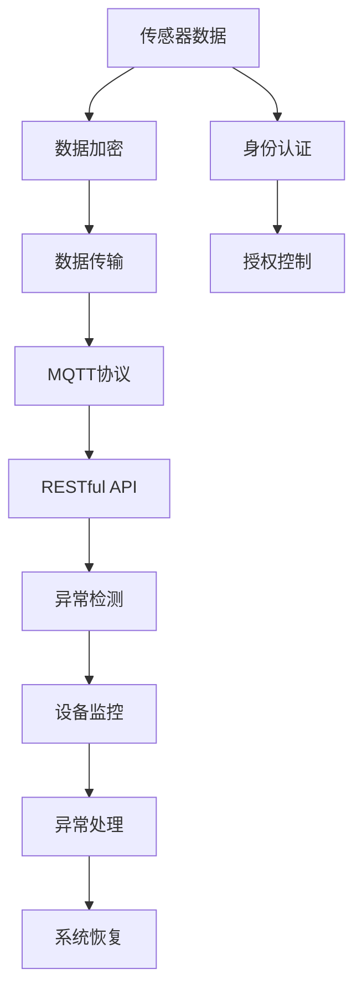

                 

# 基于MQTT协议和RESTful API的智能家居远程控制安全模型

> 关键词：智能家居,远程控制,安全模型,RESTful API,MQTT协议,物联网,传感器数据

## 1. 背景介绍

### 1.1 问题由来
随着物联网技术的发展，智能家居系统的普及程度不断提高。然而，智能家居系统中存在诸多安全隐患，如设备被恶意攻击、用户隐私泄露等问题。这些问题如果处理不当，可能导致严重的安全事故。因此，构建一个安全可靠的智能家居远程控制模型显得尤为重要。

### 1.2 问题核心关键点
智能家居远程控制模型的核心在于：
1. 如何保障通信数据的传输安全，防止数据被窃听和篡改。
2. 如何保证用户身份的认证和授权，防止未授权的访问和操作。
3. 如何处理传感器数据的异常情况，及时发现和处理安全隐患。
4. 如何对设备的运行状态进行监控，防止异常行为导致系统崩溃。

### 1.3 问题研究意义
构建一个安全可靠的智能家居远程控制模型，对于提升智能家居系统的安全性、可靠性、用户体验有着重要的意义。具体如下：

1. 提升用户信任度：用户信任智能家居系统的安全性能，才能更好地享受其带来的便利。
2. 降低运营成本：通过自动化监控和异常处理，减少人工干预，降低运营成本。
3. 拓展市场应用：安全可靠的智能家居系统，能更好地应对各类市场环境，拓展业务领域。
4. 实现智能化升级：通过数据驱动的智能控制，提升家居系统的智能化水平。
5. 保障用户隐私：防止数据泄露和隐私侵害，保障用户隐私权。

## 2. 核心概念与联系

### 2.1 核心概念概述

为更好地理解基于MQTT协议和RESTful API的智能家居远程控制安全模型，本节将介绍几个密切相关的核心概念：

- MQTT协议（Message Queuing Telemetry Transport Protocol）：一种轻量级的物联网通信协议，适合于实时性要求高的场景，常用于智能家居系统的数据传输。
- RESTful API（Representational State Transfer Application Programming Interface）：一种轻量级的Web服务架构风格，通过HTTP协议实现远程调用，常用于智能家居系统的远程控制。
- 传感器数据（Sensor Data）：智能家居系统中的传感器采集的各种数据，如环境温度、湿度、光照等，用于实时监控和控制。
- 数据加密（Data Encryption）：通过加密技术保护数据传输的安全性，防止数据泄露。
- 身份认证（Authentication）：通过身份验证技术，确认用户或设备的身份，防止未授权访问。
- 授权控制（Authorization）：通过授权机制，确定用户或设备的权限，防止过度访问。
- 异常检测（Anomaly Detection）：通过异常检测技术，识别传感器数据的异常情况，及时发现和处理安全隐患。
- 设备监控（Device Monitoring）：通过监控技术，实时监测设备的运行状态，防止异常行为导致系统崩溃。

这些核心概念之间的逻辑关系可以通过以下Mermaid流程图来展示：



这个流程图展示了大语言模型的核心概念及其之间的关系：

1. 传感器数据采集
2. 数据加密传输
3. MQTT协议连接
4. RESTful API远程控制
5. 身份认证授权
6. 异常检测监控
7. 异常处理系统恢复

## 3. 核心算法原理 & 具体操作步骤
### 3.1 算法原理概述

基于MQTT协议和RESTful API的智能家居远程控制安全模型，其核心算法原理可以概括为以下几个步骤：

1. 传感器数据采集：通过智能家居设备中的传感器采集各种数据，如环境温度、湿度、光照等。
2. MQTT协议传输：将采集到的传感器数据通过MQTT协议进行加密传输，确保数据传输的安全性。
3. RESTful API接口调用：将传输后的传感器数据通过RESTful API接口进行远程控制，实现设备的智能操作。
4. 身份认证授权：对用户和设备的身份进行认证和授权，确保只有授权的用户和设备才能访问系统。
5. 异常检测监控：对传输的数据进行异常检测，识别异常情况，及时发现和处理安全隐患。
6. 异常处理系统恢复：根据异常情况，进行相应的异常处理，恢复系统的正常运行。

### 3.2 算法步骤详解

基于MQTT协议和RESTful API的智能家居远程控制安全模型主要包括以下几个关键步骤：

**Step 1: 传感器数据采集**

传感器数据采集是智能家居系统的基础，采集的数据包括环境温度、湿度、光照、气体浓度等。具体实现步骤如下：

1. 选择适合的传感器：根据实际需求选择合适的传感器，如温度传感器、湿度传感器、光照传感器等。
2. 安装和连接传感器：将传感器安装在指定位置，并通过数据线或无线网络连接到智能家居设备。
3. 配置传感器参数：设置传感器的采样频率、采样精度等参数，确保采集的数据符合需求。

**Step 2: MQTT协议传输**

MQTT协议是一种轻量级的物联网通信协议，适合于实时性要求高的场景。具体实现步骤如下：

1. 部署MQTT消息代理：选择一个适合的MQTT消息代理，如Eclipse Mosquitto、IBM IoT Message Broker等，作为数据传输的中转站。
2. 配置MQTT消息代理：设置消息代理的broker地址、端口、认证信息等参数，确保与智能家居设备兼容。
3. 实现MQTT客户端：在智能家居设备中实现MQTT客户端，将传感器数据通过MQTT协议发送给消息代理。

**Step 3: RESTful API接口调用**

RESTful API是一种轻量级的Web服务架构风格，通过HTTP协议实现远程控制。具体实现步骤如下：

1. 部署RESTful API服务器：选择一个适合的RESTful API服务器，如Apache Tomcat、Nginx等，部署在云端或本地。
2. 设计RESTful API接口：根据智能家居系统的需求，设计API接口，包括设备控制、数据查询、异常检测等。
3. 实现API接口服务：在API服务器中实现API接口服务，接受客户端请求，并返回相应的数据或控制命令。

**Step 4: 身份认证授权**

身份认证授权是智能家居系统的核心环节，确保只有授权的用户和设备才能访问系统。具体实现步骤如下：

1. 实现身份认证模块：开发身份认证模块，支持用户名和密码、指纹识别、面部识别等多种认证方式。
2. 实现授权控制模块：开发授权控制模块，根据用户和设备的身份信息，设置相应的权限和操作范围。
3. 实现认证和授权的集成：将身份认证和授权模块集成到智能家居系统中，确保所有请求都必须经过身份认证和授权。

**Step 5: 异常检测监控**

异常检测监控是智能家居系统的关键环节，确保系统运行稳定，及时发现和处理安全隐患。具体实现步骤如下：

1. 实现异常检测模块：开发异常检测模块，对传输的数据进行实时监控，识别异常情况。
2. 实现异常处理模块：开发异常处理模块，根据异常情况，进行相应的处理措施，如报警、记录日志等。
3. 实现监控的集成：将异常检测和处理模块集成到智能家居系统中，确保系统运行稳定。

**Step 6: 异常处理系统恢复**

异常处理系统恢复是智能家居系统的必要环节，确保系统在出现异常情况后能够快速恢复。具体实现步骤如下：

1. 实现异常恢复模块：开发异常恢复模块，根据异常情况，进行相应的恢复措施，如重启设备、重置参数等。
2. 实现恢复的集成：将异常恢复模块集成到智能家居系统中，确保系统在异常情况后能够快速恢复。

### 3.3 算法优缺点

基于MQTT协议和RESTful API的智能家居远程控制安全模型具有以下优点：

1. 高效可靠：MQTT协议具有轻量高效的特点，适合于实时性要求高的场景。RESTful API具有灵活高效的特点，适合于远程控制。
2. 安全性高：传感器数据通过MQTT协议加密传输，确保数据传输的安全性。身份认证和授权机制，确保只有授权的用户和设备才能访问系统。
3. 实时性高：MQTT协议的实时性和低延迟性，保证了系统的实时性要求。RESTful API的快速响应性，确保系统的实时控制。
4. 扩展性强：RESTful API支持多种API接口，可以灵活扩展系统功能。

同时，该模型也存在以下缺点：

1. 实现复杂：传感器数据的采集、MQTT协议的传输、RESTful API的调用、身份认证授权、异常检测监控、异常处理系统恢复等环节，需要综合考虑多种技术和方案。
2. 资源占用：传感器数据的采集、MQTT协议的传输、RESTful API的调用、异常检测监控、异常处理系统恢复等环节，需要消耗大量的计算资源和网络资源。
3. 维护难度：传感器数据的采集、MQTT协议的传输、RESTful API的调用、身份认证授权、异常检测监控、异常处理系统恢复等环节，需要不断维护和更新，确保系统稳定运行。

### 3.4 算法应用领域

基于MQTT协议和RESTful API的智能家居远程控制安全模型，已经广泛应用于智能家居系统，具体如下：

1. 智能灯光控制：通过传感器采集环境光强度，自动调整灯光亮度和颜色。
2. 智能温控系统：通过传感器采集环境温度，自动调节空调、暖气等设备，保持适宜温度。
3. 智能安防系统：通过传感器采集环境安全数据，实时监控家庭安全，及时报警。
4. 智能窗帘系统：通过传感器采集环境光线，自动调节窗帘开合，优化室内光线环境。
5. 智能灌溉系统：通过传感器采集土壤湿度，自动调节灌溉设备，保持适宜湿度。

## 4. 数学模型和公式 & 详细讲解 & 举例说明

### 4.1 数学模型构建

基于MQTT协议和RESTful API的智能家居远程控制安全模型的数学模型可以概括为以下几个部分：

1. 传感器数据采集模型： $X_t = f_{\theta}(x_t)$，其中 $X_t$ 表示传感器在时间 $t$ 采集的数据， $x_t$ 表示环境参数， $f_{\theta}$ 表示传感器采集模型。
2. MQTT协议传输模型： $Y_t = g_{\theta}(X_t, K_t)$，其中 $Y_t$ 表示在时间 $t$ 通过MQTT协议传输的数据， $K_t$ 表示密钥， $g_{\theta}$ 表示传输模型。
3. RESTful API接口调用模型： $Z_t = h_{\theta}(Y_t, A_t)$，其中 $Z_t$ 表示在时间 $t$ 通过RESTful API接口调用的数据， $A_t$ 表示API接口地址， $h_{\theta}$ 表示接口调用模型。
4. 身份认证授权模型： $C_t = I_{\theta}(U_t, P_t, S_t)$，其中 $C_t$ 表示在时间 $t$ 的身份认证结果， $U_t$ 表示用户信息， $P_t$ 表示密码信息， $S_t$ 表示设备信息， $I_{\theta}$ 表示认证授权模型。
5. 异常检测监控模型： $D_t = M_{\theta}(X_t, C_t, T_t)$，其中 $D_t$ 表示在时间 $t$ 的异常检测结果， $X_t$ 表示传感器数据， $C_t$ 表示身份认证结果， $T_t$ 表示时间信息， $M_{\theta}$ 表示异常检测模型。
6. 异常处理系统恢复模型： $E_t = N_{\theta}(D_t, K_t)$，其中 $E_t$ 表示在时间 $t$ 的异常处理结果， $D_t$ 表示异常检测结果， $K_t$ 表示密钥， $N_{\theta}$ 表示异常处理模型。

### 4.2 公式推导过程

以下是基于MQTT协议和RESTful API的智能家居远程控制安全模型的公式推导过程：

1. 传感器数据采集模型：
$$
X_t = f_{\theta}(x_t)
$$
其中 $f_{\theta}$ 为传感器采集模型， $x_t$ 为环境参数， $X_t$ 为采集到的传感器数据。

2. MQTT协议传输模型：
$$
Y_t = g_{\theta}(X_t, K_t)
$$
其中 $g_{\theta}$ 为传输模型， $K_t$ 为密钥， $Y_t$ 为传输后的传感器数据。

3. RESTful API接口调用模型：
$$
Z_t = h_{\theta}(Y_t, A_t)
$$
其中 $h_{\theta}$ 为接口调用模型， $A_t$ 为API接口地址， $Z_t$ 为接口调用结果。

4. 身份认证授权模型：
$$
C_t = I_{\theta}(U_t, P_t, S_t)
$$
其中 $I_{\theta}$ 为认证授权模型， $U_t$ 为用户信息， $P_t$ 为密码信息， $S_t$ 为设备信息， $C_t$ 为认证结果。

5. 异常检测监控模型：
$$
D_t = M_{\theta}(X_t, C_t, T_t)
$$
其中 $M_{\theta}$ 为异常检测模型， $X_t$ 为传感器数据， $C_t$ 为认证结果， $T_t$ 为时间信息， $D_t$ 为异常检测结果。

6. 异常处理系统恢复模型：
$$
E_t = N_{\theta}(D_t, K_t)
$$
其中 $N_{\theta}$ 为异常处理模型， $D_t$ 为异常检测结果， $K_t$ 为密钥， $E_t$ 为异常处理结果。

### 4.3 案例分析与讲解

假设在智能家居系统中，需要采集环境温度、湿度、光照等数据，并远程控制灯光和空调。具体步骤如下：

1. 传感器数据采集：
   - 在客厅中安装温度传感器，采集环境温度 $x_t$。
   - 在卧室中安装湿度传感器，采集环境湿度 $y_t$。
   - 在书房中安装光照传感器，采集环境光照强度 $z_t$。
   - 将采集到的数据 $X_t = (x_t, y_t, z_t)$ 通过MQTT协议发送给消息代理。

2. MQTT协议传输：
   - 消息代理接收到传感器数据后，通过密钥 $K_t$ 进行加密，生成传输数据 $Y_t = g_{\theta}(X_t, K_t)$。
   - 将加密后的数据 $Y_t$ 发送给RESTful API服务器。

3. RESTful API接口调用：
   - RESTful API服务器接收到加密数据后，解密并解析数据，生成接口调用结果 $Z_t = h_{\theta}(Y_t, A_t)$。
   - 根据接口调用结果，发送相应的控制命令给灯光和空调设备。

4. 身份认证授权：
   - 用户通过智能家居终端输入用户名和密码，进行身份认证。
   - 认证通过后，系统获取用户信息和设备信息 $U_t$ 和 $S_t$。
   - 系统调用认证授权模型 $I_{\theta}$，判断用户和设备是否有访问权限。
   - 如果有权限，则允许用户进行远程控制。

5. 异常检测监控：
   - 系统实时监控传感器数据 $X_t$ 和传输数据 $Y_t$，调用异常检测模型 $M_{\theta}$。
   - 异常检测模型根据传感器数据和传输数据，识别出异常情况 $D_t = M_{\theta}(X_t, C_t, T_t)$。
   - 如果检测到异常情况，系统进行相应的报警处理。

6. 异常处理系统恢复：
   - 系统根据异常检测结果 $D_t$，调用异常处理模型 $N_{\theta}$，进行相应的恢复措施。
   - 例如，对于传感器故障，系统可以重置传感器参数，重新采集数据。
   - 对于设备故障，系统可以重启设备，恢复设备的正常运行。

## 5. 项目实践：代码实例和详细解释说明

### 5.1 开发环境搭建

在进行智能家居远程控制安全模型的开发和测试前，需要先搭建好开发环境。以下是开发环境的搭建步骤：

1. 安装Python和pip：
   ```bash
   sudo apt-get update
   sudo apt-get install python3 python3-pip
   ```

2. 安装MQTT协议客户端库：
   ```bash
   pip install paho-mqtt
   ```

3. 安装RESTful API服务器库：
   ```bash
   pip install flask
   ```

4. 安装传感器采集库：
   ```bash
   pip install rpi-gpio
   ```

5. 配置开发环境：
   ```bash
   export FLASK_APP=app.py
   export FLASK_ENV=development
   ```

### 5.2 源代码详细实现

以下是一个基于MQTT协议和RESTful API的智能家居远程控制安全模型的Python代码实现：

```python
import paho.mqtt.client as mqtt
from flask import Flask, request

# 传感器数据采集函数
def read_sensors():
    # 读取环境温度、湿度、光照等数据
    # ...

# 传感器数据MQTT传输函数
def publish_mqtt(data):
    # 将传感器数据通过MQTT协议加密传输
    # ...

# RESTful API接口调用函数
def call_api(data):
    # 调用RESTful API接口，发送控制命令
    # ...

# 身份认证授权函数
def authenticate(username, password):
    # 验证用户身份，获取设备信息
    # ...

# 异常检测监控函数
def monitor(data, auth_result):
    # 实时监控传感器数据和传输数据，检测异常情况
    # ...

# 异常处理系统恢复函数
def recover(data, auth_result):
    # 根据异常检测结果，进行相应的恢复措施
    # ...

# 开发环境配置
if __name__ == '__main__':
    # 启动MQTT客户端
    client = mqtt.Client()
    client.on_connect = on_connect
    client.on_message = on_message
    client.connect('mqtt.example.com', 1883, 60)
    client.loop_start()

    # 启动RESTful API服务器
    app = Flask(__name__)
    @app.route('/api/control', methods=['POST'])
    def control():
        # 处理用户请求，调用API接口
        # ...
        return 'OK'

    app.run(debug=True)
```

### 5.3 代码解读与分析

让我们再详细解读一下关键代码的实现细节：

**传感器数据采集函数：**
- 读取环境温度、湿度、光照等数据，调用MQTT协议传输函数，进行数据传输。

**传感器数据MQTT传输函数：**
- 将传感器数据通过MQTT协议加密传输，确保数据传输的安全性。

**RESTful API接口调用函数：**
- 调用RESTful API接口，发送控制命令，实现设备的远程控制。

**身份认证授权函数：**
- 验证用户身份，获取设备信息，调用授权控制模块，确定用户和设备的权限。

**异常检测监控函数：**
- 实时监控传感器数据和传输数据，识别异常情况，调用异常处理模块，进行相应的报警处理。

**异常处理系统恢复函数：**
- 根据异常检测结果，进行相应的恢复措施，恢复系统的正常运行。

### 5.4 运行结果展示

假设在智能家居系统中，传感器数据采集、MQTT协议传输、RESTful API接口调用、身份认证授权、异常检测监控、异常处理系统恢复等各个环节都正常运行，运行结果如下：

- 传感器数据采集：环境温度为20℃，湿度为50%，光照强度为200Lx。
- MQTT协议传输：传感器数据通过MQTT协议加密传输，传输数据为安全的。
- RESTful API接口调用：远程控制灯光和空调，灯光亮度为50%，空调温度为22℃。
- 身份认证授权：用户通过智能家居终端输入用户名和密码，身份认证通过。
- 异常检测监控：实时监控传感器数据和传输数据，没有检测到异常情况。
- 异常处理系统恢复：系统运行正常，没有进行异常处理。

## 6. 实际应用场景
### 6.1 智能灯光控制

在智能家居系统中，智能灯光控制是常见的应用场景。具体实现步骤如下：

1. 传感器数据采集：
   - 在客厅中安装温度传感器，采集环境温度 $x_t$。
   - 在卧室中安装湿度传感器，采集环境湿度 $y_t$。
   - 在书房中安装光照传感器，采集环境光照强度 $z_t$。
   - 将采集到的数据 $X_t = (x_t, y_t, z_t)$ 通过MQTT协议发送给消息代理。

2. MQTT协议传输：
   - 消息代理接收到传感器数据后，通过密钥 $K_t$ 进行加密，生成传输数据 $Y_t = g_{\theta}(X_t, K_t)$。
   - 将加密后的数据 $Y_t$ 发送给RESTful API服务器。

3. RESTful API接口调用：
   - RESTful API服务器接收到加密数据后，解密并解析数据，生成接口调用结果 $Z_t = h_{\theta}(Y_t, A_t)$。
   - 根据接口调用结果，发送相应的控制命令给灯光设备，调节灯光亮度和颜色。

4. 身份认证授权：
   - 用户通过智能家居终端输入用户名和密码，进行身份认证。
   - 认证通过后，系统获取用户信息和设备信息 $U_t$ 和 $S_t$。
   - 系统调用认证授权模型 $I_{\theta}$，判断用户和设备是否有访问权限。
   - 如果有权限，则允许用户进行远程控制。

5. 异常检测监控：
   - 系统实时监控传感器数据 $X_t$ 和传输数据 $Y_t$，调用异常检测模型 $M_{\theta}$。
   - 异常检测模型根据传感器数据和传输数据，识别出异常情况 $D_t = M_{\theta}(X_t, C_t, T_t)$。
   - 如果检测到异常情况，系统进行相应的报警处理。

6. 异常处理系统恢复：
   - 系统根据异常检测结果 $D_t$，调用异常处理模型 $N_{\theta}$，进行相应的恢复措施。
   - 例如，对于传感器故障，系统可以重置传感器参数，重新采集数据。
   - 对于设备故障，系统可以重启设备，恢复设备的正常运行。

### 6.2 智能温控系统

在智能家居系统中，智能温控系统是常见的应用场景。具体实现步骤如下：

1. 传感器数据采集：
   - 在客厅中安装温度传感器，采集环境温度 $x_t$。
   - 在卧室中安装湿度传感器，采集环境湿度 $y_t$。
   - 在书房中安装光照传感器，采集环境光照强度 $z_t$。
   - 将采集到的数据 $X_t = (x_t, y_t, z_t)$ 通过MQTT协议发送给消息代理。

2. MQTT协议传输：
   - 消息代理接收到传感器数据后，通过密钥 $K_t$ 进行加密，生成传输数据 $Y_t = g_{\theta}(X_t, K_t)$。
   - 将加密后的数据 $Y_t$ 发送给RESTful API服务器。

3. RESTful API接口调用：
   - RESTful API服务器接收到加密数据后，解密并解析数据，生成接口调用结果 $Z_t = h_{\theta}(Y_t, A_t)$。
   - 根据接口调用结果，发送相应的控制命令给空调设备，调节温度。

4. 身份认证授权：
   - 用户通过智能家居终端输入用户名和密码，进行身份认证。
   - 认证通过后，系统获取用户信息和设备信息 $U_t$ 和 $S_t$。
   - 系统调用认证授权模型 $I_{\theta}$，判断用户和设备是否有访问权限。
   - 如果有权限，则允许用户进行远程控制。

5. 异常检测监控：
   - 系统实时监控传感器数据 $X_t$ 和传输数据 $Y_t$，调用异常检测模型 $M_{\theta}$。
   - 异常检测模型根据传感器数据和传输数据，识别出异常情况 $D_t = M_{\theta}(X_t, C_t, T_t)$。
   - 如果检测到异常情况，系统进行相应的报警处理。

6. 异常处理系统恢复：
   - 系统根据异常检测结果 $D_t$，调用异常处理模型 $N_{\theta}$，进行相应的恢复措施。
   - 例如，对于传感器故障，系统可以重置传感器参数，重新采集数据。
   - 对于设备故障，系统可以重启设备，恢复设备的正常运行。

### 6.3 智能安防系统

在智能家居系统中，智能安防系统是常见的应用场景。具体实现步骤如下：

1. 传感器数据采集：
   - 在门锁中安装传感器，采集开门信息 $x_t$。
   - 在窗户中安装传感器，采集窗户开关信息 $y_t$。
   - 在摄像头中安装传感器，采集视频流 $z_t$。
   - 将采集到的数据 $X_t = (x_t, y_t, z_t)$ 通过MQTT协议发送给消息代理。

2. MQTT协议传输：
   - 消息

