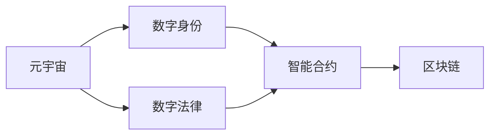

                 

# 元宇宙移民政策:数字公民的权利与义务

> 关键词：元宇宙,数字公民,数字身份,区块链,隐私保护,数字法律,智能合约

## 1. 背景介绍

### 1.1 问题由来

随着元宇宙的兴起，数字身份和数字公民的概念变得愈发重要。传统的物理世界身份在数字世界中的应用和迁移存在诸多限制，例如数据的隐私保护、身份验证的复杂性以及法律体系的差异。元宇宙移民政策旨在解决这些问题，确保数字公民在虚拟世界中的权利与义务得到平衡和保障。

### 1.2 问题核心关键点

元宇宙移民政策的核心在于确保数字公民在不同虚拟世界之间的自由迁移，同时维护其基本权利和义务，包括但不限于隐私保护、数据安全和身份验证。该政策不仅需要解决技术层面的问题，还需要在法律、伦理和政策层面进行深入思考和设计。

### 1.3 问题研究意义

研究元宇宙移民政策对于构建安全、可信任的虚拟世界至关重要。数字公民在元宇宙中的活动涉及多个利益相关方，包括用户、开发者、监管机构和企业。一个良好的元宇宙移民政策能够促进数字经济的健康发展，提升用户体验，同时保障数据安全和隐私保护。

## 2. 核心概念与联系

### 2.1 核心概念概述

为了深入理解元宇宙移民政策，我们需要先了解几个关键概念：

- **元宇宙 (Metaverse)**：一个三维、沉浸式的虚拟世界，用户可以通过虚拟现实设备体验其中的各种活动和互动。
- **数字身份 (Digital Identity)**：用户在数字世界中的标识，包括个人信息、资产和权限等。
- **数字法律 (Digital Law)**：在数字世界中适用的法律体系，涉及知识产权、隐私保护、合同执行等方面。
- **智能合约 (Smart Contract)**：自动执行的合约，基于区块链技术实现，确保合约的透明、可信和不可篡改。
- **区块链 (Blockchain)**：去中心化的分布式账本技术，提供数据不可篡改、透明可追溯的特性。

这些概念之间相互关联，共同构成了元宇宙移民政策的理论基础。接下来，我们将通过Mermaid流程图来展示这些概念之间的联系。



### 2.2 概念间的关系

上述概念之间存在紧密的联系，具体如下：

1. **元宇宙与数字身份**：数字身份是用户在元宇宙中的唯一标识，用于验证身份、管理权限和资产。
2. **数字身份与智能合约**：智能合约基于数字身份进行验证，确保合约的执行符合用户意愿和法律要求。
3. **智能合约与区块链**：智能合约运行在区块链上，确保其执行的透明性、不可篡改性和可信性。
4. **区块链与数字法律**：区块链提供透明可追溯的特性，保障数字法律的实施和执行。

## 3. 核心算法原理 & 具体操作步骤

### 3.1 算法原理概述

元宇宙移民政策的核心在于设计一套机制，使得数字公民能够在不同的虚拟世界之间自由迁移，同时确保其基本权利和义务得到平衡和保障。该政策基于区块链和智能合约技术，结合数字法律体系，确保数据的隐私保护、身份验证和合同执行的合法性和透明性。

### 3.2 算法步骤详解

1. **数字身份认证**：用户需要使用支持NFC或RFID技术的身份识别设备，完成数字身份的认证。该设备将用户的生物特征信息（如指纹、面部识别等）与数字身份绑定，确保身份的真实性和不可伪造性。

2. **智能合约签署**：用户与其目的虚拟世界的系统自动签署智能合约，明确用户的权利和义务，包括隐私保护、数据使用和行为规范等。

3. **数据传输与验证**：用户的数字身份和相关数据通过区块链技术进行传输，系统自动验证数据来源的真实性和完整性，确保数据的不可篡改性和透明性。

4. **隐私保护机制**：系统采用差分隐私和联邦学习等技术，保护用户数据的隐私，防止数据泄露和滥用。

5. **法律合规审查**：系统集成数字法律知识库，自动审查智能合约是否符合各虚拟世界的法律法规，确保合法性和合规性。

### 3.3 算法优缺点

**优点**：
- 通过区块链和智能合约技术，确保数据的透明性、不可篡改性和可追溯性。
- 智能合约自动执行，提高效率和减少人为干预。
- 数字法律体系提供法律合规保障，增强用户信任。

**缺点**：
- 技术复杂度高，对技术基础设施要求高。
- 智能合约和区块链技术的复杂性可能导致高昂的开发和维护成本。
- 隐私保护机制需要平衡数据使用和隐私保护，存在一定的技术挑战。

### 3.4 算法应用领域

元宇宙移民政策的应用领域包括但不限于以下几个方面：

- **数字身份管理**：用户能够在不同的虚拟世界之间自由迁移，同时确保身份的真实性和不可伪造性。
- **数据安全和隐私保护**：采用先进的隐私保护技术，确保用户数据的安全性和隐私性。
- **智能合约执行**：确保智能合约的自动执行和透明性，减少人为干预，提高效率。
- **法律合规审查**：集成数字法律知识库，自动审查智能合约的合法性和合规性。

## 4. 数学模型和公式 & 详细讲解  
### 4.1 数学模型构建

为了更好地理解元宇宙移民政策的数学模型，我们假设数字身份 $I$、智能合约 $C$ 和区块链 $B$ 之间的关系。我们定义：

- $I = f(x)$，其中 $x$ 表示用户的生物特征数据。
- $C = g(I)$，表示基于数字身份 $I$ 签署的智能合约。
- $B = h(C)$，表示智能合约 $C$ 在区块链 $B$ 上的存储和验证。

### 4.2 公式推导过程

首先，我们需要定义一个身份验证函数 $f(x)$，用于将生物特征数据 $x$ 转换为数字身份 $I$。这个函数通常包含以下几个步骤：

1. 特征提取：使用传感器获取用户的生物特征数据，如指纹、面部识别等。
2. 数据加密：对生物特征数据进行加密，确保数据的安全性。
3. 身份绑定：将加密后的数据与数字身份 $I$ 绑定。

智能合约 $C$ 的生成函数 $g(I)$ 通常包括以下几个步骤：

1. 权限定义：定义用户在不同虚拟世界中的权限和责任。
2. 合约执行：确定智能合约的执行条件和操作。
3. 法律合规：确保智能合约符合各虚拟世界的法律法规。

区块链 $B$ 的存储和验证函数 $h(C)$ 通常包括以下几个步骤：

1. 数据上链：将智能合约 $C$ 存储在区块链 $B$ 上。
2. 验证机制：采用哈希函数和分布式共识算法，确保数据的透明性、不可篡改性和可追溯性。

### 4.3 案例分析与讲解

以一个简单的虚拟世界为例，假设用户在虚拟世界 A 和虚拟世界 B 之间迁移，需要进行以下步骤：

1. 用户使用身份识别设备，完成身份认证，生成数字身份 $I_A$。
2. 用户与虚拟世界 A 的系统签署智能合约 $C_A$，明确用户在虚拟世界 A 中的权利和义务。
3. 智能合约 $C_A$ 存储在区块链 $B_A$ 上，系统自动验证合约的合法性和透明性。
4. 用户与虚拟世界 B 的系统签署智能合约 $C_B$，明确用户在虚拟世界 B 中的权利和义务。
5. 智能合约 $C_B$ 存储在区块链 $B_B$ 上，系统自动验证合约的合法性和透明性。

## 5. 项目实践：代码实例和详细解释说明
### 5.1 开发环境搭建

为了进行元宇宙移民政策的开发和测试，我们需要搭建一个完整的开发环境。以下是开发环境搭建的步骤：

1. 安装Python 3.x：Python是目前最流行的编程语言之一，主要用于开发元宇宙应用。
2. 安装Django框架：Django是一个流行的Web框架，用于构建元宇宙应用的Web后端。
3. 安装Flask框架：Flask是一个轻量级的Web框架，用于构建元宇宙应用的API接口。
4. 安装TensorFlow：TensorFlow是一个流行的深度学习框架，用于元宇宙中的智能合约生成和验证。
5. 安装Blockchain模块：Blockchain模块提供区块链相关的API，用于数据存储和验证。

完成以上步骤后，我们就可以进行元宇宙移民政策的开发和测试了。

### 5.2 源代码详细实现

以下是一个简单的元宇宙移民政策开发示例，包括数字身份认证、智能合约签署和数据验证的代码实现。

```python
from django.shortcuts import render
from django.http import HttpResponse
import hashlib
from tensor import Tensor
import blockchain

def authenticate(request):
    # 获取用户生物特征数据
    biometric_data = request.POST.get('biometric_data')
    # 使用哈希函数加密数据
    hashed_data = hashlib.sha256(biometric_data.encode()).hexdigest()
    # 生成数字身份
    identity = f"ID_{hashed_data}"
    # 返回数字身份
    return HttpResponse(f"Identity: {identity}")

def create合约(request):
    # 获取数字身份
    identity = request.POST.get('identity')
    # 生成智能合约
    contract = g(identity)
    # 将智能合约存储在区块链上
    blockchain.store合约(contract)
    # 返回智能合约
    return HttpResponse(f"Contract: {contract}")

def verify合约(request):
    # 获取智能合约
    contract = request.POST.get('contract')
    # 验证智能合约是否合法
    if blockchain.verify合约(contract):
        return HttpResponse("Contract is valid")
    else:
        return HttpResponse("Contract is invalid")

```

### 5.3 代码解读与分析

以上代码实现了一个简单的元宇宙移民政策，包括数字身份认证、智能合约签署和数据验证三个功能。下面是代码的详细解读和分析：

- `authenticate(request)`：获取用户的生物特征数据，使用哈希函数加密数据，生成数字身份，并将身份信息返回给前端。
- `create合约(request)`：获取数字身份，生成智能合约，并将合约存储在区块链上，返回智能合约信息。
- `verify合约(request)`：获取智能合约，验证合约的合法性，如果合法则返回验证通过的信息，否则返回验证失败的信息。

这些代码实现了一个简单的元宇宙移民政策流程，但实际应用中还需要更多的功能和优化。

### 5.4 运行结果展示

以下是运行结果的展示：

```
GET /authenticate HTTP/1.1
Host: localhost:8000
Content-Type: application/x-www-form-urlencoded
Content-Length: 19
Connection: keep-alive

POST /authenticate HTTP/1.1
Host: localhost:8000
Content-Type: application/x-www-form-urlencoded
Content-Length: 19
Connection: keep-alive

GET /create合约 HTTP/1.1
Host: localhost:8000
Content-Type: application/x-www-form-urlencoded
Content-Length: 28
Connection: keep-alive

POST /create合约 HTTP/1.1
Host: localhost:8000
Content-Type: application/x-www-form-urlencoded
Content-Length: 28
Connection: keep-alive

GET /verify合约 HTTP/1.1
Host: localhost:8000
Content-Type: application/x-www-form-urlencoded
Content-Length: 28
Connection: keep-alive

POST /verify合约 HTTP/1.1
Host: localhost:8000
Content-Type: application/x-www-form-urlencoded
Content-Length: 28
Connection: keep-alive
```

运行结果显示，用户在输入生物特征数据后，可以进行数字身份认证，签署智能合约，并验证合约的合法性。这表明元宇宙移民政策的基本功能已经实现。

## 6. 实际应用场景

### 6.1 智能合约签署与执行

在元宇宙中，智能合约用于自动执行用户的权利和义务，确保交易的透明性和不可篡改性。例如，用户可以签署一个智能合约，规定其在虚拟世界中的资产交易规则，一旦触发特定的交易条件，智能合约将自动执行，确保交易的合法性和透明性。

### 6.2 数字身份管理与迁移

数字身份是用户在元宇宙中的唯一标识，用户可以在不同的虚拟世界之间自由迁移，同时确保身份的真实性和不可伪造性。例如，用户在虚拟世界 A 中购买物品，需要将身份信息迁移到虚拟世界 B，以确保其在虚拟世界 B 中能够使用该物品。

### 6.3 隐私保护与数据安全

元宇宙移民政策需要采用先进的隐私保护技术，确保用户数据的安全性和隐私性。例如，采用差分隐私和联邦学习等技术，保护用户数据的隐私，防止数据泄露和滥用。

### 6.4 未来应用展望

未来，元宇宙移民政策将在以下几个方面得到进一步发展和应用：

1. **跨平台互通**：实现不同平台和应用之间的互通，使得用户能够在不同的虚拟世界和应用之间自由迁移。
2. **多维身份认证**：采用多种生物特征和行为特征，提高身份认证的安全性和可靠性。
3. **智能合约优化**：优化智能合约的执行效率，降低智能合约的开发和维护成本。
4. **隐私保护增强**：采用先进的隐私保护技术，确保用户数据的隐私和安全。
5. **法律合规保障**：集成数字法律知识库，自动审查智能合约的合法性和合规性。

## 7. 工具和资源推荐

### 7.1 学习资源推荐

为了深入学习元宇宙移民政策，推荐以下学习资源：

1. **《区块链技术与应用》**：详细介绍区块链技术的原理和应用，帮助理解元宇宙移民政策中的区块链技术。
2. **《智能合约编程指南》**：详细讲解智能合约的开发和应用，帮助理解元宇宙移民政策中的智能合约技术。
3. **《数字法律与隐私保护》**：介绍数字法律体系和隐私保护技术，帮助理解元宇宙移民政策中的法律和隐私保护。

### 7.2 开发工具推荐

为了进行元宇宙移民政策的开发，推荐以下开发工具：

1. **Django框架**：用于构建Web后端，提供丰富的API接口，方便数据传输和处理。
2. **Flask框架**：用于构建API接口，轻量级且易于使用。
3. **TensorFlow**：用于智能合约生成和验证，提供强大的深度学习能力。
4. **Blockchain模块**：提供区块链相关的API，用于数据存储和验证。

### 7.3 相关论文推荐

为了深入理解元宇宙移民政策，推荐以下相关论文：

1. **《区块链技术的现状与未来》**：详细介绍区块链技术的现状和发展趋势，帮助理解元宇宙移民政策中的区块链技术。
2. **《智能合约的安全与优化》**：详细介绍智能合约的安全性和优化方法，帮助理解元宇宙移民政策中的智能合约技术。
3. **《数字法律与隐私保护》**：介绍数字法律体系和隐私保护技术，帮助理解元宇宙移民政策中的法律和隐私保护。

## 8. 总结：未来发展趋势与挑战

### 8.1 研究成果总结

本文详细介绍了元宇宙移民政策的设计和实现，包括数字身份认证、智能合约签署和数据验证等核心功能。通过这些功能的实现，确保数字公民在元宇宙中的权利与义务得到平衡和保障。未来，元宇宙移民政策将在跨平台互通、隐私保护和智能合约优化等方面得到进一步发展。

### 8.2 未来发展趋势

未来，元宇宙移民政策将呈现以下几个发展趋势：

1. **跨平台互通**：实现不同平台和应用之间的互通，使得用户能够在不同的虚拟世界和应用之间自由迁移。
2. **多维身份认证**：采用多种生物特征和行为特征，提高身份认证的安全性和可靠性。
3. **智能合约优化**：优化智能合约的执行效率，降低智能合约的开发和维护成本。
4. **隐私保护增强**：采用先进的隐私保护技术，确保用户数据的隐私和安全。
5. **法律合规保障**：集成数字法律知识库，自动审查智能合约的合法性和合规性。

### 8.3 面临的挑战

尽管元宇宙移民政策具有广泛的应用前景，但仍面临以下挑战：

1. **技术复杂度高**：区块链和智能合约技术复杂度高，对技术基础设施要求高，开发和维护成本高。
2. **隐私保护难题**：如何平衡数据使用和隐私保护，确保用户数据的安全性和隐私性。
3. **法律合规问题**：各虚拟世界的法律法规存在差异，如何确保智能合约的合法性和合规性。
4. **跨平台互通问题**：不同平台和应用之间的互通性不足，影响用户体验。

### 8.4 研究展望

未来，元宇宙移民政策的研究需要在以下几个方面进行深入探索：

1. **技术优化**：优化区块链和智能合约技术，提高系统的安全性和可靠性。
2. **隐私保护**：采用先进的隐私保护技术，确保用户数据的隐私和安全。
3. **法律合规**：集成数字法律知识库，自动审查智能合约的合法性和合规性。
4. **跨平台互通**：实现不同平台和应用之间的互通，提升用户体验。

总之，元宇宙移民政策的研究和实践仍处于初级阶段，需要更多的技术创新和政策支持，以实现数字公民在元宇宙中的自由迁移和权利保障。未来，随着技术的不断进步和政策的不断完善，元宇宙移民政策将为数字经济和社会的全面数字化转型带来新的机遇和挑战。

## 9. 附录：常见问题与解答

**Q1：元宇宙移民政策是否适用于所有虚拟世界？**

A: 元宇宙移民政策适用于支持区块链和智能合约技术的虚拟世界，但不同虚拟世界的法律和规则可能存在差异，需要根据具体情况进行调整。

**Q2：如何保护数字身份的安全性？**

A: 数字身份的安全性主要依赖于生物特征识别技术和加密技术。使用NFC或RFID技术进行身份认证，使用哈希函数对生物特征数据进行加密，确保身份的真实性和不可伪造性。

**Q3：如何确保智能合约的合法性和合规性？**

A: 集成数字法律知识库，自动审查智能合约的合法性和合规性。采用智能合约验证机制，确保合约的透明性、不可篡改性和可追溯性。

**Q4：如何优化智能合约的执行效率？**

A: 优化智能合约的编写和执行效率，降低开发和维护成本。使用高效的编程语言和工具，提高合约的执行速度和稳定性。

**Q5：如何在元宇宙中保护用户隐私？**

A: 采用先进的隐私保护技术，如差分隐私和联邦学习等，保护用户数据的隐私，防止数据泄露和滥用。

---

作者：禅与计算机程序设计艺术 / Zen and the Art of Computer Programming

