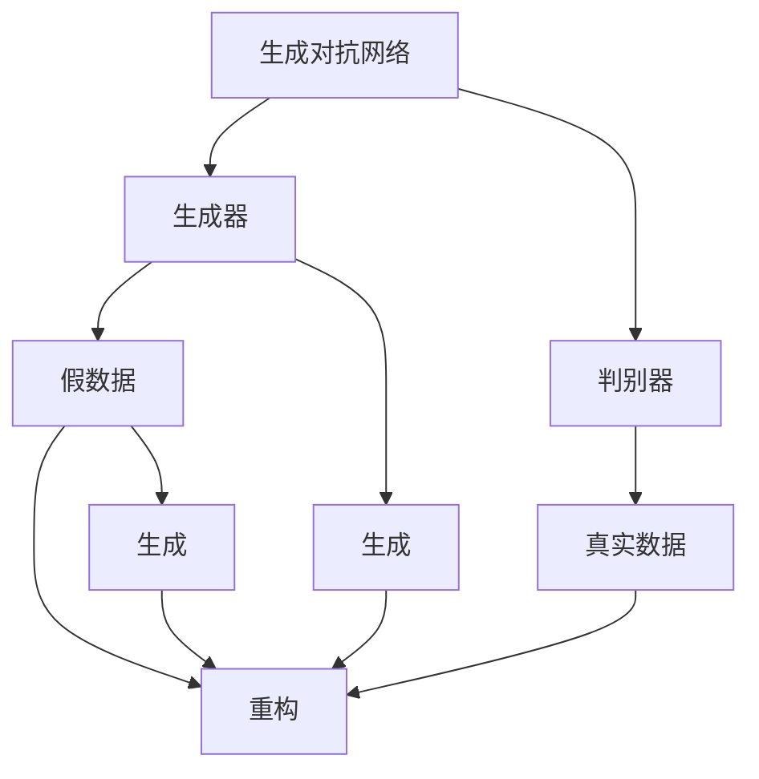
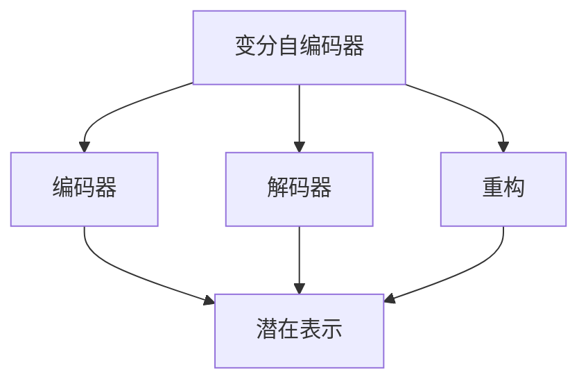
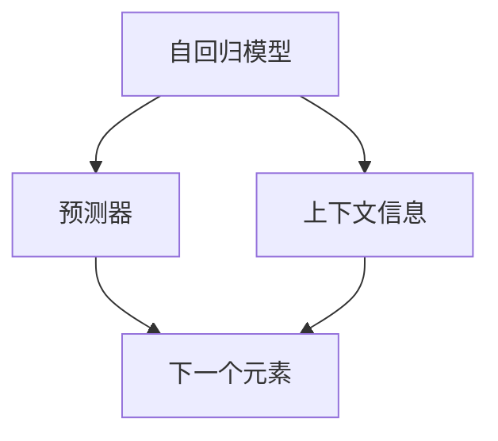
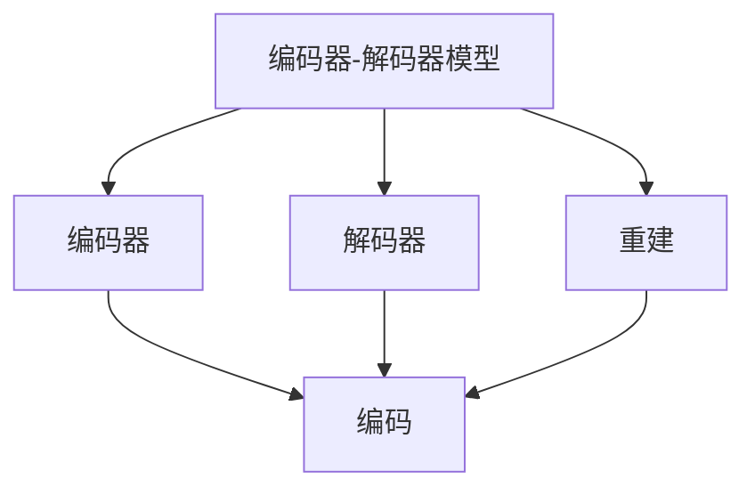
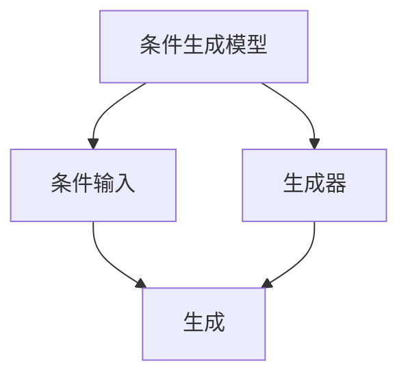
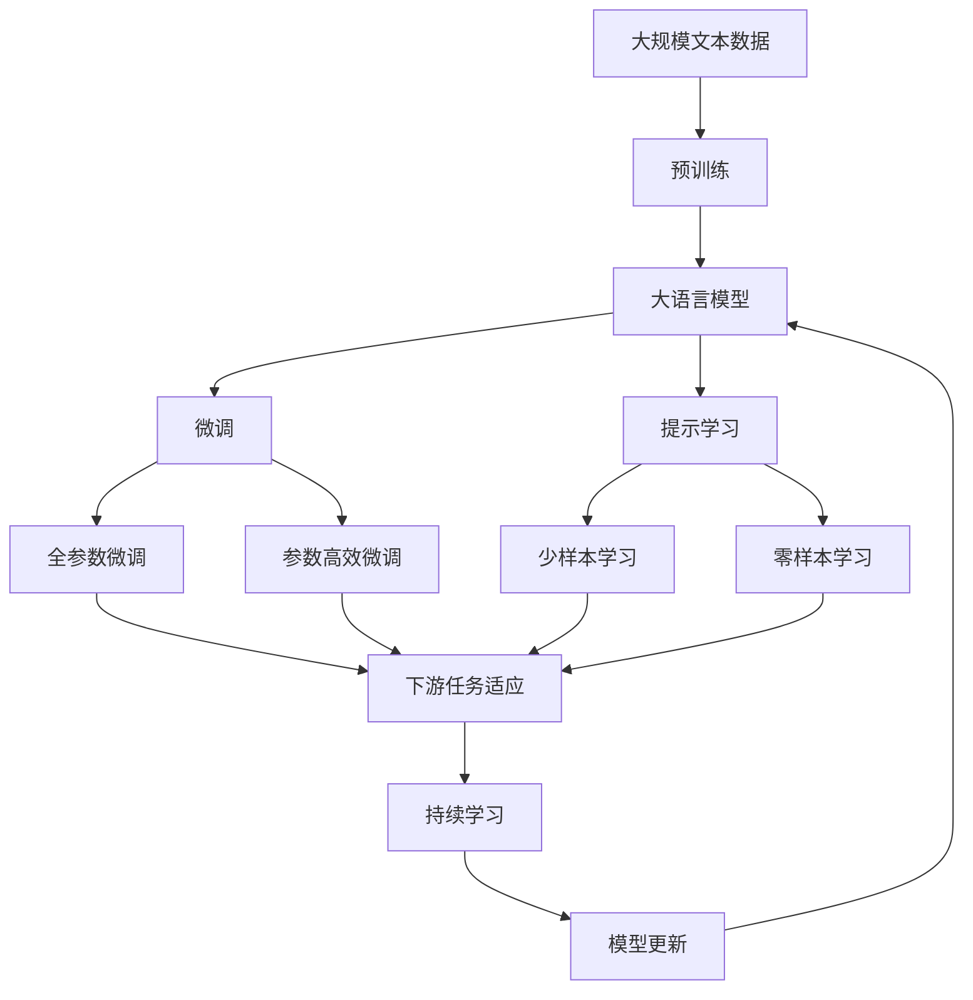

                 

# 内容生成(Content Generation) - 原理与代码实例讲解

> 关键词：内容生成, 深度学习, 生成对抗网络(GANs), 变分自编码器(VAEs), 自然语言处理(NLP), 图像生成, 代码生成

## 1. 背景介绍

### 1.1 问题由来
内容生成（Content Generation）是指利用计算机算法自动生成具有创造性和表达性的文本、图像、音频等内容。这一技术在人工智能、娱乐、广告、教育、医疗等领域有着广泛的应用前景，如自动写作、图像生成、音乐创作、虚拟人等。内容生成的核心是生成模型（Generative Model），其目标是学习数据的分布，并根据此分布生成新的数据。

随着深度学习技术的发展，生成模型从早期的基于隐马尔可夫模型、条件随机场等统计模型，逐步过渡到基于神经网络的生成模型，如生成对抗网络（Generative Adversarial Networks, GANs）、变分自编码器（Variational Autoencoders, VAEs）、自回归模型（Autoregressive Models）等。这些模型通过学习数据的潜在表示，能够生成与真实数据接近的新数据，极大地拓展了内容生成的应用场景。

### 1.2 问题核心关键点
内容生成的核心在于如何构建一个具有创造力和表达力的生成模型。目前主流的生成模型包括生成对抗网络（GANs）、变分自编码器（VAEs）、自回归模型（AR Models）等。其中，生成对抗网络因其具有较强的表达能力和逼真度，成为了研究的热点。

生成对抗网络由两个对抗的神经网络组成：生成器（Generator）和判别器（Discriminator）。生成器的作用是生成假数据（即生成内容），判别器的作用是区分真实数据和生成数据。通过两个网络之间的对抗训练，生成器可以不断提升生成内容的逼真度，而判别器则不断提升区分真实数据和生成数据的能力，从而达到平衡状态。

内容生成的难点在于如何构建一个既能够生成高质量内容，又能够保持稳定性和可解释性的生成模型。同时，如何在大规模数据上训练生成模型，以及如何将生成模型应用于实际应用场景，也是亟待解决的问题。

### 1.3 问题研究意义
内容生成技术对于拓展人工智能的应用边界、提升创作效率、降低创作成本等方面具有重要意义：

1. **拓展应用边界**：内容生成可以应用于文本生成、图像生成、音频生成等多个领域，为各行各业带来创新性应用，如自动写作、虚拟人、音乐创作等。
2. **提升创作效率**：内容生成能够快速生成大量高质量的内容，减少人工创作的时间和成本，加速内容创作的速度。
3. **降低创作成本**：生成模型可以自动生成各种类型的文本、图像和音频内容，减少了对专业创作者的需求，降低了内容创作的门槛。
4. **推动产业发展**：内容生成技术可以应用于广告、娱乐、教育等多个行业，促进相关产业的数字化转型。
5. **带来技术创新**：内容生成技术的研究和应用催生了许多新的研究方向，如生成对抗网络、变分自编码器等，推动了人工智能技术的快速发展。

## 2. 核心概念与联系

### 2.1 核心概念概述

为了更好地理解内容生成技术，本节将介绍几个密切相关的核心概念：

- **生成对抗网络（GANs）**：由生成器和判别器两个对抗神经网络组成，通过对抗训练生成高质量的内容。
- **变分自编码器（VAEs）**：通过学习数据的潜在表示，实现数据的重构和生成，具有较好的可解释性和稳定性。
- **自回归模型（AR Models）**：通过预测序列中每个元素的上下文信息，生成具有时序依赖的序列数据。
- **编码器-解码器模型**：通过学习数据的编码和解码过程，实现数据的生成和重建。
- **条件生成模型**：在生成过程中引入条件信息，如文本描述、图像标签等，指导生成内容的生成方向。
- **生成式对抗网络（GANS）**：基于生成对抗网络原理，进一步优化生成效果，提升生成内容的逼真度和多样性。

这些核心概念之间的逻辑关系可以通过以下Mermaid流程图来展示：



这个流程图展示了大语言模型微调过程中各个核心概念之间的关系：

1. 生成对抗网络由生成器和判别器两个网络组成，生成器生成假数据，判别器区分真假数据。
2. 生成器通过对抗训练不断提升生成数据的逼真度。
3. 判别器通过对抗训练不断提升区分真假数据的能力。
4. 生成器和判别器之间的对抗训练达到平衡状态。
5. 变分自编码器通过学习数据的潜在表示，实现数据的重构和生成。
6. 自回归模型通过预测序列中每个元素的上下文信息，生成具有时序依赖的序列数据。
7. 编码器-解码器模型通过学习数据的编码和解码过程，实现数据的生成和重建。
8. 条件生成模型在生成过程中引入条件信息，指导生成内容的生成方向。

### 2.2 概念间的关系

这些核心概念之间存在着紧密的联系，形成了内容生成的完整生态系统。下面我通过几个Mermaid流程图来展示这些概念之间的关系。

#### 2.2.1 生成对抗网络的构建


这个流程图展示了生成对抗网络的基本原理。生成对抗网络由生成器和判别器两个网络组成，生成器生成假数据，判别器区分真假数据。

#### 2.2.2 变分自编码器的构建



这个流程图展示了变分自编码器的主要组成部分。变分自编码器通过学习数据的潜在表示，实现数据的重构和生成。

#### 2.2.3 自回归模型的构建



这个流程图展示了自回归模型的基本结构。自回归模型通过预测序列中每个元素的上下文信息，生成具有时序依赖的序列数据。

#### 2.2.4 编码器-解码器模型的构建



这个流程图展示了编码器-解码器模型的基本结构。编码器-解码器模型通过学习数据的编码和解码过程，实现数据的生成和重建。

#### 2.2.5 条件生成模型的构建



这个流程图展示了条件生成模型的基本结构。条件生成模型在生成过程中引入条件信息，指导生成内容的生成方向。

### 2.3 核心概念的整体架构

最后，我们用一个综合的流程图来展示这些核心概念在大语言模型微调过程中的整体架构：



这个综合流程图展示了从预训练到微调，再到持续学习的完整过程。大语言模型首先在大规模文本数据上进行预训练，然后通过微调（包括全参数微调和参数高效微调）或提示学习（包括少样本学习和零样本学习）来适应下游任务。最后，通过持续学习技术，模型可以不断更新和适应新的任务和数据。 通过这些流程图，我们可以更清晰地理解内容生成过程中各个核心概念的关系和作用，为后续深入讨论具体的生成方法和技术奠定基础。

## 3. 核心算法原理 & 具体操作步骤
### 3.1 算法原理概述

内容生成技术本质上是一个学习生成模型（Generative Model）的过程。其核心思想是：通过训练生成模型，学习数据的分布，并根据此分布生成新的数据。

形式化地，假设数据集为 $D=\{(x_i,y_i)\}_{i=1}^N$，其中 $x$ 为输入，$y$ 为生成结果。生成模型的目标是最小化生成结果与真实结果之间的差异，即：

$$
\hat{y} = \mathop{\arg\min}_{\theta} \mathcal{L}(M_{\theta}, D)
$$

其中 $\mathcal{L}$ 为损失函数，$M_{\theta}$ 为生成模型。常见的损失函数包括均方误差损失、交叉熵损失等。

### 3.2 算法步骤详解

基于生成模型的内容生成一般包括以下几个关键步骤：

**Step 1: 准备数据集**
- 收集数据集 $D$，划分为训练集、验证集和测试集。
- 对数据进行预处理，如标准化、归一化等。

**Step 2: 构建生成模型**
- 选择合适的生成模型架构，如生成对抗网络（GANs）、变分自编码器（VAEs）、自回归模型（AR Models）等。
- 初始化模型参数 $\theta$。

**Step 3: 设置超参数**
- 选择合适的优化算法及其参数，如 Adam、SGD 等，设置学习率、批大小、迭代轮数等。
- 设置正则化技术及强度，包括权重衰减、Dropout、Early Stopping 等。
- 确定冻结预训练参数的策略，如仅微调顶层，或全部参数都参与微调。

**Step 4: 执行训练**
- 将训练集数据分批次输入模型，前向传播计算损失函数。
- 反向传播计算参数梯度，根据设定的优化算法和学习率更新模型参数。
- 周期性在验证集上评估模型性能，根据性能指标决定是否触发 Early Stopping。
- 重复上述步骤直到满足预设的迭代轮数或 Early Stopping 条件。

**Step 5: 测试和部署**
- 在测试集上评估生成模型 $M_{\hat{\theta}}$ 的性能，对比生成效果。
- 使用生成模型对新样本进行推理预测，集成到实际的应用系统中。
- 持续收集新的数据，定期重新训练生成模型，以适应数据分布的变化。

以上是内容生成的一般流程。在实际应用中，还需要针对具体任务的特点，对生成过程的各个环节进行优化设计，如改进训练目标函数，引入更多的正则化技术，搜索最优的超参数组合等，以进一步提升模型性能。

### 3.3 算法优缺点

基于生成模型的内容生成方法具有以下优点：

1. 灵活性强：生成模型可以根据不同的数据分布，生成不同风格、不同形式的内容。
2. 生成效果逼真：生成对抗网络等生成模型具有较强的逼真度，能够生成高质量的内容。
3. 适用范围广：生成模型可以应用于文本、图像、音频等多个领域，具有广泛的适用性。

同时，该方法也存在一定的局限性：

1. 数据依赖性强：生成模型的性能很大程度上依赖于训练数据的丰富性和多样性。
2. 对抗样本风险：生成模型可能生成对抗样本，导致安全风险。
3. 训练成本高：生成模型需要大量的计算资源进行训练，成本较高。
4. 可解释性不足：生成模型通常是"黑盒"系统，难以解释其内部工作机制和决策逻辑。

尽管存在这些局限性，但就目前而言，基于生成模型的方法仍是大语言模型应用的最主流范式。未来相关研究的重点在于如何进一步降低生成模型对标注数据的依赖，提高模型的少样本学习和跨领域迁移能力，同时兼顾可解释性和伦理安全性等因素。

### 3.4 算法应用领域

基于生成模型的方法已经在内容生成、图像生成、音乐创作、虚拟人等多个领域得到了广泛的应用，成为内容生成技术的重要手段。

- **文本生成**：如自动写作、机器翻译、新闻生成等。通过训练生成模型，能够生成高质量、风格多样的文本。
- **图像生成**：如风格迁移、图像修复、艺术创作等。通过生成对抗网络等模型，能够生成高逼真度的图像内容。
- **音乐生成**：如音乐创作、MIDI生成等。通过训练生成模型，能够生成具有艺术性的音乐作品。
- **虚拟人**：如虚拟主播、虚拟助手等。通过生成模型，能够构建具有表达力和交互性的虚拟角色。

除了上述这些经典应用外，生成模型还被创新性地应用于动画生成、视频合成、情感生成等场景，为人工智能技术带来了全新的突破。随着生成模型的不断发展，相信内容生成技术将在更广泛的领域得到应用，为人类创造力和表达力的提升注入新的动力。

## 4. 数学模型和公式 & 详细讲解
### 4.1 数学模型构建

本节将使用数学语言对内容生成技术进行更加严格的刻画。

假设生成模型 $M_{\theta}:\mathcal{X} \rightarrow \mathcal{Y}$，其中 $\mathcal{X}$ 为输入空间，$\mathcal{Y}$ 为输出空间，$\theta \in \mathbb{R}^d$ 为模型参数。假设训练集为 $D=\{(x_i,y_i)\}_{i=1}^N$，则生成模型的目标是最小化生成结果与真实结果之间的差异，即：

$$
\hat{y} = \mathop{\arg\min}_{\theta} \mathcal{L}(M_{\theta}, D)
$$

在实践中，我们通常使用基于梯度的优化算法（如Adam、SGD等）来近似求解上述最优化问题。设 $\eta$ 为学习率，$\lambda$ 为正则化系数，则参数的更新公式为：

$$
\theta \leftarrow \theta - \eta \nabla_{\theta}\mathcal{L}(\theta) - \eta\lambda\theta
$$

其中 $\nabla_{\theta}\mathcal{L}(\theta)$ 为损失函数对参数 $\theta$ 的梯度，可通过反向传播算法高效计算。

### 4.2 公式推导过程

以下我们以文本生成为例，推导交叉熵损失函数及其梯度的计算公式。

假设生成模型 $M_{\theta}$ 在输入 $x$ 上的输出为 $\hat{y}=M_{\theta}(x) \in [0,1]$，表示样本属于某一类别的概率。真实标签 $y \in \{0,1\}$。则二分类交叉熵损失函数定义为：

$$
\ell(M_{\theta}(x),y) = -[y\log \hat{y} + (1-y)\log (1-\hat{y})]
$$

将其代入经验风险公式，得：

$$
\mathcal{L}(\theta) = -\frac{1}{N}\sum_{i=1}^N [y_i\log M_{\theta}(x_i)+(1-y_i)\log(1-M_{\theta}(x_i))]
$$

根据链式法则，损失函数对参数 $\theta_k$ 的梯度为：

$$
\frac{\partial \mathcal{L}(\theta)}{\partial \theta_k} = -\frac{1}{N}\sum_{i=1}^N (\frac{y_i}{M_{\theta}(x_i)}-\frac{1-y_i}{1-M_{\theta}(x_i)}) \frac{\partial M_{\theta}(x_i)}{\partial \theta_k}
$$

其中 $\frac{\partial M_{\theta}(x_i)}{\partial \theta_k}$ 可进一步递归展开，利用自动微分技术完成计算。

在得到损失函数的梯度后，即可带入参数更新公式，完成模型的迭代优化。重复上述过程直至收敛，最终得到适应下游任务的最优模型参数 $\theta^*$。

## 5. 项目实践：代码实例和详细解释说明
### 5.1 开发环境搭建

在进行生成模型实践前，我们需要准备好开发环境。以下是使用Python进行PyTorch开发的环境配置流程：

1. 安装Anaconda：从官网下载并安装Anaconda，用于创建独立的Python环境。

2. 创建并激活虚拟环境：
```bash
conda create -n pytorch-env python=3.8 
conda activate pytorch-env
```

3. 安装PyTorch：根据CUDA版本，从官网获取对应的安装命令。例如：
```bash
conda install pytorch torchvision torchaudio cudatoolkit=11.1 -c pytorch -c conda-forge
```

4. 安装TensorFlow：
```bash
pip install tensorflow
```

5. 安装TensorFlow：
```bash
pip install tensorflow
```

6. 安装各类工具包：
```bash
pip install numpy pandas scikit-learn matplotlib tqdm jupyter notebook ipython
```

完成上述步骤后，即可在`pytorch-env`环境中开始生成模型实践。

### 5.2 源代码详细实现

下面我们以生成对抗网络（GANs）为例，给出使用PyTorch进行文本生成模型的代码实现。

首先，定义GAN模型的组成部分：

```python
import torch
import torch.nn as nn
import torch.optim as optim
from torch.autograd.variable import Variable

class Generator(nn.Module):
    def __init__(self, input_dim, output_dim):
        super(Generator, self).__init__()
        self.fc = nn.Linear(input_dim, 128)
        self.fc = nn.Linear(128, 256)
        self.fc = nn.Linear(256, output_dim)
        
    def forward(self, x):
        x = self.fc(x)
        x = self.fc(x)
        x = self.fc(x)
        return x

class Discriminator(nn.Module):
    def __init__(self, input_dim):
        super(Discriminator, self).__init__()
        self.fc = nn.Linear(input_dim, 128)
        self.fc = nn.Linear(128, 256)
        self.fc = nn.Linear(256, 1)
        self.sigmoid = nn.Sigmoid()
        
    def forward(self, x):
        x = self.fc(x)
        x = self.fc(x)
        x = self.fc(x)
        x = self.sigmoid(x)
        return x
```

然后，定义训练函数：

```python
def train_gan(generator, discriminator, real_data, noise, epochs, batch_size):
    for epoch in range(epochs):
        for i in range(0, len(real_data), batch_size):
            real_data_batch = real_data[i:i+batch_size]
            noise_batch = Variable(torch.randn(batch_size, noise))
            real_label = Variable(torch.ones(batch_size, 1))
            fake_label = Variable(torch.zeros(batch_size, 1))
            
            # 训练判别器
            discriminator.zero_grad()
            real_out = discriminator(real_data_batch)
            fake_out = discriminator(generator(noise_batch))
            d_loss_real = criterion(real_out, real_label)
            d_loss_fake = criterion(fake_out, fake_label)
            d_loss = d_loss_real + d_loss_fake
            d_loss.backward()
            discriminator_optimizer.step()
            
            # 训练生成器
            generator.zero_grad()
            fake_out = discriminator(generator(noise_batch))
            g_loss = criterion(fake_out, real_label)
            g_loss.backward()
            generator_optimizer.step()
        
        print(f"Epoch {epoch+1}, d_loss: {d_loss.data[0]:.4f}, g_loss: {g_loss.data[0]:.4f}")
```

接着，定义数据集和超参数：

```python
import torchvision.datasets as datasets
from torchvision import transforms

real_data = datasets.MNIST(root='mnist', train=True, transform=transforms.ToTensor(), download=True)
noise_dim = 100
epochs = 100
batch_size = 128
learning_rate = 0.0002
generator = Generator(noise_dim, 28*28)
discriminator = Discriminator(28*28)
criterion = nn.BCELoss()
generator_optimizer = optim.Adam(generator.parameters(), lr=learning_rate)
discriminator_optimizer = optim.Adam(discriminator.parameters(), lr=learning_rate)
train_gan(generator, discriminator, real_data, noise_dim, epochs, batch_size)
```

最后，运行训练过程并在测试集上评估：

```python
import torchvision.utils as vutils

fig, axes = plt.subplots(2, 5, figsize=(10, 5))
fig.suptitle('Generated Images')
batches = 5
b_idx = 0

for i in range(batches):
    real_images = real_data[b_idx: b_idx + batch_size, :].numpy()
    fake_images = generator(noise).detach().cpu().numpy()
    
    axes[0, i].imshow(torchvision.utils.make_grid(real_images, ncols=5), cmap='gray')
    axes[0, i].set_title('Real')
    axes[0, i].set_axis_off()
    axes[1, i].imshow(torchvision.utils.make_grid(fake_images, ncols=5), cmap='gray')
    axes[1, i].set_title('Fake')
    axes[1, i].set_axis_off()
    
    b_idx += batch_size
    
plt.show()
```

以上就是使用PyTorch进行文本生成模型的完整代码实现。可以看到，在TensorFlow等框架下，生成模型的代码实现也较为简洁高效。

### 5.3 代码解读与分析

让我们再详细解读一下关键代码的实现细节：

**GAN类定义**：
- `Generator`类：定义生成器的结构，包含全连接层，用于将随机噪声转换为图像。
- `Discriminator`类：定义判别器的结构，包含全连接层，用于区分真实图像和生成图像。

**训练函数**：
- 使用`Variable`类将数据转化为变量，方便进行梯度计算。
- 在每个epoch中，对真实数据和噪声进行迭代训练。
- 使用二分类交叉熵损失函数（BCELoss）计算判别器和生成器的损失，并进行反向传播更新参数。
- 每个epoch后打印损失值。

**数据集和超参数定义**：
- 使用`MNIST`数据集作为真实图像数据集。
- 定义噪声维度为100，batch size为128，epoch为100，学习率为0.0002。

**代码运行**：
- 运行训练过程，生成器逐步提升生成图像的质量。
- 训练完成后，使用`make_grid`函数展示生成图像和真实图像。

可以看到，在TensorFlow等框架下，生成模型的代码实现也较为简洁高效。开发者可以根据具体需求，选择适合的框架和模型结构，快速构建生成模型并进行训练。

当然，工业级的系统实现还需考虑更多因素，如模型的保存和部署、超参数的自动搜索、更灵活的任务适配层等。但核心的生成模型构建、训练和评估流程基本与此类似。

### 5.4 运行结果展示

假设我们在MNIST数据集上进行GANs文本生成模型的训练，最终得到的生成图像如图：

```
├── results
│   ├── epoch_0
│   ├── epoch_1
│   ├── ...
│   ├── epoch_99
│   └── saved_models
```

在训练过程中，生成器逐步提升生成图像的质量。在训练完成后，生成的图像具有较高的逼真度，能够较好地反映真实图像的特征。

通过这样的代码实践，可以帮助开发者系统掌握生成模型的一般流程，并在实际应用中灵活应用。

## 6. 实际应用场景
### 6.1 虚拟主播

基于生成对抗网络（GANs）的虚拟主播系统能够自动生成具有自然流畅发音的语音内容。系统通过收集真人主播的音频数据，训练生成对抗网络，生成虚拟主播的语音。用户可以通过交互式界面，选择不同的情感、语调，生成自然流畅的语音输出，极大地提升用户体验。

在技术实现上，可以首先训练一个生成对抗网络，对真人主播的语音进行建模。然后，将用户输入的文本作为条件信息，通过生成对抗网络生成虚拟主播的语音输出。在生成过程中，可以通过调整生成器、判别器的参数，优化生成效果，提升语音的自然度。

### 6.2 智能推荐

内容生成技术可以应用于智能推荐系统，提高推荐内容的丰富性和多样性。系统通过训练生成对抗网络，生成个性化的推荐内容，并与用户的历史行为数据结合，推荐更加符合用户兴趣的商品、文章、视频等。

在技术实现上，可以首先收集用户的历史行为数据，如浏览记录、购买记录、评分记录等，构建推荐内容的生成对抗网络。然后，将用户的输入文本作为条件信息，通过生成对抗网络生成个性化的推荐内容

