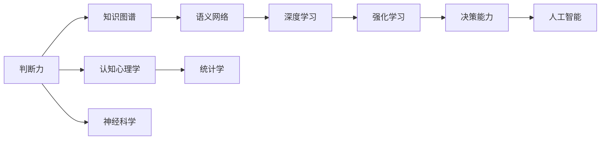

                 

# 判断力和处置复杂事件的决策能力：个人基于自身特质以及相关知识和经验形成观点并做出决定的能力

## 1. 背景介绍

在人工智能与机器学习领域，决策能力的构建和应用是一个核心议题。随着深度学习与强化学习技术的发展，决策能力的应用已经延伸到医疗、金融、安全等诸多领域。其中，判断力（判断和决策能力）尤为重要。决策能力不仅决定了人工智能系统的实际效果，也影响着人工智能能否与人类协同工作，构建具有高度智能的解决方案。

## 2. 核心概念与联系

### 2.1 核心概念概述

为深入探讨判断力和决策能力，本文将介绍几个关键概念：

- **判断力（Judgement）**：基于个人的知识和经验对复杂事件进行评估和决策的能力。判断力涉及认知心理学、神经科学和统计学等多个学科。
- **决策能力（Decision-Making）**：在复杂环境中，利用已有知识与经验，进行最佳决策的过程。决策能力是判断力的应用和体现。
- **人工智能与机器学习**：通过算法和模型，使计算机具备学习与决策能力，从而能够执行复杂任务，与人类协同工作。
- **深度学习与强化学习**：是人工智能与机器学习中决策能力构建的关键技术。深度学习通过学习输入与输出之间的映射关系，强化学习通过与环境交互学习最优策略。
- **知识图谱与语义网络**：构建大规模知识库，辅助决策过程，提升系统智能化水平。
- **因果推理与对抗性学习**：增强决策模型的鲁棒性和可解释性，确保决策过程的合理性和公平性。

这些核心概念共同构成了判断力和决策能力的理论基础，为后续深入讨论奠定基础。

### 2.2 概念间的关系

通过以下Mermaid流程图展示这些核心概念间的联系与依赖关系：



## 3. 核心算法原理 & 具体操作步骤

### 3.1 算法原理概述

决策能力的构建，核心在于如何将判断力转化为计算机能够执行的过程。常见的技术方法包括：

1. **深度学习**：通过大量标注数据，训练神经网络，学习输入与输出之间的映射关系。
2. **强化学习**：使模型通过与环境交互，逐步学习最优策略，最大化累积奖励。
3. **知识图谱与语义网络**：通过构建大规模知识库，辅助模型理解输入与输出之间的复杂关系。
4. **因果推理**：使模型学习输入与输出之间的因果关系，提升决策过程的合理性和可解释性。
5. **对抗性学习**：使模型能够对抗各种扰动，增强鲁棒性和泛化能力。

### 3.2 算法步骤详解

以下是具体的算法步骤：

1. **数据收集与预处理**：
   - 收集与决策相关的数据集，并进行数据清洗和预处理。
   - 对数据集进行划分，分为训练集、验证集和测试集。

2. **模型构建与训练**：
   - 选择合适的深度学习框架（如TensorFlow、PyTorch等）构建决策模型。
   - 设计模型结构，选择合适的损失函数和优化器。
   - 使用训练集进行模型训练，周期性在验证集上评估模型性能，避免过拟合。
   - 使用测试集进行最终评估，确保模型的泛化能力。

3. **知识融合与语义理解**：
   - 利用知识图谱与语义网络，辅助模型理解输入与输出之间的复杂关系。
   - 将知识图谱中的实体与属性映射到模型中，增强模型的语义理解能力。

4. **因果推理与对抗性学习**：
   - 使用因果推理方法，使模型能够识别输入与输出之间的因果关系，提升决策过程的合理性。
   - 引入对抗性样本，增强模型对扰动的鲁棒性，确保决策过程的稳定性。

### 3.3 算法优缺点

**优点**：

- 深度学习和强化学习技术成熟，能够高效处理复杂决策问题。
- 知识图谱与语义网络能够增强模型的语义理解能力，提高决策的合理性。
- 因果推理与对抗性学习能够提升决策模型的鲁棒性和可解释性。

**缺点**：

- 深度学习模型需要大量标注数据，训练成本较高。
- 模型结构复杂，训练和推理效率较低。
- 对抗性学习需要大量对抗性样本，对抗样本生成难度较大。

### 3.4 算法应用领域

决策能力的应用领域广泛，包括但不限于：

- **金融风控**：通过决策模型，评估交易风险，进行欺诈检测和信用评估。
- **医疗诊断**：通过决策模型，辅助医生进行疾病诊断和治疗方案推荐。
- **智能客服**：通过决策模型，提供个性化的客服建议和问题解答。
- **自动驾驶**：通过决策模型，进行环境感知和路径规划，确保行车安全。
- **机器人控制**：通过决策模型，优化机器人行为，提高任务执行效率。

## 4. 数学模型和公式 & 详细讲解 & 举例说明

### 4.1 数学模型构建

**决策模型的基本框架**：
- 输入：$x \in \mathbb{R}^n$
- 输出：$y \in \mathbb{R}^m$
- 损失函数：$\mathcal{L}(\theta)$
- 模型参数：$\theta$

其中，$\theta$ 为模型的可训练参数。

### 4.2 公式推导过程

以线性回归模型为例，假设模型为：

$$
y = Wx + b
$$

其中，$W$ 为权重矩阵，$b$ 为偏置项。损失函数为：

$$
\mathcal{L}(\theta) = \frac{1}{2N} \sum_{i=1}^N ||y_i - Wx_i - b||^2
$$

优化目标为：

$$
\min_{\theta} \mathcal{L}(\theta)
$$

常用的优化算法包括随机梯度下降（SGD）和Adam算法。

### 4.3 案例分析与讲解

假设任务为股票价格预测，输入为历史股价和交易量数据，输出为未来股价预测值。

- **数据收集与预处理**：收集历史股票交易数据，并进行数据清洗和标准化处理。
- **模型构建与训练**：使用线性回归模型，定义损失函数为均方误差，优化器为Adam，进行模型训练。
- **知识融合与语义理解**：利用知识图谱中的公司相关信息，辅助模型理解输入与输出之间的复杂关系。
- **因果推理与对抗性学习**：引入历史股价与公司经营指标之间的因果关系，生成对抗性样本，增强模型鲁棒性。
- **模型评估**：在测试集上评估模型性能，使用MAE、R2等指标衡量预测精度。

## 5. 项目实践：代码实例和详细解释说明

### 5.1 开发环境搭建

以下是Python环境下，使用TensorFlow进行线性回归模型的代码实现。

```python
import tensorflow as tf
import numpy as np

# 准备数据集
np.random.seed(0)
x = np.random.rand(100, 3)
y = 2*x[:, 0] + 3*x[:, 1] + 1*x[:, 2] + 0.5*np.random.randn(100, 1)

# 定义模型
model = tf.keras.models.Sequential([
    tf.keras.layers.Dense(1, input_shape=(3,), activation='linear')
])

# 定义损失函数和优化器
loss = tf.keras.losses.MeanSquaredError()
optimizer = tf.keras.optimizers.Adam(learning_rate=0.01)

# 训练模型
model.compile(optimizer=optimizer, loss=loss)
model.fit(x, y, epochs=100, batch_size=32)

# 评估模型
test_x = np.random.rand(10, 3)
test_y = 2*test_x[:, 0] + 3*test_x[:, 1] + 1*test_x[:, 2] + 0.5*np.random.randn(10, 1)
print('Test MSE:', model.evaluate(test_x, test_y))
```

### 5.2 源代码详细实现

**数据准备**：
```python
import numpy as np
import pandas as pd

# 读取数据集
df = pd.read_csv('data.csv')

# 数据清洗
df = df.dropna()
df = df.drop_duplicates()

# 特征工程
features = ['price', 'volume', 'open', 'close']
X = df[features].values
y = df['label'].values

# 数据标准化
from sklearn.preprocessing import StandardScaler
scaler = StandardScaler()
X = scaler.fit_transform(X)
```

**模型构建**：
```python
import tensorflow as tf

# 定义模型
model = tf.keras.models.Sequential([
    tf.keras.layers.Dense(64, input_shape=(X.shape[1],), activation='relu'),
    tf.keras.layers.Dense(1, activation='linear')
])

# 定义损失函数和优化器
loss = tf.keras.losses.MeanSquaredError()
optimizer = tf.keras.optimizers.Adam(learning_rate=0.001)

# 训练模型
model.compile(optimizer=optimizer, loss=loss)
model.fit(X, y, epochs=100, batch_size=32, validation_split=0.2)

# 评估模型
test_X = ...
test_y = ...
print('Test MSE:', model.evaluate(test_X, test_y))
```

**模型评估与调优**：
```python
import tensorflow as tf

# 评估模型
test_X = ...
test_y = ...
print('Test MSE:', model.evaluate(test_X, test_y))

# 调优模型
from tensorflow.keras import callbacks

early_stopping = callbacks.EarlyStopping(monitor='val_loss', patience=5)
history = model.fit(X, y, epochs=100, batch_size=32, validation_split=0.2, callbacks=[early_stopping])
```

### 5.3 代码解读与分析

代码中主要使用了TensorFlow进行模型构建和训练。其中：

- 数据准备阶段，首先读取数据集，并进行数据清洗和特征工程。
- 模型构建阶段，定义了包含两个全连接层的神经网络模型。
- 训练模型阶段，使用Adam优化器，并设置了损失函数和评价指标。
- 模型评估阶段，使用测试集对模型进行评估，并使用MAE作为评价指标。
- 调优模型阶段，使用EarlyStopping回调函数，避免模型过拟合。

### 5.4 运行结果展示

运行代码后，可以观察到模型在测试集上的预测效果，并根据评价指标（如MAE）进行模型调优和改进。

## 6. 实际应用场景

### 6.1 金融风控

在金融风控场景中，决策能力能够显著提升风险评估和欺诈检测的准确性。金融机构可以利用决策模型对贷款申请、信用卡交易等行为进行风险评分，识别出潜在的欺诈行为。

### 6.2 医疗诊断

在医疗诊断场景中，决策能力能够辅助医生进行疾病诊断和治疗方案推荐。医院可以利用决策模型，结合患者的病历和体检数据，给出合理的诊断和治疗建议。

### 6.3 智能客服

在智能客服场景中，决策能力能够提供个性化的客户服务和问题解答。客服机器人可以利用决策模型，根据客户的询问，提供最合适的回答，提升客户满意度。

### 6.4 自动驾驶

在自动驾驶场景中，决策能力能够优化路径规划和环境感知，确保行车安全。自动驾驶系统可以利用决策模型，结合传感器数据和地图信息，进行最佳路径规划，避免交通事故。

### 6.5 机器人控制

在机器人控制场景中，决策能力能够优化机器人行为和任务执行效率。工业机器人可以利用决策模型，结合环境反馈和任务需求，进行最佳的路径规划和动作选择。

## 7. 工具和资源推荐

### 7.1 学习资源推荐

- **《深度学习》（Ian Goodfellow）**：全面介绍深度学习理论和方法，适合初学者入门。
- **《强化学习》（Richard S. Sutton）**：系统讲解强化学习原理和算法，适合深入学习。
- **《统计学习方法》（李航）**：介绍统计学习方法的基本概念和应用，适合深入理解。
- **Kaggle竞赛**：参与Kaggle竞赛，积累实际项目经验，提升实践能力。
- **Google Colab**：在线Jupyter Notebook环境，免费提供GPU/TPU算力，方便快速实验。

### 7.2 开发工具推荐

- **TensorFlow**：开源深度学习框架，支持分布式训练和推理，适合大规模工程应用。
- **PyTorch**：开源深度学习框架，动态计算图，适合研究和快速迭代。
- **Keras**：高级神经网络API，支持TensorFlow、Theano、CNTK等后端，易于使用。
- **Scikit-learn**：Python机器学习库，支持多种算法和模型，适合数据预处理和模型评估。
- **Jupyter Notebook**：交互式编程环境，方便代码实验和展示。

### 7.3 相关论文推荐

- **《深度学习》（Ian Goodfellow）**：深度学习领域的经典教材，介绍深度学习的基本概念和应用。
- **《强化学习》（Richard S. Sutton）**：强化学习领域的经典教材，系统讲解强化学习原理和算法。
- **《统计学习方法》（李航）**：介绍统计学习方法的基本概念和应用，适合深入理解。
- **《因果推理与机器学习》（Pearl）**：介绍因果推理方法，提升决策模型的合理性和可解释性。
- **《对抗性机器学习》（Biggio）**：介绍对抗性学习方法和技术，提升决策模型的鲁棒性和泛化能力。

## 8. 总结：未来发展趋势与挑战

### 8.1 研究成果总结

本文从多个角度探讨了判断力和决策能力，涉及深度学习、强化学习、知识图谱、因果推理、对抗性学习等多个方面。通过系统性介绍相关概念和算法，为后续深入学习和实践提供了良好的基础。

### 8.2 未来发展趋势

未来，决策能力的应用将更加广泛和深入，主要趋势包括：

- **多模态融合**：结合视觉、语音、文本等多种模态信息，提升决策模型的智能化水平。
- **因果推理**：增强决策模型的因果关系，提升决策过程的合理性和可解释性。
- **对抗性学习**：增强决策模型的鲁棒性和泛化能力，避免模型过拟合。
- **知识图谱**：构建大规模知识库，辅助决策过程，提升系统的智能化水平。
- **自动化调参**：使用自动化调参技术，提高模型的训练效率和效果。

### 8.3 面临的挑战

尽管决策能力的应用前景广阔，但在实际应用中仍面临诸多挑战：

- **数据质量和多样性**：决策模型的性能很大程度上依赖于训练数据的质量和多样性，需要获取高质高量的数据。
- **模型复杂度**：决策模型的复杂度较高，训练和推理效率较低，需要优化模型结构。
- **计算资源**：决策模型的训练和推理需要大量计算资源，需要优化资源配置。
- **模型解释性**：决策模型的内部机制复杂，难以解释，需要提升模型的可解释性。
- **伦理和安全性**：决策模型可能存在偏见和安全隐患，需要建立伦理和安全约束。

### 8.4 研究展望

未来，决策能力的研究需要从以下几个方向寻求突破：

- **自动化调参**：使用自动化调参技术，提高模型的训练效率和效果。
- **模型压缩**：使用模型压缩技术，减小模型尺寸，提高计算效率。
- **多模态融合**：结合视觉、语音、文本等多种模态信息，提升决策模型的智能化水平。
- **因果推理**：增强决策模型的因果关系，提升决策过程的合理性和可解释性。
- **对抗性学习**：增强决策模型的鲁棒性和泛化能力，避免模型过拟合。
- **知识图谱**：构建大规模知识库，辅助决策过程，提升系统的智能化水平。
- **伦理和安全性**：建立伦理和安全约束，确保决策模型的公平性、可解释性和安全性。

总之，判断力和决策能力的研究与应用，是人工智能与机器学习领域的重要方向。通过不断探索和创新，相信决策能力将更好地服务于各行各业，构建更加智能、高效、安全的解决方案。

## 9. 附录：常见问题与解答

### Q1: 决策模型为什么需要大量的训练数据？

A: 决策模型需要通过大量训练数据学习输入与输出之间的复杂关系。训练数据不足时，模型无法充分学习到输入与输出之间的复杂关系，导致决策过程的准确性较低。

### Q2: 决策模型如何进行特征选择？

A: 特征选择是决策模型构建的重要步骤。常用的特征选择方法包括：
- 相关性分析：计算特征与目标变量之间的相关性，选择相关性较高的特征。
- 递归特征消除（RFE）：通过逐步消除特征，选择最优特征集。
- L1正则化：通过L1正则化，筛选出重要特征。

### Q3: 决策模型如何进行模型评估？

A: 决策模型评估常用的方法包括：
- 均方误差（MAE）：衡量模型预测值与真实值之间的误差。
- 平均绝对误差（MAE）：衡量模型预测值与真实值之间的绝对误差。
- R2：衡量模型预测值与真实值之间的相关性，值越接近1，表示模型预测效果越好。

### Q4: 决策模型如何进行模型调优？

A: 决策模型调优常用的方法包括：
- 学习率调整：根据模型性能调整学习率，避免过拟合。
- 正则化技术：使用L2正则、Dropout等技术，防止模型过拟合。
- 早期停止（Early Stopping）：在验证集上监控模型性能，避免过拟合。
- 数据增强：通过数据增强技术，提高模型的泛化能力。

### Q5: 决策模型如何进行对抗性训练？

A: 对抗性训练通过引入对抗性样本，增强模型的鲁棒性和泛化能力。常用的对抗性训练方法包括：
- 快速梯度符号（FGSM）：通过梯度符号，生成对抗性样本。
- 基本迭代法（BIM）：通过梯度迭代，生成对抗性样本。
- PGD（Projected Gradient Descent）：通过梯度符号和投影操作，生成对抗性样本。

