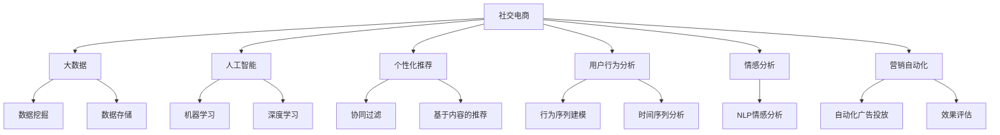
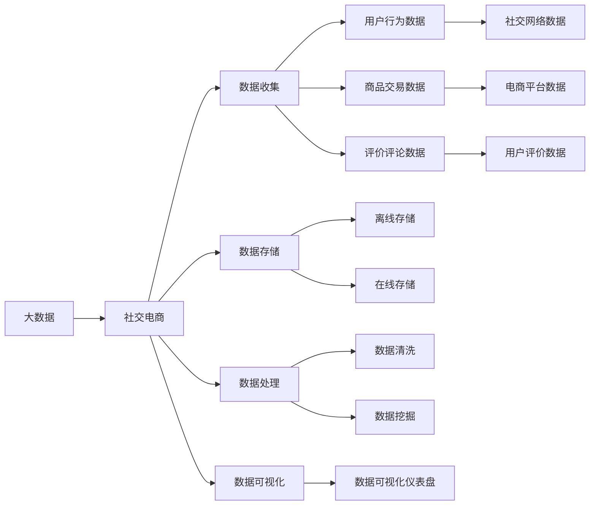
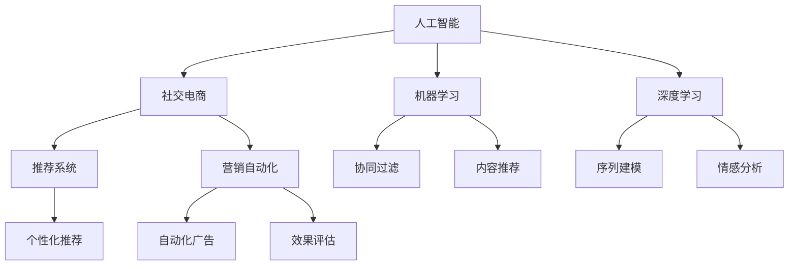
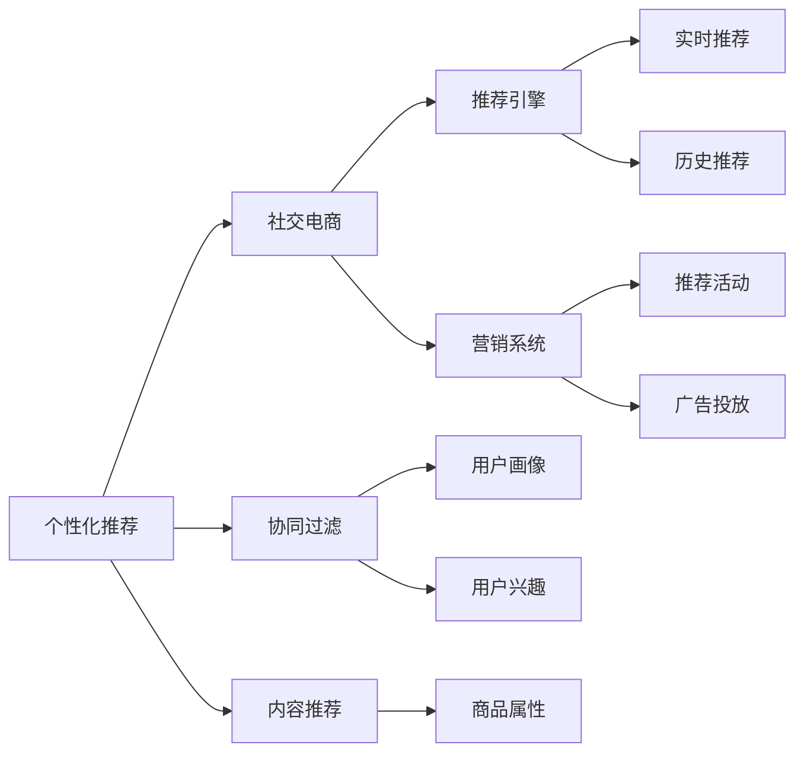

                 

# 利用技术优势进行社交电商

> 关键词：社交电商, 大数据, 人工智能, 个性化推荐, 用户行为分析, 情感分析, 营销自动化

## 1. 背景介绍

### 1.1 问题由来
近年来，随着移动互联网的迅猛发展，社交电商作为新兴的电商模式，以其独特优势迅速崛起。社交电商将社交网络与电子商务紧密结合，通过用户社交关系和行为数据的深度分析，推荐用户感兴趣的电商商品，从而在提升用户购物体验的同时，大幅提高转化率和销售额。

然而，社交电商平台的运营和维护涉及诸多环节，如用户数据管理、商品推荐、营销活动策划等。尽管有大量用户数据可供分析，但数据种类繁多、质量参差不齐，对电商平台的技术能力提出了较高要求。因此，如何高效地利用技术优势，充分发挥数据的价值，是社交电商发展的关键问题。

### 1.2 问题核心关键点
社交电商的核心在于通过对用户社交关系和行为数据的分析，提供个性化的购物推荐和精准的营销活动，从而提高用户满意度和平台转化率。其关键点包括：

- 用户数据的多样性。社交电商的数据来源广泛，包括社交网络、电商平台、用户评价、搜索引擎等，涉及用户行为、兴趣、社交关系等多种信息。
- 数据的实时性和动态性。社交电商需要实时捕捉用户行为变化，动态调整推荐策略和营销方案。
- 推荐和营销的个性化。用户兴趣和行为高度个性化，需要根据具体场景和需求进行定制化推荐和营销。
- 营销活动的精准性。针对不同用户群体，设计精细化的营销活动，提高广告投放的效率和效果。

### 1.3 问题研究意义
利用技术优势进行社交电商，对于提升电商平台的用户体验、提高转化率和销售额，具有重要意义：

1. 提升用户购物体验：通过个性化的商品推荐和精准的营销活动，使消费者能更快找到符合自身需求的商品，减少购物时间，提升购物满意度。
2. 提高平台转化率：精准的推荐和高效的营销活动，能显著提高用户的购物兴趣和转化率，增加平台收益。
3. 数据驱动决策：利用大数据和AI技术，实时分析用户行为和市场动态，制定更科学的运营策略，优化营销活动。
4. 增强用户粘性：个性化的推荐和精准的营销，能增强用户对平台的依赖和粘性，提升平台留存率。
5. 提升平台竞争力：通过技术的不断迭代和优化，构建持续的竞争优势，保持市场领先地位。

## 2. 核心概念与联系

### 2.1 核心概念概述

为更好地理解社交电商的技术优势，本节将介绍几个密切相关的核心概念：

- **社交电商**：将社交网络和电子商务结合，利用用户社交关系和行为数据，进行商品推荐和营销的电商模式。
- **大数据**：指规模巨大、复杂多样、实时变化的数据集合，通过数据挖掘和分析，提取有价值的信息和知识。
- **人工智能**：通过机器学习和深度学习算法，使计算机具备智能推理和决策的能力，广泛应用于图像识别、自然语言处理、推荐系统等领域。
- **个性化推荐**：根据用户的历史行为、兴趣和偏好，推荐最符合其需求的商品或服务。
- **用户行为分析**：通过数据挖掘和建模，分析用户的行为模式和趋势，指导电商平台的运营策略。
- **情感分析**：通过自然语言处理技术，分析用户对商品、活动等的情感倾向，用于优化商品推荐和营销活动。
- **营销自动化**：利用AI技术自动化地进行用户行为分析、广告投放和效果评估，提高营销效率。

这些核心概念之间的逻辑关系可以通过以下Mermaid流程图来展示：



这个流程图展示了大数据、人工智能和社交电商的紧密联系，以及它们在社交电商中的应用。社交电商通过大数据分析、人工智能技术和个性化推荐，不断优化用户体验和运营效果。

### 2.2 概念间的关系

这些核心概念之间存在着紧密的联系，形成了社交电商技术优势的整体生态系统。下面我通过几个Mermaid流程图来展示这些概念之间的关系。

#### 2.2.1 大数据与社交电商的关系



这个流程图展示了大数据在社交电商中的应用，从数据收集、存储、处理到可视化的全过程。社交电商通过数据挖掘和分析，提取有价值的信息和知识，用于商品推荐和营销。

#### 2.2.2 人工智能与社交电商的关系



这个流程图展示了人工智能在社交电商中的应用，从机器学习和深度学习到推荐系统和营销自动化。社交电商通过AI技术，实现个性化的商品推荐和精准的营销活动。

#### 2.2.3 个性化推荐与社交电商的关系



这个流程图展示了个性化推荐在社交电商中的应用，从协同过滤、内容推荐到实时推荐和推荐活动。社交电商通过个性化的推荐，提高用户的购物兴趣和转化率。

### 2.3 核心概念的整体架构

最后，我们用一个综合的流程图来展示这些核心概念在大数据、人工智能和社交电商中的整体架构：


这个综合流程图展示了大数据、人工智能和社交电商的完整应用过程，从数据收集、存储、处理到分析和推荐的全链条。

## 3. 核心算法原理 & 具体操作步骤
### 3.1 算法原理概述

利用技术优势进行社交电商，主要基于大数据分析和人工智能技术，通过个性化推荐和营销自动化，提升用户的购物体验和平台的运营效率。其核心算法包括协同过滤、深度学习、序列建模等，下面详细介绍这些算法的原理。

**协同过滤算法**：
协同过滤是一种基于用户行为数据的推荐算法，通过分析用户之间的相似性，推荐给用户可能感兴趣的商品。协同过滤算法分为基于用户的协同过滤和基于物品的协同过滤，前者通过找到与用户相似的其他用户推荐商品，后者通过分析用户历史行为相似的物品推荐。协同过滤算法简单易懂，但需大量用户数据支持。

**深度学习推荐系统**：
深度学习推荐系统通过构建多层神经网络模型，学习用户行为和商品特征的复杂非线性关系。该算法能够处理海量的数据，挖掘用户行为背后的深层次特征，实现更为精准的推荐。常见的深度学习推荐系统包括基于神经网络的概率模型（如DM）、序列建模模型（如RNN、LSTM）等。

**序列建模算法**：
序列建模算法通过分析用户行为序列，识别出用户行为模式和趋势。该算法能够捕捉用户的长期行为习惯，从而提供更加个性化的推荐。常见的序列建模算法包括时间序列分析、神经网络序列建模等。

**情感分析算法**：
情感分析算法通过自然语言处理技术，分析用户对商品、活动等的情感倾向，用于优化商品推荐和营销活动。常见的情感分析算法包括基于词典的情感分析、基于情感词典的方法、基于机器学习的方法等。

### 3.2 算法步骤详解

#### 3.2.1 协同过滤算法
**步骤1：数据收集**
- 从电商平台、社交网络、评价评论等渠道收集用户行为数据，如购买记录、浏览历史、评价内容等。

**步骤2：构建用户-商品矩阵**
- 将用户和商品分别映射为向量，构建用户-商品矩阵。例如，将用户映射为向量 $u_i$，商品映射为向量 $v_j$，构建矩阵 $U$ 和 $V$。

**步骤3：计算用户-商品相似度**
- 使用余弦相似度等方法，计算用户 $i$ 和用户 $k$ 之间的相似度 $s_{ik}$，以及商品 $j$ 和商品 $l$ 之间的相似度 $s_{jl}$。

**步骤4：计算用户对商品的预测评分**
- 通过加权平均方法，计算用户 $i$ 对商品 $j$ 的预测评分 $p_{ij}$。

**步骤5：推荐商品**
- 根据用户对商品的预测评分，推荐评分最高的商品给用户。

#### 3.2.2 深度学习推荐系统
**步骤1：数据收集**
- 从电商平台、社交网络等渠道收集用户行为数据，如购买记录、浏览历史、评分等。

**步骤2：特征工程**
- 对用户行为数据进行特征工程，提取用户行为特征和商品属性特征。例如，提取用户兴趣标签、浏览时长、商品类别等特征。

**步骤3：构建深度神经网络**
- 构建深度神经网络模型，如FM、FM-CB、深度神经网络等。

**步骤4：训练模型**
- 使用用户行为数据训练深度神经网络，优化模型参数。

**步骤5：推荐商品**
- 使用训练好的模型，根据用户输入和商品特征，生成推荐结果。

#### 3.2.3 序列建模算法
**步骤1：数据收集**
- 从电商平台、社交网络等渠道收集用户行为数据，如浏览记录、购买记录、评分等。

**步骤2：序列预处理**
- 对用户行为序列进行预处理，如去重、拼接等。

**步骤3：序列建模**
- 使用时间序列分析、神经网络序列建模等方法，对用户行为序列进行建模。

**步骤4：序列预测**
- 对用户未来行为进行预测，生成推荐结果。

#### 3.2.4 情感分析算法
**步骤1：数据收集**
- 从社交网络、评价评论等渠道收集用户对商品或活动的评论文本。

**步骤2：文本预处理**
- 对文本进行分词、去除停用词等预处理。

**步骤3：情感词典构建**
- 构建情感词典，用于标注文本的情感倾向。

**步骤4：情感分析**
- 使用情感词典标注文本情感，或使用机器学习算法训练情感分类模型。

### 3.3 算法优缺点

**协同过滤算法的优缺点**：
- 优点：简单高效，能够处理大数据，推荐效果较好。
- 缺点：需要大量用户数据支持，对新用户和商品推荐效果较差。

**深度学习推荐系统的优缺点**：
- 优点：能够处理复杂的数据，挖掘用户深层次的特征，推荐效果较好。
- 缺点：需要大量标注数据和计算资源，模型复杂度高，训练时间长。

**序列建模算法的优缺点**：
- 优点：能够捕捉用户长期行为习惯，推荐效果较好。
- 缺点：需要用户行为序列数据，数据收集和处理成本较高。

**情感分析算法的优缺点**：
- 优点：能够分析用户情感倾向，优化商品推荐和营销活动。
- 缺点：依赖文本数据质量，处理大量文本数据计算成本较高。

### 3.4 算法应用领域

基于技术优势的社交电商，主要应用于电商平台的商品推荐和营销自动化，涵盖如下几个方面：

1. **个性化推荐系统**：通过分析用户行为数据，构建推荐模型，实现个性化商品推荐。
2. **广告投放系统**：利用用户行为数据和情感分析结果，自动化地进行广告投放和效果评估。
3. **用户行为分析系统**：通过行为序列建模和时间序列分析，挖掘用户行为模式和趋势，指导运营策略。
4. **情感分析系统**：通过分析用户对商品和活动的情感倾向，优化推荐策略和营销活动。
5. **营销自动化系统**：利用AI技术自动化地进行营销活动，提高营销效率。

## 4. 数学模型和公式 & 详细讲解 & 举例说明
### 4.1 数学模型构建

社交电商中的数据模型主要包括以下几个方面：

**用户-商品矩阵**：
$$
U = \begin{bmatrix}
u_1 & u_2 & \dots & u_n \\
v_1 & v_2 & \dots & v_m \\
\end{bmatrix}
$$

其中 $u_i$ 和 $v_j$ 分别表示用户和商品的特征向量。

**协同过滤算法**：
协同过滤算法通过计算用户和商品之间的相似度，进行推荐。假设用户 $i$ 对商品 $j$ 的评分向量为 $R_{ij}$，则协同过滤算法可以通过余弦相似度计算用户 $i$ 和用户 $k$ 的相似度 $s_{ik}$：
$$
s_{ik} = \frac{u_i \cdot u_k}{\|u_i\|_2 \cdot \|u_k\|_2}
$$

**深度学习推荐系统**：
深度学习推荐系统通过构建多层神经网络模型，学习用户行为和商品特征的复杂非线性关系。假设用户 $i$ 对商品 $j$ 的评分向量为 $y_{ij}$，则深度学习推荐系统的损失函数为：
$$
L = \frac{1}{N} \sum_{i=1}^N \sum_{j=1}^M (y_{ij} - f(x_{ij}))^2
$$

其中 $f$ 表示深度学习模型，$x_{ij}$ 表示用户行为和商品特征。

**序列建模算法**：
序列建模算法通过时间序列分析，捕捉用户行为序列的趋势。假设用户 $i$ 在时间 $t$ 的行为序列为 $X_{it}$，则时间序列分析模型可以通过ARIMA等方法，捕捉用户行为序列的趋势 $T_{it}$：
$$
T_{it} = \alpha_0 + \sum_{k=1}^p \alpha_k X_{it-k} + \sum_{l=1}^q \beta_l X_{it+l}
$$

**情感分析算法**：
情感分析算法通过自然语言处理技术，分析用户情感倾向。假设用户对商品 $j$ 的情感倾向为 $s_j$，则情感分析模型可以通过情感词典或情感分类模型，计算情感倾向 $s_j$：
$$
s_j = \sum_{k=1}^K w_k \cdot d_k \cdot f_j(d_k)
$$

其中 $d_k$ 表示文本中第 $k$ 个词，$f_j(d_k)$ 表示词 $d_k$ 的情感得分，$w_k$ 表示词 $d_k$ 的权重。

### 4.2 公式推导过程

#### 协同过滤算法
**余弦相似度计算**：
假设用户 $i$ 和用户 $k$ 的特征向量分别为 $u_i$ 和 $u_k$，则用户 $i$ 和用户 $k$ 之间的余弦相似度 $s_{ik}$ 可以通过以下公式计算：
$$
s_{ik} = \frac{u_i \cdot u_k}{\|u_i\|_2 \cdot \|u_k\|_2}
$$

**用户对商品的预测评分**：
假设用户 $i$ 对商品 $j$ 的预测评分为 $p_{ij}$，则用户 $i$ 对商品 $j$ 的预测评分可以通过以下公式计算：
$$
p_{ij} = \sum_{k=1}^K s_{ik} \cdot u_k \cdot v_j
$$

其中 $K$ 表示用户的数量，$u_k$ 和 $v_j$ 分别表示用户 $k$ 和商品 $j$ 的特征向量。

#### 深度学习推荐系统
**损失函数计算**：
假设用户 $i$ 对商品 $j$ 的评分向量为 $y_{ij}$，深度学习推荐系统的损失函数 $L$ 可以通过以下公式计算：
$$
L = \frac{1}{N} \sum_{i=1}^N \sum_{j=1}^M (y_{ij} - f(x_{ij}))^2
$$

其中 $f(x_{ij})$ 表示深度学习模型对用户行为和商品特征 $x_{ij}$ 的预测评分，$y_{ij}$ 表示用户对商品 $j$ 的实际评分。

#### 序列建模算法
**时间序列分析**：
假设用户 $i$ 在时间 $t$ 的行为序列为 $X_{it}$，时间序列分析模型可以通过ARIMA等方法，捕捉用户行为序列的趋势 $T_{it}$：
$$
T_{it} = \alpha_0 + \sum_{k=1}^p \alpha_k X_{it-k} + \sum_{l=1}^q \beta_l X_{it+l}
$$

其中 $\alpha_0, \alpha_k, \beta_l$ 表示模型的参数，$p, q$ 表示模型的阶数。

#### 情感分析算法
**情感词典标注**：
假设用户对商品 $j$ 的情感倾向为 $s_j$，情感分析模型可以通过情感词典 $D$ 标注情感倾向 $s_j$：
$$
s_j = \sum_{k=1}^K d_k \cdot f_j(d_k)
$$

其中 $d_k$ 表示文本中第 $k$ 个词，$f_j(d_k)$ 表示词 $d_k$ 的情感得分，$K$ 表示文本中词汇的数量。

### 4.3 案例分析与讲解

#### 案例分析：电商平台个性化推荐系统

**背景**：某电商平台希望提升用户购物体验和转化率，构建了个性化推荐系统。

**数据收集**：从用户购买记录、浏览历史、评价评论等渠道收集数据，构建用户-商品矩阵 $U$。

**协同过滤算法**：
- **数据预处理**：对用户和商品进行向量化，构建用户-商品矩阵 $U$。
- **相似度计算**：计算用户 $i$ 和用户 $k$ 之间的相似度 $s_{ik}$。
- **预测评分**：根据用户 $i$ 和商品 $j$ 的相似度 $s_{ik}$，计算用户 $i$ 对商品 $j$ 的预测评分 $p_{ij}$。
- **推荐商品**：根据用户对商品的预测评分，推荐评分最高的商品给用户。

**深度学习推荐系统**：
- **数据预处理**：对用户行为数据进行特征工程，提取用户兴趣标签、浏览时长、商品类别等特征。
- **模型构建**：构建深度神经网络模型，如FM、FM-CB等。
- **模型训练**：使用用户行为数据训练深度神经网络，优化模型参数。
- **推荐商品**：使用训练好的模型，根据用户输入和商品特征，生成推荐结果。

**序列建模算法**：
- **数据预处理**：对用户行为序列进行预处理，如去重、拼接等。
- **序列建模**：使用时间序列分析或神经网络序列建模等方法，对用户行为序列进行建模。
- **序列预测**：对用户未来行为进行预测，生成推荐结果。

**情感分析算法**：
- **数据收集**：从社交网络、评价评论等渠道收集用户对商品或活动的评论文本。
- **文本预处理**：对文本进行分词、去除停用词等预处理。
- **情感分析**：使用情感词典标注文本情感，或使用机器学习算法训练情感分类模型。

## 5. 项目实践：代码实例和详细解释说明
### 5.1 开发环境搭建

在进行社交电商技术实践前，我们需要准备好开发环境。以下是使用Python进行PyTorch开发的环境配置流程：

1. 安装Anaconda：从官网下载并安装Anaconda，用于创建独立的Python环境。

2. 创建并激活虚拟环境：
```bash
conda create -n pytorch-env python=3.8 
conda activate pytorch-env
```

3. 安装PyTorch：根据CUDA版本，从官网获取对应的安装命令。例如：
```bash
conda install pytorch torchvision torchaudio cudatoolkit=11.1 -c pytorch -c conda-forge
```

4. 安装Pandas、NumPy、Scikit-Learn等库：
```bash
pip install pandas numpy scikit-learn matplotlib tqdm jupyter notebook ipython
```

完成上述步骤后，即可在`pytorch-env`环境中开始社交电商技术的开发实践。

### 5.2 源代码详细实现

下面我们以社交电商个性化推荐系统为例，给出使用PyTorch进行深度学习推荐系统的PyTorch代码实现。

首先，定义数据处理函数：

```python
import pandas as pd
import numpy as np
from sklearn.model_selection import train_test_split
from torch.utils.data import Dataset
import torch

class CollaborativeFilteringDataset(Dataset):
    def __init__(self, ratings_df):
        self.ratings_df = ratings_df
        self.data, self.targets = self._create_data()
    
    def _create_data(self):
        data = self.ratings_df[['user_id', 'item_id', 'rating']]
        data = data.drop_duplicates()
        data = data.reset_index(drop=True)
        targets = data['rating'].values
        return data, targets
    
    def __len__(self):
        return len(self.data)
    
    def __getitem__(self, idx):
        item = self.data.iloc[idx]
        user_id, item_id, rating = item['user_id'], item['item_id'], item['rating']
        return user_id, item_id, rating
    
    def get_data(self):
        return self.data
    
    def get_targets(self):
        return self.targets
```

然后，定义模型和训练函数：

```python
from torch import nn
from torch.nn import functional as F
import torch.nn.functional as F

class DeepLearningRecommender(nn.Module):
    def __init__(self, num_users, num_items, embed_dim=32, num_factors=2, num_layers=1):
        super(DeepLearningRecommender, self).__init__()
        self.num_users = num_users
        self.num_items = num_items
        self.embed_dim = embed_dim
        self.num_factors = num_factors
        self.num_layers = num_layers
        
        # 用户嵌入
        self.user_embed = nn.Embedding(num_users, embed_dim)
        self.layers = nn.Sequential()
        for _ in range(num_layers):
            self.layers.add_module(f'layer_{_}', nn.Sequential(
                nn.Linear(embed_dim * num_factors, embed_dim * num_factors),
                nn.ReLU(),
                nn.Linear(embed_dim * num_factors, 1)
            ))
    
    def forward(self, user_id, item_id):
        user_embed = self.user_embed(user_id)
        item_embed = self.user_embed(item_id)
        x = torch.cat((user_embed, item_embed), dim=1)
        for layer in self.layers:
            x = layer(x)
        return x
    
    def get_user_embedding(self, user_id):
        return self.user_embed(user_id).view(1, -1)
    
    def get_item_embedding(self, item_id):
        return self.user_embed(item_id).view(1, -1)
```

接着，定义训练函数：

```python
from torch.optim import Adam
from torch.utils.data import DataLoader

def train(model, data_loader, num_epochs, learning_rate=0.001):
    optimizer = Adam(model.parameters(), lr=learning_rate)
    loss_fn = nn.MSELoss()
    
    for epoch in range(num_epochs):
        for user_id, item_id, rating in data_loader:
            optimizer.zero_grad()
            pred = model(user_id, item_id)
            loss = loss_fn(pred, rating.unsqueeze(1))
            loss.backward()
            optimizer.step()
        print(f'Epoch {epoch+1}, loss: {loss.item():.3f}')
```

最后，启动训练流程：

```python
num_users = 1000
num_items = 5000

