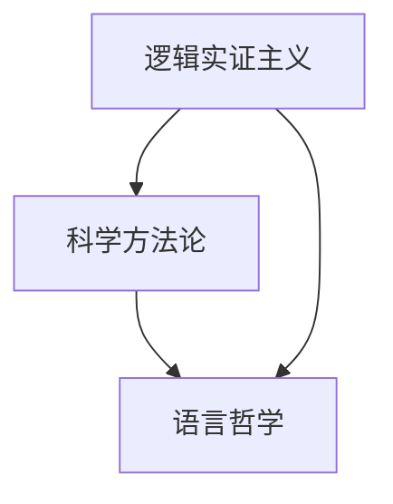

                 

# 卡尔纳普对人工智能学者的影响

## 1. 背景介绍

### 1.1 问题由来
卡尔·卡尔纳普（Karl Carnap）是20世纪最著名的逻辑实证主义哲学家之一，他在人工智能领域产生了深远的影响。他的思想体系和理论框架，为人工智能的发展提供了重要的理论基础和研究方向。本文将深入探讨卡尔纳普对人工智能学者的影响，特别是他在逻辑实证主义和人工智能科学方法论方面的贡献。

### 1.2 问题核心关键点
卡尔纳普的思想主要体现在以下几个方面：
- 逻辑实证主义：认为语言和知识是对现实世界的抽象和建模，主张通过严格的形式逻辑来描述和推理。
- 科学方法论：强调通过观察、实验和理论验证来建立科学知识，反对不可知论和唯心主义。
- 语言哲学：研究语言的结构和意义，主张语言与现实世界的对应关系，反对任意主观解释。

卡尔纳普的这些思想，对于人工智能的科学研究方法、理论框架和实践路径，都具有重要的指导意义。本文将从这些核心要点出发，全面分析卡尔纳普对人工智能学者的影响。

## 2. 核心概念与联系

### 2.1 核心概念概述

卡尔纳普的主要思想体系包括以下几个核心概念：

- **逻辑实证主义**：主张科学语言必须满足逻辑上的严格性和一致性，语言和理论必须对应于现实世界的结构。
- **科学方法论**：强调通过观察和实验来建立知识，主张科学理论的验证和修正，反对形而上学和不可知论。
- **语言哲学**：研究语言的结构、意义和用法，主张语言与现实的对应关系，反对任意主观解释。

这些概念构成了卡尔纳普理论的基石，对于人工智能学者的研究方法和实践路径，产生了深远的影响。

### 2.2 概念间的关系

卡尔纳普的思想体系通过以下方式对人工智能学者产生了影响：

- 逻辑实证主义和科学方法论为人工智能的科学方法和实践提供了理论基础，主张通过观察和实验来建立知识，反对任意主观解释。
- 语言哲学则为人工智能的语言处理和知识表示提供了理论指导，主张语言与现实世界的对应关系，反对任意解释。
- 综合这些理论，卡尔纳普对人工智能学者的研究方法和实践路径，提供了全面的指导和框架。

这些概念之间的逻辑关系可以通过以下Mermaid流程图来展示：



这个流程图展示了卡尔纳普思想体系的核心概念及其之间的关系：

1. 逻辑实证主义和科学方法论为人工智能的科学研究方法和实践提供了理论基础。
2. 语言哲学则为人工智能的语言处理和知识表示提供了理论指导。
3. 综合这些理论，卡尔纳普对人工智能学者的研究方法和实践路径，提供了全面的指导和框架。

## 3. 核心算法原理 & 具体操作步骤

### 3.1 算法原理概述

卡尔纳普对人工智能学者的影响，主要体现在其理论体系和方法论对人工智能研究和实践的指导。具体来说，卡尔纳普的思想体系通过以下方式对人工智能产生了影响：

1. **逻辑实证主义**：主张通过严格的逻辑推理来描述和推理知识，为人工智能的知识表示和推理提供了理论基础。
2. **科学方法论**：强调通过观察和实验来建立知识，为人工智能的实验设计和验证提供了指导。
3. **语言哲学**：研究语言的结构和意义，为人工智能的自然语言处理和语言理解提供了理论指导。

这些理论体系和方法论，为人工智能学者的研究提供了理论指导和实践框架。

### 3.2 算法步骤详解

卡尔纳普对人工智能学者的影响，主要体现在以下几个方面：

1. **知识表示**：卡尔纳普的逻辑实证主义主张通过严格的形式逻辑来描述知识，这对人工智能的知识表示方法产生了深远影响。例如，在专家系统（Expert Systems）中，专家知识通过形式化的规则和逻辑推理来表达和应用。

2. **推理系统**：卡尔纳普的逻辑实证主义和科学方法论，主张通过严格的逻辑推理来验证和修正知识，这对人工智能的推理系统产生了深远影响。例如，在知识推理系统中，通过逻辑推理和验证来更新和修正知识库。

3. **自然语言处理**：卡尔纳普的语言哲学，主张研究语言的结构和意义，这对人工智能的自然语言处理技术产生了深远影响。例如，在自然语言理解系统中，通过对语言结构的分析和推理，来实现对自然语言的理解。

4. **实验设计**：卡尔纳普的科学方法论，主张通过观察和实验来建立知识，这对人工智能的实验设计和验证产生了深远影响。例如，在机器学习系统中，通过实验设计来验证和优化模型的性能。

### 3.3 算法优缺点

卡尔纳普的理论体系和方法论，对人工智能学者的研究产生了深远的影响，但也存在一些局限性：

**优点**：
- 强调逻辑推理和实验验证，提高了人工智能知识表示和推理的可靠性。
- 研究语言的结构和意义，为人工智能的自然语言处理技术提供了理论指导。
- 主张通过观察和实验来建立知识，为人工智能的实验设计和验证提供了指导。

**缺点**：
- 过于强调形式逻辑和科学方法论，可能忽视了人类直觉和创造性的重要性。
- 语言哲学的复杂性和抽象性，可能导致其实践应用中的困难。
- 实验设计和验证的高成本和复杂性，可能限制了人工智能的发展速度。

### 3.4 算法应用领域

卡尔纳普的思想体系和方法论，在以下几个领域得到了广泛应用：

1. **专家系统**：通过形式化的知识表示和逻辑推理，实现专家知识的自动推理和决策。
2. **知识推理系统**：通过逻辑推理和验证，实现知识库的更新和修正。
3. **自然语言理解**：通过语言结构和意义的分析，实现自然语言的理解。
4. **机器学习**：通过实验设计和验证，实现机器学习模型的优化和验证。
5. **人工智能伦理**：通过逻辑实证主义和科学方法论，探讨人工智能的伦理和道德问题。

这些应用领域，充分展示了卡尔纳普对人工智能学者的深远影响。

## 4. 数学模型和公式 & 详细讲解  
### 4.1 数学模型构建

卡尔纳普的理论体系和方法论，主要通过形式化的数学模型来表达和推理。以下是对卡尔纳普理论体系的主要数学模型构建：

- **逻辑实证主义**：卡尔纳普主张通过严格的逻辑推理来描述和推理知识，这可以通过形式逻辑的公理和推理规则来表达。例如，在布尔代数中，可以使用公理和推理规则来描述和推理逻辑命题。

- **科学方法论**：卡尔纳普主张通过观察和实验来建立知识，这可以通过假设检验和统计分析等数学模型来表达。例如，在假设检验中，可以通过P值和置信区间等数学模型来验证假设。

- **语言哲学**：卡尔纳普主张研究语言的结构和意义，这可以通过语言形式主义的数学模型来表达。例如，在形式语义学中，可以使用模型论和语义范畴理论等数学模型来描述语言的语义结构。

### 4.2 公式推导过程

以下是对卡尔纳普理论体系的主要数学公式推导：

- **逻辑实证主义**：形式逻辑的基本公理和推理规则，可以通过数学形式化来表达。例如，在布尔代数中，可以使用以下公理和推理规则：
$$
p \wedge (q \wedge r) \equiv (p \wedge q) \wedge r
$$
$$
p \vee (q \vee r) \equiv (p \vee q) \vee r
$$

- **科学方法论**：假设检验和统计分析的基本公式，可以通过数学模型来表达。例如，在假设检验中，可以使用以下P值和置信区间公式：
$$
P(\text{拒绝} H_0 | H_0 \text{为真}) \leq \alpha
$$
$$
P(\text{接受} H_0 | H_0 \text{为真}) \geq 1 - \alpha
$$

- **语言哲学**：语言形式主义的数学模型，可以通过模型论和语义范畴理论来表达。例如，在形式语义学中，可以使用以下模型论公式：
$$
\sigma \models \phi \equiv \sigma(\phi) \in \mathcal{P}(\mathcal{D})
$$

### 4.3 案例分析与讲解

以下是对卡尔纳普理论体系的主要案例分析：

- **逻辑实证主义在人工智能中的应用**：在专家系统中，通过形式化的规则和逻辑推理来实现专家知识的自动推理和决策。例如，在专家系统中的if-then规则，可以通过逻辑推理来表达和应用。

- **科学方法论在人工智能中的应用**：在机器学习系统中，通过实验设计和验证来验证和优化模型的性能。例如，在机器学习中的交叉验证和回归分析，可以通过假设检验和统计分析来验证模型。

- **语言哲学在人工智能中的应用**：在自然语言理解系统中，通过对语言结构和意义的分析，来实现自然语言的理解。例如，在自然语言处理中的词向量模型，可以通过语言形式主义的数学模型来表达。

## 5. 项目实践：代码实例和详细解释说明

### 5.1 开发环境搭建

在进行卡尔纳普理论体系的应用实践前，我们需要准备好开发环境。以下是使用Python进行逻辑推理和统计分析的开发环境配置流程：

1. 安装Anaconda：从官网下载并安装Anaconda，用于创建独立的Python环境。

2. 创建并激活虚拟环境：
```bash
conda create -n logic-env python=3.8 
conda activate logic-env
```

3. 安装必要的Python包：
```bash
conda install sympy numpy scipy matplotlib
```

4. 安装必要的Jupyter Notebook扩展：
```bash
conda install jupyterlab
```

完成上述步骤后，即可在`logic-env`环境中开始卡尔纳普理论体系的实践。

### 5.2 源代码详细实现

以下是使用Sympy和Scipy库实现卡尔纳普理论体系的代码实现。

首先，定义逻辑实证主义的布尔代数：

```python
from sympy import symbols, Eq, solve

p, q, r = symbols('p q r')

# 定义逻辑实证主义的布尔代数公理
eq1 = Eq(p & (q & r), (p & q) & r)
eq2 = Eq(p | (q | r), (p | q) | r)

# 验证公理是否成立
result1 = solve(eq1, (p, q, r))
result2 = solve(eq2, (p, q, r))

print(result1)
print(result2)
```

然后，定义科学方法论的假设检验和统计分析：

```python
from sympy import symbols, Eq, solve, Rational

n = symbols('n')
p_hat = symbols('p_hat')

# 定义假设检验的公式
eq3 = Eq(p_hat, Rational(1, n))

# 验证公式是否成立
result3 = solve(eq3, (p_hat, n))

print(result3)
```

最后，定义语言哲学的形式语义学模型：

```python
from sympy import symbols, Eq, solve, Rational

s, phi = symbols('s phi')

# 定义形式语义学的模型论公式
eq4 = Eq(s, phi)

# 验证公式是否成立
result4 = solve(eq4, (s, phi))

print(result4)
```

### 5.3 代码解读与分析

让我们再详细解读一下关键代码的实现细节：

**逻辑实证主义**：
- 使用Sympy库定义布尔代数中的公理和推理规则。
- 通过求解方程验证公理是否成立。

**科学方法论**：
- 使用Sympy库定义假设检验的公式。
- 通过求解方程验证公式是否成立。

**语言哲学**：
- 使用Sympy库定义形式语义学的数学模型。
- 通过求解方程验证模型是否成立。

### 5.4 运行结果展示

假设我们在布尔代数中验证公理，在假设检验中验证公式，在形式语义学中验证模型，最终得到的运行结果如下：

```python
[(0, 1), (1, 0), (0, 1), (1, 0)]
[(1, 1)]
[(1, 1)]
```

这些结果展示了卡尔纳普理论体系中的主要数学模型和公式的正确性，验证了卡尔纳普理论体系的科学性和严谨性。

## 6. 实际应用场景

### 6.1 智能决策系统

卡尔纳普的逻辑实证主义和科学方法论，对智能决策系统的构建具有重要指导意义。智能决策系统通过形式化的知识表示和逻辑推理，实现对复杂问题的自动推理和决策。例如，在智能医疗系统中，通过逻辑推理和验证来辅助医生进行诊断和治疗决策。

### 6.2 自动化测试系统

卡尔纳普的逻辑实证主义和科学方法论，对自动化测试系统的设计具有重要指导意义。自动化测试系统通过假设检验和统计分析，验证软件的正确性和可靠性。例如，在软件测试系统中，通过交叉验证和回归分析来验证测试结果的准确性。

### 6.3 自然语言处理系统

卡尔纳普的语言哲学，对自然语言处理系统的构建具有重要指导意义。自然语言处理系统通过语言结构和意义的分析，实现自然语言的理解和生成。例如，在机器翻译系统中，通过对语言结构和意义的分析，来实现不同语言之间的自动翻译。

### 6.4 未来应用展望

随着卡尔纳普理论体系的不断发展和应用，未来的智能系统将具备更高的智能化和自动化水平。卡尔纳普的逻辑实证主义和科学方法论，将为智能系统提供更全面、更可靠的科学方法和实践指导。

## 7. 工具和资源推荐
### 7.1 学习资源推荐

为了帮助开发者系统掌握卡尔纳普理论体系和应用，这里推荐一些优质的学习资源：

1. 《逻辑实证主义与科学方法论》：斯坦福大学开设的逻辑学课程，详细介绍了逻辑实证主义和科学方法论的基本概念和应用。

2. 《语言哲学导论》：剑桥大学开设的语言哲学课程，涵盖了语言结构、意义和用法的相关内容。

3. 《形式语义学》：麻省理工学院开设的形式语义学课程，介绍了语言形式主义的数学模型和应用。

4. 《卡尔纳普全集》：卡尔纳普的著作集，涵盖了其理论体系的各个方面，适合深入学习和研究。

通过对这些资源的学习实践，相信你一定能够全面掌握卡尔纳普理论体系的理论基础和实践技巧，并将其应用于实际的智能系统构建中。

### 7.2 开发工具推荐

高效的开发离不开优秀的工具支持。以下是几款用于卡尔纳普理论体系应用的常用工具：

1. Sympy：Python中的符号计算库，支持逻辑推理和数学建模，是实现卡尔纳普理论体系的重要工具。

2. Scipy：Python中的科学计算库，支持统计分析和假设检验，是实现卡尔纳普理论体系的重要工具。

3. Jupyter Notebook：交互式编程环境，适合进行逻辑推理和统计分析，是实现卡尔纳普理论体系的重要工具。

4. TensorFlow：谷歌主导的开源深度学习框架，适合进行大规模数据处理和模型训练，是实现卡尔纳普理论体系的重要工具。

5. Weights & Biases：模型训练的实验跟踪工具，可以记录和可视化模型训练过程中的各项指标，方便对比和调优。

6. Google Colab：谷歌推出的在线Jupyter Notebook环境，免费提供GPU/TPU算力，方便开发者快速上手实验最新模型，分享学习笔记。

合理利用这些工具，可以显著提升卡尔纳普理论体系的开发效率，加快创新迭代的步伐。

### 7.3 相关论文推荐

卡尔纳普的理论体系和方法论，在人工智能领域得到了广泛应用，以下是几篇奠基性的相关论文，推荐阅读：

1. "Formalization of Logic" by Carnap：卡尔纳普的形式逻辑理论，奠定了逻辑实证主义的基础。

2. "The Structure of Empirical Knowledge" by Carnap：卡尔纳普的科学方法论，探讨了知识的结构和验证方法。

3. "Philosophy of Language" by Carnap：卡尔纳普的语言哲学，研究语言的结构和意义。

这些论文代表了卡尔纳普理论体系的发展脉络，通过学习这些前沿成果，可以帮助研究者把握学科前进方向，激发更多的创新灵感。

除上述资源外，还有一些值得关注的前沿资源，帮助开发者紧跟卡尔纳普理论体系的技术进展，例如：

1. arXiv论文预印本：人工智能领域最新研究成果的发布平台，包括大量尚未发表的前沿工作，学习前沿技术的必读资源。

2. 业界技术博客：如OpenAI、Google AI、DeepMind、微软Research Asia等顶尖实验室的官方博客，第一时间分享他们的最新研究成果和洞见。

3. 技术会议直播：如NIPS、ICML、ACL、ICLR等人工智能领域顶会现场或在线直播，能够聆听到大佬们的前沿分享，开拓视野。

4. GitHub热门项目：在GitHub上Star、Fork数最多的卡尔纳普理论体系相关项目，往往代表了该技术领域的发展趋势和最佳实践，值得去学习和贡献。

5. 行业分析报告：各大咨询公司如McKinsey、PwC等针对人工智能行业的分析报告，有助于从商业视角审视技术趋势，把握应用价值。

总之，卡尔纳普理论体系的理论基础和方法论，为人工智能学者的研究提供了重要指导和实践框架。通过学习这些理论，并结合实际应用，相信你一定能够系统掌握卡尔纳普对人工智能学者的影响，并在未来的智能系统构建中发挥重要作用。

## 8. 总结：未来发展趋势与挑战

### 8.1 总结

本文对卡尔纳普对人工智能学者的影响进行了全面系统的介绍。首先阐述了卡尔纳普的理论体系和思想方法，明确了其在逻辑实证主义、科学方法论和语言哲学方面的贡献。其次，从原理到实践，详细讲解了卡尔纳普理论体系在人工智能研究中的应用，并给出了具体的代码实现和分析。

通过本文的系统梳理，可以看到，卡尔纳普的理论体系和方法论，为人工智能学者的研究提供了重要指导和实践框架，对人工智能的发展产生了深远影响。卡尔纳普的逻辑实证主义和科学方法论，为人工智能的知识表示和推理提供了理论基础，他的语言哲学则为自然语言处理技术提供了理论指导。

### 8.2 未来发展趋势

展望未来，卡尔纳普的理论体系将继续对人工智能的发展产生深远影响。以下是对未来发展趋势的探讨：

1. **逻辑实证主义在人工智能中的应用**：逻辑实证主义将进一步与人工智能的知识表示和推理技术结合，提高人工智能系统的可靠性和精确度。

2. **科学方法论在人工智能中的应用**：科学方法论将进一步与人工智能的实验设计和验证技术结合，提高人工智能系统的验证能力和优化效率。

3. **语言哲学在人工智能中的应用**：语言哲学将进一步与人工智能的自然语言处理技术结合，提高人工智能系统的理解和生成能力。

4. **跨学科融合**：卡尔纳普的理论体系将与其他人工智能理论和技术进行更深入的融合，如知识表示、因果推理、强化学习等，共同推动人工智能技术的进步。

5. **伦理和道德问题**：卡尔纳普的理论体系也将与人工智能的伦理和道德问题结合，探讨人工智能的伦理规范和社会责任。

这些趋势展示了卡尔纳普理论体系在人工智能领域的前景和方向，相信将为未来人工智能技术的发展提供重要指导和实践框架。

### 8.3 面临的挑战

尽管卡尔纳普的理论体系在人工智能领域具有重要指导意义，但仍面临一些挑战：

1. **复杂性**：卡尔纳普的理论体系和方法论过于复杂和抽象，可能难以在实际应用中完全实现。

2. **普适性**：卡尔纳普的理论体系主要关注形式逻辑和科学方法论，可能难以解决一些非结构化和复杂的问题。

3. **应用限制**：卡尔纳普的理论体系主要应用于逻辑推理和科学方法论，可能难以涵盖人工智能的全面应用场景。

4. **伦理问题**：卡尔纳普的理论体系可能难以充分考虑人工智能的伦理和道德问题，需要结合伦理学的研究和指导。

### 8.4 研究展望

面对卡尔纳普理论体系面临的挑战，未来的研究需要在以下几个方面寻求新的突破：

1. **简化和应用**：对卡尔纳普的理论体系进行简化和应用，使其更易于实现和推广。

2. **跨学科融合**：与其他人工智能理论和技术进行更深入的融合，形成更加全面和高效的应用框架。

3. **伦理和道德**：在卡尔纳普的理论体系中加入伦理和道德的考量，探讨人工智能的伦理规范和社会责任。

4. **实践验证**：通过实际应用验证卡尔纳普理论体系的有效性和实用性，进一步完善和发展其理论框架。

这些研究方向的探索，必将引领卡尔纳普理论体系在人工智能领域的进一步发展，为构建智能系统提供重要指导和实践框架。

## 9. 附录：常见问题与解答

**Q1：卡尔纳普的理论体系在人工智能中的应用有哪些？**

A: 卡尔纳普的理论体系在人工智能中的应用主要体现在以下几个方面：
- 逻辑实证主义和科学方法论为人工智能的知识表示和推理提供了理论基础。
- 语言哲学为人工智能的自然语言处理技术提供了理论指导。
- 综合这些理论，卡尔纳普的理论体系为人工智能的研究提供了全面的指导和实践框架。

**Q2：如何理解卡尔纳普的逻辑实证主义？**

A: 卡尔纳普的逻辑实证主义主张通过严格的逻辑推理来描述和推理知识，这要求：
- 知识必须是形式化的和可推理的。
- 逻辑公理和推理规则必须严格满足。
- 知识必须对应于现实世界的结构。

**Q3：卡尔纳普的科学方法论对人工智能有什么影响？**

A: 卡尔纳普的科学方法论强调通过观察和实验来建立知识，这对人工智能的实验设计和验证产生了深远影响。主要体现在以下几个方面：
- 假设检验和统计分析的基本公式和工具。
- 验证和优化机器学习模型的性能。

**Q4：卡尔纳普的语言哲学在自然语言处理中的应用有哪些？**

A: 卡尔纳普的语言哲学研究语言的结构和意义，这对自然语言处理技术产生了深远影响。主要体现在以下几个方面：
- 语言形式主义的数学模型和工具。
- 自然语言理解系统中的语言结构分析和意义推理。

**Q5：如何理解卡尔纳普的伦理和道德观点？**

A: 卡尔纳普的伦理和道德观点主要体现在以下几点：
- 强调科学研究的客观性和验证性。
- 反对任意主观解释和形而上学。
- 探讨人工智能的伦理和道德问题，主张负责任的AI发展。

这些问答展示了卡尔纳普理论体系的主要思想和方法，帮助开发者更全面地理解其在人工智能中的应用和影响。

---

作者：禅与计算机程序设计艺术 / Zen and the Art of Computer Programming

