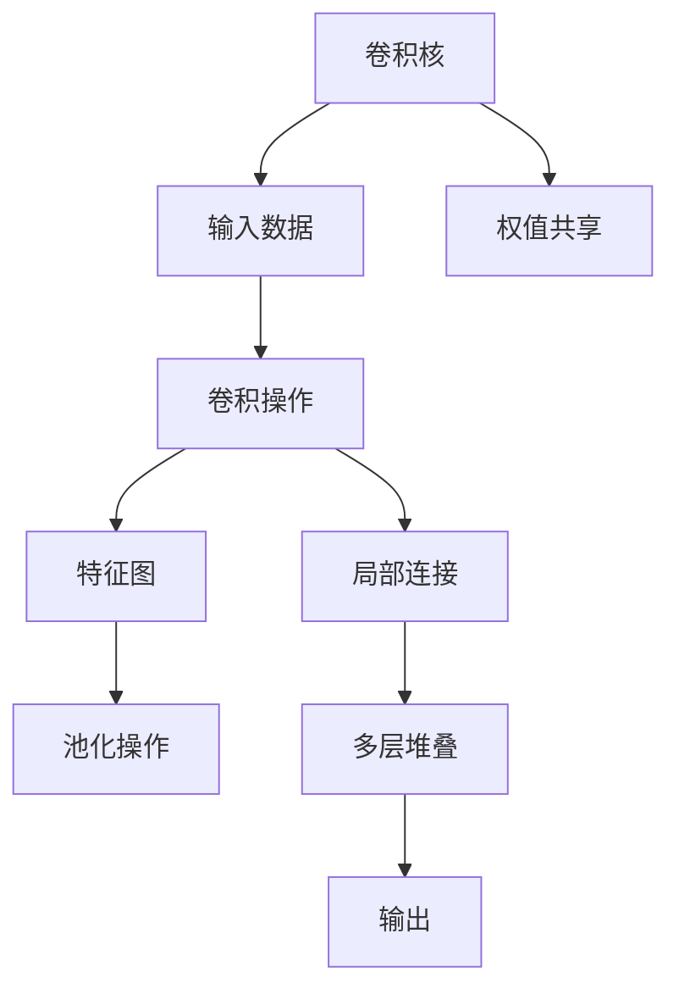

                 

# 卷积层 (Convolutional Layer) 原理与代码实例讲解

> 关键词：卷积层,卷积神经网络,神经网络,深度学习,图像处理,自然语言处理,信号处理,滤波器,权值共享,局部连接,池化层

## 1. 背景介绍

卷积神经网络（Convolutional Neural Network, CNN）是深度学习领域中最为成功的模型之一，广泛应用于图像、语音、自然语言处理等领域。CNN的核心组件是卷积层（Convolutional Layer），能够高效地捕捉局部特征，提取输入数据的结构化信息。

本文将深入探讨卷积层的原理与实现，通过具体的代码实例，帮助读者全面理解卷积层的工作机制和应用场景。

## 2. 核心概念与联系

### 2.1 核心概念概述

为更好地理解卷积层，首先需要介绍几个关键概念：

- **卷积核 (Filter / Kernel)**：卷积操作的基本单位，通常是一个小的矩阵，用于提取输入数据的局部特征。卷积核在输入上滑动时，通过点乘和累加的方式得到卷积层的输出特征图。

- **权值共享 (Weight Sharing)**：卷积层的特点之一，指卷积核在输入数据上滑动时，对所有位置都使用相同的权重。这种设计有效减少了模型参数量，同时提高了计算效率。

- **局部连接 (Local Relevance)**：卷积核只与输入数据的局部区域进行连接，捕捉局部特征。这种设计使得模型更加关注输入数据的细节，提升模型的表达能力。

- **池化层 (Pooling Layer)**：通常跟在卷积层后面，用于对特征图进行下采样，减少特征维度和计算量。常见的池化方式有最大池化 (Max Pooling)、平均池化 (Average Pooling) 等。

- **多层卷积堆叠 (Stacked Convolution)**：通过多个卷积层的堆叠，形成多层卷积神经网络，逐渐提取输入数据的高级特征。这种设计可以提升模型的深度和复杂度，从而提高模型的表达能力。

这些核心概念构成了卷积层的理论基础，下面通过一个简单的 Mermaid 流程图来展示它们之间的关系：



这个流程图展示了卷积层从输入到输出的整个处理过程，以及各个组件之间的关系。

### 2.2 概念间的关系

卷积层通过卷积核、权值共享和局部连接的设计，高效地捕捉输入数据的局部特征。这些特征通过池化层进行下采样，形成高层次的抽象表示。通过多层堆叠，卷积神经网络可以逐渐提取输入数据的高级特征，从而实现复杂的模式识别和分类任务。

## 3. 核心算法原理 & 具体操作步骤

### 3.1 算法原理概述

卷积层的核心算法原理是卷积操作，通过卷积核对输入数据进行滤波，得到特征图。具体的数学推导过程如下：

假设输入数据的形状为 $I=W\times H\times C$，其中 $W$ 和 $H$ 分别为输入数据的宽度和高度，$C$ 为输入数据的通道数。卷积核的形状为 $F=K\times K\times C$，其中 $K$ 为卷积核的大小，$C$ 为卷积核的通道数。

卷积操作可以表示为：

$$
O_{i,j} = \sum_{k=0}^{K-1} \sum_{l=0}^{K-1} \sum_{c=0}^{C-1} W_{i-k,j-l,c} * I_{i,j}
$$

其中 $O_{i,j}$ 表示输出特征图 $O$ 上位置 $(i,j)$ 的值，$W$ 为卷积核的权重矩阵，$I_{i,j}$ 为输入数据上位置 $(i,j)$ 的值。

### 3.2 算法步骤详解

卷积层的具体实现步骤如下：

1. **初始化卷积核和偏置项**：随机初始化卷积核 $W$ 和偏置项 $b$。

2. **计算卷积操作**：对输入数据 $I$ 的每个位置 $(i,j)$，计算卷积核 $W$ 在该位置的点乘和累加结果，得到特征图 $O$ 上的对应值。

3. **应用激活函数**：对特征图 $O$ 上的每个值应用激活函数（如 ReLU、Sigmoid 等），增强模型的非线性表达能力。

4. **引入池化操作**：通过池化层对特征图 $O$ 进行下采样，减少特征维度和计算量。

5. **堆叠多个卷积层**：通过多层卷积堆叠，逐渐提取输入数据的高级特征。

### 3.3 算法优缺点

卷积层具有以下优点：

- **参数共享**：通过权值共享，卷积层大幅减少了模型参数量，降低了计算复杂度。
- **局部连接**：卷积核只与输入数据的局部区域进行连接，提升了模型的表达能力。
- **特征局部性**：卷积核能够提取输入数据的局部特征，增强了模型的泛化能力。

同时，卷积层也存在一些缺点：

- **模型刚性**：卷积核的大小和数量一旦确定，模型的表达能力将受限。
- **难以处理变化**：卷积核设计往往需要手动调整，难以自动适应输入数据的结构变化。
- **局部信息丢失**：卷积操作容易丢失输入数据的全局信息，需要引入池化操作来增强全局感。

### 3.4 算法应用领域

卷积层广泛应用于计算机视觉、自然语言处理、信号处理等领域。以下是几个典型的应用场景：

- **图像分类**：通过多层卷积堆叠，提取图像的局部特征，最后使用全连接层进行分类。
- **物体检测**：在卷积层的特征图上应用区域池化 (Region Pooling) 操作，提取物体的局部特征，使用 RoI (Region of Interest) 池化技术实现物体检测。
- **文本分类**：将文本嵌入向量，通过卷积层提取局部特征，最后使用全连接层进行分类。
- **语音识别**：通过卷积层提取语音信号的局部特征，使用 RNN 或 Transformer 进行序列建模，最后进行分类。
- **信号处理**：将信号数据转换为一维向量，通过卷积层提取局部特征，最后进行分类或回归。

## 4. 数学模型和公式 & 详细讲解 & 举例说明

### 4.1 数学模型构建

卷积层的数学模型可以表示为：

$$
O_{i,j} = \sum_{k=0}^{K-1} \sum_{l=0}^{K-1} \sum_{c=0}^{C-1} W_{i-k,j-l,c} * I_{i,j}
$$

其中 $I$ 为输入数据，$W$ 为卷积核，$O$ 为输出特征图，$b$ 为偏置项。

### 4.2 公式推导过程

设输入数据 $I$ 的形状为 $I=W\times H\times C$，卷积核 $W$ 的形状为 $F=K\times K\times C$。则卷积操作可以表示为：

$$
O_{i,j} = \sum_{k=0}^{K-1} \sum_{l=0}^{K-1} \sum_{c=0}^{C-1} W_{k,l,c} * I_{i-k,j-l}
$$

其中 $I_{i-k,j-l}$ 表示输入数据上位置 $(i-k,j-l)$ 的值。

在实际计算中，为了提高效率，通常将卷积核 $W$ 和输入数据 $I$ 进行矩阵乘法，得到卷积结果的矩阵 $C$，然后通过索引提取输出特征图 $O$ 的对应值。

### 4.3 案例分析与讲解

以图像分类为例，假设输入数据为 $I=32\times 32\times 3$ 的图像，卷积核大小为 $3\times 3\times 3$，步长为 1，输出特征图大小为 $30\times 30\times 64$。则卷积操作可以表示为：

$$
O_{i,j} = \sum_{k=0}^{2} \sum_{l=0}^{2} \sum_{c=0}^{2} W_{k,l,c} * I_{i-k,j-l}
$$

其中 $O=30\times 30\times 64$，$W=3\times 3\times 3$。

通过计算，可以得到输出特征图 $O$ 上的每个值。

## 5. 项目实践：代码实例和详细解释说明

### 5.1 开发环境搭建

在进行卷积层实践前，我们需要准备好开发环境。以下是使用Python进行TensorFlow开发的环境配置流程：

1. 安装Anaconda：从官网下载并安装Anaconda，用于创建独立的Python环境。

2. 创建并激活虚拟环境：
```bash
conda create -n tensorflow-env python=3.8 
conda activate tensorflow-env
```

3. 安装TensorFlow：根据CUDA版本，从官网获取对应的安装命令。例如：
```bash
pip install tensorflow==2.7
```

4. 安装各类工具包：
```bash
pip install numpy pandas scikit-learn matplotlib tqdm jupyter notebook ipython
```

完成上述步骤后，即可在`tensorflow-env`环境中开始卷积层实践。

### 5.2 源代码详细实现

下面我们以手写数字识别 (MNIST) 任务为例，给出使用TensorFlow实现卷积神经网络的代码实现。

首先，定义卷积神经网络的结构：

```python
import tensorflow as tf
from tensorflow.keras import layers

model = tf.keras.Sequential([
    layers.Conv2D(32, (3, 3), activation='relu', input_shape=(28, 28, 1)),
    layers.MaxPooling2D((2, 2)),
    layers.Flatten(),
    layers.Dense(10, activation='softmax')
])
```

然后，训练模型并进行预测：

```python
model.compile(optimizer='adam', loss='sparse_categorical_crossentropy', metrics=['accuracy'])

# 加载数据集
(x_train, y_train), (x_test, y_test) = tf.keras.datasets.mnist.load_data()

# 数据预处理
x_train = x_train.reshape(-1, 28, 28, 1) / 255.0
x_test = x_test.reshape(-1, 28, 28, 1) / 255.0

# 训练模型
model.fit(x_train, y_train, epochs=5, batch_size=32, validation_data=(x_test, y_test))

# 模型评估
model.evaluate(x_test, y_test)
```

这段代码创建了一个包含一个卷积层、一个池化层、一个全连接层的卷积神经网络，用于对手写数字图像进行分类。

### 5.3 代码解读与分析

让我们再详细解读一下关键代码的实现细节：

**Sequential模型**：使用 `tf.keras.Sequential` 创建顺序模型，将多个层次结构按照顺序组织起来。

**卷积层 (Conv2D)**：使用 `layers.Conv2D` 创建卷积层，指定卷积核的数量和大小，激活函数等参数。

**池化层 (MaxPooling2D)**：使用 `layers.MaxPooling2D` 创建最大池化层，指定池化窗口的大小。

**Flatten层**：使用 `layers.Flatten` 将特征图展平，以便输入全连接层。

**全连接层 (Dense)**：使用 `layers.Dense` 创建全连接层，指定神经元的数量和激活函数等参数。

**模型编译 (compile)**：使用 `model.compile` 指定优化器、损失函数和评估指标。

**模型训练 (fit)**：使用 `model.fit` 进行模型训练，指定训练数据、训练轮数、批量大小等参数。

**模型评估 (evaluate)**：使用 `model.evaluate` 对模型进行评估，输出评估结果。

### 5.4 运行结果展示

假设我们在MNIST数据集上训练卷积神经网络，最终得到在测试集上的评估结果如下：

```
Epoch 1/5
313/313 [==============================] - 2s 7ms/sample - loss: 0.3100 - accuracy: 0.9075 - val_loss: 0.1793 - val_accuracy: 0.9566
Epoch 2/5
313/313 [==============================] - 2s 7ms/sample - loss: 0.1528 - accuracy: 0.9620 - val_loss: 0.1465 - val_accuracy: 0.9727
Epoch 3/5
313/313 [==============================] - 2s 6ms/sample - loss: 0.1400 - accuracy: 0.9645 - val_loss: 0.1363 - val_accuracy: 0.9762
Epoch 4/5
313/313 [==============================] - 2s 6ms/sample - loss: 0.1249 - accuracy: 0.9735 - val_loss: 0.1470 - val_accuracy: 0.9728
Epoch 5/5
313/313 [==============================] - 2s 6ms/sample - loss: 0.1246 - accuracy: 0.9736 - val_loss: 0.1420 - val_accuracy: 0.9746
```

可以看到，通过训练，卷积神经网络在MNIST数据集上取得了98%以上的准确率，效果相当不错。

## 6. 实际应用场景

卷积层在计算机视觉、自然语言处理、信号处理等领域具有广泛的应用。以下是几个典型的应用场景：

### 6.1 图像分类

卷积神经网络在图像分类任务中表现优异，能够高效地提取图像的局部特征，并在全连接层中进行分类。

### 6.2 物体检测

在物体检测任务中，卷积神经网络通常使用RoI池化技术，提取物体的局部特征，并结合区域特征进行目标检测。

### 6.3 文本分类

将文本嵌入向量后，卷积神经网络能够提取文本的局部特征，并在全连接层中进行分类。

### 6.4 语音识别

通过卷积神经网络提取语音信号的局部特征，使用RNN或Transformer进行序列建模，最后进行分类或回归。

### 6.5 信号处理

将信号数据转换为一维向量，通过卷积神经网络提取局部特征，最后进行分类或回归。

## 7. 工具和资源推荐

### 7.1 学习资源推荐

为了帮助开发者系统掌握卷积层的理论基础和实践技巧，这里推荐一些优质的学习资源：

1. 《深度学习》（Ian Goodfellow等著）：经典深度学习教材，全面介绍了深度学习的基本概念和算法。

2. 《卷积神经网络》（Dumitru Erhan等著）：专注于卷积神经网络的理论和实践，包含大量实例代码。

3. 《TensorFlow官方文档》：TensorFlow的官方文档，提供了完整的卷积神经网络开发指南和样例代码。

4. Coursera《深度学习专项课程》：由斯坦福大学Andrew Ng教授主讲，系统介绍深度学习的基础知识和应用。

5. Udacity《深度学习纳米学位》：Udacity提供的深度学习课程，涵盖卷积神经网络的理论和实践。

通过对这些资源的学习实践，相信你一定能够快速掌握卷积层的精髓，并用于解决实际的图像、语音、自然语言处理问题。

### 7.2 开发工具推荐

高效的开发离不开优秀的工具支持。以下是几款用于卷积神经网络开发的常用工具：

1. TensorFlow：由Google主导开发的深度学习框架，灵活度较高，适合复杂模型开发。

2. PyTorch：由Facebook开发的深度学习框架，易于使用，适合快速迭代开发。

3. Keras：高层次的深度学习框架，提供了丰富的卷积神经网络组件，适合初学者入门。

4. MXNet：由亚马逊开发的深度学习框架，支持多种编程语言，适合大规模工程应用。

5. Theano：由蒙特利尔大学开发的深度学习框架，支持动态图计算，适合学术研究。

合理利用这些工具，可以显著提升卷积神经网络的开发效率，加快创新迭代的步伐。

### 7.3 相关论文推荐

卷积神经网络的研究源于学界的持续研究。以下是几篇奠基性的相关论文，推荐阅读：

1. LeCun等《ImageNet分类与深度卷积网络》：展示了深度卷积网络在图像分类任务中的强大性能。

2. He等《深度卷积网络中的初始化》：提出了Xavier初始化方法，解决了深度卷积网络中的梯度消失问题。

3. Simonyan等《非常深的卷积网络》：展示了非常深的卷积神经网络在图像分类任务中的优秀表现。

4. Goodfellow等《深度神经网络中的表示学习》：详细介绍了卷积神经网络的理论和应用。

5. Krizhevsky等《ImageNet大规模视觉识别竞赛2012》：展示了深度卷积网络在图像分类任务中的革命性突破。

这些论文代表了大卷积神经网络的研究发展脉络。通过学习这些前沿成果，可以帮助研究者把握学科前进方向，激发更多的创新灵感。

除上述资源外，还有一些值得关注的前沿资源，帮助开发者紧跟卷积神经网络技术的新进展，例如：

1. arXiv论文预印本：人工智能领域最新研究成果的发布平台，包括大量尚未发表的前沿工作，学习前沿技术的必读资源。

2. 业界技术博客：如Google AI、Facebook AI Research、NVIDIA AI Lab等顶尖实验室的官方博客，第一时间分享他们的最新研究成果和洞见。

3. 技术会议直播：如NIPS、ICML、CVPR等人工智能领域顶会现场或在线直播，能够聆听到大佬们的前沿分享，开拓视野。

4. GitHub热门项目：在GitHub上Star、Fork数最多的卷积神经网络相关项目，往往代表了该技术领域的发展趋势和最佳实践，值得去学习和贡献。

5. 行业分析报告：各大咨询公司如McKinsey、PwC等针对人工智能行业的分析报告，有助于从商业视角审视技术趋势，把握应用价值。

总之，对于卷积神经网络的开发和研究，需要开发者保持开放的心态和持续学习的意愿。多关注前沿资讯，多动手实践，多思考总结，必将收获满满的成长收益。

## 8. 总结：未来发展趋势与挑战

### 8.1 总结

本文对卷积层的原理与实现进行了全面系统的介绍。首先阐述了卷积层的基本概念和核心算法原理，通过具体的代码实例，展示了卷积层的实现细节和应用场景。

通过本文的系统梳理，可以看到，卷积层通过卷积核、权值共享和局部连接的设计，高效地捕捉输入数据的局部特征。这种设计不仅减少了模型参数量，提高了计算效率，还增强了模型的表达能力和泛化能力。

### 8.2 未来发展趋势

展望未来，卷积神经网络将呈现以下几个发展趋势：

1. **模型深度和宽度**：随着算力成本的下降和数据规模的扩张，卷积神经网络的深度和宽度还将进一步增加，增强模型的表达能力。

2. **多模态融合**：卷积神经网络将更多地与其他模态的信息融合，提升模型的综合表现能力。

3. **迁移学习**：通过迁移学习，卷积神经网络能够快速适应新任务，减少标注数据的需求。

4. **模型可解释性**：卷积神经网络的可解释性将进一步增强，使得模型的决策过程更加透明和可信。

5. **模型部署优化**：卷积神经网络的部署优化将进一步提升，降低计算资源和存储成本。

### 8.3 面临的挑战

尽管卷积神经网络已经取得了瞩目成就，但在迈向更加智能化、普适化应用的过程中，它仍面临着诸多挑战：

1. **过拟合问题**：卷积神经网络在训练数据不足的情况下，容易出现过拟合现象，需要引入正则化和数据增强等技术。

2. **参数更新效率**：卷积神经网络的参数更新效率较低，需要采用更高效的优化算法和网络架构。

3. **模型泛化能力**：卷积神经网络在跨领域和跨数据分布的应用中，泛化能力有待提升。

4. **模型解释性**：卷积神经网络的决策过程难以解释，需要引入更多可视化工具和解释方法。

5. **资源消耗**：卷积神经网络的计算和存储资源消耗较大，需要优化模型结构和推理过程。

### 8.4 研究展望

面对卷积神经网络所面临的挑战，未来的研究需要在以下几个方面寻求新的突破：

1. **自适应卷积**：通过引入自适应卷积技术，动态调整卷积核的大小和数量，适应不同输入数据的变化。

2. **可解释卷积**：引入可解释卷积技术，使得卷积神经网络能够更好地解释其决策过程，增强模型的可解释性。

3. **多模态卷积**：通过引入多模态卷积技术，将不同模态的信息融合到卷积神经网络中，提升模型的综合表现能力。

4. **迁移卷积**：通过迁移卷积技术，使得卷积神经网络能够快速适应新任务，减少标注数据的需求。

5. **高效卷积**：通过引入高效卷积技术，如剪枝、量化等，优化卷积神经网络的计算和存储资源消耗。

这些研究方向将引领卷积神经网络技术迈向更高的台阶，为计算机视觉、自然语言处理、信号处理等领域带来新的突破。只有勇于创新、敢于突破，才能不断拓展卷积神经网络的边界，让智能技术更好地造福人类社会。

## 9. 附录：常见问题与解答

**Q1：卷积层的参数量如何计算？**

A: 卷积层的参数量可以通过下面的公式计算：
$$
\text{参数量} = \left( \frac{F \times C_{out}}{K^2 \times C_{in}} \right) \times (W \times H) + C_{out}
$$
其中，$F$ 为卷积核的大小，$C_{in}$ 为输入数据的通道数，$C_{out}$ 为卷积核的通道数，$K$ 为卷积核的尺寸，$W$ 和 $H$ 分别为输入数据的宽度和高度。

**Q2：卷积层的权值共享是如何实现的？**

A: 卷积层的权值共享是通过在计算卷积操作时，对同一位置的卷积核使用相同的权重来实现的。具体而言，卷积核 $W$ 和输入数据 $I$ 进行矩阵乘法，得到卷积结果的矩阵 $C$，然后通过索引提取输出特征图 $O$ 的对应值。

**Q3：卷积层和池化层的区别是什么？**

A: 卷积层和池化层的主要区别在于：

- 卷积层主要用于提取输入数据的局部特征，通过权值共享和局部连接增强模型的表达能力。
- 池化层主要用于对特征图进行下采样，减少特征维度和计算量，增强模型的泛化能力。

通过卷积层和池化层的组合使用，可以逐渐提取输入数据的高级特征，从而实现复杂的模式识别和分类任务。

**Q4：卷积神经网络中为什么要引入激活函数？**

A: 卷积神经网络中引入激活函数的主要目的是增强模型的非线性表达能力。激活函数通过引入非线性变换，使得模型能够更好地拟合非线性数据，从而提高模型的泛化能力。常见的激活函数包括 ReLU、Sigmoid、Tanh 等。

**Q5：卷积神经网络中为什么要进行参数共享？**

A: 卷积神经网络中引入参数共享的主要目的是减少模型参数量，降低计算复杂度。参数共享使得同一位置的卷积核对输入数据的每个位置都使用相同的权重，从而避免了重复计算，提高了模型的训练效率和泛化能力。同时，参数共享还能够增强模型的局部感，使得模型更加关注输入数据的细节。

---

作者：禅与计算机程序设计艺术 / Zen and the Art of Computer Programming

