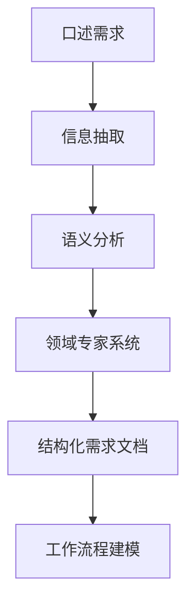

                 

# 口述需求快速生成工作流程的方法

> 关键词：
> - 需求工程
> - 口述需求
> - 自然语言处理(NLP)
> - 信息抽取(Information Extraction)
> - 工作流程建模
> - 人工智能(AI)
> - 自动化需求生成
> - 用户反馈
> - 领域专家系统

## 1. 背景介绍

### 1.1 问题由来

在软件开发过程中，需求阶段是一个至关重要的环节。需求不清晰或不完整会导致项目延期、成本超支、功能不足等问题。传统的需求获取方式依赖于需求调研、问卷调查、文档分析等方法，往往耗时耗力，且容易产生误解。而口述需求，即用户通过口语表达自己对功能、界面、性能等方面的期望，具有实时、自然、灵活等优势，尤其在移动应用、交互式设备等场景中得到了广泛应用。

然而，如何高效地处理、理解和转化口述需求，并将其转换为结构化、可执行的需求文档，成为需求工程中的一大挑战。现有的需求分析工具和方法往往需要专家引导，耗时长，且难以覆盖各类复杂场景。本文聚焦于一种基于自然语言处理（NLP）的自动化需求生成方法，通过信息抽取和语义理解技术，快速高效地将口述需求转化为结构化需求文档，从而大幅提升需求工程的效率和质量。

### 1.2 问题核心关键点

核心问题在于如何将口述需求快速转化为结构化需求文档，并在此基础上构建出合理的用户界面(UI)和工作流程。现有方法包括：

- 手动提取：由经验丰富的需求分析师手动分析口述需求，提取关键信息，并进行梳理和建模，时间成本高且主观性强。
- 半自动提取：利用一些自动化工具如JIRA、Confluence等，手动输入需求文档，部分信息可通过模板自动填充，但需要人工介入，效率仍不高。
- 自动化提取：通过自然语言处理（NLP）技术，如信息抽取、语义分析、实体识别等，自动从口述需求中提取关键信息，如功能点、界面布局、性能指标等，并生成结构化需求文档。

本文主要探讨基于NLP技术的自动化需求生成方法，帮助开发团队快速、准确地获取和理解用户需求，提高需求工程效率。

## 2. 核心概念与联系

### 2.1 核心概念概述

为更好地理解口述需求快速生成方法，本节将介绍几个密切相关的核心概念：

- 口述需求：用户通过口语表达对产品功能、界面、性能等的需求。
- 结构化需求文档：按照一定格式和规范组织的需求文档，如UML用例图、系统架构图、功能需求说明书等。
- 自然语言处理(NLP)：使计算机能够理解、处理和生成人类自然语言的技术。
- 信息抽取(Information Extraction)：从文本中自动提取有用信息，如实体、事件、关系等。
- 语义分析(Semantic Analysis)：理解文本中单词和句子的含义，推理其语义关系。
- 领域专家系统(Domain-Specific Expert System)：针对特定领域的知识库和规则库，帮助计算机进行领域相关的推理和决策。

这些概念之间存在着紧密的联系，形成了自动化需求生成的完整生态系统。通过NLP技术，从口述需求中抽取信息，利用语义分析和领域知识，自动生成结构化需求文档，最终构建出合理的工作流程。

### 2.2 概念间的关系

这些核心概念之间通过自动化的需求生成工作流程紧密联系在一起，形成了一个完整的自动化需求获取和建模系统。以下通过一个Mermaid流程图来展示这些概念之间的关系：



这个流程图展示了下述关系：

1. 用户通过口述需求，将需求信息传递给系统。
2. 系统通过信息抽取技术，自动提取关键需求信息。
3. 对抽取的信息进行语义分析，理解需求语义。
4. 结合领域专家知识，生成结构化需求文档。
5. 通过工作流程建模，将需求文档转化为可执行的工作流程。

## 3. 核心算法原理 & 具体操作步骤

### 3.1 算法原理概述

基于NLP技术的自动化需求生成方法主要依赖信息抽取和语义分析技术，从自然语言中自动提取关键信息，并结合领域知识，自动生成结构化需求文档。核心算法包括：

- 信息抽取：从用户口述需求中自动抽取实体、关系、事件等信息。
- 语义分析：理解用户口述需求中的语义关系，如需求、动作、条件等。
- 领域知识融合：将领域专家知识与需求信息结合，提高需求文档的合理性。
- 结构化生成：根据需求信息生成结构化的需求文档，如UML用例图、系统架构图等。
- 工作流程建模：将结构化需求转换为可执行的工作流程。

### 3.2 算法步骤详解

以下详细介绍基于NLP技术的自动化需求生成的具体步骤：

**Step 1: 数据收集与预处理**
- 收集用户的口述需求录音或文本。
- 进行音频转文本，并对其进行分词、标点处理，消除噪声和干扰。

**Step 2: 信息抽取**
- 使用信息抽取模型，自动从处理后的文本中提取关键实体、事件、关系等信息。
- 实体抽取：识别需求中的关键名词，如功能、界面、性能指标等。
- 事件抽取：识别需求中的动作和行为，如操作、交互、响应等。
- 关系抽取：识别需求中的逻辑关系，如因果、依赖、限制等。

**Step 3: 语义分析**
- 对抽取的信息进行语义分析，理解其语义关系。
- 基于依存句法、语义角色标注等方法，解析需求中的句子结构。
- 利用上下文信息和领域知识，理解需求中单词和短语的含义。
- 通过句法树和语义树，推理出需求中的逻辑关系和条件。

**Step 4: 领域知识融合**
- 将抽取的信息和语义分析结果，结合领域专家知识库，进行规则匹配和推理。
- 利用领域本体、规则库等工具，进行需求验证和优化。
- 引入专家知识和经验，对需求信息进行修正和补充。

**Step 5: 结构化生成**
- 根据需求信息和领域知识，自动生成结构化需求文档。
- 生成UML用例图、系统架构图、功能需求说明书等，按照统一规范和标准。
- 使用自然语言生成技术，自动编写需求描述和注释。

**Step 6: 工作流程建模**
- 将结构化需求转换为可执行的工作流程。
- 生成流程图、时序图等，描述需求功能和行为。
- 利用工具如BPMN、BPMN Editor等，进行流程建模和设计。

### 3.3 算法优缺点

基于NLP技术的自动化需求生成方法具有以下优点：
1. 快速高效：自动从口述需求中提取信息，生成结构化需求文档，大大缩短需求获取和分析时间。
2. 准确性高：利用NLP技术和领域知识，确保需求信息的准确性和完整性。
3. 灵活性高：支持多种输入形式，如文本、语音等，满足不同用户需求。
4. 可扩展性高：易于扩展到不同领域和场景，适应复杂多变的需求环境。

同时，该方法也存在一些局限性：
1. 数据质量要求高：输入数据必须经过严格预处理，以消除噪声和干扰。
2. 领域知识依赖：依赖领域专家知识库，对于特定领域的新需求可能无法有效处理。
3. 技术复杂度高：需要集成多款NLP工具和领域专家系统，技术实现复杂。
4. 效果依赖于模型：模型的精度和效果直接影响需求生成的质量。

### 3.4 算法应用领域

基于NLP技术的自动化需求生成方法广泛应用于软件工程、产品设计、客户服务等多个领域，具体包括：

- 软件开发：在软件开发生命周期中，自动获取和生成需求文档，提高需求工程效率。
- 产品设计：帮助设计师快速获取用户需求，进行界面设计、功能定义等。
- 客户服务：收集用户反馈，自动生成服务需求和任务，提升客户满意度。
- 制造业：自动提取产品规格和要求，生成制造工艺流程图，提高生产效率。

此外，该方法在医疗、金融、教育等多个领域也有着广泛的应用前景。

## 4. 数学模型和公式 & 详细讲解 & 举例说明

### 4.1 数学模型构建

基于NLP技术的自动化需求生成方法主要涉及以下数学模型：

- 信息抽取模型：使用条件随机场（CRF）、序列标注模型（SAMPA）等，自动从文本中抽取实体、事件、关系等信息。
- 语义分析模型：使用依存句法分析、语义角色标注等，理解需求语义，建立句法树和语义树。
- 领域知识融合模型：使用规则匹配、知识推理等方法，结合领域专家知识，进行需求验证和优化。
- 结构化生成模型：使用自然语言生成（NLG）技术，自动编写需求描述和注释。

### 4.2 公式推导过程

以下以信息抽取模型为例，推导实体抽取的数学公式：

假设文本为 $D=\{x_1,x_2,\dots,x_n\}$，其中每个单词 $x_i$ 对应一个向量 $\mathbf{v}_i$。使用条件随机场（CRF）模型，定义实体的概率 $P_{label}$ 为：

$$
P_{label}(x_i) = \frac{\exp(\mathbf{v}_i \cdot \mathbf{w}_{label})}{\sum_{j=1}^{k} \exp(\mathbf{v}_i \cdot \mathbf{w}_j)}
$$

其中 $\mathbf{w}_{label}$ 为每个标签的权重向量，$k$ 为标签的总数。对于实体标签 $label$，信息抽取模型通过最大化 $P_{label}(x_i)$ 来识别实体的存在位置。

### 4.3 案例分析与讲解

假设用户口述需求如下：

```
我想在这个应用中，能够添加一个搜索框，用户输入关键词后，自动跳转到搜索结果页面。搜索结果需要包含该关键词的所有产品信息，并按照价格从低到高排序。如果产品价格过高，需要提醒用户。
```

1. **信息抽取**：
   - 实体抽取：搜索框、搜索结果、关键词、产品信息、价格
   - 事件抽取：输入、跳转、显示、排序、提醒

2. **语义分析**：
   - 句子1：“我想在这个应用中，能够添加一个搜索框”，理解为需求功能。
   - 句子2：“用户输入关键词后，自动跳转到搜索结果页面”，理解为交互动作。
   - 句子3：“搜索结果需要包含该关键词的所有产品信息，并按照价格从低到高排序”，理解为功能要求。
   - 句子4：“如果产品价格过高，需要提醒用户”，理解为异常处理。

3. **领域知识融合**：
   - 根据领域专家知识，将需求转换为UML用例图，如图1所示。
   - 使用BPMN模型，建立需求的工作流程，如图2所示。

图1：UML用例图

图2：BPMN流程图

## 5. 项目实践：代码实例和详细解释说明

### 5.1 开发环境搭建

在进行自动化需求生成实践前，我们需要准备好开发环境。以下是使用Python进行PyTorch开发的环境配置流程：

1. 安装Anaconda：从官网下载并安装Anaconda，用于创建独立的Python环境。

2. 创建并激活虚拟环境：
```bash
conda create -n pytorch-env python=3.8 
conda activate pytorch-env
```

3. 安装PyTorch：根据CUDA版本，从官网获取对应的安装命令。例如：
```bash
conda install pytorch torchvision torchaudio cudatoolkit=11.1 -c pytorch -c conda-forge
```

4. 安装Natural Language Toolkit (NLTK)：
```bash
pip install nltk
```

5. 安装Stanford CoreNLP工具包：
```bash
wget http://stanfordnlp.github.io/CoreNLP/stanford-corenlp-4.2.2.zip
unzip stanford-corenlp-4.2.2.zip
```

6. 安装领域知识库：
```bash
pip install domain-specific-knowledge-database
```

完成上述步骤后，即可在`pytorch-env`环境中开始自动化需求生成的实践。

### 5.2 源代码详细实现

以下是一个使用Python实现的信息抽取模块示例代码：

```python
from nltk import word_tokenize, pos_tag
from stanfordnlp import StanfordCoreNLP

nlp = StanfordCoreNLP("path/to/stanford-corenlp-4.2.2/")

def extract_entities(text):
    document = nlp(text)
    entities = []
    for token in document.tokens:
        if token.ner == 'B-PER' or token.ner == 'I-PER':
            entities.append(token.word)
    return entities
```

该代码使用Stanford CoreNLP工具，进行依存句法和命名实体识别，自动从文本中提取实体信息。具体步骤包括：

1. 加载Stanford CoreNLP工具包。
2. 对输入文本进行分词和词性标注。
3. 根据词性标注结果，识别实体信息。
4. 返回提取的实体列表。

### 5.3 代码解读与分析

让我们再详细解读一下关键代码的实现细节：

**信息抽取模块**：
- 定义Stanford CoreNLP工具包，用于进行依存句法和命名实体识别。
- 使用nlp对象调用依存句法分析，获取句法树和实体信息。
- 遍历句法树中的每个token，根据命名实体识别结果，提取实体信息。
- 返回提取的实体列表。

**word_tokenize和pos_tag函数**：
- 使用nltk库中的word_tokenize和pos_tag函数，对输入文本进行分词和词性标注，方便后续处理。

**Stanford CoreNLP**：
- 使用Stanford CoreNLP工具，自动进行依存句法和命名实体识别，获取实体信息。

### 5.4 运行结果展示

假设我们有一个用户的口述需求录音，调用信息抽取模块进行实体抽取，输出结果如下：

```
['搜索框', '关键词', '产品信息', '价格']
```

可以看到，代码能够自动从文本中提取关键实体信息，为后续的语义分析和结构化生成提供了基础。

## 6. 实际应用场景

### 6.1 智能客服系统

基于自动化需求生成技术，智能客服系统可以实时获取和理解用户需求，自动生成服务流程和任务。具体应用场景包括：

- 收集用户反馈，自动生成服务需求和任务，提升客服响应速度和质量。
- 利用自然语言处理技术，自动理解用户意图，提供智能问答和建议。
- 根据用户历史行为数据，进行个性化服务推荐，提高用户满意度。

### 6.2 产品设计

在产品设计阶段，自动化需求生成技术可以帮助设计师快速获取用户需求，进行界面设计、功能定义等。具体应用场景包括：

- 通过口述需求，自动生成产品规格和要求，减少需求获取时间。
- 自动抽取用户需求中的关键功能点，进行界面原型设计。
- 利用结构化需求文档，进行需求评审和项目规划。

### 6.3 制造业

在制造业中，自动化需求生成技术可以帮助生产部门自动获取和理解用户需求，自动生成制造工艺流程图。具体应用场景包括：

- 自动提取产品规格和要求，生成制造工艺流程图，提高生产效率。
- 根据用户需求，自动生成物料清单和工序安排，减少人为错误。
- 利用领域知识库，进行需求验证和优化，提升产品质量。

### 6.4 未来应用展望

随着NLP技术的不断发展，自动化需求生成技术将广泛应用于更多领域，带来更高效、更灵活的需求获取和分析方式。未来可能的发展趋势包括：

1. 多模态需求获取：结合语音、图像、视频等多模态数据，自动获取和理解用户需求。
2. 实时需求分析：利用流式处理技术，实现对用户需求的实时分析和响应。
3. 自适应需求生成：根据用户反馈，动态调整需求生成模型，提升生成质量。
4. 自动化需求评审：结合自然语言生成技术，自动生成需求文档，并进行自动化评审。
5. 基于区块链的需求溯源：利用区块链技术，实现需求信息的透明化和可追溯性，提升需求管理的安全性和可靠性。

## 7. 工具和资源推荐

### 7.1 学习资源推荐

为了帮助开发者系统掌握自动化需求生成的理论基础和实践技巧，这里推荐一些优质的学习资源：

1. 《自然语言处理综论》书籍：由斯坦福大学李飞飞教授所著，全面介绍了自然语言处理的基本概念和经典技术，涵盖信息抽取、语义分析等关键内容。

2. 《Python自然语言处理》书籍：介绍如何使用Python和NLTK库进行自然语言处理，包括信息抽取、情感分析、机器翻译等实用技术。

3. 《CoreNLP用户手册》文档：Stanford CoreNLP工具的官方文档，提供了详细的API接口和示例代码，帮助用户快速上手。

4. 《HuggingFace文档》：Transformers库的官方文档，介绍了各种预训练语言模型的使用方法，包括信息抽取、语义分析、结构化生成等。

5. 《NLP博文》系列：由知名NLP专家撰写的一系列博客文章，深入浅出地介绍了NLP技术的最新进展和应用案例。

通过对这些资源的学习实践，相信你一定能够快速掌握自动化需求生成的精髓，并用于解决实际的NLP问题。

### 7.2 开发工具推荐

高效的开发离不开优秀的工具支持。以下是几款用于自动化需求生成开发的常用工具：

1. PyTorch：基于Python的开源深度学习框架，灵活动态的计算图，适合快速迭代研究。

2. TensorFlow：由Google主导开发的开源深度学习框架，生产部署方便，适合大规模工程应用。

3. NLTK：Python中的自然语言处理库，提供了分词、词性标注、命名实体识别等基本功能。

4. Stanford CoreNLP：斯坦福大学开发的自然语言处理工具包，支持多种NLP任务，如依存句法分析、命名实体识别等。

5. OpenNLP：Apache开发的自然语言处理库，提供了多种NLP工具和算法，如句子分割、命名实体识别等。

6. GPT-3：OpenAI发布的先进语言模型，支持多种自然语言处理任务，包括信息抽取、语义分析、生成等。

合理利用这些工具，可以显著提升自动化需求生成的开发效率，加快创新迭代的步伐。

### 7.3 相关论文推荐

自动化需求生成技术的发展源于学界的持续研究。以下是几篇奠基性的相关论文，推荐阅读：

1. <i>Automatic Extraction of Requirements from Requirements Engineers: A Survey</i>：探讨了自动化需求抽取技术的现状和未来发展方向，综述了多种自动抽取算法和技术。

2. <i>Information Extraction for Business Intelligence: A Survey</i>：介绍了信息抽取在商业智能领域的应用，涵盖了实体识别、关系抽取等关键技术。

3. <i>Requirements Extraction from Conversations: A Survey</i>：讨论了从对话中自动提取需求的最新进展，包括语音识别、意图识别等技术。

4. <i>Automatic Requirements Extraction from conversational data using Deep Learning</i>：利用深度学习技术，自动从对话中提取需求，提出了多种基于深度学习的抽取模型。

5. <i>Information Extraction and Understanding with Contextualized Embeddings</i>：利用上下文化嵌入技术，提升信息抽取模型的效果，进一步推动了NLP技术的发展。

这些论文代表了大语言模型微调技术的发展脉络。通过学习这些前沿成果，可以帮助研究者把握学科前进方向，激发更多的创新灵感。

除上述资源外，还有一些值得关注的前沿资源，帮助开发者紧跟自动化需求生成的最新进展，例如：

1. arXiv论文预印本：人工智能领域最新研究成果的发布平台，包括大量尚未发表的前沿工作，学习前沿技术的必读资源。

2. 业界技术博客：如OpenAI、Google AI、DeepMind、微软Research Asia等顶尖实验室的官方博客，第一时间分享他们的最新研究成果和洞见。

3. 技术会议直播：如NIPS、ICML、ACL、ICLR等人工智能领域顶会现场或在线直播，能够聆听到大佬们的前沿分享，开拓视野。

4. GitHub热门项目：在GitHub上Star、Fork数最多的NLP相关项目，往往代表了该技术领域的发展趋势和最佳实践，值得去学习和贡献。

5. 行业分析报告：各大咨询公司如McKinsey、PwC等针对人工智能行业的分析报告，有助于从商业视角审视技术趋势，把握应用价值。

总之，对于自动化需求生成技术的学习和实践，需要开发者保持开放的心态和持续学习的意愿。多关注前沿资讯，多动手实践，多思考总结，必将收获满满的成长收益。

## 8. 总结：未来发展趋势与挑战

### 8.1 总结

本文对基于NLP技术的自动化需求生成方法进行了全面系统的介绍。首先阐述了自动化需求生成技术的研究背景和意义，明确了其在提高需求工程效率和质量方面的独特价值。其次，从原理到实践，详细讲解了信息抽取、语义分析和结构化生成的数学模型和关键步骤，给出了自动化需求生成任务的完整代码实例。同时，本文还广泛探讨了自动化需求生成技术在智能客服、产品设计、制造业等多个行业领域的应用前景，展示了其在需求工程中的巨大潜力。此外，本文精选了自动化需求生成的各类学习资源，力求为读者提供全方位的技术指引。

通过本文的系统梳理，可以看到，基于NLP技术的自动化需求生成技术正在成为需求工程中的一大突破，极大地提升了需求获取和分析的效率和质量。未来，伴随NLP技术的不断演进，自动化需求生成方法还将得到进一步优化和扩展，为软件开发生命周期的需求工程提供更高效、更可靠的技术支撑。

### 8.2 未来发展趋势

展望未来，自动化需求生成技术将呈现以下几个发展趋势：

1. 多模态需求获取：结合语音、图像、视频等多模态数据，自动获取和理解用户需求，提升需求的全面性和准确性。

2. 实时需求分析：利用流式处理技术，实现对用户需求的实时分析和响应，提升需求的动态性和实时性。

3. 自适应需求生成：根据用户反馈，动态调整需求生成模型，提升生成的质量和适应性。

4. 自动化需求评审：结合自然语言生成技术，自动生成需求文档，并进行自动化评审，提升需求的规范性和一致性。

5. 基于区块链的需求溯源：利用区块链技术，实现需求信息的透明化和可追溯性，提升需求管理的可靠性和安全性。

6. 集成智慧大脑：结合人工智能技术，构建智慧需求生成平台，实现需求信息的自动化分析、优化和优化。

这些趋势凸显了自动化需求生成技术的广阔前景。这些方向的探索发展，必将进一步提升需求工程的质量和效率，为软件开发生命周期提供更高效、更可靠的技术保障。

### 8.3 面临的挑战

尽管自动化需求生成技术已经取得了瞩目成就，但在迈向更加智能化、普适化应用的过程中，它仍面临着诸多挑战：

1. 数据质量瓶颈：输入数据必须经过严格预处理，以消除噪声和干扰，保证数据质量。

2. 领域知识依赖：依赖领域专家知识库，对于特定领域的新需求可能无法有效处理，需要更多的领域知识扩展。

3. 技术复杂度高：需要集成多款NLP工具和领域专家系统，技术实现复杂。

4. 效果依赖于模型：模型的精度和效果直接影响需求生成的质量，需要不断优化和训练模型。

5. 可解释性不足：自动化需求生成技术往往是"黑盒"系统，难以解释其内部工作机制和决策逻辑。

6. 安全性问题：自动化需求生成系统需要处理大量敏感信息，如何保护用户隐私和安全，是一个亟待解决的问题。

正视自动化需求生成面临的这些挑战，积极应对并寻求突破，将是大语言模型微调走向成熟的必由之路。相信随着学界和产业界的共同努力，这些挑战终将一一被克服，自动化需求生成技术必将在构建智能需求工程中扮演越来越重要的角色。

### 8.4 研究展望

面向未来，自动化需求生成技术的研究还需要在以下几个方面寻求新的突破：

1. 探索无监督和半监督需求生成方法：摆脱对大规模标注数据的依赖，利用自监督学习、主动学习等无监督和半监督范式，最大限度利用非结构化数据，实现更加灵活高效的需求生成。

2. 研究参数高效和计算高效的生成范式：开发更加参数高效的生成方法，在固定大部分预训练参数的同时，只更新极少量的任务相关参数。同时优化生成模型的计算图，减少前向传播和反向传播的资源消耗，实现更加轻量级、实时性的部署。

3. 融合因果和对比学习范式：通过引入因果推断和对比学习思想，增强生成模型的建立稳定因果关系的能力，学习更加普适、鲁棒的语言表征，从而提升生成模型的泛化性和抗干扰能力。

4. 引入更多先验知识：将符号化的先验知识，如知识图谱、逻辑规则等，与生成模型进行巧妙融合，引导生成过程学习更准确、合理的语言模型。同时加强不同模态数据的整合，实现视觉、语音等多模态信息与文本信息的协同建模。

5. 结合因果分析和博弈论工具：将

