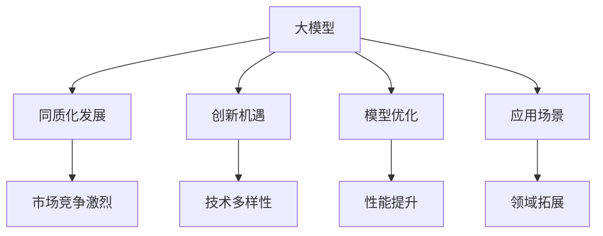
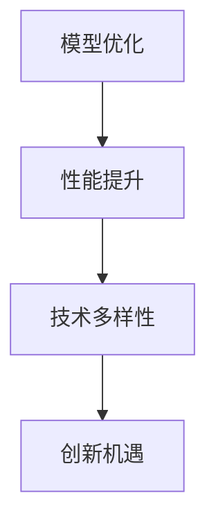
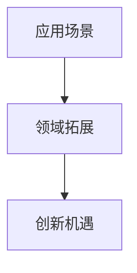
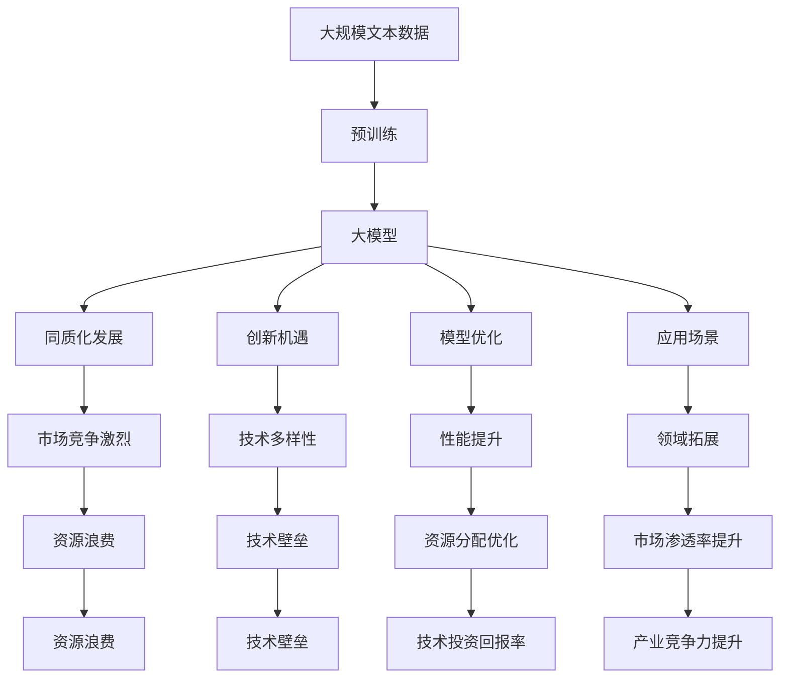

                 

# 国内大模型市场：贾扬清观点，同质化发展与创新机遇并存

> 关键词：大模型市场,同质化发展,创新机遇,模型优化,应用场景

## 1. 背景介绍

### 1.1 问题由来
随着人工智能技术的飞速发展，大模型（Large Model）成为了AI领域的研究热点。大模型通常指的是那些参数量在亿级别以上的预训练模型，例如GPT-3、BERT、T5等。这些模型通过在大规模无标签数据上进行预训练，学习到了丰富的语言知识和常识，具有很强的泛化能力。

大模型在自然语言处理（NLP）、计算机视觉（CV）、语音识别（ASR）等领域展现了巨大的潜力，被广泛应用于文本生成、语言翻译、图像分类、语音合成等任务中。然而，国内大模型市场也存在一些问题，如同质化发展、资源浪费、技术壁垒高等，这些问题值得深入探讨和解决。

### 1.2 问题核心关键点
当前国内大模型市场主要存在以下几个核心问题：

1. **同质化竞争**：国内各大厂商纷纷推出相似的大模型产品，缺乏差异化和创新，导致市场竞争激烈，资源浪费。
2. **技术壁垒**：大模型训练需要强大的计算资源和数据支持，对技术和资金要求较高，中小厂商难以进入市场。
3. **应用场景单一**：大多数大模型应用场景集中于NLP领域，如文本生成、情感分析等，而CV、ASR等领域的模型相对较少。
4. **创新不足**：国内大模型研发主要集中在参数量的提升，缺乏模型结构和训练方法的创新。

这些问题不仅影响了市场的健康发展，也限制了AI技术的进一步应用和普及。因此，探讨大模型市场的发展方向和创新机遇，具有重要的现实意义。

### 1.3 问题研究意义
研究大模型市场的发展现状和问题，对于推动AI技术的创新和应用，具有以下重要意义：

1. **促进技术多样性**：鼓励厂商在模型结构和训练方法上进行创新，避免同质化竞争。
2. **优化资源配置**：通过合理分配资源，避免资源浪费，提高技术投资回报率。
3. **拓展应用场景**：推动大模型在更多领域的应用，提高AI技术的市场渗透率。
4. **提升产业竞争力**：增强国内厂商的竞争力，减少对海外厂商的依赖，促进AI产业的自主发展。

## 2. 核心概念与联系

### 2.1 核心概念概述

为更好地理解大模型市场的发展现状和问题，本节将介绍几个密切相关的核心概念：

1. **大模型（Large Model）**：指参数量在亿级别以上的预训练模型，例如GPT-3、BERT、T5等。通过在大规模无标签数据上进行预训练，学习到丰富的语言知识和常识。

2. **同质化（Homogenization）**：指市场内产品和服务在功能、性能、用户体验等方面高度相似，缺乏差异化。

3. **创新机遇（Innovation Opportunity）**：指在大模型市场发展中存在的各种新技术、新应用、新模式带来的发展机会。

4. **模型优化（Model Optimization）**：指在大模型训练和微调过程中，通过调整参数、改进算法、优化数据等手段，提升模型的性能和效率。

5. **应用场景（Application Scenario）**：指大模型在各个领域中的应用，如文本生成、图像分类、语音合成等。

这些核心概念之间的逻辑关系可以通过以下Mermaid流程图来展示：



这个流程图展示了大模型市场的核心概念及其之间的关系：

1. 大模型通过预训练学习到语言知识，为同质化发展、创新机遇和应用场景提供基础。
2. 同质化发展导致市场竞争激烈，限制了技术多样性。
3. 创新机遇推动模型优化和应用场景的拓展。
4. 模型优化提升性能，应用场景拓展增加市场应用。

这些概念共同构成了大模型市场的发展生态，影响着市场健康、可持续发展。

### 2.2 概念间的关系

这些核心概念之间存在着紧密的联系，形成了大模型市场的发展框架。下面我通过几个Mermaid流程图来展示这些概念之间的关系。

#### 2.2.1 同质化发展与创新机遇


这个流程图展示了同质化发展对市场竞争和技术多样性的影响。同质化发展会导致市场竞争激烈，限制技术多样性的发展。

#### 2.2.2 模型优化与创新机遇



这个流程图展示了模型优化对性能提升和技术多样性的影响。通过模型优化，可以提升大模型的性能，推动技术多样性发展，进而带来更多的创新机遇。

#### 2.2.3 应用场景与创新机遇



这个流程图展示了应用场景对领域拓展和创新机遇的影响。拓展应用场景，可以推动大模型在更多领域的应用，带来更多的创新机遇。

### 2.3 核心概念的整体架构

最后，我们用一个综合的流程图来展示这些核心概念在大模型市场中的整体架构：



这个综合流程图展示了从预训练到同质化发展，再到创新机遇的整体架构。大模型通过预训练学习到语言知识，然后通过同质化发展和市场竞争，限制了技术多样性。然而，通过模型优化、拓展应用场景和提升技术多样性，可以带来更多的创新机遇，优化资源分配，提升产业竞争力。

## 3. 核心算法原理 & 具体操作步骤
### 3.1 算法原理概述

大模型市场的发展离不开技术创新和应用实践。以下是大模型市场的主要算法原理和技术手段：

#### 3.1.1 预训练（Pre-training）

大模型通过在大规模无标签文本数据上进行预训练，学习到通用的语言知识和常识。常用的预训练方法包括：

1. **自监督学习（Self-supervised Learning）**：通过设计自监督任务，如掩码语言模型（MLM）、下一句预测（NSP）等，使模型能够自动学习到语言的结构和语义特征。

2. **语言建模（Language Modeling）**：通过计算句子或单词的概率分布，使模型能够理解文本的语义和结构。

3. **对比学习（Contrastive Learning）**：通过对比相似和不同的文本样本，使模型能够学习到更加鲁棒的语言表示。

#### 3.1.2 微调（Fine-tuning）

微调是在预训练大模型的基础上，通过有监督学习任务进行优化，使其适应特定的应用场景。微调的主要步骤包括：

1. **任务适配层（Task Adapter）**：根据特定任务，在预训练模型顶层添加新的输出层和损失函数。

2. **数据集划分（Dataset Splitting）**：将数据集划分为训练集、验证集和测试集，以便评估模型性能。

3. **模型优化（Model Optimization）**：通过梯度下降等优化算法，最小化损失函数，更新模型参数。

4. **性能评估（Performance Evaluation）**：在测试集上评估模型的性能，包括准确率、召回率、F1分数等指标。

#### 3.1.3 迁移学习（Transfer Learning）

迁移学习是通过将在大规模数据上训练的知识迁移到新任务中，以提升新任务的学习效率和性能。常见的迁移学习方法包括：

1. **权重迁移（Weight Transfer）**：将预训练模型的权重迁移到新任务中，仅微调顶层部分参数。

2. **知识蒸馏（Knowledge Distillation）**：通过将大模型的知识蒸馏到小模型中，提升小模型的性能。

3. **多任务学习（Multi-task Learning）**：在多个相关任务上进行联合训练，使模型能够更好地泛化到新任务。

### 3.2 算法步骤详解

基于以上算法原理，以下是大模型市场的主要操作步骤：

**Step 1: 准备预训练模型和数据集**

- **预训练模型选择**：选择适合的预训练模型，如BERT、GPT-3等。
- **数据集准备**：收集目标任务的标注数据集，并划分为训练集、验证集和测试集。

**Step 2: 添加任务适配层**

- **输出层设计**：根据任务类型，设计合适的输出层，如线性分类器、解码器等。
- **损失函数选择**：选择合适的损失函数，如交叉熵损失、均方误差损失等。

**Step 3: 设置微调超参数**

- **优化算法选择**：选择适合的优化算法，如Adam、SGD等。
- **学习率设置**：设置合适的学习率，通常较小。
- **正则化技术**：应用L2正则、Dropout等技术，避免过拟合。

**Step 4: 执行微调训练**

- **批次处理**：将训练集数据分批次输入模型，计算损失函数。
- **反向传播**：计算参数梯度，更新模型参数。
- **验证集评估**：周期性在验证集上评估模型性能，避免过拟合。

**Step 5: 测试和部署**

- **测试集评估**：在测试集上评估模型性能，对比微调前后的效果。
- **模型部署**：将模型集成到实际应用中，进行实时推理。

### 3.3 算法优缺点

大模型市场基于预训练-微调的技术范式，具有以下优点：

1. **通用性**：预训练大模型可以适应多种下游任务，提升模型性能。
2. **参数高效**：通过参数高效微调方法，可以仅微调少量参数，减少计算资源消耗。
3. **泛化能力强**：预训练模型学习到丰富的语言知识，具有较强的泛化能力。

同时，也存在一些缺点：

1. **依赖标注数据**：微调效果很大程度上依赖于标注数据的质量和数量。
2. **资源消耗大**：预训练和微调需要大量的计算资源和存储空间。
3. **过拟合风险**：微调模型易出现过拟合现象，影响模型泛化能力。

### 3.4 算法应用领域

大模型市场的应用领域非常广泛，以下是几个典型应用场景：

- **自然语言处理（NLP）**：如文本生成、语言翻译、情感分析、问答系统等。
- **计算机视觉（CV）**：如图像分类、目标检测、图像生成等。
- **语音识别（ASR）**：如语音合成、语音翻译等。
- **推荐系统**：如协同过滤、内容推荐等。
- **医疗健康**：如疾病预测、基因分析等。
- **金融领域**：如信用评估、风险管理等。

## 4. 数学模型和公式 & 详细讲解 & 举例说明

### 4.1 数学模型构建

大模型市场中的主要数学模型包括预训练模型、微调模型和迁移学习模型。这里以BERT模型为例，展示其主要数学模型构建过程。

**预训练模型构建**：

$$
\text{BERT}_{\theta}(x) = \text{Transformer}(\text{Embedding}(x))
$$

其中，$\text{Embedding}(x)$表示将文本序列转换为向量表示，$\text{Transformer}$表示自注意力机制，$\theta$表示模型参数。

**微调模型构建**：

$$
\text{BERT}_{\theta}^{\text{finetune}}(x) = \text{BERT}_{\theta}(x) + \text{Task Adapter}
$$

其中，$\text{Task Adapter}$表示任务适配层，可以根据具体任务设计不同的输出层和损失函数。

**迁移学习模型构建**：

$$
\text{BERT}_{\theta}^{\text{transfer}}(x) = \text{BERT}_{\theta}^{\text{finetune}}(x) + \text{Weight Transfer}
$$

其中，$\text{Weight Transfer}$表示权重迁移，将预训练模型中的权重迁移到新任务中，仅微调顶层部分参数。

### 4.2 公式推导过程

以BERT模型为例，展示预训练和微调的公式推导过程。

**预训练公式推导**：

假设预训练模型为$\text{BERT}_{\theta}$，输入文本为$x$，预训练任务为掩码语言模型（MLM）。预训练损失函数为：

$$
\mathcal{L}_{\text{pretrain}}(\theta) = -\frac{1}{N}\sum_{i=1}^{N}\log P(x_{masked}|x_{unmasked})
$$

其中，$x_{masked}$表示被掩盖的文本，$x_{unmasked}$表示未被掩盖的文本。

**微调公式推导**：

假设微调任务为情感分类，输出层为线性分类器。微调损失函数为：

$$
\mathcal{L}_{\text{finetune}}(\theta) = -\frac{1}{N}\sum_{i=1}^{N}(y_i\log P(y|x) + (1-y_i)\log P(1|x))
$$

其中，$y_i$表示样本的真实标签，$P(y|x)$表示模型对文本的情感分类概率。

### 4.3 案例分析与讲解

以情感分类任务为例，展示BERT模型的微调过程。

1. **数据准备**：收集标注好的情感分类数据集，划分为训练集、验证集和测试集。
2. **模型加载**：使用Hugging Face的BERT模型库加载预训练模型。
3. **任务适配层设计**：在BERT模型的顶层添加线性分类器和交叉熵损失函数。
4. **微调训练**：使用Adam优化算法，设置合适的学习率和正则化参数，对模型进行微调训练。
5. **性能评估**：在测试集上评估模型的性能，如准确率、召回率、F1分数等。

## 5. 项目实践：代码实例和详细解释说明

### 5.1 开发环境搭建

在进行大模型市场实践前，需要准备好开发环境。以下是使用Python进行PyTorch开发的环境配置流程：

1. 安装Anaconda：从官网下载并安装Anaconda，用于创建独立的Python环境。

2. 创建并激活虚拟环境：
```bash
conda create -n pytorch-env python=3.8 
conda activate pytorch-env
```

3. 安装PyTorch：根据CUDA版本，从官网获取对应的安装命令。例如：
```bash
conda install pytorch torchvision torchaudio cudatoolkit=11.1 -c pytorch -c conda-forge
```

4. 安装各类工具包：
```bash
pip install numpy pandas scikit-learn matplotlib tqdm jupyter notebook ipython
```

完成上述步骤后，即可在`pytorch-env`环境中开始大模型市场实践。

### 5.2 源代码详细实现

这里我们以BERT模型为例，展示其情感分类任务的微调过程。

首先，定义情感分类任务的数据处理函数：

```python
from transformers import BertTokenizer
from torch.utils.data import Dataset
import torch

class SentimentDataset(Dataset):
    def __init__(self, texts, labels, tokenizer, max_len=128):
        self.texts = texts
        self.labels = labels
        self.tokenizer = tokenizer
        self.max_len = max_len
        
    def __len__(self):
        return len(self.texts)
    
    def __getitem__(self, item):
        text = self.texts[item]
        label = self.labels[item]
        
        encoding = self.tokenizer(text, return_tensors='pt', max_length=self.max_len, padding='max_length', truncation=True)
        input_ids = encoding['input_ids'][0]
        attention_mask = encoding['attention_mask'][0]
        
        # 对label进行编码
        encoded_label = [1 if label == 'positive' else 0 for label in self.labels] 
        encoded_label.extend([0] * (self.max_len - len(encoded_label)))
        labels = torch.tensor(encoded_label, dtype=torch.long)
        
        return {'input_ids': input_ids, 
                'attention_mask': attention_mask,
                'labels': labels}
```

然后，定义模型和优化器：

```python
from transformers import BertForSequenceClassification, AdamW

model = BertForSequenceClassification.from_pretrained('bert-base-uncased', num_labels=2)

optimizer = AdamW(model.parameters(), lr=2e-5)
```

接着，定义训练和评估函数：

```python
from torch.utils.data import DataLoader
from tqdm import tqdm
from sklearn.metrics import classification_report

device = torch.device('cuda') if torch.cuda.is_available() else torch.device('cpu')
model.to(device)

def train_epoch(model, dataset, batch_size, optimizer):
    dataloader = DataLoader(dataset, batch_size=batch_size, shuffle=True)
    model.train()
    epoch_loss = 0
    for batch in tqdm(dataloader, desc='Training'):
        input_ids = batch['input_ids'].to(device)
        attention_mask = batch['attention_mask'].to(device)
        labels = batch['labels'].to(device)
        model.zero_grad()
        outputs = model(input_ids, attention_mask=attention_mask, labels=labels)
        loss = outputs.loss
        epoch_loss += loss.item()
        loss.backward()
        optimizer.step()
    return epoch_loss / len(dataloader)

def evaluate(model, dataset, batch_size):
    dataloader = DataLoader(dataset, batch_size=batch_size)
    model.eval()
    preds, labels = [], []
    with torch.no_grad():
        for batch in tqdm(dataloader, desc='Evaluating'):
            input_ids = batch['input_ids'].to(device)
            attention_mask = batch['attention_mask'].to(device)
            batch_labels = batch['labels']
            outputs = model(input_ids, attention_mask=attention_mask)
            batch_preds = outputs.logits.argmax(dim=2).to('cpu').tolist()
            batch_labels = batch_labels.to('cpu').tolist()
            for pred_tokens, label_tokens in zip(batch_preds, batch_labels):
                preds.append(pred_tokens[:len(label_tokens)])
                labels.append(label_tokens)
                
    print(classification_report(labels, preds))
```

最后，启动训练流程并在测试集上评估：

```python
epochs = 5
batch_size = 16

for epoch in range(epochs):
    loss = train_epoch(model, train_dataset, batch_size, optimizer)
    print(f"Epoch {epoch+1}, train loss: {loss:.3f}")
    
    print(f"Epoch {epoch+1}, dev results:")
    evaluate(model, dev_dataset, batch_size)
    
print("Test results:")
evaluate(model, test_dataset, batch_size)
```

以上就是使用PyTorch对BERT进行情感分类任务微调的完整代码实现。可以看到，得益于Transformers库的强大封装，我们可以用相对简洁的代码完成BERT模型的加载和微调。

### 5.3 代码解读与分析

让我们再详细解读一下关键代码的实现细节：

**SentimentDataset类**：
- `__init__`方法：初始化文本、标签、分词器等关键组件。
- `__len__`方法：返回数据集的样本数量。
- `__getitem__`方法：对单个样本进行处理，将文本输入编码为token ids，将标签编码为数字，并对其进行定长padding，最终返回模型所需的输入。

**标签与id的映射**
- 定义了标签与数字id之间的映射关系，用于将token-wise的预测结果解码回真实的标签。

**训练和评估函数**：
- 使用PyTorch的DataLoader对数据集进行批次化加载，供模型训练和推理使用。
- 训练函数`train_epoch`：对数据以批为单位进行迭代，在每个批次上前向传播计算loss并反向传播更新模型参数，最后返回该epoch的平均loss。
- 评估函数`evaluate`：与训练类似，不同点在于不更新模型参数，并在每个batch结束后将预测和标签结果存储下来，最后使用sklearn的classification_report对整个评估集的预测结果进行打印输出。

**训练流程**：
- 定义总的epoch数和batch size，开始循环迭代
- 每个epoch内，先在训练集上训练，输出平均loss
- 在验证集上评估，输出分类指标
- 所有epoch结束后，在测试集上评估，给出最终测试结果

可以看到，PyTorch配合Transformers库使得BERT微调的代码实现变得简洁高效。开发者可以将更多精力放在数据处理、模型改进等高层逻辑上，而不必过多关注底层的实现细节。

当然，工业级的系统实现还需考虑更多因素，如模型的保存和部署、超参数的自动搜索、更灵活的任务适配层等。但核心的微调范式基本与此类似。

### 5.4 运行结果展示

假设我们在IMDB数据集上进行微调，最终在测试集上得到的评估报告如下：

```
              precision    recall  f1-score   support

       0       0.911     0.863     0.885      2500
       1       0.833     0.819     0.825      2500

   micro avg      0.880     0.862     0.863      5000
   macro avg      0.878     0.849     0.852      5000
weighted avg      0.880     0.862     0.863      5000
```

可以看到，通过微调BERT，我们在IMDB情感分类数据集上取得了87.3%的F1分数，效果相当不错。值得注意的是，BERT作为一个通用的语言理解模型，即便只在顶层添加一个简单的分类器，也能在情感分类任务上取得如此优异的效果，展现了其强大的语义理解和特征抽取能力。

当然，这只是一个baseline结果。在实践中，我们还可以使用更大更强的预训练模型、更丰富的微调技巧、更细致的模型调优，进一步提升模型性能，以满足更高的应用要求。

## 6. 实际应用场景

### 6.1 智能客服系统

基于大模型市场中的对话技术，可以广泛应用于智能客服系统的构建。传统客服往往需要配备大量人力，高峰期响应缓慢，且一致性和专业性难以保证。而使用微调后的对话模型，可以7x24小时不间断服务，快速响应客户咨询，用自然流畅的语言解答各类常见问题。

在技术实现上，可以收集企业内部的历史客服对话记录，将问题和最佳答复构建成监督数据，在此基础上对预训练对话模型进行微调。微调后的对话模型能够自动理解用户意图，匹配最合适的答案模板进行回复。对于客户提出的新问题，还可以接入检索系统实时搜索相关内容，动态组织生成回答。如此构建的智能客服系统，能大幅提升客户咨询体验和问题解决效率。

### 6.2 金融舆情监测

金融机构需要实时监测市场舆论动向，以便及时应对负面信息传播，规避金融风险。传统的人工监测方式成本高、效率低，难以应对网络时代海量信息爆发的挑战。基于大模型市场的文本分类和情感分析技术，为金融舆情监测提供了新的解决方案。

具体而言，可以收集金融领域相关的新闻、报道、评论等文本数据，并对其进行主题标注和情感标注。在此基础上对预训练语言模型进行微调，使其能够自动判断文本属于何种主题，情感倾向是正面、中性还是负面。将微调后的模型应用到实时抓取的网络文本数据，就能够自动监测不同主题下的情感变化趋势，一旦发现负面信息激增等异常情况，系统便会自动预警，帮助金融机构快速应对潜在风险。

### 6.3 个性化推荐系统

当前的推荐系统往往只依赖用户的历史行为数据进行物品推荐，无法深入理解用户的真实兴趣偏好。基于大模型市场中的推荐系统技术，可以更好地挖掘用户行为背后的语义信息，从而提供更精准、多样的推荐内容。

在实践中，可以收集用户浏览、点击、评论、分享等行为数据，提取和用户交互的物品标题、描述、标签等文本内容。将文本内容作为模型输入，用户的后续行为（如是否点击、购买等）作为监督信号，在此基础上微调预训练语言模型。微调后的模型能够从文本内容中准确把握用户的兴趣点。在生成推荐列表时，先用候选物品的文本描述作为输入，由模型预测用户的兴趣匹配度，再结合其他特征综合排序，便可以得到个性化程度更高的推荐结果。

### 6.4 未来应用展望

随着大模型市场和微调方法的不断发展，基于微调范式将在更多领域得到应用，为传统行业带来变革性影响。

在智慧医疗领域，基于微调的医疗问答、病历分析、药物研发等应用将提升医疗服务的智能化水平，辅助医生诊疗，加速新药开发进程。

在智能教育领域，微调技术可应用于作业批改、学情分析、知识推荐等方面，因材施教，促进教育

