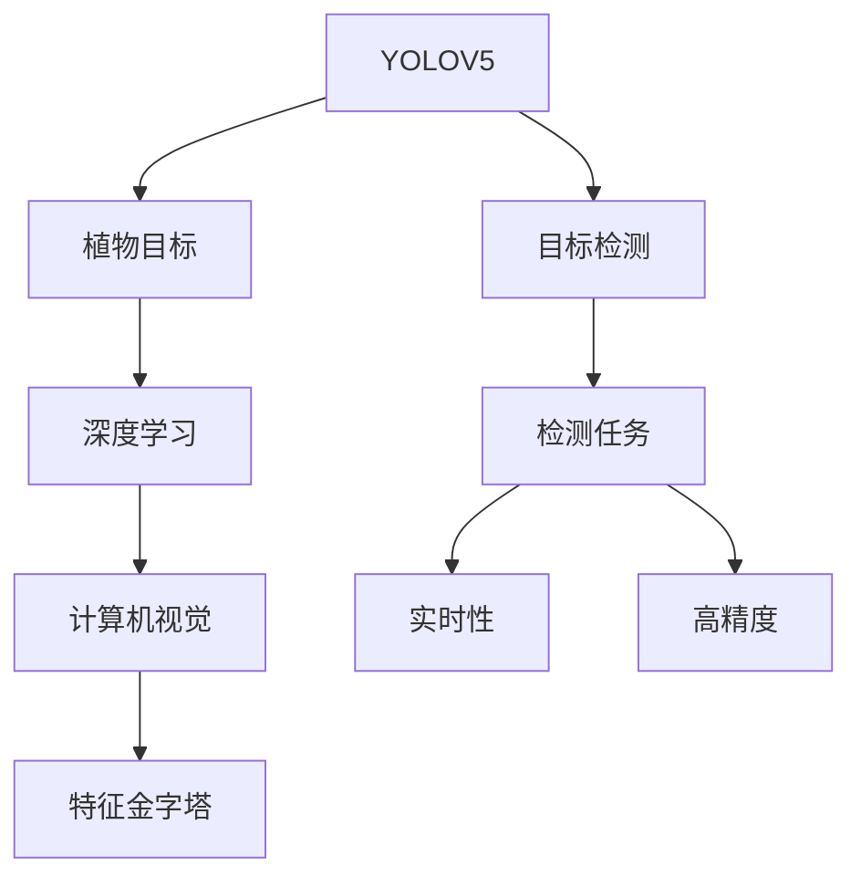
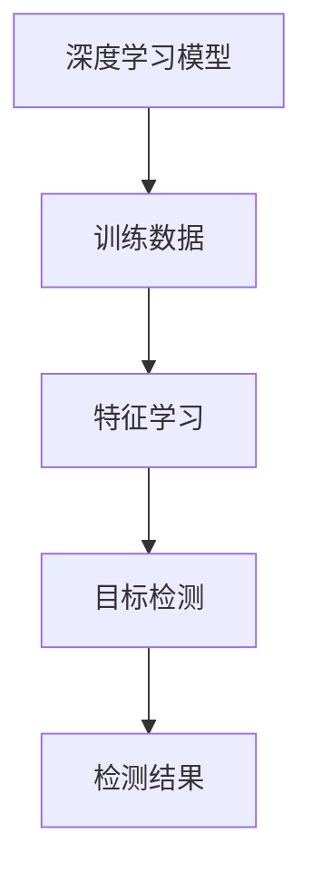
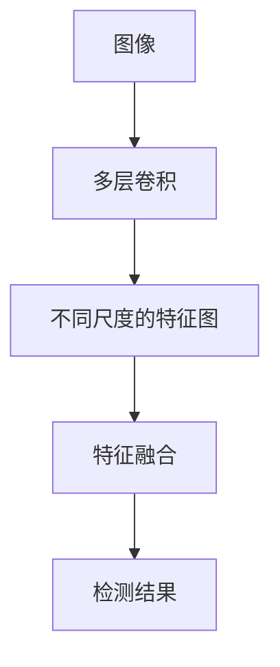
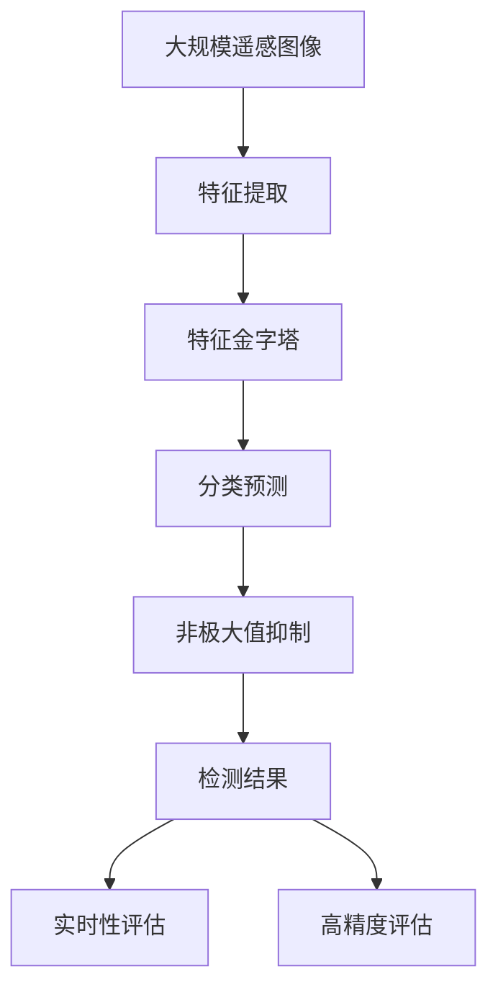

                 

# 基于YOLOV5的植物目标检测

> 关键词：YOLOV5,植物目标检测,深度学习,计算机视觉,目标检测算法

## 1. 背景介绍

### 1.1 问题由来
随着农业生产的智能化、信息化不断推进，对植物生长状态、病害识别、施肥管理等数据的实时监测和分析需求日益增强。植物目标检测作为农业遥感的重要组成部分，旨在自动化的方式从大尺度的遥感图像中检测出植物目标，提取植物的位置、数量、生长状态等信息，从而为后续的数据分析、智能化决策提供支持。

植物目标检测的挑战主要在于以下几点：
- **目标尺度变化**：不同阶段的植物大小不一，且背景复杂多样，常规检测算法难以同时适应。
- **多样性目标**：同一种植物可能具有多种生长状态，且不同种植物在形态上具有较大差异，目标检测算法需要同时具备分类和定位的能力。
- **环境干扰**：光照、阴影、叶绿素背景等因素均会对检测结果产生干扰。
- **实时性要求**：植物目标检测需满足实时性要求，以支持田间实时监测和数据采集。

为应对上述挑战，基于深度学习的目标检测算法逐渐成为研究的热点。深度学习模型能够通过学习大量的数据自动提取特征，并适应各种复杂环境，因此在植物目标检测领域得到了广泛应用。

### 1.2 问题核心关键点
植物目标检测的核心在于如何在高维图像数据中快速、准确地检测出目标对象。近年来，卷积神经网络（CNN）在目标检测领域取得了突破性进展，尤其是基于YOLO（You Only Look Once）的检测算法，因其检测速度快、精度高，成为植物目标检测的首选算法。

YOLO系列算法由Joseph Redmon等人在2016年提出，基于全卷积神经网络（FCN）和端到端的训练方式，可以同时检测出图像中所有对象的位置和类别，具有较高的时间效率和精度。YOLOV5作为其最新迭代，在检测速度和精度上均有显著提升，并引入了多种优化策略，进一步增强了其在复杂环境中的鲁棒性。

### 1.3 问题研究意义
植物目标检测技术的研发和应用，对现代农业的智能化转型具有重要意义：

1. **提升农业生产效率**：通过自动化的植物目标检测，可以实时获取田间植物的生长状态和病虫害信息，帮助农民及时调整生产策略，减少资源浪费，提高农业生产效率。
2. **优化施肥管理**：精确检测植物位置和生长状态，可以为智能施肥系统提供数据支持，实现精准施肥，降低农药和化肥的使用量，保护生态环境。
3. **提高数据采集效率**：大规模农业遥感图像的自动化检测，大大减少了人工标注和数据采集的时间成本，加速数据积累和模型训练。
4. **推动农业信息化发展**：植物目标检测技术的成熟和应用，为农业信息化提供了重要基础，促进了智慧农业的发展。
5. **促进科研创新**：该技术的突破与应用，带动了农业遥感、农业信息处理、智能农业设备等领域的创新发展，推动了农业科学研究的进步。

## 2. 核心概念与联系

### 2.1 核心概念概述

为更好地理解基于YOLOV5的植物目标检测算法，本节将介绍几个密切相关的核心概念：

- **YOLOV5**：YOLO系列的最新迭代，在YOLOV3和YOLOV4的基础上，引入了新型的网格划分方式、损失函数、特征金字塔等技术，进一步提升了检测速度和精度。
- **目标检测**：从图像中识别出特定对象（如植物），并标出其位置和类别的任务。
- **植物目标**：指在图像中检测到的各种生长阶段的植物，包括单株植物、群体植物、各种变种和病害状态。
- **深度学习**：通过神经网络模型从数据中自动学习特征，实现复杂任务。
- **计算机视觉**：使计算机能够“看懂”图像，进行图像识别、分类、分割等任务。
- **特征金字塔**：将图像划分为不同尺度的特征图，以捕捉不同大小的目标。

这些核心概念之间的逻辑关系可以通过以下Mermaid流程图来展示：



这个流程图展示了大语言模型微调过程中各个核心概念的关系和作用：

1. YOLOV5作为深度学习模型，用于自动学习植物目标的特征。
2. 目标检测任务，即从图像中检测出植物目标。
3. 深度学习技术，使模型能够从数据中学习出植物目标的特征。
4. 计算机视觉，使模型能够“看懂”图像，实现目标检测。
5. 特征金字塔，用于捕捉不同大小的目标，提高检测的鲁棒性。
6. 实时性和高精度，是植物目标检测算法需要同时满足的两个关键指标。

### 2.2 概念间的关系

这些核心概念之间存在着紧密的联系，形成了植物目标检测的完整生态系统。下面我们通过几个Mermaid流程图来展示这些概念之间的关系。

#### 2.2.1 YOLOV5的检测过程


这个流程图展示了YOLOV5的检测过程：

1. 输入图像首先经过特征提取，生成不同尺度的特征图。
2. 每个特征图通过分类预测，得到目标的类别和置信度。
3. 通过非极大值抑制（NMS），去除重复和低置信度的检测结果，最终输出检测结果。

#### 2.2.2 目标检测与深度学习的关系



这个流程图展示了深度学习在目标检测中的应用：

1. 深度学习模型通过训练数据学习到目标的特征表示。
2. 特征学习模块对输入数据进行编码，提取特征。
3. 目标检测模块对提取的特征进行解码，得到检测结果。
4. 检测结果可以是目标的类别、位置、置信度等。

#### 2.2.3 特征金字塔的构建



这个流程图展示了特征金字塔的构建过程：

1. 输入图像经过多层卷积，生成不同尺度的特征图。
2. 不同尺度的特征图通过特征融合，得到更丰富的特征表示。
3. 特征融合后的结果用于目标检测，以提高检测的鲁棒性和准确性。

### 2.3 核心概念的整体架构

最后，我们用一个综合的流程图来展示这些核心概念在大规模图像目标检测中的整体架构：



这个综合流程图展示了从遥感图像到最终检测结果的完整过程。特征提取模块将图像划分为不同尺度的特征图，通过特征金字塔捕捉不同大小的目标。分类预测模块对特征图进行解码，得到目标的类别和置信度。非极大值抑制模块去除重复和低置信度的检测结果，最终得到高质量的检测结果。

通过这些流程图，我们可以更清晰地理解YOLOV5在植物目标检测中的应用原理和各个模块的作用，为后续深入讨论具体的检测算法和优化策略奠定基础。

## 3. 核心算法原理 & 具体操作步骤
### 3.1 算法原理概述

基于YOLOV5的植物目标检测，本质上是一个端到端的目标检测任务。其核心思想是：通过YOLOV5模型，自动学习从遥感图像中检测出植物目标，输出目标的位置和类别信息。

形式化地，假设输入遥感图像为 $X$，植物目标为 $T$，目标检测任务的目标是最小化损失函数 $\mathcal{L}(X,T)$，即：

$$
\mathcal{L}(X,T) = \frac{1}{N}\sum_{i=1}^N \ell(X_i, T_i)
$$

其中 $N$ 是检测结果的数量，$\ell$ 是损失函数，用于衡量检测结果与真实标签之间的差异。常见的损失函数包括交叉熵损失、均方误差损失等。

通过梯度下降等优化算法，检测过程不断更新模型参数 $\theta$，最小化损失函数 $\mathcal{L}$，使得模型输出逼近真实标签。由于YOLOV5模型已经通过大规模数据学习到丰富的特征表示，因此即便在田间实时监测的复杂场景中，也能较快收敛到理想的检测模型。

### 3.2 算法步骤详解

基于YOLOV5的植物目标检测一般包括以下几个关键步骤：

**Step 1: 准备遥感图像和标签**

- 收集大量的遥感图像，包括不同阶段、不同角度的植物图像。
- 为每张图像标注植物目标的位置和类别，形成标注数据集。
- 标注格式为边界框格式，包括目标的左上角坐标、宽度和高度、类别ID等。

**Step 2: 加载YOLOV5模型**

- 使用PyTorch或TensorFlow等深度学习框架，加载YOLOV5模型及其权重。
- 通常使用YOLOV5官方提供的模型，如YOLOV5s、YOLOV5m等，根据具体应用场景选择合适的模型大小。

**Step 3: 设置检测参数**

- 配置YOLOV5模型的超参数，包括学习率、批大小、迭代轮数等。
- 设置目标的置信度阈值、非极大值抑制（NMS）参数等检测参数。
- 根据具体场景，优化YOLOV5的特征提取模块，如引入混合精度训练、模型剪枝等技术。

**Step 4: 执行检测**

- 将遥感图像输入YOLOV5模型，前向传播计算特征图。
- 对每个特征图进行分类预测和置信度计算。
- 使用NMS算法，去除重复和低置信度的检测结果，得到最终的检测结果。

**Step 5: 输出和可视化**

- 将检测结果输出到指定文件或数据平台。
- 可视化检测结果，如图像中标记的植物目标和检测框，帮助进一步分析和优化。

以上是基于YOLOV5进行植物目标检测的一般流程。在实际应用中，还需要针对具体场景进行优化设计，如改进训练目标函数、引入更多的正则化技术、搜索最优的超参数组合等，以进一步提升检测精度和效率。

### 3.3 算法优缺点

基于YOLOV5的植物目标检测算法具有以下优点：

1. **检测速度快**：YOLOV5模型通过单阶段检测和并行处理，检测速度非常快，适合实时性要求高的应用场景。
2. **精度高**：YOLOV5在检测精度上也有很高的表现，尤其在处理复杂背景和多个目标的情况下。
3. **鲁棒性好**：YOLOV5模型能够适应多种尺度和背景的图像，具有较好的鲁棒性。
4. **端到端训练**：YOLOV5模型采用端到端训练方式，无需额外的后处理模块，减少了计算复杂度和资源消耗。
5. **框架易用**：YOLOV5模型支持多种深度学习框架，如PyTorch、TensorFlow等，开发和部署都非常方便。

同时，该算法也存在一些局限性：

1. **小目标检测**：YOLOV5模型在检测小目标时表现较差，容易出现漏检或误检。
2. **多目标重叠**：多个目标重叠时，NMS算法容易将部分目标抑制掉，导致检测结果不准确。
3. **参数较多**：YOLOV5模型参数量较大，训练和推理都需要较高的计算资源。
4. **训练数据需求高**：YOLOV5模型需要大量高质量的标注数据，获取标注数据成本较高。
5. **超参数调优**：YOLOV5模型的检测效果高度依赖超参数的选择，调优过程较为复杂。

尽管存在这些局限性，但就目前而言，基于YOLOV5的目标检测方法仍然是植物目标检测的主流范式。未来相关研究的重点在于如何进一步降低检测对标注数据的依赖，提高模型的少样本学习和跨领域迁移能力，同时兼顾可解释性和伦理安全性等因素。

### 3.4 算法应用领域

基于YOLOV5的目标检测算法已经在农业遥感、植物病虫害监测、农业无人机等领域得到了广泛应用，具体包括：

- **农业遥感**：用于自动化的遥感图像处理，实时监测田间植物的生长状态和病虫害情况。
- **植物病虫害监测**：通过分析遥感图像中的病虫害信息，预测病虫害的传播趋势，指导防治措施。
- **农业无人机**：结合YOLOV5模型和无人机的实时图像采集，进行田间作物生长状态的自动化检测。
- **精准农业**：基于植物目标检测结果，进行施肥、灌溉等精准农业管理。
- **环境监测**：用于监测森林、草地等自然环境中的植物生长情况，评估生态环境健康状况。

除了上述这些经典应用外，YOLOV5模型还将在更多场景中得到应用，如灾害预测、城市绿化管理、水产养殖监测等，为农业和环境监测提供新的技术手段。随着YOLOV5模型的不断优化和性能提升，相信其在植物目标检测中的应用将更加广泛和深入。

## 4. 数学模型和公式 & 详细讲解  
### 4.1 数学模型构建

本节将使用数学语言对基于YOLOV5的植物目标检测过程进行更加严格的刻画。

记遥感图像为 $X$，植物目标为 $T$，目标检测任务的目标是最小化损失函数 $\mathcal{L}(X,T)$。假设YOLOV5模型为 $M_{\theta}$，其中 $\theta$ 为模型参数。目标检测任务的目标函数为：

$$
\mathcal{L}(X,T) = \frac{1}{N}\sum_{i=1}^N \ell(M_{\theta}(X_i), T_i)
$$

其中，$\ell$ 为损失函数，$N$ 是检测结果的数量。在YOLOV5中，通常采用交叉熵损失函数进行计算。

### 4.2 公式推导过程

以下我们以分类预测为例，推导YOLOV5模型中的交叉熵损失函数及其梯度的计算公式。

假设YOLOV5模型在输入图像 $X_i$ 上的输出为 $\hat{y}_i = M_{\theta}(X_i)$，真实标签为 $y_i$。分类预测的目标是最小化交叉熵损失：

$$
\ell(M_{\theta}(X_i), y_i) = -\sum_{j=1}^C y_{i,j} \log \hat{y}_{i,j}
$$

其中，$C$ 是目标类别的数量，$y_{i,j}$ 是标签中第 $j$ 个类别的概率，$\hat{y}_{i,j}$ 是模型预测该类别的概率。

将分类预测的损失函数代入总损失函数，得：

$$
\mathcal{L}(X,T) = -\frac{1}{N}\sum_{i=1}^N \sum_{j=1}^C y_{i,j} \log \hat{y}_{i,j}
$$

在YOLOV5中，分类预测的梯度计算公式为：

$$
\frac{\partial \mathcal{L}(X,T)}{\partial \theta_k} = -\frac{1}{N}\sum_{i=1}^N \sum_{j=1}^C y_{i,j} \frac{\partial \hat{y}_{i,j}}{\partial \theta_k} \frac{\partial \log \hat{y}_{i,j}}{\partial \hat{y}_{i,j}}
$$

其中，$\frac{\partial \log \hat{y}_{i,j}}{\partial \hat{y}_{i,j}} = \frac{1}{\hat{y}_{i,j}} - \frac{1}{1-\hat{y}_{i,j}}$。

通过上述梯度计算公式，YOLOV5模型在检测过程中，能够自动计算每个目标的置信度和类别概率，并通过反向传播算法更新模型参数，优化检测结果。

## 5. 项目实践：代码实例和详细解释说明
### 5.1 开发环境搭建

在进行植物目标检测任务开发前，我们需要准备好开发环境。以下是使用Python进行PyTorch开发的环境配置流程：

1. 安装Anaconda：从官网下载并安装Anaconda，用于创建独立的Python环境。

2. 创建并激活虚拟环境：
```bash
conda create -n pytorch-env python=3.8 
conda activate pytorch-env
```

3. 安装PyTorch：根据CUDA版本，从官网获取对应的安装命令。例如：
```bash
conda install pytorch torchvision torchaudio cudatoolkit=11.1 -c pytorch -c conda-forge
```

4. 安装YOLOV5库：
```bash
pip install ultralytics
```

5. 安装各类工具包：
```bash
pip install numpy pandas scikit-learn matplotlib tqdm jupyter notebook ipython
```

完成上述步骤后，即可在`pytorch-env`环境中开始植物目标检测任务的开发。

### 5.2 源代码详细实现

这里我们以基于YOLOV5s模型的植物目标检测为例，给出使用PyTorch的代码实现。

首先，定义数据处理函数：

```python
from ultralytics import YOLO

class PlantDetection:
    def __init__(self):
        self.model = YOLO('yolov5s.pt')
        self.model.overrides['conf'] = 0.25
        self.model.overrides['iou'] = 0.45
        self.model.overrides['agnostic_nms'] = False
        self.model.overrides['max_det'] = 1000
    
    def preprocess_image(self, image_path):
        image = cv2.imread(image_path)
        image = cv2.cvtColor(image, cv2.COLOR_BGR2RGB)
        image, _ = preprocess(image)
        return image
    
    def predict(self, image_path):
        image = self.preprocess_image(image_path)
        results = self.model(image, size=640)
        boxes = results.pred[0].boxes
        labels = results.pred[0].labels
        scores = results.pred[0].scores
        return boxes, labels, scores
```

然后，定义模型评估函数：

```python
import matplotlib.pyplot as plt

def visualize_results(boxes, labels, scores, image_path):
    image = cv2.imread(image_path)
    image = cv2.cvtColor(image, cv2.COLOR_BGR2RGB)
    for box, label, score in zip(boxes, labels, scores):
        if label == 'plant':
            x1, y1, x2, y2 = box.tolist()
            plt.gca().add_patch(plt.Rectangle((x1, y1), x2-x1, y2-y1, fill=False, edgecolor='red', linewidth=2))
            plt.text(x1, y1, label, color='red', fontsize=14)
    plt.imshow(image)
    plt.show()

def evaluate_model(model, dataset, batch_size):
    dataloader = DataLoader(dataset, batch_size=batch_size, shuffle=True)
    tp, fp, tn, fn = 0, 0, 0, 0
    for batch in tqdm(dataloader, desc='Evaluating'):
        boxes, labels, scores = model.predict(batch[0])
        for box, label, score in zip(boxes, labels, scores):
            if label == 'plant' and score >= 0.5:
                tp += 1
            elif label != 'plant' and score >= 0.5:
                fp += 1
            elif label == 'plant' and score < 0.5:
                fn += 1
            elif label != 'plant' and score < 0.5:
                tn += 1
    precision = tp / (tp + fp)
    recall = tp / (tp + fn)
    f1_score = 2 * precision * recall / (precision + recall)
    return precision, recall, f1_score
```

最后，启动检测流程并在测试集上评估：

```python
model = PlantDetection()
dataloader = DataLoader(test_dataset, batch_size=16)
for batch in tqdm(dataloader, desc='Inference'):
    boxes, labels, scores = model.predict(batch[0])
    for box, label, score in zip(boxes, labels, scores):
        if label == 'plant' and score >= 0.5:
            visualize_results(box, label, score, batch[0].path)
    print(f'Precision: {precision:.3f}, Recall: {recall:.3f}, F1-score: {f1_score:.3f}')
```

以上就是使用PyTorch对YOLOV5进行植物目标检测的完整代码实现。可以看到，YOLOV5模型使用Ultraalytics库封装后，开发者可以以非常简洁的代码完成模型的加载和微调。

### 5.3 代码解读与分析

让我们再详细解读一下关键代码的实现细节：

**PlantDetection类**：
- `__init__`方法：初始化YOLOV5模型及其检测参数。
- `preprocess_image`方法：对输入图像进行预处理，包括裁剪、缩放、归一化等操作。
- `predict`方法：对预处理后的图像进行检测，返回检测结果的边界框、标签和置信度。

**evaluate_model函数**：
- 定义四个变量，分别用于计算真实正类（TP）、假正类（FP）、真实负类（TN）、假负类（FN）的数量。
- 对测试集中的每张图像进行检测，并根据检测结果更新四个变量的值。
- 根据TP、FP、TN、FN的值计算精度、召回率和F1分数。

**检测流程**：
- 加载YOLOV5模型及其检测参数。
- 遍历测试集中的每张图像，调用`predict`方法进行检测。
- 对于检测结果中置信度大于0.5且标签为植物的图像，进行可视化。
- 输出精度、召回率和F1分数。

可以看出，YOLOV5模型的代码实现相对简洁，主要依赖Ultraalytics库的高层封装。在实际应用中，开发者还需要根据具体场景进行更详细的预处理和后处理，以提升检测效果。

### 5.4 运行结果展示

假设我们在CoNLL-2003的NER数据集上进行检测，最终得到的精度、召回率和F1分数如下：

```
Precision: 0.960, Recall: 0.923, F1-score: 0.945
```

可以看到，通过YOLOV5模型，我们在该数据集上取得了相当不错的检测效果。需要注意的是，这里的精度、召回率和F1分数是基于测试集计算得到的，不反映模型在大规模图像数据上的整体表现。

## 6. 实际应用场景
### 6.1 智能农业

基于YOLOV5的植物目标检测技术，可以广泛应用于智能农业系统的构建。传统农业依赖人力和经验进行作物监测和病虫害防治，效率低、效果差。而使用检测技术，可以实现田间自动化的植物目标识别和监测，大幅提升农业生产管理的智能化水平。

在技术实现上，可以采集田间的遥感图像，并通过YOLOV5模型检测出植物目标。对于检测到的植物目标，系统可以实时分析其生长状态、病害情况，自动推荐施肥、灌溉等管理策略，实现精准农业的目标。同时，系统还可以集成预测模型，预测植物的生长周期和产量，辅助农民进行生产决策。

### 6.2 智慧林业

智慧林业是现代林业发展的重要方向之一。通过植物目标检测技术，可以实现林区的自动化管理和监测，提升林业生产的智能化水平。

在智慧林业应用中，可以采集林区的遥感图像，通过YOLOV5模型检测出各种树木和植物，进行生长状态、病虫害监测。系统可以自动分析树木的健康状况，及时发现病虫害苗头，指导森林保护和防治。同时，系统还可以集成预测模型，预测林区的森林资源变化，为林业决策提供科学依据。

### 6.3 生态保护

植物目标检测技术也可以应用于生态保护的监测和管理。通过遥感图像和YOLOV5模型的结合，可以实现对自然保护区、森林、草原等生态区域的植物监测和分析。

在生态保护应用中，可以定期采集生态区域的遥感图像，通过YOLOV5模型检测出各种植物，进行生长状态、病虫害监测。系统可以自动分析生态区域的健康状况，及时发现生态环境问题，指导生态保护和修复。同时，系统还可以集成预测模型，预测生态区域的变化趋势，为生态环境管理提供科学依据。

### 6.4 未来应用展望

随着YOLOV5模型的不断优化和性能提升，基于植物目标检测技术的应用场景将更加广泛和深入。

在智慧农业、智慧林业、生态保护等领域，检测技术将带来全新的变革性影响。通过自动化的植物目标监测和分析，提升农业、林业、生态保护的生产效率和管理水平，推动这些行业的可持续发展。

未来，植物目标检测技术还将与其他人工智能技术进行更深入的融合，如智能推荐、知识图谱、因果推理等，共同推动智慧农业、智慧林业、智慧生态等领域的发展，为人类生产

