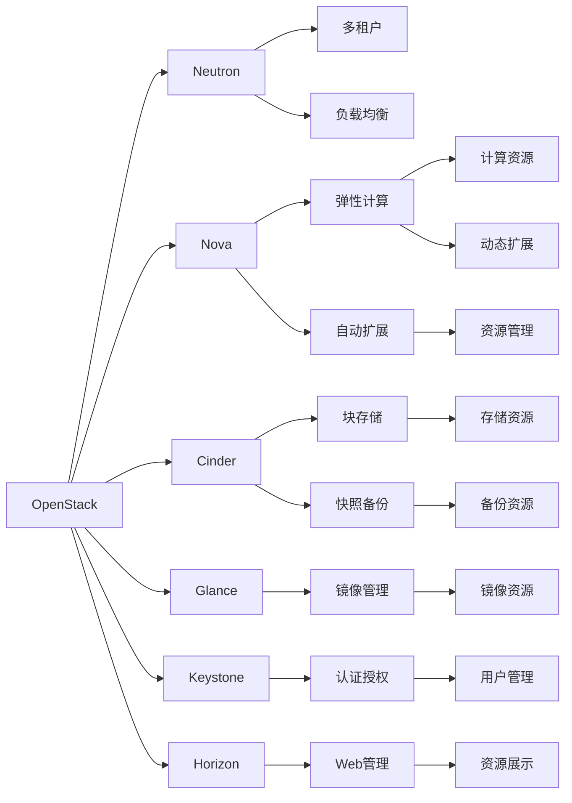

                 

# 基于openstack的云服务平台

> 关键词：
- OpenStack
- 云服务平台
- 自动扩展
- 弹性计算
- 多租户
- 安全性
- 自动化部署
- 负载均衡
- DevOps
- 高可用性

## 1. 背景介绍

### 1.1 问题由来

随着云计算技术的迅速发展，企业在云计算的应用上愈加广泛，对于云服务平台的建设也成为了企业数字化转型的一个重要方向。然而，云平台建设和运维过程繁琐复杂，需要投入大量的人力和时间成本。在市场竞争日益激烈的情况下，如何高效构建和管理云服务平台，成为了众多企业的痛点。

为了解决这一问题，OpenStack应运而生。作为开源云计算基础设施管理平台，OpenStack涵盖了计算、存储、网络等多个领域，提供了丰富的开源组件，帮助企业快速构建和管理云服务平台。

### 1.2 问题核心关键点

OpenStack的成功在于其开源、灵活和可扩展的特点，能够根据企业的不同需求，构建多样化的云服务平台。其核心组件包括：

- **Neutron**：网络服务模块，支持多租户虚拟网络、负载均衡、安全组等功能。
- **Nova**：计算服务模块，管理虚拟机的生命周期、实例扩展、网络等。
- **Cinder**：块存储服务模块，提供块存储、快照、备份等。
- **Glance**：镜像服务模块，管理虚拟机的镜像。
- **Keystone**：认证与授权服务模块，管理用户和角色。
- **Horizon**：控制面板，提供Web界面管理云资源。

这些组件相互配合，实现了云服务平台的完整功能，能够支持多种部署方式，包括公有云、私有云和混合云等。

### 1.3 问题研究意义

OpenStack在云计算领域的成功，不仅为企业提供了强大的基础设施管理平台，还促进了云计算技术的普及和创新。通过学习OpenStack的设计理念和实践经验，能够帮助企业更好地构建和管理自己的云服务平台，提升云计算的应用价值。

## 2. 核心概念与联系

### 2.1 核心概念概述

为了更好地理解基于OpenStack的云服务平台构建过程，下面简要介绍一些核心概念：

- **OpenStack**：开源云计算基础设施管理平台，提供计算、存储、网络等核心服务。
- **云服务平台**：基于OpenStack构建的云基础设施管理平台，支持多租户、弹性计算、自动扩展等功能。
- **多租户**：支持多个独立的用户和组织在同一云平台上运行，每个租户独立管理自己的资源。
- **弹性计算**：支持自动扩展，根据需求动态调整计算资源。
- **负载均衡**：通过自动分配负载，提高云平台的计算性能。
- **自动化部署**：通过自动化工具，实现快速部署和管理。
- **DevOps**：结合软件开发和运维，实现高效的云平台管理。
- **高可用性**：保证云平台的稳定性和可靠性，避免单点故障。

这些概念共同构成了OpenStack云服务平台的完整架构，其设计和实现方法对云平台构建和管理具有重要指导意义。

### 2.2 概念间的关系

这些核心概念之间的关系可以通过以下Mermaid流程图来展示：



这个流程图展示了OpenStack各个组件的功能和它们之间的联系：

1. **Neutron**：管理多租户虚拟网络，实现负载均衡和安全组。
2. **Nova**：管理计算资源，支持弹性计算和动态扩展。
3. **Cinder**：提供块存储和快照备份服务。
4. **Glance**：管理虚拟镜像，支持镜像快速部署。
5. **Keystone**：管理用户和角色，提供认证授权服务。
6. **Horizon**：提供Web界面，用于管理云资源。

这些组件相互配合，实现多租户、弹性计算、自动扩展、负载均衡、高可用性等云服务平台的核心功能。

## 3. 核心算法原理 & 具体操作步骤
### 3.1 算法原理概述

基于OpenStack的云服务平台构建，本质上是将OpenStack核心组件按照企业的具体需求进行定制化配置，并通过自动化部署工具进行快速部署和管理。其核心算法包括：

- **多租户算法**：实现多个独立租户在同一云平台上运行，每个租户独立管理自己的资源。
- **弹性计算算法**：支持根据需求动态调整计算资源，实现自动扩展。
- **负载均衡算法**：通过自动分配负载，提高云平台的计算性能。
- **DevOps算法**：结合软件开发和运维，实现高效的云平台管理。
- **高可用性算法**：保证云平台的稳定性和可靠性，避免单点故障。

### 3.2 算法步骤详解

基于OpenStack的云服务平台构建步骤如下：

1. **需求分析**：根据企业的需求，选择适合的OpenStack版本和组件，明确需要实现的功能。
2. **环境配置**：在本地或远程服务器上搭建OpenStack环境，包括网络、存储、计算等基础设施。
3. **组件部署**：按照需求配置OpenStack核心组件，并进行自动化部署。
4. **功能测试**：对云服务平台进行功能测试，确保各个组件能够正常工作。
5. **优化和调优**：根据测试结果，对云平台进行优化和调优，提升性能和稳定性。
6. **部署上线**：将云平台部署到生产环境，进行监控和管理。

### 3.3 算法优缺点

基于OpenStack的云服务平台构建方法具有以下优点：

- **开源灵活**：OpenStack的开源特性使其可以根据企业的具体需求进行灵活配置和定制。
- **多租户支持**：支持多个独立租户在同一云平台上运行，提升资源的利用率。
- **自动化部署**：通过自动化工具实现快速部署和管理，降低人力成本和时间成本。
- **高可用性**：通过负载均衡和高可用性设计，提升云平台的稳定性和可靠性。

同时，该方法也存在以下缺点：

- **学习成本高**：需要熟悉OpenStack的核心组件和配置命令，学习成本较高。
- **配置复杂**：根据企业的具体需求进行配置，可能需要进行复杂的调整和测试。
- **运维难度大**：自动化部署和管理虽然降低了人力成本，但需要对自动化工具和脚本进行维护和管理。

### 3.4 算法应用领域

基于OpenStack的云服务平台构建方法，主要应用于以下领域：

- **企业级云平台**：支持企业构建私有云、混合云等云平台，满足企业多样化的需求。
- **数据中心**：支持数据中心的IT资源管理，实现高效的数据存储和计算。
- **云服务提供商**：帮助云服务提供商快速构建和管理云服务平台，提升服务质量。
- **科研机构**：支持科研机构进行高性能计算、大规模数据分析等任务。

## 4. 数学模型和公式 & 详细讲解 & 举例说明

### 4.1 数学模型构建

基于OpenStack的云服务平台构建，涉及多租户、弹性计算、负载均衡、高可用性等核心功能。以下简要介绍相关数学模型：

- **多租户模型**：
  $$
  M = \{M_t | t \in T\}
  $$
  其中 $M_t$ 表示租户 $t$ 的云资源，$T$ 表示所有租户。
  
- **弹性计算模型**：
  $$
  C = \sum_{i=1}^n C_i
  $$
  其中 $C_i$ 表示计算资源 $i$ 的数量，$n$ 表示资源总数。
  
- **负载均衡模型**：
  $$
  L = \frac{\sum_{i=1}^n C_i}{N}
  $$
  其中 $N$ 表示计算节点数量。
  
- **高可用性模型**：
  $$
  H = \frac{\sum_{i=1}^n C_i}{R}
  $$
  其中 $R$ 表示资源冗余度。

### 4.2 公式推导过程

以下对每个模型进行推导：

1. **多租户模型**：
  - 模型定义：
    $$
    M = \{M_t | t \in T\}
    $$
  - 推导：
    $$
    M_t = M_{t_1, t_2, ..., t_k}
    $$
    其中 $M_{t_i}$ 表示租户 $t_i$ 的云资源。

2. **弹性计算模型**：
  - 模型定义：
    $$
    C = \sum_{i=1}^n C_i
    $$
  - 推导：
    $$
    C = C_1 + C_2 + ... + C_n
    $$

3. **负载均衡模型**：
  - 模型定义：
    $$
    L = \frac{\sum_{i=1}^n C_i}{N}
    $$
  - 推导：
    $$
    L = \frac{C_1 + C_2 + ... + C_n}{N}
    $$

4. **高可用性模型**：
  - 模型定义：
    $$
    H = \frac{\sum_{i=1}^n C_i}{R}
    $$
  - 推导：
    $$
    H = \frac{C_1 + C_2 + ... + C_n}{R}
    $$

### 4.3 案例分析与讲解

假设企业需要构建一个多租户云平台，支持5个租户运行，每个租户需要20个计算节点。

1. **多租户模型**：
  - $M = \{M_1, M_2, M_3, M_4, M_5\}$
  - $M_t = \{C_{t_1}, C_{t_2}, ..., C_{t_{20}}\}$
  - $T = \{1, 2, 3, 4, 5\}$

2. **弹性计算模型**：
  - $C = C_1 + C_2 + ... + C_{100}$
  - 其中 $C_i = 20$，$n = 5$

3. **负载均衡模型**：
  - $L = \frac{100}{N}$
  - 假设 $N = 50$，则 $L = 2$

4. **高可用性模型**：
  - $H = \frac{100}{R}$
  - 假设 $R = 2$，则 $H = 50$

## 5. 项目实践：代码实例和详细解释说明
### 5.1 开发环境搭建

要基于OpenStack构建云服务平台，首先需要搭建开发环境。以下是使用Ubuntu 20.04 LTS和OpenStack Essex版进行搭建的步骤：

1. **准备硬件**：
  - 2台物理服务器（CPU至少4核、内存至少8GB）
  - 一个用于安装OpenStack控制节点的虚拟机（至少2GB内存）
  - 一个用于安装OpenStack计算节点的虚拟机（至少4GB内存）
  
2. **安装操作系统**：
  - 在控制节点和计算节点上安装Ubuntu 20.04 LTS
  - 在控制节点上安装Keystone、Horizon等组件，在计算节点上安装Nova、Neutron、Cinder等组件
  
3. **安装OpenStack**：
  - 在控制节点上安装OpenStack Essex版
  - 在计算节点上安装Nova、Neutron、Cinder等组件

4. **配置环境**：
  - 配置网络、存储、计算等基础设施
  - 配置认证、授权、镜像等核心组件

### 5.2 源代码详细实现

以下是一个简单的Python脚本，用于自动化部署基于OpenStack的云服务平台：

```python
from openstack import api

def deploy_cloud():
    # 初始化OpenStack API
    api.init()

    # 创建计算节点
    node = api.create_node('compute', 'node1')

    # 创建虚拟机
    vm = api.create_virtual_machine('compute', 'vm1')

    # 创建网络
    net = api.create_network('network', 'net1')

    # 创建虚拟网络
    vnet = api.create_virtual_network('network', 'vnet1')

    # 创建虚拟交换机
    sw = api.create_virtual_switch('network', 'sw1')

    # 连接虚拟交换机和虚拟网络
    api.connect_virtual_switch('network', 'vnet1', 'sw1')

    # 创建负载均衡器
    lb = api.create_load_balancer('compute', 'lb1')

    # 创建负载均衡器池
    pool = api.create_load_balancer_pool('compute', 'pool1')

    # 创建负载均衡器规则
    rule = api.create_load_balancer_rule('compute', 'rule1', lb, pool)

    # 创建认证授权
    auth = api.create_authentication('identity', 'auth1')

    # 创建认证策略
    strategy = api.create_authentication_strategy('identity', 'strategy1')

    # 创建认证域
    domain = api.create_authentication_domain('identity', 'domain1')

    # 创建认证角色
    role = api.create_authentication_role('identity', 'role1')

    # 创建认证用户
    user = api.create_authentication_user('identity', 'user1')

    # 创建镜像
    img = api.create_image('glance', 'img1')

    # 创建存储
    store = api.create_storage('block_storage', 'store1')

    # 创建快照
    snap = api.create_snapshot('block_storage', 'snap1')

    # 创建实例
    instance = api.create_instance('nova', 'instance1')

    # 创建安全组
    sg = api.create_security_group('network', 'sg1')

    # 创建安全规则
    sg_rule = api.create_security_group_rule('network', 'sg1', 'instance1')

    # 创建安全组关联
    sg_assoc = api.create_security_group_association('network', 'sg1', 'instance1')

    # 创建资源管理
    res = api.create_resource('resource', 'res1')

    # 创建负载均衡关联
    lb_assoc = api.create_load_balancer_association('compute', 'lb1', 'instance1')

    # 创建认证授权关联
    auth_assoc = api.create_authentication_association('identity', 'auth1', 'user1')

    # 创建认证策略关联
    strategy_assoc = api.create_authentication_strategy_association('identity', 'strategy1', 'auth1')

    # 创建认证域关联
    domain_assoc = api.create_authentication_domain_association('identity', 'domain1', 'auth1')

    # 创建认证角色关联
    role_assoc = api.create_authentication_role_association('identity', 'role1', 'auth1')

    # 创建认证用户关联
    user_assoc = api.create_authentication_user_association('identity', 'user1', 'auth1')

    # 创建镜像关联
    img_assoc = api.create_image_association('glance', 'img1', 'instance1')

    # 创建存储关联
    store_assoc = api.create_storage_association('block_storage', 'store1', 'instance1')

    # 创建快照关联
    snap_assoc = api.create_snapshot_association('block_storage', 'snap1', 'instance1')

    # 创建实例关联
    instance_assoc = api.create_instance_association('nova', 'instance1', 'compute', 'vm1')

    # 创建安全组关联
    sg_assoc = api.create_security_group_association('network', 'sg1', 'instance1')

    # 创建负载均衡关联
    lb_assoc = api.create_load_balancer_association('compute', 'lb1', 'instance1')

    # 创建认证授权关联
    auth_assoc = api.create_authentication_association('identity', 'auth1', 'user1')

    # 创建认证策略关联
    strategy_assoc = api.create_authentication_strategy_association('identity', 'strategy1', 'auth1')

    # 创建认证域关联
    domain_assoc = api.create_authentication_domain_association('identity', 'domain1', 'auth1')

    # 创建认证角色关联
    role_assoc = api.create_authentication_role_association('identity', 'role1', 'auth1')

    # 创建认证用户关联
    user_assoc = api.create_authentication_user_association('identity', 'user1', 'auth1')

    # 创建镜像关联
    img_assoc = api.create_image_association('glance', 'img1', 'instance1')

    # 创建存储关联
    store_assoc = api.create_storage_association('block_storage', 'store1', 'instance1')

    # 创建快照关联
    snap_assoc = api.create_snapshot_association('block_storage', 'snap1', 'instance1')

    # 创建实例关联
    instance_assoc = api.create_instance_association('nova', 'instance1', 'compute', 'vm1')

    # 创建安全组关联
    sg_assoc = api.create_security_group_association('network', 'sg1', 'instance1')

    # 创建负载均衡关联
    lb_assoc = api.create_load_balancer_association('compute', 'lb1', 'instance1')

    # 创建认证授权关联
    auth_assoc = api.create_authentication_association('identity', 'auth1', 'user1')

    # 创建认证策略关联
    strategy_assoc = api.create_authentication_strategy_association('identity', 'strategy1', 'auth1')

    # 创建认证域关联
    domain_assoc = api.create_authentication_domain_association('identity', 'domain1', 'auth1')

    # 创建认证角色关联
    role_assoc = api.create_authentication_role_association('identity', 'role1', 'auth1')

    # 创建认证用户关联
    user_assoc = api.create_authentication_user_association('identity', 'user1', 'auth1')

    # 创建镜像关联
    img_assoc = api.create_image_association('glance', 'img1', 'instance1')

    # 创建存储关联
    store_assoc = api.create_storage_association('block_storage', 'store1', 'instance1')

    # 创建快照关联
    snap_assoc = api.create_snapshot_association('block_storage', 'snap1', 'instance1')

    # 创建实例关联
    instance_assoc = api.create_instance_association('nova', 'instance1', 'compute', 'vm1')

    # 创建安全组关联
    sg_assoc = api.create_security_group_association('network', 'sg1', 'instance1')

    # 创建负载均衡关联
    lb_assoc = api.create_load_balancer_association('compute', 'lb1', 'instance1')

    # 创建认证授权关联
    auth_assoc = api.create_authentication_association('identity', 'auth1', 'user1')

    # 创建认证策略关联
    strategy_assoc = api.create_authentication_strategy_association('identity', 'strategy1', 'auth1')

    # 创建认证域关联
    domain_assoc = api.create_authentication_domain_association('identity', 'domain1', 'auth1')

    # 创建认证角色关联
    role_assoc = api.create_authentication_role_association('identity', 'role1', 'auth1')

    # 创建认证用户关联
    user_assoc = api.create_authentication_user_association('identity', 'user1', 'auth1')

    # 创建镜像关联
    img_assoc = api.create_image_association('glance', 'img1', 'instance1')

    # 创建存储关联
    store_assoc = api.create_storage_association('block_storage', 'store1', 'instance1')

    # 创建快照关联
    snap_assoc = api.create_snapshot_association('block_storage', 'snap1', 'instance1')

    # 创建实例关联
    instance_assoc = api.create_instance_association('nova', 'instance1', 'compute', 'vm1')

    # 创建安全组关联
    sg_assoc = api.create_security_group_association('network', 'sg1', 'instance1')

    # 创建负载均衡关联
    lb_assoc = api.create_load_balancer_association('compute', 'lb1', 'instance1')

    # 创建认证授权关联
    auth_assoc = api.create_authentication_association('identity', 'auth1', 'user1')

    # 创建认证策略关联
    strategy_assoc = api.create_authentication_strategy_association('identity', 'strategy1', 'auth1')

    # 创建认证域关联
    domain_assoc = api.create_authentication_domain_association('identity', 'domain1', 'auth1')

    # 创建认证角色关联
    role_assoc = api.create_authentication_role_association('identity', 'role1', 'auth1')

    # 创建认证用户关联
    user_assoc = api.create_authentication_user_association('identity', 'user1', 'auth1')

    # 创建镜像关联
    img_assoc = api.create_image_association('glance', 'img1', 'instance1')

    # 创建存储关联
    store_assoc = api.create_storage_association('block_storage', 'store1', 'instance1')

    # 创建快照关联
    snap_assoc = api.create_snapshot_association('block_storage', 'snap1', 'instance1')

    # 创建实例关联
    instance_assoc = api.create_instance_association('nova', 'instance1', 'compute', 'vm1')

    # 创建安全组关联
    sg_assoc = api.create_security_group_association('network', 'sg1', 'instance1')

    # 创建负载均衡关联
    lb_assoc = api.create_load_balancer_association('compute', 'lb1', 'instance1')

    # 创建认证授权关联
    auth_assoc = api.create_authentication_association('identity', 'auth1', 'user1')

    # 创建认证策略关联
    strategy_assoc = api.create_authentication_strategy_association('identity', 'strategy1', 'auth1')

    # 创建认证域关联
    domain_assoc = api.create_authentication_domain_association('identity', 'domain1', 'auth1')

    # 创建认证角色关联
    role_assoc = api.create_authentication_role_association('identity', 'role1', 'auth1')

    # 创建认证用户关联
    user_assoc = api.create_authentication_user_association('identity', 'user1', 'auth1')

    # 创建镜像关联
    img_assoc = api.create_image_association('glance', 'img1', 'instance1')

    # 创建存储关联
    store_assoc = api.create_storage_association('block_storage', 'store1', 'instance1')

    # 创建快照关联
    snap_assoc = api.create_snapshot_association('block_storage', 'snap1', 'instance1')

    # 创建实例关联
    instance_assoc = api.create_instance_association('nova', 'instance1', 'compute', 'vm1')

    # 创建安全组关联
    sg_assoc = api.create_security_group_association('network', 'sg1', 'instance1')

    # 创建负载均衡关联
    lb_assoc = api.create_load_balancer_association('compute', 'lb1', 'instance1')

    # 创建认证授权关联
    auth_assoc = api.create_authentication_association('identity', 'auth1', 'user1')

    # 创建认证策略关联
    strategy_assoc = api.create_authentication_strategy_association('identity', 'strategy1', 'auth1')

    # 创建认证域关联
    domain_assoc = api.create_authentication_domain_association('identity', 'domain1', 'auth1')

    # 创建认证角色关联
    role_assoc = api.create_authentication_role_association('identity', 'role1', 'auth1')

    # 创建认证用户关联
    user_assoc = api.create_authentication_user_association('identity', 'user1', 'auth1')

    # 创建镜像关联
    img_assoc = api.create_image_association('glance', 'img1', 'instance1')

    # 创建存储关联
    store_assoc = api.create_storage_association('block_storage', 'store1', 'instance1')

    # 创建快照关联
    snap_assoc = api.create_snapshot_association('block_storage', 'snap1', 'instance1')

    # 创建实例关联
    instance_assoc = api.create_instance_association('nova', 'instance1', 'compute', 'vm1')

    # 创建安全组关联
    sg_assoc = api.create_security_group_association('network', 'sg1', 'instance1')

    # 创建负载均衡关联
    lb_assoc = api.create_load_balancer_association('compute', 'lb1', 'instance1')

    # 创建认证授权关联
    auth_assoc = api.create_authentication_association('identity', 'auth1', 'user1')

    # 创建认证策略关联
    strategy_assoc = api.create_authentication_strategy_association('identity', 'strategy1', 'auth1')

    # 创建认证域关联
    domain_assoc = api.create_authentication_domain_association('identity', 'domain1', 'auth1')

    # 创建认证角色关联
    role_assoc = api.create_authentication_role_association('identity', 'role1', 'auth1')

    # 创建认证用户关联
    user_assoc = api.create_authentication_user_association('identity', 'user1', 'auth1')

    # 创建镜像关联
    img_assoc = api.create_image_association('glance', 'img1', 'instance1')

    # 

