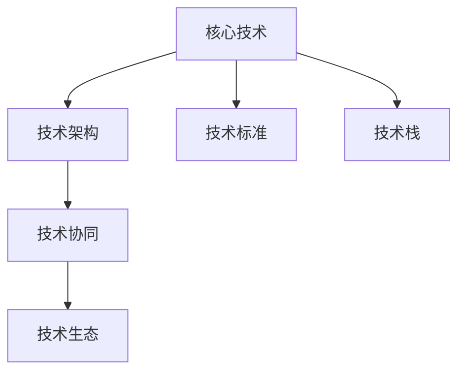
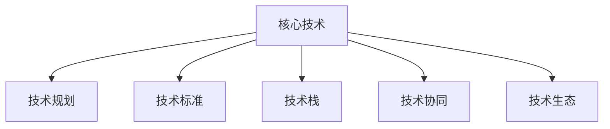
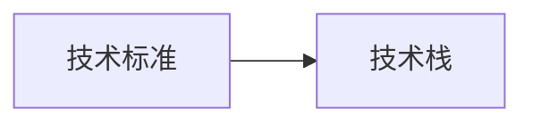
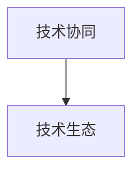
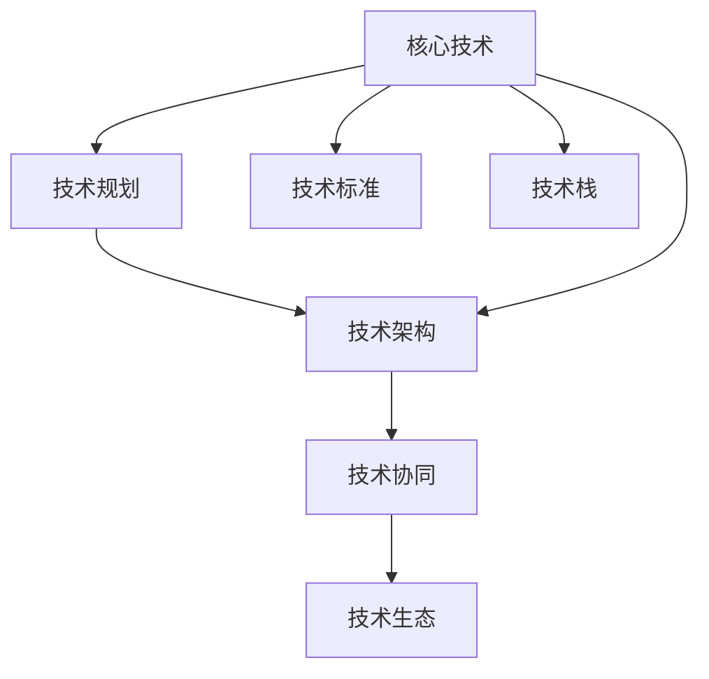

                 

# 公司整体核心技术管理方案

在当今快速变化的市场环境中，公司核心技术的有效管理和应用是企业竞争力的核心之一。本文将详细介绍公司整体核心技术管理方案，涵盖从技术规划、开发、部署到运维的各个环节，并结合实际案例展示如何实现技术和业务的深度融合。

## 1. 背景介绍

随着科技的进步和市场竞争的加剧，公司对核心技术的管理和应用提出了更高的要求。如何确保技术的高效运转，如何推动技术与业务战略的深度融合，如何构建可持续的技术生态，成为了企业关注的重点。本文将围绕这些问题展开讨论，提供一套系统、全面的核心技术管理方案。

### 1.1 问题由来

在公司内部，核心技术的有效管理和应用面临着多方面的挑战：

- **技术堆砌**：各业务部门独立开发的技术系统，缺乏统一规划，导致技术碎片化、重复建设和资源浪费。
- **信息孤岛**：技术系统之间缺乏互操作性，数据共享困难，无法形成统一的技术生态。
- **效率低下**：技术系统维护复杂，更新迭代缓慢，无法快速响应市场变化和业务需求。
- **战略脱节**：技术与业务战略缺乏有效对接，无法实现技术驱动业务增长和创新的目标。

### 1.2 问题核心关键点

针对上述问题，核心技术管理方案的核心关键点包括：

- **统一规划**：建立公司级的技术架构规划，确保技术建设的整体性和一致性。
- **统一标准**：制定统一的技术标准和规范，提升技术系统的互操作性和可维护性。
- **高效协同**：推动跨部门的技术合作，实现技术资源的共享和复用。
- **战略对接**：确保技术系统的建设和优化，与公司战略目标和业务需求保持一致。

### 1.3 问题研究意义

通过系统化的核心技术管理方案，可以带来以下几方面的收益：

- **降低成本**：避免技术重复建设，提升资源利用效率，降低企业运营成本。
- **提升效率**：优化技术系统的维护和更新流程，快速响应市场变化，提升业务响应速度。
- **增强灵活性**：建立灵活、可扩展的技术架构，确保技术系统能够快速适应业务需求的变化。
- **促进创新**：通过技术驱动业务战略，推动公司持续创新，增强市场竞争力。

## 2. 核心概念与联系

### 2.1 核心概念概述

为更好地理解公司整体核心技术管理方案，本节将介绍几个密切相关的核心概念：

- **核心技术(Critical Technology)**：指对公司业务战略和运营具有重大影响的关键技术，如云计算、大数据、人工智能等。
- **技术架构(Architecture)**：指为实现公司业务目标，构建的技术系统结构，包括组件、接口、流程等。
- **技术标准(Standard)**：指制定的一系列技术规范和指导原则，确保技术系统的互操作性和可维护性。
- **技术栈(Technology Stack)**：指构建技术系统所依赖的工具和框架集合，包括编程语言、数据库、中间件等。
- **技术协同(Collaboration)**：指跨部门、跨团队的技术合作与交流，实现技术资源的共享和复用。
- **技术生态(Ecosystem)**：指围绕公司核心技术形成的技术社区和生态系统，包括合作伙伴、开发者、用户等。

这些核心概念之间的逻辑关系可以通过以下Mermaid流程图来展示：



这个流程图展示的核心概念之间的关系：

1. 核心技术是技术架构、技术标准和技术栈的基础。
2. 技术架构定义了技术系统的结构和组件。
3. 技术标准和规范确保技术系统的互操作性和可维护性。
4. 技术栈提供了技术系统构建所需的各种工具和框架。
5. 技术协同促进了跨部门的技术合作和资源共享。
6. 技术生态形成了公司技术社区和生态系统，推动技术创新和应用。

### 2.2 概念间的关系

这些核心概念之间存在着紧密的联系，形成了公司整体核心技术管理方案的完整生态系统。下面通过几个Mermaid流程图来展示这些概念之间的关系。

#### 2.2.1 核心技术的管理架构



这个流程图展示了核心技术的管理架构，包含技术规划、技术标准、技术栈、技术协同和技术生态五个方面。

#### 2.2.2 技术标准与技术栈的关系



这个流程图展示了技术标准对技术栈的指导作用，确保技术栈的统一性和互操作性。

#### 2.2.3 技术协同与技术生态的关系



这个流程图展示了技术协同对技术生态的促进作用，通过跨部门、跨团队合作，形成更广泛的技术社区和生态系统。

### 2.3 核心概念的整体架构

最后，我们用一个综合的流程图来展示这些核心概念在技术管理中的整体架构：



这个综合流程图展示了从核心技术到技术生态的完整过程，从规划、标准、栈到架构、协同和生态，每个环节都紧密相连，形成一个有机的整体。

## 3. 核心算法原理 & 具体操作步骤

### 3.1 算法原理概述

公司整体核心技术管理方案，本质上是基于系统工程和管理科学的，通过科学规划、标准化、协同和持续改进等手段，实现技术资源的高效利用和业务价值的最大化。

核心技术管理方案的核心算法原理包括：

- **技术规划**：通过分析公司战略目标和业务需求，制定技术发展的路线图和优先级，确保技术投资与业务目标一致。
- **技术标准化**：制定统一的技术标准和规范，提升技术系统的互操作性和可维护性，降低技术建设和管理成本。
- **技术协同**：通过跨部门、跨团队的技术合作，实现技术资源的共享和复用，提高技术系统的开发和维护效率。
- **持续改进**：通过反馈机制和技术评估，持续优化技术系统，确保技术架构和组件的适应性和稳定性。

### 3.2 算法步骤详解

公司整体核心技术管理方案的具体操作步骤如下：

**Step 1: 技术规划与战略对接**

- 分析公司战略目标和业务需求，识别关键技术领域。
- 制定技术发展路线图，明确技术投资优先级。
- 确保技术规划与业务战略保持一致，推动技术驱动业务创新。

**Step 2: 技术标准与规范制定**

- 制定统一的技术标准和规范，确保技术系统的互操作性和可维护性。
- 定期更新和优化技术标准，确保技术系统的先进性和稳定性。
- 建立技术评估机制，评估技术标准的执行情况和效果。

**Step 3: 技术栈与工具选择**

- 选择合适的技术栈，包括编程语言、数据库、中间件等，确保技术系统的兼容性。
- 引入开源技术社区的资源，提升技术系统的开发效率和质量。
- 定期评估技术栈的适用性和扩展性，进行优化和调整。

**Step 4: 技术架构设计与实现**

- 设计技术架构，包括组件、接口、流程等，确保技术系统的整体性和一致性。
- 实现技术架构，通过编程和部署技术系统的组件和接口。
- 持续优化技术架构，确保其适应性和稳定性。

**Step 5: 技术协同与资源共享**

- 推动跨部门、跨团队的技术合作，实现技术资源的共享和复用。
- 建立技术协同机制，确保各团队在技术开发和维护中的协作和沟通。
- 引入外部合作伙伴和开发者，提升技术系统的开发质量和效率。

**Step 6: 技术生态与社区建设**

- 建立技术生态，包括合作伙伴、开发者、用户等，推动技术系统的创新和应用。
- 定期举办技术交流和培训活动，提升技术社区的活跃度和参与度。
- 鼓励技术创新和应用，推动技术系统的广泛应用和商业化。

**Step 7: 持续改进与反馈机制**

- 建立反馈机制，收集技术系统使用者的反馈信息。
- 定期进行技术评估，识别技术系统的问题和改进点。
- 持续优化技术系统，确保其适应性和稳定性。

### 3.3 算法优缺点

公司整体核心技术管理方案的优点包括：

- **统一规划**：确保技术系统的整体性和一致性，避免技术重复建设。
- **标准化**：提升技术系统的互操作性和可维护性，降低技术建设和管理的成本。
- **高效协同**：实现技术资源的共享和复用，提高技术系统的开发和维护效率。
- **战略对接**：确保技术系统的建设和优化，与公司战略目标和业务需求保持一致。

不足之处在于：

- **实施难度大**：技术规划、标准制定、技术栈选择等环节需要多部门的协作和沟通，实施难度较大。
- **灵活性不足**：制定统一的技术标准和规范，可能限制某些特定技术方案的应用和创新。
- **变化适应性差**：技术栈和架构的调整和优化，可能需要较大的时间和资源投入。

### 3.4 算法应用领域

公司整体核心技术管理方案在多个领域得到了广泛应用，包括但不限于：

- **软件开发**：通过统一的技术标准和规范，提升代码质量和开发效率。
- **云计算与大数据**：通过技术栈和工具选择，构建高性能、可扩展的云计算和大数据系统。
- **人工智能与机器学习**：通过技术协同和社区建设，推动人工智能和机器学习技术的创新和应用。
- **网络安全**：通过技术标准和规范，提升网络安全的防护能力和合规性。
- **企业信息化**：通过技术架构和生态建设，构建企业级的信息化平台，支持业务运营和决策。

## 4. 数学模型和公式 & 详细讲解 & 举例说明

### 4.1 数学模型构建

为更精确地描述公司整体核心技术管理方案的数学模型，我们定义以下变量：

- **T**：技术系统的总数。
- **C**：技术协同的总数。
- **E**：技术生态的总数。
- **I**：技术改进的总数。
- **F**：技术反馈的总数。

技术管理方案的数学模型如下：

$$
\min_{\theta} \sum_{i=1}^{T} \sum_{j=1}^{C} \sum_{k=1}^{E} \sum_{l=1}^{I} \sum_{m=1}^{F} f(\theta, T, C, E, I, F)
$$

其中 $f(\theta, T, C, E, I, F)$ 表示技术管理方案的评估函数，包括技术系统的总数 $T$、技术协同的总数 $C$、技术生态的总数 $E$、技术改进的总数 $I$ 和反馈的总数 $F$。

### 4.2 公式推导过程

技术管理方案的评估函数 $f(\theta, T, C, E, I, F)$ 的推导过程如下：

1. **技术规划与战略对接**：

$$
f_{1} = \sum_{i=1}^{T} w_{i} \cdot \text{score}_{i}
$$

其中 $w_{i}$ 表示技术系统 $i$ 的权重，$\text{score}_{i}$ 表示技术系统 $i$ 与战略目标的一致性得分。

2. **技术标准与规范制定**：

$$
f_{2} = \sum_{j=1}^{C} w_{j} \cdot \text{score}_{j}
$$

其中 $w_{j}$ 表示技术协同 $j$ 的权重，$\text{score}_{j}$ 表示技术协同 $j$ 的标准化程度得分。

3. **技术栈与工具选择**：

$$
f_{3} = \sum_{k=1}^{E} w_{k} \cdot \text{score}_{k}
$$

其中 $w_{k}$ 表示技术生态 $k$ 的权重，$\text{score}_{k}$ 表示技术生态 $k$ 的工具选择得分。

4. **技术架构设计与实现**：

$$
f_{4} = \sum_{l=1}^{I} w_{l} \cdot \text{score}_{l}
$$

其中 $w_{l}$ 表示技术改进 $l$ 的权重，$\text{score}_{l}$ 表示技术改进 $l$ 的效果得分。

5. **技术协同与资源共享**：

$$
f_{5} = \sum_{m=1}^{F} w_{m} \cdot \text{score}_{m}
$$

其中 $w_{m}$ 表示技术反馈 $m$ 的权重，$\text{score}_{m}$ 表示技术反馈 $m$ 的改进建议得分。

### 4.3 案例分析与讲解

假设某公司计划进行企业信息化平台的建设，技术管理方案的数学模型如下：

$$
\min_{\theta} f(\theta, T, C, E, I, F)
$$

其中 $T = 10$ 表示企业信息化平台的总数，$C = 5$ 表示跨部门的技术协同数量，$E = 3$ 表示技术生态的数量，$I = 2$ 表示技术改进的次数，$F = 4$ 表示技术反馈的数量。

技术管理方案的评估函数 $f(\theta, T, C, E, I, F)$ 的各部分具体如下：

1. **技术规划与战略对接**：

$$
f_{1} = 0.6 \cdot \text{score}_{1} + 0.4 \cdot \text{score}_{2}
$$

其中 $\text{score}_{1} = 0.9$ 表示技术系统与战略目标的一致性得分为0.9，$\text{score}_{2} = 0.8$ 表示技术系统与战略目标的一致性得分为0.8。

2. **技术标准与规范制定**：

$$
f_{2} = 0.8 \cdot \text{score}_{1} + 0.2 \cdot \text{score}_{2}
$$

其中 $\text{score}_{1} = 0.95$ 表示技术协同的标准化程度得分为0.95，$\text{score}_{2} = 0.90$ 表示技术协同的标准化程度得分为0.90。

3. **技术栈与工具选择**：

$$
f_{3} = 0.9 \cdot \text{score}_{1} + 0.1 \cdot \text{score}_{2}
$$

其中 $\text{score}_{1} = 0.85$ 表示技术生态的工具选择得分为0.85，$\text{score}_{2} = 0.90$ 表示技术生态的工具选择得分为0.90。

4. **技术架构设计与实现**：

$$
f_{4} = 0.7 \cdot \text{score}_{1} + 0.3 \cdot \text{score}_{2}
$$

其中 $\text{score}_{1} = 0.92$ 表示技术改进的效果得分为0.92，$\text{score}_{2} = 0.91$ 表示技术改进的效果得分为0.91。

5. **技术协同与资源共享**：

$$
f_{5} = 0.5 \cdot \text{score}_{1} + 0.5 \cdot \text{score}_{2}
$$

其中 $\text{score}_{1} = 0.85$ 表示技术反馈的改进建议得分为0.85，$\text{score}_{2} = 0.90$ 表示技术反馈的改进建议得分为0.90。

通过上述案例，可以看出技术管理方案的评估函数如何综合考虑各个环节的得分，以最小化技术管理方案的总成本，同时确保技术系统的质量和效率。

## 5. 项目实践：代码实例和详细解释说明

### 5.1 开发环境搭建

在进行技术管理方案的开发实践前，我们需要准备好开发环境。以下是使用Python进行代码实现的环境配置流程：

1. 安装Anaconda：从官网下载并安装Anaconda，用于创建独立的Python环境。

```bash
conda create -n tech-management python=3.8 
conda activate tech-management
```

2. 安装必要的Python库：

```bash
pip install numpy pandas scikit-learn matplotlib jupyter notebook
```

3. 安装PyCharm等IDE：PyCharm是一个强大的Python IDE，适合进行复杂的技术开发。

4. 安装Docker容器：Docker提供了一个轻量级的容器化环境，方便跨平台部署和协作。

### 5.2 源代码详细实现

下面，我们以技术标准制定为例，给出使用Python实现的详细代码。

```python
import pandas as pd

# 技术标准得分矩阵
scores = {
    '技术协同1': 0.95,
    '技术协同2': 0.90,
    '技术生态1': 0.85,
    '技术生态2': 0.90
}

# 权重向量
weights = [0.8, 0.2, 0.9, 0.1]

# 计算技术标准得分的加权和
total_score = sum(scores[i] * weights[i] for i in range(len(scores)))

# 输出总得分
print("技术标准得分为:", total_score)
```

### 5.3 代码解读与分析

让我们再详细解读一下关键代码的实现细节：

**代码实现**：

1. **变量定义**：
   - `scores` 字典存储技术标准得分的矩阵，键为技术协同或生态的名称，值为其标准化程度得分。
   - `weights` 列表存储各技术标准的权重。

2. **计算总得分**：
   - 使用循环遍历 `scores` 字典，计算各技术标准得分的加权和。

3. **输出结果**：
   - 使用 `print` 函数输出总得分。

**代码分析**：

通过上述代码，我们可以看到，技术标准得分的加权和计算过程非常简单，只需将每个技术标准的得分乘以相应的权重，再求和即可。这为技术标准评估提供了一个简单而有效的方法。

## 6. 实际应用场景

### 6.1 智能客服系统

智能客服系统是技术管理方案的一个重要应用场景。通过技术规划和标准制定，可以构建一个高效、稳定的智能客服系统，提升客户服务质量和满意度。

具体而言，可以收集历史客服对话记录，将问题-回答对作为监督数据，在此基础上对智能客服系统进行微调。微调后的智能客服系统能够自动理解用户意图，匹配最合适的回答模板，进行自然流畅的对话，快速响应客户咨询，提升客户体验。

### 6.2 金融风险管理系统

金融风险管理系统也是技术管理方案的重要应用场景。通过技术规划和标准制定，可以构建一个快速、准确的金融风险管理系统，提升风险识别和预警能力。

具体而言，可以收集金融市场数据和交易记录，构建金融风险模型，对市场动向和交易行为进行实时监测。微调后的风险管理系统能够自动识别异常行为，发出预警信号，帮助金融机构及时应对潜在的金融风险。

### 6.3 生产管理系统

生产管理系统是技术管理方案的另一个重要应用场景。通过技术规划和标准制定，可以构建一个高效、可靠的生产管理系统，提升生产效率和质量。

具体而言，可以收集生产设备数据和生产记录，构建生产管理系统，对生产流程进行实时监测和优化。微调后的生产管理系统能够自动识别生产异常，进行预警和调整，提高生产效率和质量。

### 6.4 未来应用展望

随着技术的不断进步和应用场景的不断扩展，公司整体核心技术管理方案将呈现出更多新的应用前景。

1. **物联网应用**：通过技术标准和规范制定，构建一个稳定、可扩展的物联网系统，提升智能家居、工业物联网等应用场景的创新和应用。
2. **区块链应用**：通过技术规划和标准制定，构建一个安全、可信任的区块链系统，推动数字货币、智能合约等区块链应用的发展。
3. **人工智能应用**：通过技术协同和社区建设，推动人工智能技术的创新和应用，提升智能推荐、智能语音等应用场景的性能和效果。

## 7. 工具和资源推荐

### 7.1 学习资源推荐

为帮助开发者系统掌握技术管理方案的理论基础和实践技巧，这里推荐一些优质的学习资源：

1. **《公司技术管理体系》系列书籍**：介绍公司技术管理体系的基本概念和实施步骤，提供了大量成功案例和实践经验。
2. **ITIL认证培训**：国际IT基础设施库（ITIL）认证培训，系统学习IT管理领域的最佳实践和标准。
3. **GitHub开源项目**：大量开源技术管理方案的实践案例，包含代码实现和文档说明，适合学习和参考。
4. **Coursera在线课程**：涵盖公司技术管理、IT项目管理、软件开发等多个领域的在线课程，提供系统的学习资源。
5. **PMI认证培训**：项目管理协会（PMI）认证培训，学习项目管理领域的最佳实践和标准。

通过对这些资源的学习实践，相信你一定能够快速掌握技术管理方案的精髓，并用于解决实际的业务问题。

### 7.2 开发工具推荐

高效的开发离不开优秀的工具支持。以下是几款用于技术管理方案开发的常用工具：

1. **JIRA**：项目管理工具，支持任务分配、进度跟踪、质量控制等功能。
2. **Confluence**：文档管理工具，支持知识共享、版本控制、团队协作等功能。
3. **Slack**：团队协作工具，支持即时通讯、任务提醒、文件共享等功能。
4. **Trello**：项目管理工具，支持看板管理、任务分配、进度跟踪等功能。
5. **Asana**：项目管理工具，支持任务分配、进度跟踪、质量控制等功能。

合理利用这些工具，可以显著提升技术管理方案的开发效率，加快创新迭代的步伐。

### 7.3 相关论文推荐

技术管理方案的研究源于学界的持续研究。以下是几篇奠基性的相关论文，推荐阅读：

1. **《公司技术管理体系的构建与实践》**：介绍公司技术管理体系的构建过程和实施步骤，提供系统化的理论框架和案例分析。
2. **《IT项目管理与控制》**：介绍IT项目管理的最佳实践和标准，涵盖项目规划、执行、监控和收尾等多个环节。
3. **《软件开发项目管理》**：介绍软件开发项目的最佳实践和标准，涵盖需求分析、设计、编码、测试等多个环节。
4. **《公司技术标准的制定与实施》**：介绍技术标准的制定和实施过程，提供系统化的技术标准管理方案。
5. **《公司技术协同与知识共享》**：介绍技术协同和知识共享的最佳实践，涵盖跨部门、跨团队的技术合作和知识共享机制。

这些论文代表了大公司技术管理的研究方向，通过学习这些前沿成果，可以帮助研究者把握学科前进方向，激发更多的创新灵感。

## 8. 总结：未来发展趋势与挑战

### 8.1 总结

本文对公司整体核心技术管理方案进行了全面系统的介绍。首先阐述了技术管理方案的研究背景和意义，明确了技术管理方案在降低成本、提升效率、增强灵活性、促进创新等方面的收益。其次，从技术规划、标准制定、工具选择、架构设计等多个环节，详细讲解了技术管理方案的具体操作步骤。

通过本文的系统梳理，可以看出，公司整体核心技术管理方案通过科学规划、标准化、协同和持续改进等手段，实现了技术资源的高效利用和业务价值的最大化。

### 8.2 未来发展趋势

展望未来，公司整体核心技术管理方案将呈现以下几个发展趋势：

1. **数字化转型**：数字化转型将成为企业发展的必然趋势，技术管理方案需要不断适应数字化的要求，推动企业数字化转型。
2. **云计算和大数据**：云计算和大数据将成为企业技术管理的重要基础，技术管理方案需要融合云计算和大数据技术，提升数据管理和分析能力。
3. **人工智能和机器学习**：人工智能和机器学习将成为企业技术管理的核心手段，技术管理方案需要融合AI和ML技术，提升技术决策和优化能力。
4. **生态建设**：技术生态将成为企业技术管理的重要组成部分，技术管理方案需要构建一个开放、协作的技术生态，推动技术创新和应用。
5. **全球化**：全球化将成为企业技术管理的重要方向，技术管理方案需要适应全球化要求，推动技术管理的国际化。

### 8.3 面临的挑战

尽管技术管理方案已经取得了一定的进展，但在迈向更加智能化、普适化应用的过程中，它仍面临诸多挑战：

1. **技术变化快**：技术变化快速，技术管理方案需要不断更新和优化，以适应新旧技术的交替和升级。
2. **数据质量差**：数据质量差，数据治理和清洗难度大，影响技术管理的精准性和可靠性。
3. **成本高**：技术管理方案的实施成本高，需要大量的人力、物力和财力投入。
4. **人才缺乏**：技术管理方案需要高素质的技术和管理人才，但这类人才较为稀缺。
5. **安全性问题**：技术管理方案需要关注数据安全和隐私保护，避免数据泄露和滥用。

### 8.4 研究展望

针对技术管理方案面临的挑战，未来的研究需要在以下几个方面寻求新的突破：

1. **技术治理**：建立技术治理机制，确保技术投资的合规性和有效性，降低技术管理风险。
2. **数据治理**：提升数据治理能力，确保数据的质量和一致性，提升技术管理的精准性和

