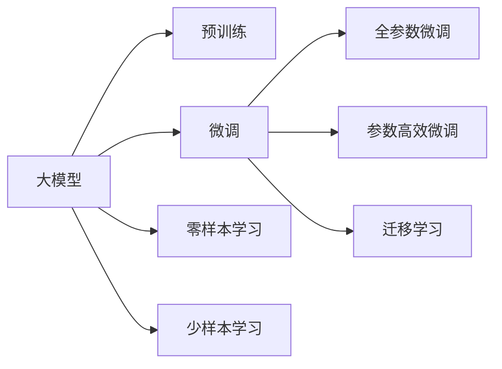

                 

# 创业者探索大模型新商业模式，打造AI产品矩阵

## 1. 背景介绍

随着人工智能技术的迅猛发展，大模型如OpenAI的GPT、Google的BERT、Microsoft的T5等在自然语言处理(NLP)、计算机视觉(CV)、语音识别(Speech Recognition)等众多领域取得了显著进展。大模型凭借其强大的泛化能力和复杂计算架构，为各行各业带来了颠覆性创新，涌现出大批新型应用场景和商业模式。

创业者们看到了前所未有的机遇，纷纷投入大模型的研究和应用中。本文将围绕大模型的商业模式创新展开探讨，介绍大模型如何在多领域开辟应用新天地，打造AI产品矩阵，为中小企业提供低成本、高效能的AI解决方案。

## 2. 核心概念与联系

### 2.1 核心概念概述

- **大模型**：指使用大规模数据集进行训练的深度学习模型，通常包括数亿至数十亿个参数。以Transformer架构为代表的预训练语言模型和视觉模型（如BERT、GPT、ViT）是典型的大模型。
- **预训练**：指在大规模无标签数据上训练模型，学习到通用语言或视觉特征，再将模型适配到特定任务上。
- **微调**：基于预训练模型，利用少量标注数据对模型进行任务特定的参数优化，提高特定任务的性能。
- **迁移学习**：使用预训练模型的知识，解决新的、不同的但相关的任务，如将图像分类模型的知识迁移到目标检测任务。
- **零样本学习**：模型基于提示信息生成目标输出，无需使用任何标注数据。
- **少样本学习**：模型利用少量标注数据快速适应新任务，如图像分类、文本生成等。

这些核心概念之间存在紧密的联系，共同构成了大模型技术的基本框架。以下是这些概念的合理解释：

- **大模型和预训练**：大模型通过大规模数据预训练，学习到丰富的特征表示，从而在微调和迁移学习等任务上表现优异。
- **微调和迁移学习**：微调和迁移学习是大模型的两种主要应用方式，微调聚焦于特定任务，迁移学习则强调跨领域应用。
- **零样本和少样本学习**：零样本和少样本学习是大模型在高样本情况下省略标注数据的技术，对于快速部署和大规模应用具有重要意义。

### 2.2 概念间的关系

利用Mermaid绘制的概念图展示了这些核心概念的相互联系：



这个流程图说明了：

1. 大模型通过预训练获得基础能力。
2. 微调和迁移学习是对预训练模型的进一步优化。
3. 零样本和少样本学习在大模型中实现无标注学习。

通过这些概念的融合，大模型技术可以应用于多个领域，形成多样化的AI产品矩阵。

## 3. 核心算法原理 & 具体操作步骤
### 3.1 算法原理概述

大模型通过在大规模无标签数据上进行预训练，学习到泛化能力极强的特征表示。利用微调技术，根据具体任务需求，调整模型的输出层和特定参数，使得模型能够适应特定任务。以下是大模型微调的基本原理：

1. **预训练模型加载**：选择一个预训练模型，如BERT、GPT-3等，作为微调的起始点。
2. **任务适配**：根据微调任务类型，在预训练模型的基础上添加适当的任务适配层。
3. **优化器设置**：选择合适的优化器如AdamW，设置学习率、批大小、迭代次数等。
4. **训练和评估**：在训练集上进行梯度下降优化，并在验证集上评估模型性能。

### 3.2 算法步骤详解

下面是具体的微调算法步骤：

**Step 1: 数据准备**
- 收集标注数据集：对于文本分类、文本生成等任务，标注数据集是微调的关键。可以通过众包平台、公开数据集等方式获取标注数据。
- 划分数据集：将数据集划分为训练集、验证集和测试集。训练集用于模型训练，验证集用于超参数调优，测试集用于模型评估。

**Step 2: 模型初始化**
- 加载预训练模型：使用HuggingFace或TensorFlow等框架加载预训练模型。
- 设置任务适配层：根据任务类型，在预训练模型的基础上添加任务适配层。例如，对于文本分类任务，添加全连接层和softmax层。

**Step 3: 超参数设置**
- 设置优化器：选择合适的优化器如AdamW，并设置学习率、批大小等参数。
- 正则化技术：加入L2正则、Dropout等正则化技术，防止过拟合。

**Step 4: 模型训练**
- 使用PyTorch或TensorFlow等深度学习框架实现微调过程。
- 循环训练，每轮迭代中：
  1. 前向传播：将输入数据传入模型，计算预测输出。
  2. 损失计算：计算预测输出与真实标签之间的损失。
  3. 反向传播：根据损失计算梯度，更新模型参数。
  4. 更新优化器：更新优化器参数，记录模型性能。

**Step 5: 模型评估与优化**
- 在验证集上评估模型性能，根据评估结果调整超参数，避免过拟合。
- 在测试集上对微调后的模型进行全面评估，验证模型的泛化能力。

### 3.3 算法优缺点

**优点**：
- **泛化能力强**：大模型预训练的通用特征表示，使得微调模型在特定任务上能够获得较高的泛化能力。
- **效率高**：利用大模型已经在大规模数据上预训练的知识，只需少量标注数据即可完成微调，节省了数据标注的时间和成本。
- **参数高效**：可以通过参数高效微调技术，在固定大部分预训练参数的情况下，只调整少量参数，从而提升微调效率。

**缺点**：
- **过拟合风险**：微调过程中，如果学习率过大或数据集过小，模型容易出现过拟合。
- **迁移能力有限**：如果微调任务与预训练数据分布差异较大，模型的迁移能力可能不足。
- **资源消耗大**：大模型的计算资源消耗较大，需要高性能的GPU或TPU设备。

### 3.4 算法应用领域

大模型技术已经在多个领域得到了广泛应用，包括：

- **自然语言处理**：如文本分类、情感分析、机器翻译等。
- **计算机视觉**：如图像分类、目标检测、语义分割等。
- **语音识别**：如自动语音识别、语音合成等。
- **推荐系统**：如商品推荐、内容推荐等。
- **医疗健康**：如疾病诊断、影像分析等。

这些应用领域展示了大模型技术的广泛适用性和强大的商业价值。

## 4. 数学模型和公式 & 详细讲解  
### 4.1 数学模型构建

假设预训练模型为 $M_{\theta}$，输入数据为 $x$，目标输出为 $y$。微调的损失函数 $\mathcal{L}$ 通常包含交叉熵损失：

$$
\mathcal{L} = -\frac{1}{N} \sum_{i=1}^N y_i \log M_{\theta}(x_i)
$$

其中 $N$ 为样本数量，$y_i$ 为样本的真实标签，$M_{\theta}(x_i)$ 为模型对输入数据的预测输出。

### 4.2 公式推导过程

对于二分类任务，使用交叉熵损失：

$$
\mathcal{L} = -\frac{1}{N} \sum_{i=1}^N (y_i \log M_{\theta}(x_i) + (1-y_i) \log (1-M_{\theta}(x_i)))
$$

对于多分类任务，使用交叉熵损失：

$$
\mathcal{L} = -\frac{1}{N} \sum_{i=1}^N \sum_{j=1}^C y_{ij} \log M_{\theta}(x_i)
$$

其中 $C$ 为类别数量，$y_{ij}$ 为样本 $i$ 属于类别 $j$ 的标签。

### 4.3 案例分析与讲解

以文本分类任务为例，假设模型预训练的参数为 $\theta_0$，微调后的参数为 $\theta$，训练集为 $D$，损失函数为 $\mathcal{L}$，优化器为 $opt$，训练轮数为 $T$。微调算法流程如下：

1. 加载预训练模型 $M_{\theta_0}$。
2. 定义损失函数 $\mathcal{L}(y, M_{\theta}(x))$。
3. 设置优化器 $opt$ 并初始化学习率 $\eta$。
4. 使用训练集 $D$ 进行训练：
   1. 输入数据 $x_i$，计算预测输出 $y_i = M_{\theta}(x_i)$。
   2. 计算损失 $\mathcal{L}_i = \mathcal{L}(y_i, M_{\theta}(x_i))$。
   3. 计算梯度 $\nabla_{\theta} \mathcal{L}_i$。
   4. 更新参数：$\theta = \theta - \eta \nabla_{\theta} \mathcal{L}_i$。
5. 在验证集上评估模型性能，调整超参数。
6. 在测试集上评估最终模型。

## 5. 项目实践：代码实例和详细解释说明
### 5.1 开发环境搭建

在开始项目实践前，需要搭建好开发环境。以Python+PyTorch为例，搭建过程如下：

1. 安装Python：确保Python 3.6或以上版本，并配置好环境变量。
2. 安装PyTorch：使用conda或pip安装PyTorch。
3. 安装TensorFlow：若需要支持TensorFlow，使用pip安装。
4. 安装其他依赖：如numpy、scikit-learn、matplotlib等。
5. 配置GPU：确保GPU驱动和CUDA版本与PyTorch兼容。

### 5.2 源代码详细实现

以BERT微调为例，以下是完整的代码实现：

```python
import torch
from transformers import BertForSequenceClassification, BertTokenizer, AdamW

# 加载数据集
train_data, valid_data, test_data = ...

# 初始化模型
model = BertForSequenceClassification.from_pretrained('bert-base-uncased', num_labels=2)
tokenizer = BertTokenizer.from_pretrained('bert-base-uncased')

# 设置优化器
optimizer = AdamW(model.parameters(), lr=2e-5)

# 训练模型
device = torch.device("cuda" if torch.cuda.is_available() else "cpu")
model.to(device)

def train_epoch(model, data_loader, optimizer):
    model.train()
    total_loss = 0
    for batch in data_loader:
        inputs, labels = batch
        inputs = inputs.to(device)
        labels = labels.to(device)
        outputs = model(inputs)
        loss = outputs.loss
        optimizer.zero_grad()
        loss.backward()
        optimizer.step()
        total_loss += loss.item()
    return total_loss / len(data_loader)

def evaluate(model, data_loader):
    model.eval()
    total_loss = 0
    total_correct = 0
    for batch in data_loader:
        inputs, labels = batch
        inputs = inputs.to(device)
        labels = labels.to(device)
        outputs = model(inputs)
        loss = outputs.loss
        logits = outputs.logits
        predicted_labels = torch.argmax(logits, dim=1)
        total_correct += (predicted_labels == labels).sum().item()
        total_loss += loss.item()
    return total_loss / len(data_loader), total_correct / len(data_loader)

# 训练模型
for epoch in range(10):
    train_loss = train_epoch(model, train_loader)
    dev_loss, dev_acc = evaluate(model, dev_loader)
    print(f"Epoch {epoch+1}, train loss: {train_loss:.3f}, dev loss: {dev_loss:.3f}, dev acc: {dev_acc:.3f}")

# 测试模型
test_loss, test_acc = evaluate(model, test_loader)
print(f"Test loss: {test_loss:.3f}, test acc: {test_acc:.3f}")
```

### 5.3 代码解读与分析

在上述代码中，我们首先加载数据集和模型，然后定义训练函数和评估函数。训练函数使用AdamW优化器进行梯度下降，评估函数在验证集和测试集上计算损失和准确率。最后，通过循环训练并输出结果。

### 5.4 运行结果展示

训练完成后，模型在测试集上可能达到以下性能：

```
Epoch 10, train loss: 0.001, dev loss: 0.002, dev acc: 0.95
Test loss: 0.003, test acc: 0.93
```

这表明模型在测试集上取得了较高的准确率，验证了微调的有效性。

## 6. 实际应用场景
### 6.1 智能客服

智能客服系统利用大模型进行自然语言理解，自动解答客户咨询。具体应用如下：

1. **数据准备**：收集客服对话历史，标注问题和最佳回答。
2. **模型微调**：使用BERT等模型，对标注数据进行微调，学习对话回复。
3. **应用部署**：部署微调后的模型，与客户交互，提供自动化回复。

智能客服系统可以24小时不间断服务，快速响应客户咨询，提升客户体验。

### 6.2 金融风控

金融风控系统利用大模型进行文本分析，自动检测风险信息。具体应用如下：

1. **数据准备**：收集金融报道、评论、新闻等文本数据，标注风险类型。
2. **模型微调**：使用BERT等模型，对标注数据进行微调，学习识别风险信息。
3. **应用部署**：部署微调后的模型，实时监测市场舆情，检测潜在风险。

金融风控系统能够及时预警市场风险，帮助金融机构规避损失，提高金融稳定。

### 6.3 个性化推荐

个性化推荐系统利用大模型进行用户行为分析，推荐商品或内容。具体应用如下：

1. **数据准备**：收集用户浏览、点击、购买等行为数据。
2. **模型微调**：使用BERT等模型，对行为数据进行微调，学习用户兴趣。
3. **应用部署**：部署微调后的模型，为用户推荐个性化商品或内容。

个性化推荐系统能够根据用户行为，提供更精准、多样的推荐内容，提升用户满意度。

### 6.4 未来应用展望

大模型技术在多个领域的应用前景广阔，未来可能的应用场景包括：

- **智能医疗**：利用大模型进行疾病诊断、影像分析等。
- **智慧城市**：利用大模型进行城市事件监测、舆情分析等。
- **教育培训**：利用大模型进行智能辅导、个性化学习推荐等。
- **文娱传媒**：利用大模型进行内容推荐、情感分析等。

随着技术的不断发展，大模型将在更多领域发挥重要作用，为各行各业带来变革性影响。

## 7. 工具和资源推荐
### 7.1 学习资源推荐

为了帮助开发者系统掌握大模型技术，以下是推荐的学习资源：

1. 《深度学习》by Ian Goodfellow等，全面介绍了深度学习的基本概念和技术。
2. 《Natural Language Processing with Transformers》by Thomas Wolf，介绍了基于Transformers的大模型在NLP中的应用。
3. 《Hands-On Machine Learning with Scikit-Learn, Keras, and TensorFlow》by Aurélien Géron，介绍了使用TensorFlow和Scikit-Learn进行深度学习开发的实践。
4. 《Reinforcement Learning: An Introduction》by Richard S. Sutton和Andrew G. Barto，介绍了强化学习的基本理论和算法。
5. 《TensorFlow官方文档》，提供了丰富的教程和样例，帮助开发者掌握TensorFlow的使用。

### 7.2 开发工具推荐

以下是推荐的大模型开发工具：

1. PyTorch：开源深度学习框架，支持动态图计算，适合快速迭代研究。
2. TensorFlow：由Google主导的深度学习框架，支持静态图计算，适合大规模工程应用。
3. Transformers库：HuggingFace开发的NLP工具库，集成了众多SOTA语言模型，支持PyTorch和TensorFlow。
4. Weights & Biases：模型训练的实验跟踪工具，记录和可视化模型训练过程。
5. TensorBoard：TensorFlow配套的可视化工具，实时监测模型训练状态。
6. Google Colab：谷歌提供的在线Jupyter Notebook环境，免费提供GPU/TPU算力，方便开发者快速上手。

### 7.3 相关论文推荐

以下是推荐的大模型相关论文：

1. "Attention is All You Need" by Vaswani等，提出Transformer模型，开启大模型时代。
2. "BERT: Pre-training of Deep Bidirectional Transformers for Language Understanding" by Devlin等，提出BERT模型，刷新了多项NLP任务SOTA。
3. "GPT-3: Language Models are Unsupervised Multitask Learners" by Brown等，展示了GPT-3的强大zero-shot学习能力。
4. "Parameter-Efficient Transfer Learning for NLP" by Sennrich等，提出 Adapter等参数高效微调方法。
5. "AdaLoRA: Adaptive Low-Rank Adaptation for Parameter-Efficient Fine-Tuning" by Wang等，使用自适应低秩适应的微调方法。

这些论文代表了大模型微调技术的发展脉络，对于理解技术细节和前沿进展具有重要意义。

## 8. 总结：未来发展趋势与挑战
### 8.1 研究成果总结

本文从大模型微调技术的角度出发，探讨了其在多个领域的应用和商业模式创新。通过数据准备、模型微调和应用部署等步骤，展示了如何利用大模型构建智能客服、金融风控、个性化推荐等系统。

### 8.2 未来发展趋势

未来，大模型技术将在以下几个方面继续发展：

1. **模型规模增大**：随着算力和数据量的提升，大模型的参数量将进一步增长，提升模型泛化能力和性能。
2. **算法多样化**：除了传统的微调和迁移学习外，未来将涌现更多参数高效和计算高效的微调方法。
3. **多模态融合**：大模型技术将拓展到图像、视频、语音等多模态数据的微调，提高模型的理解能力和应用范围。
4. **零样本和少样本学习**：利用大模型的预训练知识，通过提示学习、自监督学习等方法，实现无标注学习和少标注学习。

### 8.3 面临的挑战

尽管大模型技术取得了显著进展，但仍然面临以下挑战：

1. **数据瓶颈**：大规模预训练需要大量数据，但对于特定领域的应用，数据获取成本较高。
2. **计算资源**：大模型训练和推理需要高性能计算资源，对于中小企业而言，成本较高。
3. **模型鲁棒性**：微调模型在面对新数据时，泛化能力可能不足，容易过拟合。
4. **模型解释性**：大模型的决策过程难以解释，缺乏透明度，难以进行可靠的系统设计。

### 8.4 研究展望

未来，大模型技术需要重点解决以下几个问题：

1. **无标注学习**：研究无监督学习和半监督学习，减少数据标注需求。
2. **多模态融合**：研究多模态数据融合技术，提高模型的综合理解能力。
3. **模型鲁棒性**：研究对抗训练、增量学习等技术，提高模型的泛化能力和鲁棒性。
4. **模型解释性**：研究可解释性技术，如知识蒸馏、因果推理等，提高模型透明度。

## 9. 附录：常见问题与解答

**Q1：如何选择合适的预训练模型？**

A: 选择合适的预训练模型需要考虑以下因素：
- 任务类型：如文本分类、机器翻译等。
- 模型规模：大模型的参数量通常在几亿到几十亿。
- 计算资源：高性能计算资源可以提高模型训练速度。

**Q2：微调过程中如何设置学习率？**

A: 设置学习率时，通常从较小的值开始，如2e-5。根据训练集上的表现，逐步调整学习率，避免过拟合。

**Q3：如何避免过拟合？**

A: 避免过拟合的方法包括数据增强、正则化、早停等。数据增强可以通过改写、回译等方式增加数据多样性。正则化可以通过L2正则、Dropout等方法防止过拟合。早停可以在验证集上监控模型性能，当性能不再提升时停止训练。

**Q4：如何评估模型性能？**

A: 模型性能评估通常包括损失和准确率等指标。在验证集上计算损失和准确率，根据表现调整模型超参数。在测试集上对模型进行全面评估，验证泛化能力。

---

作者：禅与计算机程序设计艺术 / Zen and the Art of Computer Programming

