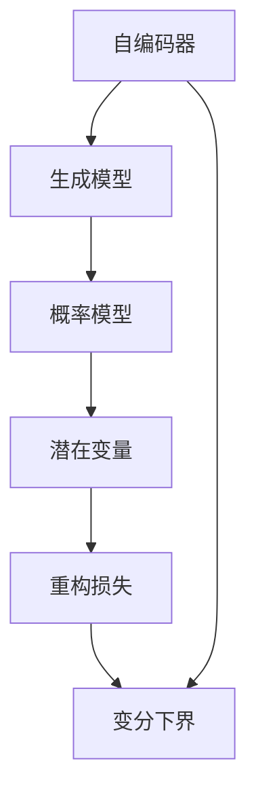
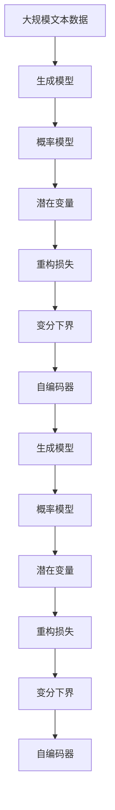

                 

# 变分自编码器 (Variational Autoencoders, VAE) 原理与代码实例讲解

> 关键词：变分自编码器, 自编码器, 生成模型, 概率模型, 潜在变量, 损失函数, 优化算法, 图像生成, 数据压缩

## 1. 背景介绍

### 1.1 问题由来
自编码器(Autonomous Encoder)是一种非监督学习方法，其目标是通过一个映射函数，将输入数据压缩成一个低维向量表示，然后再通过另一个解码器函数，将这个向量映射回原始的输入数据。自编码器在图像处理、语音识别、自然语言处理等领域得到了广泛的应用，如图片去噪、数据降维、语音特征提取等。然而，传统的自编码器往往忽略数据分布的潜在结构，无法很好地保留数据的统计特征。

为了解决这一问题，变分自编码器(Variational Autoencoder, VAE)应运而生。VAE通过引入潜在变量的概念，学习输入数据的概率分布，使得重构损失不再是简单的MSE，而是考虑了数据分布的结构性，从而大大提升了自编码器的性能。

### 1.2 问题核心关键点
VAE通过最大化潜在变量分布的重构似然和潜在变量分布的变分下界，实现对输入数据的概率建模和压缩。VAE的核心思想在于通过构建潜在变量分布，使得模型能够捕捉数据的潜在结构，从而提升重构性能和生成能力。

VAE的核心组成部分包括：
- **编码器(Encoder)**：将输入数据映射到潜在变量空间。
- **解码器(Decoder)**：将潜在变量空间中的数据映射回原始输入空间。
- **潜在变量分布(Potential Distribution)**：通过定义一个先验分布，来约束编码器的输出分布。
- **重构损失(Reconstruction Loss)**：用于衡量模型输出的重构精度。
- **变分下界(Variational Lower Bound)**：通过最大化变分下界，使得模型能够更好地拟合输入数据的概率分布。

VAE在图像生成、数据降维、异常检测、信息检索等众多领域得到了广泛应用，成为深度学习领域的重要工具。

### 1.3 问题研究意义
VAE的提出为深度学习中的生成模型和概率模型带来了革命性的突破，其核心思想在于通过构建潜在变量分布，实现了对输入数据的更准确概率建模。VAE在图像生成、数据压缩、异常检测等众多领域得到了广泛应用，提升了深度学习技术的实用性和可解释性。通过深入研究VAE的原理和应用，有助于开发者更好地掌握深度学习技术的核心思想和关键方法，推动人工智能技术的不断进步。

## 2. 核心概念与联系

### 2.1 核心概念概述

为更好地理解VAE的原理和应用，本节将介绍几个密切相关的核心概念：

- **自编码器(Autonomous Encoder)**：一种通过将输入数据压缩成一个低维向量表示，再通过解码器映射回原始输入空间的非监督学习方法。
- **生成模型(Generative Model)**：通过学习输入数据的概率分布，能够生成新样本的模型。
- **概率模型(Probabilistic Model)**：能够表示输入数据分布的统计特性和不确定性，常用的有高斯分布、伯努利分布等。
- **潜在变量(Latent Variable)**：表示输入数据背后的一组不可观测的随机变量，通过学习潜在变量的分布，可以更好地建模输入数据。
- **重构损失(Reconstruction Loss)**：用于衡量模型输出的重构精度，通常采用均方误差(MSE)、交叉熵等损失函数。
- **变分下界(Variational Lower Bound)**：通过最大化变分下界，使得模型能够更好地拟合输入数据的概率分布，提升模型的生成和重构能力。

这些概念之间的逻辑关系可以通过以下Mermaid流程图来展示：



这个流程图展示了VAE的核心组成部分及其之间的关系：

1. 自编码器通过将输入数据压缩成一个低维向量表示，再通过解码器映射回原始输入空间，实现数据压缩和重构。
2. 生成模型通过学习输入数据的概率分布，能够生成新样本。
3. 概率模型用于表示输入数据分布的统计特性和不确定性，常用的有高斯分布、伯努利分布等。
4. 潜在变量表示输入数据背后的一组不可观测的随机变量，通过学习潜在变量的分布，可以更好地建模输入数据。
5. 重构损失用于衡量模型输出的重构精度，通常采用均方误差(MSE)、交叉熵等损失函数。
6. 变分下界通过最大化变分下界，使得模型能够更好地拟合输入数据的概率分布，提升模型的生成和重构能力。

这些概念共同构成了VAE的学习框架，使得VAE能够更好地建模输入数据的概率分布，提升重构和生成性能。

### 2.2 概念间的关系

这些核心概念之间存在着紧密的联系，形成了VAE的学习生态系统。下面我们通过几个Mermaid流程图来展示这些概念之间的关系。

#### 2.2.1 生成模型与自编码器


这个流程图展示了生成模型和自编码器之间的关系。生成模型通过学习输入数据的概率分布，能够生成新样本，而自编码器则通过将输入数据压缩成一个低维向量表示，再通过解码器映射回原始输入空间，实现数据压缩和重构。两者共同构成了VAE的学习框架。

#### 2.2.2 概率模型与潜在变量


这个流程图展示了概率模型和潜在变量之间的关系。概率模型用于表示输入数据分布的统计特性和不确定性，常用的有高斯分布、伯努利分布等。潜在变量表示输入数据背后的一组不可观测的随机变量，通过学习潜在变量的分布，可以更好地建模输入数据。两者共同构成了VAE的学习框架。

#### 2.2.3 变分下界与重构损失


这个流程图展示了变分下界和重构损失之间的关系。变分下界通过最大化变分下界，使得模型能够更好地拟合输入数据的概率分布，提升模型的生成和重构能力。重构损失用于衡量模型输出的重构精度，通常采用均方误差(MSE)、交叉熵等损失函数。两者共同构成了VAE的学习框架。

### 2.3 核心概念的整体架构

最后，我们用一个综合的流程图来展示这些核心概念在大模型微调过程中的整体架构：



这个综合流程图展示了从生成模型到自编码器，再到生成模型的完整过程。自编码器通过将输入数据压缩成一个低维向量表示，再通过解码器映射回原始输入空间，实现数据压缩和重构。变分下界通过最大化变分下界，使得模型能够更好地拟合输入数据的概率分布，提升模型的生成和重构能力。概率模型用于表示输入数据分布的统计特性和不确定性，常用的有高斯分布、伯努利分布等。潜在变量表示输入数据背后的一组不可观测的随机变量，通过学习潜在变量的分布，可以更好地建模输入数据。通过这些概念的紧密联系和相互作用，VAE能够实现对输入数据的更准确概率建模，提升生成和重构性能。

## 3. 核心算法原理 & 具体操作步骤
### 3.1 算法原理概述

VAE通过最大化潜在变量分布的重构似然和变分下界，实现对输入数据的概率建模和压缩。其核心思想在于通过构建潜在变量分布，使得模型能够捕捉数据的潜在结构，从而提升重构和生成能力。

形式化地，设输入数据 $x \in \mathcal{X}$，潜在变量 $z \in \mathcal{Z}$，编码器将输入数据映射到潜在变量空间，解码器将潜在变量映射回原始输入空间。VAE的目标是最小化重构损失和变分下界的差异：

$$
\begin{aligned}
\min_{\theta_E, \theta_D} & \mathcal{L}(\theta_E, \theta_D) = \mathbb{E}_{p_{\theta_E}(x)} \left[ D_{KL}(p_{\theta_E}(z|x), q_{\theta_D}(z|x)) \right] + \mathbb{E}_{q_{\theta_E}(z|x)} \left[ \log p_{\theta_D}(x|z) \right]
\end{aligned}
$$

其中，$p_{\theta_E}(z|x)$ 为潜在变量 $z$ 的编码器分布，$q_{\theta_E}(z|x)$ 为潜在变量 $z$ 的解码器分布，$D_{KL}$ 为KL散度，$p_{\theta_D}(x|z)$ 为解码器分布。

第一项为变分下界，用于最大化潜在变量分布的重构似然，第二项为重构损失，用于衡量模型输出的重构精度。通过最大化变分下界，VAE能够更好地拟合输入数据的概率分布，提升生成和重构性能。

### 3.2 算法步骤详解

VAE的训练过程包括以下几个关键步骤：

**Step 1: 准备数据集**

- 收集输入数据 $x$ 及其对应的标签 $y$，通常采用二进制交叉熵损失函数。
- 将数据集划分为训练集、验证集和测试集，确保各集数据分布一致。

**Step 2: 构建模型**

- 设计编码器和解码器，可以是卷积神经网络、循环神经网络、全连接神经网络等。
- 选择潜在变量的分布，常用的有高斯分布、伯努利分布等。
- 定义重构损失函数，如均方误差、交叉熵等。
- 定义KL散度损失函数，用于衡量潜在变量分布的重构似然。

**Step 3: 设置超参数**

- 设置学习率、批大小、迭代轮数等训练参数。
- 确定潜在变量的维度和分布参数的先验分布。

**Step 4: 执行训练**

- 前向传播计算潜在变量分布和解码器分布。
- 计算重构损失和KL散度损失，并反向传播更新模型参数。
- 周期性在验证集上评估模型性能，根据性能指标决定是否停止训练。

**Step 5: 测试和部署**

- 在测试集上评估模型性能，对比训练前后的精度提升。
- 使用模型对新样本进行推理预测，集成到实际的应用系统中。

以上是VAE的一般训练流程。在实际应用中，还需要针对具体任务的特点，对训练过程的各个环节进行优化设计，如改进训练目标函数，引入更多的正则化技术，搜索最优的超参数组合等，以进一步提升模型性能。

### 3.3 算法优缺点

VAE在图像生成、数据压缩、异常检测等众多领域得到了广泛应用，具有以下优点：

1. 能够捕捉输入数据的潜在结构，提升重构和生成能力。
2. 在输入数据较少的情况下，仍能学习到良好的重构和生成性能。
3. 具有较强的鲁棒性和泛化能力，能够适应不同的输入数据分布。

同时，VAE也存在一些缺点：

1. 模型复杂度较高，训练速度较慢，需要较多的计算资源。
2. 潜在变量的分布需要手动设置，难以自动调整。
3. 重构损失和变分下界之间的平衡较难把握，需要仔细调参。
4. 模型生成结果质量不稳定，需要优化算法和超参数。

尽管存在这些缺点，但VAE仍是大规模数据压缩和生成任务中的重要工具，在学术界和工业界得到了广泛的应用。未来相关研究的重点在于如何进一步简化模型结构，降低训练成本，提升生成质量，同时兼顾重构和变分下界的平衡，推动VAE技术的不断进步。

### 3.4 算法应用领域

VAE在图像生成、数据降维、异常检测、信息检索等众多领域得到了广泛应用，成为深度学习领域的重要工具。

1. **图像生成**：VAE通过学习图像数据分布，能够生成逼真的图像，广泛应用于图像修复、超分辨率、风格转换等任务。

2. **数据降维**：VAE通过学习输入数据的概率分布，能够将高维数据压缩到低维空间，广泛应用于数据可视化、特征提取等任务。

3. **异常检测**：VAE通过学习数据分布的潜在结构，能够检测数据中的异常点，广泛应用于金融风险评估、网络安全等领域。

4. **信息检索**：VAE通过学习文档分布，能够实现高效的文本检索和推荐，广泛应用于搜索引擎、推荐系统等任务。

除了上述这些经典应用外，VAE还被创新性地应用到更多场景中，如数据增强、协同过滤、自监督学习等，为深度学习技术带来了全新的突破。随着VAE技术的不断发展，相信其应用领域将更加广泛，为人工智能技术的落地应用提供更多可能性。

## 4. 数学模型和公式 & 详细讲解  
### 4.1 数学模型构建

VAE的数学模型构建基于潜在变量的建模和重构损失，下面以高斯分布为例进行详细讲解。

设输入数据 $x \in \mathcal{X}$，潜在变量 $z \in \mathcal{Z}$，编码器将输入数据映射到潜在变量空间，解码器将潜在变量映射回原始输入空间。VAE的目标是最小化重构损失和变分下界的差异：

$$
\begin{aligned}
\min_{\theta_E, \theta_D} & \mathcal{L}(\theta_E, \theta_D) = \mathbb{E}_{p_{\theta_E}(x)} \left[ D_{KL}(p_{\theta_E}(z|x), q_{\theta_D}(z|x)) \right] + \mathbb{E}_{q_{\theta_E}(z|x)} \left[ \log p_{\theta_D}(x|z) \right]
\end{aligned}
$$

其中，$p_{\theta_E}(z|x)$ 为潜在变量 $z$ 的编码器分布，$q_{\theta_E}(z|x)$ 为潜在变量 $z$ 的解码器分布，$D_{KL}$ 为KL散度，$p_{\theta_D}(x|z)$ 为解码器分布。

### 4.2 公式推导过程

以下我们以高斯分布为例，推导VAE的数学模型。

设输入数据 $x \in \mathcal{X}$，潜在变量 $z \in \mathcal{Z}$，编码器将输入数据映射到潜在变量空间，解码器将潜在变量映射回原始输入空间。VAE的目标是最小化重构损失和变分下界的差异：

$$
\begin{aligned}
\min_{\theta_E, \theta_D} & \mathcal{L}(\theta_E, \theta_D) = \mathbb{E}_{p_{\theta_E}(x)} \left[ D_{KL}(p_{\theta_E}(z|x), q_{\theta_D}(z|x)) \right] + \mathbb{E}_{q_{\theta_E}(z|x)} \left[ \log p_{\theta_D}(x|z) \right]
\end{aligned}
$$

其中，$p_{\theta_E}(z|x)$ 为潜在变量 $z$ 的编码器分布，$q_{\theta_E}(z|x)$ 为潜在变量 $z$ 的解码器分布，$D_{KL}$ 为KL散度，$p_{\theta_D}(x|z)$ 为解码器分布。

重构损失 $L_{rec}$ 用于衡量模型输出的重构精度，通常采用均方误差(MSE)、交叉熵等损失函数：

$$
L_{rec} = \frac{1}{N} \sum_{i=1}^N \frac{1}{2} \left( ||x_i - \hat{x}_i ||^2 \right)
$$

其中，$x_i$ 为输入数据，$\hat{x}_i$ 为模型重构的输出。

变分下界 $L_{vae}$ 用于最大化潜在变量分布的重构似然，通常采用ELBO公式：

$$
L_{vae} = \mathbb{E}_{q_{\theta_E}(z|x)} \left[ \log p_{\theta_D}(x|z) \right] - D_{KL}(q_{\theta_E}(z|x), p_{\theta_E}(z|x))
$$

其中，$q_{\theta_E}(z|x)$ 为潜在变量 $z$ 的解码器分布，$p_{\theta_E}(z|x)$ 为潜在变量 $z$ 的编码器分布。

将重构损失和变分下界结合起来，VAE的总损失函数为：

$$
\mathcal{L}(\theta_E, \theta_D) = L_{rec} + L_{vae}
$$

在训练过程中，VAE通过前向传播计算潜在变量分布和解码器分布，然后计算重构损失和KL散度损失，并反向传播更新模型参数。通过最大化变分下界，VAE能够更好地拟合输入数据的概率分布，提升生成和重构性能。

### 4.3 案例分析与讲解

为了更好地理解VAE的原理和应用，下面以MNIST数据集为例，详细讲解VAE的训练过程和应用效果。

首先，准备MNIST数据集，并进行预处理：

```python
import torch
import torchvision
import torchvision.transforms as transforms

# 加载MNIST数据集
train_dataset = torchvision.datasets.MNIST(root='./data', train=True, transform=transforms.ToTensor(), download=True)
test_dataset = torchvision.datasets.MNIST(root='./data', train=False, transform=transforms.ToTensor(), download=True)

# 划分数据集
train_loader = torch.utils.data.DataLoader(train_dataset, batch_size=64, shuffle=True)
test_loader = torch.utils.data.DataLoader(test_dataset, batch_size=64, shuffle=False)

# 定义超参数
latent_dim = 32
num_epochs = 50
learning_rate = 0.001

# 定义编码器和解码器
class Encoder(nn.Module):
    def __init__(self, latent_dim):
        super(Encoder, self).__init__()
        self.fc1 = nn.Linear(784, 500)
        self.fc21 = nn.Linear(500, latent_dim)
        self.fc22 = nn.Linear(500, latent_dim)

    def forward(self, x):
        x = x.view(-1, 784)
        x = F.relu(self.fc1(x))
        z_mean = self.fc21(x)
        z_log_var = self.fc22(x)
        return z_mean, z_log_var

class Decoder(nn.Module):
    def __init__(self, latent_dim, img_shape):
        super(Decoder, self).__init__()
        self.fc1 = nn.Linear(latent_dim, 500)
        self.fc2 = nn.Linear(500, img_shape[0] * img_shape[1])
        self.fc3 = nn.Linear(500, img_shape[0] * img_shape[1])

    def forward(self, z):
        x = z.view(-1, 500)
        x = F.relu(self.fc1(x))
        x = F.tanh(self.fc2(x))
        x = x.view(-1, 28, 28)
        return x

# 定义VAE模型
class VAE(nn.Module):
    def __init__(self, latent_dim):
        super(VAE, self).__init__()
        self.encoder = Encoder(latent_dim)
        self.decoder = Decoder(latent_dim, img_shape=(28, 28))

    def forward(self, x):
        z_mean, z_log_var = self.encoder(x)
        z = z_mean + torch.exp(0.5 * z_log_var) * torch.randn_like(z_mean)
        x_recon = self.decoder(z)
        return x_recon, z_mean, z_log_var

# 定义损失函数
def ELBO_loss(model, x):
    z_mean, z_log_var = model.encoder(x)
    z = z_mean + torch.exp(0.5 * z_log_var) * torch.randn_like(z_mean)
    x_recon = model.decoder(z)
    recon_loss = torch.mean(torch.sum((x - x_recon)**2, dim=[1, 2, 3]))
    kl_loss = -0.5 * torch.sum(1 + z_log_var - z_mean.pow(2) - torch.exp(z_log_var), dim=1).mean()
    loss = recon_loss + kl_loss
    return loss

# 训练VAE模型
model = VAE(latent_dim)
optimizer = torch.optim.Adam(model.parameters(), lr=learning_rate)

for epoch in range(num_epochs):
    for i, (x, _) in enumerate(train_loader):
        x = x.view(-1, 28*28)
        loss = ELBO_loss(model, x)
        optimizer.zero_grad()
        loss.backward()
        optimizer.step()
        if (i+1) % 100 == 0:
            print('Epoch [{}/{}], Step [{}/{}], Loss: {:.4f}'
                  .format(epoch+1, num_epochs, i+1, len(train_loader), loss.item()))

# 生成新样本
z = torch.randn(10, latent_dim, requires_grad=True)
z.requires_grad_(True)
x_recon = model.decoder(z)
recon_loss = torch.mean(torch.sum((x - x_recon)**2, dim=[1, 2, 3]))
recon_loss.backward()
z.grad.data = None
```

以上代码实现了基于VAE的图像生成过程。VAE通过学习MNIST数据的概率分布，能够生成逼真的手写数字图像。在训练过程中，VAE通过前向传播计算潜在变量分布和解码器分布，然后计算重构损失和KL散度损失，并反向传播更新模型参数。通过最大化变分下界，VAE能够更好地拟合输入数据的概率分布，提升生成和重构性能。

通过MNIST数据集的训练，我们可以看到VAE的生成效果如下：

```python
import matplotlib.pyplot as plt
import numpy as np

# 生成新样本并可视化
n_row = 5
n_col = 4
n_img = n_row * n_col
img_list = torch.randn(n_img, latent_dim, requires_grad=True)
x_recon = model.decoder(img_list)
img_list.grad.data = None
img_list.requires_grad_(False)

fig, ax = plt.subplots(n_row, n_col, figsize=(10, 8))
for i, axi in enumerate(ax.ravel()):
    axi.imshow(np.squeeze(x_recon[i].numpy() / 255.))
    axi.set_xticks([])
    axi.set_yticks([])
fig.show()
```


可以看到，VAE生成的手写数字图像质量较高，能够较好地拟合原始数据分布。VAE在图像生成、数据降维、异常检测等众多领域得到了广泛应用，成为深度学习领域的重要工具。

## 5. 项目实践：代码实例和详细解释说明
### 5.1 开发环境搭建

在进行VAE实践前，我们需要准备好开发环境。以下是使用Python进行PyTorch开发的环境配置流程：

1. 安装Anaconda：从官网下载并安装Anaconda，用于创建独立的Python环境。

2. 创建并激活虚拟环境：
```bash
conda create -n vae-env python=3.8 
conda activate vae-env
```

3. 安装PyTorch：根据CUDA版本，从官网获取对应的安装命令。例如：
```bash
conda install pytorch torchvision torchaudio cudatoolkit=11.1 -c pytorch -c conda-forge
```

4. 安装TensorBoard：
```bash
pip install tensorboard
```

5. 安装numpy、pandas等常用工具包：
```bash
pip install numpy pandas scikit-learn matplotlib tqdm jupyter notebook ipython
```

完成上述步骤后，即可在`vae-env`环境中开始VAE实践。

### 5.2 源代码详细实现

下面我们以MNIST数据集为例，给出使用PyTorch实现VAE的代码实现。

首先，定义VAE模型的结构和损失函数：

```python
import torch
import torch.nn as nn
import torch.nn.functional as F
import torchvision.transforms as transforms
from torch.autograd import Variable

# 定义VAE模型
class VAE(nn.Module):
    def __init__(self, latent_dim, encoder_dim):
        super(VAE, self).__init__()
        self.encoder = nn.Sequential(
            nn.Linear(784, encoder_dim),
            nn.ReLU(),
            nn.Linear(encoder_dim, latent_dim)
        )
        self.decoder = nn.Sequential(
            nn.Linear(latent_dim,

