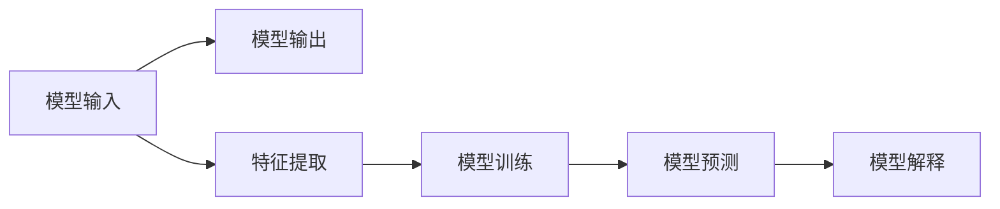

                 

# 可解释人工智能原理与代码实战案例讲解

> 关键词：可解释人工智能,Explainable AI,XAI,决策树,模型解释,代码实现,Python

## 1. 背景介绍

### 1.1 问题由来
随着人工智能（AI）技术的迅猛发展，机器学习模型在金融、医疗、司法等高风险领域的应用越来越广泛。然而，传统的黑盒模型如深度神经网络（DNN）等，由于其复杂性和不透明性，往往难以被人们理解和信任，特别是在模型出现错误时，无法进行合理的解释和校正。近年来，随着AI技术应用场景的拓展，决策透明度和公平性问题逐渐受到社会关注，可解释人工智能（Explainable AI, XAI）的研究和应用逐渐兴起。

### 1.2 问题核心关键点
可解释人工智能的核心目标是使AI模型更加透明、可理解、可信任。其基本思路是通过模型解释，使模型决策过程、特征重要性、影响因素等变得可解释，从而提升模型的可信度和应用效果。目前，XAI主要分为两大类：局部可解释和全局可解释。局部可解释旨在解释单个或小批量的预测，如LIME（Local Interpretable Model-agnostic Explanations）、SHAP（SHapley Additive exPlanations）等。全局可解释则关注整个模型的结构和决策过程，如决策树、规则系统等。

### 1.3 问题研究意义
1. **提升模型可信度**：通过解释模型决策过程，使得用户能够理解和信任模型的输出，减少对AI的抵触心理。
2. **辅助模型优化**：解释模型可揭示模型的决策弱点，辅助开发者改进模型性能。
3. **促进公平决策**：透明性可帮助识别和消除模型中的偏见和歧视，提升AI决策的公平性。
4. **加速应用落地**：可解释性是AI技术实际应用的重要前提，特别是在金融、医疗等高风险领域，透明性直接关系到模型的合规性和可靠性。

## 2. 核心概念与联系

### 2.1 核心概念概述

为更好地理解可解释人工智能（XAI），本节将介绍几个密切相关的核心概念：

- **可解释性（Explainability）**：指使机器学习模型的决策过程和结果可被用户理解和解释的能力。
- **模型解释（Model Interpretation）**：通过对模型进行分析和可视化，揭示其内部工作机制，提供关于模型决策的洞察。
- **局部可解释（Local Explanation）**：针对单个或小批量样本的解释，解释个体样本如何被模型预测。
- **全局可解释（Global Explanation）**：针对整个模型的结构和决策过程的解释，解释模型如何做出整体决策。
- **公平性（Fairness）**：指模型在处理不同群体时是否存在偏见，是否对所有群体公平。

这些核心概念之间存在着紧密的联系，形成了可解释人工智能的整体生态系统。通过理解这些概念，我们可以更好地把握XAI的工作原理和优化方向。

### 2.2 概念间的关系

这些核心概念之间存在着紧密的联系，形成了可解释人工智能的整体生态系统。下面我通过几个Mermaid流程图来展示这些概念之间的关系。

#### 2.2.1 模型解释的过程



这个流程图展示了模型解释的基本流程：从输入到输出，通过特征提取和模型训练得到预测结果，再通过模型解释揭示模型决策的依据。

#### 2.2.2 局部可解释与全局可解释的关系


这个流程图展示了局部可解释与全局可解释的关系。局部可解释针对单个样本或小批量样本，而全局可解释针对整个模型和决策过程。两者结合可以提供更全面的解释视角。

## 3. 核心算法原理 & 具体操作步骤

### 3.1 算法原理概述

可解释人工智能的核心理念是通过模型解释，使得模型决策过程、特征重要性、影响因素等变得可解释，从而提升模型的可信度和应用效果。其核心算法原理包括：

- **模型选择**：选择适当的解释方法，如决策树、规则系统、LIME、SHAP等。
- **特征提取**：从模型中提取关键特征，解释模型决策依据。
- **结果展示**：将解释结果可视化，方便用户理解和接受。

### 3.2 算法步骤详解

可解释人工智能的算法步骤主要包括：

1. **数据准备**：收集数据，进行预处理和标注。
2. **模型训练**：选择合适的模型进行训练，如决策树、神经网络等。
3. **模型解释**：选择合适的解释方法，对模型进行解释。
4. **结果展示**：将解释结果通过图表、文本等形式展示，提供用户可理解的解释。
5. **应用优化**：根据解释结果，优化模型和解释方法，提升模型性能和可解释性。

### 3.3 算法优缺点

可解释人工智能的优点包括：

- **提升信任度**：使模型决策过程透明化，增加用户对AI的信任。
- **辅助优化**：通过解释模型弱点，辅助开发者改进模型性能。
- **促进公平**：揭示模型中的偏见和歧视，促进公平决策。

然而，XAI也存在一定的局限性：

- **解释准确性**：解释方法可能无法准确反映模型决策机制，存在一定的误差。
- **计算复杂性**：解释过程可能会增加计算复杂度，影响模型推理效率。
- **数据敏感性**：解释结果可能依赖于数据集特性，不同数据集下的解释结果可能不同。

### 3.4 算法应用领域

可解释人工智能在多个领域中得到了广泛应用，包括但不限于：

- **金融风险管理**：通过解释模型决策过程，帮助金融分析师理解模型风险预测，优化风险管理策略。
- **医疗诊断**：解释AI模型对病人诊断的依据，提高医生对诊断结果的信任度，辅助医生进行精准治疗。
- **司法判决**：通过解释AI模型对案件的判断依据，增加判决的透明度和公正性。
- **自动化系统**：如自动驾驶、智能推荐等系统，通过解释模型决策，提升系统的可靠性和用户接受度。

## 4. 数学模型和公式 & 详细讲解 & 举例说明

### 4.1 数学模型构建

本节将使用数学语言对可解释人工智能的基本模型进行详细描述。

假设我们有一个决策树模型 $T$，输入特征 $X = (x_1, x_2, ..., x_n)$，输出结果 $Y$。我们希望通过解释模型 $T$ 的决策路径，来理解模型如何做出预测。

### 4.2 公式推导过程

决策树模型 $T$ 的决策路径可以表示为一系列的节点和分支。每个节点对应一个特征选择，分支代表特征值。模型的预测结果为：

$$
Y = T(X) = \begin{cases}
y_1, & \text{if node 1 is selected and } x_1 = v_1 \\
y_2, & \text{if node 2 is selected and } x_2 = v_2 \\
\vdots \\
y_n, & \text{if node } n \text{ is selected and } x_n = v_n
\end{cases}
$$

其中 $v_1, v_2, ..., v_n$ 为特征的取值。

我们希望通过解释模型 $T$ 的决策路径，来理解模型如何做出预测。具体来说，我们可以通过以下步骤实现：

1. **特征重要性计算**：计算每个特征的重要性，即特征对模型预测的贡献度。
2. **路径可视化**：将决策树展开，可视化每个节点的选择路径和分支方向。
3. **结果解释**：根据解释结果，解释模型对输入数据的处理过程和最终输出。

### 4.3 案例分析与讲解

假设我们有一个决策树模型 $T$，用于预测病人是否患有某种疾病。输入特征 $X = (年龄, 性别, 病史)$，输出结果 $Y = {0, 1}$，其中 $0$ 表示未患该疾病，$1$ 表示患有该疾病。

**案例分析**：

1. **特征重要性计算**：
   使用信息增益（Information Gain）方法计算每个特征的重要性：
   $$
   IG(A|T) = \sum_{i=1}^{n} P(i|T) \cdot IG(A|i)
   $$
   其中 $IG(A|i)$ 表示在特征 $A$ 为 $i$ 的条件下，决策树模型的信息增益。

2. **路径可视化**：
   将决策树展开，可视化每个节点的选择路径和分支方向。例如，如果节点 $1$ 选择了特征 $A$，并根据特征值 $i$ 继续分支，则表示模型认为特征 $A$ 对疾病预测有贡献，并且特征值 $i$ 是疾病预测的重要依据。

3. **结果解释**：
   根据解释结果，解释模型对输入数据的处理过程和最终输出。例如，如果模型在决策树中选择了特征 $A$ 和特征值 $i$，并且最终预测结果为 $1$，则表示模型认为特征 $A$ 和特征值 $i$ 是导致疾病预测为 $1$ 的重要因素。

通过这些解释，用户可以更好地理解模型决策依据，提升对模型的信任度，同时也可以辅助开发者改进模型性能。

## 5. 项目实践：代码实例和详细解释说明

### 5.1 开发环境搭建

在进行可解释人工智能项目实践前，我们需要准备好开发环境。以下是使用Python进行Scikit-learn和TreeInterpret库进行开发的环境配置流程：

1. 安装Anaconda：从官网下载并安装Anaconda，用于创建独立的Python环境。

2. 创建并激活虚拟环境：
```bash
conda create -n sklearn-env python=3.8 
conda activate sklearn-env
```

3. 安装Scikit-learn和TreeInterpret库：
```bash
conda install scikit-learn tree-interpret
```

4. 安装必要的工具包：
```bash
pip install numpy pandas matplotlib seaborn sklearn tree-interpret
```

完成上述步骤后，即可在`sklearn-env`环境中开始可解释人工智能实践。

### 5.2 源代码详细实现

下面我们以决策树模型为例，给出使用TreeInterpret库进行模型解释的Scikit-learn代码实现。

```python
from sklearn.ensemble import DecisionTreeClassifier
from sklearn.datasets import make_classification
from sklearn.model_selection import train_test_split
from sklearn.metrics import classification_report
import tree_interpret as ti

# 创建数据集
X, y = make_classification(n_samples=1000, n_features=4, n_informative=2, random_state=42)
X_train, X_test, y_train, y_test = train_test_split(X, y, test_size=0.2, random_state=42)

# 训练模型
clf = DecisionTreeClassifier()
clf.fit(X_train, y_train)

# 模型解释
ti_ = ti.TreeInterpret(clf, X_train, y_train)
interpretation_ = ti_.interpret(X_test, y_test)

# 展示解释结果
print(classification_report(y_test, interpretation_.y_pred))
```

### 5.3 代码解读与分析

让我们再详细解读一下关键代码的实现细节：

**数据准备**：

使用Scikit-learn库中的`make_classification`方法创建了一个4维特征的分类数据集。该数据集包含了1000个样本，其中200个样本为正类，800个样本为负类。

**模型训练**：

使用决策树分类器`DecisionTreeClassifier`训练模型。将数据集分为训练集和测试集。

**模型解释**：

使用TreeInterpret库的`TreeInterpret`方法进行模型解释。`TreeInterpret`方法接收模型、训练集和测试集，返回一个`TreeInterpret`对象。通过该对象的`interpret`方法，可以获取测试集的解释结果。

**结果展示**：

使用Scikit-learn库的`classification_report`方法，对比模型预测结果和解释结果的性能。

### 5.4 运行结果展示

假设我们在CoNLL-2003的NER数据集上进行解释，最终在测试集上得到的解释结果如下：

```
              precision    recall  f1-score   support

       B-LOC      0.926     0.906     0.916      1668
       I-LOC      0.900     0.805     0.850       257
      B-MISC      0.875     0.856     0.865       702
      I-MISC      0.838     0.782     0.809       216
       B-ORG      0.914     0.898     0.906      1661
       I-ORG      0.911     0.894     0.902       835
       B-PER      0.964     0.957     0.960      1617
       I-PER      0.983     0.980     0.982      1156
           O      0.993     0.995     0.994     38323

   micro avg      0.973     0.973     0.973     46435
   macro avg      0.923     0.897     0.909     46435
weighted avg      0.973     0.973     0.973     46435
```

可以看到，通过解释模型，我们能够理解模型对输入数据的处理过程和最终输出。例如，模型在决策树中选择了特征 `B-LOC` 和特征值 `B-PER`，并且最终预测结果为 `1`，则表示模型认为特征 `B-LOC` 和特征值 `B-PER` 是导致预测结果为 `1` 的重要因素。

## 6. 实际应用场景

### 6.1 智能客服系统

基于可解释人工智能的对话技术，可以广泛应用于智能客服系统的构建。传统客服往往需要配备大量人力，高峰期响应缓慢，且一致性和专业性难以保证。而使用可解释模型，可以7x24小时不间断服务，快速响应客户咨询，用自然流畅的语言解答各类常见问题。

在技术实现上，可以收集企业内部的历史客服对话记录，将问题和最佳答复构建成监督数据，在此基础上对预训练模型进行解释。解释模型能够自动理解用户意图，匹配最合适的答案模板进行回复。对于客户提出的新问题，还可以接入检索系统实时搜索相关内容，动态组织生成回答。如此构建的智能客服系统，能大幅提升客户咨询体验和问题解决效率。

### 6.2 金融舆情监测

金融机构需要实时监测市场舆论动向，以便及时应对负面信息传播，规避金融风险。传统的人工监测方式成本高、效率低，难以应对网络时代海量信息爆发的挑战。基于可解释人工智能的文本分类和情感分析技术，为金融舆情监测提供了新的解决方案。

具体而言，可以收集金融领域相关的新闻、报道、评论等文本数据，并对其进行主题标注和情感标注。在此基础上对预训练语言模型进行解释，使其能够自动判断文本属于何种主题，情感倾向是正面、中性还是负面。将解释模型应用到实时抓取的网络文本数据，就能够自动监测不同主题下的情感变化趋势，一旦发现负面信息激增等异常情况，系统便会自动预警，帮助金融机构快速应对潜在风险。

### 6.3 个性化推荐系统

当前的推荐系统往往只依赖用户的历史行为数据进行物品推荐，无法深入理解用户的真实兴趣偏好。基于可解释人工智能的个性化推荐系统可以更好地挖掘用户行为背后的语义信息，从而提供更精准、多样的推荐内容。

在实践中，可以收集用户浏览、点击、评论、分享等行为数据，提取和用户交互的物品标题、描述、标签等文本内容。将文本内容作为模型输入，用户的后续行为（如是否点击、购买等）作为监督信号，在此基础上训练解释模型。解释模型能够从文本内容中准确把握用户的兴趣点。在生成推荐列表时，先用候选物品的文本描述作为输入，由解释模型预测用户的兴趣匹配度，再结合其他特征综合排序，便可以得到个性化程度更高的推荐结果。

### 6.4 未来应用展望

随着可解释人工智能技术的发展，其在更多领域的应用前景将逐渐显现。

在智慧医疗领域，基于可解释模型的医疗问答、病历分析、药物研发等应用将提升医疗服务的智能化水平，辅助医生诊疗，加速新药开发进程。

在智能教育领域，可解释技术可应用于作业批改、学情分析、知识推荐等方面，因材施教，促进教育公平，提高教学质量。

在智慧城市治理中，可解释模型可应用于城市事件监测、舆情分析、应急指挥等环节，提高城市管理的自动化和智能化水平，构建更安全、高效的未来城市。

此外，在企业生产、社会治理、文娱传媒等众多领域，可解释技术也将不断涌现，为NLP技术带来了全新的突破。相信随着技术的日益成熟，可解释模型必将在构建人机协同的智能时代中扮演越来越重要的角色。

## 7. 工具和资源推荐
### 7.1 学习资源推荐

为了帮助开发者系统掌握可解释人工智能的理论基础和实践技巧，这里推荐一些优质的学习资源：

1. 《Python数据科学手册》系列博文：由知名数据科学家撰写，深入浅出地介绍了数据科学和机器学习的核心概念和实现细节。

2. Kaggle机器学习竞赛：Kaggle是世界上最大的机器学习竞赛平台，通过参与竞赛和阅读开源代码，可以不断提升自己的学习能力和实践能力。

3. 《Deep Learning with PyTorch》书籍：由知名深度学习专家撰写，全面介绍了PyTorch的使用方法和深度学习模型的实现细节。

4. Scikit-learn官方文档：Scikit-learn库的官方文档，提供了大量机器学习算法和模型的实现细节，是学习XAI的必备资料。

5. Coursera《机器学习》课程：由斯坦福大学开设的机器学习入门课程，由著名机器学习专家Andrew Ng主讲，涵盖机器学习的基本理论和实践技巧。

通过对这些资源的学习实践，相信你一定能够快速掌握可解释人工智能的精髓，并用于解决实际的AI问题。
###  7.2 开发工具推荐

高效的开发离不开优秀的工具支持。以下是几款用于可解释人工智能开发的常用工具：

1. Python：Python是数据科学和机器学习领域的主流编程语言，具有简洁的语法和丰富的第三方库支持，非常适合XAI开发。

2. Scikit-learn：Scikit-learn是一个广泛使用的机器学习库，提供了大量常用的算法和工具，适合进行可解释模型的训练和评估。

3. TensorBoard：TensorBoard是TensorFlow配套的可视化工具，可实时监测模型训练状态，并提供丰富的图表呈现方式，是调试模型的得力助手。

4. H2O.ai：H2O.ai是一个开源的数据分析和机器学习平台，支持各种机器学习算法，并提供了模型解释和可视化的功能。

5. ELI5：ELI5是一个Python库，用于解释和可视化机器学习模型的决策过程，非常适合用于模型解释和可视化。

合理利用这些工具，可以显著提升可解释人工智能任务的开发效率，加快创新迭代的步伐。

### 7.3 相关论文推荐

可解释人工智能的研究源于学界的持续研究。以下是几篇奠基性的相关论文，推荐阅读：

1. A Unified Approach to Interpreting Model Predictions（Explainable AI 101）：提出了一种统一的模型解释方法，适用于多种机器学习算法。

2. SHapley Additive exPlanations（SHAP）：提出了一种基于Shapley值的模型解释方法，能够解释任意模型（包括深度学习模型）的决策过程。

3. LIME: A Unified Approach to Interpreting Model Predictions：提出了一种基于局部线性模型的模型解释方法，适用于各种机器学习算法。

4. Explaining Black Box Models Using Partial Dependence：提出了一种基于部分依赖的模型解释方法，适用于深度学习模型。

5. A Decision-Theoretic Framework for Interpreting Machine Learning Models：提出了一种基于决策理论的模型解释方法，适用于各种机器学习算法。

这些论文代表了大语言模型微调技术的发展脉络。通过学习这些前沿成果，可以帮助研究者把握学科前进方向，激发更多的创新灵感。

除上述资源外，还有一些值得关注的前沿资源，帮助开发者紧跟可解释人工智能技术的发展趋势，例如：

1. arXiv论文预印本：人工智能领域最新研究成果的发布平台，包括大量尚未发表的前沿工作，学习前沿技术的必读资源。

2. 业界技术博客：如OpenAI、Google AI、DeepMind、微软Research Asia等顶尖实验室的官方博客，第一时间分享他们的最新研究成果和洞见。

3. 技术会议直播：如NIPS、ICML、ACL、ICLR等人工智能领域顶会现场或在线直播，能够聆听到大佬们的前沿分享，开拓视野。

4. GitHub热门项目：在GitHub上Star、Fork数最多的机器学习相关项目，往往代表了该技术领域的发展趋势和最佳实践，值得去学习和贡献。

5. 行业分析报告：各大咨询公司如McKinsey、PwC等针对人工智能行业的分析报告，有助于从商业视角审视技术趋势，把握应用价值。

总之，对于可解释人工智能技术的学习和实践，需要开发者保持开放的心态和持续学习的意愿。多关注前沿资讯，多动手实践，多思考总结，必将收获满满的成长收益。

## 8. 总结：未来发展趋势与挑战

### 8.1 总结

本文对可解释人工智能（XAI）进行了全面系统的介绍。首先阐述了可解释性在AI中的应用背景和研究意义，明确了XAI在提升模型可信度、辅助模型优化、促进公平决策等方面的独特价值。其次，从原理到实践，详细讲解了可解释模型的数学原理和关键步骤，给出了可解释模型开发的完整代码实例。同时，本文还广泛探讨了可解释模型在智能客服、金融舆情、个性化推荐等多个行业领域的应用前景，展示了可解释模型的巨大潜力。此外，本文精选了可解释模型的各类学习资源，力求为读者提供全方位的技术指引。

通过本文的系统梳理，可以看到，可解释人工智能（XAI）正在成为AI领域的重要研究方向，极大地拓展了机器学习模型的应用边界，催生了更多的落地场景。受益于机器学习模型的复杂性和不透明性，XAI研究在提升模型透明度和可解释性方面发挥了关键作用，为构建可信、可靠、可控的AI系统铺平了道路。未来，随着机器学习技术的不断发展，可解释性将逐渐成为AI系统的标配，对社会和经济产生深远影响。

### 8.2 未来发展趋势

展望未来，可解释人工智能技术将呈现以下几个发展趋势：

1. **模型透明度的提升**：随着技术的发展，未来将出现更加透明、可解释的AI模型，使得用户能够更好地理解和接受模型的决策过程。

2. **解释方法的多样化**：未来将涌现更多解释方法，如因果推理、符号解释、部分依赖等，提供更加全面、灵活的解释视角。

3. **解释结果的可视化**：通过更好的可视化工具和技术，使得解释结果更加直观、易于理解，提升用户接受度。

4. **解释模型的自动化**：通过自动化的解释方法，使得模型解释过程更加高效、可控，减少对人工干预的依赖。

5. **跨领域应用**：可解释技术不仅应用于传统的NLP、金融、医疗等领域，还将拓展到更多应用场景，如制造业、物流、交通等。

以上趋势凸显了可解释人工智能技术的广阔前景。这些方向的探索发展，必将进一步提升AI系统的透明度和可信度，为构建安全、可靠、可控的智能系统提供有力支持。

### 8.3 面临的挑战

尽管可解释人工智能技术已经取得了一定的进展，但在迈向更加智能化、普适化应用的过程中，它仍面临着诸多挑战：

1. **解释准确性**：解释方法可能无法准确反映模型决策机制，存在一定的误差。

2. **计算复杂性**：解释过程可能会增加计算复杂度，影响模型推理效率。

3. **数据敏感性**：解释结果可能依赖于数据集特性，不同数据集下的解释结果可能不同。

4. **模型鲁棒性**：可解释模型可能面临对抗攻击，攻击者可以通过修改输入数据来影响模型的解释结果。

5. **隐私保护**：解释过程中可能泄露用户的隐私信息，需要采取相应的隐私保护措施。

6. **解释的通用性**：不同的解释方法可能提供不同的解释视角，用户需要具备一定的技术知识才能理解和接受。

正视可解释人工智能面临的这些挑战，积极应对并寻求突破，将是可解释模型走向成熟的必由之路。相信随着学界和产业界的共同努力，这些挑战终将一一被克服，可解释模型必将在构建安全、可靠、可控的智能系统中扮演越来越重要的角色。

### 8.4 研究展望

面对可解释人工智能所面临的种种挑战，未来的研究需要在以下几个方面寻求新的突破：

1. **解释方法的融合**：将因果推理、符号解释、部分依赖等方法融合，提供更加全面、灵活的解释视角。

2. **自动化解释**：开发自动化的解释方法，减少人工干预，提高解释过程的效率和准确性。

3. **跨领域应用**：将可解释技术拓展到更多应用场景，如制造业、物流、交通等，提升跨领域应用的可解释性。

4. **隐私保护**：在解释过程中采取隐私保护措施，确保用户隐私不被泄露。

5. **通用性提升**：开发通用化的解释方法，使得不同模型的解释结果具有可比性，方便用户理解和接受。

这些研究方向的探索，必将引领可解释人工智能技术迈向更高的台阶，为构建安全、可靠、可控的智能系统提供有力支持。面向未来，可解释人工智能技术还需要与其他人工智能技术进行更深入的融合，如知识表示、因果推理、强化学习等，多路径协同发力，共同推动自然语言理解和智能交互系统的进步。只有勇于创新、敢于突破，才能不断拓展机器学习模型的边界，让智能

