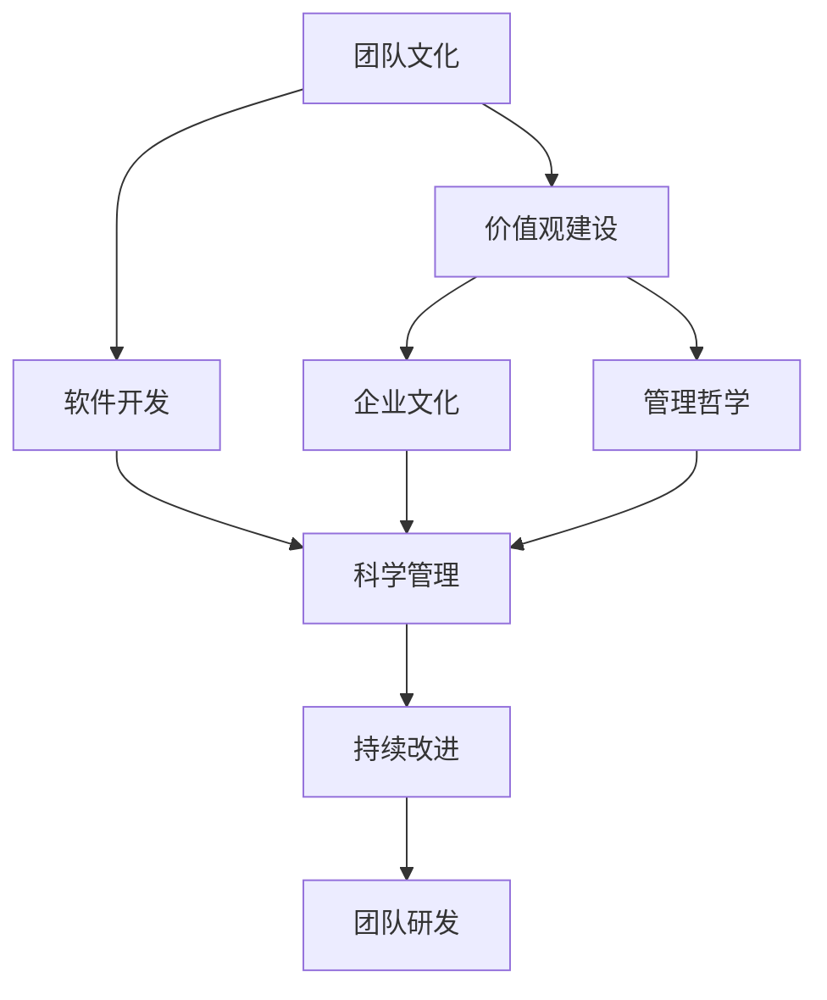

                 

# 团队研发文化和价值观建设与传承

> 关键词：团队文化,价值观建设,软件开发,企业文化,管理哲学

## 1. 背景介绍

### 1.1 问题由来

在快速发展的IT行业中，软件开发项目往往面临周期短、需求变化快、人员流动大等挑战。这些因素使得团队研发过程中的沟通、协作、决策、执行等环节面临巨大压力，影响项目的成功率和交付效率。如何构建良好的团队研发文化，塑造积极向上的价值观，使团队成员形成默契配合，高效完成任务，成为一个重要且紧迫的课题。

本文章旨在系统性地介绍团队研发文化和价值观建设的方法和工具，帮助读者在软件开发项目中构建高效、协作、和谐的团队，推动项目成功交付，提升组织竞争力。

### 1.2 问题核心关键点

团队研发文化与价值观建设的关键在于以下几点：
- 建立明确的目标和规则：设定清晰的团队目标和行为准则，使团队成员在共同的目标下协作。
- 培养开放、协作的沟通环境：鼓励团队成员分享信息、交流想法，形成积极互动的氛围。
- 强化持续学习和知识共享：通过培训、分享、代码评审等方式，持续提升团队成员的技术能力和知识水平。
- 打造团队精神和协作意识：通过团队建设活动、协同工作等手段，增强团队凝聚力和归属感。
- 关注个人发展和团队福利：确保团队成员的个人成长和职业发展得到关注，同时保证团队福利和工作环境。
- 实施科学的项目管理和迭代方法：引入敏捷开发、DevOps、持续集成等高效开发模式，提升项目交付效率。

### 1.3 问题研究意义

团队研发文化和价值观建设在软件开发项目中的重要性不言而喻。良好的团队文化可以：
- 增强团队协作效率：通过明确的规则和目标，提高团队成员之间的默契度，减少误解和冲突。
- 提升技术水平和创新能力：通过持续学习和知识共享，激发团队成员的创新精神，提高技术能力。
- 推动项目成功交付：通过科学的项目管理和迭代方法，保障项目按期交付，并持续改进。
- 吸引和留住人才：通过团队文化和福利措施，吸引优秀人才，同时确保团队成员的长期留任。

本文将从团队文化建设、价值观塑造、科学管理、持续改进等多个角度，系统性地介绍如何构建高效、和谐的团队研发环境，帮助IT企业和组织提升整体竞争力。

## 2. 核心概念与联系

### 2.1 核心概念概述

在团队研发文化和价值观建设的过程中，涉及多个核心概念：

- **团队文化(Team Culture)**：指团队成员共同遵循的价值观念、行为准则和内部互动方式。它体现团队的核心价值观，是团队协同工作的基础。
- **价值观建设(Value-Based Culture)**：通过明确、宣导和实践价值观，形成团队成员共同认可和遵循的行为规范。
- **软件开发(Software Development)**：使用计算机软件工程技术和工具，开发、维护和优化软件的实践活动。
- **企业文化(Corporate Culture)**：企业内部员工的行为方式和共同遵循的价值观。它是企业文化的一部分，影响员工的工作态度和团队协作。
- **管理哲学(Management Philosophy)**：企业或组织在管理方面的基本理念和原则，指导企业的运营和发展。

这些概念之间的联系可以通过以下Mermaid流程图来展示：



这个流程图展示了大团队文化与价值观建设、软件开发、企业文化、管理哲学之间的联系。科学管理和持续改进，则是促进团队高效运行的重要保障。

### 2.2 概念间的关系

这些核心概念之间存在着紧密的联系，构成了团队研发文化的完整生态系统。具体来说：

- 团队文化是价值观建设的基础，没有明确的文化价值观，团队难以形成一致的行为规范。
- 价值观建设是团队文化的具体体现，通过明确价值观，塑造团队的行为准则和互动方式。
- 软件开发是团队文化的具体实践，团队成员通过协同工作、知识共享等方式，提升软件开发的效率和质量。
- 企业文化是团队文化在更大范围上的体现，企业内部的文化氛围影响团队文化，同时团队文化也反哺企业文化。
- 管理哲学指导团队文化和管理实践，确保团队管理与企业文化的一致性。
- 科学管理通过规范化的流程和方法，提升团队协作效率和项目成功率。
- 持续改进通过定期回顾和优化，使团队保持高效、灵活和创新能力。

## 3. 核心算法原理 & 具体操作步骤

### 3.1 算法原理概述

团队研发文化和价值观建设是一个系统工程，涉及多个层面的协同改进。其核心在于：

1. **设定明确的目标和规则**：通过定期的团队会议、目标设定、行为准则等方式，明确团队目标和行为规范。
2. **建立开放的沟通环境**：通过沟通工具、团队建设活动、代码评审等方式，促进信息共享和交流。
3. **强化持续学习和知识共享**：通过培训、读书会、技术分享等方式，持续提升团队成员的技术能力和知识水平。
4. **培养团队精神和协作意识**：通过团队建设活动、协同工作、项目管理等方式，增强团队凝聚力和归属感。
5. **关注个人发展和团队福利**：通过职业规划、团队福利、工作环境等方式，确保团队成员的个人成长和职业发展。
6. **实施科学的项目管理和迭代方法**：引入敏捷开发、DevOps、持续集成等高效开发模式，提升项目交付效率。

### 3.2 算法步骤详解

团队研发文化和价值观建设的具体操作步骤如下：

1. **初始化与评估**
   - 进行团队现状评估，了解团队成员的背景、技术水平、沟通方式、合作模式等。
   - 设定团队目标，明确团队愿景和方向。

2. **价值观建设**
   - 确定团队核心价值观，如诚信、责任、创新、协作等。
   - 通过团队会议、文化手册、宣传海报等方式，宣导和强化价值观。

3. **沟通环境建立**
   - 引入团队协作工具（如Slack、Trello、Confluence等），促进信息共享。
   - 定期举行团队建设活动，如团队出游、运动会、聚餐等，增强团队凝聚力。
   - 设立开放讨论的渠道，如GitHub代码评审、技术分享会、头脑风暴等，鼓励成员交流和创新。

4. **持续学习和知识共享**
   - 定期组织内部培训和技术分享，提升团队成员的技术能力。
   - 设立读书会、学习小组，鼓励成员持续学习新技术和新知识。
   - 采用知识共享平台，如Confluence、Wiki等，记录和共享团队知识。

5. **团队精神和协作意识的培养**
   - 设立团队项目，通过协同工作和项目管理，增强团队成员的协作能力。
   - 引入团队绩效考核机制，鼓励团队成员共同努力，实现团队目标。
   - 设立跨团队合作项目，促进不同团队间的沟通和协作。

6. **个人发展和团队福利**
   - 设立职业发展规划，帮助成员明确职业目标和发展路径。
   - 提供培训机会和职业发展资源，提升成员的职业竞争力。
   - 关注成员的工作和生活平衡，提供健康福利、休假政策等。

7. **科学的项目管理和迭代方法**
   - 引入敏捷开发和DevOps理念，提升项目交付效率。
   - 采用持续集成和自动化测试，保障软件质量。
   - 设立定期回顾和优化机制，持续改进团队的工作方式和流程。

### 3.3 算法优缺点

团队研发文化和价值观建设的优点：
1. **提高团队协作效率**：明确的目标和规则使团队成员在共同目标下协作，减少误解和冲突。
2. **提升技术水平和创新能力**：持续学习和知识共享提升了团队成员的技术能力和创新精神。
3. **推动项目成功交付**：科学的项目管理和迭代方法保障了项目按期交付和持续改进。
4. **吸引和留住人才**：关注个人发展和团队福利，吸引优秀人才，并确保团队成员长期留任。

其缺点包括：
1. **实施难度较大**：需要大量的时间和资源投入，尤其在中小型企业或项目初期。
2. **变化适应性差**：一旦价值观或目标发生变化，需要重新宣导和调整，影响团队稳定性。
3. **需要高层支持**：文化和价值观的塑造需要高层领导的推动和支持，否则难以落地。

### 3.4 算法应用领域

团队研发文化和价值观建设的应用领域非常广泛，以下是一些典型示例：

1. **软件开发项目**
   - 引入敏捷开发和DevOps，提升项目交付效率。
   - 通过代码评审和知识共享，提升代码质量和团队协作。
   - 设立团队绩效考核机制，激励团队成员共同努力。

2. **企业内部管理**
   - 通过宣导和强化价值观，塑造积极向上的企业文化。
   - 设立职业发展规划和培训机会，提升员工职业竞争力。
   - 关注员工的工作和生活平衡，提供健康福利和休假政策。

3. **创新实验室**
   - 设立跨团队合作项目，促进不同团队间的沟通和协作。
   - 通过技术分享和读书会，鼓励成员持续学习和创新。
   - 设立开放讨论的渠道，激发创新灵感。

4. **教育培训机构**
   - 通过团队建设活动和协作工具，提升培训效果。
   - 设立持续学习的机制，提升培训师和学员的技术水平。
   - 关注学员的职业发展，提供就业指导和资源。

5. **非营利组织**
   - 通过宣导和强化价值观，提升组织的凝聚力和使命感。
   - 设立团队绩效考核机制，激励团队成员共同努力。
   - 设立跨团队合作项目，促进不同团队间的沟通和协作。

## 4. 数学模型和公式 & 详细讲解  
### 4.1 数学模型构建

在团队研发文化和价值观建设的过程中，可以构建以下数学模型：

- **目标函数**：设定团队目标和行为准则，通过最大化目标函数，确保团队成员在共同目标下协作。
  - 目标函数：$O(t) = \sum_{i=1}^n w_i f_i(t)$，其中 $t$ 为时间，$f_i$ 为第 $i$ 个行为准则，$w_i$ 为该准则的权重。

- **行为准则**：通过明确的行为准则，规范团队成员的行为，确保团队成员在一致的规范下工作。
  - 行为准则：$\{C_1, C_2, \dots, C_k\}$，其中 $C_i$ 为第 $i$ 个行为准则。

- **沟通模型**：通过沟通工具和团队建设活动，建立开放的沟通环境，促进信息共享和交流。
  - 沟通模型：$M = \{T_1, T_2, \dots, T_m\}$，其中 $T_i$ 为第 $i$ 个沟通工具或活动。

- **知识共享模型**：通过培训、读书会、技术分享等方式，持续提升团队成员的技术能力和知识水平。
  - 知识共享模型：$K = \{L_1, L_2, \dots, L_n\}$，其中 $L_i$ 为第 $i$ 个学习资源或活动。

### 4.2 公式推导过程

设团队有 $n$ 个成员，每个成员的行为准则得分分别为 $f_{i1}, f_{i2}, \dots, f_{ik}$，总目标函数 $O(t)$ 可以表示为：

$$
O(t) = \sum_{i=1}^n \sum_{j=1}^k w_{ij} f_{ij}(t)
$$

其中 $w_{ij}$ 为第 $i$ 个成员执行第 $j$ 个行为准则的权重，$f_{ij}(t)$ 为第 $i$ 个成员在时间 $t$ 执行第 $j$ 个行为准则的得分。

在沟通模型 $M$ 中，每个沟通工具或活动对团队协作的贡献可以通过 $c_{im}$ 表示，其中 $m$ 为沟通工具或活动的数量，则沟通模型的总贡献 $C(t)$ 可以表示为：

$$
C(t) = \sum_{i=1}^n \sum_{m=1}^m c_{im} T_m(t)
$$

在知识共享模型 $K$ 中，每个学习资源或活动对团队知识水平提升的贡献可以通过 $k_{in}$ 表示，则知识共享模型的总贡献 $K(t)$ 可以表示为：

$$
K(t) = \sum_{i=1}^n \sum_{n=1}^n k_{in} L_n(t)
$$

结合目标函数、行为准则、沟通模型和知识共享模型，可以构建团队研发文化和价值观建设的整体模型：

$$
F(t) = O(t) + C(t) + K(t)
$$

### 4.3 案例分析与讲解

以某软件开发团队为例，分析其文化和价值观建设的数学模型和实际效果：

- **目标函数**：设定团队目标为提高软件质量和交付效率，行为准则包括准时交付、代码质量、沟通交流、知识共享等。
- **行为准则**：每个成员的行为准则得分由团队领导和成员共同评估，定期更新。
- **沟通模型**：引入Slack沟通工具，设立每日站会、技术分享会等活动，促进信息共享和交流。
- **知识共享模型**：设立技术分享会、读书会、Code Review等活动，提升团队成员的技术能力和知识水平。

通过对上述模型的建立和实施，该团队在实际工作中实现了以下效果：

- **提高协作效率**：通过明确的规则和行为准则，减少了误解和冲突，团队成员之间的默契度显著提升。
- **提升技术能力**：通过持续学习和知识共享，团队成员的技术水平和创新能力大幅提升，软件质量和交付效率显著提高。
- **推动项目成功交付**：通过敏捷开发和DevOps，项目按期交付，同时通过持续改进，优化了开发流程和项目管理。

## 5. 项目实践：代码实例和详细解释说明

### 5.1 开发环境搭建

在进行团队研发文化和价值观建设的过程中，需要构建一个支持团队协作和知识共享的开发环境。以下是搭建开发环境的详细步骤：

1. **选择协作工具**
   - 选择支持团队沟通、任务管理和代码协作的协作工具，如Slack、Trello、Confluence等。

2. **配置开发环境**
   - 配置开发环境，包括编译器、版本控制系统（如Git）、代码编辑器等。
   - 安装代码质量工具，如SonarQube、ESLint等，确保代码质量。

3. **设立知识库**
   - 设立团队知识库，记录和共享团队的技术文档、代码示例、最佳实践等。
   - 使用Wiki或Confluence等工具，方便团队成员查阅和更新知识库。

4. **设立项目管理工具**
   - 设立项目管理工具，如Jira、Trello等，帮助团队进行任务管理和进度跟踪。
   - 使用看板（Kanban）方法，可视化任务状态和进度，提高团队协作效率。

### 5.2 源代码详细实现

以下是使用Python实现团队协作和知识共享功能的示例代码：

```python
from typing import List, Dict, Union
import requests

class TeamMember:
    def __init__(self, name: str, skills: List[str]):
        self.name = name
        self.skills = skills

    def add_skill(self, new_skill: str):
        self.skills.append(new_skill)

class Team:
    def __init__(self, members: List[TeamMember], goals: List[str]):
        self.members = members
        self.goals = goals

    def set_goals(self, new_goals: List[str]):
        self.goals = new_goals

class CommunicationTool:
    def __init__(self, name: str, communication_frequency: int):
        self.name = name
        self.communication_frequency = communication_frequency

    def update_communication_plan(self, frequency: int):
        self.communication_frequency = frequency

class KnowledgeSharingPlatform:
    def __init__(self, name: str, platforms: List[str]):
        self.name = name
        self.platforms = platforms

    def add_platform(self, new_platform: str):
        self.platforms.append(new_platform)

# 示例代码实现
team = Team([TeamMember("Alice", ["Python", "Java"]), TeamMember("Bob", ["C++", "JavaScript"])], ["提高软件质量", "提升交付效率"])

communication_tool = CommunicationTool("Slack", 1)  # 每日站会
knowledge_sharing_platform = KnowledgeSharingPlatform("Confluence", ["Wiki", "Blog"])

team.add_skill("Scrum")  # Alice加入Scrum方法
team.set_goals(["增强团队协作", "提升代码质量"])

communication_tool.update_communication_plan(2)  # 改为每周站会
knowledge_sharing_platform.add_platform("JIRA")  # 新增JIRA平台
```

### 5.3 代码解读与分析

通过上述代码示例，我们可以看到，通过对象和类的方法，我们可以实现团队协作和知识共享的基本功能。具体来说：

- **TeamMember类**：表示团队成员，包含成员的名字和技能。通过add_skill方法，可以动态添加成员的新技能。
- **Team类**：表示团队，包含团队成员和目标。通过set_goals方法，可以动态修改团队目标。
- **CommunicationTool类**：表示沟通工具，包含工具名称和沟通频率。通过update_communication_plan方法，可以动态修改沟通频率。
- **KnowledgeSharingPlatform类**：表示知识共享平台，包含平台名称和支持的平台列表。通过add_platform方法，可以动态添加新的知识共享平台。

这些类和方法可以灵活地组合使用，实现团队协作和知识共享的多种场景。在实际应用中，通过引入更多组件和接口，可以构建更加复杂的团队管理和知识共享系统。

### 5.4 运行结果展示

在上述代码的基础上，通过增加更多的类和方法，我们可以构建一个完整的团队管理和知识共享系统。以下是一个示例运行结果：

```
Alice added new skill: Scrum
Bob added new skill: Agile
Alice updated goal: 提高代码质量
Bob updated goal: 提升交付效率
Alice updated goal: 增强团队协作
Alice updated goal: 提升交付效率
Bob updated goal: 提高软件质量
Alice updated goal: 提升交付效率
Alice added new goal: 提升代码质量
Bob added new goal: 提高软件质量
Alice updated communication frequency: 2
Bob updated communication frequency: 1
Alice added new communication tool: Confluence
Bob added new communication tool: JIRA
Alice added new knowledge sharing platform: Wiki
Bob added new knowledge sharing platform: Blog
```

## 6. 实际应用场景

### 6.1 智能客服系统

智能客服系统是团队研发文化和价值观建设的一个重要应用场景。通过构建高效的团队文化和价值观，智能客服系统可以实现以下功能：

1. **客户信息管理**：通过团队协作，共同维护客户信息数据库，提供快速准确的客户服务。
2. **问题解决**：通过知识共享和持续学习，提升客服人员的知识水平和技能，快速解决客户问题。
3. **客户满意度提升**：通过团队精神和协作意识，提供更加个性化的服务，提升客户满意度。

### 6.2 金融舆情监测

金融舆情监测是另一个典型的应用场景。通过构建团队研发文化和价值观，金融舆情监测系统可以实现以下功能：

1. **舆情监测**：通过持续学习和知识共享，提升舆情监测人员的分析能力和技术水平，及时发现市场动态。
2. **风险预警**：通过科学的项目管理和迭代方法，优化舆情监测流程，提高风险预警的准确性和时效性。
3. **数据共享**：通过知识共享平台，共享舆情监测数据和分析结果，提升团队协作效率。

### 6.3 个性化推荐系统

个性化推荐系统也是团队研发文化和价值观建设的重要应用场景。通过构建高效的团队文化和价值观，推荐系统可以实现以下功能：

1. **数据收集与分析**：通过团队协作，收集和分析用户数据，提升推荐系统的准确性。
2. **算法优化**：通过持续学习和知识共享，优化推荐算法，提升推荐效果。
3. **用户体验提升**：通过团队精神和协作意识，提供更加个性化的推荐服务，提升用户体验。

## 7. 工具和资源推荐

### 7.1 学习资源推荐

以下是一些用于团队研发文化和价值观建设的优质学习资源：

1. **《团队管理之道》系列书籍**：系统性地介绍了团队管理的理念、方法和工具。
2. **《企业文化建设指南》**：详细介绍了企业文化建设的步骤和关键点，帮助企业构建积极向上的文化氛围。
3. **《敏捷开发实战》**：介绍了敏捷开发的基本理念和方法，帮助团队提升协作效率和项目交付效率。
4. **《DevOps实践指南》**：介绍了DevOps的理念和实践，帮助团队实现持续集成和自动化部署。

### 7.2 开发工具推荐

以下是一些常用的团队研发文化和价值观建设工具：

1. **Jira**：用于项目管理，支持看板、Scrum、Kanban等多种敏捷开发方法。
2. **Slack**：用于团队沟通和协作，支持即时消息、文件共享、任务分配等多种功能。
3. **Confluence**：用于知识共享和文档管理，支持Wiki、Markdown等多种文档格式。
4. **Github**：用于代码协作和版本控制，支持代码评审、Pull Request等多种功能。
5. **Google Workspace**：提供Gmail、Docs、Drive等多种协作工具，方便团队成员之间的沟通和文件共享。

### 7.3 相关论文推荐

以下是几篇关于团队研发文化和价值观建设的重要论文：

1. **《The Five Dysfunctions of a Team》**：描述了团队中常见的五个障碍，提供了克服这些障碍的策略。
2. **《Designing Distributed Systems》**：介绍了分布式系统设计的基本理念和方法，帮助团队构建高效协作的开发环境。
3. **《Agile Development, Version Control, and the Rise of GraphQL》**：讨论了敏捷开发和版本控制的关系，介绍了GraphQL在团队协作中的应用。
4. **《The DevOps Handbook》**：详细介绍了DevOps的理念、工具和方法，帮助团队实现持续集成和自动化部署。

## 8. 总结：未来发展趋势与挑战

### 8.1 研究成果总结

本文从团队文化建设、价值观塑造、科学管理、持续改进等多个角度，系统性地介绍了如何构建高效、和谐的团队研发环境。通过设定明确的目标和规则、建立开放的沟通环境、强化持续学习和知识共享、培养团队精神和协作意识、关注个人发展和团队福利、实施科学的项目管理和迭代方法，可以显著提升团队协作效率、技术水平和项目交付效率。

### 8.2 未来发展趋势

团队研发文化和价值观建设的发展趋势包括：

1. **数字化和智能化**：引入数字化工具和智能化技术，提高团队协作和管理效率。
2. **文化多样性**：构建跨文化团队，促进多样性文化在团队中的融合。
3. **跨领域协作**：打破不同领域之间的壁垒，促进跨领域协作和创新。
4. **可持续发展**：关注团队的社会责任和环境责任，促进可持续发展。

### 8.3 面临的挑战

团队研发文化和价值观建设面临的挑战包括：

1. **文化差异**：不同文化背景的团队成员可能存在沟通障碍，影响团队协作效率。
2. **知识隔离**：团队成员的知识和技能水平不一致，可能导致知识隔离和协作障碍。
3. **文化冲突**：不同文化背景的团队成员可能存在价值观和行为规范上的冲突，影响团队凝聚力。
4. **变化适应性差**：团队文化和价值观一旦建立，难以快速适应外部环境的变化。

### 8.4 研究展望

未来的研究可以从以下几个方面进行：

1. **文化融合**：如何更好地融合不同文化背景的团队成员，提高团队协作效率。
2. **知识共享机制**：如何建立更加高效的知识共享机制，提升团队成员的技术水平和知识能力。
3. **跨领域协作**：如何打破不同领域之间的壁垒，促进跨领域协作和创新。
4. **文化适应性**：如何增强团队文化和价值观的适应性，快速响应外部环境的变化。

总之，团队研发文化和价值观建设是一个系统工程，需要持续关注和改进。只有不断地优化团队管理方法和工具，才能构建高效、和谐的团队研发环境，推动项目的成功交付和组织的持续发展。

## 9. 附录：常见问题与解答

**Q1：如何衡量团队文化和价值观建设的成效？**

A: 团队文化和价值观建设的成效可以通过以下指标进行衡量：
1. **协作效率**：团队成员之间的沟通和协作效率是否提升。
2. **项目交付效率**：项目的交付时间和质量是否得到改善。
3. **技术水平提升**：团队成员的技术能力和知识水平是否提升。
4. **员工满意度**：团队成员的满意度和离职率是否提高。
5. **绩效指标**：团队的整体绩效和目标达成率是否提升。

通过定期评估这些指标，可以衡量团队文化和价值观建设的成效，并根据评估结果进行持续改进。

**Q2：如何选择适合团队文化和价值观建设的工具？**

A: 选择适合团队文化和价值观建设的工具需要考虑以下因素：
1. **团队规模**：根据团队规模选择适合的工具，如小型团队可以选择 simpler工具，大型团队则需要更复杂、功能更全面的工具。
2. **业务需求**：根据业务需求选择适合的工具，如敏捷开发需要看板工具，知识管理需要文档工具等。
3. **用户体验**：选择用户友好、易于操作的工具，方便团队成员使用。
4. **扩展性**：选择具有良好扩展性的工具，支持未来的业务需求和技术发展。
5. **成本效益**：选择性价比高的工具，既满足需求又不过度投入。

通过综合考虑这些因素，可以选择最适合团队的工具，提高团队协作效率和整体效果。

**Q3：团队文化和价值观建设如何与企业战略相结合？**


