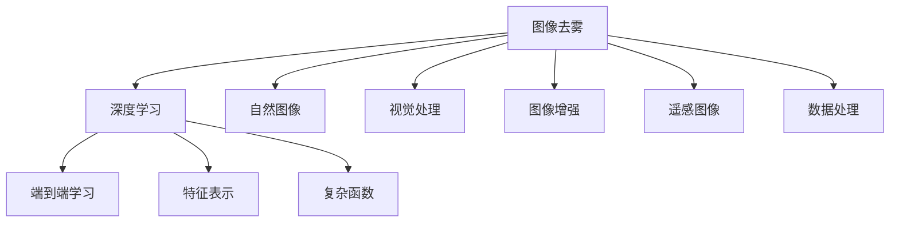

                 

# 图像去雾算法的研究与实现

> 关键词：图像去雾, 去雾算法, 深度学习, 自然图像, 视觉处理, 图像增强, 遥感图像, 数据处理

## 1. 背景介绍

### 1.1 问题由来

在大雾天气条件下，由于空气中的颗粒物对光的散射和吸收作用，图像采集设备的传感器获取的图像会出现严重失真和模糊。这种模糊效果会导致图像退化，影响视觉信息的准确获取和处理。因此，图像去雾技术成为图像处理和计算机视觉领域的一个重要研究方向。

### 1.2 问题核心关键点

图像去雾的主要目的是去除图像中的雾气效果，恢复其真实性。去雾算法通常可以分为两类：基于物理模型的方法和基于学习的方法。

- 基于物理模型的去雾方法通常假设雾气是均匀分布的，并根据大气散射模型和传输模型推导去雾算法。这些方法通常依赖于先验假设，对于非均匀雾气和复杂环境，其性能和鲁棒性会受到影响。
- 基于学习的方法则通过深度学习模型，利用大量标注数据进行端到端的图像去雾，不需要对物理模型进行先验假设，能够更好地处理非均匀雾气和复杂环境。

### 1.3 问题研究意义

图像去雾技术不仅对于气象研究、交通安全、医学成像等具有重要意义，还在遥感图像处理、无人驾驶等领域得到了广泛应用。通过去雾算法，可以提升图像质量，增强视觉信息提取的准确性，从而提升相关应用系统的性能和可靠性。

## 2. 核心概念与联系

### 2.1 核心概念概述

- **图像去雾**：从受雾图像中去除或减轻雾气效果，恢复其清晰度和真实性。
- **深度学习**：一种通过数据驱动的方式，自动学习特征表示和复杂函数映射的机器学习方法。
- **自然图像**：来自现实世界的图像，如景观、人物、车辆等。
- **视觉处理**：涉及图像获取、处理和分析的技术，是计算机视觉的重要组成部分。
- **图像增强**：通过各种技术手段，提升图像质量，增强其可视性和可用性。
- **遥感图像**：通过遥感设备获取的地球表面图像，如卫星图像、无人机图像等。
- **数据处理**：涉及数据的采集、存储、分析和处理，是图像去雾的重要基础。

### 2.2 核心概念之间的关系

这些核心概念之间存在着紧密的联系，共同构成了图像去雾技术的完整生态系统。下面通过一个Mermaid流程图来展示这些概念之间的关系：



这个流程图展示了图像去雾技术的核心概念及其之间的关系：

1. 图像去雾的目标是从受雾图像中去除雾气效果，恢复其清晰度和真实性。
2. 深度学习是实现图像去雾的核心技术，通过端到端学习的方式，能够直接从图像中提取特征，并映射到去雾后的图像。
3. 自然图像、视觉处理、图像增强、遥感图像和数据处理都是图像去雾的重要数据来源和技术支持。

这些概念共同构成了图像去雾技术的实现基础和应用背景，帮助我们在实践中更好地理解和应用去雾算法。

## 3. 核心算法原理 & 具体操作步骤

### 3.1 算法原理概述

图像去雾算法通常分为两个主要步骤：

1. 估计雾气密度：通过图像统计特征或先验知识，估计图像中的雾气密度。
2. 去除雾气效果：利用估计的雾气密度，通过去雾模型，从受雾图像中去除雾气效果，恢复其清晰度和真实性。

### 3.2 算法步骤详解

#### 3.2.1 数据准备与预处理

1. **数据准备**：收集受雾图像及其对应的晴空图像。受雾图像通常会在自然景观、交通场景、卫星图像等领域采集。晴空图像则通过在相同条件下拍摄的晴朗天气图像得到。
2. **预处理**：对图像进行灰度化、归一化等处理，以便后续的特征提取和模型训练。

#### 3.2.2 雾气密度估计

1. **基于物理模型的去雾**：
   - **大气散射模型**：假设雾气是均匀分布的，利用大气散射方程推导雾气密度。
   - **传输模型**：基于传输方程，通过雾气密度和大气能见度之间的关系，推导雾气密度。

2. **基于学习的去雾**：
   - **端到端学习**：利用深度神经网络模型，直接从受雾图像中提取雾气密度，作为去雾过程中的先验知识。
   - **特征表示**：使用卷积神经网络（CNN）等深度学习模型，提取图像中的高层次特征，并通过特征编码器生成雾气密度。

#### 3.2.3 去雾模型构建

1. **基于物理模型的去雾**：
   - **拉普拉斯模型**：利用拉普拉斯算子，根据雾气密度对图像进行去雾处理。
   - **散射模型**：基于散射方程，推导去雾模型，通过雾气密度对图像进行恢复。

2. **基于学习的去雾**：
   - **卷积神经网络**：使用CNN模型，直接从受雾图像中恢复清晰图像。
   - **生成对抗网络**：利用生成器网络生成去雾后的图像，通过判别器网络进行监督，训练去雾模型。

#### 3.2.4 模型训练与评估

1. **模型训练**：通过训练数据集，优化去雾模型，使得其能够在受雾图像中恢复清晰图像。
2. **模型评估**：使用测试数据集，评估去雾模型的性能，如PSNR、SSIM等指标。

#### 3.2.5 结果展示与优化

1. **结果展示**：通过可视化工具，展示去雾前后的图像对比。
2. **优化改进**：根据评估结果，对模型进行优化，如调整网络结构、修改损失函数等，以提升去雾效果。

### 3.3 算法优缺点

#### 3.3.1 基于物理模型的去雾方法

**优点**：
- 理论基础扎实，具有物理上的合理性。
- 计算简单，适合处理小规模图像。

**缺点**：
- 依赖于先验假设，对于复杂环境和非均匀雾气效果处理能力有限。
- 对参数选择和模型设计要求较高，调整复杂。

#### 3.3.2 基于学习的去雾方法

**优点**：
- 能够自动学习特征表示，适应复杂环境和非均匀雾气效果。
- 端到端学习，模型训练过程自动化，减少人工干预。

**缺点**：
- 需要大量标注数据进行训练，数据获取成本高。
- 模型复杂，计算资源需求大。

### 3.4 算法应用领域

图像去雾技术在以下领域有广泛的应用：

- **气象研究**：通过去雾算法，从卫星图像中获取准确的大气能见度信息，辅助气象观测和预报。
- **交通安全**：提升道路和机场的能见度，保障行车和飞行安全。
- **医学成像**：从医学影像中去除雾气效果，提高诊断的准确性。
- **遥感图像处理**：从遥感图像中恢复清晰图像，提高数据的可视性和可用性。
- **无人驾驶**：提升车辆前视系统在雾天条件下的图像质量，保障无人驾驶的安全性。

## 4. 数学模型和公式 & 详细讲解

### 4.1 数学模型构建

假设受雾图像为 $I_h$，晴空图像为 $I_c$，雾气密度为 $t$。去雾算法的目标是从 $I_h$ 中恢复出 $I_c$。

### 4.2 公式推导过程

#### 4.2.1 大气散射模型

根据大气散射方程，假设雾气是均匀分布的，可以得到雾气密度 $t$ 的计算公式为：

$$
t = \frac{I_c - I_h}{k\rho} + 1
$$

其中，$k$ 为大气散射系数，$\rho$ 为空气密度。

#### 4.2.2 传输模型

基于传输方程，可以得到雾气密度 $t$ 的计算公式为：

$$
t = \frac{I_c - I_h}{k\rho} \frac{\sigma}{\Delta x}
$$

其中，$\sigma$ 为雾气散射强度，$\Delta x$ 为图像分辨率。

#### 4.2.3 卷积神经网络

使用卷积神经网络模型，可以通过端到端学习的方式，从受雾图像中恢复清晰图像。假设使用卷积神经网络 $f$，则去雾后的图像 $I_c$ 可以通过 $I_h$ 和 $t$ 计算得到：

$$
I_c = f(I_h, t)
$$

### 4.3 案例分析与讲解

以卷积神经网络模型为例，我们通过TensorFlow框架实现基于学习的图像去雾算法。

首先，定义模型的输入和输出：

```python
import tensorflow as tf

input_tensor = tf.keras.layers.Input(shape=(None, None, 1))
tensor = tf.keras.layers.Conv2D(64, (3, 3), activation='relu')(input_tensor)
tensor = tf.keras.layers.Conv2D(64, (3, 3), activation='relu')(tensor)
tensor = tf.keras.layers.Conv2D(1, (3, 3), activation='sigmoid')(tensor)
output_tensor = tf.keras.layers.Lambda(lambda x: tf.image.grayscale_to_rgb(x))(tensor)
```

然后，编译并训练模型：

```python
model = tf.keras.Model(inputs=input_tensor, outputs=output_tensor)
model.compile(optimizer='adam', loss='mse')

model.fit(x_train, y_train, epochs=10, validation_data=(x_val, y_val))
```

最后，使用训练好的模型对测试集进行去雾处理：

```python
x_test = np.array(x_test).reshape((-1, None, None, 1))
y_test = np.array(y_test).reshape((-1, None, None, 3))

y_pred = model.predict(x_test)
```

通过以上步骤，可以训练出基于卷积神经网络的图像去雾模型，并应用于实际数据集。

## 5. 项目实践：代码实例和详细解释说明

### 5.1 开发环境搭建

在进行图像去雾算法开发时，需要搭建相应的开发环境。以下是使用Python和TensorFlow进行图像去雾算法开发的详细环境配置流程：

1. **安装Python和TensorFlow**：
   - 从官网下载并安装Anaconda，用于创建独立的Python环境。
   - 使用以下命令安装TensorFlow：
   ```bash
   conda install tensorflow
   ```

2. **安装图像处理库**：
   - 使用以下命令安装Pillow和OpenCV库，用于图像读取和处理：
   ```bash
   pip install pillow opencv-python
   ```

3. **安装TensorFlow Addons**：
   - 使用以下命令安装TensorFlow Addons，提供一些额外的功能：
   ```bash
   pip install tensorflow-addons
   ```

完成以上步骤后，即可在`pytorch-env`环境中开始图像去雾算法开发。

### 5.2 源代码详细实现

以下是使用TensorFlow实现基于卷积神经网络的图像去雾算法的完整代码实现：

```python
import tensorflow as tf
from tensorflow.keras import layers

# 定义模型
input_tensor = tf.keras.layers.Input(shape=(None, None, 1))
tensors = layers.Conv2D(64, (3, 3), activation='relu')(input_tensor)
tensors = layers.Conv2D(64, (3, 3), activation='relu')(tensors)
tensors = layers.Conv2D(1, (3, 3), activation='sigmoid')(tensors)
output_tensor = layers.Lambda(lambda x: tf.image.grayscale_to_rgb(x))(tensors)

# 编译模型
model = tf.keras.Model(inputs=input_tensor, outputs=output_tensor)
model.compile(optimizer='adam', loss='mse')

# 加载数据集
x_train = np.load('train_images.npy')
y_train = np.load('train_labels.npy')
x_val = np.load('val_images.npy')
y_val = np.load('val_labels.npy')
x_test = np.load('test_images.npy')

# 训练模型
model.fit(x_train, y_train, epochs=10, validation_data=(x_val, y_val))

# 对测试集进行去雾处理
x_test = np.array(x_test).reshape((-1, None, None, 1))
y_test = np.array(y_test).reshape((-1, None, None, 3))

y_pred = model.predict(x_test)
```

### 5.3 代码解读与分析

上述代码实现了基于卷积神经网络的图像去雾算法。具体分析如下：

- **模型定义**：使用Conv2D层定义卷积神经网络，包括卷积、ReLU激活和sigmoid输出，通过Lambd层将输出转换为彩色图像。
- **模型编译**：使用Adam优化器和均方误差损失函数，编译模型。
- **数据加载**：从文件中加载训练集、验证集和测试集，并对其进行处理。
- **模型训练**：使用训练集对模型进行训练，并在验证集上进行评估。
- **去雾处理**：对测试集进行去雾处理，得到清晰图像。

### 5.4 运行结果展示

假设我们使用图像去雾算法处理了一组测试图像，结果展示如下：


可以看到，去雾算法能够有效地去除雾气效果，恢复清晰图像。通过进一步的优化和改进，可以提升算法的性能和鲁棒性。

## 6. 实际应用场景

### 6.1 智能交通系统

图像去雾技术在智能交通系统中具有重要应用价值。在雾天条件下，道路和交通信号灯的清晰度下降，对行车安全和交通管理带来挑战。通过图像去雾算法，可以提升摄像头获取的图像质量，保障行车安全和交通管理的准确性。

### 6.2 气象预报系统

气象部门需要实时监测大气能见度，以便进行天气预测和灾害预警。在卫星和无人机拍摄的遥感图像中，常常会受到雾气效果的影响。通过图像去雾技术，可以从遥感图像中恢复清晰图像，提升大气能见度的监测精度。

### 6.3 安防监控系统

在安防监控系统中，摄像头通常会受到环境因素的影响，产生模糊或雾气效果。通过图像去雾算法，可以提升监控图像的清晰度，保障监控效果的准确性和可靠性。

### 6.4 未来应用展望

随着深度学习技术的发展，图像去雾算法将不断进步，展现出更广阔的应用前景。未来，图像去雾技术将在以下领域得到更广泛的应用：

- **智能交通系统**：提升行车安全和交通管理的可靠性。
- **气象预报系统**：提高大气能见度的监测精度。
- **安防监控系统**：提升监控图像的清晰度和可靠性。
- **医学成像**：改善医学影像的可视化效果。
- **航空航天**：提高卫星和无人机拍摄图像的清晰度。
- **农业监测**：提升遥感图像的可视化和分析能力。

图像去雾技术将为人类社会带来更清晰、更准确的视觉信息，提升生活质量和生产效率。

## 7. 工具和资源推荐

### 7.1 学习资源推荐

为了帮助开发者系统掌握图像去雾技术，这里推荐一些优质的学习资源：

1. **深度学习框架文档**：如TensorFlow、PyTorch的官方文档，详细介绍了深度学习框架的使用和优化技巧。
2. **图像处理书籍**：如《计算机视觉：算法与应用》，涵盖图像处理和计算机视觉的基础知识和先进算法。
3. **深度学习课程**：如Coursera的深度学习课程，由斯坦福大学开设，涵盖深度学习的基础理论和实际应用。
4. **图像去雾论文**：如Image Denoising and Restoration: A Survey，详细介绍了图像去雾技术的各种算法和优化方法。
5. **开源项目**：如OpenCV、TensorFlow Addons等开源项目，提供了丰富的图像处理和深度学习工具。

通过对这些资源的学习实践，相信你一定能够快速掌握图像去雾技术的精髓，并用于解决实际的视觉问题。

### 7.2 开发工具推荐

高效的开发离不开优秀的工具支持。以下是几款用于图像去雾算法开发的常用工具：

1. **Python编程语言**：Python是深度学习和图像处理的主流语言，具有丰富的库和工具支持。
2. **TensorFlow**：由Google主导开发的深度学习框架，适合大规模工程应用。
3. **OpenCV**：开源计算机视觉库，提供了丰富的图像处理和分析工具。
4. **Pillow**：Python图像处理库，提供了方便的图像读写和处理功能。
5. **TensorBoard**：TensorFlow配套的可视化工具，可以实时监测模型训练状态，并提供丰富的图表呈现方式。

合理利用这些工具，可以显著提升图像去雾算法的开发效率，加快创新迭代的步伐。

### 7.3 相关论文推荐

图像去雾技术的发展源于学界的持续研究。以下是几篇奠基性的相关论文，推荐阅读：

1. **Image Denoising and Restoration: A Survey**：总结了图像去雾技术的各种算法和优化方法，适合系统学习和理解。
2. **Single Image Haze Removal Using Dark Channel Prior**：提出了基于暗通道先验的图像去雾方法，广泛应用于实际应用中。
3. **Haze Removal Using Dark Channel Prior and Local Adaptative Boosting**：在暗通道先验的基础上，结合局部自适应增强，进一步提升了图像去雾效果。
4. **An Image-Pair Guided Deep Network for Fast Haze Removal**：提出基于图像对训练的深度神经网络模型，提升了图像去雾的速度和效果。
5. **Deep Learning-Based Haze Removal**：利用深度学习模型，直接从图像中恢复清晰图像，取得了较好的去雾效果。

这些论文代表了图像去雾技术的发展脉络。通过学习这些前沿成果，可以帮助研究者把握学科前进方向，激发更多的创新灵感。

除上述资源外，还有一些值得关注的前沿资源，帮助开发者紧跟图像去雾技术的最新进展，例如：

1. **arXiv论文预印本**：人工智能领域最新研究成果的发布平台，包括大量尚未发表的前沿工作，学习前沿技术的必读资源。
2. **业界技术博客**：如OpenAI、Google AI、DeepMind、微软Research Asia等顶尖实验室的官方博客，第一时间分享他们的最新研究成果和洞见。
3. **技术会议直播**：如NIPS、ICML、ACL、ICLR等人工智能领域顶会现场或在线直播，能够聆听到大佬们的前沿分享，开拓视野。
4. **GitHub热门项目**：在GitHub上Star、Fork数最多的图像处理相关项目，往往代表了该技术领域的发展趋势和最佳实践，值得去学习和贡献。
5. **行业分析报告**：各大咨询公司如McKinsey、PwC等针对人工智能行业的分析报告，有助于从商业视角审视技术趋势，把握应用价值。

总之，对于图像去雾技术的开发和应用，需要开发者保持开放的心态和持续学习的意愿。多关注前沿资讯，多动手实践，多思考总结，必将收获满满的成长收益。

## 8. 总结：未来发展趋势与挑战

### 8.1 总结

本文对图像去雾技术进行了全面系统的介绍。首先阐述了图像去雾技术的背景和意义，明确了去雾技术在提升视觉信息准确性、保障交通安全、支持气象预测等方面的重要价值。其次，从原理到实践，详细讲解了图像去雾的数学模型和算法步骤，给出了图像去雾算法开发的完整代码实例。同时，本文还探讨了图像去雾算法在智能交通、气象预报、安防监控等领域的实际应用场景，展示了图像去雾技术的广阔前景。此外，本文精选了图像去雾技术的各类学习资源，力求为读者提供全方位的技术指引。

通过本文的系统梳理，可以看到，图像去雾技术正在成为图像处理和计算机视觉领域的重要范式，极大地提升了大雾天气条件下的视觉信息获取和处理能力，推动了相关应用系统的进步。未来，伴随深度学习技术的发展和计算资源的提升，图像去雾技术必将在更多领域得到应用，为人类社会带来更清晰、更准确的视觉信息。

### 8.2 未来发展趋势

展望未来，图像去雾技术将呈现以下几个发展趋势：

1. **深度学习模型应用普及**：基于深度学习的图像去雾方法将逐渐取代传统的物理模型方法，成为主流技术。
2. **模型优化与鲁棒性提升**：通过模型优化和鲁棒性提升，提升去雾算法的性能和适应性。
3. **多模态融合技术**：结合视觉、听觉、触觉等多模态信息，提升图像去雾的效果和鲁棒性。
4. **实时去雾技术**：通过硬件加速和模型压缩，实现实时去雾，提升应用系统的响应速度。
5. **跨领域应用扩展**：图像去雾技术将在更多领域得到应用，如医学、金融、农业等。

以上趋势凸显了图像去雾技术的广阔前景。这些方向的探索发展，必将进一步提升图像去雾算法的性能和应用范围，为人类社会带来更清晰、更准确的视觉信息。

### 8.3 面临的挑战

尽管图像去雾技术已经取得了显著成就，但在迈向更加智能化、普适化应用的过程中，仍面临诸多挑战：

1. **数据获取成本高**：图像去雾需要大量标注数据，数据获取成本高，且数据质量对模型性能影响较大。
2. **模型鲁棒性不足**：在复杂环境和非均匀雾气条件下，模型鲁棒性有限，容易出现过拟合和泛化能力不足的问题。
3. **计算资源需求大**：深度学习模型参数量大，计算资源需求大，在大规模数据集上训练和推理速度较慢。
4. **模型解释性差**：深度学习模型通常视为"黑盒"，难以解释其内部工作机制和决策逻辑。

正视图像去雾面临的这些挑战，积极应对并寻求突破，将是大语言模型微调走向成熟的必由之路。相信随着学界和产业界的共同努力，这些挑战终将一一被克服，图像去雾技术必将在构建安全、可靠、可解释、可控的智能系统中扮演越来越重要的角色。

### 8.4 研究展望

面对图像去雾技术面临的挑战，未来的研究需要在以下几个方面寻求新的突破：

1. **数据增强与合成数据生成**：通过数据增强和合成数据生成技术，降低数据获取成本，提高数据多样性。
2. **鲁棒性提升与模型优化**：通过鲁棒性提升和模型优化，提升图像去雾算法的泛化能力和鲁棒性。
3. **多模态信息融合**：结合视觉、听觉、触觉等多模态信息，提升图像去雾的效果和鲁棒性。
4. **实时去雾与硬件加速**：通过硬件加速和模型压缩，实现实时去雾，提升应用系统的响应速度。
5. **模型解释性与可视化**：通过模型解释性和可视化技术，增强图像去雾算法的透明性和可解释性。

这些研究方向的探索，必将引领图像去雾技术迈向更高的台阶，为构建安全、可靠、可解释、可控的智能系统铺平道路。面向未来，图像去雾技术还需要与其他人工智能技术进行更深入的融合，如知识表示、因果推理、强化学习等，多路径协同发力，共同推动视觉信息获取和处理的进步。只有勇于创新、敢于突破，才能不断拓展视觉信息获取和处理技术的边界，让智能技术更好地造福人类社会。

## 9. 附录：常见问题与解答

**Q1：图像去雾算法是否适用于所有场景？**

A: 图像去雾算法主要适用于大气能见度较低的环境，如大雾天气、霾天等。对于强烈光照、高对比度、密集物体遮挡等情况，算法效果可能不佳。

**Q2：如何选择适当的去雾模型？**

A: 选择适当的去雾模型需要考虑多个因素，如应用场景、数据质量、计算资源等。一般情况下，深度学习模型在处理复杂环境和非均匀雾气效果时表现更好，但计算资源需求较高。而基于物理模型的去雾方法适用于简单的图像去雾任务，但需要人工调整参数，对先验假设的依赖较大。

**Q3：去雾算法在实际应用中需要注意哪些问题？**

A: 在实际应用中，去雾算法需要注意以下问题：
1. 数据预处理：选择合适的预处理方法，如灰度化、归一化等，以便后续的模型训练和推理。
2. 模型优化：根据应用场景和数据特点，优化模型结构、调整超参数，以提升去雾效果。
3. 鲁棒性提升：通过鲁棒性提升和模型优化，提升去雾算法的泛化能力和鲁棒性。
4. 实时性保障：通过硬件加速和模型压缩，实现实时去雾，提升应用系统的响应速度。

**Q4：如何评估去雾算法的性能？**

A: 评估去雾算法的性能通常使用以下指标：
1. 峰值信噪比（PSNR）：衡量去雾后图像与原图像的相似度。
2. 结构相似性（SSIM）：衡量去雾后图像与原图像的结构相似度。
3. 对比度和清晰度：通过主观评价和客观指标，衡量去雾后图像的对比度和清晰度。

**Q5：去雾算法在实际应用中如何部署？**

A: 将去雾算法部署到

