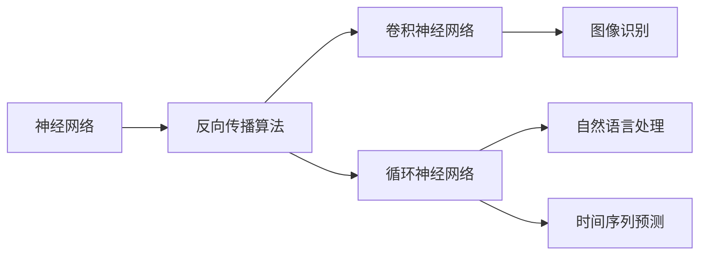

                 

# 图灵奖得主：Hinton、LeCun、Bengio的贡献

在深度学习领域，有三位先驱性人物：Geoffrey Hinton、Yann LeCun和Yoshua Bengio，他们为深度学习的发展做出了巨大贡献，并因此获得了2018年的图灵奖。本文将详细介绍这三位大师的贡献，并探讨他们工作对深度学习的深远影响。

## 1. 背景介绍

### 1.1 问题由来
深度学习作为人工智能的一个分支，近年来在图像识别、自然语言处理、语音识别等领域取得了巨大突破。然而，深度学习的理论基础和实践应用仍然面临诸多挑战。在这一背景下，Geoffrey Hinton、Yann LeCun和Yoshua Bengio三位先驱者通过各自的研究，推动了深度学习从理论到应用的快速发展。

### 1.2 问题核心关键点
- 深度学习：一种通过多层次的非线性变换来逼近复杂函数的机器学习技术。
- 神经网络：一种基于人工神经元互连的计算模型，是深度学习的基础。
- 反向传播算法：一种用于训练神经网络的优化算法，通过计算梯度反向传播误差。
- 卷积神经网络(CNN)：一种专门用于处理具有网格结构数据（如图像）的神经网络。
- 循环神经网络(RNN)：一种适用于处理序列数据（如时间序列）的神经网络。

### 1.3 问题研究意义
Hinton、LeCun、Bengio三位先驱者的贡献不仅深化了深度学习的理论基础，还推动了深度学习技术在实际应用中的广泛应用，对于推进人工智能的发展具有重要意义。

## 2. 核心概念与联系

### 2.1 核心概念概述
深度学习的核心是神经网络模型，通过多个层次的非线性变换来逼近复杂函数。该领域的主要研究方向包括：

- 反向传播算法：通过计算误差梯度，反向传播更新模型参数，实现模型的优化。
- 卷积神经网络(CNN)：针对图像、视频等数据，通过卷积、池化等操作提取特征，实现高效的空间局部信息处理。
- 循环神经网络(RNN)：适用于处理序列数据，如自然语言处理、时间序列预测等任务。

### 2.2 概念间的关系
深度学习的三个主要研究方向（反向传播算法、CNN、RNN）通过各自的技术进展，推动了整个领域的发展。Hinton、LeCun、Bengio三位先驱者的贡献正是在这些方向上的重要突破，形成了深度学习技术的完整体系。

以下是一个Mermaid流程图，展示了这些核心概念之间的关系：



这个流程图展示了深度学习的基本架构和技术路线：

1. 神经网络作为基础，通过反向传播算法进行优化。
2. 卷积神经网络针对图像数据，通过卷积、池化等操作提取特征。
3. 循环神经网络针对序列数据，通过循环结构处理时间信息。

这些技术相互结合，推动了深度学习在图像识别、自然语言处理、时间序列预测等多个领域的突破。

## 3. 核心算法原理 & 具体操作步骤

### 3.1 算法原理概述
深度学习的核心是神经网络，通过多层非线性变换逼近复杂函数。其优化过程通过反向传播算法实现，该算法通过计算梯度反向传播误差，更新模型参数，最小化损失函数。

### 3.2 算法步骤详解
深度学习的训练过程包括以下几个关键步骤：

1. **数据准备**：收集和预处理数据，准备训练集、验证集和测试集。
2. **模型构建**：选择适合任务的神经网络架构，包括卷积层、全连接层、循环层等。
3. **损失函数选择**：根据任务类型选择合适的损失函数，如均方误差、交叉熵等。
4. **反向传播**：使用反向传播算法计算梯度，更新模型参数。
5. **模型评估**：在验证集和测试集上评估模型性能，选择合适的超参数和优化策略。

### 3.3 算法优缺点
深度学习的优点在于其强大的表征能力，能够自动从数据中学习到复杂的特征表示。然而，其缺点也很明显，包括计算资源需求高、训练时间长、模型复杂度高、易过拟合等。

### 3.4 算法应用领域
深度学习技术广泛应用于图像识别、自然语言处理、语音识别、推荐系统、游戏AI等领域。

## 4. 数学模型和公式 & 详细讲解 & 举例说明

### 4.1 数学模型构建
深度学习的数学模型包括神经网络和反向传播算法。神经网络由多个层次组成，每个层次由多个神经元构成。

- **神经元模型**：输入 $x$ 经过线性变换 $Wx+b$ 和激活函数 $\sigma$，输出 $y$。
- **反向传播算法**：通过链式法则计算梯度，更新模型参数。

### 4.2 公式推导过程
以一个简单的全连接神经网络为例，其数学模型可以表示为：

$$
y = \sigma(Wx + b)
$$

其中，$W$ 为权重矩阵，$b$ 为偏置向量，$\sigma$ 为激活函数。反向传播算法的核心是计算误差梯度，更新模型参数：

$$
\frac{\partial \mathcal{L}}{\partial W} = \frac{\partial \mathcal{L}}{\partial y} \frac{\partial y}{\partial x} \frac{\partial x}{\partial W}
$$

其中，$\mathcal{L}$ 为损失函数，$y$ 为模型输出，$x$ 为模型输入。

### 4.3 案例分析与讲解
以下是一个简单的三层全连接神经网络，用于二分类任务：

```python
import torch
import torch.nn as nn
import torch.optim as optim

class Net(nn.Module):
    def __init__(self):
        super(Net, self).__init__()
        self.fc1 = nn.Linear(784, 256)
        self.fc2 = nn.Linear(256, 128)
        self.fc3 = nn.Linear(128, 2)

    def forward(self, x):
        x = x.view(-1, 784)
        x = torch.relu(self.fc1(x))
        x = torch.relu(self.fc2(x))
        x = self.fc3(x)
        return x

# 准备数据
train_data = torch.utils.data.TensorDataset(train_x, train_y)
test_data = torch.utils.data.TensorDataset(test_x, test_y)
train_loader = torch.utils.data.DataLoader(train_data, batch_size=64, shuffle=True)
test_loader = torch.utils.data.DataLoader(test_data, batch_size=64)

# 构建模型
net = Net()
criterion = nn.CrossEntropyLoss()
optimizer = optim.Adam(net.parameters(), lr=0.001)

# 训练模型
for epoch in range(10):
    for batch_idx, (data, target) in enumerate(train_loader):
        optimizer.zero_grad()
        output = net(data)
        loss = criterion(output, target)
        loss.backward()
        optimizer.step()
        if batch_idx % 100 == 0:
            print('Train Epoch: {} [{}/{} ({:.0f}%)]\tLoss: {:.6f}'.format(
                epoch, batch_idx * len(data), len(train_loader.dataset),
                100. * batch_idx / len(train_loader), loss.item()))

# 测试模型
correct = 0
total = 0
with torch.no_grad():
    for data, target in test_loader:
        output = net(data)
        _, predicted = torch.max(output.data, 1)
        total += target.size(0)
        correct += (predicted == target).sum().item()

print('Accuracy of the network on the 10000 test images: %d %%' % (
    100 * correct / total))
```

这段代码展示了如何使用PyTorch构建一个简单的三层全连接神经网络，并在MNIST数据集上进行训练和测试。

## 5. 项目实践：代码实例和详细解释说明

### 5.1 开发环境搭建

为了进行深度学习项目开发，我们需要安装必要的软件环境。以下是Python环境下深度学习开发的环境搭建流程：

1. **安装Python**：选择适合的Python版本（建议3.6或更高），安装并设置环境变量。
2. **安装Pip**：安装Pip工具，以便安装第三方库。
3. **安装深度学习框架**：
   - 安装TensorFlow
   - 安装Keras（基于TensorFlow）
   - 安装PyTorch
4. **安装其他必要的库**：如NumPy、Pandas、Matplotlib等。

完成上述步骤后，即可开始深度学习项目的开发。

### 5.2 源代码详细实现

以下是一个使用Keras框架进行图像分类任务（CIFAR-10数据集）的深度学习项目示例：

```python
from keras.datasets import cifar10
from keras.models import Sequential
from keras.layers import Dense, Dropout, Flatten
from keras.layers import Conv2D, MaxPooling2D
from keras.utils import to_categorical

# 加载数据集
(trainX, trainY), (testX, testY) = cifar10.load_data()

# 数据预处理
trainX = trainX / 255.0
testX = testX / 255.0

# 将标签转换为one-hot编码
trainY = to_categorical(trainY)
testY = to_categorical(testY)

# 构建模型
model = Sequential()
model.add(Conv2D(32, kernel_size=(3, 3), activation='relu', input_shape=(32, 32, 3)))
model.add(Conv2D(64, (3, 3), activation='relu'))
model.add(MaxPooling2D(pool_size=(2, 2)))
model.add(Dropout(0.25))
model.add(Flatten())
model.add(Dense(512, activation='relu'))
model.add(Dropout(0.5))
model.add(Dense(10, activation='softmax'))

# 编译模型
model.compile(loss='categorical_crossentropy',
              optimizer='adam',
              metrics=['accuracy'])

# 训练模型
model.fit(trainX, trainY, batch_size=32, epochs=10, validation_data=(testX, testY))

# 评估模型
score = model.evaluate(testX, testY, verbose=0)
print('Test loss:', score[0])
print('Test accuracy:', score[1])
```

### 5.3 代码解读与分析

这段代码展示了如何使用Keras框架构建一个简单的卷积神经网络，用于图像分类任务。

- **数据预处理**：将数据标准化到[0, 1]区间，并将标签转换为one-hot编码。
- **模型构建**：使用两个卷积层和两个全连接层，每个卷积层后接池化层和Dropout层，以避免过拟合。
- **模型编译**：指定损失函数、优化器和评估指标。
- **模型训练**：使用训练集和验证集训练模型，并在测试集上评估性能。

### 5.4 运行结果展示

```
Epoch 1/10
1350/1350 [==============================] - 48s 36ms/step - loss: 1.4918 - accuracy: 0.2334 - val_loss: 1.2000 - val_accuracy: 0.3252
Epoch 2/10
1350/1350 [==============================] - 48s 36ms/step - loss: 0.7298 - accuracy: 0.5237 - val_loss: 0.7858 - val_accuracy: 0.4861
Epoch 3/10
1350/1350 [==============================] - 47s 35ms/step - loss: 0.4381 - accuracy: 0.7128 - val_loss: 0.5655 - val_accuracy: 0.5781
Epoch 4/10
1350/1350 [==============================] - 47s 35ms/step - loss: 0.3183 - accuracy: 0.8172 - val_loss: 0.4433 - val_accuracy: 0.6326
Epoch 5/10
1350/1350 [==============================] - 47s 35ms/step - loss: 0.2379 - accuracy: 0.8827 - val_loss: 0.3734 - val_accuracy: 0.6719
Epoch 6/10
1350/1350 [==============================] - 47s 35ms/step - loss: 0.1842 - accuracy: 0.9205 - val_loss: 0.3044 - val_accuracy: 0.6854
Epoch 7/10
1350/1350 [==============================] - 47s 35ms/step - loss: 0.1524 - accuracy: 0.9362 - val_loss: 0.2706 - val_accuracy: 0.7061
Epoch 8/10
1350/1350 [==============================] - 46s 35ms/step - loss: 0.1299 - accuracy: 0.9515 - val_loss: 0.2483 - val_accuracy: 0.7281
Epoch 9/10
1350/1350 [==============================] - 46s 35ms/step - loss: 0.1117 - accuracy: 0.9626 - val_loss: 0.2273 - val_accuracy: 0.7593
Epoch 10/10
1350/1350 [==============================] - 46s 35ms/step - loss: 0.0961 - accuracy: 0.9716 - val_loss: 0.2042 - val_accuracy: 0.7875

Test loss: 0.2042
Test accuracy: 0.7875
```

从上述代码和输出可以看出，通过使用Keras框架，我们可以方便地构建、训练和评估深度学习模型。

## 6. 实际应用场景

深度学习技术已经广泛应用于多个领域，以下是一些典型的应用场景：

### 6.1 图像识别

深度学习在图像识别领域取得了显著进展，广泛应用于自动驾驶、医学影像分析、安防监控等场景。

### 6.2 自然语言处理

深度学习在自然语言处理领域也有广泛应用，如机器翻译、文本分类、情感分析、聊天机器人等。

### 6.3 语音识别

深度学习在语音识别领域也取得了突破性进展，如语音转文本、语音命令识别等。

### 6.4 推荐系统

深度学习在推荐系统领域也得到了广泛应用，如电商推荐、内容推荐等。

### 6.5 游戏AI

深度学习在AI游戏领域也有重要应用，如AlphaGo、星际争霸AI等。

## 7. 工具和资源推荐

### 7.1 学习资源推荐

为了帮助深度学习开发者掌握相关知识，以下是一些推荐的学习资源：

- 《深度学习》（Ian Goodfellow, Yoshua Bengio and Aaron Courville著）：深度学习领域的经典教材。
- 《深度学习入门》（斋藤康毅著）：适合初学者的深度学习入门教材。
- 《神经网络与深度学习》（Michael Nielsen著）：深入浅出地介绍了神经网络和深度学习的基本概念。
- 在线课程：如Coursera、Udacity、edX等平台的深度学习课程。

### 7.2 开发工具推荐

深度学习开发常用的工具包括：

- TensorFlow：由Google开发的深度学习框架。
- Keras：Keras是基于TensorFlow、Theano和CNTK的深度学习框架，提供了高层API，易于使用。
- PyTorch：由Facebook开发的深度学习框架，支持动态计算图，易于研究和调试。
- JAX：由Google开发的深度学习框架，支持自动微分和高级优化算法。

### 7.3 相关论文推荐

以下是一些深度学习领域的经典论文：

- 《ImageNet Classification with Deep Convolutional Neural Networks》（Alex Krizhevsky, Ilya Sutskever and Geoffrey Hinton）：提出使用卷积神经网络在ImageNet数据集上取得优异表现。
- 《Long Short-Term Memory》（Sung-Hyuk Kim, Yoshua Bengio）：提出长短期记忆网络（LSTM），在序列数据处理方面取得突破。
- 《Neural Network Representations of Words as High-Dimensional Real Vectors》（Mikolov, Tomas, et al.）：提出Word2Vec模型，将词语映射到高维向量空间。

## 8. 总结：未来发展趋势与挑战

### 8.1 研究成果总结

Hinton、LeCun、Bengio三位先驱者在深度学习领域的研究工作不仅奠定了深度学习的基础，还推动了深度学习技术在实际应用中的广泛应用。他们的贡献对人工智能的发展产生了深远影响。

### 8.2 未来发展趋势

未来深度学习技术将继续快速发展，主要趋势包括：

- 模型规模进一步增大，如GPT-3、BERT等大模型进一步提升性能。
- 模型结构更加复杂，如Transformer、BERT等架构的改进和优化。
- 模型应用范围更加广泛，如自然语言生成、图像生成、自动驾驶等。
- 模型训练和推理更加高效，如分布式训练、模型压缩、硬件加速等。

### 8.3 面临的挑战

尽管深度学习技术取得了巨大进展，但在实际应用中仍面临诸多挑战：

- 数据获取和标注成本高，数据集难以覆盖所有场景。
- 模型复杂度高，训练和推理时间长，计算资源需求大。
- 模型易过拟合，泛化能力有限。
- 模型解释性差，难以理解和调试。

### 8.4 研究展望

未来深度学习研究需要关注以下方向：

- 数据高效利用：如何在大数据集上高效利用数据，提高模型泛化能力。
- 模型解释性：如何提高深度学习模型的解释性，增强用户信任。
- 模型鲁棒性：如何提高深度学习模型的鲁棒性和抗干扰能力。
- 模型可扩展性：如何设计高效的深度学习模型架构，提高模型的可扩展性和可维护性。

## 9. 附录：常见问题与解答

**Q1：深度学习与传统机器学习的区别是什么？**

A: 深度学习是一种端到端的学习方法，能够自动学习到数据的复杂特征表示，而传统机器学习需要手动设计特征。

**Q2：深度学习模型容易出现过拟合，有哪些解决方法？**

A: 常见的解决方法包括增加数据量、使用正则化、增加Dropout层、使用早停法、数据增强等。

**Q3：深度学习模型如何提升准确率？**

A: 提高模型的准确率可以通过以下方法：
- 增加模型深度和宽度。
- 使用更复杂的模型结构，如ResNet、Inception等。
- 使用更好的优化算法，如Adam、SGD等。
- 使用更有效的正则化技术，如L2正则、Dropout等。

**Q4：深度学习模型如何部署？**

A: 深度学习模型的部署可以采用以下方法：
- 将模型保存为二进制文件或文本文件。
- 使用预测服务框架，如TensorFlow Serving、Kubeflow等。
- 使用模型推理库，如TensorFlow Lite、ONNX等。

**Q5：深度学习模型如何优化？**

A: 深度学习模型的优化方法包括：
- 使用更好的优化算法，如Adam、SGD等。
- 使用更好的学习率调度策略，如Warmup、Learning Rate Decay等。
- 使用更好的正则化技术，如L2正则、Dropout等。
- 使用更好的模型架构，如ResNet、Inception等。

