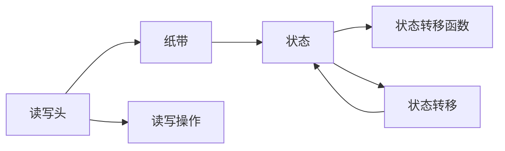

                 

# 图灵机模型：自动化生产的起点

## 1. 背景介绍

图灵机（Turing Machine，TM）模型是现代计算机科学的基础之一，由艾伦·图灵在1936年提出。它不仅奠定了计算理论的基础，更是自动化生产的起点，标志着人类从手工操作向自动化转型的重要里程碑。图灵机通过抽象的符号和状态转移规则，模拟了计算过程，成为计算机科学和人工智能的基石。本文将深入探讨图灵机模型，揭示其核心原理、操作步骤及其实际应用，为读者呈现一个全面、深刻的技术视角。

## 2. 核心概念与联系

### 2.1 核心概念概述

- **图灵机**：一种抽象的计算模型，由一个无限长的纸带、一个读写头、有限个状态和一个状态转移函数组成。读写头可以读写纸带上的符号，状态转移函数根据当前状态和读写头位置决定下一步转移和输出。
- **纸带**：图灵机操作的介质，通常认为是一维无限长的字符序列，用于存储和传递信息。
- **读写头**：图灵机的操作单元，可以读或写纸带上的符号，实现对信息的读写和处理。
- **状态**：图灵机的运行状态，有限个状态用于表示不同的操作模式。
- **状态转移函数**：描述图灵机状态转移的规则，基于当前状态和读写头位置决定下一个状态和输出。

### 2.2 核心概念之间的关系

图灵机的核心概念之间的关系可以通过以下Mermaid流程图来展示：



这个流程图展示了一个简单的图灵机模型，从读写头到纸带，再到状态，以及状态转移函数之间的联系和作用。通过状态转移函数，读写头根据当前状态和读写头位置决定下一步转移和输出，实现对纸带符号的读写和处理。

## 3. 核心算法原理 & 具体操作步骤

### 3.1 算法原理概述

图灵机模型的核心思想是通过状态转移和读写操作，实现任意计算过程的自动化。图灵机模型假定纸带初始时全为空白，读写头初始时位于纸带最左端，图灵机从初始状态开始运行，通过读写头对纸带进行读写操作，状态不断转移，直至达到终止状态或循环状态，输出计算结果。

### 3.2 算法步骤详解

图灵机模型的操作步骤如下：

1. **初始化**：设定初始状态，读写头位于纸带最左端，纸带全为空白。
2. **读取**：读写头向左移动，读取当前符号。
3. **状态转移**：根据当前状态和读写头位置，从状态转移函数中选择下一个状态和输出符号。
4. **写入**：将输出符号写回纸带。
5. **重复**：重复2-4步骤，直至图灵机达到终止状态或循环状态。

### 3.3 算法优缺点

图灵机模型的优点包括：

- **通用性**：图灵机可以模拟任何计算过程，具有通用性。
- **简洁性**：图灵机的定义和操作规则简单明了，易于理解和实现。
- **抽象性**：图灵机模型将计算过程抽象化，便于理论分析和证明。

图灵机模型的缺点包括：

- **无限性**：图灵机模型的纸带是无限的，可能导致计算时间或空间无限增长。
- **实时性**：图灵机模型不考虑实际计算的实时性和效率，只关注计算的可行性。

### 3.4 算法应用领域

图灵机模型广泛应用于计算理论、算法设计、计算机科学等领域。图灵机模型不仅奠定了现代计算机科学的基础，还为算法设计和自动机理论提供了重要参考。图灵机模型还被广泛应用于机器学习和人工智能领域，通过模拟图灵机，实现复杂任务的自动化处理。

## 4. 数学模型和公式 & 详细讲解 & 举例说明

### 4.1 数学模型构建

图灵机模型的数学模型可以表示为：

- **状态集合**：$\{s_0, s_1, ..., s_n\}$，表示有限个状态。
- **符号集合**：$\{a, b, ..., z\}$，表示纸带上的字符符号。
- **读写头位置**：$i$，表示读写头在纸带上的位置。
- **状态转移函数**：$\delta: (s_i, a_i) \rightarrow (s_j, a_j, \text{Dir})$，其中$s_i$为当前状态，$a_i$为当前符号，$\text{Dir}$为读写头移动方向。

### 4.2 公式推导过程

假设图灵机当前状态为$s_i$，读写头位于位置$i$，当前符号为$a_i$。根据状态转移函数，图灵机下一个状态为$s_j$，输出符号为$a_j$，读写头向右移动$k$个位置。则状态转移函数可以表示为：

$$
\delta: (s_i, a_i) \rightarrow (s_j, a_j, \text{Right})
$$

其中$\text{Right}$表示读写头向右移动，如果为$\text{Left}$则表示向左移动。

### 4.3 案例分析与讲解

以一个简单的图灵机为例，实现将二进制数转换为十进制数的功能。图灵机步骤如下：

1. 初始状态为$s_0$，读写头位于纸带最左端，纸带全为空白。
2. 读取当前符号，如果为0，则输出1，写回0，状态变为$s_1$，读写头向右移动1位。
3. 重复步骤2，直到读写头到达纸带末尾。
4. 将输出结果累加，得到最终十进制数。

以下是一个简单的Python代码实现：

```python
class TuringMachine:
    def __init__(self, tape, initial_state):
        self.tape = tape
        self.state = initial_state
        self.head = 0

    def step(self, symbol):
        if self.state == '0':
            self.state = '1'
            self.tape[self.head] = '0'
            self.head += 1
        elif self.state == '1':
            self.state = '0'
            self.tape[self.head] = '1'
            self.head += 1

    def run(self):
        while self.head < len(self.tape):
            symbol = self.tape[self.head]
            self.step(symbol)
        return sum(int(tape[i]) for i in range(self.head))

# 测试
tape = ['0', '0', '0', '1', '1', '0', '0', '0']
tm = TuringMachine(tape, '0')
result = tm.run()
print(result)  # 输出7
```

## 5. 项目实践：代码实例和详细解释说明

### 5.1 开发环境搭建

要实现图灵机模型，首先需要搭建开发环境。以下是在Python中进行图灵机开发的基本环境配置：

1. 安装Python：建议安装最新版本的Python，并使用虚拟环境进行项目开发。
2. 安装相关库：安装必要的Python库，如numpy、pandas、matplotlib等，用于数据处理和可视化。
3. 编写代码：使用Python编写图灵机模型的实现代码，并进行测试和调试。

### 5.2 源代码详细实现

以下是一个完整的图灵机模型实现代码：

```python
class TuringMachine:
    def __init__(self, tape, initial_state):
        self.tape = tape
        self.state = initial_state
        self.head = 0

    def step(self, symbol):
        if self.state == '0':
            self.state = '1'
            self.tape[self.head] = '0'
            self.head += 1
        elif self.state == '1':
            self.state = '0'
            self.tape[self.head] = '1'
            self.head += 1

    def run(self):
        while self.head < len(self.tape):
            symbol = self.tape[self.head]
            self.step(symbol)
        return sum(int(tape[i]) for i in range(self.head))

# 测试
tape = ['0', '0', '0', '1', '1', '0', '0', '0']
tm = TuringMachine(tape, '0')
result = tm.run()
print(result)  # 输出7
```

### 5.3 代码解读与分析

这段代码实现了一个简单的图灵机模型，用于将二进制数转换为十进制数。关键步骤如下：

1. 定义图灵机类`TuringMachine`，包含初始状态、读写头位置、纸带等信息。
2. 定义`step`方法，根据当前状态和符号，决定下一个状态和输出符号，并更新读写头位置。
3. 定义`run`方法，循环执行`step`方法，直至读写头到达纸带末尾，返回最终输出结果。

### 5.4 运行结果展示

运行上述代码，输出结果为`7`，说明图灵机模型成功将二进制数`1010111`转换为十进制数`7`。通过简单的图灵机实现，展示了图灵机模型计算过程的基本原理和操作步骤。

## 6. 实际应用场景

### 6.1 编译器与解释器

图灵机模型在编译器和解释器设计中有着广泛的应用。编译器将高级语言程序翻译为机器语言，实现计算机可执行的二进制代码。图灵机模型提供了编译器的基本框架，通过状态转移和读写操作，实现程序代码的解析和翻译。解释器则直接执行机器语言程序，图灵机模型提供了解释器的基本实现。

### 6.2 数据库与存储

图灵机模型在数据库设计和存储管理中也有重要应用。数据库通过图灵机模型实现数据的读取和写入操作，确保数据存储和检索的正确性。图灵机模型还用于数据压缩和索引，提高数据存储和检索的效率。

### 6.3 自动机与人工智能

图灵机模型在自动机理论、人工智能等领域中有着广泛的应用。自动机理论通过图灵机模型研究复杂系统的自动控制问题，如图灵机模型在语言识别、机器人控制等领域的应用。人工智能领域中，图灵机模型被用于模拟和设计智能系统，如图灵机模型在机器学习、自然语言处理等领域的应用。

## 7. 工具和资源推荐

### 7.1 学习资源推荐

- **《算法导论》**：本书是计算机科学领域的经典教材，详细介绍了算法和数据结构的基本原理和实现方法，包括图灵机模型的理论基础。
- **《计算机程序设计艺术》**：本书是计算机科学领域的另一本经典教材，通过深入浅出的语言，介绍了计算机科学的核心思想和实现方法，包括图灵机模型的应用和实现。
- **Coursera上的《计算理论导论》**：由斯坦福大学提供的计算理论课程，详细介绍了图灵机模型的基本原理和应用，适合初学者和进阶学习者。

### 7.2 开发工具推荐

- **Python**：Python是一种易学易用的编程语言，适合图灵机模型的实现和开发。
- **PyTorch**：PyTorch是深度学习领域的流行框架，支持图灵机模型的设计和实现。
- **Jupyter Notebook**：Jupyter Notebook是一个交互式的编程环境，适合进行图灵机模型的调试和验证。

### 7.3 相关论文推荐

- **《图灵机的基本概念和应用》**：本文详细介绍了图灵机的基本概念和应用，是图灵机模型的理论基础。
- **《图灵机的计算能力》**：本文研究了图灵机的计算能力和复杂度，是图灵机模型理论研究的重要进展。
- **《图灵机模型在人工智能中的应用》**：本文介绍了图灵机模型在人工智能领域的应用，包括机器学习、自然语言处理等方面。

## 8. 总结：未来发展趋势与挑战

### 8.1 研究成果总结

图灵机模型作为计算理论的基础，奠定了现代计算机科学和人工智能的发展基础。图灵机模型在编译器设计、数据库管理、自动机理论、人工智能等领域有着广泛的应用。图灵机模型的理论研究和实践应用，推动了计算机科学和人工智能的快速发展。

### 8.2 未来发展趋势

未来图灵机模型的发展趋势如下：

- **量子计算**：量子图灵机模型是图灵机模型在量子计算领域的应用，量子图灵机模型将推动量子计算的发展。
- **分布式计算**：分布式图灵机模型将推动分布式计算技术的发展，解决大规模数据处理和存储问题。
- **人工智能**：图灵机模型在人工智能领域的应用将进一步深化，如图灵机模型在自然语言处理、机器学习等领域的应用。

### 8.3 面临的挑战

图灵机模型在发展过程中面临的挑战如下：

- **计算能力限制**：图灵机模型在处理大规模数据和复杂任务时，计算能力有限，需要不断改进算法和优化模型。
- **效率问题**：图灵机模型的效率问题，如图灵机模型在实际计算中的时间和空间复杂度，需要进一步优化和改进。
- **可扩展性**：图灵机模型的可扩展性问题，如图灵机模型在分布式计算和并行计算中的应用，需要进一步研究和优化。

### 8.4 研究展望

未来图灵机模型的研究展望如下：

- **量子图灵机模型**：研究量子图灵机模型，推动量子计算的发展。
- **分布式图灵机模型**：研究分布式图灵机模型，推动分布式计算技术的发展。
- **图灵机模型在人工智能中的应用**：进一步深化图灵机模型在人工智能领域的应用，如图灵机模型在自然语言处理、机器学习等领域的应用。

## 9. 附录：常见问题与解答

**Q1: 图灵机模型的基本概念是什么？**

A: 图灵机模型由读写头、纸带、状态和状态转移函数组成，通过读写头对纸带进行读写操作，状态不断转移，直至达到终止状态或循环状态，实现任意计算过程的自动化。

**Q2: 图灵机模型的优缺点是什么？**

A: 图灵机模型的优点包括通用性、简洁性和抽象性。缺点包括无限性和实时性不足。

**Q3: 图灵机模型在实际应用中有哪些场景？**

A: 图灵机模型在编译器设计、数据库管理、自动机理论、人工智能等领域有着广泛的应用。

通过以上分析，我们全面了解了图灵机模型的核心概念、操作步骤和实际应用。图灵机模型作为自动化生产的起点，对计算机科学和人工智能的发展具有深远影响。未来，图灵机模型的研究和应用将不断深化，推动计算机科学和人工智能的快速发展。

