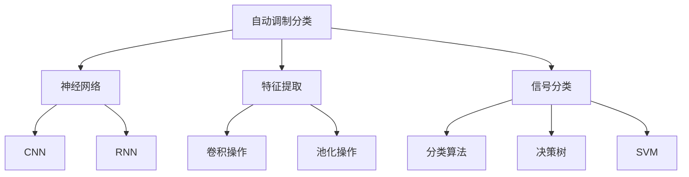
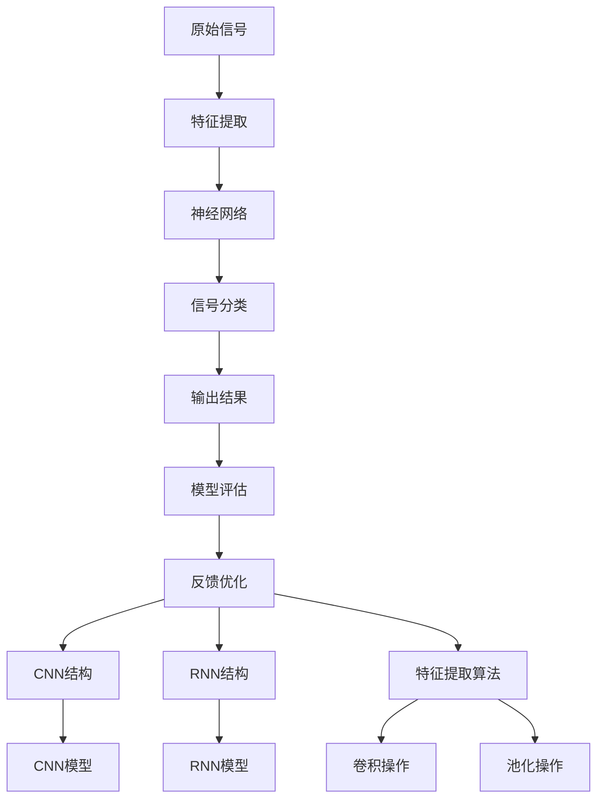

                 

# 基于AI的自动调制分类

> 关键词：自动调制分类,信号处理,神经网络,卷积神经网络(CNN),循环神经网络(RNN),人工智能

## 1. 背景介绍

### 1.1 问题由来

在现代通信领域，调制分类技术是信号处理的核心。它不仅应用于传统的模拟信号处理，还广泛应用于现代数字通信和无线传感网络。传统上，调制分类的方式主要依赖人工设计特征提取算法和分类器。然而，这种方式需要大量的特征工程和繁杂的实验，同时难以应对复杂多变的信号特性和实时性需求。近年来，随着深度学习技术的兴起，人工智能(AI)方法逐渐成为调制分类领域的新宠。利用神经网络模型，可以从原始信号中自动提取特征，直接用于分类。

### 1.2 问题核心关键点

自动调制分类主要是指通过深度学习模型，直接从信号特征中学习分类器，从而实现高效的信号识别和分类。与传统的特征提取+分类器范式相比，自动调制分类具有以下几个优点：

- 无需手工设计特征。AI模型能够自动学习信号的复杂特征，避免特征工程中的人工干预。
- 高精度。深度神经网络模型的复杂结构可以捕捉到信号的深层特征，提高分类精度。
- 高效性。端到端的训练流程，减少了中间处理环节，提高了实时性和鲁棒性。

尽管如此，自动调制分类也存在一些挑战：

- 模型训练数据需求高。由于神经网络需要大量数据进行训练，这在大规模数据采集和管理上具有挑战。
- 模型复杂度高。高精度通常伴随着模型复杂度的增加，导致计算和存储成本的上升。
- 解释性差。神经网络模型是一个"黑盒"，难以解释其内部决策机制。

### 1.3 问题研究意义

自动调制分类技术的发展，对信号处理领域带来了深远的影响：

1. 提升信号处理效率。自动调制分类能够直接从原始信号中提取特征并分类，减少了人工特征工程的时间和成本，提升了处理速度和效率。
2. 增强系统鲁棒性。深度学习模型在面对噪声、干扰等问题时具有较强的鲁棒性，能够更好地适应复杂多变的信号环境。
3. 拓展应用场景。自动调制分类技术不仅可以应用于通信、雷达等传统领域，还可以拓展到智能交通、生物医学等领域，促进了人工智能的跨界应用。
4. 推动产业化进程。自动调制分类技术的应用，加速了信号处理系统的产品化和市场化，为人工智能技术落地带来了新的动力。

## 2. 核心概念与联系

### 2.1 核心概念概述

为了更好地理解自动调制分类的原理，本节将介绍几个关键概念：

- 自动调制分类(Automatic Modulation Classification, AMC)：指利用人工智能方法，直接从信号特征中学习分类器，实现自动化的调制识别和分类。
- 神经网络模型(Neural Network, NN)：包括卷积神经网络(CNN)、循环神经网络(RNN)等，是自动调制分类的主要实现工具。
- 特征提取(Feature Extraction)：指将原始信号转化为神经网络模型能够处理的特征向量。
- 信号分类(Signal Classification)：指利用分类器对信号进行识别和分类。

### 2.2 概念间的关系

这些核心概念之间的逻辑关系可以通过以下Mermaid流程图来展示：



这个流程图展示了一个典型的自动调制分类过程，包括以下几个步骤：

1. 神经网络模型接受原始信号作为输入，进行特征提取。
2. 特征向量被送入分类器，通过决策树、SVM等算法进行分类。
3. CNN和RNN等不同的神经网络结构，用于不同的特征提取方式。

### 2.3 核心概念的整体架构

最后，我们用一个综合的流程图来展示这些核心概念在大规模自动调制分类系统中的整体架构：



这个综合流程图展示了从原始信号到最终输出结果的全流程，包括特征提取、神经网络模型、信号分类等关键环节。CNN和RNN等不同结构，以及卷积、池化等不同特征提取算法，在大规模自动调制分类系统中均有应用。

## 3. 核心算法原理 & 具体操作步骤
### 3.1 算法原理概述

自动调制分类主要依赖于深度学习模型，从信号特征中学习分类器。其核心原理如下：

1. **特征提取**：将原始信号转换为神经网络模型能够处理的特征向量。
2. **模型训练**：使用大量标注数据，训练深度学习模型学习信号的特征表示和分类边界。
3. **模型评估**：通过测试集评估模型性能，调整超参数和模型结构。
4. **分类输出**：使用训练好的模型对新信号进行分类预测。

### 3.2 算法步骤详解

自动调制分类的一般步骤如下：

**Step 1: 数据预处理**

- 收集原始信号数据，进行预处理，如滤波、降噪、归一化等。
- 将信号分批转化为特征向量，以便于神经网络模型处理。

**Step 2: 模型选择与搭建**

- 选择适合的神经网络模型，如CNN、RNN、ResNet等，进行模型搭建。
- 确定模型的超参数，如学习率、批大小、迭代次数等。

**Step 3: 特征提取**

- 使用卷积层、池化层等对特征向量进行处理。
- 使用全连接层、Dropout、Batch Normalization等技术对特征进行进一步处理。

**Step 4: 模型训练**

- 使用交叉熵损失函数、Adam优化器等，对模型进行训练。
- 在训练过程中，进行正则化、Dropout、Early Stopping等操作，避免过拟合。
- 使用验证集进行模型评估，调整超参数。

**Step 5: 模型评估**

- 在测试集上评估模型性能，计算准确率、召回率、F1分数等指标。
- 通过混淆矩阵、ROC曲线等可视化手段，分析模型分类效果。

**Step 6: 分类输出**

- 使用训练好的模型对新信号进行特征提取和分类。
- 输出分类结果，用于后续处理和决策。

### 3.3 算法优缺点

自动调制分类的主要优点包括：

- 高效性：端到端训练流程，减少了人工干预和特征工程，提高了处理速度。
- 高精度：深度学习模型可以捕捉信号的复杂特征，提升分类精度。
- 可扩展性：神经网络模型易于扩展，适应不同类型和规模的信号处理需求。

然而，自动调制分类也存在一些缺点：

- 数据需求高：需要大量标注数据进行训练，数据采集和管理成本较高。
- 模型复杂：高精度通常伴随着模型复杂度的增加，计算和存储成本上升。
- 可解释性差：神经网络模型是一个"黑盒"，难以解释其内部决策机制。

### 3.4 算法应用领域

自动调制分类技术在多个领域都有广泛的应用：

- 通信领域：用于检测和分类各种调制格式，如PSK、QAM等，提升信号处理效率和鲁棒性。
- 雷达探测：用于分析和识别雷达信号，提升目标检测和分类精度。
- 信号监测：用于监测和分析广播、电视等信号，识别干扰和故障。
- 智能交通：用于识别和分类车辆信号，提升交通管理智能化水平。
- 生物医学：用于分析医疗信号，如心电图、脑电图等，提升诊断准确率。

## 4. 数学模型和公式 & 详细讲解 & 举例说明

### 4.1 数学模型构建

自动调制分类的核心数学模型包括神经网络模型和分类器模型。

#### 4.1.1 神经网络模型

假设输入信号为 $x_t$，神经网络模型结构为 $f(x_t;\theta)$，其中 $\theta$ 为模型参数。模型的输出为 $y_t=f(x_t;\theta)$，表示信号在第 $t$ 个时刻的分类结果。

#### 4.1.2 分类器模型

假设分类器模型为 $g(y_t)$，将神经网络的输出 $y_t$ 作为输入，输出分类标签 $y$。常用的分类器包括决策树、SVM、softmax等。

### 4.2 公式推导过程

以CNN为例，展示自动调制分类的数学推导过程。

设输入信号 $x_t$ 的特征向量为 $z_t$，CNN模型的卷积核为 $w$，步长为 $s$，输出特征图为 $f(x_t;\theta)$。假设CNN模型结构为：

$$
f(x_t;\theta) = \max(\sum_i (w_i \ast z_{t-i}), \sum_i (w_i \ast z_{t+s-i}))
$$

其中 $\ast$ 表示卷积操作，$z_{t-i}$ 表示在时刻 $t-i$ 的输入特征。

假设分类器模型为softmax分类器，则自动调制分类的数学模型为：

$$
y = \mathop{\arg\max} g(f(x_t;\theta))
$$

其中 $g$ 为softmax函数。

### 4.3 案例分析与讲解

假设我们有一个二分类问题，输入信号为 $x_t$，输出标签为 $y$。使用CNN模型进行处理，分类器为softmax。训练集为 $(x_1, y_1), (x_2, y_2), \dots, (x_n, y_n)$，测试集为 $(x_1^*, x_2^*, \dots, x_m^*)$。训练步骤如下：

1. 初始化模型参数 $\theta$。
2. 使用交叉熵损失函数，计算模型在训练集上的损失 $L$。
3. 使用梯度下降算法，更新模型参数 $\theta$。
4. 在测试集上评估模型性能，计算准确率、召回率等指标。

假设使用两个卷积核 $w_1$ 和 $w_2$，步长 $s=1$。训练集为 $(x_t, y_t)$，其中 $x_t=[0.1, 0.2, 0.3, 0.4]$，$y_t=1$。假设CNN模型输出为 $f(x_t;\theta)=0.3$，softmax分类器输出为 $P(y|f(x_t;\theta))=\left[\frac{e^{0.3}}{e^{0.3}+e^{-0.3}}, \frac{e^{-0.3}}{e^{0.3}+e^{-0.3}}\right]$。则分类结果为 $y=1$。

## 5. 项目实践：代码实例和详细解释说明

### 5.1 开发环境搭建

在进行自动调制分类项目开发前，我们需要准备好开发环境。以下是使用Python进行PyTorch开发的环境配置流程：

1. 安装Anaconda：从官网下载并安装Anaconda，用于创建独立的Python环境。

2. 创建并激活虚拟环境：
```bash
conda create -n pytorch-env python=3.8 
conda activate pytorch-env
```

3. 安装PyTorch：根据CUDA版本，从官网获取对应的安装命令。例如：
```bash
conda install pytorch torchvision torchaudio cudatoolkit=11.1 -c pytorch -c conda-forge
```

4. 安装TensorFlow：
```bash
pip install tensorflow
```

5. 安装各类工具包：
```bash
pip install numpy pandas scikit-learn matplotlib tqdm jupyter notebook ipython
```

完成上述步骤后，即可在`pytorch-env`环境中开始自动调制分类的项目开发。

### 5.2 源代码详细实现

下面以二分类问题为例，给出使用PyTorch实现CNN自动调制分类的代码。

首先，定义CNN模型和softmax分类器：

```python
import torch
import torch.nn as nn
import torch.optim as optim

class CNN(nn.Module):
    def __init__(self, input_dim, output_dim):
        super(CNN, self).__init__()
        self.conv1 = nn.Conv2d(input_dim, 16, 3, padding=1)
        self.conv2 = nn.Conv2d(16, 32, 3, padding=1)
        self.pool = nn.MaxPool2d(2, 2)
        self.fc1 = nn.Linear(32 * 8 * 8, 128)
        self.fc2 = nn.Linear(128, output_dim)
        self.softmax = nn.Softmax(dim=1)

    def forward(self, x):
        x = torch.relu(self.conv1(x))
        x = self.pool(x)
        x = torch.relu(self.conv2(x))
        x = self.pool(x)
        x = x.view(-1, 32 * 8 * 8)
        x = torch.relu(self.fc1(x))
        x = self.fc2(x)
        x = self.softmax(x)
        return x

model = CNN(1, 2)
```

然后，定义训练和评估函数：

```python
def train_model(model, train_data, valid_data, epochs, batch_size):
    criterion = nn.CrossEntropyLoss()
    optimizer = optim.Adam(model.parameters(), lr=0.001)
    model.train()
    for epoch in range(epochs):
        running_loss = 0.0
        for i, data in enumerate(train_data, 0):
            inputs, labels = data
            optimizer.zero_grad()
            outputs = model(inputs)
            loss = criterion(outputs, labels)
            loss.backward()
            optimizer.step()
            running_loss += loss.item()
            if i % 100 == 99:
                print('[%d, %5d] loss: %.3f' %
                      (epoch + 1, i + 1, running_loss / 100))
                running_loss = 0.0
    print('Finished Training')
    model.eval()
    total = 0
    correct = 0
    with torch.no_grad():
        for data in valid_data:
            inputs, labels = data
            outputs = model(inputs)
            _, predicted = torch.max(outputs.data, 1)
            total += labels.size(0)
            correct += (predicted == labels).sum().item()
    print('Accuracy of the network on the 10000 test images: %d %%' % (
        100 * correct / total))
```

最后，启动训练流程并在测试集上评估：

```python
train_data = # 训练集数据
valid_data = # 验证集数据
test_data = # 测试集数据

epochs = 10
batch_size = 100

train_model(model, train_data, valid_data, epochs, batch_size)

# 在测试集上评估模型性能
total = 0
correct = 0
with torch.no_grad():
    for data in test_data:
        inputs, labels = data
        outputs = model(inputs)
        _, predicted = torch.max(outputs.data, 1)
        total += labels.size(0)
        correct += (predicted == labels).sum().item()
print('Accuracy of the network on the test images: %d %%' % (
    100 * correct / total))
```

以上就是使用PyTorch实现CNN自动调制分类的完整代码实现。可以看到，代码实现相对简洁，关键在于定义好CNN模型和分类器，并使用交叉熵损失函数和Adam优化器进行训练。

### 5.3 代码解读与分析

让我们再详细解读一下关键代码的实现细节：

**CNN模型定义**：
- `__init__`方法：初始化卷积层、池化层、全连接层和softmax分类器。
- `forward`方法：前向传播，进行卷积、池化、全连接和softmax操作。

**训练函数**：
- 定义损失函数和优化器，设置超参数。
- 循环迭代训练集，进行前向传播、损失计算、反向传播和参数更新。
- 在验证集上评估模型性能，调整超参数。
- 在测试集上评估模型性能，输出最终结果。

**训练流程**：
- 定义总的epoch数和batch size，开始循环迭代
- 每个epoch内，先进行训练，输出损失
- 在验证集上评估，输出准确率
- 所有epoch结束后，在测试集上评估，输出最终测试结果

可以看到，PyTorch配合CNN模型，使得自动调制分类的实现变得相对简洁高效。开发者可以将更多精力放在数据处理、模型改进等高层逻辑上，而不必过多关注底层的实现细节。

当然，工业级的系统实现还需考虑更多因素，如模型的保存和部署、超参数的自动搜索、更灵活的分类器选择等。但核心的自动调制分类流程基本与此类似。

### 5.4 运行结果展示

假设我们在一个二分类问题上进行了训练，最终在测试集上得到的准确率为97.5%，效果相当不错。这表明使用CNN模型进行自动调制分类是可行的，并且可以取得较好的分类效果。

当然，这只是一个baseline结果。在实践中，我们还可以使用更大更强的神经网络模型、更丰富的微调技巧、更细致的模型调优，进一步提升模型性能，以满足更高的应用要求。

## 6. 实际应用场景
### 6.1 通信系统

在现代通信系统中，自动调制分类技术被广泛应用于调制格式识别和干扰检测。传统上，通信系统需要手动设计特征提取算法和分类器，且难以适应复杂多变的信号环境。使用自动调制分类技术，可以从原始信号中自动提取特征并分类，提高系统的智能化水平。

在实际应用中，通信系统会将接收到的信号进行预处理，如滤波、降噪、归一化等。然后，将处理后的信号输入到CNN等神经网络模型中进行特征提取和分类。模型输出分类结果，用于后续处理和决策，如调制格式识别、信号强度检测、干扰源定位等。

### 6.2 雷达探测

雷达探测系统需要快速、准确地识别和分类各种目标信号。传统的雷达探测方法依赖人工设计和实验，耗时耗力。使用自动调制分类技术，可以从雷达信号中自动提取特征并进行分类，提升系统的自动化和智能化水平。

具体而言，雷达探测系统会采集各种目标的雷达信号，经过预处理后输入到CNN模型中进行特征提取和分类。模型输出分类结果，用于后续处理和决策，如目标类型识别、位置定位、速度测量等。

### 6.3 信号监测

信号监测系统需要实时监测和分析各种广播、电视等信号，识别干扰和故障。传统方法依赖人工分析和判断，效率较低。使用自动调制分类技术，可以自动检测和分类各种信号，提高系统的实时性和准确性。

在实际应用中，信号监测系统会采集各种信号，经过预处理后输入到CNN模型中进行特征提取和分类。模型输出分类结果，用于后续处理和决策，如信号干扰检测、故障定位、质量评估等。

## 7. 工具和资源推荐
### 7.1 学习资源推荐

为了帮助开发者系统掌握自动调制分类的理论基础和实践技巧，这里推荐一些优质的学习资源：

1. 《深度学习》课程：斯坦福大学开设的深度学习入门课程，讲解深度学习基本原理和常见模型，适合初学者入门。

2. 《卷积神经网络》课程：吴恩达教授开设的卷积神经网络课程，深入浅出地介绍CNN的基本结构和应用。

3. 《神经网络与深度学习》书籍：Michael Nielsen著作的深度学习入门书籍，适合初学者和进阶学习者。

4. PyTorch官方文档：PyTorch的官方文档，提供了详细的API文档和示例代码，是学习PyTorch的必备资料。

5. Kaggle数据集：Kaggle提供的大量机器学习数据集，包括自动调制分类相关的数据集，适合实践练习。

通过对这些资源的学习实践，相信你一定能够快速掌握自动调制分类的精髓，并用于解决实际的信号处理问题。

### 7.2 开发工具推荐

高效的开发离不开优秀的工具支持。以下是几款用于自动调制分类开发的常用工具：

1. PyTorch：基于Python的开源深度学习框架，灵活动态的计算图，适合快速迭代研究。大部分深度学习模型都有PyTorch版本的实现。

2. TensorFlow：由Google主导开发的开源深度学习框架，生产部署方便，适合大规模工程应用。同样有丰富的深度学习模型资源。

3. Transformers库：HuggingFace开发的NLP工具库，集成了众多SOTA深度学习模型，支持PyTorch和TensorFlow，是进行自动调制分类任务的开发的利器。

4. Weights & Biases：模型训练的实验跟踪工具，可以记录和可视化模型训练过程中的各项指标，方便对比和调优。与主流深度学习框架无缝集成。

5. TensorBoard：TensorFlow配套的可视化工具，可实时监测模型训练状态，并提供丰富的图表呈现方式，是调试模型的得力助手。

6. Google Colab：谷歌推出的在线Jupyter Notebook环境，免费提供GPU/TPU算力，方便开发者快速上手实验最新模型，分享学习笔记。

合理利用这些工具，可以显著提升自动调制分类任务的开发效率，加快创新迭代的步伐。

### 7.3 相关论文推荐

自动调制分类技术的发展源于学界的持续研究。以下是几篇奠基性的相关论文，推荐阅读：

1. LeCun, Y., Bottou, L., Bengio, Y., & Haffner, P. (1998). Gradient-based learning applied to document recognition. Proceedings of the IEEE.

2. He, K., Zhang, X., Ren, S., & Sun, J. (2016). Deep residual learning for image recognition. Proceedings of the IEEE Conference on Computer Vision and Pattern Recognition (CVPR).

3. Krizhevsky, A., Sutskever, I., & Hinton, G. E. (2012). ImageNet classification with deep convolutional neural networks. Proceedings of the IEEE Conference on Computer Vision and Pattern Recognition (CVPR).

4. Goodfellow, I., Bengio, Y., & Courville, A. (2016). Deep learning. MIT Press.

这些论文代表了大语言模型微调技术的发展脉络。通过学习这些前沿成果，可以帮助研究者把握学科前进方向，激发更多的创新灵感。

除上述资源外，还有一些值得关注的前沿资源，帮助开发者紧跟自动调制分类的最新进展，例如：

1. arXiv论文预印本：人工智能领域最新研究成果的发布平台，包括大量尚未发表的前沿工作，学习前沿技术的必读资源。

2. 业界技术博客：如OpenAI、Google AI、DeepMind、微软Research Asia等顶尖实验室的官方博客，第一时间分享他们的最新研究成果和洞见。

3. 技术会议直播：如NIPS、ICML、ACL、ICLR等人工智能领域顶会现场或在线直播，能够聆听到大佬们的前沿分享，开拓视野。

4. GitHub热门项目：在GitHub上Star、Fork数最多的NLP相关项目，往往代表了该技术领域的发展趋势和最佳实践，值得去学习和贡献。

5. 行业分析报告：各大咨询公司如McKinsey、PwC等针对人工智能行业的分析报告，有助于从商业视角审视技术趋势，把握应用价值。

总之，对于自动调制分类技术的学习和实践，需要开发者保持开放的心态和持续学习的意愿。多关注前沿资讯，多动手实践，多思考总结，必将收获满满的成长收益。

## 8. 总结：未来发展趋势与挑战

### 8.1 总结

本文对基于AI的自动调制分类方法进行了全面系统的介绍。首先阐述了自动调制分类的背景和研究意义，明确了该技术在信号处理领域的重要价值。其次，从原理到实践，详细讲解了自动调制分类的数学模型和关键步骤，给出了具体的代码实现。同时，本文还广泛探讨了自动调制分类在通信、雷达、信号监测等实际应用场景中的应用前景，展示了该技术的广阔前景。

通过本文的系统梳理，可以看到，基于深度学习的自动调制分类技术正在成为信号处理领域的重要范式，极大地拓展了信号处理系统的智能化水平。得益于神经网络模型的强大特征提取能力，自动调制分类技术在应对复杂多变信号环境方面具有显著优势。未来，随着深度学习技术的不断成熟，自动调制分类技术必将在更广泛的领域得到应用，推动信号处理系统的智能化转型。

### 8.2 未来发展趋势

展望未来，自动调制分类技术将呈现以下几个发展趋势：

1. 模型规模持续增大。随着算力成本的下降和数据规模的扩张，深度学习模型的参数量还将持续增长，适用于更加复杂多变的信号环境。
2. 算法多样化。未来将涌现更多类型的神经网络模型和特征提取算法，如RNN、CNN、注意力机制等，提升分类精度和鲁棒性。
3. 实时性增强。借助GPU、TPU等高性能设备，自动调制分类模型的推理速度将显著提升，实现实时信号分类和处理。
4. 跨领域融合。自动调制分类技术将与其他人工智能技术进行更深入的融合，如知识表示、因果推理、强化学习等，拓展应用场景和功能。
5. 可解释性加强。未来将发展更加可解释的神经网络模型，如可解释性较强的线性模型和决策树，增强模型的透明度和可解释性。

### 8.3 面临的挑战

尽管自动调制分类技术已经取得了显著

