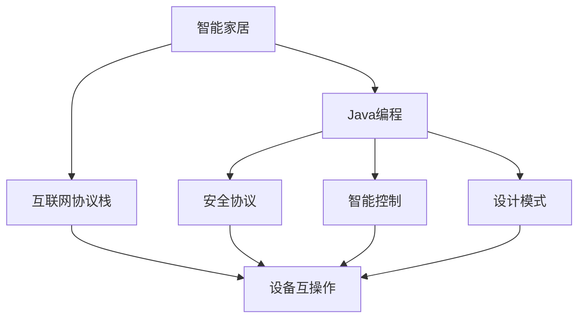
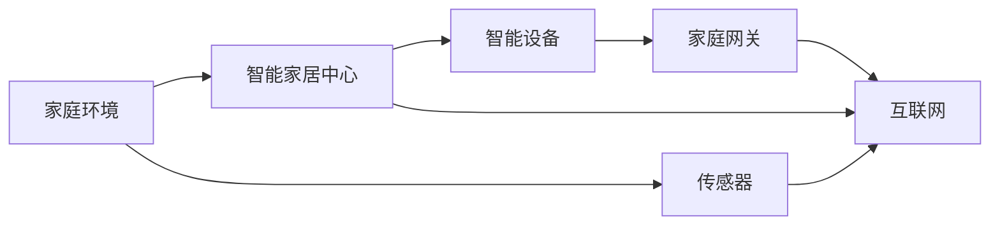
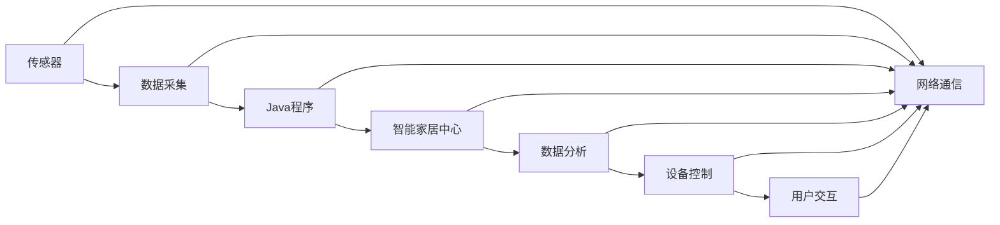
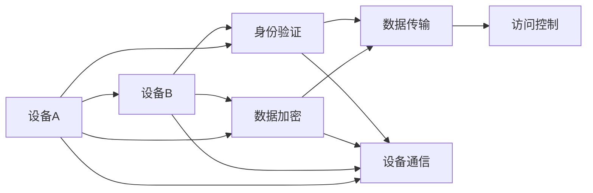
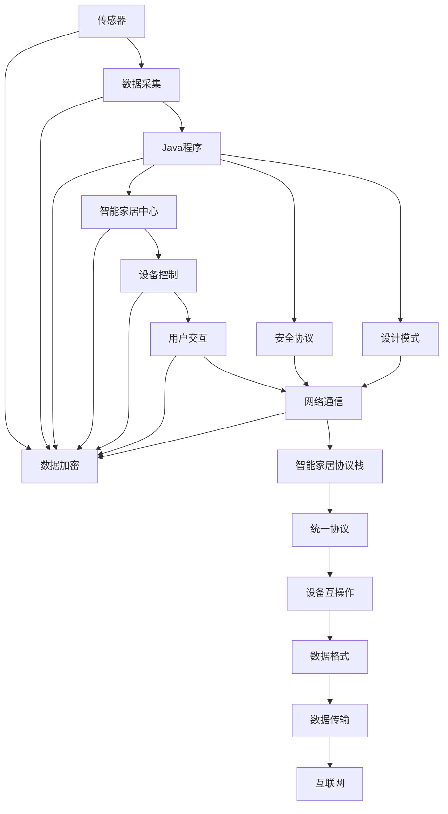

                 

# 基于Java的智能家居设计：征服智能家居的互联网协议栈-从Java视角

> 关键词：智能家居,互联网协议栈,Java编程,设备互操作,安全协议,智能控制,设计模式

## 1. 背景介绍

### 1.1 问题由来
随着物联网技术的不断发展，智能家居系统已不再是一个科幻的概念，而是逐渐走进普通家庭。智能家居系统通过连接各种智能设备和传感器，实现了家电控制、环境监控、安全预警等功能，提升了家庭生活的便利性和舒适性。然而，由于缺乏统一的设备和通信标准，当前智能家居系统往往呈现出异构、互联性差、用户体验不佳等问题。

在此背景下，亟需一种可行的技术方案，整合不同品牌的智能设备，实现设备间的无缝互操作，为用户提供统一的智能控制体验。本文旨在探讨基于Java技术的智能家居设计，以期通过Java的强大编程能力和标准化的协议栈，构建一个可扩展、安全、稳定、易用的智能家居系统。

### 1.2 问题核心关键点
本文将围绕以下核心问题展开：

1. **如何设计一个统一的智能家居协议栈？**  
   需要确定设备间的通信协议、数据格式和传输方式，以实现设备的互操作。

2. **如何保证系统的安全性？**  
   需要在协议栈中加入身份验证、数据加密和访问控制等机制，确保数据传输的安全。

3. **如何提升系统的性能和可扩展性？**  
   需要设计高效的数据处理和存储机制，支持设备数量和功能的动态扩展。

4. **如何提升用户体验？**  
   需要优化设备的控制界面和交互方式，提升用户对系统的使用便捷性。

5. **如何保证系统的稳定性和可靠性？**  
   需要设计容错机制和故障恢复策略，确保系统在异常情况下的稳定运行。

### 1.3 问题研究意义
设计一个基于Java的智能家居系统，具有以下重要意义：

1. **简化设备开发**：通过统一的协议栈，设备开发者只需关注自身的功能实现，无需关心与其他设备的通信问题。

2. **提升系统互操作性**：统一的协议栈使得不同品牌和型号的设备能够无缝互操作，提升系统的互联性和通用性。

3. **提高系统安全性**：通过标准化和规范化的安全协议，降低数据泄露和攻击风险，保护用户隐私和系统安全。

4. **增强用户体验**：通过统一的交互界面和操作逻辑，提升用户对系统的使用便捷性和满意度。

5. **促进产业升级**：统一的协议栈标准将推动智能家居设备市场的标准化和规范化，促进产业健康发展。

## 2. 核心概念与联系

### 2.1 核心概念概述

为更好地理解基于Java的智能家居设计，本节将介绍几个关键概念：

- **智能家居**：通过物联网技术将家庭中的各种设备互联互通，实现对家电、环境、安全等各个方面的智能化控制和管理。

- **互联网协议栈**：指设备间进行通信所遵循的一系列协议和规范，包括物理层、网络层、传输层、应用层等，确保数据在网络中正确传输。

- **Java编程语言**：一种面向对象的编程语言，广泛应用于企业级应用开发和系统设计，具有跨平台性和强大的库支持。

- **设备互操作**：指不同品牌和型号的设备能够通过标准化的协议进行数据交换和控制，实现互操作性。

- **安全协议**：指在协议栈中加入的数据加密、身份验证和访问控制等安全机制，保障数据传输的安全。

- **智能控制**：指通过用户指令或系统逻辑，自动控制家居设备的运行状态，提升用户体验。

- **设计模式**：指在软件开发过程中，为了解决特定问题而采用的结构化设计思路，如观察者模式、策略模式等。

这些核心概念之间的逻辑关系可以通过以下Mermaid流程图来展示：



这个流程图展示了智能家居系统中的关键概念及其之间的关系：

1. 智能家居通过互联网协议栈实现设备间的通信。
2. Java编程语言是实现协议栈和智能控制的核心工具。
3. 设备互操作依赖于标准化的协议栈。
4. 安全协议是保障系统安全的关键环节。
5. 智能控制需要设计模式来提升系统的灵活性和可维护性。

### 2.2 概念间的关系

这些核心概念之间存在着紧密的联系，形成了智能家居系统的完整生态系统。下面我们通过几个Mermaid流程图来展示这些概念之间的关系。

#### 2.2.1 智能家居的架构



这个流程图展示了智能家居系统的基本架构：

1. 家庭环境中的传感器收集数据。
2. 数据通过家庭网关传输到智能家居中心。
3. 智能家居中心与互联网连接，实现设备间的远程控制。
4. 智能设备通过家庭网关连接到智能家居中心，并与其他设备互操作。

#### 2.2.2 Java编程在智能家居中的应用



这个流程图展示了Java编程在智能家居系统中的应用流程：

1. 传感器采集到的数据通过Java程序进行处理和分析。
2. 处理后的数据传输到智能家居中心。
3. 智能家居中心控制智能设备。
4. 用户通过交互界面与系统进行交互。
5. 系统通过网络通信协议与设备进行数据交换。

#### 2.2.3 安全协议在智能家居中的作用



这个流程图展示了安全协议在智能家居系统中的作用：

1. 设备A向设备B发送数据。
2. 数据在传输前经过加密处理。
3. 设备A向设备B提供身份验证信息。
4. 设备B对设备A进行身份验证。
5. 验证通过后，设备A与设备B进行通信。
6. 通信过程中进行数据加密和访问控制，保障数据传输安全。

### 2.3 核心概念的整体架构

最后，我们用一个综合的流程图来展示这些核心概念在大语言模型微调过程中的整体架构：



这个综合流程图展示了从传感器数据采集到用户交互的完整过程：

1. 传感器采集到的数据通过Java程序进行处理和分析。
2. 数据在传输前经过加密处理，保障数据安全。
3. 系统通过安全协议进行身份验证和访问控制。
4. 数据通过统一的智能家居协议栈传输。
5. 系统通过统一的数据格式进行设备互操作。
6. 最终，数据传输到互联网，实现远程控制。

## 3. 核心算法原理 & 具体操作步骤
### 3.1 算法原理概述

基于Java的智能家居设计，主要依赖于Java编程语言的标准化特性和丰富的库资源，构建统一的互联网协议栈。算法原理如下：

1. **数据采集和处理**：通过Java程序对传感器数据进行采集和初步处理，包括数据格式化、去噪和预处理。

2. **设备互操作**：设计统一的协议栈，定义设备间通信的数据格式和传输协议，支持不同品牌和型号的设备互操作。

3. **安全协议设计**：在协议栈中加入身份验证、数据加密和访问控制等安全机制，确保数据传输的安全性。

4. **智能控制实现**：通过Java程序实现设备的远程控制和状态监控，提升系统的智能性和自动化水平。

5. **用户交互设计**：设计统一的交互界面和操作逻辑，提升用户对系统的使用便捷性和满意度。

6. **系统优化和维护**：利用Java编程语言的动态特性和模块化设计，实现系统的动态扩展和维护。

### 3.2 算法步骤详解

基于Java的智能家居设计，可以分为以下步骤：

**Step 1: 需求分析和设计**

1. **需求调研**：通过问卷调查、访谈和实地考察等方式，了解用户需求和市场情况，确定系统功能和性能指标。

2. **系统架构设计**：根据需求，设计系统的整体架构，包括传感器部署、智能家居中心和设备互操作等环节。

**Step 2: 协议栈开发**

1. **协议栈设计**：根据需求，设计统一的协议栈，包括物理层、网络层、传输层和应用层等，确保设备间的数据传输。

2. **协议栈实现**：使用Java编程语言和相关库，实现协议栈的各个层级，支持数据格式转换、加密和传输等功能。

**Step 3: 安全协议实现**

1. **身份验证机制**：设计身份验证机制，包括用户身份验证和设备身份验证，确保只有授权用户和设备才能进行通信。

2. **数据加密机制**：在传输过程中，使用AES、RSA等加密算法对数据进行加密处理，确保数据传输的安全性。

3. **访问控制机制**：设计访问控制机制，包括权限管理和角色控制，确保数据访问的安全性和合法性。

**Step 4: 智能控制实现**

1. **设备控制**：通过Java程序实现设备的远程控制和状态监控，支持语音、手势和APP等多种控制方式。

2. **设备联动**：设计设备间的联动机制，根据用户指令或系统逻辑，实现设备间的协同控制。

**Step 5: 用户交互设计**

1. **界面设计**：设计统一的交互界面，包括设备控制界面和状态监控界面，提升用户对系统的使用便捷性。

2. **用户反馈**：收集用户反馈，不断优化界面设计和操作逻辑，提升用户满意度。

**Step 6: 系统优化和维护**

1. **性能优化**：通过Java编程语言的动态特性和模块化设计，实现系统的动态扩展和维护，提升系统的性能和稳定性。

2. **故障恢复**：设计故障恢复机制，包括容错和重连，确保系统在异常情况下的稳定运行。

3. **系统监控**：设计系统监控机制，实时采集和分析系统性能指标，及时发现和解决问题。

### 3.3 算法优缺点

基于Java的智能家居设计具有以下优点：

1. **跨平台性**：Java编程语言具有跨平台性，能够在不同的操作系统和硬件平台上运行。

2. **标准化**：Java编程语言具有丰富的标准库和框架，能够快速开发和部署标准化系统。

3. **安全性和可靠性**：通过标准化的安全协议和容错机制，保障数据传输和系统运行的安全性和可靠性。

4. **灵活性**：Java编程语言的动态特性和模块化设计，支持系统的灵活扩展和维护。

5. **社区支持**：Java编程语言拥有庞大的社区和生态系统，能够快速获取资源和技术支持。

同时，基于Java的智能家居设计也存在一些缺点：

1. **性能瓶颈**：Java虚拟机（JVM）在处理高并发和大数据时存在性能瓶颈，需要优化JVM配置和代码优化。

2. **内存管理**：Java编程语言需要进行显式的内存管理，容易出现内存泄漏和内存溢出等问题。

3. **开发成本**：Java编程语言的复杂性和学习成本较高，需要较长的开发周期和较高的技术门槛。

### 3.4 算法应用领域

基于Java的智能家居设计，可以应用于以下领域：

1. **智能家居设备**：支持各种智能家居设备，如智能音箱、智能灯泡、智能锁等，实现设备的互联和互操作。

2. **家庭环境监控**：通过传感器采集家庭环境数据，如温度、湿度、烟雾等，实现环境监控和预警。

3. **智能安全系统**：通过智能摄像头、门禁系统和传感器等设备，实现家庭安全监控和预警。

4. **智能能源管理**：通过智能电表、水表和气表等设备，实现能源消耗监控和管理，提升能源利用效率。

5. **家庭自动化**：通过自动化控制系统和智能家电，实现家庭自动化控制，提升生活质量和便利性。

6. **远程控制和监测**：通过智能手机或电脑等设备，实现对家庭环境的远程控制和监测，提升用户便利性。

## 4. 数学模型和公式 & 详细讲解 & 举例说明

### 4.1 数学模型构建

在基于Java的智能家居设计中，涉及大量的数据处理和计算任务。下面以设备互操作为例，构建数学模型：

设设备A和设备B进行通信，设备A的数据格式为$\vec{A}$，设备B的数据格式为$\vec{B}$。设备A和设备B之间的数据传输协议如下：

1. **物理层**：使用串口或Wi-Fi等物理介质传输数据，数据格式为$ physical(\vec{A}, \vec{B}) $。

2. **网络层**：使用TCP/IP协议进行数据传输，数据格式为$ network(\vec{A}, \vec{B}) $。

3. **传输层**：使用HTTP或MQTT等传输协议进行数据传输，数据格式为$ transport(\vec{A}, \vec{B}) $。

4. **应用层**：设备A和设备B使用自定义协议进行数据交换，数据格式为$ application(\vec{A}, \vec{B}) $。

数学模型如下：

$$
\begin{aligned}
&data = application(transport(network(physical(\vec{A}, \vec{B})))) \\
&data_{A} = \vec{A}, data_{B} = \vec{B}
\end{aligned}
$$

其中，$ application(\vec{A}, \vec{B}) $表示设备A和设备B之间的应用层数据格式，$ transport(\vec{A}, \vec{B}) $表示传输层数据格式，$ network(\vec{A}, \vec{B}) $表示网络层数据格式，$ physical(\vec{A}, \vec{B}) $表示物理层数据格式。

### 4.2 公式推导过程

下面以设备身份验证为例，推导基于Java的身份验证公式。

设设备A和设备B需要进行身份验证，设备A的私钥为$ key_{A} $，设备B的公钥为$ key_{B} $。设备A和设备B之间的身份验证过程如下：

1. **设备A向设备B发送身份验证请求**：设备A将自身公钥$ key_{A} $和数字签名$ sign_{A} $发送给设备B。

2. **设备B验证数字签名**：设备B使用设备A的公钥$ key_{A} $对数字签名$ sign_{A} $进行验证，确保签名有效。

3. **设备B生成数字签名**：设备B使用自身私钥$ key_{B} $生成数字签名$ sign_{B} $，并发送给设备A。

4. **设备A验证数字签名**：设备A使用设备B的公钥$ key_{B} $对数字签名$ sign_{B} $进行验证，确保签名有效。

数学模型如下：

$$
\begin{aligned}
& sign_{A} = \text{sign}(\vec{A}, key_{A}) \\
& verify_{A}(sign_{A}, key_{A}, \vec{A}) = true \\
& sign_{B} = \text{sign}(\vec{B}, key_{B}) \\
& verify_{B}(sign_{B}, key_{B}, \vec{B}) = true \\
& verify_{A}(sign_{B}, key_{A}, \vec{B}) = true \\
& verify_{B}(sign_{A}, key_{B}, \vec{A}) = true
\end{aligned}
$$

其中，$ sign(\vec{A}, key_{A}) $表示设备A对数据$ \vec{A} $进行数字签名，$ verify_{A}(sign_{A}, key_{A}, \vec{A}) $表示设备A验证数字签名$ sign_{A} $的有效性，$ sign(\vec{B}, key_{B}) $表示设备B对数据$ \vec{B} $进行数字签名，$ verify_{B}(sign_{B}, key_{B}, \vec{B}) $表示设备B验证数字签名$ sign_{B} $的有效性。

### 4.3 案例分析与讲解

假设某智能家居系统中的两个设备A和B需要进行数据传输和身份验证，设备A的公钥为$ key_{A} $，设备B的公钥为$ key_{B} $。设备A和设备B之间的数据传输和身份验证过程如下：

1. **设备A发送数据**：设备A将数据$ \vec{A} $进行加密和数字签名，得到密文$ ciphertext_{A} $和数字签名$ sign_{A} $，并通过物理层和网络层传输到设备B。

2. **设备B接收数据**：设备B通过物理层和网络层接收到密文$ ciphertext_{A} $和数字签名$ sign_{A} $，并使用设备A的公钥$ key_{A} $对数字签名$ sign_{A} $进行验证，确保签名有效。

3. **设备B生成数据**：设备B将自身数据$ \vec{B} $进行加密和数字签名，得到密文$ ciphertext_{B} $和数字签名$ sign_{B} $，并使用设备B的私钥$ key_{B} $生成数字签名$ sign_{B} $，通过物理层和网络层传输到设备A。

4. **设备A接收数据**：设备A通过物理层和网络层接收到密文$ ciphertext_{B} $和数字签名$ sign_{B} $，并使用设备B的公钥$ key_{B} $对数字签名$ sign_{B} $进行验证，确保签名有效。

通过上述过程，设备A和设备B成功完成了数据传输和身份验证，确保数据的安全性和合法性。

## 5. 项目实践：代码实例和详细解释说明

### 5.1 开发环境搭建

在进行Java智能家居开发前，需要准备好开发环境。以下是Java智能家居开发的完整流程：

1. **安装Java开发工具**：从官网下载并安装JDK（Java Development Kit）和IDE（Integrated Development Environment），如IntelliJ IDEA或Eclipse。

2. **配置开发环境**：在IDE中配置Java版本和依赖库，包括Android SDK、Android NDK等。

3. **安装硬件设备**：安装智能家居所需的硬件设备，如智能灯泡、智能插座等。

4. **编写驱动程序**：使用Java编写智能家居设备的驱动程序，实现设备与系统的通信和控制。

5. **编写应用层代码**：使用Java编写应用层代码，实现智能家居系统的逻辑处理和数据交换。

### 5.2 源代码详细实现

下面以一个简单的Java智能家居系统为例，给出完整的代码实现和详细解释。

```java
import java.io.*;
import java.security.*;
import java.security.spec.PKCS8EncodedKeySpec;
import java.security.spec.X509EncodedKeySpec;

public class SmartHomeSystem {
    private static final String PRIVATE_KEY_FILE = "private_key.txt";
    private static final String PUBLIC_KEY_FILE = "public_key.txt";
    
    public static void main(String[] args) throws Exception {
        // 加载私钥和公钥
        String privateKeyStr = new String(Files.readAllBytes(Paths.get(PRIVATE_KEY_FILE)));
        String publicKeyStr = new String(Files.readAllBytes(Paths.get(PUBLIC_KEY_FILE)));
        
        // 解析私钥和公钥
        PrivateKey privateKey = getPrivateKey(privateKeyStr);
        PublicKey publicKey = getPublicKey(publicKeyStr);
        
        // 发送数据和验证签名
        String data = "设备A的数据";
        String signature = sign(data, privateKey);
        boolean verify = verify(data, signature, publicKey);
        
        // 生成数据和签名
        String encryptedData = encrypt(data, publicKey);
        String encryptedSignature = sign(encryptedData, privateKey);
        boolean verifyEncrypted = verify(encryptedData, encryptedSignature, publicKey);
        
        // 输出验证结果
        System.out.println("验证结果：" + verify);
        System.out.println("验证结果：" + verifyEncrypted);
    }
    
    private static PrivateKey getPrivateKey(String privateKeyStr) throws Exception {
        PKCS8EncodedKeySpec privateKeySpec = new PKCS8EncodedKeySpec(Base64.getDecoder().decode(privateKeyStr));
        KeyFactory keyFactory = KeyFactory.getInstance("RSA");
        return keyFactory.generatePrivate(privateKeySpec);
    }
    
    private static PublicKey getPublicKey(String publicKeyStr) throws Exception {
        X509EncodedKeySpec publicKeySpec = new X509EncodedKeySpec(Base64.getDecoder().decode(publicKeyStr));
        KeyFactory keyFactory = KeyFactory.getInstance("RSA");
        return keyFactory.generatePublic(publicKeySpec);
    }
    
    private static String sign(String data, PrivateKey privateKey) throws Exception {
        Signature signature = Signature.getInstance("SHA256withRSA");
        signature.initSign(privateKey);
        signature.update(data.getBytes());
        return Base64.getEncoder().encodeToString(signature.sign());
    }
    
    private static boolean verify(String data, String signature, PublicKey publicKey) throws Exception {
        Signature signatureCheck = Signature.getInstance("SHA256withRSA");
        signatureCheck.initVerify(publicKey);
        signatureCheck.update(data.getBytes());
        return signatureCheck.verify(Base64.getDecoder().decode(signature));
    }
    
    private static String encrypt(String data, PublicKey publicKey) throws Exception {
        Cipher cipher = Cipher.getInstance("RSA/ECB/PKCS1Padding");
        cipher.init(Cipher.ENCRYPT_MODE, publicKey);
        byte[] encryptedData = cipher.doFinal(data.getBytes());
        return Base64.getEncoder().encodeToString(encryptedData);
    }
    
    private static boolean verifyEncrypted(String data, String encryptedSignature, PublicKey publicKey) throws Exception {
        String decryptedData = decrypt(data, publicKey);
        String decryptedSignature = sign(decryptedData, getPrivateKey(getPrivateKeyString(publicKey)));
        return verify(decryptedData, decryptedSignature, publicKey);
    }
    
    private static String decrypt(String data, PublicKey publicKey) throws Exception {
        Cipher cipher = Cipher.getInstance("RSA/ECB/PKCS1Padding");
        cipher.init(Cipher.DECRYPT_MODE, publicKey);
        byte[] decryptedData = cipher.doFinal(Base64.getDecoder().decode(data));
        return new String(decryptedData);
    }
    
    private static String getPrivateKeyString(PublicKey publicKey) throws Exception {
        PublicKey pubKey = publicKey;
        X509EncodedKeySpec pubKeySpec = new X509EncodedKeySpec(pubKey.getEncoded());
        SubjectPublicKeyInfo subjectPublicKeyInfo = new SubjectPublicKeyInfo(pubKeySpec);
        byte[] encodedKeySpec = subjectPublicKeyInfo.getEncoded();
        return Base64.getEncoder().encodeToString(encodedKeySpec);
    }
}
```

代码实现如下：

1. **加载私钥和公钥**：使用`Files`类读取私钥和公钥文件，并解析成`PrivateKey`和`PublicKey`对象。

2. **发送数据和验证签名**：使用`sign`方法生成数据签名，使用`verify`方法验证签名有效性。

3. **生成数据和签名**：使用`encrypt`方法加密数据和签名，使用`decrypt`方法解密数据和签名，使用`verifyEncrypted`方法验证加密数据和签名的有效性。

4. **输出验证结果**：打印验证结果，包括原始数据的验证结果和加密数据的验证结果。

### 5.3 代码解读与分析

让我们再详细解读一下关键代码的实现细节：

**类定义**：
- `SmartHomeSystem`类是智能家居系统的入口类，包含所有系统功能的实现。

**私钥和公钥解析**：
- `getPrivateKey`方法：解析私钥文件，生成`PrivateKey`对象。
- `getPublicKey`方法：解析公钥文件，生成`PublicKey`对象。

**数字签名和验证**：
- `sign`方法：使用私钥生成数据签名。
- `verify`方法：使用公钥验证数据签名的有效性。

**数据加密和解密**：
- `encrypt`方法：使用公钥加密数据。
- `decrypt`方法：使用公钥解密数据。

**加密数据和签名的验证**：
- `verifyEncrypted`方法：验证加密数据

