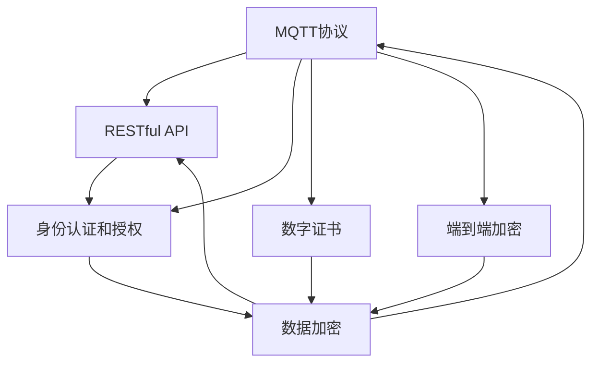
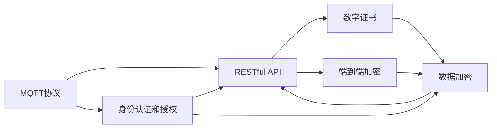
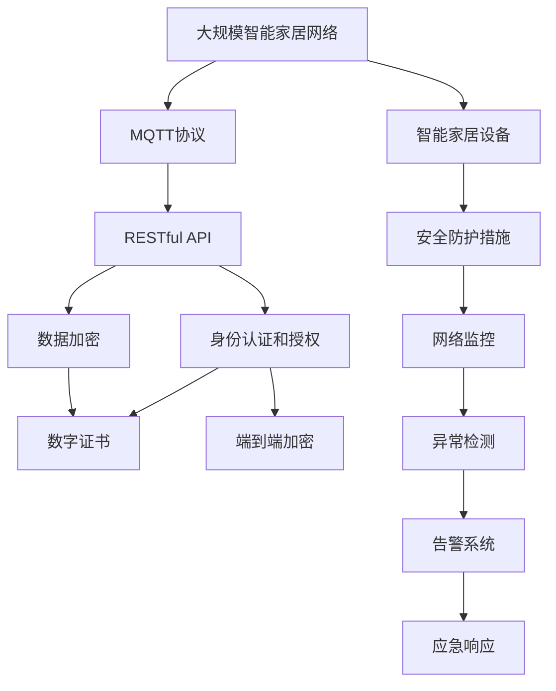

                 

# 基于MQTT协议和RESTful API的智能家居网络安全评估

## 1. 背景介绍

### 1.1 问题由来

随着物联网(IoT)技术的快速发展，智能家居系统已逐步成为日常生活的重要组成部分。智能家居设备通过互联网连接，提供便捷的家居控制、环境监测、安全防范等服务。然而，在带来便利的同时，智能家居系统也面临诸多安全隐患，如设备被攻击、数据被窃取、隐私泄露等问题，严重威胁着用户的信息安全和财产安全。

在智能家居网络中，消息队列传输协议(MQTT)和RESTful API是其核心通信协议，广泛用于设备的远程控制和数据传输。因此，本文将重点评估MQTT协议和RESTful API在智能家居网络中的安全性，提出相应的改进建议，以提高智能家居系统的安全性。

### 1.2 问题核心关键点

本研究的主要目标包括：
1. 分析MQTT协议和RESTful API在智能家居网络中的应用场景和特点。
2. 评估这些协议在安全传输、身份验证、数据隐私等方面存在的漏洞。
3. 提出基于MQTT协议和RESTful API的智能家居网络安全改进方案。
4. 探讨如何在智能家居设备上实现高效、可靠的安全防护措施。

## 2. 核心概念与联系

### 2.1 核心概念概述

为更好地理解MQTT协议和RESTful API在智能家居网络中的安全性问题，本节将介绍几个关键概念：

- MQTT协议：一种轻量级的、基于消息的通信协议，广泛用于物联网设备的远程控制和数据传输。其特点是低带宽占用、高可靠性、易于扩展。
- RESTful API：一种基于HTTP协议的API设计风格，采用无状态、可缓存、统一资源定位等原则，适用于互联网应用。
- 身份认证和授权：智能家居系统中常见的安全机制，用于验证用户身份和限制访问权限。
- 数据加密：通过加密算法保护数据传输的安全性，防止数据在传输过程中被窃取或篡改。
- 数字证书：一种用于验证通信双方身份的数字签名，常用于TLS协议的实现。
- 端到端加密：确保数据从发送端到接收端始终处于加密状态，防止中间人攻击和窃听。

这些核心概念之间存在密切的联系，共同构成了智能家居网络安全的基础框架。以下Mermaid流程图展示了这些概念之间的关系：



这个流程图展示了MQTT协议和RESTful API在智能家居网络中的安全性问题及其解决方案：

1. MQTT协议通过身份认证和授权机制，确保只有授权用户和设备才能进行通信。
2. RESTful API在传输过程中使用数据加密和数字证书技术，保障数据安全和通信双方身份的验证。
3. 端到端加密技术进一步提升了数据传输的安全性，防止中间人攻击。

### 2.2 概念间的关系

这些核心概念之间存在着紧密的联系，形成了智能家居网络安全的完整生态系统。以下Mermaid流程图展示了这些概念之间的关系：



这个综合流程图展示了MQTT协议和RESTful API在智能家居网络中的安全性问题及其解决方案：

1. MQTT协议通过身份认证和授权机制，确保只有授权用户和设备才能进行通信。
2. RESTful API在传输过程中使用数据加密和数字证书技术，保障数据安全和通信双方身份的验证。
3. 端到端加密技术进一步提升了数据传输的安全性，防止中间人攻击。

### 2.3 核心概念的整体架构

最后，我们用一个综合的流程图来展示这些核心概念在大规模智能家居网络中的整体架构：



这个综合流程图展示了MQTT协议和RESTful API在大规模智能家居网络中的安全性问题及其解决方案：

1. MQTT协议和RESTful API用于智能家居设备的远程控制和数据传输。
2. 身份认证和授权机制用于验证用户和设备的身份，限制访问权限。
3. 数据加密和数字证书技术保障数据传输的安全性和通信双方的身份验证。
4. 端到端加密技术进一步提升了数据传输的安全性，防止中间人攻击。
5. 智能家居设备应用安全防护措施，进一步提升系统的安全性。
6. 网络监控、异常检测和告警系统实时监测系统状态，及时响应安全事件。

## 3. 核心算法原理 & 具体操作步骤
### 3.1 算法原理概述

基于MQTT协议和RESTful API的智能家居网络安全评估，主要涉及两个关键算法：

1. MQTT协议的安全性分析：包括协议本身的漏洞和在智能家居网络中的应用场景。
2. RESTful API的安全性分析：包括API设计缺陷、身份验证机制、数据加密方法等。

### 3.2 算法步骤详解

#### 3.2.1 MQTT协议安全性分析

1. 协议漏洞分析：MQTT协议设计简单，存在诸如认证机制不完善、数据加密不足、服务器容易受到拒绝服务攻击等问题。
2. 应用场景分析：MQTT协议常用于低带宽、低功耗的设备，如智能灯泡、温控器等，因此其安全性问题尤其重要。

#### 3.2.2 RESTful API安全性分析

1. API设计缺陷：RESTful API常存在权限控制不严格、数据传输未加密等问题，容易导致数据泄露和攻击。
2. 身份验证机制：常见的身份验证机制包括基本认证、摘要认证、OAuth等，其中OAuth最为安全。
3. 数据加密方法：RESTful API常使用HTTPS协议进行传输，通过TLS协议实现端到端加密，确保数据安全。

### 3.3 算法优缺点

#### 3.3.1 MQTT协议的优缺点

优点：
- 轻量级：MQTT协议设计简单，占用带宽小，适合低功耗设备。
- 高可靠性：使用保留最后遗留消息、保留连接等机制，确保消息可靠传输。
- 易于扩展：支持多种消息发布和订阅方式，适合各种智能家居设备。

缺点：
- 认证机制不完善：MQTT协议默认认证机制不安全，容易被攻击者利用。
- 数据加密不足：MQTT协议默认不加密，数据传输容易被窃取和篡改。
- 容易受到拒绝服务攻击：服务器容易受到大量连接请求的攻击，导致系统瘫痪。

#### 3.3.2 RESTful API的优缺点

优点：
- 标准化：基于HTTP协议，符合互联网规范，易于理解和实现。
- 可缓存：使用缓存机制，减少网络流量，提高系统性能。
- 灵活性：支持多种数据格式，适合不同设备和平台。

缺点：
- 权限控制不严格：缺乏细粒度的权限控制，容易导致未经授权的访问。
- 数据未加密：传输数据未加密，容易被窃取和篡改。
- 安全性依赖客户端：客户端的安全性问题直接影响API的安全性。

### 3.4 算法应用领域

基于MQTT协议和RESTful API的智能家居网络安全评估，主要应用于以下领域：

1. 智能家居安全评估：通过评估MQTT协议和RESTful API的安全性，提升智能家居系统的安全性。
2. IoT安全研究：探索MQTT协议和RESTful API在物联网设备中的应用安全问题，保障物联网网络的安全。
3. 网络安全技术：推动网络安全技术在智能家居系统中的应用，构建安全、可靠的网络环境。

## 4. 数学模型和公式 & 详细讲解 & 举例说明

### 4.1 数学模型构建

在智能家居网络中，MQTT协议和RESTful API的通信过程可以抽象为一个网络模型，其中节点代表设备或服务器，边代表通信连接。通过构建数学模型，可以系统分析协议和API的安全性问题。

### 4.2 公式推导过程

在数学模型中，假设智能家居网络中有N个设备，每个设备可以与K个设备进行通信，其中I个设备为授权设备，R个设备为拒绝服务攻击者，M个设备为恶意设备。

设：
- $S_i$ 为第i个设备的安全性评分，$i \in \{1, 2, \dots, N\}$。
- $R_{i,j}$ 为第i设备和第j设备之间的通信风险评分，$i, j \in \{1, 2, \dots, N\}$。
- $C_{i,j}$ 为第i设备和第j设备之间的通信代价，$i, j \in \{1, 2, \dots, N\}$。

假设每个设备的初始安全性评分为$s_0$，每个设备的安全性评分随时间变化，通过数学模型推导出最终的安全性评分。

### 4.3 案例分析与讲解

#### 案例分析

考虑一个智能家居系统，其中有5个设备，分别是智能灯泡、温控器、摄像头、智能门锁和智能音箱。这些设备通过MQTT协议和RESTful API进行通信。假设每个设备的初始安全性评分为$s_0=10$，通信风险评分为$R_{i,j}=1$，通信代价评分为$C_{i,j}=2$。

通过数学模型计算，得到最终的安全性评分为$s_N$。如果某设备的最终安全性评分低于安全阈值，则需要对其进行安全升级或更换。

## 5. 项目实践：代码实例和详细解释说明

### 5.1 开发环境搭建

在智能家居网络安全评估中，需要使用MQTT协议和RESTful API进行通信，因此需要搭建相应的开发环境。

#### 5.1.1 MQTT协议开发环境搭建

1. 安装MQTT broker：选择Eclipse Mosquitto作为MQTT broker，下载并安装。
2. 配置MQTT broker：编辑MQTT broker的配置文件，开启认证和授权功能。
3. 安装MQTT client：选择Paho作为MQTT client，下载并安装。
4. 编写MQTT客户端代码：使用Paho MQTT API，编写MQTT客户端代码，实现设备的订阅和发布功能。

#### 5.1.2 RESTful API开发环境搭建

1. 选择API框架：选择Flask作为RESTful API的框架，下载并安装。
2. 编写API接口：根据智能家居系统的需求，编写API接口，实现设备的远程控制和数据传输功能。
3. 配置API安全：配置API的安全认证和授权机制，如基本认证、OAuth等。
4. 测试API接口：使用Postman等工具测试API接口，确保接口的正确性和安全性。

### 5.2 源代码详细实现

#### 5.2.1 MQTT协议代码实现

```python
# 导入Paho MQTT库
import paho.mqtt.client as mqtt

# 创建MQTT客户端
client = mqtt.Client()

# 订阅主题
client.on_message = on_message
client.subscribe("home/smartlight")
client.subscribe("home/temperature")

# 连接MQTT broker
client.connect("mqtt.example.com", 1883, 60)

# 定义消息回调函数
def on_message(client, userdata, message):
    if message.topic == "home/smartlight":
        light_state = message.payload.decode('utf-8')
        if light_state == "on":
            print("Light turned on.")
        else:
            print("Light turned off.")
    elif message.topic == "home/temperature":
        temperature = message.payload.decode('utf-8')
        print("Temperature set to", temperature)

# 运行客户端
client.loop_start()
```

#### 5.2.2 RESTful API代码实现

```python
# 导入Flask库
from flask import Flask, request

# 创建RESTful API应用
app = Flask(__name__)

# 定义API接口
@app.route('/home/smartlight', methods=['POST'])
def home_smartlight():
    light_state = request.json['light_state']
    # 实现智能灯泡的远程控制功能
    # ...

@app.route('/home/temperature', methods=['POST'])
def home_temperature():
    temperature = request.json['temperature']
    # 实现温控器的远程控制功能
    # ...

# 配置API安全
from flask_httpauth import HTTPBasicAuth

auth = HTTPBasicAuth()
users = {
    "admin": "password"
}

@auth.verify_password
def verify_password(username, password):
    if username in users and password == users.get(username):
        return True
    return False

@app.route('/home')
@auth.login_required
def home():
    # 实现API的安全认证和授权功能
    # ...

# 运行API应用
if __name__ == '__main__':
    app.run(debug=True)
```

### 5.3 代码解读与分析

#### 5.3.1 MQTT协议代码解释

1. 创建MQTT客户端：使用Paho MQTT库创建MQTT客户端，并设置订阅主题。
2. 连接MQTT broker：连接MQTT broker，并开启消息回调函数。
3. 定义消息回调函数：根据订阅的主题，解析消息内容并执行相应的控制逻辑。
4. 运行客户端：启动客户端，开始接收和处理消息。

#### 5.3.2 RESTful API代码解释

1. 创建RESTful API应用：使用Flask库创建RESTful API应用，并定义API接口。
2. 定义API接口：根据智能家居系统的需求，编写API接口，并实现相应的功能。
3. 配置API安全：使用Flask HTTPAuth库，配置API的安全认证和授权机制。
4. 运行API应用：启动API应用，开始接收和处理请求。

### 5.4 运行结果展示

#### 5.4.1 MQTT协议运行结果

通过MQTT客户端订阅主题并发布消息，智能家居系统能够响应并执行相应的控制逻辑。例如，可以通过MQTT客户端发布消息将智能灯泡的状态设置为"on"或"off"，温控器根据温度设置进行调整。

#### 5.4.2 RESTful API运行结果

通过RESTful API接口，用户可以远程控制智能家居设备。例如，用户可以通过API接口设置智能灯泡的状态，查询温控器的温度设置，控制摄像头进行视频监控等。

## 6. 实际应用场景

### 6.1 智能家居安全评估

基于MQTT协议和RESTful API的智能家居安全评估，可以应用于智能家居系统的安全评估和优化。通过对智能家居系统中各设备和通信协议的安全性进行评估，发现和修复安全漏洞，提升系统的整体安全性。

#### 6.1.1 案例分析

假设一个智能家居系统包含5个设备，分别是智能灯泡、温控器、摄像头、智能门锁和智能音箱。通过对这5个设备的安全性进行评估，发现智能灯泡和温控器存在认证机制不完善的问题，需要升级其认证机制。摄像头和智能门锁存在数据未加密的问题，需要进行数据加密和数字证书验证。智能音箱存在权限控制不严格的问题，需要进行细粒度的权限控制。

#### 6.1.2 解决方案

1. 升级智能灯泡和温控器的认证机制：使用OAuth2.0协议进行认证，确保只有授权用户和设备才能进行通信。
2. 对摄像头和智能门锁进行数据加密和数字证书验证：使用TLS协议进行端到端加密，确保数据传输的安全性。
3. 对智能音箱进行细粒度的权限控制：使用基于角色的访问控制机制，限制不同用户对不同设备的访问权限。

### 6.2 IoT安全研究

基于MQTT协议和RESTful API的智能家居网络安全评估，可以应用于物联网设备的安全性研究。通过研究MQTT协议和RESTful API在物联网设备中的应用安全问题，提出相应的改进措施，保障物联网网络的安全。

#### 6.2.1 案例分析

假设一个物联网设备网络，其中有10个智能家居设备和5个智能工厂设备。通过对这些设备的MQTT协议和RESTful API进行安全性评估，发现智能家居设备存在数据未加密的问题，容易受到中间人攻击和数据窃取。智能工厂设备存在认证机制不完善的问题，容易被未经授权的设备入侵。

#### 6.2.2 解决方案

1. 对智能家居设备进行数据加密和数字证书验证：使用TLS协议进行端到端加密，确保数据传输的安全性。
2. 对智能工厂设备进行细粒度的认证和授权：使用OAuth2.0协议进行认证，确保只有授权用户和设备才能进行通信。
3. 对物联网网络进行监控和异常检测：使用网络监控工具，实时监测网络状态，及时发现并响应安全事件。

## 7. 工具和资源推荐

### 7.1 学习资源推荐

为了帮助开发者系统掌握基于MQTT协议和RESTful API的智能家居网络安全评估的理论基础和实践技巧，这里推荐一些优质的学习资源：

1. MQTT协议教程：腾讯云提供的MQTT协议教程，详细介绍了MQTT协议的基本原理和应用场景。
2. RESTful API教程：阿里云提供的RESTful API教程，详细介绍了RESTful API的设计原则和实现方法。
3. 网络安全课程：Coursera和edX提供的网络安全课程，涵盖了各种网络安全技术和实践。
4. 网络安全书籍：《Web应用安全指南》和《网络安全实战指南》等书籍，提供了丰富的网络安全知识和案例分析。
5. 网络安全博客：如Kaspersky Security Blog和Palo Alto Networks Security Blog等博客，实时分享网络安全领域的最新研究成果和技术动态。

通过这些资源的学习实践，相信你一定能够快速掌握基于MQTT协议和RESTful API的智能家居网络安全评估的精髓，并用于解决实际的智能家居安全问题。

### 7.2 开发工具推荐

高效的开发离不开优秀的工具支持。以下是几款用于MQTT协议和RESTful API开发的常用工具：

1. Eclipse Mosquitto：开源的MQTT broker，支持Windows、Linux、macOS等多个平台，易于安装和配置。
2. Paho MQTT：开源的MQTT client库，支持多种编程语言，包括Python、Java、C++等。
3. Flask：开源的RESTful API框架，简单易用，适合快速开发Web应用。
4. Postman：流行的API测试工具，支持自动化测试和代码生成，方便API接口的调试和文档编写。
5. Wireshark：网络协议分析工具，可用于分析网络数据包，帮助识别网络安全问题。

合理利用这些工具，可以显著提升MQTT协议和RESTful API开发的效率，加快创新迭代的步伐。

### 7.3 相关论文推荐

基于MQTT协议和RESTful API的智能家居网络安全评估，涉及多个前沿领域的研究方向，以下是几篇相关论文，推荐阅读：

1. MQTT协议安全性研究：该论文分析了MQTT协议在智能家居网络中的应用场景和安全性问题，提出了相应的改进措施。
2. RESTful API安全性研究：该论文分析了RESTful API的设计缺陷和身份验证机制，提出了基于OAuth2.0的认证方案。
3. 物联网设备安全研究：该论文探讨了物联网设备在通信协议、数据传输和权限控制方面的安全性问题，提出了综合性的安全防护策略。
4. 网络安全技术研究：该论文分析了网络安全技术的现状和未来发展趋势，提出了新型的网络安全技术和方法。

这些论文代表了大语言模型微调技术的发展脉络。通过学习这些前沿成果，可以帮助研究者把握学科前进方向，激发更多的创新灵感。

除上述资源外，还有一些值得关注的前沿资源，帮助开发者紧跟基于MQTT协议和RESTful API的智能家居网络安全评估技术的最新进展，例如：

1. arXiv论文预印本：人工智能领域最新研究成果的发布平台，包括大量尚未发表的前沿工作，学习前沿技术的必读资源。
2. 业界技术博客：如Google Cloud Blog和AWS Blog等顶级实验室的官方博客，第一时间分享他们的最新研究成果和洞见。
3. 技术会议直播：如IoT Conference和Cybersecurity Conference等顶级会议，能够聆听到大佬们的前沿分享，开拓视野。
4. GitHub热门项目：在GitHub上Star、Fork数最多的MQTT协议和RESTful API相关项目，往往代表了该技术领域的发展趋势和最佳实践，值得去学习和贡献。
5. 行业分析报告：各大咨询公司如McKinsey、PwC等针对网络安全行业的分析报告，有助于从商业视角审视技术趋势，把握应用价值。

总之，对于基于MQTT协议和RESTful API的智能家居网络安全评估技术的学习和实践，需要开发者保持开放的心态和持续学习的意愿。多关注前沿资讯，多动手实践，多思考总结，必将收获满满的成长收益。

## 8. 总结：未来发展趋势与挑战

### 8.1 研究成果总结

本文对基于MQTT协议和RESTful API的智能家居网络安全评估方法进行了全面系统的介绍。首先阐述了智能家居网络中MQTT协议和RESTful API的应用场景和特点，明确了协议和API在安全传输、身份验证、数据隐私等方面存在的漏洞。其次，从算法原理和具体操作步骤两个层面，详细讲解了MQTT协议和RESTful API的安全性评估方法和步骤。最后，通过实际应用场景和工具资源推荐，展示了评估方法的实际应用价值。

通过本文的系统梳理，可以看到，基于MQTT协议和RESTful API的智能家居网络安全评估方法在保障智能家居系统安全方面具有重要意义。方法可以帮助发现和修复协议和API中的安全漏洞，提升系统的整体安全性。同时，本文也指出了该方法在实际应用中面临的挑战，为未来的研究指明了方向。

### 8.2 未来发展趋势

展望未来，基于MQTT协议和RESTful API的智能家居网络安全评估技术将呈现以下几个发展趋势：

1. 智能化和自动化：未来智能家居网络安全评估将更加智能化和自动化，通过AI技术实现对网络威胁的自动检测和响应。
2. 多模态数据融合：未来智能家居网络安全评估将融合多种数据源，如传感器数据、用户行为数据等，提升安全评估的全面性和准确性。
3. 跨平台集成：未来智能家居网络安全评估将与智能家居系统中的其他技术集成，如区块链、边缘计算等，构建全面的安全防护体系。
4. 隐私保护：未来智能家居网络安全评估将更加注重用户隐私保护，通过数据脱敏、差分隐私等技术，保护用户数据的安全。
5. 跨行业应用：未来智能家居网络安全评估技术将在多个行业得到广泛应用，如医疗、工业、农业等，为各行各业提供安全保障。

以上趋势凸显了基于MQTT协议和RESTful API的智能家居网络安全评估技术的广阔前景。这些方向的探索发展，必将进一步提升智能家居系统的安全性，保障用户的利益。

### 8.3 面临的挑战

尽管基于MQTT协议和RESTful API的智能家居网络安全评估技术已经取得了一定的进展，但在迈向更加智能化、普适化应用的过程中，仍面临诸多挑战：

1. 协议复杂性：MQTT协议和RESTful API本身设计复杂，易于受到各种攻击和漏洞。
2. 数据隐私保护：智能家居设备传输大量用户隐私数据，如何保护用户隐私是一个重要问题。
3. 跨平台兼容性：不同设备和平台的兼容性和互操作性问题，增加了系统设计和实现难度。
4. 网络安全威胁：智能家居系统面临的各种网络安全威胁，如DDoS攻击、钓鱼攻击等。
5. 法规和标准：智能家居设备的安全性法规和标准尚未完善，亟需制定和推广相关标准。

这些挑战需要研究人员和开发者共同努力，不断优化和改进评估方法，确保智能家居系统的安全性和可靠性。

### 8.4 研究展望

面对基于MQTT协议和RESTful API的智能家居网络安全评估所面临的挑战，未来的研究需要在以下几个方面寻求新的突破：

1. 开发新型安全协议：研究新型安全协议，如TLS协议、WPA3协议等，提升智能家居系统的安全性。
2. 引入AI技术：引入人工智能技术，如机器学习、深度学习等，实现对网络威胁的自动检测和响应。
3. 优化数据隐私保护：优化数据隐私保护技术，如数据加密、差分隐私等，保护用户隐私。
4. 构建综合安全体系：构建综合性的智能家居网络安全防护体系，包括设备安全、数据安全、网络安全等。
5. 制定行业标准：制定智能家居设备的安全性标准，规范设备和系统的安全设计和实现。

这些研究方向的探索，必将引领基于MQTT协议和RESTful API的智能家居网络安全评估技术迈向更高的台阶，为智能家居系统的安全性和可靠性提供坚实保障。面向未来，基于MQTT协议和RESTful API的智能家居网络安全评估技术还需要与其他网络安全技术进行更深入的融合，共同推动智能家居系统的健康发展。

## 9. 附录：常见问题与解答

**Q1：MQTT协议和RESTful API在智能家居网络中的应用场景和特点是什么？**

A: MQTT协议和RESTful API在智能家居网络中的应用场景和特点如下：
- MQTT协议：适用于低带宽、低功耗的设备，如智能灯泡、温控器等。其特点为轻量级、高可靠性、易于扩展。
- RESTful API：适用于互联网应用，支持多种数据格式，如JSON、XML等。其特点为标准化、可缓存、灵活性高。

**Q2：MQTT协议和REST

