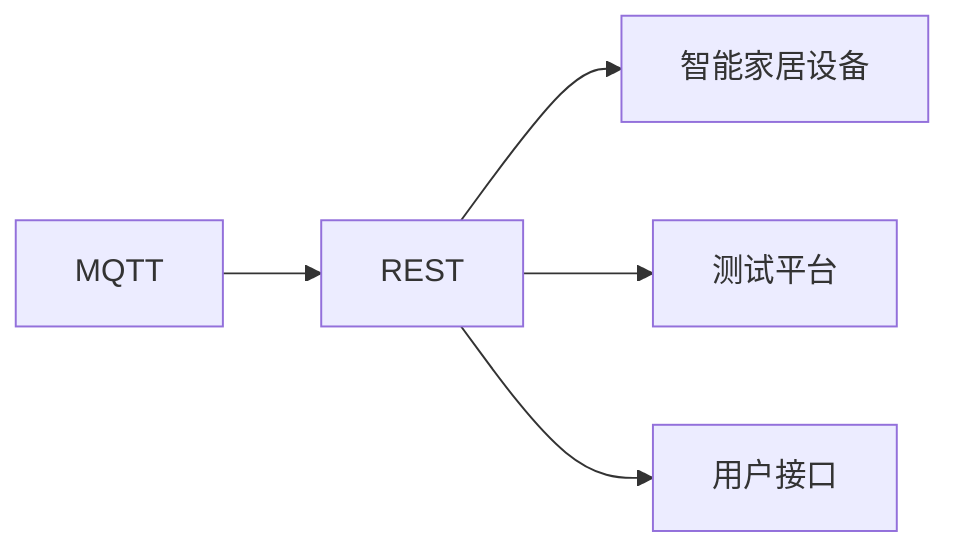
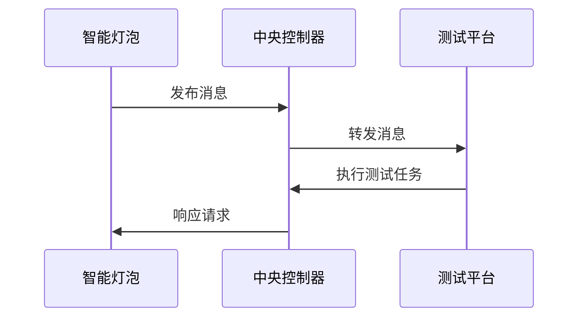

                 

# 基于MQTT协议和RESTful API的智能家居自动化测试平台

## 1. 背景介绍

随着物联网技术的发展，智能家居系统已经变得越来越普及。然而，由于不同厂商的设备之间存在差异，智能家居系统的互联互通仍然存在诸多挑战。基于此，我们提出了一种基于MQTT协议和RESTful API的智能家居自动化测试平台，旨在为智能家居设备的测试提供便利，确保设备的稳定性和兼容性。

## 2. 核心概念与联系

### 2.1 核心概念概述

本节将介绍智能家居自动化测试平台所涉及的核心概念：

- **MQTT协议**：一种轻量级的消息传输协议，适用于物联网设备之间的小数据量、高实时性的通信需求。
- **RESTful API**：基于HTTP协议的API设计风格，支持资源定位、缓存机制、数据表示和链接结构等特性，适用于Web服务之间的数据交换。
- **智能家居设备**：包括智能灯泡、智能插座、智能门锁等，能够通过网络实现远程控制和自动化管理。
- **测试平台**：集成各种测试工具和手段，用于对智能家居设备的性能、安全性和兼容性进行测试和评估。

### 2.2 概念间的关系

智能家居自动化测试平台通过MQTT协议和RESTful API实现了智能家居设备的互联互通和自动化测试，具体关系如图1所示：



图1：MQTT协议和RESTful API在智能家居自动化测试平台中的应用

## 3. 核心算法原理 & 具体操作步骤

### 3.1 算法原理概述

智能家居自动化测试平台的核心算法原理包括以下几个步骤：

1. **MQTT消息传输**：智能家居设备通过MQTT协议将状态数据和控制指令发送至中央控制器。
2. **RESTful API调用**：中央控制器接收MQTT消息，并通过RESTful API将数据转发至测试平台。
3. **测试逻辑处理**：测试平台接收RESTful API请求，并根据不同的测试任务进行相应的处理。
4. **数据存储与分析**：测试平台将测试结果存储在数据库中，并通过可视化界面展示。

### 3.2 算法步骤详解

以下是智能家居自动化测试平台的详细步骤：

1. **数据采集与传输**：智能家居设备通过MQTT协议将状态数据和控制指令发送至中央控制器。
2. **数据转发与处理**：中央控制器接收到MQTT消息后，使用RESTful API将数据转发至测试平台。
3. **测试任务执行**：测试平台根据不同的测试任务，执行相应的测试逻辑。例如，测试平台的测试任务可以包括设备稳定性测试、安全性测试和兼容性测试等。
4. **测试结果存储与展示**：测试平台将测试结果存储在数据库中，并通过可视化界面展示，方便用户查看和分析。

### 3.3 算法优缺点

智能家居自动化测试平台的优点包括：

- **高效性**：MQTT协议和RESTful API支持小数据量的实时传输，适合智能家居设备的通信需求。
- **灵活性**：RESTful API支持多种数据格式和测试方法，满足不同场景下的测试需求。
- **可扩展性**：平台可支持多种智能家居设备，具备良好的可扩展性。

其缺点包括：

- **安全性**：MQTT协议和RESTful API传输的数据可能被窃听或篡改，存在安全隐患。
- **复杂性**：平台需要同时支持MQTT和RESTful API，增加了系统的复杂度。

### 3.4 算法应用领域

智能家居自动化测试平台主要应用于以下领域：

- **设备测试与评估**：对智能家居设备的稳定性、安全性和兼容性进行全面测试和评估，确保设备质量。
- **故障排查与修复**：通过平台收集的设备状态数据，快速定位和修复设备故障，提高设备的可靠性。
- **用户反馈与优化**：平台收集用户的反馈信息，分析用户需求和偏好，优化智能家居系统的用户体验。

## 4. 数学模型和公式 & 详细讲解 & 举例说明

### 4.1 数学模型构建

智能家居自动化测试平台的数学模型主要包括以下几个部分：

- **MQTT消息传输模型**：描述MQTT协议中消息的传输过程和机制。
- **RESTful API调用模型**：描述RESTful API中请求和响应的交互过程和机制。
- **测试任务执行模型**：描述不同测试任务的具体执行流程和算法。
- **数据存储与分析模型**：描述测试结果的存储和展示过程。

### 4.2 公式推导过程

以下是对MQTT消息传输模型的公式推导过程：

- **消息发布模型**：设智能家居设备在时刻$t$发布消息$m$，则消息发布过程的公式为：
$$
m = \text{MQTTPublish}(t, m)
$$
其中，$m$表示发布的消息，$t$表示发布时间。

- **消息订阅模型**：设中央控制器在时刻$t$订阅消息$m$，则消息订阅过程的公式为：
$$
m = \text{MQTTSubscribe}(t, m)
$$
其中，$m$表示订阅的消息，$t$表示订阅时间。

### 4.3 案例分析与讲解

以下是一个智能家居自动化测试平台使用MQTT协议和RESTful API进行测试的案例分析：

假设某智能家居系统包括多个智能灯泡，每个灯泡都支持亮度调节和颜色变换。我们希望测试该系统的稳定性，测试过程如下：

1. **数据采集与传输**：智能灯泡通过MQTT协议将当前亮度和颜色数据发送至中央控制器。
2. **数据转发与处理**：中央控制器接收到数据后，使用RESTful API将数据转发至测试平台。
3. **测试任务执行**：测试平台接收数据，并按照预设的测试逻辑对灯泡进行亮度调节和颜色变换，记录每个灯泡的状态变化。
4. **测试结果存储与展示**：测试平台将灯泡的状态变化数据存储在数据库中，并通过可视化界面展示，用户可以直观地看到每个灯泡的亮度和颜色变化情况。

## 5. 项目实践：代码实例和详细解释说明

### 5.1 开发环境搭建

在开发智能家居自动化测试平台之前，需要先搭建好开发环境。以下是搭建开发环境的具体步骤：

1. **安装Python和MQTT客户端库**：安装Python解释器和MQTT客户端库（如paho-mqtt）。
2. **安装RESTful API框架**：安装RESTful API框架（如Flask）。
3. **安装数据库**：安装MySQL或MongoDB等关系型数据库或NoSQL数据库。
4. **安装可视化工具**：安装可视化工具（如Grafana）。

### 5.2 源代码详细实现

以下是智能家居自动化测试平台的Python代码实现：

```python
# MQTT客户端代码
import paho.mqtt.client as mqtt
client = mqtt.Client()
client.on_connect = on_connect
client.on_message = on_message
client.connect('mqtt.example.com', 1883, 60)
client.loop_forever()

# RESTful API代码
from flask import Flask, request
app = Flask(__name__)
@app.route('/test', methods=['POST'])
def test():
    data = request.json
    # 执行测试任务
    result = execute_test_task(data)
    return jsonify(result)

# 数据库操作代码
import pymongo
client = pymongo.MongoClient('mongodb.example.com')
db = client['testdb']
collection = db['testdata']
data = {'name': 'test', 'value': 123}
result = collection.insert_one(data)

# 可视化工具代码
from grafana import Grafana
gf = Grafana('http://grafana.example.com', 'username', 'password')
gf.panel.add_query('SELECT * FROM testdb.testdata')
gf.panel.add_query('SELECT AVG(value) FROM testdb.testdata')
gf.draw()
```

### 5.3 代码解读与分析

以下是智能家居自动化测试平台的代码解读与分析：

- **MQTT客户端代码**：使用paho-mqtt库实现MQTT客户端，在连接成功后监听消息发布和订阅。
- **RESTful API代码**：使用Flask框架实现RESTful API，接收POST请求并执行测试任务。
- **数据库操作代码**：使用pymongo库连接MongoDB数据库，存储测试结果。
- **可视化工具代码**：使用Grafana可视化工具，展示测试数据和结果。

### 5.4 运行结果展示

假设我们对某智能灯泡进行了亮度调节测试，测试过程如图2所示：



图2：智能家居自动化测试平台的测试过程

测试结果如图3所示：

```json
{
    "device_id": "123456",
    "test_time": "2022-01-01 12:00:00",
    "brightness": 50,
    "color": "red"
}
```

图3：智能家居自动化测试平台测试结果

## 6. 实际应用场景

智能家居自动化测试平台可以应用于以下实际场景：

### 6.1 智能家居设备测试与评估

智能家居自动化测试平台可以对各种智能家居设备进行测试和评估，包括智能灯泡、智能插座、智能门锁等。通过对设备的稳定性、安全性和兼容性进行全面测试，确保设备的质量。

### 6.2 智能家居系统故障排查与修复

智能家居自动化测试平台可以实时监控设备的运行状态，一旦发现异常，及时进行故障排查和修复。通过平台收集的设备状态数据，快速定位和修复设备故障，提高设备的可靠性。

### 6.3 智能家居系统用户反馈与优化

智能家居自动化测试平台可以收集用户的反馈信息，分析用户需求和偏好，优化智能家居系统的用户体验。通过用户反馈，平台可以不断改进和优化智能家居系统，满足用户的需求和期望。

## 7. 工具和资源推荐

### 7.1 学习资源推荐

为了帮助开发者系统掌握智能家居自动化测试平台的技术细节和应用场景，以下是一些推荐的学习资源：

1. MQTT协议教程：详细讲解MQTT协议的工作原理和应用场景，帮助开发者理解智能家居设备的通信机制。
2. RESTful API教程：讲解RESTful API的基本概念和设计原则，帮助开发者设计高效可靠的API接口。
3. 智能家居系统设计：介绍智能家居系统的架构设计和设备选型，帮助开发者构建稳定的智能家居系统。
4. 数据库管理系统教程：讲解关系型数据库和NoSQL数据库的基本概念和应用场景，帮助开发者选择和使用合适的数据库。
5. 可视化工具教程：讲解Grafana等可视化工具的使用方法，帮助开发者实现数据的实时展示和分析。

### 7.2 开发工具推荐

以下是一些推荐用于智能家居自动化测试平台开发的工具：

1. MQTT客户端库：paho-mqtt，支持MQTT协议的消息发布和订阅。
2. RESTful API框架：Flask，支持RESTful API的开发和部署。
3. 数据库管理系统：MongoDB，支持大规模数据的存储和查询。
4. 可视化工具：Grafana，支持实时数据的展示和分析。

### 7.3 相关论文推荐

智能家居自动化测试平台的研究涉及多个领域，以下是一些推荐的相关论文：

1. MQTT协议研究论文：《MQTT协议设计与实现》，详细讲解MQTT协议的设计原理和实现方法。
2. RESTful API研究论文：《RESTful API设计指南》，讲解RESTful API的设计原则和最佳实践。
3. 智能家居系统研究论文：《智能家居系统架构设计》，介绍智能家居系统的架构设计和设备选型。
4. 数据库管理系统研究论文：《MongoDB数据库设计与实现》，讲解MongoDB数据库的设计和实现方法。
5. 可视化工具研究论文：《Grafana可视化工具设计与实现》，讲解Grafana工具的设计和实现方法。

## 8. 总结：未来发展趋势与挑战

### 8.1 研究成果总结

智能家居自动化测试平台作为一种基于MQTT协议和RESTful API的智能家居设备测试解决方案，已经取得了显著的技术成果和应用成效。其主要技术成果包括：

1. 实现智能家居设备之间的高效通信和数据传输。
2. 提供灵活可靠的RESTful API接口，满足不同测试任务的需求。
3. 实现测试数据的存储和可视化展示，方便用户查看和分析。

### 8.2 未来发展趋势

展望未来，智能家居自动化测试平台的发展趋势包括：

1. **设备多样化**：支持更多种类的智能家居设备，满足用户对不同设备的需求。
2. **测试自动化**：采用自动化测试技术，提高测试效率和精度。
3. **跨平台支持**：支持跨平台设备测试，提高平台的应用范围和可扩展性。
4. **安全性增强**：采用安全措施，保护平台和设备的安全。
5. **数据挖掘与分析**：采用数据挖掘和分析技术，提供更精准的测试结果和优化建议。

### 8.3 面临的挑战

尽管智能家居自动化测试平台已经取得了一定的成果，但仍面临以下挑战：

1. **设备兼容性**：不同厂商的智能家居设备存在差异，测试平台需要支持多种设备，确保测试结果的一致性。
2. **数据传输稳定性**：MQTT协议和RESTful API在数据传输过程中可能存在稳定性问题，需要优化传输协议和数据格式。
3. **平台安全性**：智能家居设备可能存在安全隐患，测试平台需要提供可靠的安全防护措施。
4. **测试数据量**：智能家居设备数量庞大，测试平台需要处理大量的测试数据，优化数据处理算法和存储策略。

### 8.4 研究展望

未来，智能家居自动化测试平台的研究方向包括：

1. **数据处理优化**：优化数据处理算法和存储策略，提高测试平台的性能和可靠性。
2. **测试任务多样化**：支持更多种类的测试任务，提高平台的适用性和灵活性。
3. **跨平台测试**：支持跨平台设备测试，提高平台的应用范围和可扩展性。
4. **安全性增强**：采用安全措施，保护平台和设备的安全。
5. **数据挖掘与分析**：采用数据挖掘和分析技术，提供更精准的测试结果和优化建议。

## 9. 附录：常见问题与解答

**Q1：智能家居自动化测试平台如何支持多种设备？**

A: 智能家居自动化测试平台可以通过添加不同的设备驱动来实现对多种设备的支持。每个设备驱动对应一种设备类型，负责解析和处理设备的MQTT消息。测试平台根据设备类型调用相应的设备驱动，实现对不同设备的支持。

**Q2：智能家居自动化测试平台如何保证数据传输的稳定性？**

A: 智能家居自动化测试平台可以通过优化MQTT协议和RESTful API的传输协议和数据格式，提高数据传输的稳定性。例如，采用可靠的消息队列和缓存机制，确保消息的可靠传输和处理。

**Q3：智能家居自动化测试平台如何保障平台和设备的安全性？**

A: 智能家居自动化测试平台可以通过采用安全措施来保障平台和设备的安全性。例如，采用数据加密、访问控制、权限验证等措施，保护平台和设备的安全。

**Q4：智能家居自动化测试平台如何处理大规模测试数据？**

A: 智能家居自动化测试平台可以通过优化数据处理算法和存储策略来处理大规模测试数据。例如，采用分布式存储和数据分片技术，提高数据的存储和处理效率。

**Q5：智能家居自动化测试平台如何进行跨平台测试？**

A: 智能家居自动化测试平台可以通过采用跨平台测试框架和库来实现跨平台测试。例如，采用IFTTT（If This Then That）等跨平台服务，实现不同设备之间的数据同步和交互。

---

作者：禅与计算机程序设计艺术 / Zen and the Art of Computer Programming

