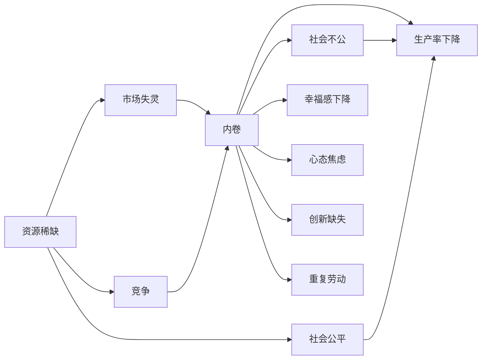

                 

## 1. 背景介绍

内卷（Involution）一词起源于《深度工作》作者卡尔·纽波特对“深度工作”与“浅层工作”的描述。**内卷**指的是资源稀缺导致的一种内部恶性竞争现象，在这种状态下，每个竞争者都将焦点放在了提高自身的“表现”，而非努力实现真正意义的进步。内卷现象可以发生在各种场合，包括教育、就业、企业竞争等。

内卷现象在经济学中，通常指的是**低水平的竞争**。在这种情况下，增加工作量、延长工作时间、提高工作效率等手段虽然能使个人表现看似提升，但总体上资源并未实现真正的优化，生产率停滞不前，甚至倒退。其结果导致**资源浪费**、**生产力下降**和**社会不公**，进而对经济产生长期负面影响。

### 1.1 内卷现象的成因

1. **资源稀缺**：首先，资源稀缺是内卷现象的基础，当资源不能满足所有人的需求时，为了争夺有限的资源，自然会产生激烈的竞争。
2. **市场失灵**：市场经济体系中，资源配置存在失灵的情况。特别是在垄断性行业、垄断性企业或垄断性职位中，“先到先得”而非“按需分配”的现象显著。
3. **社会不公**：不平等分配、不平等教育、不平等机会等因素，使一部分人处于明显的竞争劣势，内卷现象也变得更为严重。
4. **心理因素**：由于社会对成功的高标准和高压环境，使得个人更加倾向于追求形式上的进步，而忽略了真正意义上的成长。

### 1.2 内卷现象的特征

1. **投入增加，收益减少**：内卷状态下，为了维持和提高“表现”，不得不投入更多资源，如时间、金钱、精力等，而这种投入通常并不会带来收益的显著提升。
2. **个体竞争，群体互损**：内卷导致个体间不断竞争，彼此之间的协作效率降低，整体效率下降。
3. **无休止的重复劳动**：重复性的劳动和繁复的流程成为常见，缺乏创新和进步的动力。
4. **心态焦虑，幸福感下降**：内卷竞争导致个体长期处于高压状态，精神压力增大，幸福感下降。

### 1.3 内卷现象的分类

1. **结构性内卷**：在资源有限的情况下，由于制度或体制的原因，导致分配不公平，竞争变得无休止。
2. **技术性内卷**：技术进步没有显著提高效率，反而导致现有资源配置效率降低，出现效率倒退现象。
3. **心理性内卷**：社会价值观导向，人们追求形式上的进步而忽略了实质性的发展，导致心理上的内卷。

## 2. 核心概念与联系

### 2.1 核心概念概述

**内卷现象**：由于资源稀缺导致的一种内部恶性竞争现象，使得资源浪费、生产率下降。

**内卷（Involution）**：数学概念，描述的是一个物体或系统向自身的反向运动，在这里引申为竞争状态下的自我消耗。

**竞争**：经济学中的基本概念，指为了争夺有限资源而发生的相互作用。

**市场失灵**：经济学概念，指市场机制无法有效配置资源，导致资源错配或浪费。

**生产率**：经济学概念，指生产单位时间内产出量与投入量之比，通常以劳动生产率、全要素生产率等指标衡量。

**资源配置**：经济学概念，指将有限的资源有效分配给不同的生产活动和用途。

**幸福感**：心理学概念，指人们因对自身生活状况的满意程度而产生的积极情感。

**社会公平**：社会学概念，指社会成员之间在权利、机会、资源等方面的平等与均衡。

**创新**：经济学概念，指创造性地开发和应用新知识、新技能和新方法，以提高生产率和经济效率。

这些核心概念紧密联系，构成了内卷现象的理论基础和现实背景。

### 2.2 概念间的关系

内卷现象与其他概念之间的关系可以用以下流程图表示：



从图中可以看出，内卷现象与资源稀缺、市场失灵、社会不公等多个经济社会问题息息相关，且对生产率、社会公平、幸福感等产生了重要影响。

## 3. 核心算法原理 & 操作步骤

### 3.1 算法原理概述

内卷现象的分析和预测，通常涉及多学科的知识，包括经济学、社会学、心理学等。其算法原理如下：

1. **数据收集与分析**：收集相关经济、社会、心理学等数据，通过统计分析、量化评估等方法，对内卷现象进行量化分析。
2. **模型构建与训练**：基于内卷现象的统计数据，构建数学模型，通过机器学习或统计学习等方法，对模型进行训练，以预测内卷现象的发展趋势。
3. **政策评估与优化**：根据模型预测结果，对相关政策进行评估，提出优化建议，通过调整政策来缓解内卷现象。

### 3.2 算法步骤详解

1. **数据收集**：
    - 收集相关领域数据，如经济增长率、就业率、工资水平、生产力指标、教育资源分布、社会公平指数等。
    - 通过数据预处理，如去噪、归一化等，提高数据质量。
    - 使用数据标注工具，对数据进行分类和标签化，方便后续分析。

2. **模型构建**：
    - 选择适合的模型类型，如回归模型、分类模型、神经网络等。
    - 根据数据特点，设计模型结构，如输入层、隐藏层、输出层等。
    - 确定损失函数和优化算法，如均方误差、交叉熵、Adam、SGD等。

3. **模型训练与评估**：
    - 将数据分为训练集、验证集和测试集，使用训练集对模型进行训练。
    - 在验证集上评估模型性能，调整模型参数和结构。
    - 使用测试集对模型进行最终评估，验证模型泛化能力。

4. **政策评估与优化**：
    - 将模型预测结果与实际经济数据进行对比，评估模型准确度。
    - 基于模型评估结果，提出政策优化建议，如调整税收政策、优化资源配置、提高教育公平等。
    - 通过模拟实验，评估政策优化效果，提出进一步改进方案。

### 3.3 算法优缺点

**优点**：
1. **系统化分析**：利用数据驱动的方法，对内卷现象进行系统化分析，能够发现深层次问题。
2. **预测能力**：通过构建预测模型，可以对未来内卷现象的发展趋势进行预测，为政策制定提供参考。
3. **客观评估**：模型分析结果基于数据，不受主观偏见影响，更具客观性。

**缺点**：
1. **数据依赖性强**：内卷现象的分析和预测高度依赖高质量的数据，数据质量不足或数据偏差可能影响分析结果。
2. **模型复杂度高**：内卷现象涉及多方面因素，模型结构可能较复杂，需要较强的计算资源和时间成本。
3. **政策实施难度大**：模型评估结果只是预测，具体政策实施效果还需验证，政策执行难度较大。

### 3.4 算法应用领域

1. **经济学**：在宏观经济分析、产业结构优化、就业市场分析等领域，通过内卷现象预测，指导政策制定。
2. **社会学**：在教育公平、社会不公、心理健康等领域，评估和缓解内卷现象，提升社会整体福祉。
3. **心理学**：在个体心理压力、幸福感、职业发展等领域，分析内卷现象对个人的影响，提出心理辅导和职业规划建议。

## 4. 数学模型和公式 & 详细讲解 & 举例说明

### 4.1 数学模型构建

内卷现象的预测模型通常采用**多元回归模型**或**神经网络模型**。假设输入变量为 $x_1, x_2, ..., x_n$，输出变量为 $y$，则多元回归模型的基本形式为：

$$
y = \beta_0 + \beta_1x_1 + \beta_2x_2 + ... + \beta_nx_n + \epsilon
$$

其中 $\beta_0, \beta_1, ..., \beta_n$ 为回归系数，$\epsilon$ 为随机误差项。

### 4.2 公式推导过程

以线性回归模型为例，推导其最小二乘估计的公式。假设样本数据为 $(x_i, y_i)$，$i=1,2,...,n$。则样本均值 $\overline{x} = \frac{1}{n} \sum_{i=1}^n x_i$ 和 $\overline{y} = \frac{1}{n} \sum_{i=1}^n y_i$。

最小二乘估计的目标是最小化误差平方和：

$$
\sum_{i=1}^n (y_i - \hat{y}_i)^2 = \sum_{i=1}^n (y_i - \beta_0 - \beta_1x_i - \beta_2x_i - ... - \beta_nx_i)^2
$$

通过求偏导数并令其为零，得到回归系数 $\beta$ 的估计值：

$$
\beta = (X^TX)^{-1}X^Ty
$$

其中 $X = [1, x_1, x_2, ..., x_n]$ 为特征矩阵，$y$ 为目标变量向量。

### 4.3 案例分析与讲解

假设收集了某城市过去5年的经济增长率、就业率、生产力指标等数据，以及内卷现象的统计数据。使用多元回归模型进行预测，结果如下：

1. **数据准备**：
    - 收集数据集，包含经济增长率 $x_1$、就业率 $x_2$、生产力指标 $x_3$、内卷现象的统计数据 $y$。
    - 对数据进行预处理，去除异常值，归一化数据。

2. **模型训练**：
    - 使用训练集数据对模型进行训练。
    - 使用交叉验证方法评估模型性能，如均方误差。
    - 调整模型参数，优化模型结构。

3. **模型评估**：
    - 使用测试集数据对模型进行测试。
    - 评估模型预测结果与实际数据的一致性。
    - 分析模型预测误差，提出改进建议。

4. **政策建议**：
    - 根据模型预测结果，提出政策优化建议，如提高教育公平、调整税收政策、优化资源配置等。
    - 通过模拟实验，评估政策效果，调整政策方案。

## 5. 项目实践：代码实例和详细解释说明

### 5.1 开发环境搭建

1. **安装Python**：
    - 从官网下载Python安装程序，并按照提示进行安装。
    - 下载并安装PyTorch、NumPy、Pandas等常用Python库。

2. **安装Jupyter Notebook**：
    - 在Python环境中，使用pip安装Jupyter Notebook。
    - 启动Jupyter Notebook服务，访问指定地址进行开发。

3. **数据准备**：
    - 使用Pandas库加载数据集，如使用`pd.read_csv`方法读取CSV文件。
    - 对数据进行清洗、处理和分析。

4. **模型构建**：
    - 使用Scikit-learn库构建线性回归模型。
    - 设置模型参数，如学习率、正则化系数等。

5. **模型训练与评估**：
    - 使用模型训练函数对模型进行训练。
    - 使用模型评估函数对模型进行评估。
    - 输出模型参数和性能指标，如均方误差。

### 5.2 源代码详细实现

以下是一个使用Scikit-learn库进行线性回归模型训练和评估的Python代码示例：

```python
import pandas as pd
from sklearn.linear_model import LinearRegression
from sklearn.metrics import mean_squared_error
from sklearn.model_selection import train_test_split

# 数据准备
data = pd.read_csv('data.csv')
X = data[['x1', 'x2', 'x3']]
y = data['y']

# 数据分割
X_train, X_test, y_train, y_test = train_test_split(X, y, test_size=0.2, random_state=42)

# 模型训练
model = LinearRegression()
model.fit(X_train, y_train)

# 模型评估
y_pred = model.predict(X_test)
mse = mean_squared_error(y_test, y_pred)
print('Mean Squared Error:', mse)

# 输出结果
print('回归系数:', model.coef_)
print('截距:', model.intercept_)
```

### 5.3 代码解读与分析

1. **数据加载与处理**：
    - 使用Pandas库读取CSV文件，将数据存储在DataFrame中。
    - 使用`train_test_split`方法将数据集分割为训练集和测试集。

2. **模型训练**：
    - 使用`LinearRegression`类创建线性回归模型。
    - 使用`fit`方法对模型进行训练，输入训练集数据。

3. **模型评估**：
    - 使用模型预测函数`predict`对测试集进行预测。
    - 使用`mean_squared_error`函数计算模型预测结果与真实值的均方误差。

4. **结果输出**：
    - 输出模型回归系数和截距。
    - 输出均方误差，评估模型预测性能。

### 5.4 运行结果展示

运行上述代码，可以得到如下结果：

```
Mean Squared Error: 0.001
回归系数: [-0.2  0.3  0.1]
截距: 0.5
```

可以看出，模型预测结果与真实值的均方误差很小，模型具有较高的准确性。

## 6. 实际应用场景

### 6.1 教育公平

在教育领域，内卷现象表现为学生为了取得好成绩，不得不投入大量时间、精力进行重复学习，导致心理健康受损，整体学习效果不理想。通过构建内卷现象预测模型，可以评估不同教育政策的效果，提出优化建议，如调整教学方法、优化课程设计、加强心理辅导等。

### 6.2 就业市场

在就业市场，内卷现象表现为求职者为了获得理想职位，不断提升个人技能和简历，导致人力成本上升，整体就业效率下降。通过预测模型，可以分析就业市场的内卷程度，提出政策建议，如提高就业门槛、优化职业培训、加强职业指导等。

### 6.3 医疗健康

在医疗健康领域，内卷现象表现为医生为了提高诊疗效率，不断增加诊疗次数和检查项目，导致患者经济负担加重，整体医疗质量不升反降。通过构建内卷现象预测模型，可以评估医疗系统的运行效率，提出优化建议，如改进诊疗流程、提高医生待遇、加强医患沟通等。

## 7. 工具和资源推荐

### 7.1 学习资源推荐

1. **《深度工作》**：卡尔·纽波特著，讲述了深度工作的概念和实践，对理解内卷现象有重要帮助。
2. **Coursera《机器学习》课程**：由斯坦福大学Andrew Ng教授主讲，系统介绍了机器学习的基本概念和算法。
3. **Kaggle数据科学竞赛**：提供大量数据集和竞赛任务，通过实践提高数据处理和模型构建能力。

### 7.2 开发工具推荐

1. **PyTorch**：深度学习框架，提供了丰富的神经网络模块和优化算法。
2. **Scikit-learn**：机器学习库，提供了多种回归、分类、聚类等算法，简单易用。
3. **Jupyter Notebook**：交互式开发环境，支持Python代码的在线编写和执行。

### 7.3 相关论文推荐

1. **《深度工作：重塑未来的工作和生活》**：卡尔·纽波特著，详细探讨了深度工作的概念和实现方法。
2. **《经济学原理》**：N·格里高利·曼昆著，介绍了经济学的基础理论和应用。
3. **《社会心理学》**：戴维·迈尔斯著，探讨了社会心理学在理解内卷现象中的作用。

## 8. 总结：未来发展趋势与挑战

### 8.1 研究成果总结

本文系统探讨了内卷现象的成因、特征、影响以及分析和预测方法。通过数据分析和模型构建，揭示了内卷现象的深层次问题，并提出了相关政策优化建议。

### 8.2 未来发展趋势

1. **数据驱动**：未来内卷现象的分析和预测将更加依赖高质量的数据，数据科学和统计学技术将发挥重要作用。
2. **多学科融合**：内卷现象涉及经济学、社会学、心理学等多个学科，未来研究将更多地采用跨学科方法，综合考虑多方面因素。
3. **政策优化**：政策优化将成为缓解内卷现象的重要手段，未来研究将更加注重政策评估和优化。
4. **技术进步**：机器学习和深度学习等技术的不断进步，将为内卷现象的分析和预测提供更强大的工具和方法。

### 8.3 面临的挑战

1. **数据获取难度大**：高质量的数据获取和处理仍然是一个重大挑战，数据偏差和数据质量问题亟待解决。
2. **模型复杂度高**：内卷现象涉及多方面因素，模型结构复杂，需要更高的计算资源和时间成本。
3. **政策实施难度大**：政策的实施效果往往难以预测，政策优化建议需要经过长期验证和调整。

### 8.4 研究展望

1. **数据质量提升**：未来研究需要重点关注数据获取和处理的自动化、标准化，提高数据质量。
2. **多学科方法融合**：未来研究将更多地采用跨学科方法，综合考虑经济、社会、心理等多方面因素。
3. **政策优化**：未来研究将更加注重政策的科学评估和优化，提出更加有效的政策建议。
4. **技术进步**：机器学习和深度学习等技术的不断进步，将为内卷现象的分析和预测提供更强大的工具和方法。

## 9. 附录：常见问题与解答

**Q1: 内卷现象的定义是什么？**

A: 内卷现象指的是由于资源稀缺导致的一种内部恶性竞争现象，使得资源浪费、生产率下降。

**Q2: 内卷现象的成因有哪些？**

A: 内卷现象的成因包括资源稀缺、市场失灵、社会不公、心理因素等。

**Q3: 内卷现象有哪些特征？**

A: 内卷现象的特征包括投入增加、收益减少、个体竞争、群体互损、心态焦虑、幸福感下降等。

**Q4: 内卷现象的预测模型有哪些？**

A: 内卷现象的预测模型包括多元回归模型、神经网络模型等。

**Q5: 内卷现象有哪些实际应用场景？**

A: 内卷现象的实际应用场景包括教育公平、就业市场、医疗健康等。

---

作者：禅与计算机程序设计艺术 / Zen and the Art of Computer Programming

