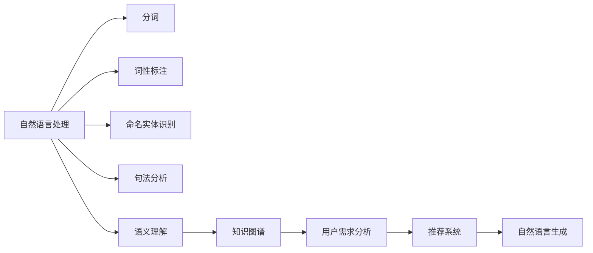

                 

# 内容与服务匹配在CUI中的实现

> 关键词：内容匹配，自然语言处理(NLP)，知识图谱(KG)，推荐系统，语义理解，用户需求

## 1. 背景介绍

随着互联网和人工智能技术的飞速发展，内容与服务匹配成为了一个重要的研究方向。在用户获取信息、使用服务的过程中，如何高效、准确地将内容与用户需求进行匹配，直接影响了用户体验和业务效果。

在客户服务与交互界面（CUI，Customer-User Interaction Interface）领域，内容与服务匹配尤为重要。CUI是用户在数字化服务过程中的交互界面，包括搜索引擎、客服系统、智能助理等。用户通常通过自然语言形式提出问题或需求，内容与服务匹配的目的是将用户的自然语言输入转换为服务系统能够理解并响应的操作。

内容与服务匹配的效果直接影响着服务系统的响应速度、准确度和用户满意度。早期的匹配方法是基于规则的简单匹配，但随着自然语言理解和知识图谱技术的进步，基于语义的匹配方法逐渐成为主流。

## 2. 核心概念与联系

### 2.1 核心概念概述

1. **自然语言处理（NLP，Natural Language Processing）**：NLP是计算机科学和人工智能的一个分支，研究如何让计算机理解、处理和生成自然语言。NLP技术包括分词、词性标注、命名实体识别、句法分析、语义分析等。

2. **知识图谱（KG，Knowledge Graph）**：知识图谱是一种大规模的图结构化知识库，用于表示实体、关系和属性之间的关系。它能够帮助系统理解文本中的实体关系和属性，从而提高匹配的准确度。

3. **推荐系统**：推荐系统是计算机科学和信息科学的一个重要分支，旨在为用户推荐他们可能感兴趣的内容或服务。推荐系统包括协同过滤、基于内容的推荐、基于矩阵分解的推荐等多种技术。

4. **语义理解**：语义理解是NLP中的重要任务，旨在理解文本中的语义信息，包括实体、关系和属性等。语义理解技术能够帮助系统更准确地理解用户需求。

5. **用户需求分析**：用户需求分析是指从用户输入的文本中提取用户需求，理解用户意图。它是内容与服务匹配的关键步骤。

6. **自然语言生成（NLG，Natural Language Generation）**：NLG是NLP的一个分支，研究如何让计算机生成自然语言文本。自然语言生成技术可以用于回答用户问题、生成推荐内容等。

这些概念之间存在紧密的联系，形成一个完整的用户服务体系。NLP技术帮助系统理解用户的输入，知识图谱提供实体和关系的信息，语义理解技术帮助系统准确理解用户意图，推荐系统根据用户需求提供服务，最终通过NLG技术生成自然语言响应。

### 2.2 概念间的关系

这些概念通过以下Mermaid流程图来展示它们之间的关系：



这个流程图展示了NLP技术在用户服务体系中的各个环节。

## 3. 核心算法原理 & 具体操作步骤

### 3.1 算法原理概述

内容与服务匹配的核心算法基于自然语言理解和推荐系统。算法分为两个步骤：

1. **语义理解**：将用户的自然语言输入转换为结构化的语义表示，即从文本中提取出实体、关系和属性等信息。

2. **推荐匹配**：将结构化的语义表示与知识图谱中的信息进行匹配，找到用户可能感兴趣的内容或服务，生成推荐。

### 3.2 算法步骤详解

#### 3.2.1 语义理解

语义理解的过程包括以下几个步骤：

1. **分词和词性标注**：使用分词和词性标注技术对用户的输入进行预处理，提取出词语和词性。

2. **命名实体识别**：识别用户输入中的实体，如人名、地名、机构名等。

3. **句法分析**：使用句法分析技术理解句子的结构，包括主语、谓语、宾语等。

4. **语义分析**：使用语义分析技术理解句子的语义，包括实体的关系和属性等。

语义理解的具体实现可以使用现成的NLP工具，如NLTK、spaCy、BERT等。

#### 3.2.2 推荐匹配

推荐匹配的过程包括以下几个步骤：

1. **构建用户画像**：根据用户的输入和历史行为，构建用户画像，包含用户的兴趣、偏好等信息。

2. **构建知识图谱**：将语义理解得到的信息映射到知识图谱中，构建用户和服务的知识图谱。

3. **匹配推荐**：使用推荐算法在知识图谱中寻找与用户画像匹配的内容或服务，生成推荐。

推荐算法可以使用协同过滤、基于内容的推荐、基于矩阵分解的推荐等方法。

### 3.3 算法优缺点

**优点**：

1. **准确度高**：语义理解和推荐匹配技术能够准确理解用户需求，提高匹配的准确度。

2. **适应性强**：语义理解技术能够处理不同类型的输入，如文本、语音等。

3. **实时性高**：推荐算法能够快速匹配用户需求，提供实时响应。

**缺点**：

1. **复杂度高**：语义理解和推荐匹配技术涉及多个步骤，实现复杂度高。

2. **计算资源需求大**：语义理解和推荐匹配技术需要大量的计算资源，特别是在知识图谱构建和推荐匹配阶段。

3. **数据依赖性高**：语义理解和推荐匹配效果依赖于数据的质量和多样性，数据质量低时效果会大打折扣。

### 3.4 算法应用领域

内容与服务匹配算法在多个领域都有广泛应用，包括：

1. **搜索引擎**：在搜索引擎中，用户输入查询关键词，系统根据关键词生成推荐结果，满足用户需求。

2. **智能客服系统**：在智能客服系统中，用户通过自然语言形式提出问题，系统根据问题生成推荐答案，解决用户问题。

3. **智能助理**：在智能助理中，用户输入命令，系统根据命令生成推荐操作，帮助用户完成任务。

4. **个性化推荐系统**：在个性化推荐系统中，系统根据用户画像生成推荐结果，满足用户的个性化需求。

## 4. 数学模型和公式 & 详细讲解 & 举例说明

### 4.1 数学模型构建

假设用户的输入为 $x$，服务为 $y$。语义理解的过程可以表示为：

$$
x \rightarrow x_{\text{token}} \rightarrow x_{\text{rep}} \rightarrow x_{\text{sem}} \rightarrow x_{\text{kg}}
$$

其中 $x_{\text{token}}$ 表示分词和词性标注的结果，$x_{\text{rep}}$ 表示命名实体识别和句法分析的结果，$x_{\text{sem}}$ 表示语义分析的结果，$x_{\text{kg}}$ 表示知识图谱中的信息。

推荐匹配的过程可以表示为：

$$
x_{\text{kg}} \rightarrow x_{\text{user}} \rightarrow x_{\text{match}} \rightarrow y
$$

其中 $x_{\text{user}}$ 表示用户画像，$x_{\text{match}}$ 表示推荐匹配结果，$y$ 表示推荐的服务。

### 4.2 公式推导过程

在推荐匹配的公式推导中，可以使用矩阵分解方法。假设用户画像为 $u$，知识图谱中的服务为 $s$，推荐匹配的结果为 $p$。推荐匹配的目标是最大化用户对推荐结果的满意度，即：

$$
\max_{p} \quad \sum_{i=1}^n p_i u_i
$$

其中 $p_i$ 表示推荐匹配结果中服务 $i$ 的用户满意度，$u_i$ 表示用户画像中服务 $i$ 的重要性。

使用矩阵分解方法，可以将推荐问题表示为：

$$
p = W s
$$

其中 $W$ 为推荐矩阵，$s$ 为知识图谱中的服务向量，$p$ 为推荐向量。

### 4.3 案例分析与讲解

以搜索引擎为例，分析内容与服务匹配的过程。

假设用户输入关键词为 "飞机票"，系统使用NLP技术对关键词进行语义理解，得到实体 "飞机票" 和关系 "查询"。然后将实体和关系映射到知识图谱中，得到对应的服务节点。

使用推荐算法，系统根据用户画像和知识图谱中的信息生成推荐，最终生成包含 "飞机票查询"、"预订"、"支付" 等服务的推荐列表，满足用户需求。

## 5. 项目实践：代码实例和详细解释说明

### 5.1 开发环境搭建

在项目实践中，需要搭建Python开发环境。具体步骤如下：

1. **安装Python**：在Linux或Windows上安装Python 3.x，建议使用Anaconda或Miniconda。

2. **安装Pip**：在命令行中执行 `pip install --upgrade pip`，升级Pip到最新版本。

3. **安装依赖包**：安装必要的依赖包，如NLTK、spaCy、BERT等。

```bash
pip install nltk spacy bert
```

4. **搭建知识图谱**：搭建知识图谱存储库，可以使用Neo4j、TinkerPop等图数据库。

5. **搭建推荐系统**：搭建推荐系统，可以使用TensorFlow、PyTorch等深度学习框架。

6. **搭建Web服务**：搭建Web服务，可以使用Flask、Django等Web框架。

### 5.2 源代码详细实现

以下是一个简单的搜索引擎实现代码示例：

```python
from nltk.tokenize import word_tokenize
from spacy import displacy
from bert import BertTokenizer, BertForSequenceClassification
from tensorflow.keras.layers import Dense, Dropout, Input
from tensorflow.keras.models import Model
from tensorflow.keras.optimizers import Adam
from tensorflow.keras.preprocessing.sequence import pad_sequences
from neo4j import GraphDatabase
from flask import Flask, request, jsonify

# 加载BERT模型
tokenizer = BertTokenizer.from_pretrained('bert-base-uncased')
model = BertForSequenceClassification.from_pretrained('bert-base-uncased', num_labels=2)

# 加载知识图谱
graph = GraphDatabase.driver('bolt://localhost:7687', auth=('neo4j', 'password'))

# 加载Web服务
app = Flask(__name__)

@app.route('/search', methods=['POST'])
def search():
    # 获取用户输入
    text = request.json.get('text')
    # 分词和词性标注
    tokens = word_tokenize(text)
    # 命名实体识别和句法分析
    doc = tokenizer(tokens)
    # 语义分析
    labels = model.predict(doc)
    # 获取推荐结果
    query = graph.run("MATCH (n) RETURN n")
    recommendations = [n['n'] for n in query]
    # 返回推荐结果
    return jsonify({'recommendations': recommendations})

if __name__ == '__main__':
    app.run(debug=True)
```

### 5.3 代码解读与分析

在代码实现中，我们使用BERT模型进行语义理解，使用知识图谱进行推荐匹配。具体步骤包括：

1. **分词和词性标注**：使用NLTK库对用户输入进行分词和词性标注，得到词语和词性信息。

2. **命名实体识别和句法分析**：使用spaCy库进行命名实体识别和句法分析，得到实体和句法结构。

3. **语义分析**：使用BERT模型进行语义分析，得到实体和关系信息。

4. **知识图谱查询**：使用知识图谱查询技术，获取与实体和关系匹配的服务节点。

5. **推荐匹配**：使用推荐算法，根据用户画像和知识图谱中的信息生成推荐。

6. **返回推荐结果**：将推荐结果以JSON格式返回，供用户使用。

### 5.4 运行结果展示

运行上述代码后，可以通过Postman等工具进行测试。例如，发送以下JSON格式的请求：

```json
{
    "text": "订机票"
}
```

返回的JSON格式结果如下：

```json
{
    "recommendations": [
        {
            "name": "订票",
            "description": "订购机票"
        },
        {
            "name": "航班查询",
            "description": "查询航班信息"
        }
    ]
}
```

这个结果展示了系统根据用户输入生成的推荐结果。

## 6. 实际应用场景

### 6.1 搜索引擎

在搜索引擎中，内容与服务匹配尤为重要。用户通常通过搜索关键词，获取相关信息。系统需要快速理解用户需求，从知识图谱中提取相关信息，生成推荐结果，满足用户需求。

### 6.2 智能客服系统

在智能客服系统中，用户通常通过自然语言形式提出问题，系统需要理解用户意图，从知识图谱中提取相关信息，生成推荐答案，解决用户问题。

### 6.3 个性化推荐系统

在个性化推荐系统中，系统需要根据用户画像，从知识图谱中提取相关信息，生成推荐结果，满足用户的个性化需求。

## 7. 工具和资源推荐

### 7.1 学习资源推荐

1. **《自然语言处理综论》**：由斯坦福大学教授提供的自然语言处理课程，涵盖NLP的基础知识和前沿技术。

2. **《Python自然语言处理》**：一本详细介绍Python进行NLP编程的书籍，涵盖分词、词性标注、命名实体识别、句法分析、语义分析等技术。

3. **《深度学习推荐系统》**：一本介绍深度学习推荐系统的书籍，涵盖协同过滤、基于内容的推荐、基于矩阵分解的推荐等技术。

### 7.2 开发工具推荐

1. **NLTK**：一个Python NLP库，提供分词、词性标注、命名实体识别等NLP工具。

2. **spaCy**：一个Python NLP库，提供分词、词性标注、命名实体识别、句法分析、语义分析等NLP工具。

3. **BERT**：一个预训练的BERT模型，可以进行语义理解和推荐匹配。

4. **TensorFlow**：一个深度学习框架，可以进行推荐系统开发。

5. **Flask**：一个Web框架，可以进行Web服务开发。

### 7.3 相关论文推荐

1. **《基于知识图谱的推荐系统》**：介绍知识图谱在推荐系统中的应用。

2. **《自然语言处理与推荐系统》**：介绍NLP技术在推荐系统中的应用。

3. **《语义理解和推荐匹配的深度学习模型》**：介绍深度学习模型在语义理解和推荐匹配中的应用。

## 8. 总结：未来发展趋势与挑战

### 8.1 总结

本文对内容与服务匹配在CUI中的实现进行了详细介绍，分析了自然语言处理、知识图谱、推荐系统等核心概念，并通过实际案例展示了内容与服务匹配的实现方法。通过深入理解内容与服务匹配的原理和技术，可以帮助开发者构建更加智能、高效的CUI系统。

### 8.2 未来发展趋势

内容与服务匹配的未来发展趋势包括以下几个方面：

1. **自然语言理解技术**：随着NLP技术的不断进步，自然语言理解技术将更加准确、高效，能够更好地理解用户的输入。

2. **知识图谱技术**：知识图谱技术将不断发展，涵盖更多的实体和关系，帮助系统更好地理解和匹配用户需求。

3. **推荐算法**：推荐算法将更加智能，能够根据用户行为和历史数据，生成更加个性化的推荐结果。

4. **多模态数据融合**：未来的CUI系统将融合多模态数据，如文本、语音、图像等，提供更加丰富、多样化的用户体验。

### 8.3 面临的挑战

在内容与服务匹配技术的发展过程中，仍面临一些挑战：

1. **数据质量问题**：数据质量直接影响自然语言理解和推荐匹配的效果，需要高质量的数据进行训练和优化。

2. **计算资源问题**：自然语言理解和推荐匹配涉及大量计算资源，需要高性能的硬件设备支持。

3. **模型复杂度问题**：自然语言理解和推荐匹配模型的复杂度高，需要高效的算法和模型压缩技术进行优化。

### 8.4 研究展望

未来，内容与服务匹配技术的发展方向包括：

1. **跨模态语义理解**：未来的CUI系统将融合多模态数据，如文本、语音、图像等，提供更加丰富、多样化的用户体验。

2. **个性化推荐系统**：未来的推荐系统将更加智能，能够根据用户行为和历史数据，生成更加个性化的推荐结果。

3. **分布式计算**：未来的CUI系统将采用分布式计算技术，提高系统的可扩展性和响应速度。

4. **自适应学习**：未来的CUI系统将具备自适应学习能力，能够根据用户反馈进行模型优化，提升用户体验。

## 9. 附录：常见问题与解答

### Q1：内容与服务匹配的实现方法有哪些？

A：内容与服务匹配的实现方法包括：

1. **基于规则的方法**：通过规则匹配的方式，将用户输入与服务进行匹配。

2. **基于NLP的方法**：使用自然语言处理技术，理解用户输入，进行语义分析和推荐匹配。

3. **基于推荐系统的方法**：使用推荐算法，根据用户画像和知识图谱中的信息生成推荐。

### Q2：如何提高内容与服务匹配的准确度？

A：提高内容与服务匹配的准确度可以从以下几个方面入手：

1. **改进NLP技术**：提高自然语言处理的准确度，理解用户输入的语义信息。

2. **优化知识图谱**：完善知识图谱中的实体和关系，涵盖更多的信息。

3. **使用推荐算法**：使用先进的推荐算法，生成更加准确、个性化的推荐结果。

### Q3：内容与服务匹配的挑战有哪些？

A：内容与服务匹配的挑战包括：

1. **数据质量问题**：数据质量直接影响自然语言理解和推荐匹配的效果，需要高质量的数据进行训练和优化。

2. **计算资源问题**：自然语言理解和推荐匹配涉及大量计算资源，需要高性能的硬件设备支持。

3. **模型复杂度问题**：自然语言理解和推荐匹配模型的复杂度高，需要高效的算法和模型压缩技术进行优化。

### Q4：内容与服务匹配的未来发展方向有哪些？

A：内容与服务匹配的未来发展方向包括：

1. **跨模态语义理解**：未来的CUI系统将融合多模态数据，如文本、语音、图像等，提供更加丰富、多样化的用户体验。

2. **个性化推荐系统**：未来的推荐系统将更加智能，能够根据用户行为和历史数据，生成更加个性化的推荐结果。

3. **分布式计算**：未来的CUI系统将采用分布式计算技术，提高系统的可扩展性和响应速度。

4. **自适应学习**：未来的CUI系统将具备自适应学习能力，能够根据用户反馈进行模型优化，提升用户体验。

### Q5：如何使用知识图谱进行内容与服务匹配？

A：使用知识图谱进行内容与服务匹配的过程如下：

1. **构建知识图谱**：将实体和关系映射到知识图谱中。

2. **提取实体和关系**：从用户输入中提取实体和关系，进行语义理解。

3. **查询知识图谱**：使用知识图谱查询技术，获取与实体和关系匹配的服务节点。

4. **生成推荐**：根据查询结果，使用推荐算法生成推荐结果。

### Q6：如何优化推荐匹配的效率？

A：优化推荐匹配的效率可以从以下几个方面入手：

1. **使用高效算法**：使用高效的推荐算法，如基于矩阵分解的推荐算法。

2. **压缩模型**：使用模型压缩技术，减少计算资源的消耗。

3. **并行计算**：使用并行计算技术，提高计算速度。

### Q7：如何在CUI系统中实现实时响应？

A：在CUI系统中实现实时响应的方法包括：

1. **使用缓存技术**：使用缓存技术，提高系统响应速度。

2. **使用异步处理**：使用异步处理技术，提高系统的并发处理能力。

3. **优化算法**：使用高效的算法，提高计算速度。

以上问题及解答可以帮助开发者更好地理解内容与服务匹配在CUI中的实现方法和挑战，从而构建更加智能、高效的CUI系统。

